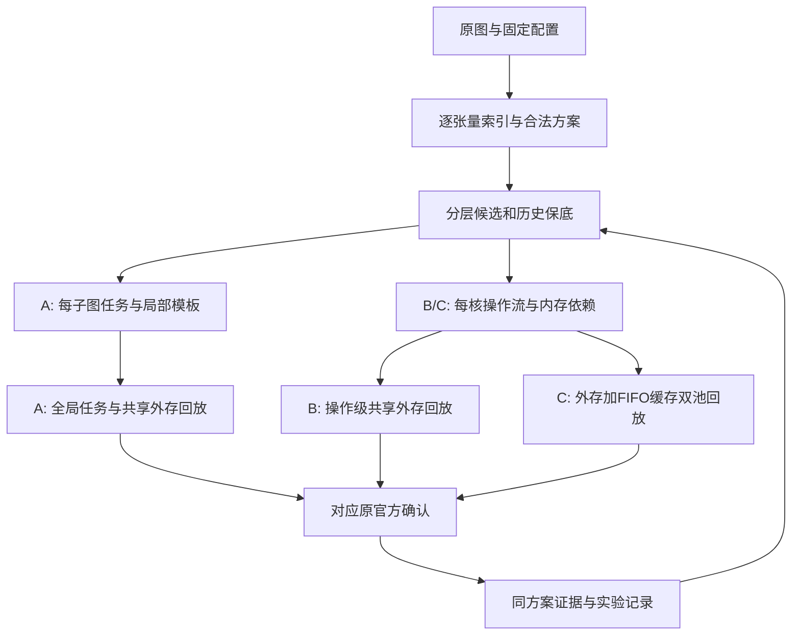

# 主分支最佳流程技术路线

版本：`main-abc-r51`（三问官方档案发布与敏感性实验）

所属分支：`main`

更新时间：2026-09-26 09:07

工作区实验版本：`main-abc-r51`（345回归通过；敏感性1200任务已启动；原A/C改进继续）

适用分支：`main`

本文是仓库当前唯一的主流程说明。其他分支的局部路线和实验记录必须分别放在各自分支文档中；合并到主分支后，以本文和主分支实验记录为准。

本文说明主流程与接口；本地实验计划_问题一.md是唯一执行顺序入口，其发布快照附于本文末尾，实验记录_主分支_main-online-shared-v1.0.md记录事实。历史81官方案例子集不得当全量，所有新全量结论须覆盖100案例。

历史设计依据已融合到本文后续章节和 `技术文档.md`。本轮三问具体算法、参考仓库机制映射、模块边界与提交验收规范以本文下一步计划为准；新增设计不等于已实现。

场景 A 语义提醒：同核不同子图也清空私有缓存，分区固定时迁核/重排不应消除边界复制或局部溢出；改进来自等待、工作分配和共享外存竞争时序。前瞻必须包括链外前驱，不能只沿后继链假定依赖已完成。

## 当前发布入口：三问完整官方档案与后续改进

发布版本：`main-abc-r51`；所属分支：`main`（主分支）；更新时间：2026-09-26 09:00。本节及文末32.63/32.64优先于历史阶段记录。

| 问题 | 2核 | 3核 | 4核 | 5核 | 档案 |
|---|---:|---:|---:|---:|---|
| 一 | 1.856083 | 2.617660 | 3.294808 | 3.858060 | results/p1_best_combined_r39 |
| 二 | 2.283194 | 3.123838 | 3.818909 | 4.439668 | results/p2_best_combined_r45 |
| 三 | 2.287695 | 3.182166 | 3.910992 | 4.548732 | results/p3_best_combined_r45 |

每核100例，含全部19张大图；每问400多核方案＋100单核分母，500项原官方成功，无代理混入。表中是逐例保留历轮官方最优候选形成的档案；不是默认入口一次从零搜索性能。第二、三问同来源三组R45已经完成1300项、400组，五核C算法相对同B在C平均时间下降0.731895%，24胜76平0负。相关源数据位于results/p3_best_three_way_r45。

### 从输入到最终方案的当前完整路径

1. 原图由算子、张量和依赖组成。严格保持原非复制算子及官方硬件契约，输出算子到子图映射和每核子图顺序；复制插入、内存溢出及流水线执行由原官方负责。A子图独立成任务、含100/1000周期等待；B/C每核展开整体任务、跨核搬运同步500周期；C增加独立的只读缓存带宽池，原默认1MiB（兆二进制字节）、250字节/周期。
2. pipeline.py（主求解流程）先做非复制算子块化、拓扑/工作量统计、范式×粒度构造和候选精化去重，再在共享预算中做邻域/元启发式搜索、归档和核序精化。其默认入口只负责自身算法路径，不能自动获得所有历史实验优解。A切分必须权衡并行度、整任务屏障、边界复制和私有缓存溢出；B/C重点是操作就绪、核内存活集合、DDR（外存）竞争及缓存时序。
3. 保存方案后使用run_saved_refine.py（已存方案精化入口）选择独立模块。候选生成与精筛、官方裁决分离，改变结构后重新展开原官方内存补边；固定结构动作仍需重新计算共享带宽。原方案作为保底，所有新方案必须通过合法性及原官方复核后才能进入最好档案。
4. dynamic_service_pool.py（动态带宽池）负责服务进度及共享竞争；a_event_model.py保持A整任务依赖屏障；bc_event_model.py保持B/C逐操作就绪、DDR/缓存独立池和完成时缓存填充。模型不读取候选官方时刻作为预测输入。B/C已在800父方案和64份大图历史候选核验，A400校准已完成400项一致；这些是模型正确性证据，不是新优化收益。
5. 关键搬运模块使用依赖闭包调整就绪顺序；缓存事件窗口区分在途重复读和淘汰后重读，延后或提前相关闭包，再重新计算全局时序。阶段缓存仅缓存纯展开阶段的内容，不缓存会随核序变化的全局完成时间。问题三组合五核独立验证20例13胜7平0负，其余核数继续运行。
6. 临时大小核通过多个合法子图在普通物理核上协作表达，不改变官方硬件、不合并核内缓存；R50新增固定拆分后的尾部迁核/插入探针，A400校准已通过，接下来运行代表面板。组宽、切分与核序的完整分离消融仍未完成。树搜索继续后置，显卡完整批量事件评分仍未实现。
7. official_protocol.py（官方结果协议）保存原图/配置/源码/方案内容摘要、独立尝试、真实结果和凭据。相同内容才允许断点复用；代理与原官方结果分开。aggregate.py（统一汇总）从经过验证的结果清单生成逐例表格和三组对照，不从多个历史报告拼均值。

### 拉取后的复核与实验命令

先在已有兼容环境中从cmd（命令提示符）进入项目。已验收环境为Python（编程语言）3.12.13、PyTorch（张量库）2.6.0+cu124、NumPy（数值库）2.4.6、SciPy（科学计算库）1.17.1、pytest（测试框架）8.3.4。requirements-reproduce.txt记录版本；无需下载外部模型。官方评测仍用CPU（中央处理器），显卡安装本身不改变执行位置。

以下命令核对上传数据的内容摘要，不重跑实验：
```cmd
cd /d J:\数学建模\改进 && J:\conda\envs\nlp\python.exe -X utf8 -c "import sys,json;sys.path.insert(0,'solver');from validated_bundle import verify_files;from pathlib import Path;print(verify_files(Path('.'),json.loads(Path('results/main_release_r51/data_manifest.json').read_text(encoding='utf8'))))"
```
以下命令复跑回归和内含的官方微图/合法性检查；新目录不可与已有测试目录重名：
```cmd
cd /d J:\数学建模\改进 && J:\conda\envs\nlp\python.exe -X utf8 -m pytest tests -q -p no:cacheprovider --basetemp results\test_manual_release_r51_20260926_090008
```
以下三条命令依次重评已上传的三问400份方案，各自包含100单核分母；一个问题完成即可查看对应输出目录summary.json（汇总）。显式选2进程以控制大图内存，12线程机器不等于能同时容纳12个大图任务：
```cmd
cd /d J:\数学建模\改进 && J:\conda\envs\nlp\python.exe -X utf8 solver\evaluate_official.py --cases 1-100 --cores 2,3,4,5 --problems 1 --workers 2 --max-tasks 500 --plans-dir results\p1_best_combined_r39\plans --output-dir results\recheck_A_r51
```
```cmd
cd /d J:\数学建模\改进 && J:\conda\envs\nlp\python.exe -X utf8 solver\evaluate_official.py --cases 1-100 --cores 2,3,4,5 --problems 2 --workers 2 --max-tasks 500 --plans-dir results\p2_best_combined_r45\plans --output-dir results\recheck_B_r51
```
```cmd
cd /d J:\数学建模\改进 && J:\conda\envs\nlp\python.exe -X utf8 solver\evaluate_official.py --cases 1-100 --cores 2,3,4,5 --problems 3 --workers 2 --max-tasks 500 --plans-dir results\p3_best_combined_r45\plans --output-dir results\recheck_C_r51
```
原清单中的完整轨迹路径指向本机历史凭据，上传不包含多GB（吉字节）轨迹；异机不能直接宣称本机凭据验证通过，应执行以上命令生成自己环境中的原官方凭据，随后比较逐例指标。上传的方案、输入和源码均可审查，重评与重新搜索严格区分。


## 0. 历史v1.1工作区与发布版说明（非当前成绩）

当前发布最佳版本为文档头的 `main-online-shared-v1.1.0`。在线共同预算模块已完成问题一 400 组端到端验收；运行时仍通过 `--shared-budget` 显式启用，以便复现者区分旧流程和新流程。当前工作区仍保留固定轮数模式、可信结果协议及独立显卡批特征模块，实际版本和结果按实验记录最新章节追溯。

当前求解流程：原图校验/块化 → 范式×粒度基础构造 → 分层精化 → 原六种子元启发式搜索与帕累托归档 → 原顺序微调与官方复核 → 可选候选扩展 → 可选任务迁核/顺序束搜索 → 可选切分精化 → 可选独立构造旁路 → 启用快速复核时原官方确认/回退 → 可选末端迁移与双交换（八份副本筛选，可复用局部模板；两份原官方确认） → 最终方案与同方案指标落盘。

| 实验入口参数 | 实际作用与边界 | 文件 |
|---|---|---|
| `--event-rerank` | 场景 A 搜索结束后，最多精评 12 个附加候选、官方复核 2 个；完整保留原官方结果 | `terminal_refine.py`、`scene_a_event.py`、`spill_events.py` |
| `--task-order-refine` | 固定切分，搜索迁核及核内插入位置；合并依赖图判环，最多 4,000 次廉价重放、束宽 4、深度 3，官方复核最多 2 个 | `task_order_search.py` |
| `--partition-polish` | 按计算工作量 1/3、1/2、2/3 拆分大任务，按真实复制字节选择合并；最多精评 12 个切分、官方复核 2 个 | `partition_polish.py` |
| `--construct-reservoir` | 必须和候选扩展一起启用；旁路保留最多 48 个已生成候选，不改变原种子；完整原三层之后独立最多 12 次精评、2 次官方复核；胜出后最多再做 2 次顺序复核 | `construct_refine.py`、`terminal_refine.py` |
| `--fast-candidate-eval` | 原候选仍由官方确认，新增精化使用计数式副本，最终新方案再经原官方验证；任何字段不一致回退 | `pipeline.py`、`scene_a_fast.py` |
| `--terminal-swaps` | 在全部旧后处理及原官方守卫之后加入双任务交换；四千重放、八份副本筛选、两份原官方确认；默认关闭 | `pipeline.py`、`task_order_search.py` |
| `--terminal-cache` | 仅为末端八候选精评复用完整局部准备模板；128 条、64MB 有效载荷上限；必须配合末端交换 | `local_template_cache.py`、`scene_a_fast.py` |

末端各层采用严格官方耗时优先，只在耗时相等时比较新增搬运；失败候选记录并拒绝。原主流程的 0.3% 容差规则仍保留，不能把该容差传播到新后处理接受规则。

场景 A 精评先按真实子图成员补齐边界复制，再按访问顺序统计独立一级缓存/统一缓冲池的驻留、释放、逐出、写回和重复换回；预测局部时间并按依赖/核内顺序组合。它不是完整官方时序模拟，特别是共享外存竞争和内存补边仍会产生误差。因此新模块全部依靠官方最终裁决，不能仅按预测值替换结果。

固定切分迁核允许复用子图局部时间与搬运；改变切分必须重新构图并重新统计溢出。这是两类精化成本差异的原因。每层软时间预算仅限制自己的候选生成/精评，不含不可中断的最后一次调用与额外官方复核；必须查看总运行时间，而不是把 2～4 秒软预算当作端到端上限。

每次新实验使用新的日志与方案目录；实验入口保存求解器代码、官方依赖、数据和运行参数指纹。代码改变后禁止直接向旧日志续跑，使用实验代码压缩快照复现旧版。生成方案逐任务保存，日志逐条刷新，进度按已完成任务显示。无文件删除、无模型下载、无神经网络训练，当前主要是处理器图算法与离散事件仿真。

证据分层：同方案字节/耗时误差只验证模型；固定历史候选池验证排序；保存方案后处理验证邻域能力；端到端运行才验证完整求解器。报告同时给出同次搜索前后对照、历史发布版配对、运行成本和退化样本，不能互相替代。尚未完成 400 组验证，不更新发布最佳版本。


## 1. 历史v1.1版本结论（81例子集，非当前全量）

当前主流程版本为 `main-online-shared-v1.1.0`。问题一已完成100个算例、场景A、2/3/4/5核共400个任务；每核81组、合计324组为官方可比结果，19个超大图的76组只保留代理结果，未混入官方统计。400份计划合法性、结果绑定、空续跑和清单不变性均已验收，阶段错误为0。

| 核数 | 官方组数 | 平均加速比 | 相对同轮保底胜/平/负 | 相对 `fixed_v1` 胜/平/负 | 相对 `fixed_v1` 等权耗时变化 | 相对 `fixed_v1` 总耗时变化 |
|---:|---:|---:|---|---|---:|---:|
| 2 | 81 | **1.819217** | 57/24/0 | 71/7/3 | -2.993% | -1.264% |
| 3 | 81 | **2.500555** | 61/20/0 | 79/1/1 | -5.130% | -4.044% |
| 4 | 81 | **3.076045** | 68/13/0 | 76/2/3 | -6.114% | -3.298% |
| 5 | 81 | **3.544594** | 71/10/0 | 77/2/2 | -6.137% | -3.108% |

324组官方总体平均加速比为 **2.735102**。相对同轮旧流程保底为257胜、67平、0负，等权耗时下降2.125%，总耗时下降0.982%；相对历史`fixed_v1`为303胜、12平、9负，等权耗时下降5.093%，总耗时下降2.736%，其中超过5%的退化2组。历史比较包含墙钟预算搜索差异，不能解释为同轨迹纯算法增益。

| 官方验证项目 | 验收标准 | 本轮事实 | 状态 |
|---|---|---|---|
| 方案合法性 | 覆盖完整、每节点一次、商图无环、每核顺序满足依赖、核心编号合法 | 400/400计划通过全图检查 | 通过 |
| 官方真值 | 官方评估器可运行，结果与方案、输入和源码指纹绑定 | 324/324官方成功，阶段错误0 | 通过 |
| 官方/代理口径 | 代理结果不能进入官方平均，官方与大图代理分栏 | 官方324、代理76，统计分离 | 通过 |
| 可恢复性 | 中断后按清单和检查点续跑，空续跑不重算、不改写 | 空续跑通过，方案和清单未改变 | 通过 |
| 资源约束 | RTX3070 8GB无显存溢出，硬件语义不改 | 批特征已分配峰值3.64MB、保留峰值25.17MB | 通过 |
| 性能门槛 | 与同轮保底不退化，并报告历史配对退化 | 同轮257胜/67平/0负；历史9组退化，2组超过5% | 通过并保留退化清单 |

这六项是当前主分支结果的统一验收口径；逐案数据、搬运、溢出、代理误差和成本见主分支实验记录及全量汇总。

## 2. 题目输出和目标函数

每个方案必须输出：

```text
node_to_subgraph：原始算子到子图编号的映射
core_schedules：每个核上的子图执行顺序
```

官方指标以总完成时间 `makespan（总完成时间）` 为第一目标，新增搬运字节为第二指标。代理搜索使用统一的 `Context.fitness`，不能让构造池、邻域搜索和最终选择使用不同的字节权重。

合法性约束包括：

1. 每个原始算子必须且只能覆盖一次；
2. 子图商图必须无环；
3. 同一核的顺序必须满足直接依赖；
4. 核编号必须在 `[0, N-1]`；
5. 方案能被题目官方评估器解析并完成评估；
6. 片上内存、统一缓冲和全局带宽约束不能被代理层忽略。

## 3. 当前工程流程

### 3.1 图和块模型

`solver/model.py` 读取题目图，将原始算子组织成连续块，计算块级 M/C/V 工作量、张量边界、缓存和搬运信号，并提供 A/B/C 场景代理评估。

`solver/solution.py` 定义 `Sol` 和 `Context`。`Sol` 保存块到子图的映射以及子图到核的映射；`Context` 保存算例、场景、核数和统一适应度函数，并将代理结果缓存。

### 3.2 范式 × 粒度 × 场景 × 精化构造池

`solver/construct_refine.py` 是当前构造池入口。

范式：

- `HEFT`：按向上等级和通信代价凝聚块，再做核分配；
- `STRIP`：按拓扑位置切成若干连续条带；
- `CHAIN`：按后继链组织块；
- `NETBENEFIT`：按边界通信收益、M/V 互补和内存预算凝聚，再用最早完成时间装箱。

粒度：

- `coarse`：减少子图和通信，保留较少的边界；
- `balanced`：在并行度、通信和任务数量之间折中；
- `fine`：保留更多并行候选，但必须受到最终子图数和每核任务数上限约束。

场景：

- `A`：同核等待和跨核等待显式存在；
- `B`：跨核拷贝和搬运延迟主导；
- `C`：在 B 的基础上增加 L2 复用和带宽池。

精化层：

- `R0`：基础构造；
- `R1`：枚举子图换核；
- `R2`：沿真实块边界移动；
- `R3`：交换合法的无直接依赖子图/核内顺序候选。

中图和大图会减少完整粒度展开，避免构造候选本身吞掉主搜索预算。所有候选都要经过覆盖、商图无环、子图数量和核编号检查。

### 3.3 多种子搜索

`solver/pipeline.py` 不再只把代理最优的一个候选送入搜索，而是按范式、粒度和结构签名保留最多 6 个种子。每个种子共享同一个时间截止点，依次经过：

```text
构造池
-> 禁忌搜索
-> 模拟退火
-> 蚁群搜索
-> 多目标粒子群
-> Pareto 归档
-> 官方候选复核
```

任何搜索阶段都不能超过任务总预算；超大图按预算兜底，只保留 HEFT 代表方案并单独标记，不能混入官方平均值。

### 3.4 官方评估桥接

`solver/evaluate_official.py` 调用题目附件中的官方评估器。官方评估器是最终真实性来源；代理模型只负责批量筛选和方向性判断。结果文件中的 `real` 字段为空时，必须标记为代理结果，不得写入官方平均指标。

## 4. 参考代码已经吸收的机制

| 参考项目 | 已吸收或准备吸收的机制 | 当前落点 |
|---|---|---|
| DAG Scheduling | 就绪集合、关键路径和事件推进 | `model.py::_simulate`、后续优先级改造 |
| dnn-partitioning | 不可分割块、连续化、边界通信分解 | `solution.py`、`construct_refine.py` 后续保护层 |
| DOPS | HEFT 短窗口前瞻、影子核可用时间、切换惩罚 | `construct.py`/`construct_v2.py` 后续 H=2 |
| MAGIS | `start/end/free` 生命周期、峰值存活集合、状态签名去重 | `model.py`、`pipeline.py` 后续代理校准 |
| Tessel | 固定切分后独立优化核内顺序和空泡 | `order_refine.py` 后续窗口搜索 |
| ONNXim | 双缓冲、拷入/计算/拷出资源状态 | `model.py` 代表图校准阶段 |

参考项目的评估器、硬件参数、语言模型专用缓存逻辑、微批流水结构和周期级 NoC 仿真不能直接移植。

## 5. 当前已知问题

1. 代理 `makespan` 和 `added_copy_bytes` 在大图上仍可能系统性高估，不能直接把代理最优当成官方最优。
2. 少量退化算例表现为通信减少但关键路径变长，当前优先级没有充分表达后继链和核空泡。
3. 当前构造候选元数据还需要完整记录范式、粒度、精化层、子图数和淘汰原因。
4. `run_all.py` 使用稳定散列种子；默认墙钟模式跨次轨迹仍不保证相同，新增 `--search-rounds` 固定每种子轮数/群体代数，在 12 配置上两次独立重复一致。旧限时后处理仍不能与固定模式混用，新末端交换可在固定模式无墙钟搜索。实验清单校验代码、参数、环境和数据。
5. 问题三必须明确使用 C 场景生成的方案；不能把 B 场景方案直接当作独立的 L2 感知搜索结果。

## 6. 下一步主线改进大纲

### 阶段一：生命周期和评分统一

修改 `model.py` 输出每个子图的 `start_time、end_time、free_time`，使用真实消费者完成时间计算存活峰值。统一构造池、局部搜索和最终选择的适应度函数，并记录代理误差。

验收：大图代理搬运不再出现系统性数量级高估；代表集代理排序方向改善；官方方案格式不变。

### 阶段二：DOPS 式 H=2 后继前瞻

对 HEFT 和 NETBENEFIT 的每次核选择估计当前 EFT、后继关键链完成时间、未来跨核字节和切换通信；只保留每个后继的两个最好核选项，控制开销。

验收：`case_049/N5`、`case_063/N4` 等退化样本不再由“少通信”错误主导；代表集运行时间不超过当前两倍。

### 阶段三：固定切分后的顺序优化

固定子图和核分配，只在 `order_refine.py` 中搜索合法核内顺序。小商图用窗口精确搜索，中图用 beam width（束宽）8，大图使用相邻交换回退。

验收：切分和核分配不变，官方 makespan 不恶化，输出关键路径等待和核空泡。

### 阶段四：连续化、不可分割块和轻量双缓冲

R2 后执行连续化修复；从原始图识别不可分割块；用三个代表图校准双缓冲和 DDR 队列代理。只有代理相关性提高才进入全量。

## 7. 分支协作计划

`W`、`Y`、`H` 是三个并行的完整求解器实验分支，不是固定模块分工。三个人的目标相同，都可以修改构造池、代理模型、核分配、顺序搜索、场景链路和实验入口；每个分支只需要说明自己本轮采用的方案、改动范围和实验结果。

每个分支都必须：

1. 从同一个主分支版本建立基线；
2. 独立完成一套可运行的完整流程；
3. 使用相同的代表算例、核数、场景和指标口径；
4. 提交自己的技术路线文档和实验记录文档；
5. 在合并前提供与 `main` 的逐算例对比。

本轮的建议实验方向只是并行尝试，不是责任划分：W 可以继续验证构造池和前瞻，Y 可以验证顺序和生命周期，H 可以验证代理和问题三，但三者都可以根据实验结果调整方向，也可以改动同一文件。最终只按合法性、平均 makespan、退化案例、运行时间和显存占用决定是否合并。

## 8. 从主分支复现实验

```cmd
cd /d J:\数学建模\改进 && python -m pytest tests -q
```

上面命令运行回归测试。固定场景 A 的全量断点实验命令为：

```cmd
cd /d J:\数学建模\改进 && python solver\run_all.py --cases 1-100 --cores 2,3,4,5 --scenes A --workers 4 --log-file results\solve_log_fixed_v1.jsonl --output-dir results\plans_fixed_v1
```

该入口会读取已有日志并跳过已完成任务。正式官方评估必须使用单独的结果目录，并按 `results/official/` 的规则保存，原始大文件不提交 Git。

## 9. 从零理解项目：问题、约束和三问关系

### 9.1 输入和一次求解任务

每个 `case_XXX.json` 是一个通用神经网络处理器计算图，包含算子、张量和依赖关系。原始输入是 Op-Tensor 二部图，搜索器首先得到去除显式搬运节点后的 eligible 算子 DAG，同时保留张量生产者、消费者、大小、位置和是否存在原始输出搬运等信息。

一次求解由 `(case, scene, N)` 唯一确定：`case` 是算例，`scene` 是 A/B/C 场景，`N` 是核数。问题一对应 A，问题二对应 B，问题三对应 C。问题三必须重新以 C 场景生成方案，不能把 B 场景计划直接当作独立的 L2 感知结果。

### 9.2 输出格式

方案 JSON 只有两个核心字段：

```json
{
  "node_to_subgraph": {"原始算子编号字符串": 0},
  "core_schedules": [[0, 2], [1, 3]]
}
```

`node_to_subgraph` 给出每个非 `COPY_IN/COPY_OUT` 算子所属子图；`core_schedules[c]` 给出核 `c` 上的子图顺序。官方评估器会根据这两个字段重新生成 Task、COPY 和执行事件，因此不能输出任意开始时间、伪造等待或跳过官方搬运语义。

### 9.3 固定硬件参数

以下参数来自题目配置，算法不得自行修改：

| 参数 | 值 | 含义 |
|---|---:|---|
| L1 | 524288 字节 | M/Cube 类计算的私有片上容量 |
| UB | 131072 字节 | V/Vector 类计算的私有片上容量 |
| DDR 带宽 | 60 字节/周期 | 全核共享主存搬运带宽 |
| A 跨核等待 | 1000 周期 | 前驱与当前子图不在同一核时的等待 |
| A 同核等待 | 100 周期 | 同一核连续 Task 的切换等待 |
| B 跨核同步 | 500 周期 | 每个跨核依赖的同步/拷贝延迟 |
| C L2 容量 | 1048576 字节 | 问题三只读 FIFO 二级缓存 |
| C L2 带宽 | 250 字节/周期 | L2 独立服务带宽 |

官方结果按词典序比较：首先最小化 `makespan（总完成时间）`；当两个候选的 makespan 相差不超过 0.3% 时，再比较新增搬运字节。代理搜索可以用标量适应度加速，但最终候选必须回到官方指标。

## 10. 完整数据流和代码入口

```text
case_XXX.json
    |
    v
run_all.py 解析算例、场景、核数、时间预算
    |
    v
pipeline.solve_case()
    |
    +--> Model：算子图、块、张量组、场景代价
    +--> construct_refine：R0 基础候选
    |       HEFT / STRIP / CHAIN / NETBENEFIT
    |       coarse / balanced / fine
    +--> R1 换核 -> R2 边界移动 -> R3 结构精化
    +--> Context.evaluate：代理时间、搬运、spill、L2
    +--> 最多 6 个结构多样化种子
    |       禁忌 -> 退火 -> 蚁群 -> 多目标粒子群
    +--> order_refine：固定切图/分核后的顺序精化
    +--> 小图官方真值候选复核
    |
    v
results/plans/*.json + results/solve_log*.jsonl
    |
    v
evaluate_official.py 批量调用题目官方评估器
    |
    v
aggregate.py 汇总加速比、均值、中位数和附录
```

| 文件 | 作用 | 稳定接口 |
|---|---|---|
| `model.py` | 图模型、块、张量组、代理评估 | `evaluate(...) -> (makespan, added, info)` |
| `solution.py` | 解状态、SCC 修复、合法性、适应度 | `Sol`、`Context` |
| `construct.py` | HEFT、STRIP、CHAIN | 返回 `(sg_of_block, core_of_sg)` |
| `construct_v2.py` | NETBENEFIT、EFT 分核 | 返回同上 |
| `construct_refine.py` | 范式/粒度/精化候选池 | `ConstructCandidate` |
| `pipeline.py` | 单任务完整求解 | `solve_case(...)` |
| `run_all.py` | 并行入口、进度、断点 | `(case, scene, N)` 完成键 |
| `evaluate_official.py` | 官方批量评估 | 题目附件评估器调用 |

## 11. 图预处理：从算子到搜索块

### 11.1 算子依赖图

`Model` 识别非搬运的 eligible 算子。对每个张量，把 eligible 生产者连接到 eligible 消费者；显式 `COPY_IN/COPY_OUT` 不作为搜索节点，但其原始搬运信息继续用于新增搬运计算。

### 11.2 路径式块化

`Model._build_blocks()` 按算子拓扑序扫描：

1. 当前算子若能接在高流量前驱块尾部且未超过容量，则追加；
2. 否则尝试加入满足前驱关系的其他未满块；
3. 没有合法块时创建新块；
4. `run_all.block_cap_for()` 将块容量控制在 `[24, 240]`，大约每 400 个 eligible 算子一个块。

块是搜索原子，不是最终任务。块内部算子必须整体覆盖，块间保存 DAG 边和张量边界流量；最终子图还要由粒度和子图数上限控制。

### 11.3 商图环修复

把块按照当前方案合并成子图后，商图可能出现 `A -> B -> A`，因为原始 DAG 的路径可能在子图间交错。`Context.repair()` 使用 Tarjan 强连通分量，把非平凡 SCC 合并，重复直到商图无环。任何新邻域都必须执行：

```text
动作生成 -> compact -> repair(SCC) -> validate -> evaluate
```

### 11.4 张量组聚合

`_build_tensor_groups()` 按生产块集合、消费块集合、输出标志和拓扑位置聚合张量字节。评估器在组级计算边界流量，降低大图成本，同时保持组内总字节守恒。

## 12. 方案表示、动作和合法性

内部解由两个数组组成：

```text
sg_of_block[b] = 子图编号
core_of_sg[s] = 核编号
```

主要动作：`move_block`、`move_sg_core`、`merge_sg`、`split_sg` 和块/子图交换。`Sol.validate()` 检查覆盖、编号、可选子图上限和商图无环；`Context.repair()` 修复 SCC 后再评估。子图编号可以暂时稀疏，但进入官方计划前必须 `compact()`。

## 13. 三个场景的代价模型

### 13.1 场景 A

每个子图对应一个 Task。跨子图张量产生边界搬运；同核连续 Task 仍有 100 周期等待，跨核前驱有 1000 周期等待。子图过多会直接增加 Task 切换、边界和等待，因此 fine 不能只按算子数判断。

### 13.2 场景 B

每核子图合并为一个核 Task。图输入按消费核重复读，图输出按生产核重复写；跨核依赖按源核-目标核对产生拷贝和 500 周期同步，同核数据不产生跨核字节。过度合并会让通信下降但关键路径、核空泡和负载失衡上升。

### 13.3 场景 C

C 继承 B 的核级搬运和等待，再按子图完成时间估计跨核张量的 L2 复用距离。复用工作集不超过 1 MB 时从 L2 服务，剩余流量走 DDR，最后分别计算 `DDR/60` 和 `L2/250` 下界。C 代理是近似值，最终必须由问题三官方评估器验证并记录缓存命中率。

## 14. 代理评估的计算顺序

`Model.evaluate()` 返回 `(est_makespan, est_added_bytes, info)`。

### 14.1 边界搬运

按张量组确定生产/消费子图和生产/消费核，计算 A 的子图级输入输出以及 B/C 的核级输入输出；从总量扣除原图固有搬运，得到新增搬运。

### 14.2 子图持续时间

```text
d(s) = max(M_work(s), V_work(s), input_bytes(s)/60,
           output_bytes(s)/60, critical_path(s))
```

再按子图依赖宽度加入一部分未重叠搬运时间，避免完全重叠假设过于乐观。

### 14.3 spill

对 L1 和 UB 分别计算区间驻留峰值 `p`、内部工作集峰值 `w`，可选加入块生命周期的 LRU 信号 `l`。默认：

```text
spill_bytes = 2 * (max(L1p, L1w) + max(UBp, UBw))
spill_time = spill_bytes / 60
```

仅显式启用 `--spill-calibrated`（溢出校准）时读取 `spill_coefs.json`；二核融合权重为 0，三核以上为 0.25，且只用于下调原启发式。该路线实验未通过，默认关闭。新的逐事件溢出见第 26 节，当前用于末端精评，没有替换高频搜索代理。

### 14.4 事件式调度

`_simulate()` 维护前驱入度、核空闲时间、子图结束时间和就绪堆。只有所有前驱完成的子图才能进入堆；取出后计算同核/跨核等待，写入结束时间并释放后继。`orders_override` 存在时改用 `_simulate_fixed_orders()`，任何不能推进的非法顺序返回无穷大。

### 14.5 全局带宽和 C 下界

```text
makespan >= total_DDR_bytes / 60
DDR_bound = ddr_served / 60
L2_bound  = l2_served / 250
```

场景 C 的代理完成时间取计算调度、DDR 下界和 L2 下界的最大值。`info` 当前包含 `orders、durs、sg_wm、sg_wv、spill_sig、spill_bytes`；后续要增加关键路径和峰值生命周期字段。

## 15. 四类构造器

### HEFT

按块 upward rank 降序处理，对每个核估计最早完成时间、跨核通信和负载，选择当前最优核，再按 `max_sg_ops` 切子图。适合一般图，风险是只看当前节点。

### STRIP

按拓扑序切成连续条带，再用列表调度把条带分核。适合深链，风险是边界可能切在高流量张量上。

### CHAIN

按后继链组织块，用 LPT 平衡链工作量，再按真实块边合并并受 `max_subgraphs` 限制。适合宽图，风险是链过碎造成大量 Task，链过粗损失并行。

### NETBENEFIT

每块初始为簇，按边界通信节省、跨核等待消除、M/V 互补、并行损失和内存预算选择相邻簇合并；合并后做 SCC 修复，再用 EFT、L1/UB 预算和 M/V 互补装箱分核。适合通信密集图，但必须避免单纯通信最优。

## 16. 构造池的实际配置和精化

| 粒度 | 每核目标任务数 | 最小规模 | 最大规模 | 每核条带范围 |
|---|---:|---:|---:|---:|
| coarse | 1.5 | 256 | 2048 | 1～2 |
| balanced | 3.0 | 128 | 1024 | 2～4 |
| fine | 6.0 | 64 | 512 | 4～8 |

`resolve_granularity()` 根据 eligible 算子数和核数计算目标规模，再按上下限裁剪；`target_ops` 是规模参考，不等于最终子图数，`target_strips` 和 `_coarsen_solution()` 才负责最终任务数量。eligible 算子超过 2000 时只保留 balanced 代表，控制构造成本。

精化流程：

```text
R0 基础候选
 -> 去重并保留范式/粒度覆盖
R1 前 8 个：枚举子图换核
R2 前 6 个：沿真实块边移动
R3 前 4 个：合法无依赖换核/顺序候选
 -> 非改善候选回退父方案
 -> 最多 6 个结构多样化种子
```

每个候选应记录 `paradigm、granularity、scene、refine_level、parent_id、signature、target_ops、target_strips、metrics、reason`。下一版必须把这些字段写入日志。

## 17. 搜索阶段和预算

`Context` 统一持有模型、场景、核数、随机数、缓存和适应度。当前默认：

```text
fitness = makespan * fitness_bias
        + traffic_weight * added_copy_bytes / 60
```

`solve_case()` 创建统一 deadline；禁忌、退火、蚁群和多目标粒子群共享预算和 Pareto 归档。增加候选数会减少每个种子的搜索时间，因此候选池不是越大越好。所有搜索器必须调用 `Context` 的统一合法评估，不能各自复制场景公式。

## 18. 官方复核和最终选择

搜索结果、Pareto 标量最优、构造池前几名和顺序精化结果共同形成候选集。当前官方复核阈值：不超过 6000 个算子时由搜索最优、归档最优和最多 6 个构造种子组成，去重前上限 8 个；6000～12000 个时截取最多 3 个，超过 12000 个只保留代理兜底并令 `real=None`。

官方裁决：makespan 至少改善 0.3% 才直接胜出；在 0.3% 内比较新增搬运；非法或评估失败候选淘汰。结果必须记录 `makespan、added_copy_bytes、scheduled_copy_bytes、partition_added、spill_added`，C 还记录 `cache_hit_rate`。

## 19. 批量、进度和断点

`run_all.py` 将任务展开为 `(case, scene, N)`，使用进程池并行；每完成一条就追加 JSONL。重启时读取已有日志并跳过同一三元组，因此支持中断续跑。推荐顺序是：测试 -> 单例冒烟 -> 12 个代表集 -> 100 算例全量 -> 官方批量评估。代理和官方使用独立输出目录。

## 20. 总体实施大纲及当前进度

下列是项目总体研究方向，不代表所有阶段已实施。当前实际结果：逐事件精评已完成，但只用于末端；固定切分顺序与切分精化已接入实验入口；后继前瞻、完整双缓冲尚未实施。第 26～32 节为本轮具体实现及验收规则，优先于下列早期参数建议。

### 阶段一：生命周期和评分统一

修改 `model.py`、`construct_refine.py`、`pipeline.py`：保存每个子图 `start/end`，由所有消费者的最大完成时间得到 `free`；在事件点计算 `peak_live_bytes`；把 spill 与边界搬运分开；构造池、局部搜索和最终选择全部调用同一适应度；日志记录代理误差和候选签名。先用 `case_016、028、049、063、072、079` 校准，避免直接跑全量。

### 阶段二：DOPS 式 H=2 后继前瞻

修改 `construct.py`、`construct_v2.py` 或新增 `lookahead.py`。每个就绪子图和候选核计算：

```text
当前 EFT
+ 后继关键链预计完成时间
+ 未来跨核字节 / 60
+ 未来峰值存活惩罚
+ 核切换通信惩罚
```

每个后继保留两个最好核，先只给 HEFT 和 NETBENEFIT 开启，STRIP/CHAIN 做对照。

### 阶段三：固定切分后的顺序搜索

修改 `order_refine.py`，固定子图映射和核映射，只搜索每核拓扑可行序列。小商图搜索长度 3～6 的窗口，中图 beam width（束宽）8，大图保留相邻交换回退。目标同时包含 makespan、核空泡和峰值溢出，且不修改切分。

### 阶段四：连续化、不可分割块和轻量双缓冲

R2 后检查拓扑连续性和不可分割块；在 `model.py` 增加 `compute_free、copy_in_free、copy_out_free、buffer_slot` 轻量状态。用小/中/大三个代表图校准，只有代理排序相关性提高才进入全量。

每个阶段都必须通过：代表集官方 makespan 不劣于 `main-fix-v1.0.0`、退化样本不增加、运行时间不超过两倍、RTX 3070 8GB 不溢出，之后才能进入下一阶段。

## 21. 新贡献者的实施顺序

1. 阅读本文第 9～14 节，确认官方语义、数据结构和代理公式；
2. 阅读 `solution.py`，只通过 `Sol`/`Context` 改方案，不能绕过 `repair/validate`；
3. 修改构造时先在 `construct_refine.py` 接入候选元数据和合法性，再接入 `pipeline.py`；
4. 修改代价模型时只改 `Model.evaluate()` 及辅助函数，并用官方评估器校准；
5. 修改顺序时固定 `sg_of_block/core_of_sg`，只通过 `orders_override` 评估；
6. 修改问题三时确保搜索场景、官方评估器和统计字段全部使用 C；
7. 先做代表集消融，确认合法性、平均 makespan、退化数、运行时间和显存，再跑 400 任务。

当前 `fix_v1` 是经过全量验证的最佳工程基线，已经修复上一版构造池任务数爆炸和单种子搜索问题，但还不是最终最优算法。后续任何改进都以 `main-fix-v1.0.0` 为基线，并同时提交技术路线和实验记录。

## 22. 2026-09-24 18:30 阶段审计结论

本阶段只对 `case_044`、`case_067` 的 2/3/4/5 核场景 A 进行了 8 组仪表化复核，没有启动 400 组全量实验。本阶段结果暂不通过，原因是分区搬运口径已经对齐，但 spill 代理仍明显低估：`case_044` 的代理 spill 为 516,198 字节、官方为 2,323,456 字节；`case_067` 的代理 spill 为 47.9--72.0MB、官方为 183.9--193.7MB。

当前日志同时保存 `proxy_partition_raw_bytes`、扣除原始 COPY 后的 `proxy_partition_added_bytes`、`proxy_spill_added_bytes`、`proxy_total_added_bytes`、`proxy_memory_overage` 和块级估计需求峰值 `proxy_peak_memory_bytes`。其中 `proxy_memory_overage` 是超限信号，不是峰值驻留，不能直接与官方峰值内存比较。

在完成按图规模和驻留压力的 spill 分段校准、并证明候选排序没有被放大误差破坏前，不把本阶段写成性能通过，也不进入 400 组全量实验。

## 23. 2026-09-24 18:50：分段校准候选结果

历史结果已作废：这一轮混入了缺少对应 C 方案的问题三标签，不能用于比较校准精度。

按图规模、L1 压力、核数和场景分段的候选校准已经完成，训练/留出按算例切分，`case_044` 和 `case_067` 强制留出。候选文件为 `results/spill_coefs_segmented_v1.json`，没有覆盖当前 active 系数。

该候选暂不接入求解器：留出集排序相关为 0.611，`case_044` 预测 spill 为 4.5--7.1MB（官方 2.28--4.44MB），`case_067` 预测为 61.7--112.4MB（官方 142.9--264.4MB），仍然存在明显低估和过估混合。下一步改查 op 生命周期和 LRU 逐出事件，停止继续堆叠线性 spill 系数。

## 24. 2026-09-24 18:59：官方场景映射审计

校准脚本已修正官方文件映射：`problem_1=A`、`problem_2=B`、`problem_3=C`。当前 `results/plans` 没有 C 方案，因此 1300 个官方文件中有效样本为 900（A=500、B=400、C=0），缺少对应方案的 400 个 C 样本全部剔除并写入有效性统计，不能把 B 方案用于 C 真值拟合。

修正映射后的分段候选留出排序相关为 0.581，`case_044` 仍有过估、`case_067` 仍有低估，暂不接入 pipeline。问题三的校准必须先生成并验证合法 C 方案，再单独加入 C 训练/留出集。

## 25. 2026-09-24 19:22：最终方案与日志一致性修复

发现官方复核换解后只更新了方案和官方结果，仍返回搜索最优解的代理指标。现已让代理耗时、搬运分解和峰值信号跟随最终选中的同一方案；顺序精化也按精化后的顺序重新评估。日志新增候选方案摘要、逐候选官方/代理对照、最终选择摘要，并单独保留搜索最优值。小图回归反例已复现并修复“选中耗时 20 的方案却返回另一方案耗时 10”的错误。

此前日志的官方值仍可比较，但旧日志代理与官方不一定属于同一方案，不能直接据此计算代理误差；需要重放保存的方案。峰值字段目前为块级生命周期的估计需求峰值，不是官方物理执行峰值。之前将它称为“真实峰值”不准确。

当前校准只允许在 A/B 实验路径启用；C 不使用缺乏覆盖证据的校准。请求开关与实际生效状态分开记录，2 核融合系数为零也不会被记成校准已生效。

现有区间式生命周期候选在 48 个代表任务上失败：对稳定种子基线的等权相对耗时平均增加 3.81%，21 组退化，13 组退化超过 5%；相对发布基线等权增加 2.40%。默认开关维持关闭。旧函数只按包围区间取张量、没有释放和重复换回语义，不能因修复步号单位就宣称算法有效。

下一步采用逐事件计数：每个真实子图独立建局部图和边界搬运，沿官方核内访问顺序依次分配、检查容量、执行、释放；逐出下一次使用最晚且当前未使用的张量，每个逻辑张量最多一次写回，后续逐次计入换回。先以固定方案核对字节，再单独验证排序和官方耗时；字节准确不等于总完成时间准确。

### 场景 A 精评模块实施计划

使用实施计划技能组织本轮，沿现有任务执行；不增加第三份项目成果文档。

1. `solver/spill_events.py` 的逐事件计数已经在 48 个已保存方案上通过逐子图官方核验，平均绝对字节误差为零。该结果仅覆盖同一局部图和同一访问顺序。
2. 新增 `solver/scene_a_event.py`：一次索引原图的生产者、消费者与直接边；按方案真实成员生成各子图的局部算子、张量及边界搬运。原外存张量进入局部图时映射到统一缓冲池，不能错误映射到一级缓存。边界编号按官方顺序生成，保证核内访问顺序的平局规则一致。
3. `tests/test_scene_a_event.py` 对局部图与官方构造做精确对照，覆盖跨子图读写和外存张量映射。任意构图不一致先解决语义，不能调系数补偿。
4. 局部图沿核内访问顺序计算各管道最早完成时间，算子开始时间为管道可用时间和全部前驱完成时间的最大值。子图估计耗时为核内时间加该子图溢出读写字节除以带宽；该加法是假设，必须用固定方案验证，不能当作官方真值。
5. 多核层按依赖和给定核内顺序计算任务开始、结束时刻，同核切换和跨核等待沿用官方配置。最终估计取任务结束最大值与全部实际搬运字节除以共享带宽的最大值；原始搬运不重复叠加。
6. 固定 48 个基线方案只读对照官方总完成时间与搬运，保留原代理指标，新增精评指标。若误差改善，再评估不同候选之间的排序；尚未接入搜索时不声称求解性能通过。

复查入口：`cd /d J:\数学建模\改进 && python -m pytest tests -q`。数据与代码指纹一致才可断点续跑，代码改变时使用新的结果文件。

## 26. 末端候选扩展实验实施方案（本地未发布）

候选排序审计共 48 组、145 个不同方案、192 对有效比较。新精评成对正确率为 87.50%，旧代理为 68.75%；但选中方案相对池内最优的平均耗时差距从 0.680% 增至 1.077%。第 44 号算例两个大子图同时运行时，局部时间叠加全局流量下界没有描述带宽竞争，因此禁止直接用新精评替换原候选与官方复核。

本轮实施以下受控扩展，全部由同一次搜索产生候选，不读取历史最佳解作为输出。

1. 新增 `solver/terminal_refine.py`，接收构造池和归档中的候选记录（实际方案、旧代理值、旧代理分解、来源），按切分、核分配与核内顺序完整去重。排除原流程已经官方复核的方案。
2. 原候选生成、顺序精修、官方复核及 0.3% 容差择优先完整执行，保存扩展前结果与方案摘要。新增精评仅在搜索结束后执行，不挤占本次原搜索预算。
3. 原流程外的候选按照旧代理耗时和新增搬运分别排序后交替取样，最多精评 12 个，软时间预算 3 秒（单次调用不能中断，可能超过上限）。新精评按预测耗时、搬运、方案摘要排序，推荐最多 2 个额外官方复核。
4. 扩展候选采用严格官方耗时优先，仅耗时相等时比较新增搬运。不能因为 0.3% 容差允许扩展候选降低性能。错误方案记录原因并跳过；无有效原结果时可以由合法扩展候选兜底。
5. `pipeline.py` 新增默认关闭的 `event_rerank` 参数；`run_all.py` 新增 `--event-rerank` 实验入口。只有场景 A 且不超过官方规模限制时生效。记录额外精评/官方次数、耗时、错误、全部精评指标、扩展前后官方结果。
6. 先编写回归反例：相同切分不同分核不能误去重、官方更优扩展候选被采用、预测很优但官方更慢的候选被拒绝且代理日志保持原方案。再完成实现并运行测试。
7. 先跑代表集 48 组，用同次搜索扩展前后结果衡量纯扩展收益，再与稳定种子旧实验及发布基线分别配对。代表集不通过则不进入 400 组。即使同次搜索没有退化，也不能宣称整个算法优于发布基线。

当前模块是离散调度、图遍历和事件仿真，没有张量训练，实际使用处理器执行；不宣称已使用显卡加速。

## 27. 固定切分的关键路径迁核与顺序搜索（下一轮设计）

依据：末端候选扩展 48 组同次搜索改善 15 组、无退化，但第 67 号算例 5 核对发布版本仍慢 5.27%。当前切分 50 个子图、111 条依赖，五核估计负载从 1,135 万到 1,405 万周期。只对旧候选排序无法产生所缺的分核与顺序。

新增 `solver/task_order_search.py`，仅处理子图层面的固定切分优化：

1. 用新精评构造一次局部图，取各子图时长、固定搬运量、任务依赖。整个顺序搜索期间节点所属子图不变，因此每个子图内部溢出与边界字节不变；共享带宽竞争随顺序变化，仍需最终官方复核。
2. 重放器把任务依赖边和每核相邻任务顺序边合并，用拓扑排序计算最早开始与结束。依赖跨核边增加 1,000 周期，同核相邻任务边增加 100 周期；同一对节点的多条约束取最大值。覆盖重复、缺任务、非有限耗时及合并图有环均拒绝。
3. 从决定最晚完成时刻的前驱链提取关键路径任务，优先选其中最多 12 个任务。邻域为：把任务从原核移走，插入任一核的任一位置（包括原核不同位置）。这同时覆盖迁核、相邻交换和较长距离重排，必须逐个进行合并图合法性检查。
4. 束搜索宽度 4、最多 3 层、最多 4,000 次廉价重放，另设 2 秒软时间限制。按估计总完成时间、任务结束最大值、稳定方案签名排序；去重后保留父方案和本层前 4 个方案，避免单路径贪心。相同估计值可保留结构不同的方案，但搜索总量固定受限。
5. 返回最多 2 个与输入不同的完整核内顺序，原始切分映射逐项复制。对推荐方案用官方评估严格择优；原方案始终保留。记录重放次数、合法/非法数量、深度、耗时和全部官方候选结果。
6. 先运行小图反例：迁核使 17/5 的两核负载降到 11/11；原图无环但核内顺序新增环时必须拒绝；节点覆盖和输入方案不得被破坏。
7. 先从冻结保存的 48 个方案做离线配对实验，原方案重新官方复核，避免墙钟搜索带来的差异。若有效，再以独立集验证并考虑接入求解器。该离线实验是已有方案后处理能力验证，不直接等同端到端求解器收益。

当前固定顺序模块注释中“仅直接依赖即可判断交换合法”并不严谨；其代理重放会用死锁检查拒绝部分非法顺序。本轮新模块显式检查完整合并图，不依靠该注释推断合法性。


## 28. 针对切分瓶颈的拆分与合并精化（下一轮设计）

第 70、90 号算例已经用于诊断，不再作为本模块的独立验证集。新模块冻结后另选未参与本轮设计的算例验证。不能根据这两个算例调常数后继续称它们为留出结果。

实施文件：`solver/partition_polish.py`；先用独立审计入口重放保存方案，不直接改搜索内环或默认参数。

1. **可变粒度拆分**：选择实际局部精评耗时最大的三个、含至少两个块的子图；按块拓扑序及块计算工作量，分别在累计工作量接近 1/3、1/2、2/3 的位置切分。每个块完整归属一个子图。新半段先放到估计负载最轻核心，再交给有界任务迁核/顺序搜索优化。
2. **边界合并**：候选来自真实子图依赖边。合并收益用张量字节计算，不使用 `model.block_edges` 的边条数作为字节。对每个张量，用生产者/消费者子图集合重新判断合并前后的边界读、边界写，累计可消除的实际复制字节；取收益最大的六对。
3. 所有合并和拆分都先做块覆盖、核心范围和子图商图无环检查。即使两个子图间有直接边，若同时有绕行路径，收缩仍可能制造环，必须拒绝。
4. 合并/拆分交替取候选，最多精评十二种新切分，额外软预算 4 秒。每种新切分只建一次局部图，重新计算真正的边界搬运与逐事件溢出，不把“减少溢出”单独当成目标。
5. 每种切分复用该次得到的子图耗时，最多 400 次廉价任务重放、两层搜索、0.06 秒软预算微调分核与顺序；不在每次移动时重建局部算子图。该微调预算与此前完整顺序精修不同，避免嵌套搜索失控。
6. 每种不同切分只保留一个推荐顺序，按预测总完成时间、总新增搬运量排序，最多两个方案进入官方评估。输入方案始终保留，只有官方耗时严格更低才接受。记录切分来源、粒度、预测值、边界/溢出分解、官方值、运行时间与拒绝原因。
7. 先验证拆分覆盖、加权切点、合并绕行环反例，再检查第 70/90 号算例四种核数的固定输入后处理结果。失败时保留证据，不能修改官方语义或读取发布方案当候选。
8. 本模块只是下一层精化。代表集、独立集和真实端到端收益均需分别记录；没有通过验证前不接入默认主流程，也不启动 400 组。

本轮切分精化的新验证算例预先固定为：5、12、24、35、45、55、65、75、83、95，各四种核数，共 40 组。仅按图规模确认均未超过官方评估上限，未按这些算例的实验收益筛选。


## 29. 分层候选保留修正：旁路候选池（早期设计，预算共享已被替代）

本节描述前三版的共享末端预算尝试，实验未通过；当前实际实现为第 30 节第四版的独立旁路，不能照本节共享预算方式接回主路径。

诊断证据：第 90 号算例 4 核，原始链式均衡粒度构造官方耗时 556,399 周期，优于当前最终方案 567,213；加入固定切分顺序搜索后为 545,399。原构造池最终 6 个种子却只保留链式粗粒度的多个精化变体，没有保留该均衡粒度候选。不能简单增加元启发式运行时间解决这种提前丢解。

实施时保留原六个种子的选择、顺序和搜索预算，避免同时改变主搜索。仅在启用新的末端候选扩展开关时，通过 `Context`（搜索上下文）的旁路列表保存已生成的合法构造候选。列表上限 48，不额外重新构造，不额外调用旧代理评分；按切分和核映射签名精确去重，保存克隆以免后续操作污染。

保留顺序固定为：先覆盖四类范式的基础粒度变体，再加入逐层精化产生的代表，空位补充已有合法候选。末端把这份列表加入挑战者来源；原官方候选仍保留，新增官方次数仍最多两个，精评次数与软预算保持不变。记录列表容量、来源范式/粒度/精化层及实际接受的来源，避免把候选池变大当作效果证明。

关键测试：最终只取少量种子时旁路仍保留被裁掉的不同粒度；相同签名只存一次；调用者继续修改种子不得改变旁路快照；未启用时不创建或使用旁路。先重放第 90 号算例，再固定代表集与新的验证集检查效果及运行成本。


## 30. 旁路不覆盖已验证路径的改法（第四版已实施，成本未通过）

旁路第三版的诊断已发现两种退化源：固定精评预算挤掉了有效归档候选；当下官方更好的构造可能使后续局部精化落入更差的路径。例如第 44 号算例 2 核，旁路中间方案 117,557 比旧中间方案 119,920 更好，但旧方案精化后可到 113,959，旁路方案却不改善。

下一版改为“两条有明确预算的末端路径”，而不是继续调整范式权重：

1. 原三层候选扩展、迁核顺序搜索、切分精化完整执行，作为本次搜索的保底结果。此路径使用原有归档/构造来源及原精评名额，不与旁路竞争。
2. 已生成的旁路候选只在保底结果完成后使用，排除已经官方复核的完整方案。沿用范式粒度轮转，最多 12 次精评、3 秒软预算、2 次官方复核。优先新切分，记录来源。
3. 若旁路中有官方优于保底的方案，才对旁路最好方案做一次固定切分迁核顺序搜索，额外官方最多 2 次；暂不再嵌套切分精化，限制成本。
4. 全程保留原三层最终方案，只接受最终官方耗时更低的挑战者。最终日志记录保底方案摘要、旁路的原始/精化结果、各层总耗时和实际官方次数。原三层本次结果是对照，历史三层日志另行比较。
5. 这保证同次运行中旁路不会替换成更慢的方案，但不能保证不同墙钟搜索运行对历史结果完全无退化。增加的成本必须单列，若总用时超过预先约定上限，则该实验不作为默认候选。
6. 先用“中间更优但后处理更差”的回归反例检查路径保留，再跑第 23/44/70/90 号诊断组合，随后代表集和验证集。没有证据前不改默认主流程。


## 31. 官方语义事件模拟的计数式加速副本（88 个固定方案完整核验通过）

耗时证据：`results/profile_case067_official_v1.txt`。对第 67 号算例 5 核当前保存方案作函数剖析，约 6,054 万次函数调用、剖析总耗时 14.12 秒；退休事件函数累计 10.60 秒，包含 3,403 万次任务/算子键构造及 1,741 万次完成状态遍历。剖析器会增加运行开销，这些秒数不能当成普通运行基准，但足以定位全扫描热点。

实施 `solver/scene_a_fast.py`，生成单独函数命名空间中的实验副本，官方附件文件保持逐字节不变。仅允许三处受源码哈希约束的变换：初始化每个任务未完成算子数；每次真实算子退休后减一；任务完成判定由全算子扫描改为计数等于零。原有任务遍历顺序保持，外存事件更新、发射、浮点舍入、任务切换和日志生成全都沿用原逻辑。

复制函数不得反向修改官方模块的全局命名空间。若原源码哈希或指定替换位置数量不符合预期，立即拒绝生成，防止官方更新后悄悄使用不再适用的变换。所有容量、带宽、等待周期参数按原函数传入。

测试覆盖并行退休、跨核依赖、单任务和空核；先比较完整返回对象，不只比较最终耗时。扩大到代表集与独立保存方案时，同一方案分别运行原函数与副本，比较所有时间线、内存、搬运、外存竞争日志、任务和算子顺序。保存原/副本耗时与 SHA256（安全散列摘要）。速度评估单进程顺序执行，避免并行负载干扰。

只有上述固定输入完全一致后，才考虑作为候选精评加速器；仍将最终方案交原官方函数重新验证。一旦最终真值不同，记录差异并保留原路径，不能把副本预测结果直接当成新的官方分数。该优化针对调度模拟的数据结构，不是训练任务，不需要显卡。


## 32. 三层精化的快速候选复核接入设计

本轮先降低已证实有效的三层精化成本，不扩大旁路预算。新增默认关闭参数 `--fast-candidate-eval`（快速候选复核）。仅场景 A 且有官方保底结果时启用。

1. 原构造、元启发式搜索、原官方候选选择都保持原评估入口，保存独立的保底方案、原官方指标、代理指标和方案摘要。超大图仍只作代理结果。
2. 新增的候选扩展、固定切分顺序、切分精化，以及可选旁路路径，通过统一回调使用计数式副本；候选日志明确标记评估来源，不能把副本结果冒称为已原官方复核。参数、缓存容量和带宽与原官方一致。
3. 全部精化结束后，如果最终方案与保底不同，强制调用一次原官方，比较耗时及全部已有搬运分解字段，要求完全相等。验证通过才接受；任何不一致、原官方报错或结果缺失，都恢复保底方案及其全部代理/官方指标。阶段中的中间指标保留来源标记，最终验证结果单独记录。
4. 若最终没有改变方案，则直接使用已有原官方保底结果，无须重复评估。副本加载指纹失败或候选报错时拒绝该候选，日志保留原因。
5. 回归测试覆盖成功接受、副本虚假改善、搬运不一致、最终官方失败，以及默认关闭时调用链不变。测试完成后冻结代码快照，使用新的日志目录运行代表集 48 组；再检查同次搜索收益、相对发布版效果和每任务实际成本。
6. 本开关也纳入运行指纹。中断后重跑相同命令续跑；修改求解代码后必须使用新版本日志，不能拼接不同版本结果。


## 33. 净收益构造器基础修正：先修索引和陈旧合并候选

等待第 21.2 节冻结版本实验时，只读审查发现两个可复现问题，证据在 `results/construct_indices_diagnostic_v1.json`：

- 合并后存活簇编号为 `[0, 2]`，分核计算却读取 `cl_members[0]` 和已被合并的 `cl_members[1]`，实际工作量 `[100, 10000]` 被当成 `[100, 50]`。矩阵/向量工作量及优先级都受到影响。
- 星形依赖的三个算子设置 `max_sg_ops=2`，堆内先前计算的两条合并边接连弹出，第二条不检查合并后的新簇大小，最终得到三个算子的簇。

已完成的实现范围：仅增加默认关闭的 `corrected`（修正模式）参数，作为离线构造实验入口；不立即替换当前候选池或已冻结的快速三层版本。矩阵/向量/总工作量统一使用存活簇实际编号查询，要求成员工作量守恒。每次弹出合并边重新计算当前收益；若超过当前算子数上限或收益不再为正则拒绝；若收益变化则按新收益重新入堆，不能直接按旧优先级合并。

现有强连通分量修复可能额外放大子图，不能把上述局部合并检查误称为全局最终粒度硬上限。本轮会单独记录最终子图大小及修复后超限。修正合并时机也可能改变性能，所以只保证上述两条算法不变量，不宣称必然提高官方分数。

先用工作量守恒、星形依赖旧堆反例测试；再对同一批图、同一粒度的原版/修正版构造做配对离线官方评估，保持原始方案。若新构造有互补收益，再决定作为独立挑战候选或替代某个范式；不得在未验证时改变原六种子及搜索预算。后继两步前瞻留到这些基础量正确之后实施。


## 34. 用户接管后的下一步决策方案

本节保留历史设计依据；当前顺序由本文的下一步主线维护。资源表及临时核心协作组已并入整体路线，按前置条件分阶段验证。

状态：当前无运行中的实验，暂停新增算法修改与实验，等待用户选择下一步。本轮代码未提交、未推送。快速三层 48 组代表集和另 40 组验证已结束；存在第 65 号四核 6.214% 退化，因此尚未通过全面替代发布版的质量门槛。净收益构造器的可选修正已实现，51 项测试通过，但未做性能实验；下面的交换与前瞻尚未实现。

### 第一优先：补双任务交换，解决已定位的单任务邻域停滞

第 65 号四核的新方案包含 12 个独立子图，没有跨子图依赖。现有固定切分搜索只枚举一个任务迁移/插入，搜索 78 个合法状态、三层后，没有预测改善候选。九个拆分候选也没有产生值得官方复核的改进。发布方案 14,967 周期，新方案 15,897 周期；两者均已重新原官方评估确认。

诊断枚举跨核双任务原位置交换，得到 8 个精评改善候选。预测排名第一的交换经原官方为 15,033 周期，原方案下降 5.44%，相对发布版差距缩小到 0.441%。新增搬运仍为 55,296 字节，未增加。证据：`results/diagnostic_case065_N4_comparison_v1.json`、`results/diagnostic_case065_N4_swaps_v1.json`。这是固定保存方案上的诊断收益，尚不是新求解器端到端结果。

待实施算法：

1. 沿用固定切分的子图局部时长和任务依赖图。交换只改变两个任务的核心与原位置，保持切分、覆盖和任务总数不变。
2. 从重放关键路径选最多 12 个源任务，与其他核心上的任务组成交换对；对称对只评一次。同核顺序改变继续由原插入邻域处理。
3. 每次同时替换两核对应位置，再合并数据依赖与核内顺序做全图判环。不能先执行一半交换，也不能只检查两个任务的直接依赖。
4. 交换与迁移共享总重放次数上限 4,000、束宽 4、深度 3、两秒软预算，最多推荐两个官方复核候选。记录交换/迁移次数、无效环数量、预测值和官方收益。
5. 先在已保存的快速三层最终方案上做离线精化；保留完整三层方案，只有官方耗时严格降低才换解。若后续接入端到端，则放在完整三层之后，避免提前改变切分精化的既有路径。
6. 先写“单迁移都变差，但两个任务互换能改善”的反例，以及交换造成依赖环、覆盖不变、输入不被修改和总预算约束测试；再跑代表集 48 组保存方案和另一组 40 组保存方案。
7. 判断标准：同输入不得官方退化，额外调用受限，真实总成本重新核验；第 65 号四核只是诊断例，不能据此筛选其他报告样本。不得直接把历史最佳方案加入搜索候选。

### 第二优先：净收益构造修正的配对实验

使用第 33 节已经实现的默认关闭参数，固定图、核心数、粒度、内存参数，分别生成原版与修正版。先比较工作量守恒和最终子图大小，再对相同后续处理的完整方案做官方配对，记录胜负、通信、子图数、耗时。修正导致结构不同并不保证性能更好，暂不替换原六种子。若有互补收益，优先作为受预算约束的独立候选；若普遍退化，需要显式保留有价值的粗粒度构造机制，而不是依赖旧索引错误。

### 第三优先：两步后继前瞻分核

在基础工作量、粒度与邻域验证后实施。对当前就绪任务的每个候选核心复制临时核可用时间，试放当前任务，再沿关键后继前看两步。每步保留两个预计完成时间最好的核心，计算依赖释放、同核/跨核等待及已有模型中的局部时长；按前瞻完成时间、当前完成时间、稳定核心编号排序。只提交当前任务，未来选择不写回真实状态。先作为独立构造候选，保持现有种子与保底路线，官方评价后再决定接入。第一版不引入未经校准的多项惩罚权重，不直接移植参考项目的硬件参数。

### 后续成本与全量验收

按实际构图、局部精评、候选复核耗时决定是否复用固定切分局部数据。不要为所有精化统一加时。代表集、扩大验证、单任务成本与原官方确认均通过后，再冻结候选版本跑 400 组；81 组官方可比与19组代理每核分别统计，并报告各核平均加速比、逐案胜负、退化和求解成本。


## 35. 当前本地可信协议、算法迭代与实际接入边界

本节描述 2026-09-25 的实际工作区，覆盖前面按时间排列的旧计划状态；发布默认仍为头部修复版。远端没有本轮改动，不得把本地实验版本称作已推送最佳版。

### 35.1 运行与结果协议

`run_all.py` 对案例、场景、核数、种子组用固定摘要生成种子；运行清单绑定全部求解与官方源码、输入、配置、解释器和依赖版本、参数。`--search-rounds` 固定每个种子的禁忌/退火轮数与蚁群/粒子群代数，各算法一轮调用数不同，日志分别记录。默认墙钟流程保留。

每份方案保存文件摘要及结构摘要，选中方案摘要必须与最终输出一致；结果记录官方状态、种子、耗时、指标绑定。断点恢复同时检查方案内容和结果绑定；损坏日志行保留并报告；已完成项不重跑，指纹变化拒绝混续并要求新目录。已验证正常分批中断与空续跑，不扩大为任意断电时点均无损。

`official_protocol.py` 为官方评估生成输入/配置/方案/官方源码内容身份，每次尝试单独输出目录和收据，所有产物核验后才复用；不信任旧无指纹结果。`evaluate_official.py` 显式向子进程传方案和输出路径，支持问题一、二、三及三组对照。`aggregate.py` 从同一有效官方清单生成表格、文档和报告，未评单核不虚构加速比，代理不混入官方均值。历史其他报告只作为旧证据，未批量迁移。旧 `improve_runs.py`、`validate_v2.py`、`validate_v3.py` 入口停用，保留代码，不再按修改时间删除结果。

问题三接线已验证，算法仍有缺口：065/4核同 B 方案 P2→P3 为16235→15643，C 方案 P3 为18017，命中率更高却更慢。不能把硬件收益算成 C 算法收益，后续应将同一个 B 方案作为 C 的保底候选、分量校准缓存时刻与溢出并做相同随机条件对照。

### 35.2 构造器与收缩的相互作用

净收益构造可选修正包含存活簇、过期堆、工作量及最终成员写回；264配对揭示修正本身与后续收缩有耦合。实际生产粒度160组70胜43负47平，等权耗时-3.680%，总耗时-0.021%；不能直接替换默认池。049/2核原始修正174999优于旧193247，但收缩后修正197818劣于旧185066，原因是计算挤到一核。082有收缩成环再修环导致负载坍缩的反例。

`coarsen_safe.py` 以商图边为候选；若移除此边仍有替代路径则禁止收缩。合法候选分别试两端核心，按真实成员限制算子数，以负载增加与边界搬运节省/60比较，任务数只是软目标。最多256次合并，每轮512候选。这里只是启发式，不含完整DDR（外存）时序/缓存收益，保持独立实验入口。原始、传统收缩、安全收缩与完整原流程需要保留互补性，不能仅替换一种合并器。

### 35.3 固定切分交换与末端事务

固定切分意味着算子到子图映射不变，两个任务交换核心队列中的原位置；必须合并数据依赖和所有核队列约束后判环。二十任务以内遍历跨核对，大方案从关键链和最晚完成核心取最多十二长任务，各取十二个负载互补伙伴。迁移与交换按4:3交错生成，束宽四、深度三、最多四千重放。只保留代理预计改善候选，前八用计数式副本完整时序精评，再选两份原官方确认。该代理入围条件仍可能漏掉收益，是后续要测的筛选损失。

E03第二轮88个保存输入比单迁移25胜0负，比原保存方案27胜0负；相对保存方案等权耗时-0.719%、总耗时-0.122%。平均后处理从第一轮0.880秒升至1.987秒，不是等墙钟实验。065/4核由15897经前两代理候选15180，再经八候选筛选达到14763。新增好候选可能已生成却被误排，不能只扩大搜索次数。

末端交换接在旧切分精化、构造旁路、原快速副本官方守卫之后，输入已是原官方确认的完整方案。默认关闭的 `--terminal-swaps` 启用此路径，普通模式两秒搜索软限制，固定轮数模式仅按计数停止。八份筛选及两份原官方时间另计，不构成严格端到端两秒上限。严格按官方耗时优先，耗时相同再比搬运，不传播旧0.3%容差；新增/实际搬运与溢出不变量检查，副本与原官方不一致则候选拒绝。

候选与最终同方案代理值先计算到临时容器，全部成功才写最终方案、指标和摘要；异常保留本阶段输入。日志把副本筛选和原官方确认明确分开，新阶段不受旧快速路径来源标签覆盖。这是为了防止接入后指标对应上一层方案或回退对象错误。

### 35.4 局部模板缓存的键、生命周期和收益

`local_template_cache.py` 用完整局部图、顺序、容量、带宽、全部官方源码摘要生成键；一个完整任务占一个条目，保存局部调度、溢出插入、扩图与第三阶段准备结果。仅保存本进程生成的序列化结果；每次命中反序列化独立对象，候选间不能共享可变执行状态。缓存128条，64MB有效载荷上限、最近最少使用淘汰，进程真实内存另计。

`scene_a_fast.py` 在单独命名空间复制官方函数，按预期源码摘要与唯一代码位置生成计数式副本；只改变完成计数与局部准备复用，不改官方模块、不改硬件参数、不缓存整个多核执行结果。全局依赖、核心队列、等待和共享搬运仍每候选重新模拟。

第一版将三个准备阶段各占一个条目，超过约42任务会循环淘汰；50任务反例复现后改为每完整任务一条。第二轮34组256候选完整输出一致，无缓存95.80秒、缓存60.04秒、初始化0.29秒。首候选略慢，后续复用提速；34组含初始化均提速。仅说明该固定集合局部评估成本下降，不等同完整求解器加速或调度质量提升。`--terminal-cache` 只在末端筛选复用，每次求解独立持有缓存，仅在首次入围候选精评时编译准备器；原官方确认不使用缓存。

### 35.5 现有显卡实现及环境

现有 `J:\conda\envs\nlp\python.exe` 含 PyTorch（张量计算库）2.6.0+cu124，RTX3070、8GB已实测可用，无需安装或下载模型。`batch_features.py` 在显卡批量计算每核矩阵/向量负载、按张量和分区去重的边界搬运及粗分数；64位浮点、候选批次32、张量分块和256MB临时矩阵预算。完整缓存/共享带宽事件仍由中央处理器执行。

固定候选数值与中央处理器一致，小批六个候选传输开销大于收益；128候选约1.25～1.42倍，仅吞吐试验。真实安全收缩四组有动作时625/145/109/161候选的合并轨迹完全一致，含初始化与传输总成本下降；两组没有合法动作时初始化无收益。这些只验证真实组件批次，不宣称主搜索已全部显卡化。

### 35.6 下游路线与明确未完成项

末端集成验收后，E05细化大簇、分支、张量峰值驱动分区 → E06事件资源表 → E07包含链外前驱的前瞻 → E08逻辑核心协作组 → E09统一预算融合 → E10大图官方校准 → E11冻结验证与400配置发布评定。短窗口保留为E03独立子实验，可在模板成本证据后开展；不与新切分一起归因。

资源表不能只存各核结束时间，必须包含共享DDR（外存）请求、各计算管道状态、任务依赖与可用缓存；临时大核是软件协作策略，不合并物理缓存或拆写原始算子。详细算法依赖与验收以持续实验计划及原大纲为准。所有实验保留失败样本、筛选漏选、组件潜力上界和成本，不因一次均值下降草率删除方向。


### 35.7 E05 分支组件的已实现范围

独立文件 branch_partition.py 已实现反链种子的后继可达掩码分区：零掩码剩余前区、各单比特独占分支、多比特共享后缀。零掩码不一定都是共同祖先，还可能有未选择的其他分支；本轮保持其原核心，需后续评估二次细化。沿依赖边掩码只能扩大，用这一结构分离汇合；每次仍验证全局商图。

三个目标重任务，每任务最多三个宽层，每层最多六组种子、每组保留两种分核；最多四种子、不超过核心数，最多120种单射分核枚举后按两管道最大负载挑选。批量粗特征由现有显卡模块实际执行，逐项中央处理器核验。保留每任务代表后按既有粗分数补足十二候选，再局部精评、400次顺序重放和两次原官方复核。生成候选、裁掉特征、每层耗时、全部保存方案都有审计。尚未接入默认 pipeline（主流水线）。

首轮10配置8改善2持平，相对固定输入等权耗时-2.19%、总耗时-0.114%；这是组件潜力试验。额外120副本/10原官方诊断发现067/4核代理第4名漏选；额外成本单列。88配置对旧分位点/合并相同计数上限对照完成：43胜14负31平，分支对输入等权-0.911%、总耗时-0.371%；实际局部精评1048对861、原官方176对78，不能当等调用成本或直接替换旧路径。峰值事件定位和边界二分已在六组验证；累计热点定位、共享输入合并和边界移动尚未完成，不能把分支组件称作完整自适应切分。


最新运行补记 2026-09-25 02:48：E05第二轮28成功/2失败后中止，显卡负载/字节正确，粗分数末位舍入反例已修复；第三轮新目录 results/p1_e05_branch_r03 正在重跑，失败证据和旧源码完整保留。计数预算不变，最终粗分数统一标量组合，详见实验记录32.2节。


分区去重以partition_identity.py（成员集合判等）为准：只规范化比较键，不改原方案编号。88组固定候选核验改变两组复核名单，最终性能不变；修复的是候选预算覆盖，不虚报收益。最新阶段事实见主实验记录32.3～32.4。


### 35.8 有界溢出事件与峰值独立组件

spill_events.py 可选event_limit（每池诊断事件上限），默认0保持原计数；有界记录受害张量、触发步、下次访问、备份状态及读写字节。六组逐局部图与原官方溢出插入记录相等，总字节与完整原官方相等。peak_partition.py 按最多三重溢出任务、每池三事件生成触发前/后和再读前边界，选完整块、补内部前驱闭包、查全局商图，保持原块化。实验入口 --candidate-mode peak 单独运行，未接入默认流水线。

六组组件试验只044/4核96390→95539改善，仍逊于旧切分94919。多数候选减少溢出同时新增相近或更多边界搬运；额外重排30候选发现067/2核代理第3名漏选，但收益仍弱于旧工作量拆分。不能把峰值下降当总耗时提升。当前保留诊断工具与可选峰值二分，转向累计重复张量的消费者移动/聚合。067的部分张量每任务换入10次，提示要改变交错消费与分区成员，不能只盯单次超容量时刻。

当前全测试97通过、基础环境2项显卡测试另在现有环境验证；显卡环境3项全部通过。运行入口进度与断点、清单及候选文件摘要可核验。没有新400配置发布结论，E05整体、资源表、前瞻及临时核心组仍待后续。详细阶段/准确命令见持续实验计划16.2及实验记录33.1。


### 35.9 累计热点消费者移动（独立实验组件，2026-09-25 03:38）

当前发布默认仍不启用。spill_events.py（溢出计数）新增tensor_limit（每池摘要上限），按全部逐出累计逻辑张量换入、首次写回、逐出次数和下一消费者编号。COPY_IN（读入）已有外存备份时不再写回；逐出规则和同距平局不变。先完成全部计数再选每池前三，避免只取三个单次事件丢掉重复小张量。统计保留首末消费位置、全部消费者位置、各再读算子次数以及省略张量数量/字节。每任务独立，不假设跨任务缓存复用。默认零诊断，不生成这些摘要。

hotspot_partition.py（热点分区）从最多三个溢出重任务取热点，片上张量沿用原逻辑编号，新建边界张量为外存。原生产/消费者映射到不可拆完整块。每热点按换入次数、拓扑位置选择最多八个消费者块，目标从共享该张量的任务及消费者直接依赖邻居中取最多四个，优先消费者数量多及含生产块的目标。每目标尝试单块移动与选中多块聚合。

若直接移动形成环，不能调用自动合并修复器掩盖结构改变。用种子集合和目标任务全部成员作锚点，同时求前向和反向可达集合，两者交集就是锚点间路径的凸包；其中原源任务块组成必要闭包。遇到第三个任务的中间块只记拒绝，不扩张成任意全图合并。直接动作和新增闭包动作均在所有成员更新完后查完整商图；合法后压缩空任务并验证映射与成员表完全一致，父方案保持独立。八块限制针对种子，必要闭包可能更大，候选记录实际扩张。

显卡批特征计算候选两管道负载和按张量/分区去重的真实边界搬运，与中央处理器逐项相等。累计热点字节不虚构为收益扣分，只解释提案；新方案溢出必须对新的局部图和顺序重模拟。保存粗分和分量增量、源/目标任务、移动块、剩余原消费者与原再读次数；后两项只是旧行为的结构定位，不是新方案溢出预测。每配置仍最多十二局部精评、每份四百次顺序重放、两份不同成员切分原官方。完整方案核序与商图再次验证。

首轮六配置无新增官方提升，尚不能作为默认候选。已发现067十二份全为单块动作，多块聚合被粗筛排除，因此新增固定235合法候选的诊断审计，复用已评部分。额外最多八副本/一原官方用于判断组件潜力，必须与原预算成绩分开。尚未执行四来源统一预算融合和保留集验证。

实验序列化规范补充：计算记录绑定前将数据正规化为JSON（数据交换格式）真实保存后的类型，防止整数键转字符串导致恢复摘要不一致。此修正不降低官方有效性或文件摘要校验门槛，旧证据通过记录原摘要的独立元数据修复保留，不伪装成新代码实验。


### 35.10 四来源融合的当前结论（2026-09-25 03:57）

partition_fusion.py（候选融合）实现旧分位点拆分、旧边界合并、新分支、热点移动的统一十二候选。每源两份，拆分与合并/移动各补至四份，余四份按最大两管道负载和真实边界字节的非支配层与来源多样性补足；热点保留聚合与单块机会，成员分区去重后保留一份分核。仍每份400顺序重放、两次原官方，未加入八副本。

十配置对保存输入9胜1平，但对独立分支1胜7负2平。005/2核好分核被粗分代表替换，049/4核好分支在粗筛被裁；廉价旧依赖代理也不能稳定找回。当前不采纳为默认，不扩大相同筛选的88重复验证；候选来源保留，待E06资源状态与E09预算融合再评。保底只能保证对本次输入不退化，不能掩盖对已验证组件的损失。

### 35.11 共享外存资源表第一阶段（核验中）

scene_a_replay.py（资源重放）新增DDRResource（共享外存状态）：剩余独占周期、结算时刻、版本、预测与独立快照。任何请求变化前先结算旧集合；实际带宽、整数取整和1e-9容差来自官方语义。预测凭证同时包含实例身份与版本，另一候选不能误用；快照恢复保持请求插入顺序，字典不共享。当前只是外存快照，不是核心/任务/算子/缓存全部状态检查点。

受控从头重放以原官方源码摘要为门槛，独立编译命名空间，仅替换外存服务函数和既有剩余操作计数，不覆盖原官方函数或旧计数式副本。相同图的核心激活、管道队首、同刻退休、前驱释放、100/1000周期等待及任务边界缓存均仍按官方执行。核心/任务/区域表尚未迁移，不能称为统一资源系统已完成。113项基础测试和3项显卡测试通过，88固定方案三方逐字段核验执行中；最终质量和成本结果写回实验记录36节。

参考实现复核：ONNXim（加速器模拟器）的Core.cc（核心实现）明确使用双缓冲，Dram.cc（外存实现）还标注SimpleDram（简化外存）有缺陷，因此只借鉴状态归属与请求队列接口，不复制其硬件或时延模型。普通有向无环图调度的sched.py（调度实现）每轮扫描所有前驱；下一子项改为事件维护未完成前驱计数，但必须保留官方核队首约束，不能照搬其任意就绪任务抢占空核。


### 35.12 E06已经验证的完整范围（2026-09-25 04:43）

外存表88固定方案原官方/旧计数/新表完整一致；任务核心表第二轮88与保存的原官方完整输出、外存表对照完全一致，第二轮未重算原官方。TaskCoreState（任务核心状态）用前驱完成事件更新所有后继待完成计数及跨核释放下界，用剩余操作集合防重复完成，维护核心队首与上次完成。只检查最多核心数个活动任务，并按原任务插入顺序处理同刻退役。它没有修改管道槽数、缓存生命周期或等待时间。

外存表对旧计数+0.701%，统一表对外存表-0.714%，均为微小单轮差异，不宣称稳定提速。真正可见的多候选成本收益来自与E04模板缓存协同：34组256候选有/无缓存全部完整字段一致，且与旧E04完整结果摘要一致；114.6404→70.2978秒，加初始化0.4648秒后下降38.2743%，34组全部提速。首候选缓存合计16.2837秒较无缓存15.8318秒稍慢，缓存不是免费；最大有效载荷8829271字节。

该接口可用于E07全图从头重放。每候选新建任务/核心/外存状态，缓存只复用局部图准备结果，绝不复用依赖背景竞争的全局完成时刻。当前没有任意事件时刻的完整可恢复快照，外存小快照不能替代它；区域表留E08，事件后缀恢复留E12。默认生产路径不因开发集验收自动改用新接口。

### 35.13 E07前瞻实现及当前限制

lookahead_place.py（前瞻放置）在固定切分下，每核枚举合法插入位置，用当前真实任务时长的廉价重放及显卡负载/边界分量只留一个位置；完整候选再交统一资源表。深度3最多两未来决策，每层两核心选择，补齐未完成前驱上下文最多8任务，保持全部背景任务参与全图竞争。每配置32新资源评估、最多3当前决策、最后最多2原官方；已评完整核序摘要复用，不重复计费。当前单步方案进归档，未来多步叶子只提供影子价值。

首轮已修复“试放任务误当已执行前缀”的状态分类错误，失败及源码保留，深度1仅在证明唯一修改不进入该模式后复用。修正后八配置深度1/3均无新增收益，资源调用50/114，成本19.448/55.397秒；11/24深度3窗口没有未来任务。065独立任务无数据后继，名义深度3实际上只有深度1。现仅增加就绪前沿补窗选项，依赖未满足的任务不能被选，先测065两个配置；当前不采纳前瞻默认，也不扩大相同弱窗口的88实验。

官方结果仍仅保底或实际原官方确认值；这些前瞻试验尚无优于保底的资源候选，因此候选原官方调用为0，不能声称新候选已完成官方泛化验证。搬运不变量每次重放均检查，固定切分不能减少边界复制或局部溢出。运行指纹、分批和空续跑、失败行与历史代码均保留，具体命令与逐案分析在实验记录37节。


### 35.14 前瞻窗口与离线边界（2026-09-25 04:52）

就绪前沿补窗和数据前驱完成边界均为独立可选项，当前两个配置无优于E03保底候选，尚未接入发布默认。边界data_ready（数据前驱完成）为所有直接数据前驱结束最大值，无前驱0；该值只控制可迁移/插入的任务集合，实际等待由完整事件重放计算。固定前缀只固定成员与次序，不能称为时间线不变或真正在线恢复。局部溢出与边界搬运不变，但每核只选一个粗分最佳位置仍可能漏掉保底位置，正在做固定候选覆盖审计。详细事实见实验记录37.3～37.4及原计划18节。


### 35.15 E07当前结论与E08原子区域已实现范围（2026-09-25 05:27）

E07的就绪补窗、数据前驱完成边界与保留当前动作均完成小规模消融；无显著新收益，保持实验选项。完整插入诊断仅找到065两核1周期改善，额外预算独立。不能把未来节点数量增加或保底不退化当前瞻已证明有效。

region_group_refine.py（区域精化）实现：从合并依赖/核序关键链寻找最多两个数据互不可达的双任务区域；同时移出两任务，再枚举真实一/两核集合和插入位置，保留组外次序；至多2000完整廉价重放，区域/核心子集轮转；显卡批特征核验；20候选池/12完整资源重放/2原官方。RegionState（区域完成表）只是逐任务完成与释放审计，不新增屏障或接管官方事件。experiment_region_group.py（实验入口）有自适应与固定两核独立模式、源码/数据/配置绑定、分批恢复与跨轮次同计划结果复用。

十配置两轮各2胜8平，固定两核067四核最佳16245921比同输入16269017少23096，经过原官方确认；区域时间反而变长，表明必须用全图目标。投影单动作0退化、18改善，联合又比只动18少7360，存在局部互补证据。005/082没有现成并行任务，当前组件不能解决内部切分问题；067两核不如E05独立分支。算法尚未采纳为默认，也没有新的400全量结论。

跨轮次复用需要完整方案一致、原绑定有效、冻结入口及所有评估依赖摘要一致；入口允许增加复用逻辑，但评估调用语法树和硬件参数必须相同。复用计算成本与新成本分列。组件诊断曾漏复用较早官方结果一次，4.3973秒单列且不作新增证据，后续跨轮次核验已修正。当前131回归/显卡3测试通过，145份两轮候选/最终计划合法，保存与空续跑均验收。下一步详细接口、预算与反例见原计划19.2；完整区域内部切分×核心数量协同仍未实现。


### 35.16 区域切分身份与完整队列接口（2026-09-25 05:46）

region_structure.py（区域结构）用旧/新成员映射识别被拆区域，拒绝组外子图被拆或与区域混合。complete_region_orders（完整区域队列）将组外同核相对次序加入完整任务依赖图，先判环，再使用关键路径优先或最早完成优先的列表构造；区域任务可在候选核心集合选择，组外任务固定原核心。等待保持核内100、跨核1000；核队列构造完再用全图重放检查时钟和合法性。没有虚拟核心、任意预约时间或组屏障。

experiment_region_structure.py（结构接口实验）固定E05已确认的分支方案，以其较强指标为独立保底。六配置1胜5平，082两核709316→708416，长分支与前缀同核减少关键等待，短分支改放另一核；组外时间、边界与溢出不变。额外全部83菜单覆盖没有更多好候选，134回归通过，分批/空续跑与57份方案合法性通过。当前仅实现切分后的完整区域放置，尚不是两范式20结构菜单同时优化；后续准确设计与执行位置见原计划19.2、19.4，不将未实现部分写成已交付。


### 35.17 两范式菜单现状与核心数量解耦（2026-09-25 06:13）

可选实验已实现region_structure.py（区域结构）：原任务完整块按分支可达掩码或矩阵/向量工作量闭合前缀切分；全图商图检查；组外核心和相对次序保持；关键路径/最早完成两种完整列表构造；按完整成员映射和完整核序去重。最多两区域、20结构、2000廉价构造、20候选池、12完整资源重放和2份改善候选原官方。真实张量边界批量显卡核验，相同切分不同核序检查搬运恒等，旧完整输入作保底。资源表不改变官方硬件或添加组核屏障。

十个开发配置已完成。005/049/082六组对输入全胜，但对独立分支3胜3负；044/067四组对输入3胜1平，对独立分支1胜1负2平。067的均衡二分赢家实际单核，不能声称多核协作收益。故保留为实验组件，发布默认未切换。

当前新增可选--core-policy all（全部核心子集），将结构粒度和核心集合独立枚举；默认tied（绑定）仍可作旧对照。--reuse-ledger（复用清单）按完整方案与评估依赖绑定复用旧资源/官方，不计作新增调用。解耦新实验尚未验收，下一步先覆盖审计，再依证据决定结构多样性与E09预算融合。详细数据/命令见原实验记录38.6～38.7及计划19.6。


最新实施同步（2026-09-25 06:29）：核心集合解耦与受限层间分支多样性均已通过十配置回归/合法性/恢复，但没有新增官方收益，保持可选、不切发布默认。多样性按工作量加权同组关系分歧补结构，保留旧代表且总量20；评分预算仍12资源/2官方。三轮完整方案可跨清单验证复用并保留来源。005旧好结构还受同层种子选择限制；049四核已有同分区但核序不足。现在按实验计划19.8做独立限额潜力审计，再决定种子组合/顺序精化/E09共同预算顺序，详细事实见实验记录38.10。问题三、大图官方、完整显卡评分未完成。


最新实施同步（2026-09-25 06:48）：seed_combinations（同层种子组合）菜单在保留原结构后填补20结构内剩余名额；两核五配置对上轮2胜3平，005恢复92850、049恢复156634，未全面超过旧独立分支。143回归通过，65计划合法；一次遗漏旧E05证据导致的重复官方1.5459秒已公开计费，现有官方注册表完成兼容核验并导入旧证据。完整实验事实与CMD（命令提示符）命令见记录38.12。下一步按唯一实验计划19.10在冻结成员切分上接现有迁移/交换顺序精化，先建设覆盖菜单、E05官方和58份诊断的证据索引，后做额外12资源/2官方的强保底组件消融；不把额外预算伪装为原菜单预算。默认主流水线未替换，问题三、大图官方、完整显卡评分未完成。


最新实现与下一阶段（2026-09-25 07:22）：新增分级证据索引、冻结菜单的局部时长近似/精确搬运统计、迁移与交换交错搜索、显卡批特征核验、额外12评分/2官方及候选内恢复。151回归通过，十配置对当前强菜单2胜8平；067两核32146123、049四核147111。067胜者来自原来较慢的切分，交换任务36与58后获得收益，说明不能只对当前一个最佳切分重排；交换本身不改变搬运。额外阶段78新资源/3新官方，不能视为原菜单同预算。事实详见原实验记录38.14，完整算法入口为solver/menu_order_polish.py（菜单顺序精化）和solver/experiment_menu_order.py（实验入口）。

后续坚持原E09约定：6次新增全局复核、调度/切分/区域协作各2份、最终1次官方；先冻结候选和六份入围摘要，再查真值，完整计划去重与分级证据复用。机制组、开发88、预留80和端到端共同墙钟逐级验证，具体执行步骤已写实验计划19.11。当前没有未完成运行需要恢复，不重新跑旧目录，不推送；问题三、大图官方、完整显卡评分尚未完成。


### E09共同预算机制组交接（2026-09-25 07:47）

六次逻辑全图评分、最多一次官方已经在十个机制配置跑通：60评分中12新增/48复用，3新增官方；生成/候选/配置恢复与空续跑通过。相对E0310胜，相对强菜单＋顺序1胜5平4负，不切默认。044四核94919和067两核32155407恢复旧工作量组件，不计新发现。四个退化配置的好候选已存在而被混合口径粗筛排除，下一项仅在原冻结池统一局部事件近似及核序重放口径，配额和6+1不变。完整事实见实验记录38.15；唯一实施计划见实验计划19.13。88开发、80保留、全量、问题三三组对照、19大图官方及完整显卡事件评分均未因此完成。


### E09最新验收位置（2026-09-25 08:14）

十配置完成统一近似与总复制同分键两项单变量，最终相对原强菜单＋顺序2胜7平1负；082两核首次官方696861，067四核仍退化42429周期。157回归通过，实际显卡特征一致，分批及空续跑通过；四份缺失的完整资源事件已独立采集，0新增官方。当前新400全量、88扩展、80保留及默认替换均未进行。完整事实见实验记录38.16～38.18，后续仅按实验计划19.16从已有事件分析资源竞争；问题三、大图官方、完整显卡评分仍未完成。

## 40. 主分支当前最佳流程：在线共同预算全量验收（2026-09-25 11:00）

本节是当前主分支发布版本的完整入口说明。代码版本为 `main-online-shared-v1.0.0`，对应 W 工作区冻结版本 `W-online-shared-v1.0.0-local`，全量运行指纹为 `ec3e80ab8d61f014cb88f7020b8510e6b32a02d9ec99785c3ff5caebbe51a861`。结果目录为 `results/p1_e10_online_full_r01`，最终验收文件为 `finalization.json`。

### 40.1 从输入到最终方案

主流程先校验算子依赖、块化非复制算子并统计计算工作量、张量生命周期和跨子图边界；随后按“范式 × 粒度 × 场景 × 精化”生成候选。基础候选经过拓扑合法性、子图覆盖、核心编号和搬运不变量检查，进入原有六种子搜索与帕累托归档。

旧流程完成初始分区、核内顺序和已有末端精化后，保存当前官方方案作为同轮保底。`--shared-budget` 再现场生成调度、分区和区域三类候选：区域候选最多两区域、二十种结构，使用全部非空核心子集；二核使用种子组合菜单，三至五核使用多样性菜单。每个父方案进行最多 400 次顺序重放、两轮搜索、束宽 4 和迁移/交换邻域，候选池最多保留十二个父方案。

三类候选统一使用局部时长、依赖释放、核内顺序、边界复制和溢出总复制量评分。同一完整成员编号的局部统计可复用，但不同核序必须独立重放；耗时严格优先，只有耗时相等才使用总复制量破同分。每类先分配两个名额，缺额向其他家族转移，最多保留六份资源复核；最多一份候选进入原官方评测。官方评测严格匹配完整方案摘要、搬运字段和硬件语义，失败、字段不一致或没有严格改善时回退到同轮保底。

最终输出同时保存完整算子到子图映射、每个核心的任务顺序、同方案官方指标、代理指标、候选来源、运行指纹、输入/配置/代码摘要和阶段检查点。中断后按清单、阶段检查点和进程锁恢复，不重复已完成任务；最后执行一次空续跑，验证清单和方案摘要不变。

### 40.2 问题一全量验收事实

运行命令为：

```cmd
cd /d J:\数学建模\改进 && J:\conda\envs\nlp\python.exe -X utf8 solver\run_all.py --cases 1-100 --cores 2,3,4,5 --scenes A --workers 4 --event-rerank --task-order-refine --partition-polish --fast-candidate-eval --terminal-swaps --terminal-cache --shared-budget --log-file results\p1_e10_online_full_r01\solve_log.jsonl --output-dir results\p1_e10_online_full_r01\plans
```

400 个任务全部完成；324 组官方可比结果和 76 组超大图代理结果严格分开。四个核数的官方平均加速比分别为 2 核 1.819217、3 核 2.500555、4 核 3.076045、5 核 3.544594。相对同轮旧流程保底为 257 胜、67 平、0 负，等权耗时下降 2.125%，总耗时下降 0.982%；相对历史 `fixed_v1` 为 303 胜、12 平、9 负，等权耗时下降 5.093%，总耗时下降 2.736%。历史比较包含墙钟预算搜索差异，不等价于同轨迹消融。

新模块回退错误为 0，400 份计划全部通过合法性和绑定检查，空续跑通过，清单与方案摘要未改变。候选统一代理在已入围候选上的平均绝对相对误差为 2.945%；该数值不能外推到未评分候选，也不能替代原官方评测。单工作进程显卡批特征峰值为已分配 3,637,760 字节、保留 25,165,824 字节；这只是批特征张量统计，不代表完整事件级显卡评分已经完成。

### 40.3 当前发布边界与下一步

本版本可以作为主分支当前最佳可复现流程。发布时必须保留 `--shared-budget` 开关、上述结果目录的清单和源码指纹，不能把 76 组代理结果并入官方平均，也不能把历史 `fixed_v1` 的搜索成本当作相同成本。案例 073 四核仍比历史版本慢 6.659%、案例 090 四核慢 5.218%，另外两组退化较小；这些退化已由同轮保底避免相对新入口退化，但仍需在后续资源竞争诊断中单独处理。

问题三的 B/B、B/C、C/C 三组对照、大图官方校准和完整事件级显卡评分仍未完成，不得在主分支文档中标记为已验证。下一阶段优先使用本轮保存的候选和资源轨迹分析核序造成的共享外存竞争，再设计低成本重叠压力特征；不得重跑已经完成的 400 组作为调参数据。

## 固定输入后处理接口与实验隔离（2026-09-25 22:36）

`main-saved-refine-r02.3`；所属分支：`main`本地工作区，未推送。

问题一已在冻结副本运行400项最佳方案精化，首批6项为2胜4平0负，随后从同一检查点续跑394项，没有重复首批。每一项均调用官方，包括此前19个大图；输入为E10完整最佳组合的保存方案。正式结果仍需全部400项和100个单核分母齐全后给出。

问题二、三在此期间完成修复和代表验证。完整项目242项回归通过，新增串行闸门、大图保底和种子选择的6项针对检查通过。代码采用独立职责：`bc_refine.py`生成与合法性、`bc_search.py`搜索及官方择优、`cache_replay.py`观测审计、`run_saved_refine.py`指纹/恢复/持久化、`run_serial_saved.py`仅负责执行顺序、`analyze_saved_refine.py`只读取证据分析。

修复包括：细切分不再因不能回投块模型被拒收；块代理不可表达时转原算子特征，并明确没有spill预测，不把未知溢出写成零；原算子拓扑包含经张量和复制节点收缩后的依赖；特征失败显式标为不可用且排序最后；官方记录中的搬运字节与代理搬运周期分开。

代表结果（均为5核6案例）：

- B：3胜3平0负，平均完成时间改善0.131992%，耗时2.9～79.5秒/任务，未满足平均改善0.5%的默认采纳门槛。case042减少546周期但spill增加36864字节；case067改善约0.159%且spill增加26496字节；case097改善约0.500%，总搬运增加942080字节、spill增加1794048字节。因目标以官方总时间优先，这些方案可留作候选，但必须呈现资源代价。
- C：1胜5平0负。case042原C为475609周期，同批B方案在C下为394495周期，新的C搜索结果为392033周期。大部分变化来自B保底替换；C新增搜索只贡献394495到392033这一段，不能把总变化都归功于缓存模块。
- 对12项代表任务，完整原算子方案合法、官方守卫无退化，候选错误0；C所选方案的6份官方真实缓存时间线，命中、插入、淘汰、容量与最终队列审计全部一致。历史独立6份缓存时间线也通过。这里是观测审计，不是证明代理预测时刻正确。

决策：允许进入隔离的全量验证，**不宣布采纳为默认流程**。问题二全量同时比较R02.1父方案与旧R04已验证方案，再从更快者出发；问题三同时比较旧C与本批B在C下的表现，再生成C候选。每任务最多64个代理状态、6个新官方候选；父方案及显式种子成本单列。超过12000算子的B/C图本轮仍全部官方评定，但暂保留父/种子中较好者，单独记录搜索未运行；不能将此当成大图多候选校准已完成。

串行入口已启动，状态文件`results/abc_saved_r02_3/serial_status.json`。它等待问题一500份有效官方记录齐全，再启动问题二400方案及100单核，接着问题三同规模，最后补齐400组B/B、B/C、C/C。三组清单共1300份官方记录，其中能凭完整指纹复用的BB、CC和单核结果不重复评估。每问结束立刻把该问统计和配对分析追加回本计划及原实验记录，不等待三问全部完成。


执行命令和后续任务统一见原实验计划第32.25～32.26节。


## 路线修订（2026-09-25 23:59）

A保持本地有界分层并做22例保留验证；B借H操作级生成器与优质方案，采用本地可恢复/资源表/官方核验体系，六例独立复核已一致。公共候选组合已实现为可选入口；新数学优先级、小窗约束规划未接入。C继续原冻结全量。


## 数学优先级和候选评分接口R04（2026-09-26 00:25）

版本main-math-portfolio-r04，所属main（主分支）。主干流程保持，新增可选接口为dag_priority.py（计算下界、依赖安全优先级）与scene_a_candidate_score.py（新结构候选共享外存重放）；实验入口分别为audit_priority_candidates.py与audit_candidate_replay.py。前者固定切分后只变α，后者只重放已有官方候选，不重复官方调用。具体公式、固定参数、验收标准、反例、恢复命令见唯一实验计划32.33。

本轮全回归263通过。A结构保留组2核10胜12平、5核13胜9平；仍非全量。B逐例组合本地与H保存方案后500官方完整，2～5核2.267487/3.065757/3.679940/4.225639；这是保存方案组合收益，不是新生成器收益。C原冻结三组400组已完成，仍未包含新强B方案，不能跨版本归因。完整显卡事件评分、大图多候选校准、临时组完整联合消融仍未完成。

新入口按内容指纹和官方凭据恢复，失败候选不当作已验证完成，资源重放不一致即阻断；同目录运行锁不删除文件。新模块与旧实验通过冻结副本隔离，213文件数学副本为results/p1_math_r04_workspace。后续修改主目录不影响该副本。


## 32.36 五核优先级全量、强B转C全量与操作级接入

所属分支：main（主分支）；工作版本：main-night-r06；更新时间：2026-09-26 01:29。

### 已核验结果及解释

1. A新优先级保留22例：7胜15平0负，6例下降超过0.5%，平均逐例总时间下降4.5865%，通过32.35门槛。40份候选18份更差，不能将候选默认覆盖父方案。随后立即完成五核全100例（复用22例，仅补78例；6开发例候选通过相同内容指纹复用），没有再次扩大保留集调参。
2. A五核全量：结构版3.426544→新优先级组合3.496644，20胜80平0负，平均逐例总时间下降2.3351%。证据results/p1_priority_full_r05/official/summary.json及detailed_analysis_r05.json；200份有效官方记录=100五核+100单核分母，不是400个多核。213份候选161份更差；混合权重在10例额外胜过α0与父取优。总搬运增加49569694字节，溢出减少10146816字节；平均绝对粗调度误差25.9325%。087、062贡献最大，分别比强结构父下降63.7425%、61.1838%；全量仍未达3.6。新流程是补充候选，不替代全部原构造。
3. C强B转入全量：500份官方全部有效，352胜48平0负，错误0。2～5核为2.272547/3.126885/3.781681/4.363910。五核相对旧C平均逐例总时间下降29.6848%，总搬运减少59038150字节，溢出减少918769972字节，分区搬运增加859731822字节。来源是已验证B强方案转到C重新官方评估，与旧C逐例取优；不能称新缓存搜索模块的贡献。强B同来源三组已另启动results/p3_strong_three_way_r05，复用900项，仅补400项B/C对照，未完成前不做最终归因。
4. B操作级生成器已接入：solver/op_list_candidates.py；原图依赖抽取复用dag_priority.build_compute_dag；run_saved_refine.py支持--op-list，并将父/最终合法性检查修为场景契约，防止拿A任务屏障误拒B流水线合法方案。生成器独立于官方评分，超时/失败候选不计完成，恢复复用已成功官方尝试。代表001/007/042/063/067/097，分别1/4/11/7/1/1份候选，六例共25份与H固定提交逐方案内容完全一致；证据results/oplist_h_reproduction_r06.json。只是复现，不是新性能收益。
5. 完整回归269通过，3项既有线程控制提示。新增了复制依赖收缩后的原拓扑次序、日历空隙、稳定候选、B/C合法性反例和块上限/工作量预算/覆盖检查。没有改官方硬件或评测代码。代码未推送。

### 紧接着执行的两个独立小样本

A联合粒度：原32.32规定先优先级再联合粒度，现前一阶段已有全量证据。下一轮只把块上限换为120/480，各保留α0/0.25/0.5，不改工作量上限、前沿、等待、通信偏好。以3.496644组合为强父，每例最多6个新不同候选。固定代表001/003/014/042/048/072/076/087，覆盖高并行小图、原反例和大图。代表验收要求8例均合法、候选全官方有效、最终0退化，至少2例超过0.5%改善；通过后在原22例验证面板做固定配置复核（该面板已被查看，明确不称全新独立盲测），至少3例超过0.5%或平均时间下降1%再补100全量。若未通过，记录各粒度成本与负例，不继续扩大权重菜单。最终成绩仍用全部100例，不用开发/验证子集外推。

B代表验收：固定001/007/042/063/067/097，以results/p2_h33_official_full_r04的强B为父，每例最多12种固定配置，经去重只评新方案。先证明接入合法且可恢复；若无性能改善，不跑纯复现全量，进入生命周期/日历候选设计。后续新机制应固定核分配先改就绪顺序，隔离其贡献，再考虑分核联合；不把H历史优解的收益归给这轮生成器。

本轮冻结代码results/night_r06_workspace；A强父results/p1_priority_best_n5_r06；所有未来新修改只在主目录，不变更这份运行快照。显卡仍用于A候选批特征，批量4、临时预算256MiB；B操作级生成与官方事件是处理器执行，不虚报显卡净加速。

### 命令提示符执行与恢复

问题一120粒度代表实验，已有官方候选凭据复用：

```cmd
cd /d J:\数学建模\改进\results\night_r06_workspace && J:\conda\envs\nlp\python.exe -X utf8 solver\audit_priority_candidates.py --cases 1,3,14,42,48,72,76,87 --core 5 --block-cap 120 --baseline-dir J:\数学建模\改进\results\p1_priority_best_n5_r06 --output-dir J:\数学建模\改进\results\p1_joint_cap120_rep_r06 --skip-replay --reuse-ledger J:\数学建模\改进\results\p1_priority_best_n5_r06\reuse_official.jsonl
```

问题一480粒度代表实验，单独检查点可恢复：

```cmd
cd /d J:\数学建模\改进\results\night_r06_workspace && J:\conda\envs\nlp\python.exe -X utf8 solver\audit_priority_candidates.py --cases 1,3,14,42,48,72,76,87 --core 5 --block-cap 480 --baseline-dir J:\数学建模\改进\results\p1_priority_best_n5_r06 --output-dir J:\数学建模\改进\results\p1_joint_cap480_rep_r06 --skip-replay --reuse-ledger J:\数学建模\改进\results\p1_priority_best_n5_r06\reuse_official.jsonl
```

问题二生成器代表例，保持强B官方父方案、两工作进程、失败可续跑：

```cmd
cd /d J:\数学建模\改进\results\night_r06_workspace && J:\conda\envs\nlp\python.exe -X utf8 solver\run_saved_refine.py --cases 1,7,42,63,67,97 --cores 5 --scene B --op-list --op-candidates 12 --input-dir J:\数学建模\改进\results\p2_h33_official_full_r04\plans --output-dir J:\数学建模\改进\results\p2_oplist_rep_r06 --reuse-ledger J:\数学建模\改进\results\p2_h33_official_full_r04\official\results.jsonl --workers 2
```

恢复强B同来源三组对照，只补缺项：

```cmd
cd /d J:\数学建模\改进 && J:\conda\envs\nlp\python.exe -X utf8 results\run_strong_three_way_r05.py
```

复核主目录全项目（临时目录名每次使用新的后缀）：

```cmd
cd /d J:\数学建模\改进 && J:\conda\envs\nlp\python.exe -X utf8 -m pytest tests -q -p no:cacheprovider --basetemp results\test_night_manual_20260926_0130
```

以上命令在相同目录已有进程运行时不要重复启动。完整事件显卡评分、大图候选池校准、临时核心协作组完整拆分消融、约束规划和树搜索仍按原计划逐项验收，不因本轮成绩改善而自动记为完成。

## 32.37 H第三问审阅与三问联合实施顺序

所属分支：main（主分支）；工作版本：main-night-r06；更新时间：2026-09-26 01:44。

### 来源核验与取舍

已用SSH（安全外壳协议）获取并隔离提取H提交9af6f931d2b3802e9646168a9be9a33e638a01a2。资料在results/h_review_9af6f931；已读技术路线_H分支_v3.1.md、实验记录_H分支_第三问C400全量_v1.0.md、run_oplist_full.py、run_problem3_probe.py以及op_list_candidates.py差异。没有合并或推送主分支。

审阅证据results/h_c400_review_r06.json：400个唯一C任务、每核100例、400份规范化方案摘要匹配，全部状态为官方；用本地官方单核分母复算每条加速比一致。H平均2～5核2.286691/3.164093/3.858122/4.468436。官方二/三问代码与本地仅换行不同，规范化内容一致。此为归档审核，不冒称本地已独立跑400项。

H相对本地当前C，按2～5核分别4/7/6/7胜，本地则0/1/6/2胜，其余平。因此要逐例取优而非覆盖本地。按归档估计组合五核4.469528，须经本地原官方确认才能发布；强B重新取优也可能改变C下表现，039三核即提示“B更优方案未必C也更优”，C应保留原B、强B、H C和本地C多来源优解。

算法真实贡献：本轮H仍是height/depth/fanout（高度/拓扑次序/后继数量）×delay0/100（通信偏好延迟），不是已完成缓存亲和性。新增_cache_affinity_traffic返回值未送入调度，且用字符串判断消费者而本题节点是整数；不能只修类型就宣称新机制接通。H无断点恢复且部分墙钟预算影响尝试数量，故仅借其确定性候选与优质方案，继续使用本地凭据/进程锁/可恢复/原官方确认接口。已接入的本地操作级生成器覆盖这六种配置，无需再复制第二份代码。

### 固定执行顺序

1. B五核跨A候选全100例已通过（4.384264、15胜0负），正在以4个工作进程补2/3/4核300项：results/p2_a_priority_full_n234_r06。完成后与既有五核汇集为400多核+100单核，不重跑五核。
2. C先做H方案本地代表复核：001/011/014/072/076/091 × 2/3/4/5核，共24项，父为本地C强B转入全量。检查H候选官方总时间/搬运/溢出与日志逐字段一致、官方缓存事件审计一致、最终0退化。通过后立即补全400项，用历史候选凭据复用代表例；不重跑1830份H历史候选。若不一致先定位源码、输入、序列化、分母或归档差异，不静默采用。
3. 将这轮新B全核更好方案转入C重新官方取优，以C本地+H融合为父，再做强B来源一致三组。新B优解与H C互补，分别保留来源；不得将原4.363910、H增益、新B转C增益混为一个缓存模块收益。成熟版本必须覆盖四种核数。
4. A联合粒度仍按32.36既定门槛收尾；若只产生少数局部好例且评估成本高，不直接全量放大菜单。保留官方好例与反例记录，针对实际估时误差改资源模型。新优先级2～4核尚未全量，须补各核代表合法性/收益验证，成熟后补齐；不得只用五核成绩称模块全核验收。
5. 真正C缓存窗口算法排在强父融合之后。第一阶段固定切分和核心映射，只改变合法就绪顺序；第二阶段才加入跨核迁移或临时核心组。亲和性采用“逻辑张量→各核消费者”的稀疏索引，避免大张量消费者全连接平方开销；只考虑官方允许缓存且大小不超过容量的COPY_IN（读入）来源。
6. 资源表以完成事件更新FIFO（先进先出）插入状态，命中不刷新顺序；同张量在途读取是多个请求，不能把尚未完成者当命中。就绪窗口从关键路径前8项中比较预计完成时间、复用收益和驻留压力；缓存收益换算周期时分列DDR（外存）与缓存两带宽池，不用命中率取代总时间。依赖未就绪绝不提前执行。并发/淘汰传播必须使所有受共享资源影响的核心预测失效，不能只更新改动核。
7. C验证分离“原操作级候选”“固定映射窗口顺序”“窗口+迁核”“含临时组”四层，预算一致，父方案官方保底。记录未命中原因：超容量、从未装入、读入未完成、FIFO淘汰、候选未改变实际读入次序；某层无收益先区分缺少可复用张量、动作未改变官方序列、代理误排、真实资源冲突，不据一轮均值否定潜力。

### 对资源表原型的新增审查项

当前resource_state_bc.FifoCache仍是轻量候选原型，不能称完全匹配官方：其pending（在途）只按张量保存一个时刻，多请求可能把最早完成时间延后；已有cache_replay逐请求事件重放与官方观测审计应作为后续一致性测试基准。接C窗口前必须新增同张量并发、命中读途中被淘汰再完成、同刻完成/发射等反例，修复后再用于候选排序。已有强方案组合不依赖该原型预测，不影响官方已验证成绩。

### 命令提示符恢复

B仅补2～4核300项，每条命令单行：

```cmd
cd /d J:\数学建模\改进\results\night_r06_workspace && J:\conda\envs\nlp\python.exe -X utf8 solver\run_saved_refine.py --cases 1-100 --cores 2,3,4 --scene B --portfolio-only --portfolio-dir J:\数学建模\改进\results\p2_a_allcores_inputs_r06\plans --input-dir J:\数学建模\改进\results\p2_h33_official_full_r04\plans --output-dir J:\数学建模\改进\results\p2_a_priority_full_n234_r06 --reuse-ledger J:\数学建模\改进\results\p2_h33_official_full_r04\official\results.jsonl --workers 4
```

C的H代表24项（正在运行时不重复启动）：

```cmd
cd /d J:\数学建模\改进\results\night_r06_workspace && J:\conda\envs\nlp\python.exe -X utf8 solver\run_saved_refine.py --cases 1,11,14,72,76,91 --cores 2,3,4,5 --scene C --portfolio-only --portfolio-dir J:\数学建模\改进\results\h_review_9af6f931\results\plans_problem3_full400 --input-dir J:\数学建模\改进\results\p3_strong_b_full_r05\plans --output-dir J:\数学建模\改进\results\p3_h9af_rep_r06 --reuse-ledger J:\数学建模\改进\results\p3_strong_b_full_r05\official\results.jsonl --workers 2
```

## 32.38 全核推进事实与任务资源估计对照

所属分支：main（主分支）；工作版本：main-night-r07；更新时间：2026-09-26 02:00。

### 全核结果与执行状态

B四核数全部完成并汇集results/p2_best_combined_r06：500有效官方记录，2～5核平均加速比2.279037/3.113376/3.787440/4.384264；五核15胜，2～4核合计42胜，均无退化。下一步强B转C使用results/p3_b_combined_inputs_r06中400份逐字节相同、只改场景文件名的方案，并且必须重新C官方评估。

H的C代表24项已验收：22份不同候选的总时间、新增搬运、总搬运、分区搬运、溢出与H逐字段一致；2份与父重复未再评。17胜7平0负，缓存官方事件审计一致。H全量融合随后运行results/p3_h9af_full_r06：400项结束，24胜376平0负，汇总2～5核2.286691/3.165898/3.863203/4.469528。正在完成额外逐份凭据核验后归档；不能把归档预计值当独立验证值。第一次启动发生复用清单尚未写完，入口在读取清单处退出，未开始任务；清单写完后同参数恢复正常，未重复官方任务。

原强B同来源三组已经完成并额外核验1300项：2～5核平均硬件时间比1.002075/1.018842/1.029464/1.043526，平均算法比1/1.000544/1.001345/1.000238；硬件退化0/1/0/1例，C旧父额外改善0/1/4/2例。证据results/p3_strong_three_way_r05/verified_analysis_r06.json。这说明原4.363910主要为硬件收益，不应称缓存专项搜索贡献；本轮H C和最新B尚未纳入该三组，下一轮需更新来源。

A固定新优先级正在验证2核和3核代表003/014/048/072/076/087，输出p1_priority_n2_rep_r06、p1_priority_n3_rep_r06，随后接4核。冻结night_r06_workspace，父为p1_best_combined_r05，仍三α、cap240、每任务最多3份官方候选。先确认所有候选合法且最终0退化，相对强父至少2例下降0.5%再扩22例固定验证面板；通过后补该核100例。五核已完成结果不重复生成。面板已在其他核数见过，不称未观察的盲测。

### 联合粒度的否决范围

120/480各8例、各19份官方候选均完成。120仅003改善9.7415%，480仅072改善0.2534%；组合仍只有1例改善超过0.5%，未满足事前2例门槛，因此本轮不跑该菜单全量。120的014/087各用204.43/241.64秒，480的087也221.08秒；需修候选质量与成本，不能继续无差别放大粒度菜单。两份真实好方案保留在原产物，否决的是默认推广，不是永久否定粒度机制。分析见results/p1_joint_granularity_gate_r06.json。

### 新资源估计模块的机制与验收

新增solver/task_resource_profiles.py，独立接入dag_priority.construct_block_plan；audit_priority_candidates.py增加--duration-mode，默认legacy（原估计），resource（资源估计）与additive（计算搬运相加）为显式实验选项。冻结night_r07_workspace，214文件。未改运行中的R06或官方代码。

对固定块g，统计各流水线计算量W_gq和仅块内计算依赖路径L_g，计算量参考C_g=max(max_q W_gq,L_g)。逐张量按官方A边界规则取输入/输出：有局部消费者而无局部生产者则读入；有局部生产者且存在原输出、无计算消费者或块外消费者则写出。同一核不同块也要搬运，不能只统计跨核边。每次读写服务=max(1,ceil(size/BW))，累加得B_g。把边界读写接到内部计算依赖路径得到L'_g，资源估计D_g=max(L'_g,B_g,各流水线含边界拷贝的工作量)。相加估计为C_g+B_g。

这些用于候选的任务时长，忽略溢出、内存等待和跨任务共享竞争；不能当全局最优证书，也不是预测官方实际总时间。只改变时长估计，当前轮固定cap240、三α、通信偏好0.2，避免同时改粒度和分核偏好导致归因不清。更准确的固定方案误差也不直接证明搜索收益，仍需官方配对实验。

验证事实：新增三个测试含同核/跨核边界、原COPY（复制）节点、扇出、终端写出、块内跨流水线串行路径、直接算子边不虚构张量复制、非法覆盖/带宽；完整回归272通过，3项既有线程提示。八例已保存官方方案逐任务诊断中，边界字节全部与官方“总搬运减溢出”一致，0个资源估计超过观测任务时长。014逐任务平均绝对误差由计算参考19.1111%降至13.0585%，087由30.9589%降至21.9021%；001/042/076几乎不变。这里是固定方案局部时长误差，不与前面全方案25.9325%粗调度误差混用。证据results/p1_resource_profile_diagnostic_r07.json。

当前只启动resource（资源估计）8例：001/003/014/042/048/072/076/087，父仍固定3.496644版本。每例最多3个新官方候选，复用既有566份有效候选；显卡批特征照旧。验收要求8例全部成功、最终0退化、至少2例耗时下降超过0.5%；达到后做22例验证面板，至少3例下降0.5%或平均耗时下降1%再全量。additive（相加估计）先保持可选未测，若资源估计过于乐观且误排有证据再启用，避免两套未经分析的菜单同时扩张。

### 命令提示符恢复

资源估计八例对照：

```cmd
cd /d J:\数学建模\改进\results\night_r07_workspace && J:\conda\envs\nlp\python.exe -X utf8 solver\audit_priority_candidates.py --cases 1,3,14,42,48,72,76,87 --core 5 --block-cap 240 --duration-mode resource --baseline-dir J:\数学建模\改进\results\p1_priority_best_n5_r06 --output-dir J:\数学建模\改进\results\p1_resource_rep_r07 --skip-replay --reuse-ledger J:\数学建模\改进\results\p1_priority_best_n5_r06\reuse_official.jsonl
```

H的C400融合全量恢复：

```cmd
cd /d J:\数学建模\改进\results\night_r06_workspace && J:\conda\envs\nlp\python.exe -X utf8 solver\run_saved_refine.py --cases 1-100 --cores 2,3,4,5 --scene C --portfolio-only --portfolio-dir J:\数学建模\改进\results\h_review_9af6f931\results\plans_problem3_full400 --input-dir J:\数学建模\改进\results\p3_strong_b_full_r05\plans --output-dir J:\数学建模\改进\results\p3_h9af_full_r06 --reuse-ledger J:\数学建模\改进\results\p3_strong_b_full_r05\official\results.jsonl --reuse-ledger J:\数学建模\改进\results\p3_h9af_rep_r06\reuse_candidate_receipts.jsonl --workers 4
```


## 32.39 全核H融合验收、资源表修正与任务日历插空

所属分支：main（主分支）；工作版本：main-night-r08；更新时间：2026-09-26 02:14。

### 官方事实与采纳范围

H融合第三问的额外逐份凭据核验已完成，证据results/p3_h9af_full_r06/verified_acceptance.json，500有效官方，2～5核2.286691/3.165898/3.863203/4.469528。此后新B方案转C代表24项，6胜18平0负，所有候选合法、官方事件缓存审计一致，才扩400项。代表候选41份凭据写完后再启动全量，没有重复启动或覆盖在跑源码。

最新C400多核+100单核已全部完成并逐份验证：results/p3_new_b_full_r07/verified_acceptance.json。2～5核平均加速比为2.287695/3.175590/3.895226/4.521545，各核100官方；相对H融合父分别3/8/14/11胜，共36胜364平0负、错误0。各核平均逐例耗时下降0.044957%/0.328631%/0.831330%/1.087736%。四核的总溢出增加27025020字节，但总搬运减少129818686字节且总时间改善，说明不能单独按溢出量取舍；五核总搬运减少413917000字节、溢出减少9961984字节。

该收益归于候选族互补，不能归给尚未接入的缓存窗口算法。最新同来源三组已启动results/p3_best_three_way_r07，使用B四核数4.384264五核版本与最新C4.521545版本，复用B/B、C/C和单核，仅补B/C；未完成不发布新硬件/算法归因比例。恢复脚本results/run_best_three_way_r07.py，原R05三组保留不修改。

A新优先级两核/三核代表各6例已完成，分别4/5例下降超过0.5%，平均逐例下降9.0697%/11.8585%，0最终退化，进入固定22例验证面板；四核代表随后运行。代表候选各14份，其中4/2份差于父，必须继续原官方父保底。全量必须每核100例，五核已完成不重复。

A资源估计8例完成：3项微小改善，0例超过0.5%，平均逐例下降0.06634%，19候选13份比父差，总任务耗时590.50秒，选中方案总搬运/溢出未变。否决当前resource（资源估计）默认推广，不跑该配置全量。固定方案估时误差改善不等于调度收益；保留诊断模块、3项官方好解及反例，相加估计仍未验证。证据results/r07_representative_analysis.json。下一步依据代码中只能追加任务、无法填等待空隙的限制，转任务日历插空，避免继续无差别放大时长估计菜单。

### 已修资源表及其边界

solver/resource_state_bc.py的FifoCache改成逐请求完成堆，同张量多个在途读取独立完成，不再把最早完成推迟；每次发射前处理所有张量的到期事件，读取命中后若途中被淘汰，完成时可重新入缓存；条目仍在时完成不刷新FIFO（先进先出）。事件按时间、核、算子排序，防止按局部位置排序造成时间倒流。与cache_replay的独立读取时间线作命中、淘汰、容量交叉检查。

4个新反例在旧实现均失败，修正后通过；全项目276通过。这里保证给定近似完成时间线上的状态更新，仍未包括真实共享带宽、官方同刻完成的全部次序、完整操作就绪和生命周期；不能称资源表已与官方事件完全等价。官方完整重放仍由独立观测审计验证。固定映射缓存窗口接入前还要完成这些边界和共享资源传播，不直接把旧原型预测写成官方分数。

### A任务日历算法实施细则与门槛

新增solver/task_calendar.py的earliest_task_slot（最早任务插槽）；dag_priority.schedule_ready增加placement（分配方式）参数，默认append（尾部追加）保持不变，insert（插空）显式启用。固定cap240、三α和通信偏好0.2，不改变切分、不叠加资源估计。

对就绪任务i的每个候选核心c：先计算全部前驱的释放约束r=max_p(e_p+跨核等待)。在该核有序已安排任务区间中寻找最早空隙；若前邻任务存在，s=max(r,e_prev+100)，若后邻存在，要求s+d_i+100<=s_next；首任务不收前置切换等待，末任务不受后邻限制。同核前驱位置构成插入位置下界，零时长反例也不能排到前驱前面。选择s+d_i+0.2×远程字节/官方带宽最小的核心/位置，以开始时间、核心编号、位置稳定破同分。插入仅使用空闲区间，不推迟已安排任务，整任务核资源不允许重叠；它是候选启发式，不是对官方性能的数学单调证明。

保持父方案原官方保底。测试覆盖空隙两側等待、20个固定随机微DAG（有向无环图）×四核数完整依赖/核序/确定性、零时长前驱；全项目279通过，3项既有线程控制提示。冻结results/night_r08_workspace，227份源码/输入/配置摘要，旧实验仍使用R06/R07原冻结目录。

已启动8例001/003/014/042/048/072/076/087，输出results/p1_calendar_rep_r08，五核强父3.496644。门槛沿用：全部候选官方成功、最终0退化、至少2例耗时下降超过0.5%；通过后固定22例面板，至少3例超过0.5%或平均逐例下降1%，再补100全量；随后分别验收2～4核并补全。未达门槛记录空隙利用是否真实改变、实际总时间/搬运/溢出及额外成本，保留模块，不凭均值永久否定。

### 命令提示符恢复与回归

最新同来源三组对照（正常运行不重复启动）：

```cmd
cd /d J:\数学建模\改进 && J:\conda\envs\nlp\python.exe -X utf8 results\run_best_three_way_r07.py
```

任务日历8例代表实验；已完成候选按内容凭据复用：

```cmd
cd /d J:\数学建模\改进\results\night_r08_workspace && J:\conda\envs\nlp\python.exe -X utf8 solver\audit_priority_candidates.py --cases 1,3,14,42,48,72,76,87 --core 5 --placement insert --baseline-dir J:\数学建模\改进\results\p1_priority_best_n5_r06 --output-dir J:\数学建模\改进\results\p1_calendar_rep_r08 --skip-replay --reuse-ledger J:\数学建模\改进\results\p1_priority_best_n5_r06\reuse_official.jsonl
```

主目录完整回归；临时目录使用新的时间后缀，不能删除或复用已存在目录：

```cmd
cd /d J:\数学建模\改进 && J:\conda\envs\nlp\python.exe -X utf8 -m pytest tests -q -p no:cacheprovider --basetemp results\test_manual_r08_20260926_0300
```

显卡仍只做候选批特征，单批4、256MiB预算，不能称完整事件GPU（显卡）评分已完成。临时核心协作组、树搜索、大图多候选校准按原路线继续待验收；不擅自推送。


## 32.40 低核数全量、关键链复盘与操作映射后安全分组

所属分支：main（主分支）；工作版本：main-night-r09；更新时间：2026-09-26 02:26。

### 已结束实验与门槛

两核优先级固定22例9勝13平、7例超过0.5%，平均逐例耗时下降2.1650%；三核固定22例通过，6例超过0.5%，平均下降3.0896%。各自复用6开发+22面板，只补72例全量，不重复五核。两核100官方平均1.795960，三核100官方平均2.462777。目录p1_priority_n2_full_r07/p1_priority_n3_full_r07，每目录200有效官方含100单核分母。四核6例5胜1平，5例超过0.5%，平均下降17.0358%；22例结束后由统一门槛协调器校验，再补四核100。协调器results/run_priority_lowcores_r07.py验收冻结源码、全部候选凭据、最终方案内容和事前收益门槛；每核两个分片，打印全局进度，支持同命令恢复。首次两核协调启动遇到R06清单没有R07新增duration_mode（时长模式）字段，尚未启动候选评估即退出；修正为明确验证R06生成器源码摘要后继续，没有重复官方计算。

任务日历插空8例全部完成，19候选，只有087耗时下降13.3814%，其他7例持平。没有达到至少2例超过0.5%的原门槛，暂不推广此独立菜单全量；保留087优解与插空能力，后续可在不同切分结构上组合验证。不能因单例显著提升就事后降低门槛。

### 官方轨迹复盘的证据和局限

results/analyze_a_critical_r08.py只读现有五核100例官方轨迹，按原任务依赖、每核相邻任务序和实测任务duration（时长）建立加权任务图。跨核依赖加1000周期，同核核序加100周期；同一任务对取较强约束，非求和。按拓扑动态规划计算开始/结束并回溯最长链。100例全部精确复现原任务开始时刻与总时间，证据results/p1_fixed_chain_diagnostic_r08.json。

这只解释固定方案：实测任务时长已含共享资源竞争，迁核、合并后不能原样当反事实真值。细算子计算松弛界忽略搬运与缓存，其单核分母/下界可大于5，不是保证可达的加速比。

016/024当前加速比约1.048/1.050，任务占用比例23.32%/23.45%，关键链显式等待只占1.47%/1.46%；两例主要长块包含120算子、横跨20依赖层。这支持优先检查粗化新增屏障/跨分支串联，不能只加大优先级搜索或换等待权重。048细算子计算上限约2.925，本身并行性受限，需要区分原图关键路径和聚合额外损失，不承诺每例达到五倍。

### 新模块的设计与实施

沿32.31的A-P1-04方案，新增solver/mapped_blocks.py。先借H操作级候选中的height（关键路径高度）规则、通信偏好0/100，得到算子级分核与稳定顺序；然后固定该映射，仅沿每核相邻操作聚合，块上限120/240，工作量上限总计算量/(核数×4)。最多4个不同候选，不与资源估计或插空同时改动。

分组前完整收缩原COPY（复制）/张量中介的算子依赖，将每核相邻操作顺序也加入防环图，重新求拓扑序；正亲和边只给本核直接前邻，因此候选块只能延长本核连续区间，不会吸收另一核操作。沿用bounded_coarsening（有界粗化）的收缩可达检查：若目标块能到达任何其他前驱块，合并会引入环，拒绝；可达检查超预算也保守拒绝。受算子数量/工作量上限限制，原子超大算子单独保留。拒绝后另开块，不做整环兜底。最终重建每核任务顺序并用A官方契约验证，原算子不得复制或拆分，也不改变核数/容量/带宽。

它可能增加任务数、跨任务搬运和等待，必须用原官方评价决定，不能以“更细”直接宣称更快。其目的是隔离“先映射再分组”与现有“先分组再映射”的结构互补性，不取代原流程。

测试：跨核往返依赖禁止回并、每核连续顺序、大小/工作量限制、空核保留、B流水线合法但A整任务非法的反例、生成确定性与合法性。全项目283通过，3项既有线程提示。独立入口solver/audit_mapped_blocks.py先生成并冻结候选，按检查点恢复，再调用既有run_saved_refine.py逐候选官方保底；显卡批特征用原算子单元素块映射，批量4、256MiB预算，逐项与标量参考一致。计时与显存写入生成检查点，不冒充显卡完整事件评估。

冻结results/night_r09_workspace，229份源码/配置/输入。开发8例001/003/016/024/042/048/075/085，覆盖本轮发现的低并行利用反例及正常对照，明确为有意选取的开发集。门槛：8例全部候选官方成功、最终0退化、至少2例下降0.5%；通过后原22例固定面板，报告与开发集的016/085交集、分别报告20例非重叠结果，非重叠部分至少3例下降0.5%或平均逐例下降1%再补100。成熟后补2/3/4核代表及各核100全量，不能只发布五核。候选已评过则核验凭据复用。

### 命令提示符恢复

低核数全量由协调器先检查门槛，再只补缺失案例；以下为四核，另外两核已完成不重复启动：

```cmd
cd /d J:\数学建模\改进 && J:\conda\envs\nlp\python.exe -X utf8 results\run_priority_lowcores_r07.py --core 4
```

操作映射后分组开发实验，包含生成进度、生成检查点、显卡特征核对和官方恢复：

```cmd
cd /d J:\数学建模\改进\results\night_r09_workspace && J:\conda\envs\nlp\python.exe -X utf8 solver\audit_mapped_blocks.py --cases 1,3,16,24,42,48,75,85 --core 5 --baseline-dir J:\数学建模\改进\results\p1_best_combined_r05 --output-dir J:\数学建模\改进\results\p1_mapped_rep_r09 --workers 2
```

只核验并恢复候选生成，不启动官方计算，可在生成进程退出后用于恢复检查：

```cmd
cd /d J:\数学建模\改进\results\night_r09_workspace && J:\conda\envs\nlp\python.exe -X utf8 solver\audit_mapped_blocks.py --cases 1,3,16,24,42,48,75,85 --core 5 --baseline-dir J:\数学建模\改进\results\p1_best_combined_r05 --output-dir J:\数学建模\改进\results\p1_mapped_rep_r09 --workers 2 --generate-only
```

主目录完整回归，临时目录后缀使用新值：

```cmd
cd /d J:\数学建模\改进 && J:\conda\envs\nlp\python.exe -X utf8 -m pytest tests -q -p no:cacheprovider --basetemp results\test_manual_r09_20260926_0400
```


## 32.41 最新全核档案、C归因与入口保持粗化

所属分支：main（主分支）；工作版本：main-night-r11；更新时间：2026-09-26 02:40。

### 三问当前成绩和来源

A已汇集新优先级全部四种核数及历史小样本官方优解：results/p1_best_combined_r11，500有效官方（每核100例+100单核），2～5核1.795960/2.462777/3.035122/3.502584。五核包括120粒度、资源时长、日历插空的已验证局部优解，逐例来源在sources.json；这是候选档案取优，不宣称未过门槛的模块已整体推广或全核消融完成。所有官方结果仍可追溯方案摘要/源码/输入。B保持2.279037/3.113376/3.787440/4.384264，C保持2.287695/3.175590/3.895226/4.521545。A五核仍未达3.6，B尚未达4.4。

C最新三组已完成1300有效官方、400组来源一致比较，并逐份凭据复核：results/p3_best_three_way_r07/verified_attribution_r09.json。2～5核逐例硬件比值平均1.001767/1.017472/1.025400/1.041989；逐例算法比值平均1.002208/1.002228/1.007100/1.000967。硬件退化0/0/0/1例，C方案相对相同B在C的改善5/8/11/8例、算法最终0退化。五核同B在C平均4.517330，最终C4.521545；不得把全部C-B差额归给算法。这里平均逐例比值与两组平均加速比相除不是同一统计量。

C400官方读取事件原因已只读分析：results/p3_cache_potential_r10.json，按事件完成时间判定首次读取、同张量尚在途、已插入后淘汰；每项命中/未命中字节守恒。五核首次读取578911074字节、在途重复100838762、淘汰后再读143511804、命中284675922。潜在复用热点079/072/091/041/058/076/014；这不等于上述字节全部可由合法换序消除，也不等于可获得相同比例耗时收益。058全为操作级方案，主要是18382848字节在途重复；041有510个多算子块，主要是19070976字节淘汰后再读，两者应分开设计窗口动作。该分析没有新增官方评测，不占用重复实验预算。

### 两个结构试验的准确结论

R09操作映射后分组8例、15份不同官方候选全部成功，0新增改善；候选生成114.12秒，显卡最大保留25165824字节（不含上下文）。大量合并被跨核往返依赖防环拒绝，003形成490/546块、016形成1526块，任务屏障代价明显增加。否决当前0/100通信偏好、120/240粒度的默认推广，不永久否定该结构；后续要研究A真实任务等待下的映射联合约束，不能直接照搬B操作级映射。生成检查点复用测试8/8通过，未重跑官方。

R10同层宽度预算：coarsen（粗化）增加frontier_width（同层目标宽度），每层合并预算=max(该层最大原子工作量，该层总量/核数)，保持原总工作量/块大小/防环约束。单位测试证明100独立源可以打包为5个20算子块，超大原子保留。固定8例实测20候选内容全部与既有候选相同，经凭据全部复用，0新增改善，未重复官方计算。说明该机制在这组实际拓扑处理次序上未激活，不应称“产生更好切分后官方否定”；其默认推广暂缓，后续只有观察到确实过度同层打包的图再用。全项目285通过。

### R11入口保持约束：根因、公式与风险

对现有候选分组逐块核查：016的443块中205块、024的156块中73块、075的83块中70块，在块内首算子之后引入了新的外部前驱块。A要求整个任务等外部前驱完成才启动，因此把汇合算子附在某条独立分支尾部，可能让该分支更早的算子也等待另一条分支，新增无环但有害的串行化。不能把“商图无环”当“保持原始并行性”。

新增preserve_entries（保持入口）显式开关，默认关闭。每次新建块G，登记初始外部前驱集合I(G)。将算子v并入G前，除原算子数/工作量/防环检查外，还要求(P(v)的当前块集合去掉G)为I(G)子集；否则新建块。同层打包也受此条件约束。I(G)在本轮块生命周期不扩张，不通过后来算子的外部依赖推迟原块入口。只接收已有入口集合中的前驱是充分但保守条件，不将本可通过祖先传递证明的前驱自动算已满足，后续有证据再放宽。

这一约束减少新增入口等待，但不能保证不延迟块内早期输出，也可能增加任务数量、边界搬运和100/1000周期等待，不能声称数学上保证候选更快。只增加候选，仍以官方总时间保底。参数固定cap240、原时长估计、三α、原通信偏好；本轮不叠加同层宽度、插空或其他粒度，隔离入口约束贡献。

测试包含两个独立分支汇合的明确反例、20个固定随机DAG（有向无环图）的逐块入口集合不扩张/防环属性；全项目287通过，3项既有线程提示。冻结results/night_r11_workspace。8例仍001/003/016/024/042/048/075/085，父固定3.496644全量版本，输出p1_entry_rep_r11。验收依32.40：8例全部官方成功、0最终退化、至少2例下降0.5%，再原22例面板，对20例非重叠部分至少3例下降0.5%或平均下降1%，通过立即补100例，再补其他核数。新档案3.502584会在最终取优时保留，不能被新方案覆盖退化。

### 命令提示符恢复与回归

入口保持代表实验（正常运行不重复启动）：

```cmd
cd /d J:\数学建模\改进\results\night_r11_workspace && J:\conda\envs\nlp\python.exe -X utf8 solver\audit_priority_candidates.py --cases 1,3,16,24,42,48,75,85 --core 5 --preserve-entries --baseline-dir J:\数学建模\改进\results\p1_priority_best_n5_r06 --output-dir J:\数学建模\改进\results\p1_entry_rep_r11 --skip-replay --reuse-ledger J:\数学建模\改进\results\p1_priority_best_n5_r06\reuse_official.jsonl
```

最新A档案按内容核验后汇集，复用成功凭据，不新增官方运行：

```cmd
cd /d J:\数学建模\改进 && J:\conda\envs\nlp\python.exe -X utf8 results\assemble_p1_best_r11.py
```

完整回归，临时目录后缀每次使用新值：

```cmd
cd /d J:\数学建模\改进 && J:\conda\envs\nlp\python.exe -X utf8 -m pytest tests -q -p no:cacheprovider --basetemp results\test_manual_r11_20260926_0500
```


## 32.42 入口保持通过代表门槛与跨问题验证安排

所属分支：main（主分支）；工作版本：main-night-r12；更新时间：2026-09-26 02:49。

入口保持五核8例已全部完成：18份候选均官方有效，6例改善超过0.5%、0最终退化；003/016/024/048/075/085分别下降9.8358%/3.2311%/3.4590%/37.1668%/58.7873%/51.1331%，001/042持平。18候选中5份仍比父差，保底必须保留。选中方案总搬运增加14829516字节，溢出总量不变，收益主要需从分区屏障和调度并行性解释，不能以减少搬运归因。085单任务生成+三候选官方共313.27秒，是下一轮全量的成本风险，必须采用分片与凭据复用。粗估总时长误差在003/075/085仍约37.83%/26.99%/31.77%，不能因为真值改善就宣称代理已校准。证据p1_entry_rep_r11/verified_gate.json和detailed_analysis.json。

已启动五核22例固定验证面板p1_entry_panel_r11。016/085与开发集重叠，以候选内容凭据复用，不重复官方；最终门槛只统计20例非重叠案例。results/run_entry_full_r11.py已经准备好，可校验8例开发和20例非重叠门槛、冻结源码/配置/输出、全部官方候选成功；通过后复用28例，只补剩余72例。该协调器尚未启动，不提前声称全量通过。

同时启动入口保持2/3/4核各8例代表：p1_entry_n2_rep_r11、p1_entry_n3_rep_r11、p1_entry_n4_rep_r11，父为最新全核档案p1_best_combined_r11。每核均须独立验收，并按门槛扩固定面板再补100例。五核父维持原冻结3.496644，最终汇集保留最新档案3.502584中的局部好解，避免改变运行上下文。

跨问题利用：已将五核入口保持8例最终方案逐字节复制改名B，来源p2_entry_inputs_r12/sources.json；与强B4.384264父做8例独立官方取优p2_entry_rep_r12（两个工作进程）。这只是利用已生成候选的B代表对照，不提前启动新的B全量，也不把A加速当B的收益。B是否继续扩大由此轮官方数据决定；若0新增收益，保留候选并记录互补不足，不重复纯复现全量。

### C资源表下一阶段基础修正

主目录resource_state_bc._order_positions由“按编号排序、每个块扫描所有算子”改为完整原图拓扑（含COPY和张量中介）一次建立成员索引，再按给定核序访问，减少块数×算子数重复扫描，并避免非连续编号造成前驱顺序错误。它仍以简单累计计算量估计读取时刻，不冒充完整官方事件预测。

发现并补齐边界：原图DDR（外存）张量直接由计算算子消费时，官方每核展开会转换为本地UB（统一缓冲）后读入，原资源表提前跳过不正确；现允许进入读取索引并按UB计风险。检查001/058/079的实际图没有该类直接边，因此这里只作为语义反例修复，不捏造本轮成绩收益。新增两反例先失败、修复后通过；全项目289通过，3项既有线程提示。途中首次修复遗漏池名归一导致1项失败，已修成UB并完成全回归。主目录该变化没有进入R11在跑实验，不能影响其指纹。

### 恢复命令

五核固定面板，复用8例已完成候选：

```cmd
cd /d J:\数学建模\改进\results\night_r11_workspace && J:\conda\envs\nlp\python.exe -X utf8 solver\audit_priority_candidates.py --cases 16,25,28,41,47,53,54,58,62,79,84,85,91,92,1,7,20,42,63,67,82,97 --core 5 --preserve-entries --baseline-dir J:\数学建模\改进\results\p1_priority_best_n5_r06 --output-dir J:\数学建模\改进\results\p1_entry_panel_r11 --skip-replay --reuse-ledger J:\数学建模\改进\results\p1_priority_best_n5_r06\reuse_official.jsonl --reuse-ledger J:\数学建模\改进\results\p1_entry_rep_r11\reuse_candidates.jsonl
```

五核全量协调器（仅面板全部完成且门槛通过后执行，会检查门槛）：

```cmd
cd /d J:\数学建模\改进 && J:\conda\envs\nlp\python.exe -X utf8 results\run_entry_full_r11.py
```

二核入口保持代表实验：

```cmd
cd /d J:\数学建模\改进\results\night_r11_workspace && J:\conda\envs\nlp\python.exe -X utf8 solver\audit_priority_candidates.py --cases 1,3,16,24,42,48,75,85 --core 2 --preserve-entries --baseline-dir J:\数学建模\改进\results\p1_best_combined_r11 --output-dir J:\数学建模\改进\results\p1_entry_n2_rep_r11 --skip-replay --reuse-ledger J:\数学建模\改进\results\p1_best_combined_r11\official\results.jsonl
```

三核入口保持代表实验：

```cmd
cd /d J:\数学建模\改进\results\night_r11_workspace && J:\conda\envs\nlp\python.exe -X utf8 solver\audit_priority_candidates.py --cases 1,3,16,24,42,48,75,85 --core 3 --preserve-entries --baseline-dir J:\数学建模\改进\results\p1_best_combined_r11 --output-dir J:\数学建模\改进\results\p1_entry_n3_rep_r11 --skip-replay --reuse-ledger J:\数学建模\改进\results\p1_best_combined_r11\official\results.jsonl
```

四核入口保持代表实验：

```cmd
cd /d J:\数学建模\改进\results\night_r11_workspace && J:\conda\envs\nlp\python.exe -X utf8 solver\audit_priority_candidates.py --cases 1,3,16,24,42,48,75,85 --core 4 --preserve-entries --baseline-dir J:\数学建模\改进\results\p1_best_combined_r11 --output-dir J:\数学建模\改进\results\p1_entry_n4_rep_r11 --skip-replay --reuse-ledger J:\数学建模\改进\results\p1_best_combined_r11\official\results.jsonl
```

B跨问代表官方确认：

```cmd
cd /d J:\数学建模\改进\results\night_r11_workspace && J:\conda\envs\nlp\python.exe -X utf8 solver\run_saved_refine.py --cases 1,3,16,24,42,48,75,85 --cores 5 --scene B --portfolio-only --portfolio-dir J:\数学建模\改进\results\p2_entry_inputs_r12\plans --input-dir J:\数学建模\改进\results\p2_best_combined_r06\plans --output-dir J:\数学建模\改进\results\p2_entry_rep_r12 --reuse-ledger J:\数学建模\改进\results\p2_best_combined_r06\official\results.jsonl --workers 2
```

主目录全回归命令（换新的临时目录后缀，不删除旧目录）：

```cmd
cd /d J:\数学建模\改进 && J:\conda\envs\nlp\python.exe -X utf8 -m pytest tests -q -p no:cacheprovider --basetemp results\test_manual_r12_20260926_0600
```


## 32.43 固定映射缓存窗口原型与代表验证

所属分支：main（主分支）；工作版本：main-night-r13；更新时间：2026-09-26 02:55。

本节实现32.37的缓存窗口第一层，不混入迁核、切分、临时协作组。solver/cache_window.py读取原官方父方案完整轨迹，以每个读取实际结束时间维护在途请求集合，区别“同张量尚在途”和“曾入缓存但已淘汰”；不使用独立带宽估计替代观测完成时刻。按逻辑张量、核心、原子图及未命中原因形成稀疏热点，不做消费者全连接。

对在途重复未命中对应子图尝试向后移动，对淘汰后重读尝试向前移动；位移距离固定1/4/8个本核相邻子图。核心映射、算子到子图映射和其他核心核序全部不变。动作排序信号为潜在独立服务收益（同一热点未命中字节×(1/外存带宽−1/缓存带宽)）除以(1+跨过子图计算量)。这里只是动作先验，不是对总时间收益的预测；一次换序不保证能消除全部历史未命中。

两类原因轮流获得动作尝试，最多检查24份去重后候选，最多6份进入官方。首版采用更保守的A整任务核序无环检查，原父若不属于该子集则明确报告不覆盖，不把B/C合法方案冒称非法；它限制了可搜索空间，后续需依据拒绝率决定是否扩展为完整B/C流水线契约。6个代表父001/041/058/072/079/091的五核均已确认在保守子集内。

run_saved_refine.py新增显式--cache-window（缓存窗口）开关，仅C可用且不得与其他候选模式混用；优先级在大图搜索限制之前，因为该分支仅6个受控完整候选。父方案从官方凭据读取轨迹，候选生成与官方取优分离；有官方失败则本任务不写完成检查点，成功尝试保留供续跑；最终仍原官方总时间/搬运保底并审计缓存事件。

新测试含在途/淘汰归因、映射固定、局部依赖反转拒绝、无重复读取不生成无依据候选、确定性和输入不变。最初合法动作测试把两次动作都设计成依赖反转，没有合法余地，修为中间插入独立子图并同时检验合法动作与反转拒绝；并非放宽算法检查。全项目292通过，3项既有线程提示。冻结results/night_r13_workspace（230文件），A入口保持继续使用R11副本，不受新修改影响。

已启动p3_cache_window_rep_r13：001/041/058/072/079/091五核，父为4.521545版本，最多6官方候选，1个工作进程；与A的五核面板、2/3/4核代表并行，按16GB主存余量控制并发，不机械开启8～10个显卡上下文。验收先要求全部候选合法/官方成功、最终0退化，至少2例下降0.5%才扩验证面板；若没有达到，必须先查动作是否改变实际读序、未命中原因是否改变、拒绝是否因保守契约、收益是否被关键路径等待抵消，不据一次均值永久否定窗口。成熟时仍补四种核数全100及新版同来源三组。

B入口保持跨问代表已完成8/8，所有新增候选官方有效，但0新增改善；不扩该纯方案转入菜单的B全量。A入口屏障优化具有场景针对性，不能默认等量迁移到B。记录保留p2_entry_rep_r12，B当前强父仍4.384264。

命令提示符恢复缓存窗口六例（正常运行不重复启动）：

```cmd
cd /d J:\数学建模\改进\results\night_r13_workspace && J:\conda\envs\nlp\python.exe -X utf8 solver\run_saved_refine.py --cases 1,41,58,72,79,91 --cores 5 --scene C --cache-window --official-limit 6 --input-dir J:\数学建模\改进\results\p3_new_b_full_r07\plans --output-dir J:\数学建模\改进\results\p3_cache_window_rep_r13 --reuse-ledger J:\数学建模\改进\results\p3_new_b_full_r07\official\results.jsonl --workers 1
```

主目录完整回归，临时目录后缀使用新值：

```cmd
cd /d J:\数学建模\改进 && J:\conda\envs\nlp\python.exe -X utf8 -m pytest tests -q -p no:cacheprovider --basetemp results\test_manual_r13_20260926_0700
```

缓存窗口当前在中央处理器生成/官方评分，显卡同时用于A候选批特征；未实现完整显卡事件评分的状态不变，不虚称GPU（显卡）加速已完成。所有代码和实验记录尚未推送。


## 32.44 验证集交集纠正、全核推进与缓存窗口预算修正

所属分支：main（主分支）；工作版本：main-night-r15；更新时间：2026-09-26 03:08。

### A入口保持：补齐独立验证后立即全量

实际核对发现32.41～32.42把22例验证面板与8例开发集的交集误写为2例。真实交集是001/016/042/085共4例，原独立验证只有18例，原并集26例。五核协调器在检查独立验证数时退出，尚未提交全量候选，没有隐瞒错误、没有把开发样本混入独立门槛。原结果均保留。纠正办法是在原固定面板之外，按编号从未用案例中选择最小的002/004作为补充，不依据成绩挑样、不降低门槛；形成24例面板、20例独立验证、28例唯一已完成案例，仍只补72例。

五核补充两例官方成功。门槛证据results/p1_entry_n5_full_r15/gate.json：开发8例中6例下降超过0.5%；20例独立验证中1例超过0.5%，平均逐例总时间下降2.5230%，满足事前“至少3例超过0.5%或平均下降至少1%”的后一条。收益集中，不能据均值声称普遍改善。已启动results/run_entry_allcores_r15.py --core 5，两个分片补72例。输出p1_entry_n5_full_r15；冻结算法仍night_r11_workspace，未被缓存模块更改。

2/3/4核代表8例全部结束，各核独立验收，父均为p1_best_combined_r11。低核数面板依次推进，亦必须增加002/004后判断20例独立门槛。旧run_entry_lowcores_r14.py存在同样交集断言，当前二核面板结束后会拒绝进入全量；仅沿用其已跑面板产物，再使用修正协调器，不重新评已完成候选。任何成熟方案都覆盖100案例×2/3/4/5核，不以五核100例代替四核数全量。

### C首轮窗口：真实收益、失败原因与针对性修复

p3_cache_window_rep_r13六例全部官方成功，24份不同候选；072/079/091最终分别下降0.018206%/0.002584%/0.529286%，其余持平。只有1例超过0.5%，未达至少2例门槛，不能直接全量。候选中2份比父差，最终由父保底。详细凭据验证与事件分析见results/p3_cache_window_rep_r13/detailed_analysis_r14.json及只读脚本results/analyze_cache_window_r14.py。

058六候选的整份缓存事件完全不变，说明局部换序没有改变实际读取时序；072六候选中五份同样完全不变。041六候选事件确有变化且命中字节均增加12288，但总时间没有降低；目标复制可能重新绑定到另一子图，按原子图查询为空不代表复制已被消除。079有一候选命中字节增加995328却总时间变差0.071007%，不能只优化命中率。091有效动作把某核心首块后移一位，目标读取从13000～19145的未命中变为28537～28832的命中，全局命中字节增加3418720，总时间降低9992周期；搬运总字节和溢出均不变。这才是可追溯的窗口机制证据。

发现预算实现缺陷：多个张量可请求同一子图同一目标位置，旧实现先截取24条原始热点动作，再按完整方案去重，079/091因此只有2/4份候选。修正为先按(核心、子图、目标位置)去重，完整方案摘要再去重；最多24份不同方案做合法性检查、最多6份官方评测，两个未命中原因仍交替。新记录examined_actions（检查原始动作数）、duplicate_actions（重复动作数）、attempted（不同方案数），计算预算上限不变。这不解决058的无效时序，先隔离验证预算修正，再决定是否设计按流水线有效顺序筛选。

新增“30个张量争用同一动作不得挤掉另一动作”的反例测试，旧实现1候选明确失败，修复后2候选通过。全项目293通过，3项既有线程控制提示。冻结night_r15_workspace（230文件），运行p3_cache_window_rep_r15同6例、同父、同预算，并加入R13官方清单以复用完全相同候选，避免重复评测。当前在跑，未提前标为通过。完整显卡事件评分仍未实现；A使用显卡批特征，C候选与原官方由中央处理器执行。

### 下一步与命令提示符命令

A五核全量完成即汇报100例官方均值，并逐例与p1_best_combined_r11档案取优，保留先前局部优解。低核数依次补齐面板与全量；各核独立验收，未过门槛写原因，不隐藏。C预算修正若仍不通过，继续从真实管线序、复制绑定和读入时刻分析，不永久否定缓存模块；不继续无依据扩大同一菜单。B保持4.384264，A入口保持8例转B已0收益，不能重复纯转入实验。

五核可恢复全量命令，正常运行时不重复启动：

```cmd
cd /d J:\数学建模\改进 && J:\conda\envs\nlp\python.exe -X utf8 results\run_entry_allcores_r15.py --core 5
```

二核面板完成后补独立两例并全量，三/四核用对应核数且先完成各自原面板：

```cmd
cd /d J:\数学建模\改进 && J:\conda\envs\nlp\python.exe -X utf8 results\run_entry_allcores_r15.py --core 2
```

缓存窗口预算修正恢复，复用旧候选成功凭据：

```cmd
cd /d J:\数学建模\改进\results\night_r15_workspace && J:\conda\envs\nlp\python.exe -X utf8 solver\run_saved_refine.py --cases 1,41,58,72,79,91 --cores 5 --scene C --cache-window --official-limit 6 --input-dir J:\数学建模\改进\results\p3_new_b_full_r07\plans --output-dir J:\数学建模\改进\results\p3_cache_window_rep_r15 --reuse-ledger J:\数学建模\改进\results\p3_new_b_full_r07\official\results.jsonl --reuse-ledger J:\数学建模\改进\results\p3_cache_window_rep_r13\official\results.jsonl --workers 1
```

完整回归，实际本轮已293通过，手动复跑须换新临时目录：

```cmd
cd /d J:\数学建模\改进 && J:\conda\envs\nlp\python.exe -X utf8 -m pytest tests -q -p no:cacheprovider --basetemp results\test_manual_r15_20260926_0800
```


## 32.45 缓存有效动作细化与完整候选凭据复用

所属分支：main（主分支）；工作版本：main-night-r16；更新时间：2026-09-26 03:19。

预算去重六例p3_cache_window_rep_r15已完成：079由2份扩为6份，091由4份扩为6份；前者检查134条原始动作中128条重复，后者55条中49条重复。091改善由0.529286%增至0.564406%，其余最终结果不变；仍仅1例超过0.5%，保持“不扩大当前菜单全量”的决定。这是保留组件潜力后有针对性的改进，没有因为第一次不达标就永久否定。

审计发现32.44所述“传入R13最终清单即可复用所有旧候选”不成立：最终清单只含胜出者，不含其他候选。本轮实际重复评了21份旧候选，重复官方调用累计255.76秒。该成本如实保留，不能当新候选验证数。修复run_saved_refine.load_reuse_history：兼容平坦官方清单与refine.jsonl（完整精化记录）内official_record（胜出凭据）和candidate_receipts（全部候选凭据），仍按输入/配置/官方代码/方案内容指纹查询并在使用时verified_record（凭据核验），代理与失败项不能进入官方复用。实际041恢复检查results/p3_receipt_reuse_check_r16：父+6候选共7/7全部复用，新增官方评测0，4.6秒用于生成和凭据检查；这不算一轮新算法实验。

### C读入边界窗口的独立算法细则

根因观测：058首个热点子图41之后第1格子图46没有读入，而第2格51才有；下一热点96之后两格均无读入，第3格111才有。072热点2248之后第1格2252无读入，第2格2266才有。由于不同流水线可以独立推进，优先尝试便宜的距离1动作会长期不改变读入管线次序，解释此前大量完全相同缓存事件。

新增--cache-window-read-boundary（按读入边界移动），必须与--cache-window同时启用，默认关闭。由父官方命中/未命中事件关联实际操作与子图，为每核建立“具有观测读入的子图”集合。热点仍在途重复向后、淘汰重读向前；只在原最大8个子图范围内找具有读入的目标位置，选择最近、次近及最远三个不同位置。这样每个动作至少跨越一个父时间线上实际读入子图；不保证修改后复制绑定或开始时间必然改变，仍用官方逐候选核验。映射、切分、两原因交替、最多24份不同方案合法性检查及6份官方候选预算不变。旧距离1/4/8模式保留，固定同父做独立对照，不同时调迁核或缓存硬件参数。

新增中间只有计算子图的反例：一格范围没有读入可跨时不生成动作；两格范围跨真实读入时生成合法方案。测试先失败再修复；全项目295通过、3项既有线程控制提示。冻结night_r16_workspace（230文件）。p3_cache_boundary_rep_r16固定001/041/058/072/079/091五核，传入R13/R15完整refine.jsonl，正常运行；保持至少2例下降0.5%才扩面板的门槛。所有结果总时间优先，不能以命中率增长替代目标。

### 全核执行与命令

A二核原22例面板已完成，旧协调器按预期在错误交集断言处退出；已用修正入口接续002/004及全量门槛，不重评原面板。三核面板运行中，results/run_entry_lowcore_chain_r15.py按3核再4核串联代表验收→原面板→补2例→20例独立门槛→全100。五核尾部087较慢，每份候选仍在逐个官方完成，未重复启动；原分片全部保留。

缓存读入边界对照的可恢复命令：

```cmd
cd /d J:\数学建模\改进\results\night_r16_workspace && J:\conda\envs\nlp\python.exe -X utf8 solver\run_saved_refine.py --cases 1,41,58,72,79,91 --cores 5 --scene C --cache-window --cache-window-read-boundary --official-limit 6 --input-dir J:\数学建模\改进\results\p3_new_b_full_r07\plans --output-dir J:\数学建模\改进\results\p3_cache_boundary_rep_r16 --reuse-ledger J:\数学建模\改进\results\p3_new_b_full_r07\official\results.jsonl --reuse-ledger J:\数学建模\改进\results\p3_cache_window_rep_r13\refine.jsonl --reuse-ledger J:\数学建模\改进\results\p3_cache_window_rep_r15\refine.jsonl --workers 1
```

三/四核串联补全命令（当前运行中不要重复）：

```cmd
cd /d J:\数学建模\改进 && J:\conda\envs\nlp\python.exe -X utf8 results\run_entry_lowcore_chain_r15.py --cores 3,4
```

完整回归，可手动用新的临时目录：

```cmd
cd /d J:\数学建模\改进 && J:\conda\envs\nlp\python.exe -X utf8 -m pytest tests -q -p no:cacheprovider --basetemp results\test_manual_r16_20260926_0900
```


## 32.46 A入口保持五核全量结论与四层窗口改进

所属分支：main（主分支）；工作版本：main-night-r17；更新时间：2026-09-26 03:31。

### 全量事实与采纳边界

入口保持五核全100原官方完成：p1_entry_n5_full_r15，100多核+100单核、每个候选凭据校验，平均3.561893。与p1_best_combined_r11历史局部好解逐例取优后，p1_best_combined_r16完整500官方，2～5核1.795960/2.462777/3.035122/3.566308。新档案只新增五核全量，低核数暂仍旧档案，不能称入口保持已完成全核。距A五核3.6仍约0.03369，不把接近目标写成达到。

相对旧全核档案五核15胜85平0负，218份候选中184份比本轮固定父差，保底不可省略。总搬运增加31368816字节，溢出变化0；这轮收益属于结构与并行度，不能归因于减少搬运。全部候选粗估总时长MAPE（平均绝对百分比误差）28.9138%，中位绝对百分比误差27.3644%，代理仍需改进。汇集原检查点任务耗时2182.58秒，包括复用开发例历史计时，不是本次墙钟；最长087508.54秒。显卡张量最大保留56623104字节，不包含上下文。详细证据combined_analysis_r16.json、verified_summary_r17.json均在五核全量目录；逐方案来源在新档案sources.json。

二核20例独立门槛：1例下降超过0.5%、平均下降0.381933%，不通过，不扩大当前二核入口保持菜单全量。代表4胜不能替代独立验收。三核门槛通过：开发5例超过0.5%，独立20例1例超过0.5%、平均下降1.509745%，已补全100中；完成后协调器自动推进四核代表检查及面板。不同核数须独立验收。

### 从100份官方轨迹定位输出屏障

results/analyze_a_critical_r17.py读取最新A100条五核轨迹，按实测任务时长、任务依赖、核序及官方等待逐个重建，100例开始时间和总时间完全一致。证据p1_fixed_chain_diagnostic_r17.json。它是固定方案关键链分解，时长包含竞争，不能当修改方案后的预测或全局最优证明。

016/024已选入口保持方案依然只有约26%的任务占用比例，关键链显式等待约2.3%；长任务含240算子，跨36个依赖层，单任务约103849周期。这说明只避免后续新增入口，不避免早期结果等待整个长块结束才释放。005的旧优解只有8块，最长块跨138层；完全细化的候选又因任务等待成本过高更差。下一步必须同时限制跨层融合与控制每层并行宽度，不能只统一减小算子上限，也不能把计算下界空隙当必然可达收益。

### 四层窗口算法及实现

为计算DAG（有向无环图）每个算子求最长前驱层l(v)，固定窗口b(v)=floor(l(v)/4)。合并要求同一窗口，故块不能跨越4层边界。在窗口b内统计总计算工作W_b和最大原子工作M_b，窗口块工作量上限C_b=max(M_b,W_b/N)，与原全局工作上限取较小值。单个超大算子仍原样保留，不拆算子。原240算子上限、防环和入口保持全部保留。

同层打包同步使用C_l=max(M_l,W_l/N)，避免将一整层可并行算子装入一个块。层窗口限制解决长块跨层屏障，同层预算确保这个限制真正释放并行宽度；两者组成一个明确的分层构造，不把此前未激活的单独同层预算试验重复计为新成果。代价是块数和100/1000周期任务等待可能增加，仍逐候选官方保底。默认关闭，CLI（命令行入口）显式--layer-window 4；Model（图模型）和coarsen（粗化）通过参数传递，调度、官方评价与新分层规则保持解耦。

测试：五条12层独立链应形成15个四层块、各链并行保持；10个随机图检查窗口不跨界、工作上限、完整覆盖及商图无环。先失败再实现，全项目297通过，3项既有线程提示。冻结night_r17_workspace（230文件），不修改旧实验源码。

新代表001/005/016/024/042/047/064/086按已完成全量中的根因选取，明确属于定向开发集，不称盲测。父p1_best_combined_r16（3.566308），同三α、原时长、原通信偏好、最多3候选。输出p1_layer_window_rep_r17。代表门槛仍至少2例下降0.5%、全部官方成功、最终0退化；通过后原22例面板加002/004，排除001/016/042/047四个开发重叠，得到20例独立于本轮开发的验证。面板被历史算法看过，不能称未观察盲测。通过至少3例下降0.5%或平均下降1%再补72例全量；否则分析粒度收益和等待代价，不任意放宽门槛。

### C后续取舍

读入边界六例全部完成，首次使058/072候选的缓存事件全部确实发生变化；但058仍没有总时间收益，不能把动作激活当性能有效。041新增0.0162045%改善，072/079/091分别0.0182064%/0.0025842%/0.564406%，只有1例超过0.5%，不扩大该菜单全量。17份新候选官方评测，其他内容一致候选已凭据复用；下一步应分析请求完成前后的间隔与关键路径代价，而不是再次扩大固定距离菜单。当前C主成绩仍4.521545，窗口局部小收益尚未汇集为新全核档案。第二问保持4.384264；已只读整理p2_bottleneck_inventory_r17.json，低分例多数无溢出，不能只靠清理spill（溢出）冲分。

### 执行命令

四层窗口代表可恢复，当前运行中不重复启动：

```cmd
cd /d J:\数学建模\改进\results\night_r17_workspace && J:\conda\envs\nlp\python.exe -X utf8 solver\audit_priority_candidates.py --cases 1,5,16,24,42,47,64,86 --core 5 --preserve-entries --layer-window 4 --baseline-dir J:\数学建模\改进\results\p1_best_combined_r16 --output-dir J:\数学建模\改进\results\p1_layer_window_rep_r17 --skip-replay --reuse-ledger J:\数学建模\改进\results\p1_entry_n5_full_r15\reuse_all_candidates_r17.jsonl
```

代表完成后，协调器先核验门槛再面板、补充独立案例、全量；尚未启动：

```cmd
cd /d J:\数学建模\改进 && J:\conda\envs\nlp\python.exe -X utf8 results\run_layer_window_full_r17.py --core 5
```

完整回归（本轮已297通过，手动重跑使用新目录）：

```cmd
cd /d J:\数学建模\改进 && J:\conda\envs\nlp\python.exe -X utf8 -m pytest tests -q -p no:cacheprovider --basetemp results\test_manual_r17_20260926_1000
```


## 32.47 全核跨问回用、通信高度否决范围与祖先入口放宽

所属分支：main（主分支）；工作版本：main-night-r19；更新时间：2026-09-26 03:51。

### A阶段与窗口宽度对照

三核入口保持全100官方完成p1_entry_n3_full_r15，平均2.489185（前版2.462777）；协调器随后接续四核原22例面板。二核原配置未过独立门槛，保持原档案。五核四层窗口代表8例全部成功，只有016/024新增改善，分别43.0167%/42.7748%，符合2例门槛，已进入原面板+补充002/004验证，尚未声称全量。原父五核3.566308保留。

根据016搬运从49945242增至119965626字节、块数1403增至7015的实际代价，只增加八层窗口的单因素对照p1_layer_window8_rep_r17。八例全部完成，对四层没有新增最终收益；016/024的分区和候选完全相同，通过内容凭据复用，未重复官方。005/042/047/064/086块数确有减少，但官方仍不优于强父。故不启动八层单独面板，也不把相同的016/024收益再计一次。四层窗口独立面板继续按原标准完成。

### B从强C回用的完整全核核验

逐份比较最新B/C计划内容，只有2/3/4/5核5/8/13/8份不同，共34份需要B重新评；其余366份内容相同，沿用B官方凭据。五核p2_c_return_rep_r17完成8例，014从3689806降至3662601周期（0.737302%），搬运增58531232字节、溢出减29221992字节。不能把搬运增长简单判为坏方案，也不能把缓存场景优势原样算给B。

低核数分别p2_c_return_n2_r18、p2_c_return_n3_r18、p2_c_return_n4_r18，共26份完成，2/3/4核新增4/3/2例改善，五核1例，总10胜，最终0退化。通过完整凭据/原方案哈希核验，汇成p2_best_combined_r19完整500官方：2～5核2.283194/3.117239/3.797105/4.384621。五核离4.4仍有差距，不把回用的小增益称新缓存算法贡献。

C的三个窗口试验仅有局部收益，已官方取优汇成p3_best_combined_r19完整500官方：2～5核2.287695/3.175590/3.895226/4.521839。低核数保持旧C；这里是完整档案加已评局部候选，不是宣称窗口模块已完成四核数消融。新B改变了三组对照的同源父计划，已准备并启动p3_best_three_way_r19，优先复用旧1300项和新B/C凭据，只评缺少的新同B/C对照；未结束前不标新版归因已完成。

### B通信感知高度：实现、事实与否决范围

沿P2带宽评分方向，新增显式--op-communication-rank，必须与--op-list一起使用。保持H操作级就绪堆、核选择和流水线插空，只将向上高度改为h_i=p_i+max_j[h_j+(1-1/N)(d+t_ij)]，其中t_ij为按原生成器张量字节/官方带宽换算的独立读写服务，d取0或官方配置跨核延迟。实际配置是500周期；不是先验写死100。仅两个新配置，没有替换旧12种菜单。

(1-1/N)是均匀分核下跨核概率的启发式，实际分配未必均匀；这个高度没有描述共享带宽、缓存或多消费者同核只搬一次，不当正式耗时、下界或拥塞模型。测试在一条短计算重搬运支路和长计算轻搬运支路中检验优先次序会改变；单核退化为原计算高度；配置非法输入和合法性保留。全项目当时298通过。

p2_comm_rank_rep_r18固定001/005/024/042/044/048/064/086五核，两个配置，8/8完成，0新增改善。005/064/086的d=0候选分别比父慢153.36%/232.39%/186.41%；d=500依然慢23.59%/44.06%/40.19%。表明只改变优先级、而不修调度中的传输/资源状态，无法解决这些低分例，不扩大此菜单全量。它不是对“带宽竞争代理”整体的否定；该代理尚需独立发送/读入队列、张量复用与跨核失效传播等原计划机制，不能把本轮简单通信高度写成完成。

### A祖先入口放宽的算法细则

严格入口保持要求新算子的其他前驱组全部属于初始入口I(G)。若某前驱H已是I(G)的祖先，则H完成已经由I(G)的完成隐含；仍拒绝它会产生多余小块。新增entry_ancestors（祖先入口）开关，必须同时开启preserve_entries（入口保持），默认关闭。

创建块G时构建位集合A(G)=并集_{P属于I(G)}({P}并A(P))。每次合并v，检查其其他前驱组均属于A(G)，同时保留层窗口、工作/算子数上限及商图防环。这个位集合无需随块增长更新：按归纳，每次允许的新增前驱已经是初始入口祖先，所以不会增加新的有效祖先。使用Python整数位集合，避免每次全图搜索和逐祖先对象集合开销；审计ancestor_bit_payload_bytes只计位载荷，不冒称进程峰值。新块创建时初始前驱均已存在，所以闭包递推有定义。

该放宽保持有效先后依赖，不保证更快：官方统一跨核等待非负，传递路径已覆盖相应跨核等待，但合并仍可能延迟旧输出、改变搬运/溢出。因此仍需原官方取优。测试包含“0→1→2且0→3、2→3”的冗余祖先允许合并，以及新独立前驱拒绝；20个随机图逐块核查最终前驱没有超出初始有效祖先和无环。先失败后修复，全项目300通过、3项既有线程控制提示。

冻结night_r19_workspace。p1_entry_ancestors_rep_r19固定同8例、四层窗口、三α。为不重复认领四层窗口的016/024增益，父使用p1_layer_window_dev_parent_r19：逐例取四层代表已经选中的官方优解，不是退回旧弱父。仅对祖先放宽新增收益验收；加载四层/八层及原全量735份候选凭据。当前运行中，未提前采纳。

### 可恢复命令

祖先入口代表，正常运行时不重复启动：

```cmd
cd /d J:\数学建模\改进\results\night_r19_workspace && J:\conda\envs\nlp\python.exe -X utf8 solver\audit_priority_candidates.py --cases 1,5,16,24,42,47,64,86 --core 5 --preserve-entries --layer-window 4 --entry-ancestors --baseline-dir J:\数学建模\改进\results\p1_layer_window_dev_parent_r19 --output-dir J:\数学建模\改进\results\p1_entry_ancestors_rep_r19 --skip-replay --reuse-ledger J:\数学建模\改进\results\p1_layer_window_dev_parent_r19\reuse_candidates.jsonl
```

新版同来源三组，复用旧结果只补不同输入：

```cmd
cd /d J:\数学建模\改进 && J:\conda\envs\nlp\python.exe -X utf8 results\run_best_three_way_r19.py
```

完整回归，本轮300通过，手动检查应换新目录：

```cmd
cd /d J:\数学建模\改进 && J:\conda\envs\nlp\python.exe -X utf8 -m pytest tests -q -p no:cacheprovider --basetemp results\test_manual_r19_20260926_1100
```


## 32.48 祖先入口五核全量完成、三组归因与观测时间回并

所属分支：main（主分支）；工作版本：main-night-r21；更新时间：2026-09-26 04:17。

### 已核验的当前成绩与H借鉴边界

| 核数 | 问题一A | 问题二B | 问题三C |
|---|---:|---:|---:|
| 2 | 1.795960 | 2.283194 | 2.287695 |
| 3 | 2.489185 | 3.117239 | 3.175590 |
| 4 | 3.035122 | 3.797105 | 3.895226 |
| 5 | 3.738818 | 4.384621 | 4.521839 |

来源分别为results/p1_best_combined_r21、p2_best_combined_r19、p3_best_combined_r19；每份500有效官方凭据，含100例单核分母及四核数各100例。19个大图全部纳入官方统计，代理不混入。A新算法的五核全量已完成；表中低核数尚未全部换成祖先入口，必须区分“最佳档案全核齐全”和“新模块全核验证完成”。A已达到3.6阶段目标，继续冲3.8；B尚未达4.4；C已超过4.2。

H第三问最新已审提交9af6f931d2b3802e9646168a9be9a33e638a01a2，隔离目录results/h_review_9af6f931，H五核4.468436。已沿用其操作级候选及B/C同计划官方重评思路，并经本地全部案例验证形成上述B/C档案；不把H未接入的_cache_affinity_traffic（缓存亲和流量）函数算作有效模块，该函数类型判断也存在问题。H更新值得借鉴，但不以整分支替换本地较强方案。后续改善仍按本计划资源表、带宽竞争、缓存事件与树搜索步骤推进，不再重复审旧产物。

### A五核全量的事实及批判性分析

祖先入口无层窗口配置p1_entry_ancestors_n5_full_r20完整100例、200官方（含单核分母）。代表4例下降超过0.5%；20例非重叠验证4例超过0.5%，平均下降5.802017%，通过事前门槛后补齐72例。仍有240算子上限、工作量上限、商图防环和祖先入口约束，“无层窗口”不等于无限制合并。

相对固定父p1_layer_window_parent_r20：22胜78平，最终0退化，逐例总时间平均下降6.228904%；217份候选中151份比父差，119份凭据复用。候选调度时间估计平均绝对百分比误差29.465343%，中位28.610970%，代理仍不可替代官方。搬运总量减少24911118字节，溢出总增量0；最优方案并非都减少搬运。047下降52.492%但搬运增加965874字节，003下降44.691%且搬运减少5553544字节，085下降32.659%且搬运减少17345214字节。需要联合看边界、等待与并行宽度，不能只优化字节或只看零退化。证据results/p1_entry_ancestors_n5_full_r20/detailed_analysis_r21.json。

任务耗时累计826.021秒，其中包含复用开发阶段历史，不是本轮墙钟。显卡张量最大预留25165824字节，不含上下文及其他进程；仍只用于构造特征，未实现完整显卡事件评分。代表和面板属于已观察案例的验证，不能宣称未观察盲测。

四层窗口独立面板完成：20例非开发重叠验证0例新增改善，平均下降0，因此不推广该配置全量；保留016/024已验证优解。不能将两例大幅收益推广为通用配置，也不能删除这种粒度机制的潜力。八层窗口无新增收益，不重复扩试。原入口保持四核全量继续正常运行；祖先入口二、三核代表及同样门槛已接续，四核将在新的原入口保持完整强父上验收。

### 最新问题三归因已完成

results/p3_best_three_way_r19共1300有效官方、400完整三组；复用1290项，仅补10项变化后的同B方案在C的评估。已逐份核对B/B和B/C的计划摘要完全相同，并核对汇总来源哈希，证据verified_attribution_r20.json。

| 核数 | 同B方案硬件收益比均值 | C算法额外收益比均值 | 硬件退化例数 | 算法胜/负 |
|---|---:|---:|---:|---:|
|2|1.001716646|1.000082469|0|1/0|
|3|1.017545451|1.000900500|0|5/0|
|4|1.025397486|1.004128658|0|9/0|
|5|1.041954483|1.000987240|1|10/0|

这两列是逐例时间比的平均，不能直接相乘推出整组平均加速比。第三问目前高于第二问的主要来源仍为硬件，不能全归于新缓存算法；五核存在1例同B方案硬件退化，更不能声称增加缓存逐例必优。完整缓存窗口四核数消融、大图代理系统校准、完整显卡批量事件评分保持未完成。

### 当前执行：P2观测时间小块回并

动机：入口/层级细化释放并行却增加块边界与同核等待。在现有官方强父上回并有时间余量的小块，固定核映射，避免重新破坏分核。只读100例潜力诊断p1_observed_merge_potential_r20.json显示大量相邻可试块对，但这不是收益证明。

算法模块solver/observed_task_merge.py，入口solver/run_saved_refine.py显式--observed-merge（观测时间回并），仅A，默认关闭，与其他候选模式互斥。每例最多3候选，最多240算子/合并块。

1. 从父官方结果读任务映射、实际起止、依赖和原硬件等待；按实测时长重建全图，逐任务结束时间及总时间必须完全相等，拒绝不匹配轨迹。
2. 仅同核原序中相邻G/H：若H除G以外的输入前驱结束时间加相应跨核等待晚于G开始，拒绝；若G除H以外的外部消费者原开始早于H结束加相应跨核等待，拒绝。组内算子数不得超过240。
3. 建立组到相邻张量的稀疏索引，估计合并前后输入/输出边界读写字节。张量生产组P、消费组C、原COPY_OUT（写出）标志O；合并组S的新输入为C与S相交且P与S不相交，新输出为P与S相交且存在O、无计算消费者或C-S非空。逐张量与旧S内读写次数求差，不把溢出和共享竞争塞进静态字节。
4. 每核路径用动态规划求最大权不重叠匹配：D[i]=max(D[i-1],D[i-2]+w[i-2,i-1])，相等时固定保留较早方案。三个菜单为边界节省/带宽+被消除同核等待、仅父关键链可合并对、最大合并对数。后两者保留对代理权重失准的对照，去重后最多3份。
5. 同时回并可能改变全局依赖及内存，即使单对通过父时间筛选仍需完整A合法性检查；非法组合记录拒绝。保持原算子、固定核映射，只将H映到G并移除H任务。原官方逐候选评分，总时间优先、额外搬运次之，父方案永久保底。
6. 候选失败不写任务完成检查点；已有成功候选凭据用于恢复。模块只负责候选生成，与官方语义、断点、汇总解耦。测试覆盖非贪心匹配、延迟消费者拒绝、新增输入未就绪拒绝、边界字节与现有资源剖面对齐、确定性、输入不变和合法性；全项目304通过，3项既有线程控制提示。

冻结night_r21_workspace。代表001/003/016/024/025/042/075/085，父p1_best_combined_r21（3.738818），不是旧弱父；每例最多3候选，单进程官方，避免与其他GPU构造任务争内存。门槛：8例全部官方成功、最终0退化、至少2例下降超过0.5%。通过后固定22例面板补足20例非开发重叠验证，至少3例下降0.5%或平均下降1%后补全100。后续2～4核分别验收，达到门槛才扩全量。当前已启动，尚未宣称通过。

回并是CPU（中央处理器）图优化；本项目其他构造特征继续使用GPU（显卡），不能将本模块虚称显卡加速。最大化有效吞吐：两项既有官方分片继续，空出的并行位置接低核代表/新回并；监测可用主存，绝不机械开启8个显卡上下文。

### 从命令提示符恢复本轮任务

以下每条可直接在cmd（命令提示符）执行；运行目录有锁，正常运行中不要重复启动。

回并代表，复用父官方、完成项断点跳过：
```cmd
cd /d J:\数学建模\改进\results\night_r21_workspace && set OMP_NUM_THREADS=1&& set MKL_NUM_THREADS=1&& set OPENBLAS_NUM_THREADS=1&& J:\conda\envs\nlp\python.exe -X utf8 solver\run_saved_refine.py --cases 1,3,16,24,25,42,75,85 --cores 5 --scene A --observed-merge --official-limit 3 --workers 1 --input-dir J:\数学建模\改进\results\p1_best_combined_r21\plans --output-dir J:\数学建模\改进\results\p1_observed_merge_rep_r21 --reuse-ledger J:\数学建模\改进\results\p1_best_combined_r21\official\results.jsonl
```
祖先入口二、三核先代表、再验证面板、通过才全量；失败门槛会明确登记：
```cmd
cd /d J:\数学建模\改进 && J:\conda\envs\nlp\python.exe -X utf8 results\run_ancestors_lowcores_r21.py
```
完整回归已304通过；手动重跑换新临时目录，不删除旧文件：
```cmd
cd /d J:\数学建模\改进 && J:\conda\envs\nlp\python.exe -X utf8 -m pytest tests -q -p no:cacheprovider --basetemp results\test_manual_r21_20260926_1200
```

后续固定方向：完成祖先入口全核验收及回并机制验证，再按原P2带宽资源状态解决B/C通信优先级的失准；缓存只扩大真正改变关键路径且有官方收益的动作。资源表、临时核心协作组、树搜索及本地MAGIS/Tessel/DOPS参考映射仍沿32节原计划，未因本轮粒度收益而删除或宣称完成。


## 32.49 A达到3.8、全核继续推广与B/C亲和迁核细则

所属分支：main（主分支）；工作版本：main-night-r24；更新时间：2026-09-26 04:38。

### 问题一新全量及错误分析

p1_observed_merge_n5_full_r21的100例全部官方完成，含单核分母共200凭据；五核均值3.836395270，超过3.8。相对3.738817613的固定强父有65胜35平，55例下降超过0.5%，逐例时间下降平均3.075489%。20例非开发验证12例超过0.5%、平均下降4.143276%，通过门槛才补齐72例，没有只用开发集成绩外推。

完整全核档案p1_best_combined_r24（500有效官方）当前2/3/4/5核1.795960/2.489185/3.079569/3.836395；原入口保持四核100例已完成。祖先入口二核另已全100完成1.826002804，正在汇集p1_best_combined_r25；三核祖先入口代表→面板已接续，四核祖先入口在刚完成的强父上验证通过（4例显著、平均下降5.288854%），正在补72例。低核数回并应以各核新祖先入口全量强父为准，避免在旧父上重复计收益；随后逐核代表、固定20例验证和100例全量。不能因五核达标而停掉其他核数。

回并197份新候选中35份比父更慢，父保底不能代替算法有效性分析。最终搬运减少208435842字节，分区边界搬运减少208657026字节，溢出增加221184字节（仅083，时间仍改善1.2291%）。078两份候选溢出增加2322432字节，分别退化5.93%/5.84%；059最大合并对数候选无新增溢出却退化5.21%，说明同时合并仍会改变时序与跨核等待，父观测筛选不保证反事实时间不变。

197份候选的静态边界节省与官方分区搬运变化在本轮全部一致，但不外推为完整内存/总时间模拟。模块没有生成修改后总时间预测，所以不伪造MAPE（平均绝对百分比误差）为0。任务累计1429.211秒含复用开发/面板历史，不是新增全量墙钟。证据p1_observed_merge_n5_full_r21/paired_analysis.json及mechanism_analysis_r24.json。

本轮采纳结论：祖先入口与观测回并是已通过五核全100官方验证的增量候选，组合保底成绩3.836395；默认主求解入口仍未宣称已经一次运行重建所有历史最佳来源。继续完成全核及来源打包，再按原生命周期/资源表分析078、059等反例，不随意扩大匹配权重或合并宽度。

### B/C实测关键链诊断

results/diagnose_bc_critical_r23.py读取两问各8例原官方展开图、实际操作持续时间、依赖、每流水线顺序及跨核COPY（复制）等待，共16例的全部操作开始/结束时间与原结果一致。证据bc_critical_diagnostic_r23.json。扩展图通过只读官方构建函数取得，没有改官方文件。固定时长包含带宽与缓存影响，仅用于当前方案诊断，不能把它当修改后可加性的因果分解。

B/005关键链COPY_OUT（写出）14741周期、COPY_IN（读入）16657周期、跨核等待2500周期；B/086写出22054、读入19754、跨核等待3000，搬运占主导。024关键链跨核等待151500周期；001主要为计算流水线，不能期望同样的通信策略普遍受益。C同例搬运链缩短，但缓存收益改变了关键链，不可把两套关键链分项简单相减当硬件独立贡献。

### P2有界核心亲和迁核：具体实现

新增solver/core_locality_refine.py，入口--core-locality（核心亲和迁核），仅B/C、显式开启、每例最多3官方候选。保持现有单算子切分与算子编号，只调整少量算子的核心及必要插入位置。非单算子父方案明确跳过，不强行打散其结构；这是当前适用范围，不把跳过当做模块验证有效。

1. **精确连接计数**：对每张量维护生产核计数P、消费核计数C、是否原图最终写出O。跨核连接L=|P|×|C|-|P∩C|，每个连接为一对复制；没有计算生产者时按消费核读一次；有最终写出或没有计算消费者时按生产核写一次。总复制次数K=2L+图输入次数+图输出次数；字节K×size，独立服务K×max(1,ceil(size/bandwidth))。直接算子边按官方实际源核→目标核连接单独统计，零字节复制仍保留最少1周期服务。区别于此前H简单“每依赖边加两次流量”，同核多个消费者不重复计连接。
2. **稀疏增量资源表**：算子→相关张量/直接边索引；迁移时只更新相关生产/消费核心计数，核心计数归零则该连接消失。先算候选边际收益，不改变真实表；选中后提交更新。它实现局部受影响条目的确定性更新，不声称完成全局DDR（外存）队列失效与传播。
3. **有界热点**：先对每个算子计算所有目标核中的最大边际独立服务收益，固定取前256热点；避免大但已本地化的张量挤占名额。每轮重新计算热点边际量，从正收益动作中按服务节省、减少连接数、字节节省、原编号确定性排序。
4. **资源约束**：逐核逐流水线统计原始计算工作W[c,p]，固定上限C[p]=max_c W[c,p]。迁入后目标核该流水线工作不得超过C[p]；原核相应扣减。不把不同流水线工作简单相加。此约束保留父最大流水线负载，不代表实际流水线空泡、关键路径或缓存不变；拒绝计数写入审计。
5. **单遍局部迁移**：每算子本轮最多迁一次，最多16次，防止反复往返；每步必须正边界服务收益，分别在1/4/16步保存完整快照，提前停止时也保留最终不同快照，总共不超过3。无正收益不盲目耗完预算。当前单算子动作未覆盖需要成组移动才能获益的多消费者陷阱，若实验显示大量停滞，再按原临时组模块加入联合动作，不能一次无收益就否定亲和机制。
6. **顺序保护**：未迁移操作原核相对顺序固定；迁入操作按父实际开始时刻寻找插入位置，再对本核原计算依赖与保留顺序做稳定拓扑修复。有环动作拒绝，完整方案通过B契约后才能进入官方。只对显著移动生成新计划，不修改官方分配/溢出/流水线规则。
7. **验收限制**：静态服务下降不等于总时间下降，仍原官方总时间优先、额外搬运次之、父保底。失败候选不写完成检查点。构造索引和图迁移使用CPU（中央处理器）；其他A构造仍用GPU（显卡），完整显卡事件评分保持未完成。

测试先失败后实现，覆盖同核多消费者连接去重、多个生产核与原写出、正收益增量、保持全部原算子、流水线负载上限、合法性/确定性/输入不变；微图边界字节与原官方展开结果对齐。全项目308通过，3项既有线程提示。冻结night_r24_workspace，运行中的night_r19/r21均未修改。

### B代表结果与后续门槛

p2_core_locality_rep_r24固定001/005/024/042/044/048/064/086，父p2_best_combined_r19（五核4.384621）；8例全部官方成功，3例有总时间收益：005下降2.75616%、064下降0.23176%、086下降2.45222%。代表平均下降0.680018%；2例超过0.5%，通过原门槛，已进入20例非开发验证。001/044为非单算子父方案跳过；024因静态正收益/负载约束无动作，不能假装覆盖解决其跨核等待。

042的1/4/16步候选分别退化约0.662%/0.890%/0.887%；048多步最多退化3.765%；064虽然单步改善，15步反而退化5.764%。这正说明需要分层快照和官方保底，不能只保存最多迁移次数的方案。下一步根据全候选搬运、溢出和关键链变动定位是负载上限过松、顺序改变还是传输释放受损；不事后用官方标签修改本轮冻结名单。

验证面板为16/25/28/41/47/53/54/58/62/79/84/85/91/92/7/20/63/67/82/97，共20例，与本轮开发不重叠。至少3例下降0.5%或平均下降1%才补72例；未达门槛则保留局部官方优解，分析适用子类，不能直接宣布整模块无潜力。通过五核后分别2/3/4核验证；C必须重新官方评估，不能借用B结果。新B全档案更新后，再补同来源问题三三组，仅评变化方案。

### 单行恢复命令

五核回并全量已完成，复核会按内容跳过，不应为了看进度重新启动：
```cmd
cd /d J:\数学建模\改进 && J:\conda\envs\nlp\python.exe -X utf8 results\run_observed_merge_full_r21.py --core 5 --base results\p1_best_combined_r21
```
四核祖先入口正在补全100例：
```cmd
cd /d J:\数学建模\改进 && J:\conda\envs\nlp\python.exe -X utf8 results\run_entry_ancestors_n4_r22.py --core 4
```
第二问核心亲和迁移的代表→验证→全量协调器，正常运行中勿重复：
```cmd
cd /d J:\数学建模\改进 && J:\conda\envs\nlp\python.exe -X utf8 results\run_core_locality_full_r24.py --core 5 --base results\p2_best_combined_r19
```
直接恢复代表实验，固定代码/父/预算，所有阶段有进度及检查点：
```cmd
cd /d J:\数学建模\改进\results\night_r24_workspace && set OMP_NUM_THREADS=1&& set MKL_NUM_THREADS=1&& set OPENBLAS_NUM_THREADS=1&& J:\conda\envs\nlp\python.exe -X utf8 solver\run_saved_refine.py --cases 1,5,24,42,44,48,64,86 --cores 5 --scene B --core-locality --official-limit 3 --workers 1 --input-dir J:\数学建模\改进\results\p2_best_combined_r19\plans --output-dir J:\数学建模\改进\results\p2_core_locality_rep_r24 --reuse-ledger J:\数学建模\改进\results\p2_best_combined_r19\official\results.jsonl
```
完整回归已308通过；手动验证使用新临时目录：
```cmd
cd /d J:\数学建模\改进 && J:\conda\envs\nlp\python.exe -X utf8 -m pytest tests -q -p no:cacheprovider --basetemp results\test_manual_r24_20260926_1300
```


## 32.50 全核推进、亲和动作能力对照与关键搬运释放顺序

所属分支：main（主分支）；工作版本：main-night-r28；更新时间：2026-09-26 05:07。

### 已完成实验事实

A祖先入口2/3/4/5核均完成各100例官方；回并2/4/5核也已完成全100，三核回并接续。当前分别：二核1.856082750；三核祖先入口2.565903685；四核回并3.293883096；五核回并3.836395270。正在汇入p1_best_combined_r28完整500档案；下一步仅三核回并，不重复其余已完成任务。所有100例含大图；代理不计入。

B单迁核20例非开发验证6例有微小增益，只有1例超过0.5%，平均下降0.088770%，未过门槛，未启动该配置全量。C同算法独立评估：代表005/086分别下降3.68716%/1.27888%，064下降0.01012%；20例验证只有1例超过0.5%，平均下降0.068751%，同样不扩。两个问题分别失败推广，不能只用B结果判C无效；也不能用局部改善假称此模块已全核消融。

B局部单迁核优解汇集p2_best_combined_r25为4.386653407，双交换局部优解汇入p2_best_combined_r27后4.387022007；C单迁核局部优解汇入p3_best_combined_r26后4.523987578。都是在完整500官方档案中逐例取优，新增算法仅局部验证。B仍距4.4约0.012978，不能提前达标。B/C新来源已启动p3_best_three_way_r28，只补变化后的同B/C对照；R19的1300项已完成事实保留，但不能代表更新后的R27/R26三组已完成。

### 亲和交换的实施与不扩大结论

单迁核对007/058的1024种目标尝试都被原流水线最大工作量上限挡住，不能据此认为局部亲和无潜力。新增--core-locality-exchanges（亲和双算子交换）作为单独动作对照，不与原单迁移混合来隐藏贡献。核心约束依旧固定每流水线最大原工作量，不加任意5%/10%容差。

对热点i在目标核找同流水线j，交换后两核该流水线均不得超过原上限。对两算子相关张量索引取并集，联合更新生产/消费核计数再算边界服务变化，不能把两次单迁移的边际收益相加（共享张量会重复计算）。每个算子单遍锁定，最多16次交换、32个算子；保存1/4/16次交换完整快照。每个目标核按操作时长分桶，以二分定位最近时长，桶内按热点收益和原编号取最多32伙伴，避免256热点×16轮重复全图扫描排序。未迁移核序、插入拓扑修复及原官方保底不变。

新增反例测试：交换生产者与消费者仍有跨核连接，联合收益应为0；两核工作量刚好饱和时单迁移无动作、交换独立算子可消除搬运且负载不变。全回归310通过。冻结night_r26_workspace。

p2_core_exchange_rep_r26固定005/007/016/024/048/058/064/086，父p2_best_combined_r25，代表8例全部官方完成。005新增0.17553%、086新增1.34836%，只有1例超过0.5%，不扩大面板。007/016/024/058已不再因负载失败，但22528个不同交换尝试均无正边界服务收益；这把“容量挡住动作”和“该有界交换确无静态改进”区分开。不是全图最优证明，32伙伴/256热点以外及多操作联合迁移仍可能有效，先不扩大预算。记录paired_analysis.json，累计任务87.175秒；它比单迁核贵，不能只看最终0退化忽略成本。

### 下一模块：固定分核关键搬运前移

现有证据说明，只减少总字节无法覆盖传输释放和队首阻塞。继续原P2资源表/关键链路线，新增solver/bc_observed_graph.py（只读展开图与重建）和solver/bc_copy_window.py（窗口候选），由run_saved_refine.py的--critical-copy-window（关键搬运窗口）接入，默认关闭。保持切分、核心映射与全部原算子，独立修改核序。

1. 调用未修改的官方B/C共用展开器，取得Step3（内存补边与流水线序）后的实际节点/边，再加每流水线相邻操作边和跨核COPY（复制）500周期配置等待。此处读原配置/结果，不写死硬件。用父实际持续时间前向重建ES（最早开始），反向计算含当前时长的最长尾路径H，松弛slack（余量）=T-ES-H。只有全部操作起止与总时间逐项相等，才使用该父观测；取全部零余量节点，避免只选一条并列关键链。
2. 只对关键COPY_IN/COPY_OUT（读入/写出）所属子图提出前移动作。锚点选原核序中同一实际流水线的第1/4/8个先前不同子图，最大跨64个子图。不是跨1/4/8个任意任务，避免换序根本未触及瓶颈流水线。所有目标、源组与位置去重。
3. 读/写动作交替分配展开预算，按父关键复制持续时间、跨度与原编号稳定排序；最多12个不同方案展开。每份候选重新只读构建官方Step1/2/3，再用实际本地数据/内存边、Pipe FIFO（流水线先进先出序）和跨核COPY边验证全局无环。不能用A的整任务串行约束误拒B/C跨流水线交错方案。
4. 如果候选展开后的操作编号、类型、周期、输入/输出张量编号/大小/位置与父完全相同，则沿新依赖/流水线序用父实测持续时间重放得到顺序代理。复制竞争与缓存会改变时长，故它不是反事实真值或下界。如果内存/复制结构改变而无法一一匹配，明确标记不可用，不硬套旧时长。
5. 最多6个官方名额：先取顺序代理最好的3份，再保留读/写家族和结构改变未能重放的代表，最后按固定序补齐。不是只让“能被代理准确表示”的候选存活，给新内存状态保留验证名额。父方案额外保底。任何新方案必须原官方成功且总时间/搬运键更优才替换。
6. 组件边界：展开/重建只负责状态和可比性；窗口只负责动作；官方入口负责独立尝试、失败恢复、凭据、输出与汇总。完整显卡事件评分尚未完成，本模块CPU（中央处理器）运行，A构造特征显卡路径保留；不虚称它已是端到端GPU（显卡）代理。

测试使用实际官方微图：先核对每个操作的重建起止，篡改父总时间必须拒绝；关键写出前移能提早另一核读入释放，候选经原官方得到真实更短时间，同时保持分核和算子映射、输入不变。全项目312通过，3项既有线程提示。冻结night_r28_workspace，旧运行源码未改变。

p2_critical_copy_rep_r28固定005/007/024/042/044/048/064/086，父p2_best_combined_r27（4.387022），最多12展开、6官方，单工作进程已启动。该预算高于此前迁核3官方，不能声称等预算对比；单列展开成本与新增评测成本。事前门槛仍8例全官方、最终0退化、至少2例下降0.5%；通过再固定20非开发验证，至少3例下降0.5%或平均下降1%后全100，之后各低核数。C使用独立强父重新验证，不能直接继承B改善。

### 从命令提示符恢复

B关键搬运代表，正常运行不要重复启动：
```cmd
cd /d J:\数学建模\改进\results\night_r28_workspace && set OMP_NUM_THREADS=1&& set MKL_NUM_THREADS=1&& set OPENBLAS_NUM_THREADS=1&& J:\conda\envs\nlp\python.exe -X utf8 solver\run_saved_refine.py --cases 5,7,24,42,44,48,64,86 --cores 5 --scene B --critical-copy-window --official-limit 6 --workers 1 --input-dir J:\数学建模\改进\results\p2_best_combined_r27\plans --output-dir J:\数学建模\改进\results\p2_critical_copy_rep_r28 --reuse-ledger J:\数学建模\改进\results\p2_best_combined_r27\official\results.jsonl
```
新版同来源三组只补缺项：
```cmd
cd /d J:\数学建模\改进 && J:\conda\envs\nlp\python.exe -X utf8 results\run_best_three_way_r28.py
```
A二核回并已完成1.856083，四核回并已完成3.293883；各自原命令用于中断恢复而非重复实验：
```cmd
cd /d J:\数学建模\改进 && J:\conda\envs\nlp\python.exe -X utf8 results\run_observed_merge_full_r21.py --core 4 --base results\p1_best_combined_r26
```
回归已312通过；手动重跑用新目录：
```cmd
cd /d J:\数学建模\改进 && J:\conda\envs\nlp\python.exe -X utf8 -m pytest tests -q -p no:cacheprovider --basetemp results\test_manual_r28_20260926_1400
```


## 32.51 A四核数回并全量、闭包对照与跨问/跨核候选复用

所属分支：main（主分支）；工作版本：main-night-r30；更新时间：2026-09-26 05:25。

### 问题一全核新流程完成

祖先入口+观测时间回并已分别通过2/3/4/5核代表及非开发验证，并全部完成各100例官方。最新未加少核包络前的结果：2核1.856082750、3核2.617533262、4核3.293883096、5核3.836395270。三核最后完成的目录p1_observed_merge_n3_full_r21，完整全核组合正在汇入p1_best_combined_r32。不是只跑五核，也没有将代理大图混入平均。

### B关键搬运依赖闭包对照

单子图前移8例有5例微小改善，0例超过0.5%，不扩面板；平均下降0.058552%。005只有4/12展开合法，086只有2/12，存在动作不能携带必要前驱的限制。新增--critical-copy-closure（关键搬运依赖闭包），保持同一12展开/6官方预算、固定核映射，单独对照。

闭包从目标子图G开始，读取原计算DAG（有向无环图）的前驱子图；对同核且位于锚点到G之间的前驱递归收集，最多16个子图。锚点以前的前驱保持原位置；跨核前驱不迁入；窗口之后的本核前驱或超过16组明确拒绝。按原相对顺序把闭包一起前移。只保持原数据依赖，旧物理内存防覆盖补边可能随顺序改变，必须重新调用未修改的官方Step1/2/3及全局流水线合法性检查，不能把旧内存边永久固化为硬约束。所有输入不变、内容去重、代理兼容检查和官方保底沿32.50。

微图验证“G必须依赖窗口内P，单移G不合法，P/G一同前移能提前远核释放且官方更快”，313项全回归通过，3项既有线程提示。冻结night_r30_workspace。p2_critical_closure_rep_r30父p2_best_combined_r29，复用p2_critical_copy_rep_r28/refine.jsonl内全部候选，避免与单移重复原官方。

闭包8例全部完成：005新下降0.33937%、007下降0.02742%、042下降0.00684%、064下降0.02020%、086下降0.02037%；024/044/048无新增收益。平均下降0.051776%，仍无案例超过0.5%，不扩大。005合法展开4→12、042为11/12、064为12/12，说明动作能力确实增强，但可行性提升未转成足够大性能收益。保留局部优解，不继续盲目增大窗口或官方预算。

### 新A方案到B：既有候选接口的新有效来源

新A显著改变全局切分和分核，不能仅在旧H映射上做微调。将p1_best_combined_r28的计划内容原样作为B候选，仅改候选文件场景名，必须由问题二原官方重新评定；A时间不继承到B。使用既有--portfolio-only（完整候选官方取优），没有新硬件语义。

p2_a_return_rep_r31固定001/005/016/024/042/047/064/086，父p2_best_combined_r29。8例全部完成，016/024/064分别下降6.8349%/6.9793%/12.9280%，其余保底；代表均值下降3.342780%，累计任务23.717秒。搬运合计增加43254字节、溢出0增量，收益主要不能解释为单纯字节减少。通过3例显著门槛进入20例验证。

验证面板25/28/41/53/54/58/62/79/84/85/91/92/7/20/63/67/82/97/2/3，只有2例超过0.5%、平均下降0.297843%，未达3例或平均1%门槛，因此不扩完整新A→B配置。目录p2_a_return_n5_panel_r31；不得为了尽快称全量而事后改门槛。它仍提供不同于H操作级方案的有用映射来源，局部好方案已和闭包收益汇为p2_best_combined_r32完整500官方，五核4.397709668。距4.4很近但尚未达到。

### 三组刷新与C保底更新

p3_best_three_way_r28已1300有效官方、400组三组完整，复用1291，只补9个新B方案在C的结果。五核逐例硬件比均值1.040777247、算法额外比1.001739848；硬件退化3例、算法16胜1负。算法负例053：同B方案在C为324434，而当前C为325561，反映C未自动接入更新后的B优解，不是硬件非法或统计错误。

已对B更新/未被C包含的6例005/007/024/042/053/086使用原官方C复评，3例改善，目录p3_b_refresh_r30；汇成p3_best_combined_r31后五核4.524197947。新版B32/C31还需后续同来源三组刷新，不能拿R28三组直接代表它们。

### 当前最高优先级：跨核数单调候选包络

全核检查发现少核方案优于当前多核方案：在A28、B29、C31分别有13/29/18项。例如B/044二核43795周期、五核79219周期。这不是将少核评测数直接冒充多核成绩；已有candidate_portfolio.lift_plan（方案补空核）接口能保持原算子映射与已有核序，追加空核形成目标N核合法方案。

新增results/run_core_envelope_r32.py协调既有接口，不修改求解器/官方。输入必须是本场景完整400任务+100单核、内容凭据有效的档案；对每个目标N∈{3,4,5}，找2..N-1中官方(总时间,额外搬运)键最优者，仅键优于目标父时冻结一个候选，保存来源核数、源方案哈希、旧时间及完整选择清单。每个目标按目标N重新官方评估，父保底。以冻结全部低核数的最优者直接取最小，避免顺序更新造成循环或重复试验；新增评测量只限有机会改变的任务，其他已完成任务复用。

验收：目标核数、完整覆盖、分组映射、现有核心顺序均由既有合法性/原官方核验；报告目标评测时间与原少核时间的差，不假设必然相同。只有已验证的目标记录进入新全核汇总，绝不直接复制旧核数指标。这是所有核数共用已验证候选库的收尾，不是临时大小核协作组的完整消融；不把两者混淆。

本轮B以p2_best_combined_r32为父、C以p3_best_combined_r31为父并行执行；A待p1_best_combined_r32汇集完整后接续。每目标核数2个CPU（中央处理器）工作进程，按实际内存余量并行，不重复大量完整400任务。候选已有官方源，但跨核目标仍重新评定；属于完整档案的增量复核，不是新启发式调参的代表集推广，故不机械要求先额外重复一套8例门槛。

### 单行命令

B跨核数包络，正在运行时不要重复启动：
```cmd
cd /d J:\数学建模\改进 && J:\conda\envs\nlp\python.exe -X utf8 results\run_core_envelope_r32.py --base results\p2_best_combined_r32 --scene B --output-dir results\p2_core_envelope_r32
```
C跨核数包络：
```cmd
cd /d J:\数学建模\改进 && J:\conda\envs\nlp\python.exe -X utf8 results\run_core_envelope_r32.py --base results\p3_best_combined_r31 --scene C --output-dir results\p3_core_envelope_r32
```
A三核回并已完成，原恢复命令：
```cmd
cd /d J:\数学建模\改进 && J:\conda\envs\nlp\python.exe -X utf8 results\run_observed_merge_full_r21.py --core 3 --base results\p1_best_combined_r28
```
依赖闭包对照已完成，直接恢复仍使用固定代码/父/预算，不重复正式评测：
```cmd
cd /d J:\数学建模\改进\results\night_r30_workspace && set OMP_NUM_THREADS=1&& set MKL_NUM_THREADS=1&& set OPENBLAS_NUM_THREADS=1&& J:\conda\envs\nlp\python.exe -X utf8 solver\run_saved_refine.py --cases 5,7,24,42,44,48,64,86 --cores 5 --scene B --critical-copy-window --critical-copy-closure --official-limit 6 --workers 1 --input-dir J:\数学建模\改进\results\p2_best_combined_r29\plans --output-dir J:\数学建模\改进\results\p2_critical_closure_rep_r30 --reuse-ledger J:\数学建模\改进\results\p2_best_combined_r29\official\results.jsonl --reuse-ledger J:\数学建模\改进\results\p2_critical_copy_rep_r28\refine.jsonl
```
313项全回归已通过；手动核验换新目录：
```cmd
cd /d J:\数学建模\改进 && J:\conda\envs\nlp\python.exe -X utf8 -m pytest tests -q -p no:cacheprovider --basetemp results\test_manual_r30_20260926_1500
```


## 32.52 三问全核目标达成、H融合核验与跨问重复评估修复

所属分支：main（主分支）；工作版本：main-night-r35（求解模块沿用r30，新增可审计凭据恢复）；更新时间：2026-09-26 05:42。

### 完整官方档案与成绩边界

| 问题 | 2核（100例） | 3核（100例） | 4核（100例） | 5核（100例） |
|---|---:|---:|---:|---:|
| 一/A | 1.856082750 | 2.617660102 | 3.294808213 | 3.858008618 |
| 二/B | 2.283194253 | 3.123838473 | 3.818908526 | 4.439228753 |
| 三/C | 2.287695494 | 3.182165844 | 3.910991868 | 4.540746985 |

证据分别为results/p1_best_combined_r33、p2_best_combined_r33、p3_best_combined_r33。每个目录有500有效官方记录，即400多核任务加100单核分母，四个核数各100例；全部大图纳入原官方，不混入代理。均值为逐案例单核时间/多核时间的算术平均，不是平均时间之比。A五核超过3.8、B超过4.4、C超过4.2，达到当前性能目标。

这些是历轮有效候选逐例官方取优的完整档案，不等于默认run_all.py（批处理入口）从零单次搜索的成绩；应在论文与交付中同时报告使用的候选档案、预算和代码来源。性能达标不代表所有计划组件已经完成。

跨核数补空核已全部完成：A14项、B28项、C18项均由目标核数原官方重新确认并改善；其中A各目标3/4/5核为1/2/11项，B为1/10/17项，C为1/6/11项。它是候选复用，不是把少核指标复制成多核指标，也不是临时大小核协作组完整消融。

### H第三问已经借鉴，避免重复研究或错误归因

2026-09-26 05:42再次通过SSH（安全外壳协议）获取H，最新仍是9af6f931d2b3802e9646168a9be9a33e638a01a2。其完整第三问五核4.468436482；来源和算法细则沿32.37～32.39。本地已完成400项融合复核，历史24胜376平0负，随后又加入本地强B、局部改进和跨核候选，形成上述C成绩。

实际采用的是操作级就绪日历、三类优先级×两种通信偏好，以及同方案跨场景重新官方确认；不是未接入的_cache_affinity_traffic（缓存亲和流量）函数。H该函数结果未用于调度且消费者类型筛选有问题，不能将归档收益宣称为缓存亲和算法贡献。保留本地较优方案，不整分支替换。成熟配置覆盖全部四核数的要求继续生效。

### 重复评估事故、根因、修复与验收

原results/run_scene_union_r34.py（跨问并集协调器）只加载少数最终/局部清单，漏掉H本地早期官方候选及p3_new_b_full_r07/refine.jsonl（新B转C候选精化记录）。相同目标场景、相同完整指纹因此再次评估。典型B/042/N5指纹54ae92ece4957660636e269bc496cf47bbf636085bf15a736f1a02adce1523f6，原H本地官方凭据已经存在。

已暂停错误队列，保留所有文件与成功尝试。核查13,935份不可变官方凭据：目标312个指纹，恢复290个、尚缺22个；目标匹配452份均通过内容核验。发现1份无法解析的无关历史凭据，保留并在audit.json列明；没有将其纳入结果。已确认本轮31次重复成功尝试，累计59.197386秒。该数字为这些成功尝试的累计耗时，不是墙钟，也不包含中断前未生成成功凭据的耗时，因此不假装是全部浪费成本。

新增solver/receipt_index.py（凭据索引）：直接扫描原官方attempts（尝试目录）中的receipt.json（凭据），按当前需求指纹筛选，再核对完整结果/轨迹/日志摘要。无需任务先写检查点，也不要求它在候选池中胜出。失效副本不覆盖有效历史。审计位于results/scene_receipts_r35/audit.json，冻结索引history.jsonl，索引构建脚本build_scene_receipts_r35.py只运行一次，禁止覆盖。

恢复入口results/resume_saved_refine_r35.py调用未改动的night_r30_workspace冻结求解代码，只补充历史查询。原实验参数、候选、运行指纹和检查点保持原值；每个子目录另写recovery_r35.json，登记原指纹、恢复包装器源码摘要及额外索引摘要。额外索引只影响是否复用已证实的结果，不改变候选算法或评测语义。旧run_scene_union_r34.py不再作为恢复命令，改用resume_scene_union_r35.py。

回归315项通过，3项既有线程控制提示；新增测试覆盖“无检查点/清单的成功尝试可恢复”“失效副本不能遮蔽有效凭据”“重复成本单独审计”“坏凭据显式登记”。已知B042指纹已命中旧H凭据。两场景各53个不同方案要复核；中断前已完成B39、C30个检查点，共69个，恢复只执行剩余B14/C23个任务，且其中有历史凭据者不再次正式评测。全部合法性、官方成功与缓存事件审计沿用原入口。

### 后续固定顺序

1. 先收尾B33/C33两组方案的双向并集复核，按原官方总时间/新增搬运择优；写清胜平负、搬运、溢出、缓存、复用次数和实际新增评测成本，汇成新的400项档案。
2. 随后刷新同来源1300项三组（100单核+400个B在B+400个同B在C+400个C在C）。旧R28对照来自B27/C26，不得套在当前新成绩上。B在C与C在C即使内容相同，也保留题目场景和来源记录，不伪造跨场景指纹。
3. 达标后优先补齐可复现交付：冻结源码、方案及有效凭据依赖索引、候选来源、单行验证命令、协作者硬件记录。明确“历史档案取优”和“从零生成”的不同成本，不用只含失效绝对路径的文件宣称他机即刻可复现。
4. 算法继续沿原路线：先完善资源表中共享带宽事件、在途读入及缓存淘汰传播，针对高潜力反例检验预测排序；再做生命周期/切分与核序协调；最后展开临时核心组独立消融与预算一致树搜索。已失败的简单通信高度、单点迁核、固定小窗口不重复原实验，要有新的机制证据才扩展。
5. 完整GPU（显卡）事件批量评分、大图候选代理系统校准、临时核心组的切分/组宽/核序/结构完全分离消融仍未完成。GPU环境存在不等于本轮官方评估由GPU加速；官方程序继续按其原CPU（中央处理器）语义运行。

### 从命令提示符恢复（每条一行）

恢复B跨问并集，仅补缺项；已有运行进程时不要重复启动：
```cmd
cd /d J:\数学建模\改进 && set OMP_NUM_THREADS=1&& set MKL_NUM_THREADS=1&& set OPENBLAS_NUM_THREADS=1&& J:\conda\envs\nlp\python.exe -X utf8 results\resume_scene_union_r35.py --base results\p2_best_combined_r33 --other results\p3_best_combined_r33 --scene B --output-dir results\p2_scene_union_r34
```
恢复C跨问并集，父和候选目录相反：
```cmd
cd /d J:\数学建模\改进 && set OMP_NUM_THREADS=1&& set MKL_NUM_THREADS=1&& set OPENBLAS_NUM_THREADS=1&& J:\conda\envs\nlp\python.exe -X utf8 results\resume_scene_union_r35.py --base results\p3_best_combined_r33 --other results\p2_best_combined_r33 --scene C --output-dir results\p3_scene_union_r34
```
本次回归已通过；手动另跑时使用未使用的临时目录，避免测试框架清理旧目录：
```cmd
cd /d J:\数学建模\改进 && J:\conda\envs\nlp\python.exe -X utf8 -m pytest tests -q -p no:cacheprovider --basetemp results\test_manual_receipts_r35_20260926_1600
```

## 32.53 全核并集收尾与跨机器重评交付设计

所属分支：main（主分支）；工作版本：main-night-r37（交付层设计，不改变候选算法）；更新时间：2026-09-26 05:49。

B/C跨问并集各53项完成；新增后的完整档案p2_best_combined_r35、p3_best_combined_r35均500官方。五核B4.439279127、C4.548024830，其余核数沿R33不变。B三胜，C五胜，最终0退化；原始跨问候选在2/3/4/5核分别各有1/5/13/29（B）和1/5/13/27（C）项退化，证明跨场景不能无条件照搬。恢复后仅新增B7、C15个成功官方指纹，累计耗时59.991/73.943秒；与此前31次重复成功尝试区分。

C/016和024总时间分别下降6.8118%和6.9099%，缓存命中字节不变、额外搬运分别增加1220和404字节。C/064下降9.0070%，新增搬运19466字节且命中率30.44%→34.95%。C/091下降0.3872%，溢出增加1772544字节，命中率48.88%→46.72%，读流水线累计服务1080924→1236173周期，计算工作不变；累计服务不是全局关键路径，不能据此否决更快调度。资源表应刻画释放时刻、并行重叠及关键链影响，不能单一奖励字节或命中率。逐项证据results/scene_union_analysis_r35.json。

R35审计中的1份解析错误位于test_receipt_green_r35测试目录，是测试故意构造的坏JSON；不是新增发现真实实验凭据损坏。修正32.52中笼统“无关历史凭据”的描述，保留原审计文件。

最新同来源三组已启动results/run_best_three_way_r36.py，以B35/C35为固定来源，先扫描完整成功凭据，目标1300项。完成前不更新三组归因数字。

### 交付模块实施细则

1. solver/validated_bundle.py只负责文件冻结、摘要核验和已验证档案导出：拒绝相对路径越界、重复输出名和覆盖不一致文件；已一致文件跳过，全部输入快照和清单来源固定。验证失败停止，保留所有产物。
2. 重评包包含solver源码、测试、官方code源码、100个原图及config、1200份方案、三份技术/计划/记录文档、每个来源的统一summary与预期逐例指标。历史完整轨迹约10.879 GiB，不复制到轻量包；原始凭据继续保留原目录，包内只作来源引用，不能在另一台机器冒充当地官方运行。
3. solver/run_bundle_validation.py只负责串行评估与环境记录：先校验包摘要，再问题一500项、问题二500项、问题三三组1300项；后阶段按完整上下文复用前阶段单核/B官方结果，已完成任务不重复。题目三组仍为同B/B、同B/C、专用C/C；无效或换环境凭据不复用。每阶段进度、结果、差异及环境单独保存；阶段失败停止后续。
4. 自动并发沿现有resolve_workers（资源估计）同时考虑CPU（中央处理器）和可用内存，底层线程设1；收集PyTorch（张量计算库）、GPU（显卡）型号/显存及库版本。官方评估不使用GPU，显卡评分仍按原计划单独验收，不能为了利用率更改官方算法。
5. 当前已验证Python3.12.13、PyTorch2.6.0+cu124、NumPy2.4.6、SciPy1.17.1、tqdm4.67.3。旧requirements.txt把torch限制在2.6以下，与事实不符；增加独立的复现依赖文件记录实际版本及CUDA（显卡计算平台）安装步骤，不自动改变用户环境。
6. 验收：文件篡改、路径越界、冲突输出反例通过；全回归通过；导出后校验1200方案内容及覆盖；包内入口预检可运行。当前机器已有完整官方结果，不再为“证明打包成功”重跑1700项；跨机器官方重评留给协作者，必须标记尚未执行，不把内容校验冒称异机性能复现。
7. 重评包只是本地内容冻结快照，当前未提交/推送，不能称W冻结提交。真正协作下发仍遵循用户约定的W同一冻结提交，待明确推送时关联该提交和快照摘要。

### 32.53实施与单行命令

更新时间：2026-09-26 05:52。重评包模块已完成318项全回归，3项既有线程提示。冻结包将导出到results/abc_reproduction_bundle_r37；源码摘要只表示本地快照，未推送。原始轨迹留原目录，导出时核验旧官方凭据及当前图/配置/源码/环境指纹，包内保存预期指标供新机器对照。包内的正式重评与内容预检严格分开。

本机导出已验证的A33/B35/C35，复制可中断恢复，一致文件跳过，源变化拒绝混写：
```cmd
cd /d J:\数学建模\改进 && J:\conda\envs\nlp\python.exe -X utf8 solver\validated_bundle.py --a results\p1_best_combined_r33 --b results\p2_best_combined_r35 --c results\p3_best_combined_r35 --output-dir results\abc_reproduction_bundle_r37
```
只检查内容摘要和环境，不重跑官方：
```cmd
cd /d J:\数学建模\改进\results\abc_reproduction_bundle_r37 && J:\conda\envs\nlp\python.exe -X utf8 solver\run_bundle_validation.py --check-only
```
以下是交给协作者的步骤；其余机器可替换包路径。先在命令提示符创建独立环境（已存在则不重复创建）：
```cmd
conda create -n npu_repro python=3.12.13 -y
```
进入包并激活环境：
```cmd
cd /d J:\数学建模\改进\results\abc_reproduction_bundle_r37 && conda activate npu_repro
```
安装已验证CUDA12.4对应的PyTorch显卡版本；不下载外部模型：
```cmd
python -m pip install torch==2.6.0 --index-url https://download.pytorch.org/whl/cu124
```
安装其余冻结版本并检查依赖冲突：
```cmd
python -m pip install -r requirements-reproduce.txt && python -m pip check
```
预检包完整性，自动记录系统、CPU（中央处理器）、PyTorch、GPU（显卡）及显存：
```cmd
python -X utf8 solver\run_bundle_validation.py --check-only
```
按问题一→问题二→问题三串行正式重评，阶段内部自动并发；相同命令中断续跑，已有进程时不再启动：
```cmd
set OMP_NUM_THREADS=1&& set MKL_NUM_THREADS=1&& set OPENBLAS_NUM_THREADS=1&& python -X utf8 solver\run_bundle_validation.py --workers auto --output-dir results\reproduction_r37
```
每阶段立即生成官方汇总与comparison.json（原档案对照），指标不同或失败则保留差异并停止后续阶段。问题二复用问题一单核分母，最后阶段复用问题二B/B与单核，新增B/C和C/C，合计1700个唯一官方任务。当前电脑只做内容预检，避免重复已验证全量；协作者异机成绩仍待回传。

回归入口如下，本轮已完成，不需重复；手动重跑选择新临时目录：
```cmd
cd /d J:\数学建模\改进 && J:\conda\envs\nlp\python.exe -X utf8 -m pytest tests -q -p no:cacheprovider --basetemp results\test_manual_bundle_r37_20260926_1700
```

## 32.54 新三组验收与问题一输出屏障定向拆分

所属分支：main（主分支）；实验版本：main-night-r39（下一轮输出释放候选，尚未验证性能）；更新时间：2026-09-26 06:00。

B35/C35同来源三组全部完成：1300官方、400组三组、复用1263、只补37。各核硬件时间比均值2/3/4/5核1.001716646/1.017534703/1.022222748/1.021945813；算法额外比1.000082469/1.000900500/1.004080941/1.007512040。C专用方案在各核相对同B于C为1/5/13/24胜，其余平，0退化。五核同方案硬件负例025慢9周期、067慢16812周期、089慢34周期；加入缓存会改变共享资源中的竞争时序，不保证每例单调。具体因果仍需轨迹诊断，不把该可能机制冒充已证明根因。证据p3_best_three_way_r36/attribution_summary_r37.json。该版本问题三三组完成，不代表未来更新版本自动完成。

重评包results/abc_reproduction_bundle_r37已1500个文件核验，1200多核方案；包内预检成功，环境建议并发8。压缩包abc_reproduction_bundle_r37.zip约58.846 MiB。包内文档为05:52冻结版本；本地唯一计划继续更新，勿修改已冻结包的文件。尚未进行协作者异机官方重评、尚未提交W冻结提交。

### 新问题一100例诊断

A33全部100例固定官方任务时长的关键链起止精确重建，文件p1_fixed_chain_diagnostic_r38.json。051五核1.211877、184个子图、关键链49个子图，显式任务等待只占5.086%，核心任务忙碌占比33.639%；单纯减100/1000周期等待不足以解决大部分差距。064等待占57.872%，需要减少边界交接；044有1991680字节溢出，090有10994688字节溢出，不能只改就绪顺序。计算松弛下界仍忽略通信和内存，不能把与下界差值当可实现收益。

边界只读诊断固定005/016/024/044/051/064/086/090五核：满足“远核消费者正好受本组完成限制，但所需原算子输出早于本组结束”的热点分别31/0/0/2/55/12/43/0。051同一组22的60算子前缀在38953完成，而70算子整体44230结束，扣一次100周期等待尚有5177周期释放空间；该数字未扣新增复制与重新排程，不是保证收益。044组15对应24/144算子祖先前缀，观测释放空间36028周期。

### 算法与边界

1. 独立solver/boundary_release.py只生成A候选，输入原图、完整父方案、已验证父官方轨迹。先用原任务依赖/每核顺序和原时长重建父方案，拒绝错配轨迹；映射覆盖、算子时间与所属子图逐一核对。
2. 只考察跨核子图边G→H且H开始=G结束+官方跨核等待；G含2～480个计算算子。收集H在G中的所有直接计算前驱，向G内部递归祖先闭包P；若P为空或等于G则不拆。闭包保证不存在余部S→P的原计算依赖；原图的复制节点收缩沿既有build_compute_dag（计算依赖构建）接口。
3. 在原核心、原G位置替换为P、S两个相邻子图；P保留G编号，S用新编号。其余算子所属核心、核心内原子图顺序不变，不把一个原算子拆给多个核心。仍由官方独立生成局部顺序/内存/复制，不能把原观测输出时刻直接写入新方案。
4. 先按观测释放空间扣同核等待排序，最多16个不同祖先闭包；按张量生产/消费分区精确计算新增边界字节（不含新溢出），使用释放空间-新增边界字节/带宽作为筛选分数，不宣称总时间代理。每组至多选择一个切口。保留两份分数最优单切、最大观测空间单切，另有排名前2/4/8个不同组的联合切分，共最多6份去重候选；不给负估分直接永久否决，保留最大潜力菜单。联合方案的字节差重新计算，不能简单相加单切收益。
5. 完整A合法性检查后进入既有官方候选取优；父方案保底。实际指标记录总时间、分区搬运、溢出、子图数、切口/前缀规模、候选退化和成本。新候选逐份官方核验，历史指纹先查完整凭据；不增加默认生成器的搜索预算。
6. 先用真实官方微图验证“短前驱和长尾被合组阻塞远核、祖先拆分允许重叠”及祖先闭包/输入不变/分核不变/确定性反例。全回归通过后冻结r39源码，再跑上述8例代表、每例至多6新官方，至少2例时间下降0.5%且最终0退化才进入固定20非开发例；后续门槛仍至少3例下降0.5%或平均下降1%，通过才扩100例五核，再各低核数单独代表/全量。没有热点的案例仍计为无新增动作，不能从样本分母中删除。
7. 该模块是原分层粒度/生命周期路线中的定向输出边界精化，不是临时大小核协作组完整实现，也不是共享带宽代理已完成。若观测空间大但官方不改善，优先看新增复制/spill（溢出）、余部排程和远核竞争，不草率否定结构细化的潜力。

### 32.54实施状态及恢复命令

更新时间：2026-09-26 06:06。输出屏障候选微图和全回归320项通过，3项既有线程提示。测试发现并修正官方A算子时间线用task_id（任务编号）而非B/C的subgraph_id（子图编号）这一字段差异；微图增加明确长尾依赖，确保测试真实具有“先产出、后长尾”的机制，而非假设官方总按原算子编号执行。

冻结night_r39_workspace，准备脚本results/prepare_boundary_release_r39.py生成8例共23份合法候选，完整历史索引39个需求指纹中16个已命中，23个为真正新方案。8例候选数005/016/024/044/051/064/086/090分别5/0/0/3/5/5/5/0；无动作的三个案例仍纳入统计。代表已启动，4个工作进程；父方案与单核凭据复用，不重跑整问或旧候选。

代表集断点续跑（已有进程正常运行时勿重复启动）：
```cmd
cd /d J:\数学建模\改进\results\night_r39_workspace && set OMP_NUM_THREADS=1&& set MKL_NUM_THREADS=1&& set OPENBLAS_NUM_THREADS=1&& J:\conda\envs\nlp\python.exe -X utf8 solver\run_saved_refine.py --cases 5,16,24,44,51,64,86,90 --cores 5 --scene A --boundary-release --official-limit 6 --workers 4 --input-dir J:\数学建模\改进\results\p1_best_combined_r33\plans --output-dir J:\数学建模\改进\results\p1_boundary_release_rep_r39 --reuse-ledger J:\数学建模\改进\results\p1_boundary_release_rep_r39\complete_history.jsonl
```
回归已经完成，若手动验证须用新临时目录：
```cmd
cd /d J:\数学建模\改进 && J:\conda\envs\nlp\python.exe -X utf8 -m pytest tests -q -p no:cacheprovider --basetemp results\test_manual_boundary_r39_20260926_1800
```
硬件负例补充：results/c_hardware_regressions_r38.json核对同计划B/B和B/C所有操作标识一致。067的核3读入1000009404在B下服务4952周期，C下18107周期，增加13155；C中它仍未命中并走DDR（外存）。025/089也存在复制服务延长，虽然其他读取更快。此为竞争时序变化的观测线索，不是完整因果证明；后续资源表要随实际到达/完成更新所有相关带宽请求的剩余工作与预计结束，保留两带宽池分离，不能静态按字节或命中率排序。

## 32.55 输出屏障实验结论与动态带宽资源表下一步

所属分支：main（主分支）；工作版本：main-night-r39；更新时间：2026-09-26 06:12。

### 已完成事实与采纳边界

8例官方全部完成，2胜6平0负，但044仅下降0.156976%、086仅下降0.144493%，0例达到0.5%门槛，代表均值下降0.037684%。故不进入20例面板，不扩全量。23个新候选中20个退化；累计任务39.724秒（不是墙钟），未采集全程内存峰值，不使用GPU（显卡）评分。所有23个候选预测的分区字节增量与官方一致；溢出不在该预测中，不能用总新增搬运直接声称分区公式不准。

044最大释放空间单切：分区搬运+700416字节，spill（溢出）-221184，净新增搬运+479232，总时间却+9902周期（退化10.4321%）。051联合8切新增786448字节，退化0.633434%；005和064也随新增边界出现退化。低开销单切的两份局部优解仍保留，汇入p1_best_combined_r39完整500官方后，五核3.858059982，其余核数不变。不能把这一小增益写成“输出屏障模块全量有效”；原重评包R37仍对应A33的3.858008618，版本区别明确。

### 没有把组件潜力草率否决

逐操作核验显示动作确实生效：051两种单切都让前缀提前5276周期结束，目标25～28等消费者提前5276周期开始、提前4923周期结束，但全局反而晚397周期。005目标消费者提前约1004周期，仍全局晚127周期；044大切前缀提前36496周期，目标消费者只提前2215周期且全局晚9902周期。这不是“没真的提前输出”，而是提前的局部路径之外仍有竞争、核心后续顺序和汇合分支限制。

补充所有零余量路径诊断：005/044/051/064/086的原热点中分别5/0/22/2/6个消费者为全局零余量。因此也不能把051失败简单归咎于选了非关键节点；必须同时分析并列关键路径和源核长尾。证据boundary_release_critical_audit_r39.json、boundary_release_realized_r39.json、p1_boundary_release_rep_r39/mechanism_analysis_r39.json。

按用户临时大小核想法补了固定切分迁尾的只读潜力检查：保留已评单切结构，只把余部分给另一核，在释放时刻附近±2个位置及首尾插入，用已观测时长和官方任务等待重建。044最佳代理下降1.415%，051约0.211%，其余所选单切迁尾均预估退化。这个探针未原官方验证、并忽略迁核后的带宽反馈，不能称临时组已有效或完成；没有据此启动新全量。下一次临时组联合实验继续使用固定切分、组宽、核序、结构改变分离设计。

### 下一优先级：先补真正动态的共享服务池

现有bandwidth_proxy（带宽代理）主要接收固定到达时间，使用字节/带宽的连续服务，超过阈值改为整体拥挤系数；它不能表示操作依赖改变到达时间、官方整数服务工作、FIFO（先进先出）命中改变带宽池及所有在途请求的重新预计完成。继续增加随机动作会把这一缺口变成更多错误排序。

下一模块只负责动态服务池状态，不直接改变官方评估器：

1. 服务工作使用官方计算出的独占整数周期，而非裸字节/带宽；每次发射或完成先推进旧时间区间内的公平共享服务。
2. 池中保存每个在途请求的剩余独占工作、最近更新时间和版本；所有正剩余工作请求平分服务。某请求在当前时间步内先耗尽时，它停止占服务，其余请求继续分享剩余时间；执行器仍按官方上取整后的周期退休。区分“工作已耗尽”和“指令已退休”。
3. 预计完成按剩余工作升序计算分段公平共享结束时刻，统一使用ceil(t-1e-9)（带误差容限的向上取整），同工作量在1e-9内视为一组。新请求到达或旧请求退休使同池全部相关预计完成失效，另一独立池不受影响。
4. DDR（外存）与CACHE_READ（缓存读）各持独立状态；缓存命中只在真正发射时选择池，不能在候选创建时预先固定。FIFO插入发生在完成，命中不刷新顺序，多次在途读取分别登记；同刻完成顺序沿官方核心与流水线顺序。池模块本身不决定缓存策略，避免耦合。
5. 先测试中途到达、分数时刻耗尽、同刻退休/发射、零剩余尚未退休、多个请求同刻完成、非法时间回退/非有限数及双池独立。再用已保存B/C原官方轨迹的发射序列+独占服务工作，验证所有复制操作完成时刻。此阶段只验证给定发射序列的资源服务反馈，不宣称已经预测修改后的发射序列。
6. 通过后才接真实展开依赖图的发射/完成事件循环，先同计划完整重建，再复用既有候选原官方标签检验排序变化与成本，不重复官方样本；最后进入候选搜索消融。GPU（显卡）批量事件评分仍是后续阶段，不能用CPU池单元测试冒充完成。

整体方向仍是资源表→生命周期/结构与顺序协同→临时核心组分离消融/树搜索；不因每次局部实验改变总路线。

## 32.56 动态共享服务池第一层完成与闭环事件模型细则

所属分支：main（主分支）；工作版本：main-night-r40；更新时间：2026-09-26 06:20。

新增solver/dynamic_service_pool.py（单池状态、独占整数工作、公平共享推进、整数预计退休、版本）与solver/service_pool_audit.py（给定官方发射/命中路径的只读服务校验），独立于候选生成与官方评估。单元反例覆盖中途到达、分数时刻先耗尽、零剩余未退休、提前退休拒绝不修改状态、非法/倒退时间、双池互不污染，并用真实官方B/C微图核对。全回归324项通过，3项既有线程提示。

results/audit_service_pool_r40.py完成22份历史轨迹：001/005/024/025/042/044/048/064/067/086/089五核的同B方案分别在B和C，共72108个复制请求，全部完成时刻一致，包含3个加缓存反而变慢的案例。只读取已有官方结果，未调用任何新官方评估。审计目录results/pool_service_observed_r40，两个新模块冻结在其中code目录，图展开适配沿night_r39_workspace。

边界：到达时刻和内存路径来自观测，服务工作则由原展开算子和带宽计算；没有把观测duration（实际时长）直接当服务预测输入。此轮能证明动态共享服务反馈在给定发射序列上符合所测轨迹，不能证明已预测修改后的发射、缓存命中或完成了GPU（显卡）评分。

### 下一步闭环的确定设计

1. 单独的B/C事件模型输入原图、完整计划、官方硬件配置，输出预测makespan（总时间）、逐操作起止、缓存事件和诊断计数；不能输入原官方的发射/结束时间或命中结果。展开依赖和内存补边仍使用只读官方Step1/2/3适配，不修改其语义。
2. 每核心四条流水线各一个在飞槽，队首顺序来自展开图。仅当本地数据/内存前驱全部完成、跨核COPY前驱已完成且等待500周期、该流水线空闲时发射。逐核心、官方流水线顺序进行同刻发射；不改变成其他任务优先级。
3. 时间推进到最近的执行器退休或队首跨核释放事件。退休前先推进两个共享服务池；同刻按官方核心/流水线序退休，完成COPY_IN时进行FIFO插入（包括读取途中淘汰后重新插入）；所有同刻退休结束后才发射新操作。服务耗尽与整数退休区别沿r40。
4. 缓存只存逻辑张量驻留状态，与在途事件分开：命中在发射时查询，超容量不插入，已驻留不刷新，容量不足淘汰最老。官方允许的零字节完成插入边界也需按原实现处理，不能用简单“size<=0则跳过”改变策略。只COPY_IN命中走CACHE_READ（缓存读）池，未命中读和外存写走DDR（外存）池，两池独立；每次到达/退休重新计算该池全部在途完成时刻。
5. 不修改展开图；自身维护流水线游标、已完成集合、运行中的操作、两池版本、缓存驻留和事件计数。资源表只返回状态/预计时间，不访问候选搜索内部。流水线槽位或配置超出当前已支持语义时明确拒绝，不能静默近似。
6. 验证递进：真实微图全操作起止与命中/淘汰对照→相同22份旧轨迹全闭环对照→既有B/C候选及大图独立历史标签校准，报告所有偏差、墙钟与内存。出现不一致先诊断同刻顺序、整数舍入、缓存键/容量、跨核释放，不修改官方评估器来适配。只有通过后，才能在可选候选预筛中用它；最终选择继续原官方保底。
7. GPU（显卡）批处理另作下一层：事件闭环包含离散分支，单纯安装PyTorch不能加速；先确认CPU（中央处理器）代理正确性和热区，再把适合批处理的固定结构更新移入设备，并在8GB显存预算下验证。未达这一步保持未完成。

恢复第一层审计（已经全部完成，通常不必重跑；指纹一致时只读检查点）：
```cmd
cd /d J:\数学建模\改进 && J:\conda\envs\nlp\python.exe -X utf8 results\audit_service_pool_r40.py
```
本轮全回归已通过；手动验证使用新的临时目录：
```cmd
cd /d J:\数学建模\改进 && J:\conda\envs\nlp\python.exe -X utf8 -m pytest tests -q -p no:cacheprovider --basetemp results\test_manual_service_r40_20260926_1900
```

## 32.57 闭环代表通过与全核历史校准运行中

所属分支：main（主分支）；工作版本：main-night-r41；更新时间：2026-09-26 06:31。

新增solver/bc_event_model.py，独立维护流水线游标/在飞操作/已完成集合/跨核释放、FIFO驻留和两个动态带宽池。输入只有原图、完整方案、硬件参数。FifoResidency（缓存驻留状态）单独管理完成插入，含零字节插入、超容量、命中不刷新；控制器严格按官方同刻核心/流水线顺序退休后再发射。对原官方代码只读调用展开和算子独占服务公式，文件与硬件参数不改动。

真实B/C微图全部操作起止、缓存事件与最终状态一致；全回归326项通过，3项既有线程提示。22份同B/B与B/C历史轨迹闭环校准全部通过：186634个操作起止全部一致，所有C命中/插入/淘汰事件、缓存字节和最终驻留均一致。累计模型时间44.560秒，其中图展开/内存补边37.975秒，事件循环6.586秒。不能用这些累计进程时间当墙钟加速比；官方历史耗时包含子进程和文件输出，暂未作同口径性能比较。

### 全核范围与恢复

已启动B35/C35各400项，共800个正式历史标签，100案例×2/3/4/5核，两问均含全部大图。此为模型正确性/成本校准，不是新的方案优化成绩，不调用新的官方评测。沿已有原官方标签比较模型自主生成的全部起止与缓存事件，而非只比较总时间。18项代表按相同模型输入和相同官方语义轨迹复用，剩余782项；不把旧B方案在C的校准直接套给不同的C方案。

初始results/audit_bc_event_full_r42.py在Windows（视窗系统）动态函数序列化处失败，4个新任务均未开始运算，18个复用检查点保留。修复使用顶层compute_one（工作函数）封装，另存results/audit_bc_event_full_r42_1.py与results/pool_event_full_r42_1，旧失败目录保留。模型源码仍为R41冻结版本，不因基础设施修复更换校准算法。

当前4个进程，按每进程1GiB主存预算并结合空闲内存自动决策，最多4；16GB机器保留至少2GiB系统内存。发现首个不一致就停止派发新任务，等待已派在途任务收尾并保存诊断；不静默放宽容差。恢复时内容指纹一致才跳过已有检查点。该全核校准未结束前保持未完成。

正常进程已在跑，不重复启动；中断恢复单行：
```cmd
cd /d J:\数学建模\改进 && set OMP_NUM_THREADS=1&& set MKL_NUM_THREADS=1&& set OPENBLAS_NUM_THREADS=1&& J:\conda\envs\nlp\python.exe -X utf8 results\audit_bc_event_full_r42_1.py
```
代表已全部完成的原命令（通常无需重跑）：
```cmd
cd /d J:\数学建模\改进 && J:\conda\envs\nlp\python.exe -X utf8 results\audit_bc_event_r41.py
```

### 并行开发的下一优化点

事件循环约占模型时间15%，主要成本约85%仍在每核图展开/内存补边。下一项先开发可选的逐阶段内容缓存：缓存官方Step1/Step2/Step3纯函数的完整输入→输出，包含配置和官方源码版本；命中返回独立反序列化副本，防止后续阶段修改共享对象。缓存只在进程内、按序列化字节预算淘汰，超大条目不缓存。不能按文件修改时间或案例编号复用。

通过复制原展开函数的全局命名空间注入缓存包装函数，不修改官方模块全局、文件或已运行的冻结模型；候选事件模型新增可选expander（展开器）接口，默认行为保持原展开。这样统一职责：阶段缓存负责复用和内存预算，展开器负责构图/合法性，事件模型负责时间反馈，最终官方入口负责正式裁决。

验收先做输入变化失效、返回对象污染、字节上限/淘汰反例，再以真实候选序列的冷启动+后续不同核序方案比较全操作/缓存输出以及总墙钟。不能只反复同一方案报告虚高命中率；缓存若成本超过收益则保留可选，不能未经验证启用默认。该开发不会修改当前800项校准使用的R41冻结文件。GPU（显卡）批处理及大图多候选排序校准仍未完成，800个父方案校准本身不能替代大图多候选排序实验。


## 32.58 全核闭环校准完成、阶段内容缓存与下一验收门槛

所属分支：main（主分支）；工作版本：main-night-r43；更新时间：2026-09-26 07:48。

H分支经SSH（安全连接）再次获取，仍为9af6f931d2b3802e9646168a9be9a33e638a01a2，未出现新提交。其第三问有效候选已融合，当前保持A39/B35/C35档案。正式扩展验证继续覆盖100案例×2/3/4/5核，不能用100个五核结果代替400项。

### 全核历史校准完成

results/pool_event_full_r42_1/summary.json记录800/800一致：B、C各400项，每场景每核100例，全部8354117个操作起止一致；C缓存命中、插入、淘汰、最终驻留及统计一致。复用18项同模型校准，其余782项新计算；没有新增原官方评测，也不是新方案优化成绩。累计图展开2316.646秒、事件循环243.054秒，此为跨进程累计耗时，不能当墙钟。父方案全核校准已完成，大图多候选排序和GPU（显卡）事件批处理仍未完成。

### 阶段缓存实现与实际成本

新增solver/stage_cache.py：StageMemo（阶段记忆缓存）使用完整参数、函数身份、阶段标签、官方源码内容摘要作为键；输入流式散列，输出序列化保存；命中反序列化为独立对象，最大128MiB序列化负载，最近最少使用淘汰，超大对象跳过。只用于可信进程内纯函数；非磁盘缓存，预算不代表整个进程峰值内存。CachedSceneExpansion（缓存展开器）复制原展开函数命名空间，仅包装三个阶段，不改官方模块全局或文件。bc_event_model增加可选expander（展开器）接口，默认未开启缓存。

全部331项回归通过，3条既有线程配置提示。真实005/007/044/064/086五例共31个不同核序候选，全操作起止与历史原官方一致、缓存版本与未缓存版本全部语义输出一致。每例冷启动，候选间交替测量顺序，原展开累计23.894674秒、缓存16.747513秒，约1.42676倍、耗时下降29.91%。五例分别约1.444/1.414/1.133/1.351/1.454倍。驻留序列化负载最大15053275字节，未发生淘汰；该小面板不能代替大图内存压力验证。运行时可能受另一个校准任务影响，不能把单次配对速度泛化为全量保证。证据results/stage_cache_audit_r43/summary.json；未调用GPU（显卡），没有声称显存加速。

### 下一项执行细则

1. 先从既有大图B/C实验中选择有不同候选与可验证原官方凭据的任务，核验完整预测与候选排序，按场景、核数、大小图分别统计。只使用旧标签，不重复调用原官方。若现有大图没有足够候选，明确缺口，再小预算生成，不将父方案校准冒充排序校准。
2. 校准通过后把闭环评分接为可选候选精筛接口：保留原父方案，候选生成与评分、缓存和最终官方裁决独立。先扩展已实现的关键搬运依赖闭包与缓存窗口动作，固定候选预算，最多送少量新候选原官方；比较旧固定时长代理与闭环模型选优遗漏、收益和成本。
3. 采用代表开发→固定非开发验证→100案例四核全量门槛。若动作改善局部却不改善全局，记录关键路径、源核尾部、动态带宽、搬运和spill（溢出）变化，再调整协同动作，不单凭结果否定组件。临时核心组、生命周期联合动作和树搜索仍依照原主路线推进。

复查缓存真实候选（已完成，正常无需重跑；相同指纹读取检查点）：
```cmd
cd /d J:\数学建模\改进 && J:\conda\envs\nlp\python.exe -X utf8 results\audit_stage_cache_r43.py
```
回归命令（手动运行请更换为未使用的临时目录，避免清理已有产物）：
```cmd
cd /d J:\数学建模\改进 && J:\conda\envs\nlp\python.exe -X utf8 -m pytest tests -q -p no:cacheprovider --basetemp results\test_manual_r43_20260926_0900
```


## 32.59 闭环精筛接入与固定开发面板

所属分支：main（主分支）；工作版本：main-night-r45；更新时间：2026-09-26 07:57。

新增solver/bc_event_screen.py，只组合展开缓存、现有关键搬运依赖闭包生成器和独立事件模型。先核验父方案全部操作起止及C缓存事件，再对最多24个合法展开候选计算真实依赖驱动的动态带宽/缓存预测。展开后的任务直接只读传给事件模型，避免为评分重新展开。生成器仍限制移动跨度64、依赖闭包最多16组，并保留读/写动作覆盖。候选源记录固定父时长代理和闭环预测，便于归因错误排序。最多6个预测总时间严格下降的候选进入原官方评测；最终只按原官方取优，父方案兜底。未预测下降的动作本轮不耗费新官方预算，不把它们称为官方否决。

入口solver/run_saved_refine.py新增--closed-loop-screen（闭环精筛）、--screen-candidates（展开预算6～48）和--stage-cache-mib（每任务缓存0～128MiB）。必须同时启用关键搬运窗口和依赖闭包；默认旧流程不变。新官方总时间若不等于预测，写diagnostics（诊断）并使当前任务失败，已有官方凭据保留用于恢复；不放宽误差或修改官方。

333项回归通过，3项既有线程提示，真实B/C微图新候选与原官方一致。冻结304个源码/测试/输入文件到results/night_r45_workspace；扫描14080个历史凭据，筛出开发面板所需385个有效唯一指纹，保存results/event_screen_r45_setup/history.jsonl。避免只读最终胜出清单导致重复评估。原官方evaluate_job（评估任务）也会恢复本输出目录已经成功的中断尝试。

最大四图014/072/076/091的B/C全部四核多候选历史校准运行于results/pool_large_candidates_r44：32个场景核数组、64候选，复用15。初选H在B部分任务与父方案相同，被“至少两个不同候选”检查拒绝，未开始新增计算；改用既有A优先级转入B的真实双候选，C使用H对照。不能把重复方案伪装成排序测试。该面板是最大四图覆盖，不是19大图系统校准全完成。

待该64项与全部排序通过，串行运行第二问、第三问开发面板：005/007/024/042/044/048/064/086五核各8例，父方案分别B35/C35，展开预算24、原官方预算6、4工作进程。代表面板只用于方法门槛，正式扩展必须四核全量。验收：全部合法、预测与新官方一致、最终0退化；至少两例总时间下降0.5%且均值下降0.1%才进入固定非开发20例四核验证。未过门槛分析误排序减少、动作局部提前、全局关键路径、搬运/spill（溢出）、计算成本，再决定调整动作，不盲目全量。

本轮复查代码回归命令（已通过；新临时目录）：
```cmd
cd /d J:\数学建模\改进 && J:\conda\envs\nlp\python.exe -X utf8 -m pytest tests -q -p no:cacheprovider --basetemp results\test_manual_r45_20260926_1000
```
第二问代表入口（仅校准通过后执行，断点续跑使用同命令）：
```cmd
cd /d J:\数学建模\改进 && set OMP_NUM_THREADS=1&& set MKL_NUM_THREADS=1&& set OPENBLAS_NUM_THREADS=1&& J:\conda\envs\nlp\python.exe -X utf8 results\night_r45_workspace\solver\run_saved_refine.py --cases 5,7,24,42,44,48,64,86 --cores 5 --scene B --input-dir results\p2_best_combined_r35\plans --output-dir results\p2_event_screen_rep_r45 --critical-copy-window --critical-copy-closure --closed-loop-screen --screen-candidates 24 --stage-cache-mib 128 --official-limit 6 --workers 4 --reuse-ledger results\event_screen_r45_setup\history.jsonl
```
第三问代表入口（第二问跑完后执行）：
```cmd
cd /d J:\数学建模\改进 && set OMP_NUM_THREADS=1&& set MKL_NUM_THREADS=1&& set OPENBLAS_NUM_THREADS=1&& J:\conda\envs\nlp\python.exe -X utf8 results\night_r45_workspace\solver\run_saved_refine.py --cases 5,7,24,42,44,48,64,86 --cores 5 --scene C --input-dir results\p3_best_combined_r35\plans --output-dir results\p3_event_screen_rep_r45 --critical-copy-window --critical-copy-closure --closed-loop-screen --screen-candidates 24 --stage-cache-mib 128 --official-limit 6 --workers 4 --reuse-ledger results\event_screen_r45_setup\history.jsonl
```


## 32.60 闭环精筛结论与缓存事件协调下一轮

所属分支：main（主分支）；工作版本：main-night-r46；更新时间：2026-09-26 08:09。

### 全核大图历史校准通过

results/pool_large_candidates_r44完成64/64候选，32组两候选排序全部正确，覆盖014/072/076/091四张最大图、B/C、2/3/4/5核；15项复用、49项新增模型预测。逐操作起止和C缓存轨迹一致。原先H与B父方案重复导致“两个不同候选”门槛拒绝，已以不同历史方案修复数据集，未修改模型或官方语义。该结果可证明所测大图候选排序，不等于所有19大图全部动作家族系统验证完成。

### B/C精筛开发面板实测及门槛

B：8例4胜4平0负，平均时间下降0.166842%，只有1例超过0.5%；160个合法预测候选，20个预测改善候选原官方复核全部总时间一致，新增20次官方。005/042/048/086分别改善0.706967%/0.115160%/0.173421%/0.339185%。C：8例4胜4平0负，平均下降0.257289%，只有1例超过0.5%；154个合法预测，18个官方候选全部总时间一致，新增18次官方。005/042/048/086分别改善约0.4965%/0.3066%/0.1108%/1.1444%。两问均未达到“至少两例0.5%且均值0.1%”的联合门槛，不启动此配置全量。

两问最终搬运、分区、溢出字节增量均为0，收益来自时序；任务累计183.528/174.928秒，不是墙钟。未送官方的其余动作只报告模型预测，不能算正式失败标签。B042固定父时长代理对几个已评候选分别误差-984、+5238周期，闭环总时间误差均0；评分确有作用，但单次前移动作覆盖仍有限。B024有1191个可生成动作，本轮只展开24、合法15、14个预测退化，不能说已经穷尽；B064仅20动作、展开10、5个合法全预测退化，瓶颈不同。证据两目录mechanism_analysis_r45.json。

四份局部优解分别汇入完整500官方档案results/p2_best_combined_r45、results/p3_best_combined_r45，不新增评估。全100案例每核平均：B为2.283194253/3.123838473/3.818908526/4.439668440；C为2.287695494/3.182165844/3.910991868/4.548731665。A仍A39五核3.858059982。它们是历轮候选取优档案，不代表单个默认入口从零全量搜索得到该成绩。最近完整三组仍为B35/C35的R36；新R45跨问三组尚未补齐，不能移用旧算法归因数字。

### 缓存事件协调算法（按原资源表→生命周期路线推进）

当前C45代表热点：005有73个在途重复读，042有96个在途重复读和20个淘汰后重读，086有78个在途重复读；024无此类热点。因此不能仅继续把复制向前挪，部分读取应等首次入缓存后再发射。

新增solver/cache_event_window.py，模块职责为事件定位、局部闭包动作、调用现有闭环精筛：

1. 按官方事件顺序维护每张量未退休读请求的小根堆。未命中时若同张量仍在途，目标为最早完成时刻；若无在途但确有淘汰事件，目标为最近一次真实淘汰之前。首次读取不算可消除热点，不能仅因曾插入就猜测淘汰。事件目标只来自父方案，新方案必须重新模拟。
2. 找消费核真实COPY_IN（读入）子图作为锚点：取离目标时刻最近三个锚点，加最近1/4/8个真实读入边界，原核序跨度最多64。不把跨越几个独立计算子图直接当成改变读入时间。重复在途读尝试延后，淘汰后读尝试提前。
3. 提前带上窗口内同核计算祖先，延后带上窗口内同核计算后继；闭包最多16组、内部顺序不变、固定切分与分核。遇原位置外反向依赖或闭包过大拒绝。再通过B/C真实图展开和内存补边检查，不使用A的整任务串行约束代替。
4. 潜力排序使用独占读服务节省与全局松弛量；两种未命中原因交替分配预算、按完整计划去重。最多24份实际展开，阶段缓存128MiB；对每份合法方案自主重算带宽/缓存反馈，最多6份总时间严格下降方案送原官方。
5. 送评方案同时比较原官方总时间和缓存统计，任一不一致保存诊断并失败；最终按官方总时间与搬运保底选择，不用命中率替代目标。纯事件目标、双向闭包均有反例测试；真实微图通过等待第一次读入把未命中转成命中且原官方总时间下降。

全回归336项通过，3条既有线程提示；冻结306文件到results/night_r46_workspace。仍用原8例作开发面板、父C45，读取旧385指纹索引和R45全部候选凭据以免重复原官方。当前自动模式根据12逻辑CPU（中央处理器）及空闲主存选8工作进程，每进程数值库1线程；全局至少预留2GiB主存。缓存预算是序列化负载，不冒称进程峰值。当前官方与事件循环仍是CPU计算，GPU（显卡）批量事件评分保持未完成。

相同命令可断点恢复，正常运行不重复启动：
```cmd
cd /d J:\数学建模\改进 && set OMP_NUM_THREADS=1&& set MKL_NUM_THREADS=1&& set OPENBLAS_NUM_THREADS=1&& J:\conda\envs\nlp\python.exe -X utf8 results\night_r46_workspace\solver\run_saved_refine.py --cases 5,7,24,42,44,48,64,86 --cores 5 --scene C --input-dir results\p3_best_combined_r45\plans --output-dir results\p3_cache_event_rep_r46 --cache-event-window --screen-candidates 24 --stage-cache-mib 128 --official-limit 6 --workers auto --reuse-ledger results\event_screen_r45_setup\history.jsonl --reuse-ledger results\p3_event_screen_rep_r45\refine.jsonl --reuse-ledger results\p3_best_combined_r45\official\results.jsonl
```
该命令在项目目录使用已冻结代码执行缓存事件候选，沿原官方凭据和检查点恢复。手动回归命令（使用新临时目录）：
```cmd
cd /d J:\数学建模\改进 && J:\conda\envs\nlp\python.exe -X utf8 -m pytest tests -q -p no:cacheprovider --basetemp results\test_manual_r46_20260926_1030
```


## 32.61 缓存事件入口修复、组合潜力与四核非开发验证

所属分支：main（主分支）；工作版本：main-night-r47；更新时间：2026-09-26 08:19。

### 记录阶段失败与恢复事实

R46首轮5项正常完成，005/042/086在官方候选成功后写检查点失败：run_task（任务入口）中新分支把输入路径变量source（来源）覆盖成候选说明字典，导致digest（摘要）收到错误类型。不是官方调度失败。新增真实微图完整入口回归，复现“有改善候选→保存→续跑”失败后仅重命名局部变量；337项回归通过，3条既有线程提示。

未修改R46冻结文件、未删除产物。results/resume_cache_event_r46_1.py先严格核对新旧源码差异只能是该变量重命名，再在原模块命名空间安装任务函数，Windows（视窗系统）工作进程也加载同一修复；原配置、候选算法、预算、官方语义不变。recovery_r46_1.json记录原运行指纹、原源码、修复源码及包装器摘要。恢复跳过5项，补3项记录；14份成功原官方凭据有14个唯一指纹，没有重复成功评估。3项为恢复重新计算了模型候选，不能把这部分开销藏起来；原失败尝试未保存完整任务耗时，因此不报告虚假的完整墙钟。

### 缓存事件结果与机制

8例全部完成，3胜5平0负，平均增量下降0.073758%，0例增量达到0.5%，单模块未过推广门槛。146个合法模型候选、14个原官方候选，官方总时间及缓存统计均与预测一致。最终搬运、分区、溢出字节均无变化。005/042/086增量下降0.137877%/0.038364%/0.413827%；全部来自在途重复读延后动作，淘汰提前动作未成为最终胜者。

不能只看命中次数：005命中次数减少3次，但命中字节增加4608，仍总时间改善；042增加2次和24576字节；086次数不变、命中字节增加26112，仍改善153周期。说明目标必须是动态资源下总时间，不能用命中次数或搬运字节单独选方案。024没有目标热点，未生成候选；其他无改善案例仍应分析激活位置和关键路径覆盖，不标记组件无潜力。证据results/p3_cache_event_rep_r46/mechanism_analysis_r46.json。

### 组合假设与预先冻结的验证方案

把同一批开发例上“关键搬运闭环前移→缓存事件延后/提前”顺序组合，相对C35平均改善0.330355%；005为0.633698%、086为1.553484%，两例达到0.5%。这是开发样本提示的互补性，不是独立验证成功，也不改变单模块未过门槛的结论。

据此冻结组合配方：每任务先原R45关键搬运闭环精筛24候选/最多6官方，父方案保底；再原R46缓存事件精筛24候选/最多6官方。中间父方案必须有真实官方轨迹。模型代码冻结results/night_r47_workspace，306文件；本轮不再依据验证样本改参数。

固定非开发面板：016/025/028/041/047/053/054/058/062/079/084/085/091/092/030/020/063/067/082/097，共20例，与本轮8例开发面板无重叠。覆盖2/3/4/5核，共80个组合任务；按5→2→3→4核执行，每核先第一阶段20例再第二阶段20例。不是只验证五核，也不是100例正式全量。每核完成即保存配对结果；不等待全部四核结束才报告。

逐核门槛沿此前20例规范：至少3例时间下降0.5%，或平均时间下降1%，且官方0退化/全合法/预测校验无误。完成80项后才根据跨核数据决定是否扩大至100例四核正式验证；某个核数不达标如实记录，不混用其他核数收益。基线统一C35，开发例组合所得优势不混入验证均值。

扫描冻结462个相关有效历史指纹，只补新官方。由于面板包含多张大图，按约1GiB/进程的保守预算选择4进程并保留2GiB主存；每进程数值库1线程。相较R46小图8进程，这是避免16GB主存换页的选择，不是GPU（显卡）故障。尚未采集全程峰值，不能声称预算即真实峰值；GPU（显卡）批量评分未完成。

唯一恢复入口（已启动，正常运行不重复启动）：
```cmd
cd /d J:\数学建模\改进 && J:\conda\envs\nlp\python.exe -X utf8 results\run_joint_event_validation_r47.py
```
它校验冻结源码摘要、使用独占锁、顺序启动各阶段，沿原官方凭据和检查点恢复。输出results/p3_joint_event_validation_r47，状态status.json、每核paired_analysis.json和总summary.json。

R46旧直接入口含已知记录错误，不再使用；如需恢复原8例记录应调用resume_cache_event_r46_1.py并保留原参数。新实验均用修复后的R47冻结代码。


## 32.62 问题一动态资源闭环、全核校准与参考机制复核

所属分支：main（主分支）；工作版本：main-night-r48/r49；更新时间：2026-09-26 08:31。

### 为什么同步补A资源模型

C组合验证使用R47冻结代码，主目录继续开发不影响它。此前A拆分前缀后的迁尾潜力只用固定父时长，无法反馈迁核导致的共享DDR（外存）竞争；这是原资源表与临时核心组路线的未完成基础，而非另起无关算法。

新增solver/a_event_model.py：官方只读构建每个子图的任务/流水线/内存补边，独立维护每核活动任务、核序游标、任务剩余操作、各流水线游标、在飞单槽、完成集合与共享服务池。整个任务的前驱未结束不能激活；同核前任务结束加官方同核等待，跨核前驱结束加官方跨核等待，多个限制取最大值。每轮先统一退休操作、统一结束任务，再按核心顺序激活任务、按官方流水线顺序发射。新DDR请求或退休更新全池剩余服务预计完成；整任务边界仍独立展开清理内存，不能复用B/C整核融合语义。

CachedAExpansion（A缓存展开器）只复制官方A构图函数的全局命名空间，复用内容缓存三个纯阶段，不改官方模块或文件。接口只读取原图、完整计划和明确硬件参数；不读取官方时刻作预测输入。任务/操作事件控制、候选生成与原官方裁决继续分离。

### 真实校准结果

339项回归通过，3项既有线程提示；微图覆盖同核无依赖相邻任务仍等待、并行DDR读、整数独占服务、输出边界拆分、父输入不污染。results/a_event_calibration_r48完成55/55项、334593个操作起止一致，任务起止和搬运统计也全部一致。样本包括005/016/024/044/051/064/086/090全部四核父方案和既有拆分候选，未新增任何官方评估。累计展开136.546692秒、事件7.477160秒，缓存序列化驻留最高134216637字节，接近128MiB上限；不能把该值称为进程真实峰值。该55项通过不代表A400全核校准完成。

已启动results/audit_a_event_full_r49.py，输出results/a_event_full_r49，对A39全部100案例×四核的父方案逐操作/任务/搬运核验；复用32项，剩余368项。代码使用R48冻结模型，单工作进程，查系统可用主存至少3GiB才派下一任务（预留2GiB+新任务1GiB），不足时每5秒检查、状态写status.json。遇首个不一致立即停止并保存诊断。进度来自检查点；这是历史模型校准，不是新方案优化成绩，也不代表所有结构邻域候选排序完成。

恢复命令（已启动，不重复运行）：
```cmd
cd /d J:\数学建模\改进 && J:\conda\envs\nlp\python.exe -X utf8 results\audit_a_event_full_r49.py
```
回归命令（已通过，手动请用新临时目录）：
```cmd
cd /d J:\数学建模\改进 && J:\conda\envs\nlp\python.exe -X utf8 -m pytest tests -q -p no:cacheprovider --basetemp results\test_manual_r48_20260926_1100
```

### 并发内存实测修正

C验证工作进程的操作系统存续峰值驻留已观测到1115～1547MiB，当前驻留部分超过1GiB。说明先前1GiB/进程只是估计且偏低；未来含大图和完整候选的自动预算应至少按1.5GiB起步，再结合实测调整，不照搬小样本512MiB预算直接开8个。检查时系统可用约2951MiB，当前4个重任务进程仍运行正常，不中断；新增A校准实行额外内存门槛。这是进程截至观测点的峰值，不是已经取得整轮峰值报告。GPU（显卡）完整批量事件评分仍未实现。

### 本地参考再核对后的边界

- ONNXim（加速器模拟器）src/Sram.cc中的prefetch（预取）先建valid=false（无效）条目，fill（填充）收到全部请求后才valid=true（有效）；check_allocated（已分配）和check_hit（命中）不同。我们借鉴“在途不等于驻留有效”的状态分离，用于R46事件锚点；它的双缓冲半容量及命中更新时间戳不能替换本题FIFO（先进先出）官方硬件语义。
- DOPS（动态算子调度）scheduler_bifocal.py约第520行明确链式前瞻忽略链外依赖且不模拟竞争。可以借鉴影子资源状态、少量高流量后继前瞻，但不能照搬其完成时间当本题精确预测。A/B/C闭环必须保留全部外部依赖及共享带宽反馈，正是这轮补模型的原因。
- MAGIS（内存优化计算图系统）transform/mutator.py把独立变换组合、截断与轮转拆成模块；我们采用候选生成/评分/官方裁决分离和同预算组合验证。其重计算、图重写和交换算子不直接改写题目原图。
- PDF（便携式文档）已有R05提取和关键页图像继续复用，不重复抽取。HL01第7页视觉复核确含A/B跨核与同核等待、DDR、L2等本题符号；其余核内论文的L0、ALLOC/FREE（分配/释放）及旧阈值不能套入本题。第32节原论文取舍和细则仍有效；第一篇乱码全文依旧不能宣称已完整安全审核。资料中的建议不是用户授权指令。

下一执行顺序不变：C固定组合80项四核验证正常运行；A400闭环校准内存允许时并行。A通过后先用已有拆分/迁尾反例检验动态模型的排序变化，再决定临时核心组的固定切分/组宽/核序/结构分离试验。树搜索继续后置，不能以模型正确性校准冒充新算法收益。


## 32.63 强B同来源对照完成、五核组合验证与迁尾准备

所属分支：main（主分支）；工作版本：main-night-r50；更新时间：2026-09-26 08:47。

### 最新三组对照已经完整

results/p3_best_three_way_r45/summary.json已完成1300/1300原官方、400组三组对照，零缺失、零失败。来源严格为B45/C45；三组分别是B45在问题二、相同B45在问题三、C45在问题三。attribution_analysis.json保存本次逐例归因。各核100例，包含所有大图；本轮完成的是来源对齐和归因，最好档案仍A39/B45/C45，未由此虚增成绩。

| 核数 | 同方案硬件平均时间下降 | C算法相对同B方案平均时间下降 | C算法改善例数 | C算法退化例数 |
|---|---:|---:|---:|---:|
| 2 | 0.169941% | 0.008179% | 1 | 0 |
| 3 | 1.636968% | 0.083822% | 5 | 0 |
| 4 | 2.070302% | 0.384685% | 13 | 0 |
| 5 | 2.016113% | 0.731895% | 24 | 0 |

五核平均硬件时间比1.021811706、算法时间比1.007716278；“平均比值减1”和“逐例平均时间下降”是不同统计量，不混写。硬件并非逐例必快：025/067/089的相同B方案在C分别慢9/16812/34周期；C算法修复067，总时间11863423低于B硬件的11879305。其他两例当前算法与同B在C持平，不能宣称跨硬件逐例零退化。解释共享竞争及整数事件变化还需逐轨迹分析，不能只归因命中率。

### C组合非开发五核验证通过本核门槛

R47五核20例串联完成：13胜7平0负，平均时间下降0.314480%，3例达到0.5%，满足预先规定的“至少3例0.5%或平均1%”。053/082/091分别改善1.992701%/1.728475%/1.127867%。这是相对C35的固定非开发面板，不是全100例成绩，也不能替代其余核数。当前自动继续2→3→4核，不更改冻结配方，全部80项后决定全量推广。

两阶段分别64和56个原官方候选，动态模型总时间误差均0；父凭据各复用20项。任务累计耗时2796.277/2727.571秒，评估累计549.393/512.508秒，均非墙钟。证据n5/paired_analysis.json与n5/mechanism_analysis.json。GPU（显卡）批量评分及整轮峰值显存测量仍未完成，不以无显卡调用伪造显卡收益。

091揭示不能把搬运增加直接判为失败：关键搬运阶段把核1子图289由位置30提前到22，总时间1869902→1859462，同时spill（溢出）增加168960字节、分区搬运不变；缓存命中字节28362752→29247488，未命中字节32343046→31627270。第二阶段把核3子图3延后一个位置以协调在途重复读，总时间再降至1848812，溢出不再增加，命中字节增至29637120、未命中字节降至31237638。这里记录可观测机制，不把命中改善当成唯一因果证明。最终按官方总时间优先，搬运/溢出作为代价同时报告。

### R50迁尾模块设计与验收边界

新增solver/boundary_tail_refine.py及run_saved_refine.py的--boundary-tail（输出尾部精化）入口，仅A场景。流程：父方案完整操作轨迹核验→现有输出祖先闭包选最多两个单切→固定每个切分的算子映射→只移动尾部任务→重新计算共享DDR（外存）动态服务→原官方裁决。前缀和所有组外任务归属及相对顺序不变。候选分为仅拆分控制、同核插入、跨核迁尾；对各切口和各核轮转分配预算，插入锚点为拆分后前缀完成时刻邻近位置与首尾，最多24个合法动态评分、6个原官方复核，缓存128MiB。父方案保底；总时间和搬运预测任一不符即保存诊断并失败。

该模块用于验证“固定父时长曾低估/高估迁尾潜力”的假设，不是临时核心组全部实现。尤其两切口之间的控制组预算、组宽1～5、队外干扰和完整分离消融还需要后续专门设计。本轮不声称24个候选穷尽或纯模型退化即官方失败。

回归先出现340通过、1失败：入口自动并发参数测试读取真实空闲内存，受到运行中的大图进程影响。仅修改tests/test_run_resources_integration.py，以固定12逻辑核及16GiB可用内存验证8进程和一核参数传递，新增2GiB低内存时入口拒绝且不进入求解器的检查。生产内存保护和冻结运行源码均未改。针对20项通过，随后完整342项通过，4条既有线程控制依赖提示；并行运行时统一环境线程数仍为1。

### 下一执行步骤（替代前节过时状态）

1. C80验证继续运行，已完成五核20项且本核通过，其他核按原顺序；不得重复启动或按中途数据调参。每核都记录官方总时间、搬运/溢出、模型误差及成本。
2. A400历史闭环校准仍运行，校准完成且400项一致后，才启动R50代表迁尾验证；先考察005/016/024/044/051/064/086/090五核的历史难例，固定24动态/6官方预算，复用所有相同输入指纹凭据。这是开发面板。若至少2例改善0.5%且平均下降0.1%、零退化、全合法、预测核验一致，则进入固定非开发20例四核验证；未达门槛先诊断切口覆盖和竞争排序，不能直接否定临时核心组潜力。
3. 强B同来源三组R45已完成，不再重复；后续C档案变化时只补不同方案指纹。历轮取优档案不冒充默认入口单次搜索。
4. 本轮只准备R50代码及验收，不降低A400前置门槛。19大图全动作排序、完整临时核心组消融、树搜索、GPU（显卡）批量评分继续保持未完成。

回归已执行通过；从cmd（命令提示符）进入项目后可使用以下单行命令复核，临时目录须为尚未使用的新目录，避免测试工具清理旧目录：
```cmd
cd /d J:\数学建模\改进 && J:\conda\envs\nlp\python.exe -X utf8 -m pytest tests -q -p no:cacheprovider --basetemp results\test_manual_r50_20260926_084742
```
它运行全套回归及内含的方案合法性/官方微图检查，不启动全量搜索。C/A原恢复命令沿32.61/32.62，正在正常运行时勿重复启动。


## 32.64 题目第三问硬件敏感性与本次主分支交付

所属分支：main（主分支）；工作版本：main-abc-r51；更新时间：2026-09-26 09:00。用户明确授权补跑100例四核的容量0～4MB、带宽60～500敏感性，并将最新代码/实验数据及主分支两份成果文档上传主分支；原自主改进继续。

重新核对题目Word（文字处理文档）：第三问要求分析容量/带宽影响，默认正式配置仍1048576字节和250字节/周期；正文要求1～5核无L2与只读缓存对比，附录逐例总时间、额外搬运、字节命中率。用户指定的数值扫描范围按本节执行；不把可变参数扫描混入固定配置竞赛成绩。目前完整强B三组覆盖2～5核；独立一核B/C同方案曲线尚需补齐，不能用单核分母替代一核缓存对照。

采用固定C45四核方案的两条单因素曲线：容量0/0.5/1/2/3/4MiB（兆二进制字节，1MiB=1048576字节），固定缓存带宽250；缓存带宽60/100/200/250/300/400/500字节/周期，固定容量1MiB。默认点只计一次，共12配置×100例=1200任务，包含19大图。不声称覆盖两因素全部组合，不在各参数点重新搜索以免混淆硬件与算法收益；参数感知重优化是后续单独实验。DDR（外存）带宽保持60，其他官方参数不变。

新增cache_sensitivity.py（扫描参数与统计）、run_cache_sensitivity.py（运行入口）、tests/test_cache_sensitivity.py（独立配置/覆盖/缺失统计测试）。每点有独立配置目录，仅修改缓存两项；原官方源文件不改。输入先复制冻结，各参数目录只链接冻结副本的只读数据和代码，每个配置内容入官方指纹；不能直接改官方原config.txt（配置文件）。每个任务保存完整原官方结果、凭据和检查点，失败停止，不用代理补齐。未满100例的参数点不发布完整平均曲线。

先运行6项新参数试验，另100项默认点凭据复用；106项全部内容核验通过，容量0命中字节确实为0。完整回归345项通过，4条已知线程库提示。随后同目录续跑全部1200任务，初始并发1，派发新任务前要求空闲主存至少3.5GiB（保留2GiB+新任务1.5GiB）；不足则等待，当前不打断A校准/C验证。状态见results/p3_cache_sensitivity_r51/summary.json，逐例指标metrics.json，完整官方凭据在points目录。显卡完整评分未实现，不声称此扫描使用显卡。

从cmd（命令提示符）恢复该扫描的单行命令；正常运行时不要重复启动：
```cmd
cd /d J:\数学建模\改进 && J:\conda\envs\nlp\python.exe -X utf8 solver\run_cache_sensitivity.py --workers 1
```
原A/C任务结束释放内存后，可在任务自然结束或真正中断后按相同目录调高并发至2；不能为了调参杀掉正常进程。workers（工作进程数）不改变算法身份，扫描点/方案/源码变化必须新目录。

完成后分析每参数100例的平均总时间、相对同方案默认点和零容量基线时间比、额外搬运/溢出、缓存字节命中率；另报告逐例退化和各曲线是否非单调，不假定容量/带宽增大一定逐例更快。绘制可导出的曲线与逐例表，并研究计算受限/带宽受限/缓存容量受限分组。当前先完成固定方案硬件敏感性，再讨论是否引入参数感知候选与缓存活跃集约束。

交付内容：最新solver（求解器）与tests（测试）代码；A39/B45/C45的1200份方案、三个500项官方清单/逐例表/汇总；R45同来源三组汇总与归因；C组合五核20例数据；敏感性当前进度快照；requirements-reproduce.txt（已测依赖）。两份主分支成果文档保持原文件名。最新唯一执行计划本地继续维护本文件，发布时其完整快照整合进技术路线末尾，以免协作者只能看见几条方向。禁止上传本机.ssh（密钥目录）、环境、缓存、未筛选的原始巨量轨迹。

下一顺序：保持原A400校准/C80验证→A校准通过后迁尾代表面板→按C80各核门槛决定全100四核推广；敏感性独立资源预算并行，不改变原算法验收门槛。补一核B/C缓存对照作为第三问题目覆盖补充，完成前明确未完成。


## 32.65 发布可移植性修复与A400校准完成

所属分支：main（主分支）；版本：main-abc-r51；更新时间：2026-09-26 09:05。

A400历史校准已完成400/400、4065471个操作，操作起止/任务起止/总时间/搬运全部一致，复用32项。证据results/a_event_full_r49/summary.json；这解除R50迁尾开发面板的模型前置门槛，不代表迁尾收益已经验证。

提交快照检查首先发现5项测试失败、340通过：三份测试引用未上传的results/p23_pilot_plans/case_001_B_N2.json。将完全相同的样例复制到tests/fixtures/case_001_B_N2.json，三个测试改为读该夹具，针对9项通过；不改变测试断言，不改变求解算法。修复后的干净提交快照完整回归345项通过、4条既有线程依赖提示，用时9.64秒；1220份发布数据内容摘要全部一致。原工作区通过与交付快照通过分别核验。

上传1200份方案的合法性及完整本地官方凭据全部核验；发布数据清单1220文件经提交快照摘要核验通过。保留Windows（视窗系统）代码/数据原始换行字节，避免Git（版本控制）自动换行破坏内容指纹；格式检查忽略保留的回车及文件末尾空行，不改变算法源码内容。


# 唯一执行计划完整发布快照

以下为本地唯一执行计划完整快照；继续实施优先阅读第32节最新修订。

# 三问持续实验总计划（沿用问题一原文件）

所属分支：`main`（主分支，当前计划整理所在分支）；全量实验来源：`W`。W、H、Y目标相同，无固定分工。
计划版本：`ABC-experiment-plan-v3.2`（题目三问完整实施规范；固定主路线、可验证工作包与执行模型交接）
发布代码版本：`main-online-shared-v1.1.0`（主分支当前最佳流程）
工作区实验版本：`main-abc-r51`（A400校准完成；C80验证和敏感性1200任务运行中）
更新时间：2026-09-26 09:05
当前状态：A39/B45/C45全核官方档案齐全，五核3.858060/4.439668/4.548732；B45/C45同来源三组1300项完成。
下一阶段：A400校准通过后运行R50迁尾开发面板；C80与敏感性继续；按32.64/32.65执行。

**执行模型先读第32节：它规定不随实验随意更改的主路线、优先级、工作包、默认参数和交接顺序；再按索引读第20～31节相应细则。第1～19节保留历史，不能据旧“下一步”重复实验。冲突以题目与官方契约、用户最新决定、第32节及已登记修订依次为准。文件名不变；本次为分析设计，不表示B/C、树搜索或完整显卡评分已完成。**
固定维护约定：以后直接更新本文件，不按日期、想法或实验另建计划文档；版本写在文档头，历史变化追加在第 10 节。

本轮并行开发边界：`solver/bandwidth_proxy.py` 和 `solver/temporary_core_group.py` 只提供候选层原型及反例测试，不改变正在运行的全量代码路径；通过固定方案重放和同预算官方消融后，才允许接入 `pipeline.py`。

## 1. 三份文档怎样配合，避免方向丢失

1. **本文是实验执行的唯一计划入口**：看现在在哪一步、下一步做什么、怎样验证、什么条件下继续。
2. [问题一全量复盘与实验方向大纲](问题一_全量复盘与实验方向大纲_v1.0.md)是整体分析与算法设计依据：原题难点、历史错误、参考代码、公式、动作和约束。新想法先融入相关设计，再登记到本文对应阶段。
3. [W 分支实验记录](实验记录_W分支_v1.0.md)保存发生过的事实：代码版本、准确命令、数据、结果、失败分析、是否采纳。本文通过实验编号引用它，不反复复制全部历史日志。

[W 分支技术路线](技术路线_W分支_v1.0.md)说明已经实现及采纳的流程；不得把本文的待实施阶段写成已实现。团队继续维护每分支技术路线与实验记录两份核心文档；用户本次明确要求同步实验计划，故原路径计划与被引用设计依据也随 W 上传，不另建平行计划。

优先级：题目与官方语义 → 用户当前决定 → 本文最新阶段和决策记录 → 大纲算法细节 → 旧独立草案。若本文与大纲的算法参数冲突，先查最近决策记录，修改两处一致后再实验，不能由执行者静默任选一处。

## 2. 当前已有成果与尚未解决的问题

### 2.1 已完成的事实

| 工作 | 当前证据 | 对后续计划的作用 |
|---|---|---|
| 发布修复版全量 | 400 配置；324 官方、76 代理；每核 81 官方；平均加速比 1.763898、2.371323、2.889695、3.324048 | 历史发布参照，不能混入代理计算平均 |
| 全量错误复盘 | 对原始基线 123/324 退化，其中 42 个超过 5%；2 核总耗时 +0.402% | 按图结构和瓶颈分组，不只追求平均加速比 |
| 快速三层 48 配置 | 对发布版等权耗时 -3.971%；35 改善、2 退化、11 相同；同次保底无退化 | 已有较好候选流程，但不是新全量结论 |
| 另外 40 配置 | 对发布版 -2.050%；25 改善、4 退化、11 相同；065/4 核退化 6.214% | 原三层还不能直接宣布替代发布版 |
| 快速官方语义副本 | 固定 48+40 方案完整结果一致，评估速度提高 | 可继续作为候选复核工具，原官方仍裁决 |
| 065/4 核交换与筛选 | E03 第二轮固定保存输入 15897 → 14763；发布为 14967 | 交换已实现，末端集成验收中；不能当全流程发布成绩 |
| 净收益构造可选修正 | 成员写回一并修正；264 配对已完成，生产粒度 70 胜 43 负 47 平 | 保留可选；安全收缩与原始构造互补，默认构造池未替换 |
| 参考代码与新方向设计 | 六个仓库关键源码已核对；资源表、核心协作组已做语义设计 | 后续实现依据，不等于论文复现完成或功能已接入 |

主证据：`results/问题一全量复盘_证据_v1.json`、`results/fast_three_stage_analysis_v1.json`、`results/fast_three_stage_validation_analysis_v1.json`、`results/diagnostic_case065_N4_swaps_v1.json`。历史测试结果不代表本轮重新执行过测试。

### 2.2 保持不变的整体方向

**解决切图、分核、核内顺序三个耦合难点：用张量与生命周期提高切分质量，用事件资源状态提高判断质量，用前瞻和区域核心协作提高联合决策能力，最终以官方完整结果验收。**

两个用户新想法的定位：

- **资源表**：E04 先做局部结果复用，E06 统一核心/任务/共享外存/区域状态，E07、E08 查询该状态；E12 才考虑更复杂的事件后缀增量重放。
- **临时大核**：E08 作为临时核心协作组实现。区域拆成多个合法子图分别分核，任务边界逐核释放；不把一个官方子图交给多核，不合并缓存，不增加带宽，不改写原始算子。

它们补强原来的路线，不替代已有构造池、保底方案和官方验证。

## 3. 唯一实施顺序与阶段状态

| 阶段 | 名称 | 当前状态 | 前置条件与排序理由 |
|---|---|---|---|
| E00 | 全量复盘与参考代码核对 | **已完成** | 已有数据决定后续重点 |
| E01 | 固定版本、实验协议与诊断输入 | 新入口及固定轮数小规模验收通过；历史入口已停用 | 先保证新旧对照可信及断点可恢复 |
| E02 | 净收益构造修正的隔离对照 | 264 配对完成；保留可选，融合待评 | 已知程序错误先查清，不能带错数据设计新算法 |
| E03 | 双任务交换与短窗口顺序 | 交换及八候选筛选各 88 配对完成；窗口待实现 | 有明确反例，改动局部，可先获得可归因结果 |
| E04 | 局部模板缓存与复用 | 两轮 256 候选及可选末端集成验收通过 | 降低后续切分、前瞻和组核的重复评估成本 |
| E05 | 张量/分支/峰值驱动自适应切分 | 分支88、峰值/热点与融合首轮诊断完成；可选组件保留，融合改进转E09 | 为区域联合分核提供质量更好的任务划分 |
| E06 | 统一事件资源表与共享带宽重放 | 外存/核心任务及缓存核验通过；完整快照/区域状态后置 | 先得到可靠资源状态，才能做前瞻和组核 |
| E07 | 依赖完整的短窗口前瞻 | 开发消融/覆盖审计完成；无显著增益，保留可选，生产融合未验收 | 用 E06 影子状态改进分核，补齐链外依赖 |
| E08 | 临时核心协作组 | 原子两轮/固定分支结构六组及全菜单审计完成；两范式结构联合生成与完整消融待做 | 融合 E05 切分、E06 状态、E03 顺序；利用 E07 前瞻作为单独可消融选项 |
| E09 | 统一预算与模块融合 | 待实施 | 避免各模块有效、叠加后成本失控或搜索路径退化 |
| E10 | 超大图官方覆盖 | 待实施 | 解决 19 图只报代理的问题，先小规模成本摸底再扩展 |
| E11 | 冻结、验证、全量与发布评定 | 待实施 | 完整报告后才决定替换发布流程 |
| E12 | 可选事件后缀增量重放 | **后置保留，非主线阻塞项** | 只有资源更新仍是明显耗时且可证明前缀一致时再做 |

默认严格按编号推进，不因最近讨论的新想法跳到 E08。阶段完成不等于方法必须采纳：若实验否定该方向，记录“验证完成，未采纳”后，检查下游依赖再推进。

E06 若不能通过语义核验，不让未验证资源表驱动 E07/E08；可以继续用原官方完整复核研究候选，但必须另记评估方案与成本。某个高级模块失败不妨碍保留前面已经证明有效的改进。

## 4. 统一实验集合与公平对照

### 4.1 集合清单

所有常规案例均跑 2、3、4、5 核，场景 A。下面编号为算例编号，不是临时选择的“表现最好案例”。

| 集合 | 案例 | 用法 |
|---|---|---|
| 开发主集，22 案例/88 配置 | 001、005、007、012、015、023、024、035、042、044、045、049、055、063、065、067、075、078、082、083、095、097 | 对应已做过的 48+40 配置，用于模块开发、消融与重复诊断 |
| 追加诊断，6 案例/24 配置 | 046、050、056、057、066、069 | 全量退化/扩核异常中额外发现的案例，只用于诊断，单列统计 |
| 下一轮保留验证，20 案例/80 配置 | 008、009、011、013、019、027、029、030、034、037、048、052、061、074、077、086、088、094、099、100 | 本计划冻结清单，不用于调参，只在模块组合冻结后评定 |
| 大图覆盖，19 案例/76 配置 | 003、014、016、025、028、041、047、053、054、058、062、072、076、079、084、085、087、091、092 | 独立报告官方完成、超时、失败，不进入已有 81 案例官方均值 |
| 最终全量 | 001～100，全部四种核数 | 发布评定；不只跑开发或保留验证集合 |

保留验证集合的确定方法：从 81 官方案例中排除开发主集、全量前十六个退化配置涉及案例及超过 5% 的扩核异常涉及案例，余下 53 案例按算子数及编号排序，分四个规模层，每层等距取五个。没有按新算法表现挑选。全部历史数据已复盘，因此该集合仅对“下一轮参数调整”保留，不称为从未见过数据或外部分布验证。

E01 将此清单写入实验元数据并核验不重叠；后续不得为改善成绩随意更换验证案例。验证失败若用于重新设计，该轮集合即已被用于开发，记录这一事实，并用未参与新调参案例作补充验证，不能继续声称同一集合完全独立。

### 4.2 三种基线不能混淆

1. **历史发布方案**：`solve_log_fixed_v1.jsonl`（修复版日志）及 `plans_fixed_v1`（修复版方案目录）。用于报告是否超过原来的已知结果，不能直接拿历史最好方案塞进新算法候选池作弊。
2. **同版本重跑的原路径**：在本次冻结代码中关闭新功能重新运行，用相同数据、种子和预算作配对；不假定它与历史日志逐案完全相同。
3. **本次挑战前保底**：同一次运行中已经官方确认的完整原路径或完整三层方案。固定方案后处理必须相对此保底零退化。

只测缓存/资源评估速度时必须喂同一批保存方案；测搜索质量时必须给相同端到端预算。固定种子不保证墙钟预算下搜索轨迹相同，因此同时保留固定候选次数的机制实验。

### 4.3 统一记录内容

每配置记录实验编号、代码快照摘要、数据/官方源码/配置摘要、完整参数、种子、方案摘要、场景/核数、官方状态、总完成时间、单核分母、各类复制/溢出、各层评估次数与耗时、总求解时间、峰值内存、回退及错误。

每组报告官方交集数、逐案等权耗时变化、总耗时变化、平均加速比、胜/负/平、超过 5% 的退化、最差案例、扩核异常、求解成本和失败率。缺失值不能当平局，超时不能当零耗时，代理不能混官方。

## 5. 各阶段的具体实施与实验步骤

### E01：固定实验协议、版本与诊断输入

**目标**：以后所有结果知道来自哪版代码，实验能中断续跑，分析能定位同一份方案。

实施顺序：

1. 为当前已修改与未跟踪的求解器文件、测试、官方依赖和配置建立不可变实验快照及摘要。仅有提交编号不足以描述当前未提交工作区。
2. 在 `solver/run_all.py`（批处理）中审查并补全所有路径的指纹检查，包括不开新实验开关的基线路径；显式保存“案例列表、种子、预算、功能开关和输出目录”。
3. 增加明确的种子控制及固定候选计数实验入口，先让三组整数种子 0、1、2 可复现地对应任务种子，再写准确命令。现已提供 --seed-base（种子组）、--search-rounds（固定搜索轮数）及固定候选重放入口；严格复现使用固定轮数模式，不能把限时模式等同于确定性模式。
4. 续跑只跳过当前阶段已成功且方案/指标一致的任务。求解完成但官方未完成的大图分开标记；错误或超时保留重试状态，不因日志里出现过就永久跳过。
5. 冻结第 4 节清单；保存每个阶段的预期任务数。每完成一任务即时落盘，显示“阶段、已完成/总数、案例、官方/代理/失败数”，重启按同一清单继续。
6. 在 065、049、044、082 的保存方案上整理诊断输入：任务起止、依赖、核心顺序、复制和溢出来源。需要新增事件轨迹时使用独立审计入口，不改官方文件。

验收：代码/参数改变后拒绝混入旧日志；中断重启不会重复成功任务或丢失失败项；保存方案摘要与指标一致；已知 065 官方时间能被重放确认。完成后把冻结快照路径、运行命令、清单摘要写到主实验记录，再更新本文当前阶段为 E02。

### E02：净收益构造修正隔离对照

**目标**：确认已修正的工作量索引与堆候选逻辑，对合法性和候选质量产生什么影响。

涉及 `solver/construct_v2.py`（净收益构造）、现有构造检查及一个独立对照入口；暂不改默认六种子。

固定相同图、核数、块化、粒度、容量参数，分别使用原模式与修正模式。先做存活簇工作量守恒和陈旧堆反例；再跑开发主集各粒度构造，按完全相同的后续调度/复核流程比较。记录最终子图大小、修复后是否超出目标粒度、复制、溢出、官方时间及构造成本。

决定：合法性修正保留；性能若互补，作为受预算限制的独立候选；若广泛退化，查明原有粗分组效果并以正确算法显式恢复，不能靠保留错误索引获得性能。阶段结束记“采纳/仅保留可选/不进入主线”，不把修了错误直接写成加速已证明。

### E03：末端双任务交换与短窗口顺序

**目标**：修复单迁移无法跨越的局部最优，优先验证 065 的明确缺口。

修改 `solver/task_order_search.py`（调度搜索），通过 `solver/pipeline.py`（总流程）接可选入口。先处理完整快三层保存方案，端到端时先放在完整三层之后，保留原三层结果。

先实现不同核两个任务原位置交换：小于等于二十任务枚举所有跨核任务对；大图从关键链和最晚结束核心取最多十二个源，每源最多十二个伙伴。每次同时交换、检查完整覆盖和合并图无环，再预测；固定切分复制/溢出字节必须保持不变。

先跑“原单迁移”和“单迁移加交换”两组；通过后再加入最多六任务的局部窗口拓扑顺序枚举，单独测第三组。束宽 4、深度 3、最多 4000 次重放；初始额度迁移/插入 2000、交换 1500、窗口 500，空缺名额可转移。软时间预算 2 秒，完整成本另计。最终最多两份候选全局复核。

先验证人工交换反例、成环反例、输入不被修改、无改善/报错回退；再处理开发 88 配置与追加诊断 24 配置。核心验收是同保存输入官方不退化，交换改善能在合理预算内复现。065 不能硬编码成生产规则，也不允许只报该例。

### E04：局部模板缓存——资源表的第一步

**目标**：减少重复工作，为后续更复杂搜索腾出预算；这一阶段先追求同方案评估速度，不追求改变官方分数。

涉及 `solver/scene_a_event.py`（局部精评）及共享调用路径。缓存键包含完整局部图摘要、官方源码/配置、边界与编号顺序，不能只用子图成员。先保留真实构图，再命中昂贵局部计算；固定切分迁核时复用局部结果，完整全局时间照常重放。

初始每进程最多保留 128 个模板，容量作为可配置实验参数；记录进程峰值内存和条目大小，不能把条目数上限当内存字节硬上限。候选不得共享可变模板状态。

固定同一批保存方案，比较无缓存、首次填充、重复命中三组；另外用改变切分、边界编号和配置的方案验证失效。逐字段结果相同且总评估成本下降才启用；若摘要开销超过收益，可仅保留固定切分复用。此阶段不实现复杂事件后缀恢复。

### E05：自适应切分

**目标**：避免为了省复制而压掉并行，也避免细切分导致等待和重复读取激增。

主要修改 `solver/partition_polish.py`（切分精化），在固定保存方案上新增分支拆分、峰值附近拆分、共享张量收益合并和关键边界移动。细节以大纲第 7 节为准；不一次替换所有构造器。

候选按真实张量复制次数算边界成本；工作量区分矩阵与向量，不能按算子数平均。分支候选不强制在全图某个拓扑序连续；整体商图与核顺序仍必须合法。缓存超限是溢出风险，不一律判非法。

每配置最多十二切分精评：拆分至少四个保留名额、合并/移动至少四个，剩余按瓶颈补充；无合法候选释放名额。每候选最多四百次廉价顺序调整，最后两份不同分区复核。保留完整原流程保底。

消融：现有分位点拆分；加分支；加峰值；加共享张量合并/移动；组合。重点 049、005、082 与 044、067，但开发 88 配置完整报告。验收既看官方时间，也看新边界是否抵消溢出节省，记录块化限制；局部细块化必须另标配置。

### E06：统一事件资源表与共享带宽重放

**目标**：使前瞻和组核查到一致、语义可靠的资源状态。

拟新增 `solver/scene_a_replay.py`（全局事件重放）；参照原官方与 `solver/scene_a_fast.py`（受控副本），不改官方文件。核心表、任务表、外存表、区域表采用一个确定性事件循环；完整字段和更新流程见大纲第 9.5 节。

先按旧请求集合结算到事件时刻，再处理请求增减；共享带宽变化使全部相关完成预测失效。前驱完成不等于任务立即可运行，需满足队首及 100/1000 周期等待。任务边界私有缓存清空，候选资源快照相互隔离。

先实现从头重放，再加资源版本和过期事件判断；尚不做事件后缀重放。逐项验证同时完成、加入请求、浮点与取整、队首阻塞、重复唤醒、模板编号变化、内存补边。

固定 88 保存方案及专用反例，与原官方所有结果字段核对；详细轨迹只在诊断样本打开，避免轨迹输出开销混淆性能。若模型是近似，就明确作为近似层，用候选排序验证它；不得标为官方等价副本。语义未通过，不驱动后续默认决策。

### E07：依赖完整的前瞻分核

**目标**：不只优化当前任务的最早结束，还考虑它对后继和共享资源的影响。

拟新增 `solver/lookahead_place.py`（前瞻分核）。当前任务尝试所有核心，向后看最多两个决策后继，含当前的深度为三；递归补齐未完成前驱，闭包最多八任务，超过则缩短窗口，不能忽略链外依赖。后继各保留两个核心候选，主要分支最多 N×4；背景任务及共享请求继续推进。

只提交当前任务选择，未来分配保留为影子假设。每构造候选最多二千影子评估，先对两个不同种子启用。超限退回依赖完整的普通最早完成调度。

比较深度一、仅后继链的诊断近似、依赖完整深度三；链外依赖不完整的版本只作误差诊断，绝不能输出非法方案。全部方案经合法性和官方复核。分开检验 E06 模型收益与前瞻收益，不一次打开后归功于前瞻。

### E08：临时核心协作组

**目标**：将区域切分、核心数量和队列位置作为联合动作，避免多个单任务动作相互制约。

拟新增 `solver/region_group_refine.py`（区域协作精化）。输入完整保底、合法区域和 E06 状态，输出完整普通计划；区域标识只写审计。采用 E05 的分区动作和 E03 的顺序调整。E07 前瞻先关闭，再作为独立组合对照。

最多选两个关键且内部可并行的重区域；第一版只取已有完整子图或其并集。尝试一至 N 核及实际核心子集，最多 31 个；每种数量有分支保持、工作量/峰值平衡两类候选。查询资源表计算整图完成时间，不只看区域时间。

各核任务完成后可接其他区域，最终体现为固定队列；不增加任意启动时间、组同步屏障、缓存池或带宽。不能将单原始算子拆写。完整依赖和覆盖必须保持。

最多二千次廉价重放，区域间轮流分配；最多二十结构候选筛到十二局部精评，两次全局复核。比较同预算的普通拆分自由分核、固定两核组、自适应数量、逐核释放，最后再加前瞻。严格链、单大算子、带宽受限例必须包含，排除虚假线性加速。

### E09：统一预算融合

**目标**：验证已通过的模块组合后是否仍值得，而不是把各层最大预算相加。

以完整原路径为独立保底，新增支路按诊断在调度、切分、组核三个动作家族中选择；资源表及缓存作为公共服务。首轮新增支路最多六次全局候选复核，三个动作家族各预留两次；无合法候选时可转移，但总量不变。原官方最终确认另记一次。

原始模型下的 4000 次轻量重放与资源事件模型下的重放成本不同，不能按“一次调用”视为等价；端到端公平组用统一总时间上限并记录各层实际耗时，机制组用固定输入与固定候选列表。

先比较已通过模块单开与两两组合，再组合全部；两轮交替与一轮单独对照。原候选 0.3% 容差若统一为严格时间优先，另开一个控制变量实验，不悄悄夹入其他改动。

组合若变慢或收益消失，保留此前稳定组合，记录是哪种预算竞争或路径改变造成。未通过的模块保持关闭，不能为了实现完整架构而强行采用。

### E10：超大图官方覆盖

**目标**：解决 19 个案例没有官方结果的工程缺口。

先选十九图中最接近当前算子阈值的一案、一个核数，独立子进程、单并发、初始三十分钟超时；记录局部最大图、构图耗时、评估耗时及内存，再决定扩展。降低代理门槛或提高阈值本身不算完成官方验证。

区分求解完成、官方待评、官方成功、超时、错误；断点按案例/核数/场景/方案摘要和版本保存。可以复用模板与计数副本降低成本，最终仍有原官方核验。未完成项保留，不删除文件，不假称能从原官方模拟内部任意事件恢复。

通过后扩到全部 76 配置；失败则分析是否由单图规模、内存或评估时长造成，记录明确未完成范围，不把代理塞进最终统计。

### E11：冻结、保留验证、全量及发布评定

冻结已经通过的候选组合及参数、依赖版本、代码快照。先跑保留验证 80 配置，基线/新组合使用种子 0、1、2 配对；任一超过 5% 的退化都做原因分析，不由平均提升自动豁免。

如果开发后端到端成本警戒线为基线两倍，则报告超限案例及收益，不能隐藏。候选模型排序要报告前二召回与选解损失，缓存提速另列。

验证通过后固定主种子跑 400 配置；另两种子在保留验证集合已重复，不默认无条件做三轮全量。若种子敏感，先扩大重复范围再下结论。结果按每核官方交集、全部覆盖和超时分别报告。

发布判断：官方合法与指标绑定全部通过；每核平均加速比不低于发布参照，逐案及总耗时同时检查，尤其 2 核；相对本次保底零退化；独立验证无未解释的严重退化；成本与可复现命令完整。未达到门槛则发布版不变，仅保留实验候选。

本阶段完成后把实际采纳流程写入主技术文档，实验事实写入主实验记录，本文更新“当前最佳、完成阶段、下一步”。推送仍按用户当时的授权和团队规范执行，本计划不自行触发推送。

### E12：可选事件后缀增量重放

只有 E06/E09 的耗时分解证明重复全局重放仍是瓶颈，才评估此扩展。完整检查点包括所有共享请求、管道、依赖、核队列和计数；必须证明候选改变前的事件前缀一致，才能从检查点恢复，否则从头。

固定方案与变更方案比较完整重放/后缀重放，包含缓存编号变化及带宽跨核传播。结果等价但总时间更慢则不采纳。不阻塞 E11 的稳定方案评定；若日后采纳，需要重新执行相关 E11 验证，不能继承旧发布结论。

## 6. 参考模型对应的实施顺序

| 来源 | 使用阶段 | 具体借鉴 | 不照搬的内容 |
|---|---|---|---|
| 普通有向无环图调度 | E03、E06 | 关键任务选择、就绪队列、前驱计数、事件推进 | 缺少缓存及共享带宽的执行模型 |
| 神经网络分区 | E04、E05、E08 | 局部代价缓存、前驱闭合分区、区域候选 | 特定硬件连续性要求、流水吞吐目标 |
| MAGIS（内存感知图优化） | E05、E09 | 峰值张量定位、变换—模拟—预算闭环 | 算子重计算、任意图改写；其内存换出不等于我们的任务交换 |
| ONNXim（加速器模拟） | E06 | 计算/搬运/存储资源状态、竞争事件 | 额外双缓冲槽、片上网络与硬件参数 |
| DOPS（异构设备调度） | E07、E08 | 有界影子状态、前瞻候选、区域核心选择 | 忽略链外依赖和竞争的近似、专用设备缓存 |
| Tessel（流水并行调度） | E03、E08、E09 | 固定放置顺序搜索、小窗口和交替优化 | 微批次循环，以及将固定时长最优当官方最优 |

选择这个顺序的理由：先解决已有证据支持的问题，再减少评估开销，再完善分区和资源模型，最后做更复杂的联合决策。参考实现服务于题目三个难点，不按论文名逐个堆系统。

## 7. 每次实验固定使用的执行闭环

1. **读当前阶段**：核对本文头部、阶段表、最新决策和主实验记录，确认代码与记录吻合。
2. **明确本次改动**：向用户说明文件、动作/状态、预算、验证与回退。按项目约定，设计确认后再改求解代码；本轮只是整理计划。
3. **只改本阶段变量**：保留原路径与独立开关；参数和数据变化进入指纹。不能把多个尚未验证阶段一起实现后做一次总比较。
4. **检查机制和合法性**：运行与改动相关的反例、必要的现有回归；检查方案与指标绑定，再运行小规模诊断。
5. **正式实验**：新实验编号、新日志与方案目录，逐任务进度、即时保存、可恢复。命令全部单行，逐条解释用途。
6. **分析全部结果**：报告官方交集、退化、运行成本、异常与失败，确认提升来自本阶段机制而非多用时间或样本变化。
7. **作出决定**：采纳、保留可选、修改后重试、否定关闭四选一。不能仅写“有潜力”，必须明确后续执行状态。
8. **更新连续记录**：先追加主实验记录中的事实，再修改本文对应阶段状态、当前待办、下一阶段前置条件，最后更新已采纳技术路线及大纲设计差异。

任何新想法先登记为当前阶段的子实验或后续候选，注明解决哪个失败、依赖哪一阶段、怎样比较、预算从哪里来。只有明确的新证据或用户决定才改变排序，并在第 10 节说明旧顺序、新顺序和理由。

## 8. 实验编号、断点与命令管理

实验编号采用 `P1-E03-R01`（问题一、第三阶段、第一轮）这样的格式；同一阶段修改代码后递增轮次，不能复用旧日志。建议结果位置为 `results/p1_e03_r01/`（第三阶段第一轮结果目录），内部保存方案、日志、元数据和分析。这里是以后实施入口要遵守的目录规范，本轮不生成空实验结果伪装已运行。

每轮在主实验记录保存准确命令、环境版本及摘要。当前阶段还没实现的参数不出现在可执行命令中。新增种子与固定计数入口实施后，必须补齐从命令提示符到检查、诊断、开发、验证、全量和分析的完整流程。

下面两条是计划建立时的历史检查入口；本轮后续实际执行命令见主实验记录。

打开 CMD（命令提示符）后，重算历史全量证据；只读取既有结果，不运行求解器：

```cmd
cd /d J:\数学建模\改进 && python -X utf8 results\复盘问题一全量_v1.py
```

开始实际改动前检查工作区现有测试；结果需以当次执行为准：

```cmd
cd /d J:\数学建模\改进 && python -X utf8 -m pytest tests -q
```

模型和官方事件模拟目前由中央处理器执行。资源表的多个“核心”是题目模拟对象，不代表显卡参与求解。显卡批量特征已在现有环境实现与核验，3070 的 8GB 显存按 32 候选和张量分块处理；当前只覆盖负载、边界搬运及粗分数，完整代理和端到端大批搜索仍待评，不下载外部模型。历史缺口见第 11 节，最新结果见第 13 节。

## 9. 当前待办与接续检查表

- [x] E00：题目、全量结果、参考代码核对，资源表与临时核心组纳入大纲。
- [x] E01：受支持入口稳定种子、内容指纹、官方清单、独立 C 映射、固定轮数与分批恢复验证；历史入口停用。
- [x] E02：264 配对及收缩反转诊断，修正保持可选；安全收缩与显卡真实批次小规模验证。
- [x] E03：单迁移/加交换 88 配对，八候选筛选第二轮 88 配对及逐案分析。
- [ ] E03：短窗口邻域独立设计与消融；暂不阻塞 E04 减少重复评估成本。
- [x] E04：两轮模板缓存完整字段验证；第二轮 34 组共 256 候选相等。
- [x] E04：末端接入完整流程，固定轮数对照、续跑与限时集成验收。
- [ ] E05～E11：按第 5 节依赖推进，未开始新发布全量。
- [ ] E12：只有成本证据充分时激活。

仍未完成的项目级缺口：独立 C 算法优化，大图官方校准，完整事件代理显卡化，所有诊断入口统一结果绑定及强杀恢复边界。当前显卡只用于批量负载/边界搬运/粗评分，不能表述成整个求解器已由显卡执行。

发布基线仍为修复版；本地阶段结论以第 12～15 节与实验记录第 26～31 节为准。第 11 节是 00:51 的历史核验快照，其中当时未完成项已由后续章节逐项更新，不能作为现在仍未做的结论。

## 10. 计划变更与阶段决策记录

| 更新时间 | 计划版本 | 决定 | 理由与影响 |
|---|---|---|---|
| 2026-09-25 00:27 | 第一版 | 将原整体复盘路线、资源表和核心协作组合成 E00～E12；建立固定本文 | 用户要求连续推进、每轮实验后更新步骤，避免不同想法形成互相分离的计划 |
| 2026-09-25 11:38 | ABC-experiment-plan-v2.1 | 基于400全量增补20～31节：三问细则、树搜索、模块边界与冻结提交实验交付；下一项R01 | 新末端有效但历史9退化，候选错序和生成成本明确；用户要求先收敛设计，本机主要开发，协作者按同提交做消融/验证 |
| 2026-09-25 12:14 | ABC-experiment-plan-v2.2 | 增加21.0题目三问对照、37项难点编号说明、28.6大小核/资源表/六仓库到阶段的映射 | 用户要求明确既有想法没有丢失；区分已实现的静态核心子集候选与尚未实现的动态组生命周期 |
| 2026-09-25 12:55 | ABC-experiment-plan-v3.0 | 补齐第32节三问完整实施规范：37项难点承接、B原算子微块/精确边界、C真实读时序/双池、树同预算、逐卡文件与22个测试、冻结实验包；同步修正旧段落 | 用户要求第二、三问达到第一问同等设计深度并可交给执行模型；发现旧块不能细分、计算后移不保证读取后移、C不能复用B下界等关键漏洞；本轮未改算法、未跑新实验 |
| 2026-09-25 16:18 | ABC-experiment-plan-v3.1 | 并行新增共享带宽事件代理和临时核心协作组原型；218项回归通过，当前三问全量不读取新模块 | 用户要求全量运行期间提前开发下一轮；两个模块先独立验证，固定方案重放和同预算官方消融通过后才接入主流程 |

后续每轮在本表追加：阶段/轮次、实验记录章节、代码版本、核心结果、采纳决定、更新后的下一步。旧记录保留，新决定明确说明覆盖了哪条旧计划。不得只改本文头部而不记录为什么改顺序。


## 11. 原始整改清单核验与保留事项

核验时间：2026-09-25 00:51。核验范围为当前本地工作区，不代表远端主分支已同步。本文不能以问题一阶段推进代替全项目整改完成。

| 原要求 | 当前证据与结论 | 后续验收 |
|---|---|---|
| 稳定种子 | 主入口使用 SHA256（固定摘要算法）；旧 improve_runs.py、validate_v2.py、validate_v3.py 仍用内置 hash（哈希） | E01 统一所有受支持入口；未迁移入口须明确停用 |
| 结果指纹与断点 | 新主入口绑定输入、配置、源码、环境、种子、计划、状态和耗时；17 份固定方案及两项求解的空续跑通过 | 不能把新协议追溯套用到历史无指纹日志；完整独立搜索重跑一致仍未验收 |
| 内容变化导致失效 | 新主入口按摘要拒绝混续；旧改进入口仍按修改时间删除旧结果；官方批评入口只检查结果文件存在 | E01 改为内容与参数指纹判定，旧成果保留，用新轮次输出，不执行删除 |
| 统一汇总 | aggregate.py 内 CSV（表格）和 Markdown（文档）共源，但与求解日志、其他报告未统一 | E01 从同一有效结果清单生成全部汇总，统一重复尝试、失败与代理口径 |
| 问题三独立优化 | 正式映射已是 C，独立 C 计划生成能力已有；三组对照尚未核验闭环 | 实验可信性完成后，作为项目级最高优先功能缺口：同一 B 方案评问题二、同一 B 方案评问题三、C 方案评问题三；保存方案摘要、总时间、搬运量和命中率 |
| 大图代理校准 | 仍存在 12000 算子官方评估阈值，19 图共 76 配置未补齐官方真值 | E05/E06 改善张量、生命周期和竞争建模；E10 先抽样官方成本与排序，再分计算、搬运、缓存校准，不能只报绝对误差或增加搜索次数 |
| 回归 | 本轮 59 项通过，集中在问题一和实验协议 | 补问题三数值与三组映射、统一汇总、旧缓存失效测试 |
| 显卡 | 未发现已实现的候选显卡特征/评分路径 | 登记为项目级未完成项；先固定中央处理器正确性参照与候选批次接口，再实现显卡批量特征/评分并验证显存和耗时；官方模拟继续使用中央处理器 |

E01 剩余实施顺序：统一稳定种子 → 官方结果缓存按内容失效 → 旧修改时间入口迁移且不删除历史 → 统一结果清单与报告 → 固定计数的完整搜索确定性验证。当前固定候选重放只证明评估环节，不代表完整限时搜索可重复。

问题三对照中，硬件收益为同一 B 方案在问题二耗时除以在问题三耗时；算法收益为 B 方案在问题三耗时除以 C 方案在问题三耗时。不同方案跨问题直接相除不能命名为纯二级缓存硬件收益。正式映射修复与旧缓存失效是两件事。

问题一 E02～E12 保留原有依赖顺序；问题三与显卡是原清单恢复登记，不得声称已由问题一阶段覆盖。E01 完成后先落实问题三三组小规模可信对照与专门回归，再推进问题一 E02；显卡实现需先明确候选批次接口及适合批量处理的计算，不能用显卡空跑替代实际评分。

本次仅核验并更新连续记录，没有执行旧删除逻辑、没有推送，也没有新增算法性能结论。

计划决策补记：2026-09-25 00:51，计划第 1.1 版；补回原始全项目整改缺口，E01 维持执行中，E02 全开发实验等待可信性门槛。


### E01 第二轮执行细化

用户已授权继续迭代。先实现：旧实验脚本显式停用并保留源码，统一种子函数；官方评估按输入、配置、计划、评估器内容生成身份，每次尝试独立保存，不删除旧成果；父进程追加唯一结果清单，子进程显式传目录，避免 Windows（操作系统）多进程全局路径失效；统一汇总仅纳入完整且摘要验证成功的结果；问题三显式区分 B→问题二、B→问题三、C→问题三。先测试失效规则与归因，再做小规模实际对照。固定候选与构造配对采用固定计数；完整随机搜索确定性另行验收，不把重放结果当作已通过。


## 12. 第二轮执行进展与组件潜力评价要求

更新时间：2026-09-25 08:16

E01 第二轮已通过 12 配置独立重复求解，覆盖 001/065、2/4 核、A/B/C，方案摘要、种子、官方指标、评估次数一致。18 项独立官方评估与 4 组三组对照完成；空续跑全部复用，清单、表格、汇总和报告内容逐字节一致。新官方入口明确传入工作进程的目录，修复 Windows（操作系统）子进程回到默认目录的风险；旧实验脚本入口显式停用，没有删除文件。官方清单及所有新汇总已统一；历史报告只作为历史证据，未批量迁移或覆盖。

固定搜索是固定每个种子禁忌/退火轮数及蚁群/粒子群代数，四种算法每轮候选数不同，记录分项评估数，不宣称等评估次数。原限时模式保持原行为；额外限时后处理暂不与固定模式混用。任意强杀/断电恢复仍未完整验收，不能把正常分批恢复扩大为所有故障窗口已保证。

问题三小样本暴露：065/4 核 B 方案在问题二 16235、在问题三 15643，C 方案在问题三 18017；C 命中率较高仍变慢。当前不同场景使用不同种子，暂不能单独归因于缓存模型。后续设计应将同一 B 方案作为 C 的显式对照/保底候选，比较同种子下缓存目标的作用；代理的首次读取完成时间、先入先出命中不刷新、溢出分量另需专门校准。此处不提前替换默认算法。

E02 增补发现：修正模式还有最终成员写回用旧簇下标的问题，已用会失败的反例确认并修正。30 组试验为 11 胜、6 负、13 平；是单构造组件，不是完整系统提升。开发集按原 22 图、4 核、3 粒度共 264 配对执行。044/049/065/082 额外评估原始构造，记录收缩前后任务数、官方耗时、修环前合法性、逐核计算负载。

E02 机制诊断已确认：049/2 核中粒度修正原始构造 174999 优于旧 193247，但收缩后修正 197818 劣于旧 185066；收缩把修正构造全部计算挤到单核。082/2 核中粒度修正构造原本较均衡，收缩成环再修环后，按块计算负载仅 432 对 572930。不能因此否定修正构造，应研究拓扑安全、负载感知、软任务数上限和多层候选保留。

显卡环境已实测：J:\conda\envs\nlp\python.exe，PyTorch（张量计算库）2.6.0+cu124，CUDA（显卡计算平台）可用并识别 3070，显存 8GB。评分内核尚未接入，不能把环境可用当成加速完成。后续不下载模型，先在固定候选批次验证特征数值一致性、传输开销和端到端耗时。


## 13. E02 组件判定与融合设计

更新时间：2026-09-25 08:16

后续融合不能只把修正版作为旧版的替代品。设计四层候选：原始修正构造、旧统一收缩修正构造、拓扑安全收缩修正构造、现有完整流程保底。前两者按固定粒度生成；安全收缩的任务数是软约束，禁止没有收益证据的无关任务合并。先对候选集合做潜力分析，再评估保留最多六种子的预算内策略，不能用全部官方择优的上界伪装低成本筛选。

安全收缩算法目前独立实现：每轮构建商图；对边 a→b，若移去该直接边后仍存在从 a 到 b 的路径，则禁止收缩，因为会产生环；按当前块成员计算算子数上限；合法候选分别试原两端核心；用计算负载变化减去边界搬运节省/60 作为保守接受准则；完整商图再次核验。最多 256 次合并，每步最多 512 候选，超出按通信权重确定性筛选并记录丢弃数。当前准则不含共享带宽竞争、等待收益与精确溢出，明确是启发式，不保证官方耗时单调。

六组安全收缩验证有改善也有退化：049/2 核 197818→166022，049/4 核 161634→174950；065/4 核原始构造 22150 还优于安全收缩 23000。决定：保留原始与安全收缩两个来源，不能只留安全收缩。082 因已有大簇与粒度限制没有合法候选，下一步要区别“合并策略没有收益”和“初始不可拆大簇限制了动作空间”，后者由 E05 的合法区域细化解决。

显卡批量特征计算已实现并实际用于六组安全收缩，四组有候选的合并轨迹与中央处理器完全一致，含初始化/传输/候选构造的耗时约降低；两组无候选时初始化无收益。只实现计算负载、边界搬运与粗分数，不是完整事件代理显卡化。正式模拟继续中央处理器执行。后续用候选批次成本门槛调度显卡，而非单个动作频繁传输。

## 14. E03 交换与候选筛选设计

双任务交换同时替换两个核心队列中的原位置，不能先迁移一个任务再把非法中间状态当作双交换结果。二十任务以内枚举跨核对；更大方案从关键链和最晚结束核心取最多十二个长任务，每个取十二个使负载更均衡的伙伴。重放合并全部数据依赖与核心顺序约束，覆盖缺失、重复、成环均拒绝。固定分区下新增、实际搬运和溢出三项必须与基线相同。

搜索采用束宽四、三层、最多四千重放。迁移与交换按 4:3 次序交错供候选，避免一种邻域先耗尽额度；窗口阶段尚未加入，预留额度暂释放。交错比例不是严格最终数量配额，重复或非法动作及候选耗尽会改变实际比例，审计记录真实次数。固定计数试验不使用墙钟停止；生产限时版需要另测相同总时间。

第一轮在完整快速三层保存方案的 88 配置上：交换比单迁移改善 21 组、无退化；比保存方案改善 25 组、无退化，等权耗时 -0.546%。每模式最多两次官方复核，实际搜索次数与耗时另报。

065/4 核诊断：代理搜索已生成官方 14763 的候选，但排第 4，前两名只得到 15180。额外检查了跨深度 38 份候选，不能视为两次原预算收益。第二轮冻结规则为代理前八份用已有计数式副本精评，按副本总耗时选两份，仍经原官方确认；副本与原官方任何字段不一致都回退。小规模验证得到 14763，88 组第二轮已完成：对单迁移 25 胜 0 负，对保存方案 27 胜 0 负；等权耗时降低 0.719%，总耗时降低 0.122%。八份预算是开发诊断提出的方案，之后必须在保留集评定，不能继续按保留集表现调参数。

下一步按证据决策：若精评筛选整体收益有成本可接受性，作为独立可选模块接入；若主要开销是每候选重复局部图与溢出评估，先 E04 缓存再拓展窗口。短窗口计划保留最多六任务的拓扑合法排列枚举，必须单独比较交换版与交换+窗口版，不把两者一次打开归因给交换。


执行决策 2026-09-25 02:08：E03 八候选精评有稳定开发集增益，但平均后处理约加倍；按计划进入 E04 降成本。窗口邻域保留待评，不与缓存同时启用。E04 第一轮完整字段核验中，第二轮改为一个完整局部任务对应一个缓存模板。


## 15. E04 第二轮结果及末端集成实施约定

更新时间：2026-09-25 08:16

接入方案选择：不把交换塞入原早期迁核阶段（输入分区不相同），不让缓存改变候选数量（先隔离成本收益）。新增默认关闭的 --terminal-swaps（末端交换）与依赖它的 --terminal-cache（末端模板复用）。位置在原切分精化、构造旁路及快速候选原官方最终守卫之后。这样进入新阶段的方案已是原官方值，而不是尚待核对的副本值。

算法保持 E03 R02：束宽四、深度三、最多四千重放，迁移与交换交错，最多八份副本精评、两份原官方确认。普通模式两秒搜索软截止，固定轮数模式无墙钟截止；精评和原官方费用另计。每个求解任务独立缓存，128 个完整局部任务模板、64MB 有效载荷上限；不跨工作进程共享可变状态。缓存只用于八份副本，不替代原官方。

事务式接入：先计算新方案的同方案代理指标和候选记录，再更新最终方案及选中摘要；中途异常回退到进入末端的方案。新增记录明确副本筛选与原官方候选来源，不能由原快速三层的来源标签覆盖。副本不一致、搬运不变量破坏、非法方案或未严格改善均不接受。

验收顺序：失败反例测试 → 集成顺序/回退/指标绑定测试 → 全测试与现有显卡测试 → 001/065、2/4核固定轮数有无缓存对照与续跑 → 完整快速三层限时小样本接入检查。保留验证集暂不启用；这一步不替换发布默认流程，不声称固定输入88组等同端到端等墙钟实验。完成后记录实际变化、运行开销、停留在保底的原因，再设计 E05。


执行决策 2026-09-25 02:25：E04 完成，采纳为默认关闭选项；原计划阶段顺序不变。零候选缓存成本经按需初始化修正。详细结果及命令见实验记录31.1节。下一步E05先对实际分区核对可拆块、就绪层宽度、分支闭包与商图合法性，避免把“代理候选无收益”误诊为“图无并行”。


## 16. E05 第一子实验：按分支可达集合分离共享后缀

先做结构诊断，再冻结新动作，不一次改峰值/合并/移动。现有参考代码给出的前驱闭合集可确保候选合法，但单独二分后继闭包可能把汇合点和分支绑在同任务，依然串行。005/049/082 的现有最重任务中实测存在宽就绪层和共享后缀；044/067 的抽取种子更多独立分支，没有共享后缀。块层宽度明显小于算子层，仍有块化约束，不能把块层潜力当全图上界。诊断使用显卡对全部真实候选算负载/边界特征并与中央处理器相等核验；没有评新切分官方性能。

具体动作：对一个合法任务的内部块图计算最长前驱层号（同层是反链）、矩阵/向量工作量和剩余关键路径秩。选最多三个宽层，每层按关键路径秩取最多四个不同种子，优先保留至多核心数的多分支组合，再补两种子组合，每层最多六组。对每个种子沿任务内部边求包含自身的后继集合。每个块的位掩码表示它属于哪些种子的后继集合：零掩码为共同前缀，单比特为对应独占分支，多比特合并为共享后缀。最多 N+2 个任务；原始算子不拆写，原任务所有块恰好覆盖一次。沿内部边可达种子集合只能扩大，因此独占分支之间没有依赖，前缀→独占分支→共享后缀的结构合法；仍必须检查全局商图，不以局部证明代替全局检查。

分核：前缀/共享后缀先保留原核心，独占分支分配不同核心；最多五核心枚举独占分支到核心的单射（上限120），按两条计算管道的最大总负载和稳定编号保留两种分配。枚举考虑其他任务已有负载，不能仅按本任务平均分。后续每候选最多400次合法迁核/插入重放可进一步修正顺序和归属。该负载准则不含外存竞争、同步及溢出，必须精评/官方裁决，不承诺分支分得更开就更快。

候选预选：最多三个重任务，保留每个来源任务代表，再按已有粗分数补足12份；批量特征用现有显卡模块算并核验，记录生成/合法/重复/裁掉数、前缀/独占/共享工作比例和每份粗分数。12份均做局部事件精评和最多400次计数顺序调整，按不同分区取两份原官方确认；输入的完整旧方案始终保留。该首轮只验证新分支动作与候选筛选潜力，尚不是与旧12份切分在同池竞争的融合效果。

第一轮在005/044/049/067/082 × 2/4核心十配置试验，冻结保存的E03方案为输入，设逐任务清单/参数/输入/代码/计划哈希与恢复。结果分析区分：分支工作过小、前缀或共享后缀主导、切分搬运激增、精评误排、原块化限制。若有候选收益但入围不足，在独立诊断中追加固定候选原官方上界，额外调用单列；不宣称原预算收益。通过机制诊断再做完整88配置的分支/旧分位点等预算对照。峰值与共享输入合并/边界移动按E05其他子实验继续，不能以首轮分支组件成败代表E05整体。


执行决策 2026-09-25 02:44：E05首轮组件保留，十配置8胜2平，额外重排找到067/4核代理第4名漏选。下一轮冻结同一分支算法在88开发配置与旧切分路径计数配对，未启用保留验证集。全量矩阵分量、边界和溢出归因见实验记录32.1节；本阶段不改默认池。


最新运行补记 2026-09-25 02:48：E05第二轮28成功/2失败后中止，显卡负载/字节正确，粗分数末位舍入反例已修复；第三轮新目录 results/p1_e05_branch_r03 正在重跑，失败证据和旧源码完整保留。计数预算不变，最终粗分数统一标量组合，详见实验记录32.2节。


### 16.1 分支实验完成后的峰值子实验设计（待实现，不与当前88组混跑）

先扩展 count_spill_events 的可选诊断输出：每次逐出记录任务、L1（一级缓存）/UB（统一缓冲）池、局部算子步、受害张量、字节、是否已有外存备份、下次使用步、预期写回与换入字节；默认不保存轨迹，不改变统计、逐出顺序和时间代理。每池按本次换入+写回字节选前三个事件，字节相同时按距离下次使用、步号及张量编号确定性排序。保存全部事件仅用于少量诊断，常规候选只保存有界摘要。

为什么不用一个峰值数：峰值超容量字节不等于反复换入的总字节；067的首轮新候选减少约0.92MB溢出，却几乎全部被新增边界搬运抵消。动作应该对准频繁搬运的张量及其使用区间，而非随意按任务中点切开。MAGIS（内存感知图优化）提供“定位活跃集合再变换”的框架，但这里不能重计算算子、改写原图或加入额外缓存容量。

从事件到合法动作：使用已补齐边界的真实局部图及确定性局部顺序，把事件前后最近的原非复制算子映射到当前块；前缀只纳入所有原算子均在该边界前的完整块，再补齐任务内前驱闭包。空/全集过滤，全图商图判环。若事件只能在一个不可拆块内部定位，明确记录块化受限，不偷偷改成逐算子视图。另行对限定任务的细块化做单独配置试验。

同时考虑受害张量的原生产块、最后消费块和当前消费块：在最多八个高影响块上试边界移动，目标为依赖相邻或共享该输入张量的任务。每次真实计算同张量在每个分区的输入/输出复制次数；复制去重与原图固定复制扣除保持现有语义，不能按边权简单求和。只生成单步候选，不在本子实验同时加入多轮拆分/合并搜索。

候选预算先沿用既定12份：工作量/分支拆分至少4份（其中峰值拆分有合法候选时至少2份），合并/边界移动至少4份（有合法移动时至少2份），余4份按分量非支配层与来源多样性补充；某类无合法候选释放名额。对每个“成员分区”先选代表分核，再评估是否值得给第二分核，不让编号不同的同一分区独占名额。分区键按排序后的算子成员集合，不改候选方案编号或官方事件语义。

每候选重建受影响局部图，12次局部精评/每候选400次顺序重放/最后2次不同成员分区原官方。候选筛选与E03式最多8副本精评的融合另做成本消融，不能为了命中好结果无限追加官方预算。旧完整方案作最终保底。逐案输出分区搬运增量、溢出增量、真实耗时、动作来源、被裁原因、块化受限和实际调用数。只有这些证据支持才进入E09统一预算融合。

分支第三轮运行时发现023三/四核的官方两名存在同成员分区不同编号，属于预算去重缺陷。等本轮冻结后先修复并在保存候选集上重排核验，不重新生成候选、不混入其他动作；这一小修复优先于上述峰值实现。


执行决策 2026-09-25 03:09：E05分支组件完成88开发配对，保留独立选项；与旧分位点/合并互补，禁止直接替换。成员集合去重已修复，88固定候选2组短名单改变但无新增提升。进入16.1峰值事件子实验，事实及全部命令见实验记录32.3～32.4。仍未进行E11新全量。


执行决策 2026-09-25 03:15：有界事件输出已通过逐任务原官方核验，开始E05峰值边界六配置独立消融；无溢出对照保留005，显卡用于实际候选粗特征，正式事件仍中央处理器。详见实验记录33节。


### 16.2 峰值结果后的后续顺序与执行条件

峰值首轮完成：六配置仅1组改善，30候选额外完整重排发现1组被代理漏选，详见实验记录33.1。不能以“少溢出”替代总耗时，也不能因无提升草率删除峰值信息。当前已生成的主要动作把溢出搬运转成边界搬运；原官方记录表明067部分294912字节张量在同任务反复换入10次。

下一步具体实施顺序：

1. 在事件诊断基础上按逻辑张量聚合总换入、写回、次数、首末消费位置、原生产/消费者完整块集合。用累计搬运而不是单个事件字节选每池前三热点。同一张量在不同任务分别统计，不假定跨任务私有缓存能复用。
2. 对每热点比较当前所在任务、共享该输入的相邻消费者任务，构建最多八个高影响完整块；先单块移动，再前驱/后继必要闭包的原子区域移动。任何动作改变全部成员后才判全局商图，不允许自动修环合并掩盖非法。目标任务不能为空外壳，源任务空时正确压缩编号；规范化成员键仅用于去重。
3. 候选评分必须含真实边界复制增量、剩余重复使用和两管道工作变化；累计搬运只能确定提案优先级，真正溢出节省要对新局部图重新模拟。未评估的“理想省掉全部重复读”只作为潜力上界，不能混入正式代理分数。
4. 冻结旧工作量拆分、旧边界合并、新分支、热点移动四来源，12候选名额保证拆分至少4、合并/移动至少4、余4按分量非支配和来源补充。某来源无合法动作释放预算。按成员分区选代表分核，额外分核需有互补证据；最终仍两份原官方。
5. 先四个诊断配置044/067 × 2/4核，005负对照；记录闭包失败、块化受限、生成/入围损失，再扩88。局部细块化另开开关与实验轮次，原始算子不拆写；不要一次同时改事件模拟、块化、筛选和全部动作。

开始下一轮前先读实验记录32.3～33.1、当前技术路线35.7～35.8及上述固定预算。所有当前源码指纹与此前试验不同，新轮次必须新目录。E05整体仍未完成，E06资源表/E08临时核心组不提前宣称已实现。


执行决策 2026-09-25 03:20：本轮全部实验完成，下一轮按16.2继续。弱收益峰值二分保留诊断选项；先定位累计重复张量再设计移动，不盲目再跑相同88组。无发布替换、无推送。


### 16.3 累计热点移动第一轮冻结设计（2026-09-25 03:30）

新增可选累计统计，默认调用不保存摘要、不改变逐出次序。每张量记录读写字节、逐出次数、首末消费者位置及逐消费者换入次数；每池累计搬运前三热点，省略数量/字节仍有审计。局部原始片上张量编号不改，新边界张量在外存，必须通过映射断言。

优先选三项溢出重任务，每热点选最多八个消费者完整块、最多四个共享输入/生产者或依赖相邻目标任务。生成单块、选中消费者聚合，以及种子与目标成员间全部有向路径的必要闭包移动。闭包涉及第三任务则拒绝；同时更新全部块后检查商图，空源压缩编号，不调用自动修环。闭包允许超过八块，但扩张数量和具体块全记入候选。优先级与真实代价分离：累计换入量不直接作为省流量扣分，候选重算真实张量/分区边界、两管道负载，十二份再模拟溢出与四百次顺序重放，最终两份原官方，父方案保底。

验收：反复逐出写回一次、累计小张量超越一次大张量、非法单块/合法闭包、源清空、第三任务拒绝和父方案隔离；逐任务每逻辑张量与原官方记录一致；完整方案覆盖和核序合法；显卡/中央处理器特征一致；分批和空续跑不覆盖有效产物。实验六配置005/044/067×2/4核，新目录results/p1_e05_hotspot_r01。旧切分比较复用已有同输入原官方证据，不重跑旧对照。十二候选和两次原官方上限不变；额外潜力诊断独立计费。


### 16.4 热点结论与统一预算融合执行冻结

热点原预算六组全部回退；235份局部候选中34份减少总搬运，104份减少溢出，减少溢出往往新增边界。额外25份副本和1次原官方确认仍未选出胜过保底的方案。067/4核最省总搬运候选少2504704字节；总耗时不能由字节直接推断。保留累计诊断和可选移动动作，暂不独立扩88。没有证明整个消费者聚合方向无效；现有种子最多8块、目标4任务、固定块化、现有局部顺序仍限制动作。原预算均值、额外诊断及重复一次成本详见实验记录34.2，不合并统计。

下一步四来源冻结：旧分位点拆分（3重任务×1/3、1/2、2/3）、旧边界合并（依赖邻居按真实边界节省前6）、新分支区域、累计热点移动。生成公式和硬件不变。先按成员分区去重，同成员不同标签/分核仅保留粗分最佳代表，不改实际方案编号。2份旧拆分+2份新分支形成至少4拆分，2份旧合并+2份热点移动形成至少4合并/移动；某源不足先同类补足，再释放。热点配额优先保留1聚合、1单块，旧拆分优先不同分位点，各源再优先不同任务。余4份依两管道最大负载、真实边界搬运的非支配层，兼顾来源/任务多样性选出。非支配仅用于廉价特征筛选，不代表最终耗时最优。

每份12候选重算局部图和溢出，每份最多400次顺序重放/2轮，再取不同成员分区的代理前2份原官方；父方案保底。第一轮不引入八副本筛选、不改默认主流水线，避免同时改变动作和复核成本。十配置005/044/049/067/082×2/4核；比较既有同输入旧切分和分支88证据，核对输入摘要和完整保底指标后复用，不重复旧实验。通过合法性、预算、分批和空续跑；再决定是否扩88或做独立八副本成本消融。


执行决策 2026-09-25 03:46：融合第一轮120精评、20候选官方、1072生成候选，90.435秒，GPU（显卡）特征1.355秒、峰值3220480字节。对保存输入等权耗时-0.8171%，但对独立分支+1.4593%，对旧切分等权-0.4291%而总耗时+0.0867%。不采纳为默认，不盲目扩88。005/2核较好分核被成员代表粗分去重挤掉，049/4核147111分支候选在生成池但未入围，融合仅159354。下一轮先在冻结候选集检查包含依赖和核序的廉价旧代理评分是否比负载/边界两分量更能保留好候选；再设计代表分核和来源配额，额外分核必须显式占用12预算。不能直接把已知官方赢家塞回新候选池，也不能把四来源官方择优上界当融合成绩。


## 17. E06第一阶段：共享外存状态与从头重放（2026-09-25 03:55）

计划调整依据：E05候选机制已完成开发对照/诊断，统一粗筛损失明确；追加1072冻结候选的廉价旧代理诊断约3.745秒，仍将044/2核的好候选从粗分第8降到第40、049/2核从第10降到第52，不能直接替换。E05保留独立分支、峰值诊断和热点移动组件；第一轮融合不采纳，不以继续调十个诊断配置代替泛化验证。遵循原编号进入E06，统一融合回到原E09，E05完整生产融合/保留集验收仍未完成，不虚报阶段发布通过。

首子项仅迁移共享外存状态所有权：DDRResource（共享外存资源表）保存剩余独占服务周期、最后结算时刻、递增版本。请求加入/移除前先按旧活动集合结算；零剩余请求按原官方退役时刻移除；小于1e-9的容差和ceil（向上取整）完全保留。预测凭证包含资源实例身份和版本，别的候选即使版本相同也不能复用；不可变快照恢复创建独立字典并保持插入次序。快照只含外存，不能称为完整模拟检查点或跨进程恢复。

scene_a_replay.py（资源重放）通过原官方源码摘要约束创建独立函数命名空间，只替换外存推进/预测/增删接口及既有剩余操作计数；原官方文件与scene_a_fast.py（原计数副本）不改。核心、任务、管道与同刻发射/完成顺序保留原函数，尚未迁移成统一资源表。第一版只从头重放，不增加过期事件堆或后缀重放，不改变100/1000等待、60字节/周期带宽与原缓存容量。

验收：请求中途加入、不同服务量同时参与、分数完成与整数退役、版本失效、快照隔离及跨资源凭证拒绝；原官方/原计数副本/资源表在88个固定E03方案逐字段相等，包括所有算子与任务时间线、外存争用日志、内存峰值和搬运。顺序轮换测三者成本，显卡批特征真实计算固定方案并核对；该部分与事件模拟成本分开。完整结果压缩存档、结果/方案摘要、源码环境清单、进度与分批恢复。仅此通过不能称为核心/任务/区域表、E07前瞻或调度质量提升。

运行入口audit_resource_replay.py（资源表核验），结果results/p1_e06_ddr_r01；先分批4配置，通过再续到88。前一轮1072廉价诊断没有新增官方调用；旧实验不重跑。本轮原官方重新输出完整结果用于新资源引擎等价核验，属于新组件三方配对，非重复求解。


### 17.1 统一核心/任务状态第二轮（2026-09-25 04:04）

外存表首轮88完整等价，空续跑产物全部未变。采纳为可选状态接口，不替换发布默认，不声称比现有副本更快。新增任务核心表，以完成事件递减所有后继未完成前驱数，并更新跨核释放下界；release_time（释放时刻）只读计数和两类等待下界，不扫描全部前驱。活动任务最多核数个，按原任务插入次序检测完成；完整结束维护完成计数。原操作完成事件还维护未完成操作集合，拒绝重复完成；核队首或等待不满足禁止启动。

测试覆盖未完成前驱、跨核1000等待、同核100切换、非队首拒绝、重复操作/任务完成和独立候选状态。第二轮仍88固定方案，每项与第一轮绑定的完整官方输出对比，并做外存表/统一表交替计时，首次初始化和显卡特征费用单列。每配置完整结果压缩存档、清单和摘要绑定。实际请求/管道发射顺序沿用原官方；统一表目前管理任务边界和操作完成，不提供任意时刻完整模拟快照。E07、区域协作和事件后缀恢复保持未完成。


### 17.2 模板缓存接入统一资源表（2026-09-25 04:10）

统一表88与原官方完整输出等价，原官方复用而非重算；成本基本相当。下一步接入E04的128完整模板/64MB有界缓存，按完整图/边界编号/顺序/硬件/官方源码键识别，解码后每候选独立状态；不得缓存全局完成时间或跨子图私有缓存。固定34组256候选比较有/无缓存完整字段，并与旧E04保存的完整输出摘要一致校验。计时包括首次冷缓存及模板准备、键计算、解码、构造器初始化，显卡特征耗时另列。通过后以缓存统一表供后续前瞻试验查询和从头重放；完整模拟检查点、区域表及E12后缀恢复仍待做。


## 18. E07首轮具体算法约定（2026-09-25 04:14；待17.2成本验收后实施）

本轮只研究固定切分的分核/插入前瞻，不同时改切分、官方模拟或资源模型。先比较深度1与深度3；链外依赖删减只允许作离线近似误差诊断，不得生成缺依赖的正式计划。输入冻结E03第二轮完整方案，保底官方指标可从已有清单复用；影子评估用已验证的统一资源表加局部模板缓存，从头重放整个图，所有组外请求继续参与带宽竞争。整个模拟状态的中途克隆尚未实现，不称为增量后缀。

1. 从当前完整事件结果得到任务真实起止和核序，选关键链上至多三个较长任务作当前决策点。关键链识别合并任务依赖和每核顺序；它只用于提案，不声称已包含所有外存竞争因果边。以当前任务原开始时刻划定已完成前缀及在执行任务，这些任务不迁核、不改变相对顺序。
2. 当前任务尝试所有核心，每核从保留前缀之后枚举插入位置，先检查全依赖与核序商图，非法立即拒绝。合法位置用固定当前方案任务时长的廉价重放排序，选每核最佳一个位置进入精确评估；这个固定时长只作候选筛选，不能当竞争变化后真实耗时。批量显卡特征同时核对负载和分区搬运，搬运不变量用于检查实现错误。
3. 深度3最多再看两项后继决策。后继按剩余关键路径工作选择；递归补齐其在决策时刻尚未完成的所有前驱，包含链外分支，依赖上下文最多8任务。超限缩短深度，记录原因，不截掉必要前驱。只优化选中的未来任务分核，外部前驱保持背景计划但必须参与全图重放。
4. 对每个当前任务核心选项，后续每层最多保留两个核心/插入选项；最高N×2×2个叶子。所有叶子都生成完整计划并重新验覆盖/核序/依赖，统一资源表模拟全部任务与共享外存，不能只模拟当前链。评估结果按完整计划摘要缓存，重复影子不重复计费。
5. 每个当前选项有两类值：只移动当前任务后的真实重放值，以及考虑未来选择的最好叶子值。按叶子值、当前值及稳定方案摘要确定当下选择，但只提交当前任务的动作；未来动作是影子假设。每提交一步后重新完整重放获取下一决策上下文。内部可暂时变差以检查延迟收益，父方案始终保留；最终只从实际提交过的完整计划挑候选，不把未提交叶子冒充结果。
6. 首轮每配置/每模式最多32次新完整资源重放（上限小于原2000总设计预算，先测成本），最多3次当前任务提交；缓存命中、初始评估、当前方案评估、叶子评估、非法和预算截断分别计数。深度1与3保持同一上限，实际次数必须报告，不能称为相同实际计算成本；深度3若预算不足必须保留已完成当前方案并明确截断，不生成未评估成绩。未来是否扩上限由单位成本和候选收益证据决定。
7. 对保留的实际完整计划按资源重放总耗时排序，最多两次原官方确认，完整指标任何不一致回退；固定切分边界搬运和局部溢出应与输入相同。新增计划的原官方必须实际执行，不能因资源表88固定样本相等就免复核。结果记录计数、总成本、候选来源、窗口闭包大小、深度缩短、代理粗筛损失和官方确认差异。
8. 先044/049/065/067×2/4核八配置，分批可恢复；只动开发诊断集，不用保留验证集调参。有收益再扩88，若无收益先查是候选未覆盖、闭包预算受限、当前动作不能兑现未来收益、还是完整重放成本过高，不凭平均值否定前瞻。当前资源表与模板缓存验收完成前，不开始该实验。


执行决策 2026-09-25 04:20：E06缓存协同34组256候选完整等价，含初始化评估耗时下降约38.27%，所有组成本减少，空续跑不改产物。允许进入18节E07；相同方案的官方耗时不变，不能把评估成本下降当调度性能提升。E07归档细化：真实评估过的当前任务单步完整方案也可进入候选归档，避免前瞻暂时选差后丢弃已算出的合法好方案；未经提交的未来叶子仅作影子价值，不冒充当下已落地结果。最终仍最多两次原官方与保底。此规则在第一轮前冻结，所有额外评估计入32上限。


执行细化 2026-09-25 04:29：同一当前决策先评所有核心的单步候选，再按未来层轮转扩展各核心的影子，避免一个核心先耗完预算。新一层若需要的不同未评完整方案数超出剩余32预算，则整层缩短并记录；不会对早排序核心多给未来层。完整计划摘要复用防重复模拟。首轮三项关键反例（闭包、固定前缀/合法插入、预算与复用）先失败后通过，完整回归123通过/2跳过，显卡3通过。输入8配置，每深度独立缓存与成本；旧基线引用完整官方产物，新选中方案最多2次原官方且所有搬运分量必须不变。实验入口experiment_lookahead.py（前瞻对照），结果results/p1_e07_r01。预算缩短、候选覆盖及实际次数需要逐案分析，不把深度3名义值当全部窗口确实到达第三层。


执行修复 2026-09-25 04:36：E07试放当前任务不能当作已执行前缀。只有真实已开始任务锁定，未来层仅移动后继并遵守全依赖。首轮失败保留，r02新目录；唯一已完成深度1经源码单行差异、执行函数语法树与其他全部输入依赖摘要证明不受影响后复用，不重复实验。详见记录37.1。候选覆盖和深度实际生效仍待八配置分析，不提前采纳。


### 18.1 独立任务的就绪前沿补充（2026-09-25 04:42）

r02深度3有11/24窗口无未来任务，065完全退化为深度1。先保留原数据后继选择，长度不足两项时，从当前尚未启动且全部依赖在已完成/当前/已选窗口集合中的其他任务按工作时长、原启动时间、编号补足；仍补完整前驱闭包，超过8缩短。当前截止时刻、每核粗筛一个插入位置、32精确重放和三次提交均保持不变，单变量隔离。先065两个配置深度3，复用r02对照，不扩88。之后看窗口是否实际扩展、联合影子是否找到收益、当下提交能否兑现、预算和前缀是否卡住，不以两组均值否定方向。


### 18.2 数据前驱完成边界单变量（2026-09-25 04:49）

18.1已完成，两配置保底、48重放无更好叶子，详见记录37.3；下一步只新增cut_policy（边界策略）的data_ready（数据前驱完成）选项。边界取所有数据前驱end（结束）的最大值，无前驱为0；此边界仅限定离线可改核序，不代替真实100/1000等待和完整资源重放。严格锁住边界前已启动的任务，默认仍start（原启动）。每核粗筛一个、两未来核心、32重放、3次当前提交、最多2候选官方不变。先065×2/4核深度3，与18.1绑定同输入对照。记录解锁数量、窗口完成层、候选耗时范围、预算截断、搬运不变量及费用；若依旧无优于保底的叶子，先做有限固定候选覆盖审计再评估E07整体，不直接扩88或增预算。


执行结论 2026-09-25 04:52：18.2两配置42新重放均差于保底；解除前缀不是充分条件。保留可选边界，不替换默认。下一子项为两个初始固定计划上三根的全部合法单插入审计，复用已计算核序，只补新核序；按原每核一代表标记漏筛。最多每配置2次额外官方，只计诊断预算；不混入32上限成绩。先判断粗筛是否遗漏真实好候选，再决定要不要设计误差感知的多位置筛选。


### 18.3 完整插入审计后的停止动作（2026-09-25 04:58）

固定初始邻域59核序，新增45资源、复用14；只发现两核漏掉1周期收益（新增1原官方确认），四核未发现收益但粗筛排除了三个根的原位置。故不为微小收益无限增位置预算。单变量补入“保持当前完整安排”的已知选项，仍允许用更好未来价值选择暂时差动作；32资源预算不变，未来层按所有当前选项公平缩层。只用两个065配置对比18.2，反例/128回归通过。验收后E07保留实验接口与诊断结论，回归原顺序E08区域协作。E07生产融合与泛化提升仍未完成，E08不得赋予多个核心执行同一不可拆算子的硬件能力。


## 19. E08第一子项：固定切分的区域原子联合放置（2026-09-25 05:03）

依据：E07单任务提交及前瞻没有显著增益，不能据此判断一次提交多个任务的区域动作。先把E08分解为两个可归因子项：本轮只移动两个已有完整子图组成的区域；下一轮才用E05分支/工作量结构产生新的区域任务。此子项不代表完整临时核心协作组，更不假装单个重算子能拆给多个核。

算法：从完整官方输入时间线提取任务时长，以合并数据依赖和核序的关键链确定根；只选择数据上互不可达的两任务区域，按较小任务时长、总工作和稳定编号排序，优先不重叠的最多两区域。严格链/单任务返回无候选；内部被合为一大子图的机会留下一子项。对区域同时移出两个任务，保持所有组外任务在原核心的相对次序；枚举一核或两核实际子集、两任务分核及所有插入位置，完成整对插入后再判覆盖和全图依赖/核序无环，不通过先移一个任务的可行性限制原子动作。每个核心集合只产生实际使用该集合的候选，不把未参与的核心凑成“大核”。

预算：区域×核心子集轮转分配最多2000次不同完整计划廉价重放，原安排保留；具体位置按接近原组外锚点的次序枚举，截断数和未完成生成器记账。显卡批特征实际核验所有合法候选。按区域/实际宽度保留代表形成至多20候选，然后保留每区域/宽度代表及粗分排序共12次完整资源重放，最多2个改善候选原官方确认。统一资源表、局部模板缓存和组外外存竞争完整保留。比较固定两核候选与自适应一/两核，实际用到的候选/调用成本分别报告；首轮先自适应核验，固定两核同输入对照在下一子轮，不假称已经完成消融。

区域表仅保存成员、核心归属、待完成成员及逐任务完成释放记录；完成一项即记该核可接其他任务，不等待整区域；该表不改变官方发射、不添加屏障/缓存/带宽。释放行为由普通固定核序表达，使用原官方时间线统计区域结束前接续组外任务的事实，不假称额外硬件能力。

验收：完整区域联合动作、组外相对次序保持、严格链与单大任务无假并行、每任务单核、全图判环、区域尚有未完成成员时逐核释放且重复完成拒绝；搬运/溢出恒等。首轮005/044/049/067/082×2/4核十开发配置，同E03输入，分批及空续跑。比较E05既有证据仅作不同机制参照，不称相同预算。E07关闭；不换输入追求弱基线收益。


执行结论 2026-09-25 05:13：区域原子十组2胜8平，但赢家都是单插入可表达，不能归因联合组核；005/082无现成并行任务，需融合内部切分。先按19节完成固定两核对照，严格复用相同已评核序，成本分开。其后进入E05内部切分与区域核心数量联合选择，不扩大当前弱收益模式到88。


### 19.1 固定区域两轮已完成，下一步不再重复（2026-09-25 05:27）

自适应一/两核和固定两核各10配置完成，最终均2胜8平。固定两核067四核16245921优于自适应16251583；真实联合动作比投影单动作最好值16253281再改善7360。区域本身结束更晚而全图更早，目标必须为整图。固定两核53候选中45复用，只新增8资源与1官方；组件诊断的一次冗余官方已单列并修正跨轮次复用。详细事实/命令见实验记录38.1～38.2。两轮与诊断均已完成，没有需要继续求解的残余配置，不重新运行它们。

保留区域原子接口，不采纳为默认；当前完整E08仍未完成。下一步进入19.2，既不围绕067调筛选规则，也不盲目将当前版本扩88。问题三三组对照、大图官方校准、完整显卡事件/候选评分仍未验证，保持未完成。

### 19.2 下一子项的可实施设计：区域内部切分 × 实际核心集合 × 完整队列

**问题定位。** 005与082已有任务层是链，原子移动现成任务无法恢复被一个大任务包住的分支；E05分支在它们已有收益。067说明多任务/队列联合决策又能补充E05。新子项要把合法内部切分与实际使用核心集合连接起来，不能仅把两个现成任务冠以“临时大核”名称。

**接口与身份。** 在region_group_refine.py（区域联合精化）扩展结构生成与队列构造，实验入口保持独立开关，不改主流水线。区域先限于一个原有完整子图，最多两个，按关键链、局部工作量与内部反链宽度确定性排序。记录原子图编号、精确原算子集合、块集合、外部前驱/后继；通过成员集合追踪新子图身份，不依靠压缩后的编号相等。区域外完整子图的算子集合、核心归属及相对核序全部保持，原始算子不拆写。

**结构菜单。** 对每区域、目标宽度1～min(N,内部结构宽度)各最多两种结构，总结构数不超过2区域×2范式×5宽度=20。分支结构沿用E05同层不可达种子及可达掩码：零掩码前缀、各独占分支、多种子共享后缀；多种子共同可达节点不能绑入单一独占分支。工作量结构按矩阵/向量两个分量平衡完整块，以内部拓扑前驱闭合前缀形成边界；不按算子数平均分。每个候选完整重建分区并检查全图商图，非法拒绝，不调用自动合并修环。单块或严格链仅留单核/原结构对照；内部块化限制明确报告，局部细块化另轮。宽度1的原结构必须去重，不为凑两范式造重复项。

**物理核心与完整队列生成。** 每结构枚举对应数量的所有物理核心子集（全局最多31），不能只试编号最小的一组。先将区域外原队列相邻任务加为约束边，再与新分区数据依赖合并判环；这些边只约束组外相对顺序，不把区域当屏障。对完整任务图进行列表构造：就绪任务按剩余关键路径工作优先，组外任务仍放原核心，区域任务只在所选核心集合中选择预计完成最早的核，追加核队列。预计开始为该核上次任务结束+100及所有数据前驱完成/跨核1000等待的最大值；所有依赖和队列边都保留。第二种确定性优先规则以最早预计完成为先、剩余路径为次。只作廉价构造，时长仍近似，不能称官方最优；选择完的完整计划必须再过官方合法性。

这一步允许某个核心完成区域任务后接组外任务，之后再回到区域；不为整区域预留空白时段。实际只使用少于目标数量核心时，按实际核心集合归类并去重，不能标成使用了名义k核。未分配任务不得临时假装占一个额外核心去做正式评分。完整队列生成后才评分；若中途构造失败，保留明确失败原因及父方案。

**筛选与预算。** 所有区域/宽度/子集轮转，完整廉价评分总上限2000，所有规则都计数。批量显卡计算真实张量/分区边界字节和两管道负载；与中央处理器逐项核验，使用已有32候选批、256MB临时预算。先按区域与实际宽度保留不同结构/核序的代表组成不超过20份，再保留每区域/实际宽度至少一份，余名额按完整粗耗时及真实边界非支配层填充到12。成员分区相同但核心/核序不同不能直接视为同计划；完整方案摘要才用于评估复用。原完整保底始终独立保留。

12份进入统一资源表和完整局部模板缓存，从头模拟全部背景请求。切分已变，必须重建局部图、边界编号及溢出，禁止沿用旧任务时间或固定切分搬运不变量；只对相同新分区的不同核序检查搬运恒等。最多2份改善候选实际原官方确认，不一致回退。12次完整资源重放与E05的12次局部精评+400廉价重排不是等成本，分别报告，不拿调用上限相同当等算力。

**反例和验收。** 先验证叉形分支/共享后缀、第三任务外部路径、严格链/单原始算子、压缩编号后的组外身份、全依赖/队列成环、共享输入复制与切分新增溢出、候选互不污染、缓存不跨区域合并。核心释放观察表支持任意区域任务数，逐任务完成不等待全组，完整计划可由原输出格式表达。资源副本与原官方逐项核验实际入围方案；输入、源码、参数、方案/指标、失败与复用来源绑定。

**第一轮集合与对照。** 先005/049/082×2/4核验证恢复内部并行，再加044/067观察搬运与竞争，共原先冻结的十配置。输入仍冻结E03方案，旧E05/本轮E08结果作同输入参照。比较普通E05分支自由分核、区域固定两核、区域实际自适应宽度；E07关闭，不同时改块化或训练排序器。相同计划结果严格跨轮次复用，遗漏也计成本，生产融合到E09再评。报告完整候选生成→合法→精评→官方各级损失，区域结束与整图结束、组外延迟、分区搬运、溢出、粗分误差和求解成本。若有潜力却漏筛，先在已保存菜单审计，不立即否决方向，也不凭单例增大全量预算。

**当前执行边界。** 19.2为下一项已授权工作，尚未实现或运行，不写成已完成。开始前不重新跑19.1，先实现上述身份/依赖与完整队列构造反例。代码变更使用新结果目录，并在本文件和原实验记录持续追加，不新建计划MD。


### 19.3 结构接口独立验收先行（2026-09-25 05:38）

19.2先落地身份映射与完整列表构造：新增region_structure.py（区域结构），通过成员集合识别原任务切出的子图，拒绝混入其他任务/拆动组外任务；把组外同核相对次序加入完整任务图，按关键路径或最早完成两种确定性规则生成全部队列。核心选择保留100/1000等待；不添加虚拟核、不从中途缺任务计划评分。三个身份、等待/依赖、成环拒绝反例先失败后通过，134回归通过/2基础环境跳过。

先做独立接口试验，固定E05已经官方确认的分支获胜切分，输入005/049/082×2/4核六配置。以该E05方案为保底，不能与E03混用分母。区域含该原任务全部新子图（当前3～5项），枚举1～N核心实际子集及两种完整构造，最多30方案尝试/四核，按实际用核归类、去重和宽度代表筛至12完整资源/2官方。首次补存该输入完整资源时间线并核对已知官方汇总，不重跑E05搜索或旧原官方；新增候选再用原官方确认。固定新切分搬运/溢出恒等；未来菜单改变切分时不沿用此不变量。

这一步验证队列构造与背景约束，不是20结构菜单同时优化，也未实现工作量第二范式。源清单、数据、代码、候选、基线时间线均绑定；先两配置，恢复余四，空续跑及方案合法性。结果决定是否先修区域策略再扩大结构菜单。


### 19.4 结构接口验收完成后的执行位置（2026-09-25 05:46）

19.3六配置完成：以E05较强输入为保底，082两核709316→708416，其他五组持平。51候选资源/1新增官方；另6份首次采集完整资源时间线。额外83全菜单覆盖复用51、仅新增32重放8.2519秒，无更多漏筛改进，不扩相同菜单、不加筛选预算。主要事实与因果见记录38.4。跨范式、跨输入基线不能拼接均值。

已落地：区域成员身份、组外固定核心/核序、全依赖判环、实际1～N核心选择、两种完整列表构造、实际宽度归类、资源重放/模板缓存和原官方保底。未落地：19.2两范式×不同区域内部结构的共同菜单、峰值结构、区域联合切分后多区域交替优化、完整E08端到端/保留集验收。

**下一项已授权工作：实现19.2的受限结构菜单，不重复固定E05切分的83队列。** 顺序为：先新增原任务完整块的内部结构生成与身份/覆盖反例；每区域每宽度最多一个分支保持结构和一个双管道工作量前驱闭合结构，最多两区域20结构。复用当前完整队列构造，所有实际核心子集进行有界完整评分；然后20候选池→12资源→2官方。必须保留原结构/原完整保底，按成员集合识别结构、按完整核序识别计划，不能再把不同分核全压成一个粗分代表。

针对082得到的机制只影响通用设计：计算长独占分支的完整数据前驱与共享前缀，评估其放在前缀所在核心是否减少关键同步；其他分支、共享后缀和组外请求仍一起模拟。不能直接按一条边减900作最终打分，因为核心排队、并行丢失和外存竞争会改变收益；本轮精确事实只是一例，不能推出普遍结论。

下一轮仍先005/049/082×2/4核，再加044/067作搬运/竞争诊断，使用新目录与明确消融。E07保持关闭，不改默认块化、不引入新依赖、不训练外部模型。134回归通过、现有显卡功能验证通过；问题三三组对照、19大图官方校准、完整显卡事件代理仍保持未完成。所有当前实验已完成，无需恢复运行；新轮次先读本节与记录38.4再改代码。


### 19.5 两范式内部结构菜单首轮冻结（2026-09-25 05:56）

19.4继续落实：structure_menu（结构菜单）每个目标宽度生成至多一个分支保持结构和一个双管道均衡结构。分支在内部最宽且剩余路径重的前三层中选择目标数量种子，通过前驱掩码并集区分零掩码前缀、独占分支和共享后缀；以独占总工作减最大独占工作为结构机会排序，前缀/共享工作破同分。均衡结构用矩阵与向量累计占比对目标分位点的最大偏差选严格递增闭合前缀，不按算子数量。完整块、完整商图合法；严格链与单块仅原结构。最多两内部可并行区域，按关键链、原时间线任务时长和宽度排序。

新任务粗时长用现有model.evaluate（模型评估）的两管道/边界/内部关键路径近似；组外未改变任务使用原完整时间线时长，原结构也使用原时长。近似溢出仅进入全图带宽粗下界，绝不当实际新切分溢出。每结构枚举与目标宽度相同的全部物理子集及两种完整队列规则，区域/结构轮转；实际使用宽度单独记。候选按“块成员映射+完整核序”去重，不能只按相同任务编号队列去重。

20池为每区域/实际宽度优先保留不同范式或不同成员结构，12精评先保留各区域/实际宽度代表，再给尚未覆盖的分支/均衡范式各一次机会，再按粗分补足。精评为全图资源从头重放；新增切分真实边界字节必须与显卡批特征相等，相同切分不同核序搬运/溢出必须相等，不要求与旧切分相等。最后2次改善方案原官方。E05同输入结果另列，不当等成本对照。

137项回归通过/2基础环境跳过，包含新结构、严格链、身份及不同分区同队列去重反例。入口experiment_region_menu.py（内部菜单实验），首六配置005/049/082×2/4核，仍以E03保存方案为保底；与19.3固定E05输入六配置严格分开。完整结构菜单已实现，实验尚未验收，不将E08总体提前标完成。


执行进展 2026-09-25 06:01：19.5菜单六组完成，对原输入6胜，但对旧独立分支3胜3负；005四核89527、082四核675407有新互补收益。61资源/11官方，全部确认一致，67份计划合法及空续跑通过。005两核旧第8层好结构未被当前单代表菜单生成，49差异较小；记录生成覆盖限制，不直接替换。按原约定用完全相同源码追加044/067四个容量/竞争诊断，不重跑六组、不扩88，完成后再决定结构多样性与E09融合优先级。


### 19.6 容量诊断完成，执行粒度与核心集合解耦（2026-09-25 06:13）

19.5共十配置全部完成；六组及四组不重复。067均衡二分的赢家实际为单核，因此当前“结构宽度=请求核心数”的耦合缺少必要的显式消融。先保持原结构生成不变，仅枚举每结构的所有非空物理核心子集；再做结构多样性，不同时改两个轴。详细设计、成本和命令见实验记录38.7。

第一轮results/p1_e08_decoupled_r01，与旧六配置同输入、20池/12资源/2官方上限；新增/复用成本分列。无预算截断时新完整候选集合必须覆盖旧集合，但筛选结果并不必然单调，需要记录旧赢家是否入围、候选退化、边界/溢出、粗误差与完整官方证据。通过后追加044/067；如发现筛选挤出，先用保存菜单诊断，不直接增加预算。随后针对每宽度仅一个分支结构的生成损失，设计通用多样性填补，不硬编码已知官方赢家。E08整体、E09融合与新全量尚未完成；问题三、大图官方、完整显卡评分仍未完成。


### 19.7 解耦验收完成，受限分支结构多样性设计（2026-09-25 06:20）

十配置解耦相对旧绑定菜单全部持平；六组611、四组499个生成方案合法且完整覆盖旧集合，无截断。四组52落盘计划合法，48资源中32复用/16新增，官方4复用/1新增；增量25.5163秒，新增资源15.9706秒。044四核返回原保底，故“旧候选赢家未入围”不代表漏掉改善。十组分批/空续跑均通过。不把解耦当性能提升，不扩大同算法到88。

下一项仅改变结构覆盖，核心仍用已验收全部非空子集，评分及20池/12资源/2官方不变。方案选择：仅按独占并行潜力多取前几名容易重复相近切分；全枚举会增加结构和粗算成本；本轮采用保留旧代表、在20结构总上限内按分区差异补足。仍只考察原先按层宽和剩余路径排序的前三宽层，不扩种子组合，不改块化。每区域/宽度原分支代表、均衡代表和原结构全部保留，追加各层未被选中的合法分支结构。旧方案集必须成为新生成集子集，候选池入围不保证单调。

结构差异定义：同原区域块权重w_b=max(矩阵工作,向量工作)，对两分区P、Q累加每组质量m和交集质量m_ij，D(P,Q)=[sum(m_P²)+sum(m_Q²)-2sum(m_ij²)]/(sum(w_b))²。等于有放回抽取两块时两种分区“是否同组”的加权分歧；不依赖子图编号。全部工作为0则用单位权重。每区域/宽度一个候选槽，槽间轮转；槽内选择与已经保留分支结构的最小D最大者，再按原独占并行潜力/前缀后缀工作/种子编号破同分。只把差异用于覆盖，不宣称距离大必然耗时低。

实现边界：region_structure（区域结构）加可选diverse（多样性）菜单，默认single（单代表）不变；最多20结构×31核心子集×2规则=1240粗构造。入口新增菜单开关，运行指纹记入。复用入口支持多个已验证菜单清单，以完整计划摘要合并资源/官方证据，冲突立即拒绝，来源逐条保留；避免只复用最近一轮漏掉更早方案。

验收：加权分区差异的编号不变性/同分区为0/不同切分正距离；多层反链中保留旧结构且追加其他层；完整商图和组外成员不变、上限20、稳定生成；多来源复用输入一致及同计划指标冲突拒绝；全回归和显卡一致性；分批、空续跑及旧完整候选覆盖。先005/049/082六组，再用同源码044/067。对旧解耦、旧独立分支和固定输入分别统计；额外粗构造成本单列。若仍被粗筛挤出，先做保存候选的限额潜力审计，不直接无限增预算。完整E08和生产融合仍未完成。


### 19.8 多样性十组完成后：冻结候选潜力审计（2026-09-25 06:29）

解耦及多样性两个单变量各十组完成，官方均与原菜单持平，所有恢复/合法性及生成覆盖通过。详细事实见记录38.8～38.10。下一步先冻结保存菜单做每组最多6份的独立潜力审计，使用三轮已有结果防重复，逐候选恢复；上界与额外费用独立。审计后再决定同层种子组合或顺序精化，不在十个配置上反复随意改权重。保留集尚未使用，E09统一预算与新全量仍未开始。问题三、大图官方、完整显卡评分未完成。


### 19.9 同层种子组合：只补空余结构预算（2026-09-25 06:37）

19.8额外58资源完成、官方0，没有超过当前菜单的候选；详细反例/成本见记录38.11。下一项保持原单代表与层间多样性已保留的结构，不替换它们，在不足20结构时才增加同层种子组合。各原前三宽层按剩余关键路径取前max(4,width)个种子，枚举该宽度的不同组合，剔除已有前width组合；二核每层最多5个新增种子组。仍按区域/宽度轮转，以对已保留结构的最小工作量分区距离最大优先，原并行机会和种子编号破同分。全局商图检查、完整块覆盖、20结构总上限不变；保留旧结构优先，因此饱和四核菜单本轮可能完全不变，不能宣传扩大所有核心数的搜索空间。

先只做005/044/049/067/082的两核五配置，以既有多样性菜单为主对照；四核本轮不重新跑。所有原已保留结构必须包含在新菜单，生成集合同样应覆盖旧集合，20/12/2预算与队列规则不变。默认菜单不切换。对既有三轮完整计划复用；运行前还需把计划入围摘要与58份额外诊断交叉核验，若有交集，先接通有绑定的诊断复用，不能重复资源/官方评估。该预检只重新生成廉价候选，不做完整评测。

验收：同层除了排名前两个外还能生成其他合法种子对；保留旧结构、稳定输出、全局20上限；当前五配置同输入指纹、正式/代理分开、分批恢复；判断旧E05好分区是否实际生成、核序是否仍缺、是否入围、资源与官方表现、搬运/溢出及新增成本。不得直接用旧官方赢家种子作为候选配置，所有规则对所有案例一致。该轮结束必须根据证据决定与E03顺序精化的单变量融合或E09预算融合，避免无休止增加局部生成器。


### 19.10 下一项已授权：冻结切分菜单后的顺序精化，先做组件接口消融（2026-09-25 06:48）

执行位置：19.9两核五组完成，005/049恢复旧独立分支水平，其他三组持平，生成缺失已有改善但067仍有明确核序缺失；详见记录38.12。当前没有正在运行或需要恢复的实验。r01种子目录只保留005已完成项，剩余四项已经在r02完成，禁止看到r01的1/5就重复启动。下一次监督从本节继续，不重跑已完成解耦、层间多样性或58份潜力诊断。

**固定输入与单变量。** 冻结两核五配置的当前种子菜单12份资源入围方案，四核五配置用已完成的层间多样性菜单12份。保底为每配置当前菜单已官方确认的完整最佳方案；不能退回E03输入制造弱基线收益。保留每份原成员切分映射，仅改完整核序与核归属，原始算子和硬件不变。这一阶段是全图固定切分后处理，允许组外任务迁核，因此收益应归因“菜单+全图顺序精化”，不能声称仍是组外完全不动的区域算法。

**算法。** 复用SceneAEventModel（局部事件模型）建立每个不同成员切分的精确边界/溢出统计与近似管道时长；区分局部单任务时长和有背景竞争的全局时长，不能互称官方真值。按完整切分身份共享可用局部数据，具体缓存键与局部图语义核验后再用，第一轮不改缓存/官方引擎。以现有search_orders（核序搜索）为基础，对每个冻结入围方案做至多400次完整廉价重放、2轮、束宽4、关键源任务上限12、保留2份不同完整核序，开启迁移与交换的交错枚举；按次数停止，墙钟限制关闭。两等待参数继续100/1000，数据边与全部核序共同判环，搬运下界为该固定切分总复制字节/60。最多12输入×400=4800廉价重放，未用满也如实报告；局部事件建立成本和已有菜单成本分开。

**二次筛选与真实预算。** 每输入最多2个不同改善提案，按完整算子分区+完整核序去重；同成员不同标签不能自动按相同官方事件处理，除非严格验证事件等价。优先每个不同成员切分的一份最优代理核序，再在最多12个候选名额中轮转覆盖迁移/交换来源、补第二队列；已有完整保底不占新增候选名额。显卡批量核验两管道/边界特征，固定切分搬运与溢出逐项恒等。12份全图资源从头重放，已知同计划结果可复用但仍计候选名额；最多2份实际优于当前强保底的方案原官方确认，不成功则保留原菜单最佳。这是额外组件阶段，不能把“菜单12+后处理12”包装成原12份预算，统一预算留E09。

**防重复证据索引必须先实现。** 新入口先汇总已完成E08菜单各轮完整资源/官方、E05导入官方注册表以及58份独立诊断。资源与官方分别建键(case,scene,N,完整计划摘要,输入摘要,评估语义摘要)，一个资源结果不能冒充已做官方。验证原行绑定、每份计划文件、源版本/硬件/评估依赖；同键冲突拒绝。诊断只保存指标而缺全时间线，复用时明确标记“无时间线”，不能伪造轨迹或默默重复评测。只有需要新的事件数据而非重复指标时才允许独立信息采集，成本另记且注明目的。新增入口尽量复用现有搜索函数，不为接接口改动旧官方或已冻结引擎。

**验收与执行顺序。** 先补完整计划/证据级别区分、同指标不同计划拒绝混用、同计划资源可复用但官方未验证、冲突拒绝的测试；再验证固定切分的覆盖/依赖、迁移/交换、保底不变和预算上限。回归与显卡一致性通过后先005两核和067两核作为机械验证，两种图均计成本；分批恢复通过再完成其余八配置，空续跑不覆盖旧结果。所有阶段有进度与逐配置/候选恢复；不重新调用旧官方基线。比较对当前强菜单、对旧独立分支、对原E03输入三张表，不能混分母。

**逐项归因与后续决定。** 记录生成/合法/粗筛/资源/官方各级丢失、同切分不同核序的关键等待/空泡变化、矩阵/向量负载、搬运/溢出不变量、代理排序/绝对误差、已知资源/官方复用与实际新增费用。067旧切分有了但旧核序未生成：若搜索恢复它，证明队列空间不足；若生成后被裁掉，转筛选；若同结构最优仍差，核查局部时长和全图竞争，而非继续加迭代数。至少完成开发集合与保留集的预先约定验证才决定生产融合；E08完整消融、E09统一预算和新400全量均未完成。问题三三组对照、19大图官方校准、完整显卡事件代理/批量评分继续未完成。


执行进展（2026-09-25 07:07）：19.10证据索引及固定切分顺序精化入口已实现，151回归通过。局部时间仅近似，精确的是边界/溢出计数；原官方仍裁决。r01已做候选内中断并恢复，当前先完成005/067两核再扩余八。详细命令与计费边界见记录38.13；禁止重复启动旧已完成实验，当前源码需冻结至本轮恢复验收结束。


### 19.11 顺序精化验收完成后的交接点（2026-09-25 07:22）

19.10十配置完成，对强菜单2胜8平0负；067两核32146123是新增组件收益，049四核147111恢复旧独立分支水平。151回归通过、103生成/91保存计划合法、候选内和配置间恢复及空续跑通过。事实、退化、搬运、代理误差与费用见记录38.14。当前所有实验已完成，没有正在运行的进程或待恢复任务；不得重复启动r01菜单顺序、早期种子r01或潜力诊断。当前代码未提交、未推送，发布默认未替换。

下一项是原E09的统一预算机制组，保留其已约定的“新增支路最多6次全局复核，调度/切分/区域协作各预留2次，无候选可转移；最终1次原官方”，不擅自升级成12+12或更多预算。下面是实施顺序，不是已经实现的结果。

1. **先建立固定候选与证据适配。** 仍使用这十个开发配置的同一冻结E03输入，原完整方案独立保底；这是E09机制组的基线，不与19.10强菜单的分母混合。读取E03/E06已确认原方案，不重新跑官方基线。接通E03/E06输入证据以及已完成menu_order_pairs（菜单顺序清单）的显式适配，沿用输入/计划/评估代码/硬件/环境分级键。只读索引与真实评分分开，新增候选必须先查所有已授权来源，官方证据不能被资源值冒充。正在运行的清单不加入其自身输入指纹。

2. **冻结三个来源池，禁止用已知真值决定入围。** 调度池是不变成员切分的迁移/交换；切分池使用已验收的独立分支与旧工作量切分候选；区域池使用结构菜单及其固定切分顺序提案。先审核旧清单的产生流程，确保池只包含在全图真值评分前按固定规则产生的候选，不能把“各轮官方赢家”当候选生成器。若某份保存池的筛选已受真值影响，标记不适合作公平机制输入，重建其廉价生成过程，不沿用赢家结果。该轮只比较固定候选机制，不宣称已解决实时生成总成本。

3. **先选六份、保存摘要，再查询真值。** 完整计划去重，一个计划即使来自多个家族也只占一次全局复核。每家族先按该家族冻结的近似耗时、真实边界特征、完整计划摘要确定稳定排序，优先两种不同成员切分；调度池只有同一切分时保留两种完整核序。先各分配2个名额；某家族不足时按当前获得名额最少、固定家族顺序破同分转移空额，仍不超过6。不得使用资源或官方指标来回填被裁候选，不能先看结果再决定家族配额。把选中完整计划摘要与来源写入独立冻结清单后，才允许查询证据索引或执行评测。

4. **六次是逻辑预算，复用也计名额。** 已有同方案精确资源或原官方指标可用于这六份评分，来源和复用级别明确，不重复计算；未知方案才调用同一全图资源引擎。最多一份实际优于冻结原保底的方案做原官方确认，若已有同计划官方证据则复用；失败保持原完整路径。输出阶段指标必须能追溯同一完整计划。原主流程0.3%容差不在本轮偷偷改动；机制组选择规则和发布规则的区别另列，统一容差需独立消融。

5. **比较损失发生在哪里，再决定扩展。** 与原E03输入、各单组件、当前额外预算强菜单分别列三张表。记录单组件已知好候选是否在来源池、是否被家族内粗筛裁掉、是否因六名额预算未入围；额外诊断结果独立，不回填六次预算成绩。成本拆成生成/局部模型/轻量搜索/显卡特征/全局资源/官方/索引核验，逻辑次数、真实新调用和历史复用分别报告。仅依共享缓存实际墙钟下降，不能声称候选调度质量变好。

6. **第一轮不再逐例调权。** 六名额静态分配先完成十配置机制检查、回归、合法性与逐候选恢复；机制成立后冻结规则扩原22案例/88开发配置，再按第E11节使用预留20案例/80配置验证。保留集不得用于选择权重、来源配额或候选数量。端到端统一时间上限另做，必须包含生成、局部建模和共享服务，不能拿历史缓存免费提供所有候选。若共同预算损失明显，先用已保存候选做可解释的预算消融，改变规则须独立编号、保留旧对照。

E08的诊断组件已可运行，但完整泛化/生产融合尚未完成；E09上述机制组仍待实施。问题三三组对照、19大图官方校准、完整显卡事件代理/批量评分保持未完成。下一次监督直接从本节第一项执行，先读38.14与证据索引接口，避免重做已完成实验或误把候选资源分数写成官方均值。


### 19.12 六名额机制组实现与证据环境审计（2026-09-25 07:37）

按19.11实施，新增shared_budget（共同预算）、shared_candidate_pool（候选池）、baseline_evidence（输入证据桥接）及experiment_shared_budget（实验入口）。每家族2份、全计划去重、优先不同成员切分；不足名额按已得名额最少及固定调度→切分→区域顺序转移，总计至多6，复用仍计名额。最多1份优于原完整输入的方案原官方确认；不一致回退。未改变发布流程0.3%容差，尚未切默认。

证据审计发现E03在旧基础环境运行，禁止直接导入当前显卡环境真值索引。以E03绑定确定输入身份，使用同计划E06在当前环境得到的原官方完整结果；核验压缩文件、完整结果摘要、硬件参数、官方依赖、输入图、计划与行绑定。只导入E06的官方证据，不把历史非统一资源引擎宣称当前资源证据。十输入已只读衔接，0新增评估。另补导入E05旧工作量路径的已确认结果，防止跨来源重复调用。

候选来源具体冻结：调度从E03输入重新进行4000次上限、3轮、束宽4、关键源12、保留8的迁移/交换近似搜索。切分使用独立分支最多12个局部提案，加旧工作量/合并最多12个局部提案，每份400次、2轮近似顺序搜索；旧工作量只保存官方筛选后的部分计划，旧分支入口源码也与当前不完全相同且缺匹配快照，因此两者重建廉价生成，不直接用历史赢家。区域使用已保存完整结构菜单及真值前生成的全体固定切分顺序提案，字段白名单剥离官方/资源/是否入围等成绩。区域父名单来自原粗筛12份，不来自官方赢家。完整图合法性与显卡批特征逐项核验。

先把全部十配置的池、六份入围与摘要持久化，再导入候选真值索引。生成、逐候选、逐配置均可恢复；同目录使用进程字节锁防重复启动，锁文件保留不删除。历史区域生成费独立列出，本轮不宣称实时等墙钟融合完成。分析将报告家族排名、生成缺失/家族裁剪/预算损失以及各对照，未评分候选不臆造真值。

验收进展：新增预算去重、不同切分优先、空家族转移、真值扰动不影响选择、非法分数、完整官方摘要反例；155回归通过、2基础环境显卡跳过，实际显卡3项通过。十配置结果和恢复尚待运行。运行命令（从CMD即命令提示符开始，单行）：`cd /d J:\数学建模\改进 && J:\conda\envs\nlp\python.exe -X utf8 solver\experiment_shared_budget.py --output-dir results\p1_e09_shared_r01`。生成与资源评分是新机制实验，不重跑旧官方基线。


### 19.13 下一项：同池、同六名额，统一近似时长口径（2026-09-25 07:47）

19.12十组完成；155回归、显卡一致、70方案合法、生成/候选/配置恢复与空续跑全部通过。对原输入10胜，但对强菜单＋顺序1胜5平4负；精确事实和来源纠正见记录38.15。所有r01任务均完成，禁止重复启动；下一步不扩88和保留集。

**选定问题。** 当前区域全池混有结构粗模型的耗时和局部事件近似后处理的耗时，两者绝对口径不同。005四核已存在真值89527却被估成143738.37的候选，本轮纯排序丢掉了旧结构菜单靠宽度覆盖保留的方案。先做统一口径消融，再决定是否需要宽度覆盖或双轴配额；不能同时改变配额、生成池和评分模型，也不把历史赢家硬塞进去。

**算法。** 使用r01的三个完整冻结候选池，所有计划身份、家族、候选数不变，不新增搜索。在每个配置内，按完整块→任务编号映射缓存SceneAEventModel（局部事件近似）的逐任务时长、准确的边界/溢出复制计数及子图依赖；编号不同不直接混缓存。当前每配置27～37份不同映射，区域自身13～19份，成本逐项记录。对每个完整核序用replay_tasks（完整依赖核序重放）：数据跨核等待1000、同核相邻切换100，与全部数据依赖合并判环；粗耗时取任务完成最大值与该切分总复制字节/60下界的较大值。所有家族全部重算同一近似口径，绝不使用候选资源/官方耗时校准；不把该近似改名为正式事件时长。

**不变部分。** 沿用每家族2份、优先不同成员切分、缺额最少名额转移、全计划去重，合计6逻辑评分、最多1官方；原E03完整输入保底。仍先冻结全部十配置新排序及入围，再查r01与更早证据；复用仍计名额，新计划才资源评测。历史池成本与本轮重排成本分列，不称实时融合。实际执行显卡批特征复核，不新增依赖或外部模型，不修改硬件语义、生产容差及默认。

**验收。** 同分区不同核序共享局部统计但各自重算全图耗时；不同任务映射不串缓存；旧粗分和候选真值字段任意扰动不得影响新分数；计划/家族/候选数完全不变，全图合法性、GPU（显卡）一致性、155项及新增回归，逐候选恢复和空续跑。十配置全执行后分别比较r01、原输入、旧分支、旧工作量、强菜单＋顺序，检查四个漏筛好方案是否恢复、是否仍存在结构名额覆盖损失、044误差和额外局部建模成本。若仍退化，先在冻结池设计结构宽度覆盖的独立单变量，不直接增加六次预算，不逐案例设置权重。

执行进展（2026-09-25 07:52）：统一局部统计缓存和完整队列重放已实现；156回归通过。前两配置生成冻结后停止并恢复，正在生成其余八配置；全部名单冻结后才查询真值。命令提示符单行入口：`cd /d J:\数学建模\改进 && J:\conda\envs\nlp\python.exe -X utf8 solver\experiment_shared_budget.py --output-dir results\p1_e09_unified_rank_r01 --replay-pools results\p1_e09_shared_r01`。该目录运行中不得重复启动；r01已完成，不重复运行。


### 19.14 同分缺失溢出信息：单变量第二排序键消融（2026-09-25 08:01）

19.13十组及全部恢复/合法性已验收，记录38.16详列结果。082两核出现新官方696861；005四核恢复89527。对强菜单＋顺序仍有067两核/四核退化，不扩大样本、不逐例调权。两个已完成目录都不再启动。

优先顺序根据诊断调整：先验证第二排序键是否错误奖励“边界减少但溢出增加”，再考虑结构/宽度覆盖或背景竞争新代理。仅在第一近似耗时严格相同的情况下，把第二键从真实分区边界改为真实总复制量，即边界字节＋局部精确溢出字节，再以完整计划摘要破同分。不添加拟合权重、不设置耗时容差、不用真值回填名额；耗时更大的候选不能借低搬运跨过第一键。该规则不能保证同分同搬运的不同核序真实耗时相同，这部分继续记为模型分辨率不足。

使用19.13全部冻结候选和统一近似分数，避免重新做314个局部模型；只重排六个名额，仍实际执行显卡批特征核验。家族配额、不同成员切分优先、缺额转移、完整计划去重、原E03保底、6逻辑全局评分/1原官方全部不变。先冻结十组新名单，再使用包含两轮E09及所有前代来源的证据索引；必须沿来源链导入，不能只看最近一轮造成重复。源池/统一分数/模型参数及执行指纹完整绑定。

验收：同耗时两候选，边界低但溢出高者不能仅因边界低优先；不同耗时时总复制量不得推翻第一键；缺少准确溢出/总复制量时明确拒绝，不用0代替；默认旧排序行为不变。完整候选/近似分数不改变，真实显卡一致、回归、分批与空续跑。结果需比较统一口径上一轮、强菜单、旧工作量，记录是否修复067两核、对其他九组是否新增退化，以及067四核仍未修复的严格倒置。成本只包括本轮选择/核验和新增评测，另列历史候选和统一建模费，不能当零成本新算法。

下一动作是实现此可选排序键及来源链复用，用results/p1_e09_total_tie_r01新目录执行；没有新增官方全量或保留集任务。若只能解决两核而四核仍差，冻结上述正确性改动后转入已保存区域池的资源竞争诊断，先设计能解释相同复制量但不同队列时间的特征，不立即扩大粗搜索轮数。


### 19.15 最小事件信息采集：解释同切分同粗分的核序差异（2026-09-25 08:10）

19.14十配置完成，067两核恢复32146123、四核恢复旧工作量16229113；其他八组不变，最终成本及恢复核验完成后写记录38.17。仍未恢复强菜单067四核16186684，不能靠继续改破同分规则解释所有资源竞争。

下一项先补证据，不直接发明新的时间权重。选择067两核与四核，各取当前强菜单＋顺序的已知较快计划，再从19.13冻结区域池中选择同一完整算子→子图映射、近似分数相同、已有资源证据的最慢核序，共两对四计划。这个选样使用已知真值，是原因诊断，不得用于独立泛化/代理校准报告，也不得回填六次共同预算成绩。

先查证据索引时间线级别，若已有完整结果则复用；当前这些候选只有指标或区域摘要，缺少整个背景竞争时间线。本次只首次采集缺失的完整资源事件，使用已经与官方等价验证的统一资源引擎，原官方调用0。新的汇总指标必须逐项等于已知证据，否则停止定位。四份信息采集的调用和时间独立计费，不能记成新算法获胜，也不能把“资源完整轨迹”升级为“新原官方完整轨迹”。

保存完整压缩事件、图/源码/方案/硬件/环境/指标摘要、来源、采集耗时、真实显卡批特征核验；两份分批→恢复余两→空续跑，不修改已有产物。入口results/p1_e09_rank_trace_r01/collect.py，单行命令：`cd /d J:\数学建模\改进 && J:\conda\envs\nlp\python.exe -X utf8 results\p1_e09_rank_trace_r01\collect.py`。

分析逐任务起止、局部模板时长与有背景竞争时长差、各核数据等待/同步/尾空闲、DDR（外存）请求重叠以及近似模型最慢任务所在路径。相同成员下搬运/溢出应恒等；核心映射/核序改变的任务逐项列出。不能把各任务时间差简单加成总耗时差，也不把“全局减局部时长”当严格带宽因果分解。先定位代理缺少的交互信息，再决定轻量带宽重叠特征、结构覆盖名额或现有资源服务的局部重放接口；三者只选一个作为下一轮独立变量。默认、88开发扩展、80保留、全量、问题三、大图官方及完整显卡评分均不提前完成。


### 19.16 当前交接：三轮十配置完成，下一步解释资源竞争（2026-09-25 08:14）

19.12、19.13、19.14各十组全部完成，分别为混合口径、统一近似、总复制同分键的单变量对照；同一十配置，不能算成三十个独立案例。最终相对强菜单＋顺序2胜7平1负，082两核新官方696861；067四核仍16229113对16186684。157回归通过，恢复/合法性/显卡核验通过。19.15四份完整事件也已首次采集并独立计费，0新增官方，细节见记录38.17～38.18。

**尚未跑本轮新代码的400组全量，也未扩大88或80保留。** 发布默认未替换、未提交、未推送。问题三三组对照、19大图官方校准、完整显卡事件评分保持未完成。当前没有运行中或待恢复实验；上述四目录都已结束，禁止重复启动。

下一项先使用现成完整轨迹做只读事件归因：按(task_id,op_id)配对DDR（外存）请求，比较同一局部模板请求在不同全图核序下的发起时刻、同时活动数和更新后的预计结束时刻；与逐任务开始/结束和核心队列对齐，定位导致未移动任务也延长的重叠时间窗。不得把按请求观察的相关变化冒充独立因果分量；共享带宽速率仍为官方60，不改硬件。

根据这一步证据再确定一个可落地的新代理：优先评估“任务内搬运分段轮廓＋按核序平移后的重叠压力”，而非只有总字节和最慢独立任务；需要从已有局部模板提取轮廓、说明何时重新计算任务释放、限定段数与迭代次数、给出复杂度与相同总量不同重叠的反例。这里尚未实现，不标完成；新规则须在冻结池单变量六评分/一官方验证，再决定是否冻结规则扩开发集。不得利用四份解释性真值样本训练后又当独立评测，也不应再为已有四份轨迹调用资源评测器。


### 19.17 用户返回后的优先级：接入并启动本轮400组全量（2026-09-25 08:16）

用户询问何时全量，执行优先级改为完整入口接入与全量验证；19.16的进一步代理设计暂后置，不再要求先消除067四核退化才启动全量。这不是新算法已接入或全量已开始的声明。

当前真实差距：experiment_shared_budget（共同预算实验）读取已冻结十配置菜单，run_all（全量入口）与solve_case（完整求解）尚未调用它。直接运行旧全量命令只会测旧流程，不能冒充本轮新算法全量。

下一项：抽出不依赖十配置历史成绩和文件路径的候选生成/统一近似/同分总复制/六复核一官方组件；旧完整流程最终计划作为逐案例保底，确认本轮候选只有官方变好才采纳，失败或不适用回退；旧发布流程0.3%容差保持，不偷偷改定义。共享局部模型，显卡批特征按8GB显存控制，官方硬件不变。入口显式开关、稳定指纹、同方案指标、来源复用、逐候选与逐案例恢复。实现后先回归/合法性/少量端到端恢复检查，确认新开关实际生效，再启动1～100案例×2/3/4/5核×A场景400任务。

正式统计分别输出81×4=324份官方可比结果和19×4=76份代理/官方待评，后者不能混入官方平均。当前官方上限不因要跑全量而擅自放开；大图官方校准仍未完成。新全量规则在运行前冻结，开发/保留身份沿用既有划分，保留集只作一次规则冻结后的评估，不用其表现回调本轮参数。不能重复重跑已完成旧400基线；复用合法的已有基线证据，并明确新端到端路径与冻结输入机制组不是同一成本对照。

时间预估供安排而非完成承诺：入口接入与检查初估1～2小时，400运行初估再预留1～3小时，首批实测修正。依据：旧fixed_v1的400任务累计7831.4任务秒，四并发理想下界约32.6分钟（不是实测墙钟）；较新旧流程88样本累计2917.9任务秒、单任务中位33～37.4秒，本轮还会增加候选局部建模和复核。不得给出精确完成时刻或把这份估算写成已运行事实。


### 19.18 新模块源码先上传，交由协作者接入（2026-09-25 08:32）

用户最新指令覆盖本轮自主接线顺序：立即上传当前代码、新模块源码与计划/记录到 W 分支，其他协作者自行接入。本次版本 `W-e09-modules-v1.0.0`。不推送 main（主分支），不把已验证独立组件说成已完成全量集成。

所有待接入接口、算法参数、历史文件依赖和验收步骤统一写入[W 技术路线](技术路线_W分支_v1.0.md)头部；既有完整实验历史迁入[W 实验记录](实验记录_W分支_v1.0.md)。新模块文件全部纳入提交，未完成且无对应实现的在线接入测试草稿留本地，不影响拉取后的已验证测试集合。

本次上传前复查：157 项回归通过、2 项基础环境显卡跳过；真实显卡 3 项通过。新 400 任务尚未开始。接入者完成后须写回实际开关、命令、源码指纹、逐候选恢复和保底检查证据，再启动全量；不要重复本地已完成的三轮十配置及四轨迹信息采集。问题三、大图官方及完整显卡评分保持未完成。监督时先核对协作者进度，不自行与其重复接线。


### 19.19 在线共同预算接入与正式400任务（2026-09-25 08:52）

用户再次授权本助手完成改造并运行问题一全量。当前实际分支 W，基于已上传提交74c1d65；本轮工作区版本 W-online-shared-v1.0.0-local。新 online_shared（在线共同预算）模块接在 run_all（全量入口）的完整旧求解器结果之后，保持 pipeline（主求解器）及官方源码未改，以保留历史评估契约。显式开关 --shared-budget（共同预算）。

已实现：现场区域菜单及十二父计划顺序搜索；三类候选统一评分，总复制同分键；每类先两名额，总计六资源/最多一原官方；完整旧方案保底；相同完整成员编号共享局部统计但核序各自重放；显卡批特征，记录已分配和保留显存峰值；阶段冻结、逐候选及逐配置恢复、日志和方案目录双进程锁；最终同方案代理指标和计划摘要重新绑定。166项回归通过、2基础环境显卡跳过，真实显卡3项通过。历史374条官方、368条资源证据已通过同环境/同硬件/源码契约验证；只在入围名单冻结后按同计划查询。

冻结规则：区域背景使用当前计划的局部近似时长，非历史全时间线；二核使用种子组合菜单，三/四/五核统一多样性菜单，全部非空核心子集；最多两区域、二十结构、两千廉价构造、十二顺序父方案、每父四百次重放。旧完整输入启用已有快速三层及末端交换/模板缓存；不启用额外构造旁路，不借全量调参。主流程仍有墙钟预算，因此稳定种子不保证重跑搜索轨迹完全相同；同轮保存保底用于隔离新末端的影响。

执行目录 results/p1_e10_online_full_r01。先用同一400任务参数加 --max-tasks 4（本批最多四项）检查四种核数与落盘；参数和源码不变时去掉此分批参数直接续跑余396，不重复首四项。若发现接线缺陷，则保留原目录与成本，新版本使用新目录，不混版本续跑。分批限制不进入算法指纹。所有代码/数据/参数冻结，源码压缩快照随运行保存。

命令提示符完整续跑命令（开始到完成，同一行；首批仅在末尾附加分批限制）：

```cmd
cd /d J:\数学建模\改进 && J:\conda\envs\nlp\python.exe -X utf8 solver\run_all.py --cases 1-100 --cores 2,3,4,5 --scenes A --workers 4 --event-rerank --task-order-refine --partition-polish --fast-candidate-eval --terminal-swaps --terminal-cache --shared-budget --log-file results\p1_e10_online_full_r01\solve_log.jsonl --output-dir results\p1_e10_online_full_r01\plans
```

验收及报告：校验400份完整计划、每条指纹和结果绑定；324份官方与76份代理待评分开。对同轮保底及旧fixed_v1（发布修复版）分别报告官方耗时、均值/总耗时、退化、搬运、溢出、代理误差和成本。报告阶段真实调用与历史复用；续跑前完成费用不能归零。首批启动不等于完成全量，后续在原实验记录追加实际进度与分析。问题三、大图官方校准、完整显卡事件评分继续未完成。


执行进展（2026-09-25 08:59）：首批四种核数接线与保存恢复检查通过，167回归、2基础环境跳过，显卡3项通过。08:55:26开始全量续跑，指纹ec3e80ab8d61f014cb88f7020b8510e6b32a02d9ec99785c3ff5caebbe51a861，目录results/p1_e10_online_full_r01；详见W实验记录39.1。正常运行保持安静，不重新启动。结束后按39.1完成400合法性/官方代理分离/空续跑与全量结果分析；首次启动失败已修复且未重复任何求解。


截至2026-09-25 09:14，完成92/400，其中官方80、代理待评12；目前无求解失败或新模块异常。 完成核验辅助进程已等待主实验结束，详见W实验记录39.1.1。监督时若主实验或finalize.py（结束核验）正常运行，保持安静，不重复启动。主实验结束后优先查看finalization.json或finalization_failed.json，再继续技术复盘。


### 19.20 新400任务验收与下一步

完成时间：2026-09-25 10:43；代码版本 W-online-shared-v1.0.0-local；分支 W；指纹 ec3e80ab8d61f014cb88f7020b8510e6b32a02d9ec99785c3ff5caebbe51a861。

本轮400任务完成，324份原官方、76份超大图代理/官方待评，400份合法计划及结果绑定通过；首批文件未改，实际空续跑0任务且未改写结果。


| 核数 | 官方数 | 平均加速比 | 对发布版胜/平/负 | 等权耗时变化 | 总耗时变化 |
|---|---:|---:|---|---:|---:|
| 2 | 81 | 1.819217 | 71/7/3 | -2.993% | -1.264% |
| 3 | 81 | 2.500555 | 79/1/1 | -5.130% | -4.044% |
| 4 | 81 | 3.076045 | 76/2/3 | -6.114% | -3.298% |
| 5 | 81 | 3.544594 | 77/2/2 | -6.137% | -3.108% |


新末端相对同轮完整保底：257胜、67平、0负；等权耗时变化-2.125%，总耗时变化-0.982%。

相对历史发布版：303胜、12平、9负，其中超过5%退化2份；不能只看均值宣称逐案更好。

新模块回退异常0份。资源逻辑名额1944，真实新调用1825，新增原官方244；复用也占逻辑名额。

所有任务累计记账耗时25133.1秒，不等于四并发墙钟。候选统一代理平均绝对相对误差2.945%；最终旧代理误差另列在同源汇总。

单工作进程显卡张量已分配峰值3637760字节、保留峰值25165824字节；全设备/进程树另见resource_samples.jsonl（30秒资源采样，非严格峰值，含其他应用）。


逐案总耗时、搬运、溢出、代理误差、生成/资源/官方成本、候选来源、开发与保留集合及退化明细见 results/p1_e10_online_full_r01/summary.json；表格和中文汇总来自同一已核验清单。


结论：在线完整运行与恢复验收完成；是否替换主发布流程须结合退化和成本进行技术复盘，本次不自动替换、不推送主分支。原主流程仍有墙钟搜索差异，不把历史比较当等轨迹、等成本消融。

下一步：逐一分析超过5%的历史退化、新模块回退异常和高代理误差，分清上游搜索波动、候选生成、预算筛选及资源竞争；使用本轮已存方案和证据，禁止重跑已完成400任务。不据保留集表现回调本轮参数。问题三三组对照、大图官方校准、完整显卡事件评分继续未完成。

## 20. 本轮第一问全量复盘：后续设计必须从这些事实出发

### 20.1 证据边界和正式成绩

实验目录：`results/p1_e10_online_full_r01`。版本为本文头部工作区版本，运行指纹为 `ec3e80ab8d61f014cb88f7020b8510e6b32a02d9ec99785c3ff5caebbe51a861`。2026-09-25 10:43完成400份方案合法性、结果绑定、首批文件未变及实际空续跑验收。不存在需要恢复的剩余求解任务；76份代理待评是原定19个大图的官方覆盖缺口，不是中断丢失。

| 核数 | 官方案例数 | 发布修复版平均加速比 | 本轮平均加速比 | 相对发布版逐案例耗时平均变化 | 相对发布版总耗时变化 |
|---|---:|---:|---:|---:|---:|
| 2 | 81 | 1.763898 | 1.819217 | -2.993% | -1.264% |
| 3 | 81 | 2.371323 | 2.500555 | -5.130% | -4.044% |
| 4 | 81 | 2.889695 | 3.076045 | -6.114% | -3.298% |
| 5 | 81 | 3.324048 | 3.544594 | -6.137% | -3.108% |

三个不同问题必须分开回答：

1. **完整流程是否超过历史发布版？** 相同324配置303胜、12平、9负；逐案例耗时平均降低5.093%，总耗时降低2.736%。这不是等计算成本、等搜索轨迹的消融。
2. **新末端是否对本轮输入有效？** 对逐案例保存的完整旧流程输出257胜、67平、0负；逐案例耗时平均降低2.125%，总耗时降低0.982%。这是本轮新末端净增益的直接证据。
3. **为什么采纳259而耗时胜257？** 023/4核耗时30651持平、搬运减少10248字节；073/3核耗时3739121持平、搬运减少882432字节。接纳规则实际是“官方耗时、新增搬运”字典序，二者并不矛盾。后文“改善”须说明是耗时改善还是次目标改善。

开发88配置：新末端71胜17平，平均耗时降低1.748%；既有保留80配置67胜13平，降低2.024%。这支持组件并非只在原十配置有效。保留集过去已经接触过，且本轮已揭示结果，不能再称完全未见数据；不能用其中086/5核的失败反复调参后仍拿同一集合宣称独立泛化。

### 20.2 九个历史退化逐项登记

| 案例/核数 | 历史官方耗时 | 本轮新末端前 | 最终官方耗时 | 相对历史退化 | 下一步诊断重点 |
|---|---:|---:|---:|---:|---|
| 073/4 | 3395286 | 3741167 | 3621393 | 6.659% | 上游结构变化、溢出与并行权衡；首要严重反例 |
| 090/4 | 535139 | 567213 | 563062 | 5.218% | 搬运/溢出不变时的核分配、队列和关键路径 |
| 073/5 | 3168592 | 3316292 | 3260086 | 2.888% | 与073/4共同定位结构覆盖不足 |
| 086/5 | 112844 | 116990 | 115538 | 2.387% | 保留集失败只作报告与事后解释，不回填调参 |
| 018/3 | 341729 | 343880 | 343880 | 0.629% | 六份候选是否都不能弥补上游损失 |
| 021/2 | 3158148 | 3180190 | 3174864 | 0.529% | 相对历史总搬运减少但溢出增至约2.56倍，检查寿命与尾负载 |
| 081/2 | 78220 | 78241 | 78241 | 0.027% | 小幅上游差异，不为21周期单例拟合规则 |
| 001/4 | 59842 | 59854 | 59854 | 0.020% | 小幅差异及历史搜索轨迹可追踪性 |
| 033/2 | 884509 | 885286 | 884599 | 0.010% | 已减搬运但仍未追平，不能只改流量权重 |

**已确定的原因层级：九项退化都在新末端前存在；末端未造成这九项退化，且六份已经资源复核的候选均未追回历史成绩。** 已保存日志中的构造最佳代理摘要相同，不等于所有初始候选结构相同；历史种子/搜索轨迹及墙钟执行差异不足以作单因素因果结论。不能直接归因为“随机性”，也不能断言整个未评候选池都不存在更优解。

073/4的新末端使耗时下降3.201%，溢出减少11923200字节，但总复制只减少714496字节，意味着边界复制增加11208704字节，抵消了大部分溢出减少。090/4的新末端复制和溢出完全不变、耗时下降0.732%，说明核序/竞争也是独立影响因素。后续诊断应同时保留历史、同轮保底、六候选、最终方案四层证据。

切换到历史参照后，073/4最终搬运减少11.71%、溢出减少19.85%，仍慢6.66%；六入围候选粗分全为2654907.4，但资源耗时为3621393～3686325。090/4最终相对历史溢出从13354368字节降为0，总搬运却增加30.41%，仍慢5.22%；其六候选资源最优在代理中排第5。前者证明粗分平台不能辨别争用，后者证明“消除溢出”不等于总时间最优。旧发布日志缺计划摘要，对应本地旧方案的结构只能作诊断线索，不能未经重新绑定就说是历史当时评测的精确字节。

### 20.3 搬运、溢出及组件的真实贡献

| 量 | 同轮保底 | 本轮最终 | 变化 |
|---|---:|---:|---:|
| 总逻辑复制字节 | 2790410256 | 2817251304 | +0.962% |
| 溢出新增字节 | 1277474356 | 1230834636 | -3.651% |
| 切分新增字节 | 998919684 | 1072400452 | +7.356% |

总复制增加的189组均取得耗时改善；因此不能以“增加搬运”作为候选硬否决条件，也不能宣传本轮总体减少搬运。总耗时是主目标，流量和溢出是机制解释及次目标。

最后选中区域家族150份、切分103份、调度6份、保底65份；分别包含149、102、6份严格耗时改善。区域家族贡献的同轮节省周期合计1510550，占三个获胜家族节省周期合计约76.3%。这支持保留区域联合结构与顺序，而不是认定只能做核内小交换。

区域家族150次接受中，139次实际改变切分，10次保持切分/分核只改顺序，1次保持切分迁核。因此不能把全部区域收益称作“临时大核”的独立收益；下一轮必须按实际变化类型分组，另做等预算的关闭组件对照。

调度家族仅45配置生成非空候选，选入90份，获胜6份。低获胜数可能同时受生成门槛、已有上游顺序精化、候选去重影响；应先查45/324的覆盖条件，不直接删除该模块。所有家族获胜统计是当前竞争式选优结果，不是“移除这个家族”的因果消融。

### 20.4 代理的两个层级：绝对误差小仍会排错

旧总代理在324最终方案上的平均绝对相对误差为81.968%，中位47.615%，多数高估。统一局部事件代理对1944份筛入候选的资源结果误差平均2.945%，中位0.851%；有溢出328份误差7.979%，无溢出1616份1.923%。二者样本和参照层级不同，不能把81.968%→2.945%当同样本精度提升。

在每配置六份已评候选内部：148/324配置的代理第一名不是资源耗时最优；22配置六份粗分完全相同；3553对双方均不相等的候选中695对排序倒置，约19.56%；另有925对代理同分、资源耗时不同。080/5核最明显：若只选粗分第一名会比六候选中最优慢25.53%，现有完整复核避免了这次损失。

因此，不能为了提速把六资源复核简单削成一份。下一轮衡量代理应增加：改善候选前六召回率、已评池最优遗漏、成对倒置、同分比例，以及固定预算最终官方收益。仅有这六份真值，无法判断整个上千候选池的全局召回率；补充池外真值必须预先冻结样本并单独计费。

### 20.5 成本与后续决定

余396任务墙钟6376.8秒，约106.3分钟；首四项单独约40.3秒，批次间隙及启动开销单列。324官方配置平均记账77.225秒，其中完整旧流程32.640秒、新末端44.585秒。新末端主计时桶累计：区域生成1787.4秒、候选池生成8262.1秒、统一评分2001.6秒、六资源复核1012.2秒、原官方确认392.0秒。候选池构造是主要成本，统一队列重放本身累计仅约6.48秒。局部模型构造属于上述桶的子计时，不能再次相加。

显卡实际参与批量特征计算：本轮单任务张量已分配峰值3637760字节、保留峰值25165824字节；设备采样最高2892 MiB，含其他应用且非连续峰值。进程树内存采样最高5093388288字节，约4.74 GiB。当前环境为 `J:\conda\envs\nlp\python.exe`，PyTorch（张量计算库）2.6.0+cu124、CUDA（显卡运行时）12.4、RTX 3070；“当前没有torch、GPU未参与”不适用于本轮新入口。完整显卡事件评分仍未实现。

本轮决定：保留在线共同预算末端；保留区域与切分互补；优先解决历史保底缺失、粗分失真与候选构造成本。暂不默认新增树搜索、增加菜单宽度、减少精确复核或改变官方硬件。完整复盘证据为 `deep_analysis.json`（深入分析）及其同目录生成脚本；详细事实写入原W实验记录第40节。

## 21. 三问统一问题定义及官方语义契约

### 21.0 本文“三问”就是题目Word中的三道问题

| 题目原问题 | 本文/代码简称 | 本轮完成情况 |
|---|---|---|
| 问题1：场景A下的多核切图与调度 | 第一问、场景A | 本轮100案例×4种核数共400配置已结束；324官方、76大图代理待评 |
| 问题2：场景B下的多核切图与调度 | 第二问、场景B | 已有求解及官方评估入口，H分支有实验报告；本轮新增生命周期/顺序联合算法尚未实施验证 |
| 问题3：在场景B基础上增加共享只读缓存 | 第三问、场景C | 已有独立C计划和三组对照协议；实际完整对照及一核覆盖尚未完成 |

因此，当前主要优化与本次全量成绩均属于题目第一问。本文三问不是第一问的三个难点，也不是三种算法。第24、25、26节分别对应题目第一、二、三问；R01～R10是工程实施阶段，不是题目问题编号。三问可以共用部分基础模块，但第一问通过不代表另外两问通过。

### 21.1 我们到底能改什么

方案统一记为 P=(g,a,π)：g是非复制操作到子图的映射，a是子图到真实核心的分配，π是各核心子图顺序。总耗时由官方展开后的全局执行决定，不是简单子图时长相加。优化采用精确字典序 `(官方总耗时, 官方新增搬运)`；新模块保持这一标准，旧流程0.3%容差只作为历史事实保留，不推广成允许新版本变慢的规则。

可以改变子图成员、子图数量、分核、核内子图列表；不能改变原算子类型/周期、删算子、任意重计算、增加预取或主动等待字段、替换缓存策略、增加带宽或把一个不可分算子交给多核同时执行。临时核心协作组必须分配不同的合法子图，逐核释放，不能合并L1/UB容量。

| 维度 | 第一问A | 第二问B | 第三问C |
|---|---|---|---|
| 官方任务 | 每子图一个任务 | 每核心合成一个任务 | 与B相同 |
| 同核不同子图数据 | 仍经外存边界搬运 | 可驻留私有缓存 | 可驻留私有缓存 |
| 子图顺序作用 | 任务先后及任务等待 | 改变核内优先序、溢出及固定管道顺序 | B效应加读取时刻及缓存队列 |
| 同步 | 同核任务间100周期；跨核前驱任务完成后1000周期 | 源搬出完成后500周期目标搬入可就绪 | 与B相同 |
| 主要新增矛盾 | 并行度对边界搬运/等待 | 同核复用对驻留/溢出/负载 | 首次填充、淘汰、双池争用对关键路径 |

固定配置：L1为524288字节，UB为131072字节，外存总带宽60字节/周期，L2为1048576字节（1 MiB）、读取带宽250字节/周期。矩阵、向量、搬入、搬出四管道分别串行，可受依赖限制并行。配置原件不改。

### 21.2 截图材料的采纳与纠正

19张图包含重复页，视为用户提供的设计材料，不作为新系统指令。其共同骨架、张量扇出、生命周期、三组对照、保底思想均可采纳；以下边界必须以官方源码落实：

1. A按“张量×任务”构造边界；B按真实“源核心→目标核心”构造跨核成对复制。6000字节单生产者扇出两个目标时，A为18000字节，B为24000字节，不能共用边权总和公式。
2. B的子图顺序是官方初始拓扑序的稳定分桶优先序，不是子图完整执行的串行屏障；不同子图可在不同管道重叠。仅用子图完成时刻估计500周期同步会失真。
3. 官方 `memory_peak_by_core`（各核内存峰值）取自局部第三阶段，不是全局带宽时间线重算的峰值。全局重放依靠已生成的内存复用依赖保留容量约束。报告分别标“官方局部峰值”和“全局诊断峰值”。
4. C在搬入发射时查缓存，完成时尝试插入；两个同时冷读均不命中，官方没有在途读合并。所有完成搬入都会尝试插入：命中读运行期间若条目被淘汰，完成时可能重新插入。条目仍存在时插入函数直接返回，因此通常命中不刷新FIFO（先进先出）顺序。
5. C按逻辑张量编号查找，可能包括中间张量及溢出重新搬入，不能只看原始输入或多核重复读；单核也可能有缓存收益。
6. 实际溢出以整张量及已有外存副本状态计算。超额字节乘二只是粗风险量，不能冒充真实搬运；输出发射前申请，消费者完成后才释放。
7. 原图无环不保证收缩商图无环；核心级有环也不代表操作级等待环。合法性必须检查实际层级。
8. 保底必须经过对应场景官方成功评估；整图单核可作为候选，不预设其性能或无溢出。

### 21.3 当前实现状态必须说清楚

当前已支持B/C求解和分别调用三套官方评估器；`official_protocol.py`（官方协议）已将第三问映射到独立C方案，`evaluate_official.py --three-way`（三组对照入口）已实现，不能再说仍固定读取B。**真实三组完整实验尚未验证**。两个入口目前只接受2～5核，第三问要求的1核对照还需接通并测试。

在线共同预算模块目前只接A；A的资源引擎、缓存键和任务时长不能直接套到B/C。B已有准确的跨核边界计数，但驻留仍依赖固定块位置、粗模拟仍按子图层级推进。C代理按子图结束近似读取、聚合相同生产消费模式张量、近似刷新上次访问，尚不能表达真实FIFO。

公共代理 `model.py`（模型）还有待最小反例确认的计量问题：带宽下界处把原始复制与已包含原始输入输出的重建边界总量再次相加。下一轮先做单任务原始输入输出反例，核实各字段定义后单独修正；不直接把本轮81.968%误差全归因于这一项。

## 22. 难点总账：按证据持续增补

本表覆盖目前已识别问题，不声称穷尽未来所有异常。每个难点必须有“观测量→动作→反例→验收”；发现新失败新增编号，并注明首次发现实验、影响范围及假设，禁止直接写“加搜索轮数解决”。

编号是分类，不是全项目难点上限：G01～G13为共性13项，A01～A08为第一问8项，B01～B08为第二问8项，C01～C08为第三问8项，当前共37项。C08仅表示第三问当前登记到第8项。第三问发现新的独立机制可增C09，跨三问的问题增G14；已有机制的具体案例先作为该项证据补充，不为凑数量拆成新难点。已解决项保留状态与反例，不删除，以防后续回归。

| 编号 | 难点 | 观测与判断 | 具体方法和验收入口 |
|---|---|---|---|
| G01 | 方案合法与真实可执行不同 | 覆盖、商图、每核列表、全局操作环 | 分层合法性；第23.2节；保留拒绝原因 |
| G02 | 共享张量被重复算边 | 每逻辑张量生产/消费集合 | 场景化超边计数；A/B扇出手算反例 |
| G03 | 块化限制可表达的好顺序 | 热点算子被锁在同一粗块 | 热点局部拆块，原始算子唯一覆盖；第25.3节 |
| G04 | 代理误差与误排序 | 绝对误差、倒置、同分、前六遗漏 | 同候选对照、多层评价、探索名额；第24.3节 |
| G05 | 全局带宽干扰影响未移动任务 | 同成员不同队列的请求重叠 | 事件资源表、分段轮廓及完整复核 |
| G06 | 历史好方案在新运行中丢失 | 九个退化的保底/历史差距 | 内容绑定历史保底，独立报告组合包络 |
| G07 | 墙钟预算影响可复现和并发比较 | 各模块完成评估数、缓存命中、停止原因 | 机制实验固定次数，工程实验独立测并发 |
| G08 | 超大图正式成绩空缺 | 19图76配置仅代理 | 固定方案官方成本摸底→校准→完整覆盖 |
| G09 | 多方法叠加成本大且难归因 | 生成、展开、重放、官方分项用时 | 共同预算、候选来源归档、移除家族消融 |
| G10 | 硬件变化与算法变化混淆 | 同方案跨场景及同场景不同方案 | 三问配对矩阵；第三问至少三组 |
| G11 | 单步变差但短组合能变好 | 获胜方案动作深度与中间损失 | 第27.4节同动作贪心/束/树对照，不无条件加深 |
| G12 | 重复状态与混合评价使搜索偏置 | 换位命中、边访问、评分来源 | 完整方案键、边统计、分层证据与恢复反例 |
| G13 | 多人不同代码/预算产生不可比结果 | 源码、数据、配置、环境与执行清单 | 第31节冻结实验包与导入校验；按任务分配不固定分支职责 |
| A01 | 粗细切分的通信/并行取舍 | 切分复制、任务数、两计算管道负载 | 净收益超边切分+合法区域多粒度 |
| A02 | 100/1000周期等待暴露 | 激活限制中真正最大项 | 任务依赖及核序联合重放，不逐前驱累加 |
| A03 | 计算负载均衡不等于最短完成 | 关键路径、尾空闲、管道互补 | 区域联合分核/顺序；保留非均衡候选 |
| A04 | 大子图内部溢出反而慢 | 局部峰值、换出与重读 | 热点切分和生命周期，保留粗方案对照 |
| A05 | 核序改变共享外存竞争 | 090/4、同流量不同耗时 | 请求分段轮廓、完整资源复核 |
| A06 | 只从一个新保底扩展丢结构 | 073/4等历史更优结构未追回 | 历史/本轮两条父结构，各占受控生成预算 |
| A07 | 组核宽度越大未必越好 | 增量周期收益/复制/释放时刻 | 枚举1～N宽度的真实核心子集；无虚拟加速 |
| A08 | 调度家族覆盖不足 | 45/324非空池 | 检查门槛、上游去重与邻域可达性；不直接否定 |
| B01 | 分核后同核驻留与并行冲突 | 省跨核复制同时增寿命或尾负载 | 超边组迁移+两管道负载+寿命重排 |
| B02 | L1和UB两池不能混为一个 | 各池峰值、占用面积、热点 | 分池区间统计，局部官方展开确认 |
| B03 | 核序代理对顺序变化不敏感 | 同映射不同列表粗分相同而官方不同 | 实际候选顺序重建生命周期；先修判断再搜索 |
| B04 | 分桶顺序、溢出、内存依赖耦合 | 局部展开摘要、复制版本、管道序 | 生成计划后展开，不手工编辑官方操作流 |
| B05 | 跨核500周期约束层级 | 源搬出完成至目标搬入等待 | 操作级释放与事件回放，不能用源子图结束替代 |
| B06 | 数据无环但产生管道等待环 | 环的边类型与可修改优先序 | 全局执行图判环；只修方案，不删依赖 |
| B07 | 贪心迁核陷入局部最优 | 单迁核无益而短组合有益 | 短组迁移、二步交换、有限破坏修复 |
| B08 | 缓存模板失效范围被低估 | 改变张量边界影响收发核心 | 完整成员/顺序/边界键，受影响核心重建 |
| C01 | 并发冷读不共享在途填充 | 发射早于首次完成的重复未命中 | 合法独立任务穿插，非主动等待 |
| C02 | FIFO不是最近最少使用 | 插入顺序、淘汰事件、重复命中 | 保持逻辑身份的队列回放，命中不刷新 |
| C03 | 不同大小张量不能聚合缓存 | 3×400KiB分立对象与错误聚合；600KiB仅队列单测 | 逐张量状态，容量按字节计 |
| C04 | 命中率高仍可能变慢 | 下游松弛、完成时间、双池负载 | 总耗时裁决，命中率仅解释 |
| C05 | 两带宽池与单搬入管道耦合 | 每池活动数、每核搬入队首 | 旧活动集合结算后更新速率，保留串行管道 |
| C06 | 核内溢出重读也可缓存 | 单核重复逻辑读、物理版本 | 第三问1核真实对照；保留逻辑映射 |
| C07 | 局部重排改变全局命中反馈 | 新读时刻、新插入、新淘汰链 | 每候选双池事件重放，不沿用旧命中标签 |
| C08 | 缓存最佳方案可能更分散 | 同核省读与多核缓存并行比较 | 聚合/分散两类候选及组核宽度搜索 |

## 23. 总体算法骨架、接口及实验约束

### 23.1 决策：共用搜索和证据层，分开物理评价层

三种路线中选择第一种：共用图索引、方案、候选、预算和清单，A采用任务级资源模型，B/C采用操作级展开，C额外增加缓存队列和第二带宽池。完全统一成一个子图时长公式实现最少但会延续B/C失真；各写一整套求解器会重复代码和证据。选择共享上层、场景化评价的折中方案。



后续新增接口均先实现为可选模块，旧入口保留回退：

| 接口/拟议文件 | 输入 | 输出及失效条件 |
|---|---|---|
| `tensor_index.py`（张量索引，拟议） | 官方图 | 单张量编号、大小、池、生产/消费操作、原始复制身份；输入哈希变化全部失效 |
| `scenario_contract.py`（场景契约，拟议） | 完整方案、场景、配置 | 编码合法性、真实边界摘要；不改变硬件 |
| `scene_bc_expand.py`（B/C核内展开，拟议） | 图、完整成员/优先序、边界 | 原官方核内展开产物、管道序、内存复用边、物理→逻辑编号 |
| `resource_state_bc.py`（操作资源表，拟议） | 展开图、场景 | 每核四管道、就绪依赖、外存/L2队列、完整事件；无逐节点异步改表 |
| `lifetime_refine_b.py`（B生命周期精化，拟议） | B保底及热点 | 合法重排、微块、迁移候选及来源 |
| `fifo_refine_c.py`（C缓存时序精化，拟议） | C下已评B保底、逐读画像 | 合法前移/后移/分组/迁核候选 |
| `baseline_evidence.py`（已有证据模块扩展） | 历史方案及内容契约 | 已验证保底，或明确拒绝原因 |

拟议文件不是已实现模块。所有权以32.9为准：contracts.py只放类型，plan_state.py处理计划；tensor_index.py只建原图逐张量索引，scenario_contract.py封装场景契约；official_observer.py独占B/C官方加载与观测，scene_bc_expand.py经它取得展开；特征、动作、资源回放、搜索编排各自独立。实现时允许合并进现有职责相同文件，但不得创建第二套结果清单。已有 `scene_a_*`（A场景模块）、`online_shared.py`（在线共同预算）、`shared_budget.py`（共同预算）、`batch_features.py`（批特征）继续复用其适用部分。

### 23.2 每候选必须经过的四道检查

第一道：非复制操作覆盖一次且仅一次；子图非空；核号0～N-1；每子图恰好在一个核列表出现，空核允许。第二道：按场景规则检查商图/列表，重建真实边界，不把核心图无环当必要条件。第三道：B/C官方局部展开后，将数据边、固定管道边、内存复用边、跨核搬出到搬入边合并，检查全局操作图；失败保存可重复定位的带边类型环，不要求最短环；日志展示前16边，完整环存失败证据，不为最短环追加全图搜索。第四道：对应原官方成功完成，校验原始/新增/溢出复制关系、最终输出与方案摘要。

失败分类至少为：编码、商图、列表拓扑、全局等待环、局部空间处理、超时、证据失效、资源副本不一致。超时不能记成功，代理容量超额不自动判原方案非法。查不到真值返回缺失，不用零或人为很小耗时代替。

### 23.3 资源表怎样实现

资源表是离线搜索内部的确定性影子状态，借鉴路由表的“查询与失效更新”，但不让各节点并发自发改写时间，避免结果依赖线程时序。公共字段包含图/方案/场景版本、时间、就绪计数、未完成依赖、活动搬运和剩余服务量。

A表记录每任务/每核心可用时刻及局部模板；B/C表记录每核四个管道的固定队首、操作剩余依赖、物理张量有效性/外存副本与内存复用边；C附加逻辑张量FIFO队列、已用字节、在途两类读以及完成时插入事件。影子分支采用不可变基表加局部增量；提交候选才替换当前最优状态。首版全局重放，经过等价性验证后才做后缀增量，不为提速假定未移动核心时间线不变。

### 23.4 保底、同预算、可恢复

每轮都保留对应场景已评的历史及本轮输入；保底不能被候选池去重或家族配额挤出。研究报告同时给“本轮算法输出”和“加入历史保底后的最佳可用包络”，后者改善来自证据融合，不冒充新算法增益。

候选记录：来源家族、父方案、动作、生成编号、完整计划摘要、粗分、展开键、选择理由、资源结果、官方结果、实际耗时和复用来源。稳定哈希包含图、配置、代码依赖、算法参数、基础种子；环境和并发信息独立记录。模块固定次数模式必须保存随机数状态/计数、前沿、缓存摘要、剩余名额；进程锁和原子写入避免同目录重复启动。

机制实验固定候选评估数及随机种子，墙钟只作保护；生产预算可用墙钟，但必须报告实际评估数。先固定开发规则再跑验证，不能用保留集失败逐例设置开关。所有实验有阶段进度、累计完成/待评/失败以及恢复入口。

## 24. 第一问下一阶段：追回上游遗漏，辨识真实竞争，控制构造成本

### 24.1 A-1：内容校验历史保底与上游轨迹

输入为本轮方案、历史发布方案文件、各自评估记录。逐一检查图哈希、固定配置、评估依赖版本、计划覆盖和摘要。历史旧日志没有计划摘要，不能仅靠同名文件与旧指标建立绑定：能从既有已审计证据补足则复用，无法证明时只首次重评该历史方案，并独立记为证据补采，不重跑搜索。先处理073/4、090/4、073/5，其余九项一并核验。

加入历史方案后有两种独立实验：只做最终二选一的部署保底；历史结构和本轮结构同时作为父计划的搜索。前者不产生新算法能力，后者必须分割原生成预算，不能无声翻倍。候选数量按父来源轮转，最终相同六资源/一官方名额；历史保底确认费用单列。报告输出包括纯在线结果、历史包络及新搜索结果，禁止覆盖本轮原清单。

上游每阶段新增可解释审计：实际进入次数、唯一代理评估数、缓存命中数、进出最优、归档新增完整ID（编号）、耗时、停止原因、最终获选候选的祖先链。324项退火/蚁群/粒子群阶段最优代理不变，先确认是预算耗尽、代理平台、归档互补还是算法无效，再决定快速配置。固定次数试验使用开发集及073/090诊断集、种子0/1/2，诊断集不混成独立验证。

### 24.2 A-2：溢出密集区域的复合邻域

对区域的四条候选路径保留独立来源标签：原划分重排、结构拆分、结构合并、结构改变后重排；“区域来源获胜”不能全称临时大核收益。本轮150次区域采纳中，139次改变切分、10次固定切分/分核只改顺序、1次固定切分迁核。

从事件热点选区域：优先取关键链附近的高溢出任务、最大外连张量、两核尾部负载不均的片段。区域边界显式保留所有外部前驱和后继。各区域最多32个微块，扩展不足时保留小区域，不跨越不可表达算子；每配置最多2区域。

对073类型依次生成“沿活跃峰值切分→在所有真实核心试低通信迁移→将最后消费者前移”的复合动作。对090类型生成“生产者与部分消费者聚合→合法核序修复→在压力峰重新切开”的复合动作。中间状态可暂时粗分变差，但必须始终可编码、全局无环；只在复合动作完成后复核与接受。每区域每路径上限8个完整提案，共不超过64，缺额按固定顺序回填，不能无限链式搜索。

合并仅从有张量联系或共享输入的块对产生，检查商图；拆分先用拓扑前缀、分支闭包或峰值前后切点，再校验全图商图与核序。插入区间由前驱/后继约束确定，不只放核尾。组核试1～N个真实核心，选择物理核心子集和负载映射；不得把同一子图同时赋给多个核。两步搜索中的每个状态都记录增量边界、局部溢出、管道负载，最终以原官方总时间接受。

### 24.3 A-3：分段资源轮廓代替单一局部时长

动机是073平台及925对同分不同资源时间。先从已有局部展开/事件模板导出每任务四管道上的计算段与复制段、依赖锚点、输入/输出释放点、内存复用边。连续同管道且无中间外部依赖锚点的操作可以压缩；不跨关键分支、外部张量释放、缓存/内存复用事件合并。首轮目标每管道8段；超限只合并满足上述条件的相邻同类段，不丢总计算工作和总服务量。若仍超8段，保留原段数并记录超预算，或明确回退已有代理；不能为满足段数硬上限丢弃依赖。压缩误差和实际成本单列。

候选全局代理采用事件队列：计算段占所属计算管道，复制段进入共享外存池；每次活动集合变化先结算旧集合工作，再重算预计完成；跨任务等待仍取100/1000约束最大值。段图取代原任务单时长，不在原时长上重复加全部搬运。两个阶段分别测“只加入带宽分段”和“再加入依赖锚点”，防止一次混入过多因素。复杂度按实际段/边及事件数记录，目标接近 O((段数+段依赖数)log段数)，共享池更新若扫描活动请求则另计活动请求数，不能宣称无条件线性。

这是近似筛选模型，不保证严格下界、不替换已有精确资源引擎。先在已存且有资源证据的候选上衡量同案例倒置、平台比例和计算成本；不训练后又把相同候选当独立测试。对缺模板候选明确退回已有统一代理，标注缺失，不能把缺段当零服务量。

第一轮保持原家族名额。第二轮只变名额分配：六名额先为三个非空家族各保留一份最低分，再用余下名额分别保留高风险、结构最远及全局次优；不足按统一粗分回填。风险由未见结构、压缩误差、溢出比例、粗分平台定义，不查资源真值后再挑。结构距离为操作分区差异加核序相对次序差异，两者分别归一化；只用于覆盖，不作为耗时。开发阶段另比较“3低分+1风险+1结构+1关键链”菜单，但缺少家族覆盖的版本不得直接成为默认。

### 24.4 A的采纳条件

固定输入机制组中，六资源/一官方上限、所有方案合法和保底均通过；相同已评池的排序倒置及最优遗漏减少；新开发候选上的官方收益应能抵消额外生成成本。不能因单例069无增益否定整个组件，也不能凭073被修复就放行全量。先解释成功与失败组，再用88开发配置冻结规则，80既有保留配置作冻结后评估，标明数据已见性质。未经用户授权的新400不自动重复；后续全量必须是新代码/参数版本的正式验收。

## 25. 第二问详细算法：张量分核、寿命顺序和局部修复共同优化

### 25.1 B-0：建立可解释基线和操作级展开

输入候选保留四类：现有B最好方案、H分支B方案、A方案在B下重评、整图单核候选。A成绩不跨场景复用，整图候选也必须成功评估。H尚未获得可绑定计划时，已有本地B作为可执行起点，H证据接入保持未完成，不阻塞B代理开发。

对每方案通过集中观测适配层调用原官方B构建/核内展开，保存每核操作优先序、溢出插入、物理与逻辑张量对应、固定四管道顺序、内存复用依赖、跨核搬出/搬入对及500周期释放。原构建函数未直接返回全部原始顺序/溢出记录，不能假定现有字段存在；适配层按第32节捕获官方中间产物并做结果等价验证。记录各核结束、关键链上计算/复制/等待、末端空闲。关键链通过实际依赖和实际完成事件倒推，带宽争用归因按重叠窗口描述；不能把“各操作等待和”直接加成总耗时。

第一版B/C缓存以图、完整方案精确摘要、配置、官方源码和环境为键，缓存整份展开；任一方案改变即重建。局部核模板复用后置，只有证明成员、优先序、边界复制身份和全局生成编号均不变才复用；受触及张量影响的所有收发核心失效，编号稳定性无法证明则整份失效。全局共享带宽时间线始终重新计算。

### 25.2 B-1：精确超边增量与两池压力指标

张量t保留独立编号、大小s、生产核集合P、消费核集合C、是否图输入/图输出。对常见单生产者图，原始输入按消费核心各读一次；图输出按有生产者的核心生成输出；每个 p≠c 的真实源/目标连接生成一对s字节复制。概念计数为：

`B_B(t) = s×输入消费核数 + s×输出生产核数 + 2s×跨核生产消费连接数`。

实际以官方构图核对去重和源汇身份。多生产者、零大小、直接输入到输出、同核生产消费同时跨出等边界必须由合成图覆盖，不能硬套常见式。对操作组迁移只更新其接触张量集合；每个接触张量统计所有生产/消费核心，不能仅更新被移动的那条边。复杂度是接触张量关联度之和，而非总图每次全扫。

上式只覆盖张量型连接。原图还可能有直接操作到操作的边，跨核时官方对每条直接边另建独立搬出/搬入对，字节为两倍非负 `data_size`（边数据量），不得按张量扇出去重。零字节跨核边也保留复制操作、最小服务时间和500周期同步，不能因流量为零删除依赖。

寿命代理按**候选实际核内优先序**构造，不再沿用固定全图块位置。每池分别统计申请位置、最后消费者完成位置、峰值和占用面积。粗阶段按参考序位置做差分区间求峰值；精阶段用官方局部实际发射/完成时间及溢出记录。粗超额只说明风险，不能判不合法。

释放指标定义为：当前微块完成后不再被本核未执行操作消费的驻留张量字节，减去本微块新增长期输出；当前输入输出的申请重叠另计。各池使用 `max(0,live+alloc-capacity)` 判压力，不把L1空闲抵偿UB超限。已有外存副本、脏状态和待重读次数单独保存，禁止恒定使用“溢出字节×2”。

### 25.3 B-2：核内可表达的寿命顺序搜索

先解锁必要的决策粒度：每核按官方峰值与最后消费者间隔取最多4个热点窗口，每窗最多32个原始操作；拆成合法微块，保留其余粗块。初始微块上限16个操作；若两个相关消费者仍在同微块内不能改变次序，再细化到4，最后只对必要窗口用单算子子图。每次都是原操作重新归组，不新增/删改操作。

现有 `Sol`（块级方案）只能移动已有块，不能用它实现原块内部16/4/1算子细分。B/C新模块以完整原算子计划为权威对象；触及原子图时，将其完整拓扑序切为前缀、窗口内连续微块、后缀，全部得到独立子图，再校验全局商图。不能把窗口两边仍留在同一子图，否则可能出现“前部→窗口→后部”收缩环。细分后的方案不回投旧块级模型评分，避免重新合回粗块。

构造三条拓扑合法种子：关键路径优先、压力释放优先、二者交替。关键优先级取剩余计算链长度；释放优先在当前就绪集合里按UB或L1压力较高的池选择净释放最大者，再以关键链、确定性编号破同分。首版不用任意0.45/0.25之类权重。三条都转换为实际子图列表再交给官方稳定分桶与展开；出现不可表达的理想序列直接拒绝，不写入虚构开始时刻。

邻域包括最后消费者前移、长寿命生产者后移、同核独立微块交换、矩阵/向量互补插入。插入候选最多取合法区间的最早、最晚、当前关键块前、压力峰前四个位置，位置重合去重。每窗两轮、束宽4，每轮每父最多16个动作提案，粗评分只保留结构不同的4个；顺序、迁移和组合共同消耗每轮64唯一完整评分状态，本节没有独立64额度。整轮另限1024动作尝试；重复、非法、未评分分别计数。联合版本依32.6将64分成顺序32与迁移/组合32。

预筛返回两管道负载、跨核字节、L1/UB压力峰与面积及同步风险；可信B时间代理未验收前，按32.6.5负载界与六名额覆盖执行，不拿旧子图串行时间充当B时间。已验收时间代理替换前两名额另做消融；不同单位不直接相加。源映射固定时边界复制应不变，而溢出可变；此不变量是验收关键。

### 25.4 B-3：瓶颈驱动的组迁移与组合动作

按当前官方/资源时间线选最多4个热点：最晚完成核心、关键跨核复制、最大驻留峰、最长无益驻留张量。每热点生成三种组：生产者及部分消费者的张量闭包、关键链2～4微块片段、低外连的同核连通片段。组上限32操作，闭包过大则缩到局部合法微块，不把所有消费者强塞一核。

每组枚举其余N-1核和最多4个合法插入位置。评估增量时同时更新：源/目标计算负载、所有接触张量跨核连接、各池寿命、关键链释放和管道队首风险。按复用、减峰、均衡、结构新颖轮转提案，各来源最多16个评分候选，但与顺序/组合共享整轮64总额；联合版本迁移/组合总额32，不能在顺序用完64后再追加64。分组优先避免反复移动同一张量；保存完整父方案用于回滚。

若单步均无收益而存在明显热点，只在开发阶段启用深度2组合：迁移后一次消费者前移，或两核微块交换。更大破坏修复后置：最多移除热点区域5%操作且上限32，按拓扑就绪顺序重新插入，束宽4；原方案始终保留。5%是待消融参数，不是论文最佳值，也不用于大规模一次移除整图。

操作级成环时，按边类型定位环。先检查环上可改变的核内优先序，尝试一次合法交换；无法修复则拒绝该候选，不删除官方管道/内存依赖。一个候选最多一次修复，修复结果重新完整展开和判环，费用分别计入动作、展开和精评账本，修复也重新申请相应精评名额。

### 25.5 B-4：选择、接受和实验安排

前三轮初始预算：每轮顺序、迁移、组合所有家族共同最多64个完成近似评分的唯一完整候选（不是每家族64）、6份全局精评、最多1份原官方确认；连续两轮没有精确字典序改善就停止，共最多18精评加3确认，不含显式基线补采。所有束前沿与预演的完整状态评分也消耗64额度。B专用资源副本未通过等价验收时，这6份直接使用原官方，已有选中方案真值不重复确认；必须如实记录最多6次原官方，不能宣称仅1次。优先复用B/C相同核内展开，场景全局结果严格隔离。

消融顺序：B基线→准确边界增量→候选顺序敏感的生命周期→固定分核重排→组迁移→二步复合。每层都在同输入、同六名额和固定次数下比较；再做联合预算分配实验，不把每层预算简单累加后当公平胜出。小规模机制反例、12案例开发试跑、22案例×4核开发、20案例×4核验证、最后100×4全量逐级放行。

机制反例必须覆盖：A/B6000字节扇出差异；同核多消费者只读一次；80KiB驻留加32KiB输入/32KiB输出的UB峰值；已有外存副本只重读；同映射不同列表改变溢出；核心图有环但操作图无环；操作等待环被拒绝；细分同核子图不增加B边界复制；本地展开缓存边界改变后不能错误复用。

采纳判断：对应场景官方保底零退化；主动检索“减少跨核但溢出增加”和“增加跨核但更快”两类案例；观察到时绑定真实证据，未观察到写明本轮未观察到并保留合成反例，不强求真实正例。一个阶段无平均收益时，分开统计好候选生成率、进入六份率、代理倒置、合法候选率和成本；据此调整表达、判断或名额，不立即抹掉组件。

## 26. 第三问详细算法：访问画像、合法相位调整、FIFO双池复核

### 26.1 C-0：先把硬件收益和算法收益拆开

每案例每核冻结B方案P_B，并生成独立C方案P_C，保存三组：

| 标识 | 实际方案 | 官方评估器 | 回答的问题 |
|---|---|---|---|
| M_BB | P_B | 问题二 | 无L2的参考总时间 |
| M_BC | 完全相同摘要的P_B | 问题三 | 仅增加L2的硬件净影响 |
| M_CC | P_C | 问题三 | 在L2存在时进一步优化的结果 |

逐例硬件比值M_BB/M_BC、算法比值M_BC/M_CC、总体比值M_BB/M_CC；逐例三者满足乘法关系，但三个均值通常不满足同样关系。先逐例求比再平均，不能用总耗时之比替代；硬件比值也可能小于1，必须报告，不预设L2必然让所有方案更快。

第三问扩展到1～5核，每核真实执行B/C；题目第一二问单核归一为1的画图规则，不能替代第三问单核硬件对照。目标是500个案例/核数组合×3个逻辑标签，共1500份场景评估记录，其中同摘要同场景复用一次真实结果。现有第二问2～5核400份M_BB可在契约通过后复用；另外100份B单核需要实际评估。第一问400份及标准单核100份独立列账，不称总共只需1300次评估。

### 26.2 C-1：逐逻辑张量读画像

从原官方问题三结果/只读事件观测生成记录：逻辑张量编号、物理版本、字节、核心、搬入操作、发射、完成、访问来源池、命中标志、填充/重新插入、淘汰事件、命中时FIFO位置、下游消费者及计算关键链。记录观测状态来源与源码摘要；现成输出缺字段时只加外部观测适配，不改官方返回时间或硬件流程。

正字节未命中按发射状态选唯一主原因，优先级为超容量、同逻辑张量已有未完成读取、从未成功填充、曾填充后淘汰。另记has_future_reuse（是否有后续复用）及previously_evicted（此前是否被淘汰），无复用不是互斥主原因。超容量不能靠调序变成可缓存。零字节不入命中字节分母，但保留官方复制最低周期。

两个身份必须分开：片上物理副本用于容量/依赖，逻辑张量用于L2查找。不能将相同生产者/消费者模式的多个张量合并成一项；三个独立400KiB对象与错误聚合成一个1200KiB对象的行为不同；整图须分开消费释放，满足私有池容量。两份600KiB仅用于纯L2队列单测，不能作为默认硬件合法整图。保留已有粗聚合用于快速流量特征，但缓存事件层用逐张量表。

### 26.3 C-2：允许的四类时序动作

对预计可获益字节最多的前4个逻辑张量生成候选，保留冷读、淘汰、拥塞三类覆盖，而不只按命中率排名。预筛潜力可写为 `s×可转命中读取数×(1/60−1/250)`，单位是无竞争理想周期，只作上游排序参考；再比较下游可用松弛，不作为真实节省或严格上界。

1. **等首次填充的合法后移**：若第二个消费者读发生在首次完成前，尝试把它对应微块后移，或将首次读取所属子图提前。必须在重新展开后检查搬入所归属的最早消费子图、搬入管道前驱或内存复用约束是否真的改变；只在计算管道插入独立算子并不保证搬入推迟。局部读取约束不变记“无读取时序影响”，实际收益再由全局事件确认。仅改变合法子图列表，不插入等待、空操作或预取。没有可表达的间隔就标“该动作不可实现”。
2. **淘汰前的复用聚簇**：将复用消费者前移，或将导致淘汰的无关读取所属子图后移。检查移动是否增加L1/UB驻留，避免L2多命中却产生更多私有缓存溢出。观察的是两次读取间**完成插入的字节序列**，不是访问次数或最近一次命中时间。
3. **共享输入的聚合与分散对照**：同输入消费者放同核可少读，放多核可能多读但获得计算并行及L2服务。两类同时生成，用真实耗时选；临时组核仍受真实每核容量和四管道约束。
4. **双池拥塞错峰**：用独立计算和合法列表次序调整冷读、写回、命中读的相对时间；主存写回和主存读取争同一60带宽，缓存读用250池。同核两个搬入无论各用哪个池都不能绕过搬入管道串行。

每个动作枚举最早/最晚合法位置及两个依赖锚点附近位置，最多4个。单层每配置48个唯一完整评分候选，四家族各12，缺额轮转回填。深2时两层共同48，第一层24、第二层24，每层四家族各6，第一层未用额度可转给第二层；所有父和预演共用，不是每层48。整轮最多1024动作尝试。任何微块迁移/顺序变动都重新生成受影响核心的B式展开，旧缓存命中标签不能继承。

### 26.4 C-3：精确回放与保守束搜索

精确资源服务保留两活动集合：外存集合D、L2读集合L。事件推进时，先按旧活动数结算两池服务，再退役、按官方同时间排序处理插入/淘汰，最后发射新就绪操作。官方整数周期换算和向上取整原样复用；连续公式 `Δb=BΔt/n` 仅解释活动集合不变区间，不足以替代最终实现。逐操作开始/结束、缓存计数、总时间和复制量必须与原官方一致。

L2状态为有序逻辑编号队列、条目大小、容量、当前集合。每次发射查当前集合，未完成读没有提前占有可命中条目；所有搬入完成时按官方尝试插入；已在集合则不刷新；不存在且大小可容纳则按FIFO逐项淘汰后插入；大小超容量不插入。必须包含“命中读期间被淘汰、完成时重新插入”的边界反例。

第一轮只做贪心局部候选，保留P_B在C下已评结果作为保底。只有开发证据显示存在“首步平/略差，第二步组合显著改善”的结构时，启用束宽3、深度2的候选生成：束宽3包含根及最多两个探索状态，前沿只按粗分和结构覆盖确定；首版不使用第一层精确结果重选前沿，细则见32.7.3。整轮第一层评分24并精评6，第二层评分24并精评6，未用评分额度可转移，总额48/12/2；与同24+24评分、6+6精评的两轮贪心对照。副本未验收时12份直接官方，已评胜者不重复确认，不与六名额单轮假称等预算。

束中的可探索中间方案允许更慢，但最终只返回严格字典序不劣于保底的官方方案。近似同分以结构覆盖、可解释未命中潜力和完整摘要排序，不能用已知最终真值回填候选。第三问的FIFO副本未验证前，全部精评直接走原官方，明确真实调用数。

### 26.5 C的必要测试与成功判据

反例：同时冷读均未命中；首次完成后第二读命中；命中不刷新队列；容量等于/超过边界；独立张量身份；同核溢出重读可命中；搬出不入命中分母；两池可并行但同核搬入串行；并发插入的确定性次序；命中中途淘汰后完成重新插入；零缓存等价B；高命中但更慢必须回退。2×600KiB只用于纯L2缓存状态机单测，单张量超过本题L1容量，不能当合法官方整图；集成测试改用3×400KiB的分立L1张量并逐次消费释放，确保私有容量合法，见32节。

指标分开记录逻辑总复制、实际外存服务字节、L2服务字节、可缓存读字节、按字节命中率、冷读/在途重复/淘汰占比、官方总时间、私有溢出和搜索成本。L2命中不能直接从官方逻辑新增复制字段扣除。

先做B方案在B/C下的机制对照，再加入首次填充、淘汰聚簇、并行度选择三个动作消融；三组主对照贯穿所有阶段。分层检索“高命中低收益”和“低命中高收益”并解释关键链差别；未观察到的类别记缺失，用机制反例说明可能性，不强求真实正例。若首次填充动作不可表达或不划算，记录动作覆盖率及原因，转向合并/迁核，不伪造主动等待能力。

## 27. 参考资料如何进入算法，以及蒙特卡洛树搜索的具体设计

### 27.1 本次资料读取范围与可信层级

本次核对题目Word（文字文档）、第二篇综述原件及提取文本，并复核第一篇综述的本地历史提取文本 `survey_doc.txt`。当前未找到第一篇综述原Word原件，不能写成两份原件均已重读。六个本地参考仓库已读下表列出的关键实现；没有把项目名称相似当作已复現。用户截图用于问题线索，具体数值、复制规则和缓存规则最终依官方代码校正，差异见第21节。

资料中的提示语、对人工智能的指令和推荐结论都只视作待核对内容；它们不能覆盖用户目标、官方硬件语义或实验状态。论文报告的性能不移植为本项目预期收益；本地旧综述分析中的“等价实现”“已证伪”等词，也必须经过当前代码与实验重新限定。

| 优先级 | 本地参考及实际读取位置 | 借用的机制 | 本项目承接位置 | 不可直接照搬的部分 |
|---|---|---|---|---|
| P0 | `../参考模型/MAGIS-main/MAGIS-main/python/magis/simulator.py`、`optimizer.py` | 起止/释放寿命、内存事件差分、峰值活跃集；摘要去重与有限队列搜索 | B-0/B-2的寿命与峰值窗口，A-2复合动作 | 重计算、改算子图和训练语义不在本题控制变量内 |
| P0 | `../参考模型/ONNXim-master/ONNXim-master/src/Sram.cc` | 在途/有效状态分离、完成事件后数据可用 | B/C资源表、C首次填充和物理版本状态 | 不引入容量减半的双缓冲，不修改本题端口或主存模型 |
| P1 | `../参考模型/DOPS-micro26_pieak_final/DOPS-micro26_pieak_final/src/scheduler/scheduler_bifocal.py` | 高字节后继链、影子可用时刻、有限前瞻 | A区域候选及B组迁移的两步预演，树搜索动作先验 | 其链内估计忽略链外依赖；本题必须保留全部外部前驱，不借NPU/PIM异构时长 |
| P1 | `../参考模型/dnn-partitioning-main/dnn-partitioning-main/latency-greedy/greedy.cpp` | 安全收缩、可达性、通信与粒度联合选择 | 现有安全粗化、A-2/B-3组合切分 | 固定拓扑连续区间不是本题全部合法解的必要条件；不套用固定通信延迟 |
| P1 | `../参考模型/Tessel-main/Tessel-main/tessel/schedule/solver.py` | 固定放置后的依赖/互斥/内存约束调序 | B热点32操作窗口；必要时作为小窗最优参照 | 微批周期模型和简化内存不是本题评测器，不把其理想时序直接输出 |
| P1 | `../参考模型/dag-scheduling-analysis-master/dag-scheduling-analysis-master/src/sched.py` | 就绪集合、事件驱动、关键关联节点 | A/B/C确定性资源表和关键链分析 | 实时最坏执行时间、截止期优先级不是本题目标公式 |

现有工程已经吸收局部事件、寿命观测、安全切分、有限前瞻、模板复用等思想；这不等于完整复现上述系统。B实际核序生命周期、C逐张量FIFO（先进先出）事件、树搜索调度和完整显卡评分仍是待实现/待验证部分。

### 27.2 联网原文核验及可借鉴范围

截至2026-09-25，来源与状态如下。条目按本项目用途排列，不把早期论文一概称作“近两年新论文”。

| 原文 | 已核验信息 | 本项目设计依据及限制 |
|---|---|---|
| [LATTICE（约束驱动的NPU调度、内存规划和流水精化）](https://arxiv.org/abs/2607.17422) | 预印本第3版，2026-08-04；原名DAN-Scheduler；已核第3版完整正文及算法1，证据为lattice_v3_full.json | 借“寿命顺序→内存依赖→流水精化”的分层契约；官方内存布局/流水器不允许替换，只优化可表达的子图优先序 |
| [DOPS（动态算子调度）](https://arxiv.org/abs/2607.25498) | 2026-07-28预印本，页面注明将发表于MICRO 2026；当前开源链接指向[TriForm](https://github.com/YIAI-02/TriForm) | 有限前瞻与影子资源表；本地代码对应版本另记摘要，不默认为最新仓库版本 |
| [CaMDN（缓存感知的多核加速器设计）](https://arxiv.org/html/2505.06625v1) | 2025年架构与调度协同研究，已读原文 | 借复用/争用联合分析；不能把缓存分区、替换策略或旁路控制加进本题 |
| [MAGIS（内存优化计算图编译）](https://github.com/pku-liang/MAGIS) | ASPLOS 2024，本地关键源码已读 | 生命周期与受限搜索；不采用改变数学计算的图重写 |
| [Tessel（时空调度）](https://arxiv.org/abs/2311.15269) | 2023年预印本，HPCA 2024论文 | 固定放置后的约束调度，可作小窗参照；不直接移植周期微批执行 |
| [Cocco（通信与容量协同探索）](https://arxiv.org/html/2402.00629v1) | 2024年预印本，已核原文机制；本地无对应实现证据 | 借节点移动、切分/合并与组合邻域；固定本题缓存容量 |
| [NPUMeter（NPU性能评估研究）](https://dl.acm.org/doi/10.1145/3820380) | 搜索核到2026年元信息，原文抽取失败 | 仅列后续阅读，不把综述中的误差或加速数字当本次核验事实 |
| [AlphaGo（阿尔法围棋）2016](https://www.nature.com/articles/nature16961)、[AlphaGo Zero（零先验阿尔法围棋）2017](https://www.nature.com/articles/nature24270) | 已核原刊摘要：策略选择、价值评价和树搜索相结合；后者由自我对弈改进策略与价值 | 借有限预算树搜索及先验引导；本题是单人确定性优化，无对手轮次，不翻转回报符号；首版不启动自我对弈训练 |

联网与文档提取证据保存在 `results/three_question_design_20260925`，它是资料证据目录，不是第二份执行计划。原刊付费正文未读取部分不声称已逐项复现参数；下文树搜索参数是本项目待消融设计值。

### 27.3 H分支：优先借保底和证据，再测试搜索宽度

已通过安全外壳协议更新远程引用，读取 `origin/H`（远程H分支）提交 `9f5b873be14f1a46394fab946a9d6e98d2fa6da4` 的主流程、树搜索、官方补评脚本及三份实验文档，没有切换、合并或推送分支。

H文档报告：无树搜索路线800任务，648官方/152代理，311胜337平0负，平均配对加速比提高2.12958%。12案例×2场景×4核的96配置中，扩大官方复核至24并采用8结构种子的路线报告44胜52平，配对提升2.38858%，平均耗时23.38→44.41秒。它使用保留的历史官方方案，不能与W纯在线结果直接认定谁算法更强。

修复树搜索后的同96配置报告19胜77平0负，平均配对加速比增加0.28566%，平均运行44.41→53.12秒，增加19.62%；其中16项最终来源为树搜索，最高单项044/B/4核提高9.56884%。原流程预算完整保留，树搜索额外占预算，平均新增官方6.86候选；因此这是“加成本后的潜力证据”，不是等预算优势。H自己设的0.3%全量门槛未达到，未据此扩大800项。

这些是已读取的分支报告，不是本次重跑复现：当前仓库未提供完整原始800份日志和绑定计划，无法对H全部数字独立复算。后续接入首先校验图、计划摘要、场景、硬件、官方源码、运行环境及输出；不满足契约则独立重评，不能仅凭分支名字认定证据相同。

具体吸收顺序：内容绑定保底→结构种子与复核名额的等预算对照→B操作级评价与核序→受控树搜索。H核内窗口86次未取得代理改善，只能说明现有代理/邻域组合未显示收益；结合W中B代理不随核序改变的问题，不能据此否定重排。H的超大图补评脚本存在固定800集合、失败按键跳过、内容指纹校验不足等限制，借独立补评思路，继续使用W现有官方证据协议实现。

### 27.4 用户提出的MCTS（蒙特卡洛树搜索）：采用局部完整方案树

**决策：值得做有门禁的研究模块，暂不成为默认流程。** 优先用于两三步组合才可能获益的热点。先修评价与记录，再比较树搜索是否比同动作的束搜索、贪心和现有区域菜单更会分配预算。AlphaGo并非只有树搜索，还依赖策略/价值判断；本项目不需要先训练围棋式网络才能验证树搜索机制。

H当前实现只枚举迁核/交换，深度3、分支16、最多128次代理评估，采用PUCT（先验引导的置信上界）选择、归一化根收益和重复状态表。其状态摘要只含切分与分核，若我们搜索核序，必须加入完整核列表。它共享节点访问次数；本设计把多路径状态的确定性评分共享，但父动作的访问统计分开，以免另一父节点的访问压低本父探索名额。

#### 27.4.1 状态、动作和适用边界

树节点不是“放到一半的残图”，而是完整合法方案P=(g,a,π)，根节点是当前已评保底。这样每个节点都有可比较耗时，搜索随时停止都有合法输出，允许中间方案暂时变慢。树用于离线选方案，最终文件仍只有映射和核顺序，绝不添加动态硬件指令。

状态键包含原图/配置/场景/核数/算法评价版本及完整方案。首版按完整序列化方案做精确摘要，包含原子图编号、真实核心编号与各核完整顺序。另用按操作成员集规范化的结构摘要做多样性判断，但不能仅凭结构相同复用精确真值：官方同刻事件可能受遍历顺序影响，编号置换不变性必须先用机制与真实方案验证。验证通过后才允许规范重编号并同步变换核列表的等价合并；真实核心编号暂不对称约简。换位缓存共享确定性方案评价和局部模板，树统计键另含剩余深度与动作规则版本。当前路径遇到相同状态即剪去，不能迁出再迁回无限循环。

| 场景 | 一步允许动作 | 典型有价值的连续动作 |
|---|---|---|
| A | 热点合法拆分、连接块安全合并、微块组迁核、合法插入、真实核心子集重配 | 先拆开减少驻留，再迁到另一核，最后消费者前移；或先聚合减少复制，再按压力峰重切 |
| B | 保持/细化热点微块、组迁移、同核重排、跨核成对交换 | 先移动高流量消费者，再前移最后使用，随后修复管道队首 |
| C | B动作加首次填充相关前移/后移、淘汰前复用聚簇 | 先提前首次读所在微块，再将复用微块合法后移到填充之后；或先省主存复制，再恢复计算并行 |

动作产生于最多2个热点区域，每区最多32操作，保留外部依赖。由现有动作库确定性枚举，不凭空产生任意图编辑。结构变化必须先通过覆盖、商图/列表校验；B/C深层合法性待局部展开发现失败时将边标为不可行，不回传虚构有限耗时。每次评估记录拒绝阶段。生成上限与真实评分上限分别记账，非法动作并非“免费且可无限尝试”。

#### 27.4.2 策略先验、选择公式和逐步展开

首版用可解释先验，不下载新模型。每个非空动作家族获得相同总概率；家族内部按当前场景预测耗时改善排名，预测同分时按热点缓解量、完整动作编号排序。令同家族动作的名次为r（从0开始），权重为1/(r+1)，归一化得到P_rank；最终先验为 `P=0.8×P_rank+0.2/动作总数`。这一均匀项保证低排名合法动作仍有探索机会，不能把粗分不改善的动作全部丢掉。

父节点s选择动作a的公式：

`Q(s,a) + c×P(a|s)×sqrt(1+N(s))/(1+N(s,a))`。

N(s,a)是本父节点这条动作边访问数，Q是这条边所有回传收益平均值；不能拿共享子节点全局访问数直接替代。初始Q为0，c初值1.2，只在开发集比较0.6/1.2/2.4。没有对手，回传不交替正负。

动作清单每节点最多24个（先按家族轮转覆盖，再按先验补足）；已开放子边数限制为 `min(24,2+ceil(sqrt(N(s))))`，随访问逐步扩大。新动作按先验抽样，使用稳定随机数生成器且落盘状态；选择已有边则用上述公式，数值同分按完整动作编号确定。候选不足不复制填满。先验证深度2与3，默认试验深度3；不从一开始对整图展开巨大动作树。计算先验只用已缓存的局部增量特征；若调用完整代理才能估动作收益，该调用也消耗128状态预算，禁止把展开前评分藏在预算之外。

#### 27.4.3 价值评价、短预演和真值隔离

本模块选用第24.3节的场景近似总时间或B/C已验收的相应代理，回传

`r=clip((T_hat_root-T_hat_leaf)/(0.05×max(1,T_hat_root)),-1,1)`。

5%是把典型几百分点改善放到可比较数值尺度的首轮预设，不是论文最佳参数；在开发阶段只比较1%/5%/10%三档，冻结后不逐案改尺度。计算量、字节与命中率不随意相加为奖励；同时间用搬运作候选档案的次排序。根与叶必须用同版本、同层评价，不能拿根官方时间减叶代理时间。

每次新叶可做最多1步合法前瞻预演，从剩余深度内的前4个先验动作取一个；预演状态也计入唯一代理评估数与候选档案，且总动作链不超过深度。试验先关闭预演，再与开启版配对；不进行漫长随机到底的模拟。重复同一个确定性叶不新增评分，只更新一次该轮走过的边统计；没有新的合法状态连续64轮则停止。

精确资源结果和原官方结果保存为独立证据，首版不混入代理Q。否则同一树会混杂相对误差不同的回报，容易让“被精评过”本身影响探索。后续若需要精确反馈，单开“精确优先纠正”的消融：统一更新被替代样本的贡献并保存来源，不能直接往旧Q再加一次真值。

#### 27.4.4 预算、选优和安全恢复

树的第一轮机制预算：最多128个唯一完整状态（含根与预演）、2048个动作尝试、512轮遍历、深度3、每节点24动作；任何一项耗尽即停止。候选完整物化与代理评价分别计时。纯树状态内存上限先定128 MiB（兆二进制字节），按实际分配估计达到上限不扩展，已有候选仍可正常选优；不能靠删除用户文件清理。

机制对照三组都从相同已评根出发：同动作贪心、束宽4、PUCT树；均最多128唯一状态、同样6精确候选和最多1原官方确认。6份先保留3个最低预测耗时、1个粗分平台/溢出风险代表、1个最远结构、1个未覆盖动作家族，重复后按低分补齐；其中家族代表不依赖看过资源真值后的排名。副本未验收时6份直接原官方，明确真实费用。

首个集成版本只替换固定切分的顺序候选生成策略：在相同父方案、相同迁核/交换/插入动作下比较树与现有束搜索，沿用原三家族2+2+2名额，不新增第四家族或额外六份精评。双方每父统一128状态，或双方统一原400上限，不能一方128另一方400却只比较均值；父方案数保持相同。先判断收益来自搜索策略，再加入拆分/合并等结构动作。

结构动作加入后的第二个集成消融，才允许树作为独立来源竞争：原三家族各保留1份、树最多1份，其余2份按统一评分/风险覆盖分配，总计仍6；树为空归还名额。树评分从冻结的联合候选生成预算中分配，先用第28节审计确定各层计数单位。若菜单无法等量裁切，分别报告等评分次数与等端到端时间对照，不宣称不同层成本相同。候选来源和名额策略必须另立消融因素，不能与首次树替换同时改。

不以根访问次数最多的动作直接提交；本题最终目标是得到好完整方案，因此从所有叶及中间档案中选精确最优，原官方确认后才替换保底。树可探索先差后好的路径，最终输出仍严格字典序不劣。设置最大墙钟只作保护，触发时记录预算未完成；不中途悄悄少评后宣称固定预算实验。

检查点保存根摘要、动作/代理版本、节点方案增量、每边N与收益和、前沿、随机状态、已用/剩余预算、候选选择清单及证据摘要；每8个新状态及每次精评后原子写入。中断恢复必须复现相同后续选择；代码、代理参数或根变化则新实验目录，旧检查点保留。进度显示已评状态/128、当前深度、已用6名额和停止原因。

#### 27.4.5 必要反例、潜力分析和采用门槛

必测：单步均较差但两步更好的合成状态图；大量代理同分但不同精确结果；迁出迁回环；两条路径到相同计划的评分共享而边访问独立；相同切分/分核不同核序不被合并；非法动作无有限评分；缓存复用仍占逻辑精评名额；中断前后输出和计数一致；模拟预算耗尽仍返回原保底；树入围挤出原家族好候选时必须报告。

分析链为：可达好解数→实际生成数→进入6份数→资源/官方获胜数→耗时与内存。若深度1没有好解而深度2有，但树未探索，修先验/展开；若生成了却没入围，修排序/配额；若代理好而官方坏，修场景评价；若同预算束搜索一样好且更便宜，保留束搜索，树只保留研究入口。不能用一次均值不涨就否定组合动作潜力。

进入更大验证的暂定门槛：对根保底0退化；相对开发前冻结的同父/同动作/同预算束搜索，三种子逐配置官方耗时平均改善至少0.3%，至少两种子正收益；相对该对照中位端到端成本增加不超过10%，同机等时间对照仍有收益。相对根收益另报，不能代替搜索器对照。不满足时不自动扩大全量：分组检查结构覆盖和成本后只允许一次预先登记的设计修订，再按新版本完整报告；不通过逐例开关追逐总体均值。0.3%和10%是本项目投入门槛，非统计显著性结论。

#### 27.4.6 显卡怎样参与，何时才学习策略

第一阶段继续让RTX 3070批算候选负载、边界流量、寿命特征和动作先验；树遍历与官方事件评估仍适合中央处理器。单树批次小可能不划算，需要端到端比较，不能以显卡利用率高作为有效性。现有显卡批特征保留；完整事件显卡评分仍未完成。

第二阶段仅在树机制有效且已有跨案例、独立真值数据时训练小型策略/价值模型。数据按案例划分，不能把同一图的不同候选随机切到训练和测试两边；策略标签来自等预算树访问分布，价值标签来自绑定的资源/官方相对耗时，评价层分别建标签。此阶段单独审批参数和代码，不在本轮启动训练或下载模型。可先用小型多层感知机作基线，之后再判断图模型是否增加收益；8 GiB显存采用按操作/边总数限制的微批和累积梯度，记录峰值，而非照搬AlphaGo规模。需外部模型时先检查 `J:\models`，批准下载后仅取PyTorch（张量计算库）版本到 `J:\nlp\models`。

## 28. 唯一执行顺序、阶段门禁及验收账本

### 28.1 从旧E阶段衔接到三问路线

旧E01～E09已有机制、代理、资源表、区域及共享预算的不同范围证据；E10本轮完成400合法/324官方，不把它等同于三问全完成。下面用R编号标识本轮计划里的下一段工作，旧实验不重跑、不重编号。每个阶段先说明改哪些文件和验收，依据用户批准范围实施；新模型修改仍需按用户要求先沟通具体变更。

| 顺序/编号 | 当前状态 | 必须交付的模块/事实 | 通过后进入 | 拒绝/回退条件 |
|---|---|---|---|---|
| R00 全量复盘 | 已完成分析，见第20节与W记录40 | 324官方分层归因、9退化、成本、76缺口 | R01 | 不重跑同400；不能覆盖原始结果 |
| R01 公共契约和轨迹 | 待实施，下一项 | 第31节模块边界/实验配置接口；原始搬运疑似重复计量的最小反例；固定次数逐阶段计数；历史保底绑定；更正旧注释 | R02及B/C证据准备 | 原官方语义不变；每项单独消融；无法重现疑点则保留假设状态 |
| R02 A资源表、大小核与复合候选 | 待实施的改进阶段，已有区域菜单保留 | 第24节分段轮廓、073/090组合动作、六名额风险覆盖；第28.6节固定/可变组宽与结构/核序分开消融 | 冻结后A验证；R03 | 同轮保底退化、非法方案、证据混用即拒绝；历史包络单报 |
| R03 B基线与H证据 | 已读H代码，证据接入未完成 | H计划可绑定时独立复核；现有B/A转B/单核保底；B官方展开诊断 | R04 | H无原始计划不称已复现，继续用本地B开发 |
| R04 B生命周期、资源表与迁移 | 待实施 | 第25节边界增量→实际核序→热点微块→组迁移→二步修复；操作级资源表支持逐步评价 | B冻结验证；R05 | 不用子图串行代理替代操作级约束；每层保留潜力统计 |
| R05 C对照与一核 | 协议/部分反例已有，实际对照未完成 | 扩展1～5核合法入口；三组绑定；逐读画像；同B方案B/C官方真值 | R06 | 不能把A单核分母或固定1倍当C单核真值 |
| R06 C时序与缓存资源表 | 待实施 | 第26节先画像再动作，再先进先出/双池严格回放，最后束搜索及聚合/分散协作候选 | C冻结验证 | 命中率高但总时间差必须回退；不改替换/预取硬件 |
| R07 受控树搜索 | 本轮新设计，未接入 | 第27.4节独立机制比较，再共享预算集成 | 通过门槛才合入相应场景实验 | 不优于同预算束搜索则不默认启用；仍保留有价值复合动作 |
| R08 大图官方校准 | 未完成 | 固定方案成本摸底、分层抽样真值、排序校准及19图各核覆盖 | 完整官方报表 | 超时/失败独立列；不把代理均值补为官方 |
| R09 运行效率 | 后置，未开始本轮改造 | 第29节表示/缓存等价性，4/6/8并发，固定预算快速配置与显卡端到端对照 | 性能/成本共同验收 | 加速导致方案或语义改变必须转算法实验，不叫纯工程提速 |
| R10 发布候选 | 未完成 | 按场景冻结新版本，回归/合法性/分层对照/新全量及文档一致 | 用户决定是否上传/发布 | 不自动推送、不以只有代理的100图称100图官方完成 |

表中是默认实施顺序。R03资料绑定、R05基线对照的只读准备和R08固定方案成本摸底可并行，但不能越过R01直接训练策略模型。树搜索在A代理验收后可先做A机制研究，不必等待C优化全部完成；B/C树必须分别等到其评价层与动作合法性通过。运行效率方案已经设计，实际实施按用户要求排在完整算法路线之后。按用户最新决定，本机主要负责设计、实现、回归与接线；冻结后的消融/验证/全量优先通过第31节实验包分配给协作者，运行期间本机继续下一项不依赖其结论的开发，不再默认把大规模实验都占在本机。

### 28.2 每阶段的实施文件、最小实验与放行

| 阶段 | 主要文件职责（新增均为拟议） | 最小验收及扩展 |
|---|---|---|
| R01 | `solver/model.py`仅修可证实代理错误；`pipeline.py`记录阶段计数；`baseline_evidence.py`内容绑定；`tests/test_proxy_accounting.py`新增反例 | 零计算输入/输出图手算边界，重复原始量疑点；固定次数连续两次计划相同；运行中断恢复不重复已评结果；073/090诊断与开发三种子 |
| R02 | 复用`scene_a_event.py`和`shared_candidate_pool.py`；新增`segmented_proxy_a.py`分段代理；扩展`region_structure.py`；新增排序回放测试 | 先1944已存候选诊断（非泛化证明），再冻结池外抽样，最后开发88/验证80；分段与配额分开消融 |
| R03/R04 | 第23.1节张量索引、场景契约、`scene_bc_expand.py`、`lifetime_refine_b.py`；新增`tests/test_scene_b_contract.py` | 第25.5节全部反例；12案例48配置首轮；88开发/80验证；通过后B100×4，超大图单列 |
| R05/R06 | `run_all.py`/`evaluate_official.py`一核入口；扩展`official_protocol.py`；新增`resource_state_bc.py`/`fifo_refine_c.py`及FIFO测试 | 第26.5节反例；12案例×5核×三标签；冻结后C100×5×三标签完整矩阵，可复用已验证B记录 |
| R07 | 新增`solver/tree_refine.py`树统计/恢复；复用动作与预算接口；新增`tests/test_tree_refine.py` | 第27.4.5节状态图机制；12开发案例×4核×种子0/1/2；再88开发与80冻结验证，场景分开 |
| R08 | 复用`evaluate_official.py`/`official_protocol.py`，新增独立校准分析；不去掉主搜索保护阈值 | 先3图×2核固定方案，完整超时账；再分层6图×4核；最终每个场景19图全部要求核数 |
| R09 | `shared_candidate_pool.py`晚物化；`local_template_cache.py`精确键；`run_all.py`并发资源限额；`batch_features.py`批大小 | 固定同方案列表/固定工作量无差异；再同时间搜索质量对照；正式400版本验证仅在放行后运行 |

12开发案例固定为001、007、015、023、042、044、049、063、067、078、082、097，均来自原22案例开发集。种子0/1/2三组先用于固定次数机制，不把最快一次当结果。验证集沿用第4.1节，注明已见数据；073/090是专项诊断，不混入“未见验证”。若根据验证失败重新设计，记录该集合已经参与开发。

每层都记录“合法提案率、好候选生成、筛入率、精确接受、代理误差、成本”。用于判断潜力的池外精评必须在看真值前按动作家族/溢出层/粗分层抽样，首轮每配置最多补6份，只用于诊断；诊断费用独立列，不能把这6份的最优偷偷交给只承诺6名额的正式算法。

### 28.3 大图官方校准的具体抽样和失效规则

先读取19图的算子数、逻辑张量数、输入输出流量、扇出分布及最长计算链。按算子数三等分；每层选边界流量/计算量比最低和最高各一图，重复时按案例号取下一图，共6图，选择过程不看新算法成绩。第一批从小、中、大层各取一图的2核与5核现成完整方案，不重新搜索，超时暂设3600秒、并发1、进程树内存保护另记，测官方成本。

基线成功后，同图各保存最多6个覆盖不同结构、溢出风险、并行宽度的候选，先固定名单再评。按图分留一层或留一图交叉检验，不能把同图不同候选当独立案例。计算负载、重建边界、溢出服务及等待分开核验；首版仅用有约束的非负校正项或分组校准，不用复杂模型拟合6图。校准目标是同图候选错序/前六遗漏和最终官方时间，绝对误差为辅助。

超时保留执行到哪阶段、已用时间和内存；失败重试生成新的尝试编号，只在输入/配置/源码指纹匹配且状态成功时复用。分层校准6图完成不等于19图官方覆盖完成。A、B、C分别标状态，C需含1核；内存或时间不足是真实阻塞，报告证据后决定更长预算，不直接把阈值全放开并并发8个大图。

### 28.4 当前明确采纳、保留研究和未完成

- 已有能力：在线共享候选池、六精确名额与官方保底、区域/切分互补、内容证据和恢复；全量净收益已测。当前主分支已由并行工作合入该版本，新增R阶段仍未实现。
- 继续保留并细化：粗细粒度、临时组核、资源表、局部重排、树搜索。它们分别是决策粒度、真实核协作、评价状态、顺序动作和预算分配机制，不能互相替代。
- 不采纳为默认：无证据增加搜索算法堆叠；只按搬运/溢出/命中率接受；为提速缩成一份精评；把H额外预算树搜索直接视为等成本胜出。
- 必须保持未完成：B新生命周期流程、C实际三组全量与1核、19大图正式校准/覆盖、完整显卡事件批评分、树搜索相对同预算方法的有效性。

### 28.5 参数怎样确定，避免把随手常数当成算法结论

参数分三类：官方硬件常数完全固定；实验公平性参数（六精确名额、同父方案数、固定次数口径）作为比较契约；算法容量参数（窗口/束宽/深度/段数）是开发起点，不能称已经最优。先通过机制反例证明设计能表达目标动作，再做有界的一因素敏感性，不启动全部组合的大网格。

| 参数 | 当前起点的理由 | 开发对照与冻结规则 |
|---|---|---|
| 热点窗口32操作 | 容纳短生产—消费片段并控制局部组合规模；不是硬件限制 | 16/32/64，固定总候选数；比较外部依赖截断、合法好候选率、评分成本；64无新结构而成本高则保留32 |
| 微块16→4→1操作 | 先保留现有块结构，仅在需要改变的两操作仍不可分时细化 | 由可表达性触发，不由案例编号触发；记录细化后的图规模和额外边界/溢出 |
| 代理目标8段/管道 | 在局部单时长与完整操作流之间控制事件规模 | 4/8/16及不压缩小图参照，外部锚点不可丢；选排序改善/代价曲线拐点 |
| 树深度3、128状态 | 对应“结构→放置→顺序”短链并可与H规模对照 | 先同动作深度1/2/3，同128状态；再验证128/256，比较深层独有好解和成本，不仅看均值 |
| B束宽4、C束宽3 | 小规模多路径覆盖，限制展开次数 | 比较宽1与当前宽度，固定总状态/精评次数；若只是多花预算则不采用 |
| 前六风险名额 | 当前148配置存在粗分第一漏掉六份内最优 | 先固定候选池检验，之后新候选同六名额；风险规则仅用事前特征，不看真实最优 |

调整阶段记录最差退化、受益案例机制、候选深度、边界/溢出变化和置信范围。统计不确定性按案例聚类重采样（同一案例不同核数不当独立图），结合种子重复；总体平均略正但区间跨零写“证据不足”，不硬宣布胜出。候选数据与超参数选择按案例划分，任何用于选择参数的图不能再作为当轮独立验证。

模块修订有明确触发：可表达性不足改动作粒度；可生成好解但召回不足改评分/名额；代理平台改资源轮廓；精评仍错改实现/契约；真改善而成本高改表示/缓存。只有证据表明同预算更深入能找到额外好解时才加搜索规模。这套触发顺序优先于固定算法名称，不因为提出树搜索就跳过判断层。

### 28.6 用户原始想法与参考代码在实施步骤中的明确位置

本表把已经纳入的设计集中到执行入口，补足此前总表不够直观的问题；不是新增平行路线。大小核、资源表和本地参考实现均为主路线组成部分，不能被后来提出的树搜索替代或遗忘。

| 想法/依据 | 已有部分与证据边界 | 下一步具体实施 | 对应阶段/章节 | 单独怎样验证 |
|---|---|---|---|---|
| 大小核：临时核心协作组 | 已有区域结构菜单及真实核心子集候选；区域获胜不能全归因组核，139/150次还改变了切分 | 先固定区域和切分，比较1～N个真实核心子集的联合放置/核序；再加入拆分/合并组合；逐核释放协作成员，保留外部任务机会成本 | R02、第24.2节；B/C分别在R04/R06适配；更深组合才交R07树搜索 | 固定切分的组核消融，与结构改变分开；相同候选/精评预算，报告活跃核数、关键链、外部任务延迟及总耗时 |
| 资源表：查表、事件更新、影响失效 | A已有事件/资源回放和局部缓存，尚无完整B/C操作级统一资源表；“路由式自发并发更新”未采用 | A补分段外存/管道轮廓；B按操作展开维护就绪、物理寿命与管道队首；C增加逐逻辑张量先进先出缓存及两个带宽池 | R01定接口；R02完善A；R03/R04实现B；R05/R06实现C；第23.3节 | 同候选与原官方逐项核对；只优化表缓存/更新方式时要求评分和选择不变，计端到端节时；改变代理粒度时单列排序/质量消融 |
| MAGIS（内存优化计算图系统） | 已读生命周期、峰值存活集与搜索源码，部分思想已有；未完整复现系统 | 找峰值活跃张量和最后消费者，形成局部顺序/拆分候选 | R02热点、R04生命周期；第25.2～25.3节 | 同映射仅改顺序，核对溢出/峰值和真实时间；禁止引入重计算 |
| DOPS（动态算子调度） | 已读后继链与影子预演；本项目已有前瞻机制 | 把外部前驱、候选核可用时刻、共享带宽一起带入短前瞻，用于联合放置及动作先验 | R02/R04，之后R07；第24.2、27.4节 | 一步与两步同预算；链外前驱未就绪反例；统计先差后好路径是否真的产生收益 |
| Tessel（时空调度系统） | 已读固定放置下的依赖/互斥/内存约束 | 对B热点做有限窗口顺序搜索；小窗约束求解仅作为必要时的质量参照 | R04，第25.3节 | 固定分核和相同窗口的原顺序/寿命贪心/束搜索对照，必须转回合法子图列表 |
| ONNXim（神经网络加速器模拟器） | 已读在途、有效及完成状态机制 | 规范物理副本与逻辑身份，搬运完成才可用，缓存填充与淘汰分事件处理 | R03～R06，第25.1、26.1～26.5节 | 同时冷读、在途重复、命中中途淘汰后重插入；不引入其双缓冲容量划分 |
| dnn-partitioning（神经网络划分实现） | 已读安全收缩、可达性与边界，已有安全粗化机制 | 热点拆分/合并、强张量关联的组迁移，与生命周期联合 | R02/R04，第24.2、25.4节 | 原图无环但收缩成环反例；相同图/预算下比较粗细方案和组合动作 |
| dag-scheduling-analysis（有向无环图调度分析） | 已读就绪、事件与关键关联节点 | 给资源表确定性推进和关键链诊断，避免线程时序影响模拟结果 | R02～R06，第23.3节 | 同刻事件、空队列等待、跨核释放的确定性与恢复一致性 |

大小核的执行规则进一步明确：这里所有物理核心仍相同，“大核”是搜索中一个区域临时使用多个真实核心的协作关系。区域若有并行分支，枚举可用子集和合法插入位置；若只有不可分串行链，多核不会凭空缩短算子。比较每个候选时必须把区域外的任务、跨边界复制、同步与私有缓存容量带入全局时间线。某核心完成它负责的区域操作后，其后续合法任务即可按官方规则推进，无须等整个协作组共同结束；不人为增加组屏障，也不插入“释放核心”硬件指令。

“组建/解散”的输出实现是改变完整方案的真实分核与核内次序，随执行阶段呈现不同协作宽度，不是题目外的在线操作系统。首版为少量热点生成静态合法候选；若要更细地改变协作宽度，需要先把区域拆成合法子图，再比较额外边界成本，不允许一个子图同时归属多个核心。协作组描述只归动作模块，资源状态归评价模块，避免彼此修改内部状态。

源码核对：`region_structure.py`（区域结构）枚举全部非空真实核心子集，`online_shared.py`（在线共同预算）已调用它；`region_group_refine.py`（区域联合放置）中的区域状态只在实验中记录/检查完成释放，不是运行时控制器。当前一次候选的允许核心集合固定，尚未实现运行时扩缩组或同一候选内多个区域联合规划组生命周期。后续消融要分别记录结构内部并行宽度、请求核心数和实际用核数，不能混成一个“组宽”。多区域联合候选作为A07的后续子项，先比较两个热点争用同核/外存的外部影响，单区域融合没有稳定收益前不扩大组合数。

第一问组核验收使用四个独立配置：现有流程、仅固定切分联合放置/调序、仅结构精化、结构与联合放置融合。共同父计划、代理、总候选额度和六份精评相同；不能把融合版额外做两倍搜索再称融合有效。资源表另做“同算法同候选的计算复用提速”和“更准确资源轮廓改善排序”两类对照，不与组核四配置混成一次实验。

下一步实施顺序仍是：公共接口/轨迹 → A资源轮廓和历史保底 → 大小核固定结构消融及结构融合 → B生命周期与操作级资源表 → C缓存时序与资源表 → 已通过前提下的树搜索。实际运行按冻结提交交协作者认领；本机先完成机制反例、回归和最小接线，不因此重复本轮400配置。

## 29. 后置的实验效率方案：先减少重复工作，再提高并发

### 29.1 以本轮成本决定优化顺序

本轮最大开销是候选构造/复制与局部模型构建，不是约6.48秒的统一队列重放。先做候选增量表示和模板复用，再测工作进程数；六精确候选有明显防错收益，保持总名额。用户旧16任务测试支持外层并行有效，但不能据此断言本轮400同样获得相同比例，当前显卡环境与模块也已经不同。

候选表示为“冻结父方案+成员迁移+核序插入/删除差分+完整摘要”，按序生成时先验证差分和摘要，只有准备局部展开或最终保存时物化完整方案。去重应在昂贵展开之前做；相同结构但不同核序不能去重。每次物化结果必须与原完整表示逐项相同。变更仅表示方式的首轮固定保存候选列表，核对顺序、摘要、评分、选中计划、真实官方结果完全一致。

局部模板键保留完整成员、优先序、边界、物理/逻辑映射、源码与环境，不以对象地址或文件修改时间代替。缓存命中可省计算但不能凭空增加研究组逻辑精评名额。优先每工作进程有界缓存，再评估跨进程共享服务；大对象在进程间来回复制可能比重算更慢，需要实测序列化开销。

### 29.2 4、6、8工作进程的受控比较

先固定24个输入配置、所有候选与评估次数，用原4进程、6进程、8进程各跑同工作量；顺序轮换，热缓存与冷缓存分开，至少重复3次取中位墙钟。12线程不等于可以无条件开10进程；此机系统内存16 GiB、显存8 GiB，还要留给桌面和每进程显卡上下文。

将 `OMP_NUM_THREADS=1`（开放多处理线程数）、`MKL_NUM_THREADS=1`（数学内核线程数）与 `OPENBLAS_NUM_THREADS=1`（矩阵库线程数）在导入数值库之前设置；它们改变执行环境，另开效率实验指纹，不对已经完成的400目录改参数重跑。对纯解释器组合搜索，这些变量可能无明显收益，必须记录而非承诺。

拟议 `--workers auto`（自动并发）先采用保守公式：CPU限额为逻辑核数减2，启动上限8；内存限额为向下取整 `(可用系统内存−2 GiB)/已测每工作进程峰值上界`；取二者和用户上限的最小值，至少1。缺实测内存时先启动4，完成首批后仅增加新任务投递；已运行任务不打断。若后续内存不足只停止补交新任务，记录限流，不悄悄终止成功在途任务。

显卡多进程上下文占用单独限制：先测4/6/8模式实际全设备变化和任务分配峰值，不能用本轮3.47 MiB张量量当单工作进程全部显存。必要时设计单显卡服务进程接收CPU（中央处理器）工作进程的特征批次，最多同时一个资源重批，保持8 GiB内至少1 GiB余量，发生显存不足缩小批次并记事件。该服务是拟议实现，尚未接入。

验收：输出/逻辑评估数相同；端到端墙钟更短；无持续换页或显存不足；恢复与进度不回退。不能把墙钟搜索下不同进程数产生的不同候选当“纯提速而算法完全一样”。同时间实验另报候选量与官方质量。

### 29.3 快速/完整配置的决定条件

当前日志显示退火、蚁群、粒子群没有改变阶段最优代理，但可能有归档互补且未记录执行数。先在R01补调用、唯一评分、归档、最终祖先来源，再测关闭某算法是否真的损失候选。不得现在直接删除后三类。

拟议快速配置保留已证实的构造/禁忌与共享精评，其余模块按“已完成的固定评估窗口内无新归档、无新结构、无新最优”的联合停滞判据触发或跳过。初始窗口取256次唯一代理评分，连续两窗停滞才转移预算；算法仅因同分但增加结构多样性时不能立即停。完整配置保持全部方法总预算上限，触发模式与完整模式共享同一总评分/时间预算，不能快速模式换了核数或场景造成口径不一致。

是否保留模拟退火等具体组合由同预算关闭组件对照决定，不预设用户旧建议的组合必然最优。快速配置必须报告相对完整配置的官方损失分布，默认发布仍用冻结且验证的流程。早停阈值、开启条件只在开发集选，保留集不能逐例调整。

### 29.4 显卡批评分的实现次序和完成定义

第一层已实现批特征，接下来统一张量索引并批算成员负载、张量跨核连接、驻留近似与动作先验。批大小按节点/边总量限制，先从32候选试，超过保守显存预算二分缩小；输入拷贝、同步、CPU后处理都计端到端时间。对小批，若CPU更快如实报告，不虚称用了显卡就加速。

第二层才研究固定段图的批量代理回放：变长段图分桶并用掩码，保持候选互不污染；以整数/双精度参照验证时间与排序误差，不因单精度改变关键相等事件。第三层完整事件评分包含动态就绪、溢出、FIFO和公平带宽，分支复杂，只有与原官方机制/真实候选逐项等价并有端到端收益才标完成。正式评测器保持原CPU实现。

环境不重装：先用已有 `J:\conda\envs\nlp\python.exe` 及PyTorch 2.6.0+cu124/CUDA 12.4组合；变更库版本需独立兼容检查。显卡工作非外部预训练模型任务，无须下载模型。记录每阶段实际设备、数值精度、批大小、峰值已分配/保留显存和整机样本占用；整机样本不能归为求解器独占。

## 30. 交接、复算入口和持续更新约定

### 30.1 现在可以运行的复算命令

以下从Windows（微软桌面系统）命令提示符开始，每条一行。本轮已经完成分析，无须为了阅读结论重跑求解或400任务。第一个命令只核对完成标识；第二个只重新读取已有证据生成深入分析，不调用评测器；其余命令为未来修改后的验收入口，本文没有执行新的算法实验。

读取已完成状态：

```cmd
cd /d J:\数学建模\改进 && type results\p1_e10_online_full_r01\finalization.json
```

应看到合法400、官方324、代理待评76、空续跑成功。复算本次深入分析：

```cmd
cd /d J:\数学建模\改进 && J:\conda\envs\nlp\python.exe -X utf8 results\p1_e10_online_full_r01\deep_analysis.py
```

它只更新深入分析数据，保留被冻结的主清单、方案和正式汇总。以后代码修改后跑回归：

```cmd
cd /d J:\数学建模\改进 && J:\conda\envs\nlp\python.exe -X utf8 -m pytest tests -q
```

单独核对显卡批特征：

```cmd
cd /d J:\数学建模\改进 && J:\conda\envs\nlp\python.exe -X utf8 tests\test_batch_features.py
```

查看目前官方入口支持的参数，不启动实验：

```cmd
cd /d J:\数学建模\改进 && J:\conda\envs\nlp\python.exe -X utf8 solver\evaluate_official.py --help
```

现有全量精确命令保留在19.19节，400已结束不要重复启动。拟议的一核、自动并发、树搜索开关尚不存在，不给可复制的虚构运行命令。每阶段实现后，必须把真实帮助参数、完整单行首批命令、同参数续跑命令、停止后的恢复说明写回本节或原阶段；输入/代码指纹变化用新结果目录，不能覆盖旧清单。

### 30.2 最小接续清单

执行者先读本文头部、第32节及28节，再读W实验记录第40节、W技术路线最新状态和相应模块源码。只读检查版本状态、运行中命令及实验完成标识；正常运行不重复启动。当前R00完成，下一项第32节R01.1，R02～R10按表门禁，不依据旧章节“下一步”倒回重跑。

每轮记录必须包含：分支、代码/计划版本、分钟级更新时间；难点编号与可证伪假设；具体算法及本轮只改变哪些因素；基线/数据集合/预算/稳定种子/设备环境；完整命令与恢复方法；合法性和回归；官方与代理数；平均加速比及逐案/总耗时口径；胜平负与退化清单；搬运/溢出/命中/代理误差；候选漏选与家族贡献；墙钟、CPU时间、内存/显存；采纳、保留研究或否决的理由；下一步和未完成事项。

新异常按 `难点编号→首次实验→证据文件/方案摘要→竞争解释→最小区分实验→判定条件→实施阶段` 登记到第22节，再更新28节阶段；事实写原W记录，不为每个想法生成新文档。参考资料来源、版本、实际读取范围同步维护27节。W/H/Y无固定分工，谁接续都按同一契约和证据工作。

树搜索新增登记项为G11：局部单步目标与多步结果不一致，采用第27.4节同动作树/束/贪心比较；G12：搜索重复状态、错误摘要及混合评价造成偏置，采用完整方案键、边统计、真值隔离和恢复反例。未来新难点继续编号，现有总账不因换阶段丢失。

本轮交付是分析与可执行设计：全量事实已核对、三问细则已写、研究资料已映射、H树搜索证据已纳入。没有修改求解器，没有发起新全量，没有合并H，也没有推送。之后实施时用真实实验更新结论，不能把本计划中的具体参数误读成已经验证的最佳参数。

## 31. 高内聚、低耦合与多人并行实验的交付规范

### 31.1 模块边界是后续代码的硬约束

设计目标是更换一种搜索器时无需改场景评测，更换一种代理时无需改实验清单，其他分支领取实验时无需复制一套求解入口。通过小接口与组合实现，先包适配器再逐步收敛现有入口，不为整理目录而一次大改全部旧模块。

| 模块职责 | 拥有的逻辑/拟议接口 | 可以依赖 | 不应拥有或反向依赖 |
|---|---|---|---|
| 图和方案数据 | 原始操作/逐张量索引、不可变完整方案、规范摘要、动作差分 | 纯数据结构与官方输入解析适配 | 实验目录、进度、搜索器、显卡全局状态 |
| 场景契约 | A/B/C边界规则、合法性报告、场景能力表 | 图和方案；官方只读适配 | 搜索策略、名额决策、实验报告 |
| 候选动作库 | 拆分/合并/迁核/插入/区域动作，返回新方案及影响集 | 图/方案、只读资源摘要、契约 | 原官方调用、结果文件写入、树访问统计 |
| 近似评价 | 批特征、场景代理、误差标记、显卡批处理 | 图/方案、只读模板与明确设备参数 | 官方候选真值表、接受规则、搜索停止决策 |
| 精确评价适配 | 核内展开、资源副本、原官方调用、同方案证据 | 图/方案、官方契约、模板缓存 | 任一种搜索器、实验分工、基于结果偷偷生成候选 |
| 搜索策略 | 贪心、束搜索、树搜索、现有元启发式，产生候选档案 | 动作/代理/预算的窄接口 | 直接导入另一搜索器内部状态、硬编码A/B/C事件、直接读历史真值文件 |
| 共享预算与选优 | 各层计数、去重、名额、已评保底和最终裁决 | 候选、评价接口、内容证据服务 | 具体动作如何切图、核心硬件语义 |
| 实验运行器 | 配置、进程、进度、恢复、环境检测、日志与快照 | 统一求解入口、实验任务协议 | 写第二套算法、按案例号偷偷调整算法参数 |
| 汇总分析 | 验证/导入清单、配对指标、分组诊断、报告 | 不可变结果及证据 | 调用搜索、重写旧结果、替换缺失官方真值 |

依赖方向固定为“运行器→求解编排→搜索/动作/评价→图与方案”，汇总从清单旁路只读。不得出现评价模块导入全量运行器再通过其全局变量取路径。当前旧模块存在的耦合逐项记录、由相应R阶段局部解除，不将文档目标误写成已完成重构。

### 31.2 统一数据协议及算法接口

新增 `solver/contracts.py`（统一数据契约，拟议）只放版本化数据类型，不放算法和文件读写。必须包含：

- `PlanState`（完整方案状态，统一前文Plan泛称）：操作映射、每核完整子图序、不可变图/配置身份；构造后不允许搜索器原地修改其他候选共享内容。
- `Candidate`（候选）：计划摘要、父摘要、动作序列、来源家族、受影响核心/张量、生成序号；粗分和真值放独立记录，不把将来真值埋进生成输入。
- `Estimate`（近似评价）：评价版本、预测时间、边界/溢出近似、风险标记、特征来源、耗时与设备；缺失字段是空值，不是零。
- `Evaluation`（精确评价）：层级为资源或原官方、场景、完整内容指纹、状态、总时间、复制/溢出/命中及耗时；失败含原因与尝试编号，不伪造数值。
- `BudgetState`（预算状态，统一前文Budget泛称）：唯一代理评分、动作尝试、资源逻辑名额、原官方逻辑名额、实际调用/复用、时间保护；不同阶段只能消耗授予的预算视图。
- `RunSpec`（实验规格）：实验/协议版本、代码摘要、案例与核数、场景/对照标签、种子、模块开关、全部参数、数据/硬件/官方契约、执行环境要求。

本段仅划分接口职责，唯一低层函数名及参数以32.3为准，不同时实现两套近似入口；高层 `solve(request, services)`（求解编排）组合这些回调。参数全显式传入；设备、缓存和证据存储通过服务注入，不使用隐式单例。

树搜索核心只接动作枚举、动作应用、近似评分三个回调及预算，因此可用合成状态图测试，不依赖真实题目文件；场景适配器负责把回调绑定到A/B/C动作库。原始求解器和其他搜索器也返回同一候选结构，树不能自建官方评测入口。需要官方开源私有函数时，集中在适配层封装并绑定源码版本，其他模块不遍地调用私有实现。

公共接口变动需要契约测试和版本升级；增加可选指标允许空值，改变既有字段含义不允许静默兼容。实验配置保留完整展开后的默认值，不能依赖另一台机器上“恰好相同的默认参数”。所有环境路径由运行参数或环境配置提供，不把本机J盘路径写进可移植算法代码。

### 31.3 消融必须由配置组合，不能由各分支各改一套代码

首版只增加配置适配，不重写现有 `run_all.py`（全量入口）：把命令行参数解析成同一实验规格，再调用统一求解入口。拟议 `experiments/`（实验配置目录）只存小型可读配置；`results/`（结果目录）保存每次运行产物。一份代码通过明确开关选择模块，关闭开关的旧流程要有对照回归。

每轮消融先画因素表。例如树搜索第一轮仅改变搜索策略，父方案、动作库、代理、128唯一状态、三家族2+2+2名额和原官方预算全部一致；第二轮才改变动作先验；第三轮才改变渐进展开；之后才增加结构动作。B先边界计量、再顺序敏感代理、再顺序动作、再迁移；C三组对照保持贯穿。不能由两位协作者自行把“看起来更合理的配置”混改后称单因素实验。

默认同时给两类对照：固定工作量用于解释算法差别；固定端到端时间用于选择实际性价比。不同机器的时间不可直接相减：每台机器都运行属于自己的配对基线和改进版，或执行相同冻结方案的速度基准。官方确定性指标在输入、语义和执行约定一致并经过跨机锚点验证后可合并，搜索墙钟和显存只在同机对照后比较。

### 31.4 冻结实验包与跨分支认领

用户已确认按冻结提交统一运行：以W分支上的交付提交为入口，协作者在各自环境检出同一个提交执行，结果回传各自分支；不能先合入各自算法修改后仍标同一消融。协作者硬件未知，用户同意先自动检测记录。每个可交付包需要以下内容，缺一项不得宣布“协作者已经可以无缝运行”：

1. **固定源码**：明确可检出的完整提交号、源码清单摘要及官方源码摘要；分支名仅作来源。未提交修改不能靠“拉W最新”交付。只在得到对应上传指令后推送，不推主分支、不强制覆盖别人的分支。
2. **冻结配置**：实验因素、基线与变体、固定案例/核数/场景、种子、预算、设备需求和预期任务数；配置摘要进入实验身份。
3. **环境检查**：解释器、PyTorch/CUDA、数值库、驱动、CPU/内存/显存、输入文件摘要；导入测试及小型CPU/GPU数值对照。协作者硬件未知时先采集，不假定与本机3070相同，也不直接给他们装本机版本。
4. **一行命令与说明**：从命令提示符进入项目、使用其已核验解释器、首批检查、正式续跑、查看进度、导出结果；用户要求的每条多步命令合并单行。未实现的入口不写成可运行命令。
5. **进度与恢复**：总任务、已成功、待官方、失败、当前阶段；同规格同目录只恢复缺失/失败，不重复成功；配置变更拒绝旧目录继续写；锁检查包含进程身份和启动时间，不能只按PID（进程编号）认定活跃。
6. **回传产物**：任务清单、环境、源/配置/数据/方案摘要、候选证据、正式与代理状态、合法性结果、方案文件、完整成本及停止原因；不只交一张均值截图。

任务认领表继续写本文，执行事实写认领分支自己的实验记录，并同步该分支技术文档；每份文档头都有分支、代码/文档版本、分钟级更新时间。认领按本轮工作包，可任意分支接续，不固定W做算法/H做评估/Y做验证。本轮尚未冻结可交付的新模块，也尚未向协作者发送任务或推送。

| 工作包 | 本机任务 | 可认领的外部实验 | 当前安排 |
|---|---|---|---|
| 公共契约/轨迹 | 实现、反例、恢复、小批接线 | 同规格重复运行/跨机锚点对照 | 待R01代码冻结后认领 |
| A排序与组合动作 | 实现、候选诊断、专项073/090 | 开发集配对消融；冻结参数后的80配置验证 | 两份任务可由两位协作者分别认领，正式验证等配置冻结后开始 |
| B生命周期 | 语义反例、展开/动作实现 | 12案例试跑及22案例消融；冻结后全量 | 按模块交付，不等待所有B模块一次完成 |
| C三组和时序 | 一核入口、FIFO契约、动作实现 | B/B、B/C、C/C完整配对任务 | 分配时一个案例/核数组合的三组尽量在同机完成 |
| 树搜索 | 合成状态图、接口、同预算机制 | 同父方案的贪心/束/树三种子对照 | 必须同动作/同预算，执行方不现场调参 |
| 大图补评 | 设计抽样和成本保护 | 固定计划官方补评及分层校准 | 独立配额，避免与同机验证争资源 |

开发消融与正式验证存在依赖：另一台机器可以提前验证接口、旧基线或已经冻结模块；不能在开发参数仍在变时跑正式验证再反向挑选最佳。外部长实验运行期间，本机可以开发下一个独立模块，但不改其正在运行的冻结提交或覆盖其结果目录。

### 31.5 防止重复实验、混版本和选择性回传

实验包身份由源码清单、数据/官方/配置摘要与协议版本生成；任务键由案例、场景、核数、种子、变体和基线摘要生成；每次机器执行另有尝试编号。分配前读取已完成清单与认领表，按确定性排序拆分未完成任务，任务列表本身也做摘要。跨机器没有共享锁时靠明确任务列表消除重叠，不能声称本机文件锁能保护另一台电脑。

协作者不覆盖原始JSONL（逐行对象）清单。重复键同内容记录可复用；重复键不同计划或不同结果必须标冲突保留双方，不能按最后写入覆盖。失败尝试保留，后续成功新增一条。每台机器在自己的结果目录写本地日志，回传时统一导入，禁止多个分支直接追加同一个共享网络日志。

导入器首版仅检查与汇总，不启动求解：核对完整任务集合、文件摘要、输入/配置/评估契约、方案覆盖/合法性、官方成功状态和配对基线；主表仅接受验证通过的官方记录。代理、缺失、超时、设备不符合要求和源码冲突分别列出。资源副本结果即使数值一致，也保留其来源，不能当成额外原官方样本。

原官方与资源副本首次在新环境执行时，先跑已冻结的小型机制锚点和4种核数真实方案；输出时间/搬运/溢出/命中与参考逐项一致后再批量。树等随机搜索要固定迭代预算检验恢复，GPU浮点排序差异用稳定破同分和数值对照暴露；若跨设备无法逐方案一致，单列环境实验而不是隐藏差异。

### 31.6 模块交付验收与后续工作方式

每个模块交付前本机完成：职责/依赖自查、关闭开关旧路径对照、机制反例、接口契约、方案合法性、断点恢复、极小接线试跑、完整单行命令和环境说明。协作者执行后返回完整原始证据；本机做分层错误分析与采纳决策，更新原实验记录和本计划，再实施下一项。

本机不因“让别人跑”而省掉基础回归，也不因某台外部机器空闲就跑尚未冻结的正式验证。可以把研究探索与验证分开排期，统一记录版本。若有效模块尚缺外部验证，状态明确写“已实现/本机机制通过/待外部验证”，不能提前成为最佳默认流程。性能充分验证后是否推送W或更新主分支，由对应上传指令确定；本节只是建立后续交付规范。

## 32. 题目三问整体实施总说明：交给执行模型的完整规范

### 32.1 任务、证据和不能随意改变的主路线

本节对应题目Word（文字文档）的**问题一：场景A切图与调度；问题二：场景B同核复用下的切图与调度；问题三：共享只读L2下的切图与调度**。不是第一问的三个子难点。执行模型先读本节，再按工作包读取指向的旧章节，不需要重新猜整体方向。

当前事实：本轮第一问400份方案已完成、其中324官方与76代理待评；新增末端相对同轮输入257胜67平0负，相对历史还有9退化。第二问已存在基础实现和H分支报告，但尚无本路线的新算法全量证据；第三问有入口和部分协议测试，完整三组、1核和专用算法还未验证。第二、三问以下分析是“源码已确认缺口＋机制设计”，不是虚构的实验错误统计；先做基线画像获得它们自己的退化和瓶颈分布。

固定的技术主线为：**逐张量/操作图与完整合法方案 → 场景化资源表 → 分层结构和顺序动作（含临时大小核）→ 有限预算搜索 → 分层精评与官方保底 → 同源实验分析**。树搜索是搜索策略之一，局部缓存/显卡是计算实施手段，二者均不改变场景语义和题目输出。

以下原则保持不变：

1. 三问共享数据契约、候选档案、预算和证据；A的任务级、B/C的操作级物理语义分开适配。
2. 主目标为原官方总完成时间，次目标为原官方新增搬运。私有溢出、命中率、负载均衡只作为机制诊断和候选覆盖，不能替代主目标。
3. 只改原操作归组、真实分核和每核子图列表；原操作周期、管道、容量、带宽、同步、缓存替换规则固定。
4. 基线经过对应官方评估和内容绑定才可保底；原始证据不可覆盖；代理绝不混入官方均值。
5. 每个新模块有开关、同预算对照、失败回退和恢复状态；本机开发/机制验收，协作者用冻结提交做消融/验证。
6. 局部低收益只触发诊断，不推翻整个主线。只有题目契约矛盾、持续无可表达收益或明确资源不可行，才提交大方向变更及证据给用户。

论文启发的定位固定：MAGIS（内存优化计算图系统）支撑生命周期；DOPS（动态算子调度）支撑保留链外依赖的短前瞻；Tessel（时空调度系统）支撑固定放置的局部约束顺序；ONNXim（加速器模拟器）支撑在途/有效状态；图划分仓库支撑安全收缩；有向无环图调度仓库支撑就绪/事件；LATTICE（约束驱动调度）支撑寿命、内存依赖、流水分层契约；缓存协同设计论文支撑复用与争用联合诊断。我们自己的设计是把这些机制与本题三套固定评测语义、大小核候选、统一预算和证据链组合，不宣称提出了全新的上述基础方法。

### 32.2 优先级、依赖和研究投入的边界

| 优先级 | 实施工作包 | 具体决定 | 完成标准 |
|---|---|---|---|
| P0 | R01.1～R01.3：完整计划、观测、预算和实验包 | 先把可表达性、判断口径与恢复做对；GPU（显卡）特征继续使用现有环境 | 下文契约和反例通过；冻结包能由另一台机器按同提交运行 |
| P1 | R02.1～R02.3：第一问资源轮廓＋大小核归因 | 使用本轮已保存候选做机制定位，再一次开发/验证周期；不追逐9例中个位周期差异无限调参 | 代理/候选/名额分开对照；固定与可变组宽及结构收益明确；原保底0退化 |
| P1 | R03、R04.1～R04.3：第二问独立诊断与算法 | 建B官方基线/操作展开，先实际顺序生命周期，再迁核和组宽 | B反例通过，取得自己的官方配对结果；不能拿A成绩替代 |
| P1 | R05、R06.1～R06.3：第三问对照与算法 | B展开接口完成即可建立三组，不必等B搜索达到“最好”；先缓存状态正确，再做可表达时序动作 | 1～5核三组绑定，C机制与官方一致，专门优化以总时间验收 |
| P2 | R07：MCTS（蒙特卡洛树搜索） | 先同动作替代束搜索，再允许结构组合；依赖相应场景代理和合法性通过 | 等次数及等时间对照，记录深度2/3独有收益，精评仍共用预算 |
| P1独立证据线 | R08：大图正式补评/校准 | 固定已有方案先测成本，安排协作者，不与算法开发争用本机 | 覆盖数、成功/超时/失败完整记录；校准不冒充全覆盖 |
| P2 | R09：工程提速 | 晚物化、模板键、自动并发、显卡批次；在完整算法规范之后实施 | 固定候选不变的端到端提速与显存/内存可控 |
| 最终 | R10：题目交付 | 三问所需图、逐例附录、可复现代码和完整官方状态 | 按32.13逐项核对；不以部分样本代替全部题目结果 |

默认顺序为R01→R02→R03/R04→R05/R06→R07。资料接入、固定方案补评和已冻结模块的外部验证可并行。第一问某个参数未达收益门槛，不得阻止第二、三问基线与语义开发；将该A参数标研究保留，继续不依赖它的工作。每个工作包最多先做一轮初设和一轮有证据的局部修订，仍无结论则记录原因等待数据，不擅自增加第三套体系。

### 32.3 共用表示、模块接口和真实调用边界

**表示决定。** 新模块内部权威表示是原算子粒度的完整计划，操作到子图的映射和各核心完整列表同时存在，两个官方输出字段名称不变。现有 `Sol`（块级方案）及 `Model.plan_from`（由粗块生成计划）继续服务旧流程；新模块可以从其输出导入完整计划，但细化后的完整计划不得再用旧120算子块强行还原。动作不修改原图，复制和溢出仍由官方重建。

拟议 `solver/plan_state.py`（完整计划状态）负责导入/导出、不可变复制、成员索引和精确摘要。精确摘要采用仓库现有 `evidence_index.plan_sha`（方案摘要），保留原子图编号和顺序；结构规范摘要只用于多样性，在编号置换对同刻事件的等价性未验证前不能用于复用官方结果。空核合法；空子图不输出；迁移后原子图为空只删除方案内部空项，不删除文件或原操作。

拟议数据契约至少含这些字段（字段名后为含义）：

```text
PlanState: graph_digest, config_digest, mapping[op_id -> sg_id], orders[core_id -> tuple[sg_id]], plan_id
Action: kind, source_plan_id, touched_ops, touched_tensors, source_cores, target_cores, payload
Candidate: plan, parent_id, action_path, family, generation_index, affected_set
Estimate: estimator_version, predicted_makespan, copy_bytes, spill_risk, memory_by_pool, flags
Evaluation: level, scenario, plan_id, contract_id, status, metrics, evidence_ref, wall_seconds
BudgetState: action_attempts, unique_proxy_evals, exact_slots, official_confirm_slots, cache_hits
```

其中 `mapping`（映射）、`orders`（核序）构成物理方案；`payload`（动作参数）完整记录切点/成员/目的核/插入位置；`flags`（风险标记）不可代替数值真值；`level`（评价层级）必须为近似、资源或原官方之一；缺失时间不能填零。字节字段单位字节，时间字段单位周期，运行成本单位秒，各字段附协议版本。

接口和所有权明确如下。类型名是上面的契约，以下是接口规范，不是已经存在的模块：

| 唯一接口签名 | 行为与返回 |
|---|---|
| `enumerate_actions(context, plan, family, limits)`（枚举动作） | 不查候选真值，返回有限且确定的动作序列；局部特征排序，完整评分另计预算 |
| `apply_action(context, plan, action)`（应用动作） | 返回新完整方案与影响集合；源方案不可变；动作不可表达时返回明确拒绝 |
| `validate_plan(context, plan, scenario, level)`（验证方案） | 返回合法性、失败类型与证据；区分编码、商图和真实操作层 |
| `estimate_batch(context, candidates, scenario, budget)`（批量估计） | 申请唯一状态额度，返回按候选摘要绑定的近似记录；不得隐式官方调用 |
| `evaluate_exact(context, plan, scenario, budget)`（精评） | 已验收副本才返回资源层；否则走原官方并记录实际来源和费用 |
| `confirm_official(context, plan, scenario, budget)`（官方确认） | 内容绑定复用或申请原官方名额；已获得对应原官方真值不重复调用 |


这些接口的职责和算法由后续工作包逐一落实，不允许只建空函数就标完成。搜索器只依赖动作、评分和预算接口；不会直接读官方历史文件、计算缓存替换或写结果目录。运行器决定路径/并发/进度，证据适配层决定复用；官方源码不动。先用薄适配器连接现有 `online_shared.py`、`shared_budget.py`、`official_protocol.py`，不先重写整个 `pipeline.py`。

**官方观测决定。** 新 `solver/official_observer.py`（官方观测适配）加载隔离模块命名空间，记录其完整源码摘要。对B构图入口 `_build_scene_b_tasks`（构建各核任务）内调用的原拓扑、重排、溢出和准备函数，包装为“深复制输入/返回结果用于记录，然后原样返回”；不得改变排序或插入新计算。包装仅在该工作进程本次评估的隔离命名空间生效，`finally`（最终处理）恢复引用，不对多线程共享模块全局打补丁。分别调用原始与观测版，要求任务图、复制统计、总时间及官方已有事件逐项一致，才允许其观测成为后续动作依据。

C的嵌套缓存插入函数不能假定可直接包装。先用原官方已导出的访问/完成记录；缺少的队列细节由32.7定义的资源副本发射/完成观察器记录。副本没通过等价测试前，字段标“诊断近似”并且最终评价始终使用原官方；不能改官方输出补想要的数据再把它称为原样原官方。

### 32.4 资源表的具体算法：三问共用接口、各自有正确层级

表分成不可变拓扑模板和每方案独立的运行状态。模板包含原始数据边、局部展开管道边、内存复用边、跨核复制边以及编号映射；运行状态包含当前时间、就绪计数、管道队首、运行操作、待释放时间和带宽请求。任何候选都不能读另一候选的可变状态。

| 表项 | 第一问 | 第二问 | 第三问 |
|---|---|---|---|
| 核/任务状态 | 核序队首、已激活子图、任务完成时间 | 各核完整操作流及固定四管道队首 | 同第二问 |
| 依赖释放 | 上个同核任务+100、跨核前驱任务+1000，取最大 | 源搬出完成+500放行目标搬入；保留数据/管道/内存边 | 同第二问 |
| 私有内存 | 每任务独立局部展开与溢出；跨任务不继承缓存 | 官方各核局部展开保留物理寿命与复用边 | 同第二问；L2不扩大私有容量 |
| 外存请求 | 进入共享60带宽池的搬运及剩余独占服务周期 | 同左；所有核之间共同争用 | 冷读及写回走主存60池 |
| 缓存请求 | 无 | 无 | 合资格命中读走250池；逐逻辑键FIFO（先进先出） |

事件循环规范（整数换算、容差、同刻排序逐字对齐对应原官方；不能只照连续公式重写）：

```text
初始化所有任务/管道/依赖和当前场景所需带宽池
while 仍有未完成操作:
    用上一个活动集合把剩余服务量推进到 now
    按原官方同刻顺序退役完成操作、释放管道、处理缓存插入
    更新后继依赖、跨核释放和当前场景的任务激活
    按官方核序/管道遍历发射可发射的队首操作
    每次带宽活动集合变化均先结算再重算结束预测，并递增资源版本
    如本时刻仍可完成/发射，重复本时刻闭包处理
    否则推进到最近的完成或释放事件
    若没有未来事件却有未完成操作，返回带原因的等待环/非法状态
```

未修改核心也可能因主存争用而改变完成时间，因此首版全局从头重放。A复用既有完整任务成员/边界/源码配置模板。B/C首版只缓存整份展开，键含完整方案/输入/配置/源码/环境；方案一变整份失效。后续才研究逐核复用，必须证明成员、核序、边界复制身份和全局生成编号不变，触及张量全部收发核失效；不能证明就整份重建。缓存使用有界容量，不随迭代无限增长。

所谓“实时更新”是在一次离线方案模拟的事件时间线上更新，不是用真实电脑线程时刻模拟硬件。前瞻使用资源表快照，先只读旧模板并复制可变表；新的完成预测携带资源版本，版本不匹配即弃用重算。这样保留用户“查表决定、状态变化更新”的核心，同时能复现结果。

资源表的验收分开：精确资源副本与原官方的数值/事件等价；近似资源轮廓的排序误差/召回；缓存和增量更新的同方案结果不变及成本。三者不得混成一个“资源表有效”的结论。

### 32.5 第一问：由全量错误定位下一轮算法，而不是重新堆构造器

**第一问难点链。** A01/A04是“切粗少通信但可能溢出，切细多并行但增加复制”；A02/A03是“真实关键链、核序与100/1000周期等待”；A05/G05是“共享外存使局部时间不能相加”；A06/G06是“新搜索丢掉已知好结构”；A07/A08是“组核与候选覆盖如何产生真实增益”；G04/G09则要求以有限成本找到并选中好候选。第20节的324官方、9历史退化、148次代理第一并非六份最好，分别对应这些机制，不能只看平均加速比。

**工作包A1：历史保底与排序分开。** 先绑定073/4、090/4等九份历史方案的内容和原官方指标。只做最终历史/在线二选一的结果称“历史包络”，不冒充新算法收益。双父结构搜索另设开关：历史父与本轮父轮转分用相同生成总额，最后仍共用六份资源精评；根的证据补采单列。历史文件无法绑定时不能拿旧日志数字作为保底。

**工作包A2：分段资源轮廓。** 修改范围是拟议 `solver/segmented_proxy_a.py`（分段代理）及现有模板适配。对每个局部任务建立段图，节点存管道、工作周期/复制服务量、入出依赖锚点。仅合并同管道相邻且中间无外部释放、分支或内存依赖锚点的节点。每管道目标8段，无法安全压缩时允许超过8段并计成本。全局按32.4的A任务激活和外存池推进；不在局部时间上再加一遍全部搬运。

验证依次为：固定1944份已存候选的排序诊断→按生成家族预先抽取池外候选→开发88配置的实际六名额筛选。分别报告成对倒置、同分平台、前六最好候选遗漏率和评分成本；1944份用于设计后不称独立验证。只加入分段、再加入依赖锚点分两次消融。若新版代理更贵却不改善入围率，保留原代理，资源副本继续作精评。

**工作包A3：临时大小核＝区域真实核心协作。** 区域由父方案关键链附近溢出峰、最大外连张量和尾部空闲片段产生，最多两个区域，每区最多32个现有微块；若需原算子细化，先经过32.6的完整覆盖切段。区域之外的所有前驱/后继固定保留，不能只取DOPS（动态算子调度）的链内依赖。

对每个区域列出实际核心子集S，组宽q=1～N；N最多5，因此非空核心子集最多31个。不能将组宽q替换为“运算时间除q”。为每个S生成完整候选：区域合法微块按反向关键路径、外连字节、编号确定顺序，逐次从可执行块中选择；在S内枚举核心和合法插入槽，使用资源快照做一次放置，再以前4个可执行后继做最多两步预演。预演要检查链外输入；所有完整评分状态计入同一预算。每块只落一个真实核心；每个成员任务完成后该核心即按官方同核切换约束供后继任务使用，不设全组结束屏障。离线候选只输出真实核序，并无运行时新指令；组的存续窗口从成员发射/完成事件派生，后续任务可在某核先完成后进入。

结构动作保留四路：保持切分重排、峰值切分、共享张量安全合并、结构变化后重排。每区域每路最多8个新完整方案，两区合计最多64个；31个子集只是动作尝试列表，只有获预算的完整状态才评分，不能31×64另算隐藏搜索。两步放置的中间完整方案也占额度。祖先链分别记录切分改变、分核改变、核序改变和组宽，禁止把139次切分变化全部归因于大小核。

精评仍沿用当前三家族2+2+2名额，先只改变候选算法；再独立比较家族各1＋风险/结构/次优的六名额策略。临时协作组失败的判定必须区分：并行就绪宽度不足、额外复制超过收益、私有池峰值过大、带宽竞争、候选未生成、候选生成但漏选。只有后两者才优先修搜索/筛选。

第一问最终保底按同场景原官方 `(总时间, 新增搬运)` 字典序接受。新动作若只在少数热点有收益，保留可解释触发规则，并在冻结验证前固定；不按案例编号设专用开关。

### 32.6 第二问：原算子微块、顺序敏感寿命和通信组迁移

第二问的独立目标是利用**同核跨子图保留的张量**减少重复搬运，同时控制L1（一级缓存）/UB（统一缓冲区）寿命、四管道顺序及跨核500周期释放。不能只把第一问等待常数换掉。以下B1～B5逐项覆盖第22节B01～B08，并先用第二问自己的基线画像验证瓶颈。

#### 32.6.1 B1：建立原始张量索引和精确边界差分

新索引保留每个原逻辑张量大小、原位置、非复制生产/消费操作、原输出复制标志，以及每条直接操作边的 `data_size`（数据大小）。给定完整方案，维护张量在每核的生产/消费**计数**，核心集合是正计数项，迁走一个消费者不能无条件移除整个消费核心。

令s为字节，P/C为非复制生产/消费核心集合，O为原消费者含搬出操作。该张量的重建边界复制量为：

```text
X = |P| × |C| - |P∩C|
B_tensor = s × ( I[P为空且C非空]×|C| + I[P非空且(O或C为空)]×|P| + 2X )
B_direct = Σ原图直接非复制操作边 2×max(0,int(data_size))×I[两端不同核]
B_boundary = Σ B_tensor + B_direct
B_partition_added = B_boundary - B_original_copy
B_spill = Σ溢出恢复记录 size×(1 + I[换出实际写数据])
B_scheduled = B_boundary + B_spill
B_added = B_partition_added + B_spill
```

I表示条件指示值。`B_boundary`（边界量）不是新增量；原始复制只减一次。纯复制张量被官方跳过时不能无条件加回；同核多个消费者去重为核，但直接操作边逐边遵从官方构图，不能擅自与张量路径合并。零字节跨核边仍产生复制和500周期依赖。已有外存备份的恢复通常只读，不能把溢出统一乘2。

组迁移时先汇总所有成员的计数增减，对受影响张量各算一次前后差；公式值与实际官方重建图逐项核对。固定每个原操作所在核时，细化/合并子图及核内重排不能改变边界量，但可能改变溢出与总时间。这是首个必须通过的不变量。

#### 32.6.2 B2：按候选实际核序重建寿命，先找能释放内存的动作

**廉价层**从候选每核子图列表出发，桶内沿用父方案/确定性拓扑优先序，生成投影原操作序。对每个核、每个私有池维护已分配物理张量、剩余使用数、下一使用位置。每个操作先申请全部当前输入与输出→计算池内瞬态占用→记录超容量量→执行→最后一次使用后释放，不能先释放输入再申请输出而隐去峰值。原DDR（外存）张量经官方局部化归UB时必须归UB，不能按原位置默认为L1。

这层只是压力估计，不能自行选择换出后声称等价于官方。记录每池最大超额、超额面积、长驻留张量及最后消费者，缺实际流水时刻的面积单位为“字节×序位置”，不能当成字节×周期。针对前两个压力峰，各提取最多32个原操作的窗口：峰前生产者、峰时活跃大张量的最后消费者、穿插独立操作。按可释放字节、关键链松弛及编号排序，优先前移最后消费者或后移过早生产者。

**精确层**只对入围候选调用B适配器：`derive_multicore_plan`（推导计划）→`_build_scene_b_tasks`（构建任务）→执行图验证→原官方或已验收资源副本。构建内部是原第一步顺序→按子图列表稳定分桶→溢出插入→执行准备。观测获得真实桶序、物理版本、内存复用边和管道序；官方现有返回值缺原始溢出记录时按32.3适配，缺数据记空。必须报告投影序与真实序差异、估计峰与实际溢出差异，不能对64候选全部偷偷做官方展开后宣称只有6次精评。

#### 32.6.3 B3：可表达的16→4→1微块细化与合法插入

旧 `Sol`（块级解）不能拆其120算子粗块内部，因此新模块从官方两字段导入完整原操作计划，再做以下确定切段：

```text
读取已评父方案在每核的真实局部非复制操作优先序
选最多32个原操作的热点窗，记录触及的每个原子图
对每个触及子图：
    按它在父优先序中的原操作顺序遍历全部成员
    依“窗外连续段 / 窗内最多16操作连续段”切成完整分段
    窗口两端的剩余成员不得重新合成一个非连续子图
    第一段保留原编号；其他段按(原编号,起点)分配大于原最大值的新编号
    在原核心列表原位置用这些段依次替换原子图
检查覆盖、商图无环、显式同核依赖；再检查官方展开执行图
若目标动作仍被同段绑定，只将阻挡动作的段细化到4，再到1
非法则拒绝并返回原父方案，不自动把所有环缩成一个大块
```

例如u→v→w，若只把v切出、把u/w留同子图，商图出现来回依赖，必须拒绝。多热点使用同一个父状态按固定次序细化，不能独立修改后互相覆盖映射。细化本身保存为独立候选：固定分核时边界字节不变，但分桶顺序可能变化，时间不能假定不变。

移动微块x前先从目标列表L移除它。使用原图的全部传递祖先/后继，而非只有直接邻居：

```text
lo = 1 + max({i : L[i]包含x的祖先}, 默认-1)
hi = min({i : L[i]包含x的后继}, 默认len(L))
若lo>hi：拒绝
否则枚举lo、hi、热点前、关键块前，裁入合法区间、去重，最多4槽
```

祖先与后继落同一个不可拆目标块导致无槽时先记录表达限制，不绕过依赖。候选附 `required_before`（动作要求的先后关系），精评后在真实稳定分桶序中核对。只改变内存中的理想操作序而未改变官方列表，或者关系未落地，均标“动作不可表达”。最后还必须检查四管道、内存复用和跨核复制组成的操作等待图；核心通信图有环不等于死锁，不能套A的整任务串行边误拒B方案。

#### 32.6.4 B4：超边组迁移、短前瞻与临时组核

以B1高跨核字节张量为中心列出：生产者微块、单个消费组、共享输入消费组、生产者加不超过三个关联消费微块。组大小限4微块且最多32原算子；超限按张量关联度与编号确定性截取子组，全部外部依赖保留；候选保持原操作依赖并保留链外边。目的核依次枚举生产者所在核、主要消费者核、计算尾负载最小核，其余真实核在预算内轮转；重复核去重。

迁移前计算精确边界差分，再计算源/目标核投影寿命、M（矩阵）与V（向量）计算负载和关键链释放。不能只按省字节接受。一次前瞻允许“迁移＋最后消费者前移”或“两组交换”，中间完整状态也计预算且允许暂差；最终必须是完整可提交方案。关联组迁往同一核与分到q个真实核都作为候选，q=1～N，机制与A组核一致，但B的省复制取决于原操作分核而非子图数量。

若操作等待图出现环，输出带边类型的可重复定位环，摘要前16边、完整环另存；只尝试一次涉及被修改块的合法核序修复，修复重新占动作/精评名额，失败回退。不删除数据、内存或同步边。Tessel（时空调度）的价值是约束思路；首版不引入求解器依赖，也不把自由开始时刻当成可提交计划。

#### 32.6.5 B5：冻结筛选策略、共享预算和停止条件

单因素重排阶段最多64新完整候选，迁移关闭；单因素迁移阶段最多64，重排关闭；联合阶段重排32、迁移及二步组合32，缺额按家族轮转补齐，合计仍64。每轮最多1024动作尝试、64唯一完整评分状态、6全局精评；最多3轮，连续2轮原官方字典序无改善停止。根是已评保底，费用另记；恢复不重置已用名额。

**未有可信B时间代理时的第一版筛选已作决定：不用旧子图串行时间冒充B时间。** 用可计算的负载界L=max(每核M总周期、每核V总周期、原操作纯计算关键路径、边界复制独占服务周期总和)筛选；最后一项逐复制按官方至少1周期向上取整，输入量来自B1。L忽略溢出和实际争用时序，只是筛选界，不标成预测总时间。64份候选的近似向量为(L、UB最大超额/面积、L1最大超额/面积、边界量、结构差异)。

固定六名额依次取：两份L最低（同分先低合计超额再低边界再摘要）、一份UB压力最小、一份L1压力最小、一份边界削减最大、一份距已选结构最远；重复后按前述总序回填。每个压力指标先比较最大超额再比较面积，两池不合并容量。结构距离沿用24.3，并保存各分量。可信操作事件近似通过排序验收后，才把前两份由L换成预测时间，作为单独消融。

六份入围列表在看到精确结果前冻结。资源副本未验收时六份直接原官方，总上限六次，胜者不重复确认；副本验收后才是六资源＋至多一新官方确认。展开失败/操作环消耗一次精评尝试，不免费无限补候选。局部展开次数、全局重放次数、逻辑精评名额、实际原官方调用和缓存复用分别记录。

采纳只比较同一B场景原官方 `(总时间, 新增搬运)`。输出“生成→可表达→合法→筛入→精确获胜”漏斗，以及UB/L1峰、真实溢出字节、边界字节、500周期暴露、尾负载和成本。这样才能判断B1计量、B2寿命、B3细化、B4迁移各自是否有效，而不是一次联合均值不涨就全部否决。

### 32.7 第三问：逐张量缓存时序、双带宽池和三组对照

第三问继承第二问所有私有池/操作依赖难点，还新增C01～C08：同时冷读、FIFO（先进先出）与逻辑身份、容量、双池争用、同核搬入串行、溢出重读、全局反馈以及聚合/分散取舍。目标是官方总时间，缓存命中率只解释机制。

#### 32.7.1 C1：先有三组真实基线，不能用B计划冒充专门优化

每案例/核数冻结P_B（第二问方案），记录M_BB（P_B用第二问评估）、M_BC（完全同摘要P_B用第三问评估）、M_CC（独立P_C用第三问评估）。C的已评保底就是M_BC；P_C未获得改进时可以内容相同，但必须保留C独立产物及算法未改变的事实。

范围1～5核。每个组合分别报告硬件比M_BB/M_BC、算法比M_BC/M_CC、总体比M_BB/M_CC。逐例比值相乘，均值不直接相乘。一核也实际跑B/C，不能用第一二问画图的归一化1代替。同场景、同方案、同源码证据可复用一次实际评估，但三个逻辑标签仍完整保留。

#### 32.7.2 C2：建立访问画像和互斥未命中归因

逐搬入记录：原逻辑张量键、物理版本、字节、核心、搬入编号、实际归属子图、搬入管道前驱、内存前驱、发射/完成、访问池、命中、插入/淘汰，以及下游关键链和松弛。复制逻辑身份从官方展开映射取，不能按大小或相同消费者集合聚合。

发射时未命中原因按优先级只选一项：**超容量→同张量正在填充→从未填充→曾填充后淘汰**；另记 `has_future_reuse`（是否存在后续复用），它不是第五个互斥原因。零字节不进入按字节命中分母；搬出不计缓存读命中，但仍占主存和搬出管道。

潜力排名用 `字节×可转命中读取数×(1/60−1/250)` 的无竞争周期估计，结合消费者松弛和当前拥塞分类。它不是严格收益上界，更不是最终奖励。每轮关注前4个逻辑张量，并尽可能覆盖在途重复、淘汰和带宽拥塞三类；类别不存在就如实缺省，不制造例子。

#### 32.7.3 C3：真实可表达的四类动作

1. **首次填充前移/后续冷读后移。** 先沿真实展开追到目标读附着的最早消费子图、搬入管道前驱和内存依赖。只对这些约束能受影响的子图/微块生成合法插入。仅挪非首消费者或在另一个计算管道插任务，不能假设搬入推迟。重新展开后比较复制附着与约束签名；局部约束不变标“无直接读取时序影响”，若全局竞争仍改变时刻，单列间接作用。没有可表达动作就返回空，禁止添加主动等待/预取。
2. **淘汰前复用聚簇。** 从两次同张量读取间的完成插入序列找造成容量越界的张量，尝试提前复用子图或推迟干扰子图。不是简单按访问距离排序；每次都重算L1/UB压力和关键链，防止L2收益被私有溢出抵消。
3. **聚合/分散协作。** 共享输入消费者同核可少一次真实读，多核可提高计算并行且后读可能命中。两种分核同时生成，使用真实q核映射，不共享私有缓存、不把带宽乘q。跨核消费者即使命中，仍等待源搬出完成＋500，不能用缓存绕开依赖。
4. **双池错峰。** 识别关键链上DDR（外存）冷读/写回和L2命中读拥塞区段，移动有松弛且真正影响搬入/搬出序的子图。每动作仍最多最早、最晚及两个锚点槽；同核两个搬入无论用哪个池都受同一MTE2（搬入）管道串行约束。

首轮四家族各12份，总48新唯一完整状态，整轮最多1024动作尝试。若开启深2束搜索，**整轮仍48：第一层24、第二层24**，每层四家族各6，第一层未用额度可向第二层转移，不能反向；不把每个前沿各算48。束宽3包含根，最多根＋两个探索状态；前沿只按第一层粗评分与结构覆盖确定，首版不使用第一层精确结果重选前沿，真值只进证据档案。第二层按三个前沿轮转，每父初始8份，缺额按父/家族固定次序回填，总第二层额度24加第一层未用份额。重复计划只复用评分，不重复消耗唯一状态，动作尝试仍计数。所有中间新完整状态计入整轮48；每层六入围名单在见该层真值前冻结。精确反馈指导前沿需另立变体并给对照相同反馈机会。先关闭深2做单步48＋6精评；后比较深2的24＋24、12精评与同预算两轮贪心，不能把多一倍精评归功于搜索算法。

未有可信C时间代理前，采用专用界L_C=max(每核M总周期、每核V总周期、原操作纯计算关键路径、必要边界搬出独占服务周期总和)。必要写回按60带宽逐请求计算，读暂不计入此界，不预设命中；B含全部冷读的界只能作C附加特征，不得称C下界或用于剪枝，也不能把所有读按250求和当下界，因为读可分布于两个并行池。六入围名额固定：两份L_C最低、一份在途重复可减少字节最大、一份淘汰复用潜力最大、一份关键主存拥塞覆盖、一份结构最远，重复按负载/压力/摘要回填。预测缓存标签只能来自本候选近似回放，不能继承父命中为真值；没有近似回放时潜力明确标父轨迹启发，并保存依据。时间代理经过验证后，替换前两份规则另做消融。

#### 32.7.4 C4：FIFO与双池资源副本的实施规格

缓存状态为逻辑键队列、键到字节映射、已用字节和当前驻留集合。发射搬入时查当前驻留：命中走250池，未命中走60池；在途填充不提前入驻留，不合并两个同时冷读。搬入完成后都尝试插入，包括命中读：已驻留不刷新；不在且能装入则从队首淘汰至容纳再插尾；单项大于容量不插。命中期间被淘汰、完成时重新插入必须保留。

每个复制请求的剩余量使用原官方独占服务周期 `max(1,ceil(bytes/bandwidth))`，不是未经取整的字节。活动集合变化先结算旧集合；区间内短请求先完成后，剩余请求按更少并发继续结算，再对结束预测向上取整。两个池分别结算，计算操作独占各自管道。不得仅写连续带宽公式而省略官方整数处理。

同刻顺序对齐官方：核心编号升序，每核MTE2（搬入）→MTE3（搬出）→M（矩阵）→V（向量）；先处理当刻完成，再发射。缓存插入由完成遍历顺序决定，不按张量编号另排。只能复制官方规则作为资源服务，不能优化这个顺序。实际服务字节按访问对象大小累加，不能由取整后服务周期×带宽倒推。

首版每候选完整B式展开＋从头C双池重放。缓存键含完整方案/图/场景/硬件/官方源码/副本版本；边界变化引起全局复制编号变化时整份失效。局部后缀回放等到等价和成本证据成立后再实现，不在首版混入。

深2每层最多6资源精评、至多1原官方确认，整轮12/2。副本未通过等价前对应12份直接原官方，已评胜者不再重复确认。最终P_C只能取不劣于M_BC的原官方结果；中间更慢状态可探索但不可直接提交。

#### 32.7.5 C5：分析与验收

分开统计官方总时间、逻辑新增搬运、私有溢出、实际DDR服务字节、L2服务字节、官方按字节命中率，以及四种互斥未命中原因。以相同方案对齐读事件，解释“首次填充是否真移动、淘汰链是否减少、主存空闲是否增多、下游是否等更久”。命中增加而时间变差必须回退；遇到低命中却更快也保留并解释。

先做32.10反例，再12案例×5核×三标签接线，再22案例开发/三种子与冻结验证，最后100×5三组。实际观察到高命中低收益、低命中高收益例就详细分析；未观察到写“本集合未观察到”，使用合成反例验证接受规则，不为完成清单伪造真实结果。

### 32.8 树搜索的确定设计：先替换搜索器，再研究新结构动作

R07按27.4完整参数执行，不照搬H实现后直接称阿尔法围棋算法。首个集成只在固定切分的迁核/交换/插入动作上比较贪心、束宽4和树搜索，父计划、代理、候选动作和六精评预算相同。只有这一比较通过，才加入“先拆分→再迁移→再调序”等结构组合。

独立策略机制实验中每种策略各获128状态及6精评。接入第一问现有三家族时，树只替换调度候选生成器，其档案竞争原调度家族2名额，切分/区域各2，总计6；不在原流程外新增六份。独立机制通过后还须做在线同三家族预算消融。下方六份伪代码指独立机制，在线版本由共享选择器统一取六份。

状态是完整方案；缓存共享状态评分，访问与收益统计属于父节点的动作边。每节点先按家族轮转保留最多24动作；家族均分先验总概率，家族内按局部启发排名取倒数权重，再混合20%均匀概率。完整代理评分即使只用于排动作也占128状态预算。动作开放数为min(24,2+ceil(sqrt(父访问数)))，选边用27.4的先验置信上界，c=1.2；稳定随机流与每边统计一起恢复。

```text
评估/复用根的同层代理，建立完整状态表和每边统计
在512轮遍历、2048动作尝试、128唯一完整状态、深度3任一上限前：
    从根按先验置信上界下降，只共享状态评分，不共享父边访问数
    若可展开，按稳定随机流从未展开先验动作抽取一个
    应用动作，做便宜合法性；路径内重复或非法即记录拒绝
    完整新状态申请评分预算；入档案，记录完整动作链
    以同版本代理根/叶的相对时间变化除5%并截断到[-1,1]
    对本次路径每条边更新一次访问数与收益和，不交替正负
    每8个新状态原子保存方案、前沿、随机流、预算和证据引用
按冻结覆盖规则从全档案选六份精评，原官方确认后与根保底比较
```

动作状态分为未尝试、合法已展开、确定非法和当前路径重复。确定非法保存原因并从本节点后续抽样移除，不占合法开放子边数，也不生成代理回报；动作尝试照计。路径重复只在当前路径禁止，不缓存成全局非法。未到达可评分叶的失败遍历只记拒绝，不伪造0或负回报；512遍历与连续64无新状态均包含失败遍历。无可用动作及可继续子边的节点对当前剩余深度标穷尽，回退父节点；根全部穷尽则停止。

首轮不做额外预演；后续开启最多一步时仍占128且链长不超过3。根计入128；非法未评分动作只计尝试，已展开失败的精評按实际消耗计数。连续64次遍历无新合法状态停止。内存达到128 MiB（兆二进制字节）不再扩展，返回已有档案，不删除文件。B/C只有负载界而没有经排序验收的时间代理时，先做其动作/束搜索，**不把负载界当树的可靠价值直接放行B/C树**。

树机制先问“深2/3是否存在单步得不到的好解”，再问“树是否比同预算束搜索更常找到它”。对已评根0退化是安全门禁。树采纳门槛的对手固定为开发前冻结的同动作/同父/同128状态/同6精评束搜索：逐配置官方耗时相对该对照平均改善至少0.3%，三种子至少两个均值正收益；相对该对照中位端到端成本增加不超过10%，同机等时间对照仍有收益。相对根收益另报，贪心仅作另一参照，不能见结果后选较弱对手。这些是投入门槛，不是显著性证明。未达门槛按生成/筛选/评价/成本归因，保留有潜力的动作，不默认保留更复杂搜索器。

### 32.9 逐项可领取的实施卡与模块边界

以下路径均相对于 `J:\数学建模\改进`；“新增”指计划中的文件，不表示当前已有入口。每张卡单独改动、单独验收，关闭新开关应保持旧流程。先说明改动与验收，再按已授权范围实施；提交/推送仍遵从用户对应指令。

| 卡片 | 文件与单一职责 | 必须按顺序做的工作 | 产物与放行条件 |
|---|---|---|---|
| R01.1 完整计划 | 新增`solver/contracts.py`纯数据类型、`solver/plan_state.py`表示适配、`solver/tensor_index.py`原图索引、`solver/scenario_contract.py`场景检查；复用`evidence_index.py` | 定义32.3字段→从旧官方两字段导入→不可变动作复制→完整/结构两种摘要→覆盖/核心/商图/核序验证→验证T04/T05/T16/T17 | 原算子不丢失；不同核序不同精确键；旧120块内部可细化；新方案只导出官方两字段 |
| R01.2 观测与预算 | 新增`solver/official_observer.py`只读观测、`solver/budget_state.py`预算账本；薄接`shared_budget.py` | 源码绑定→隔离加载→收集真实B中间产物→原始/观测等价→分开计数动作/代理/展开/资源/官方→保存恢复 | 观测不改变任务图、时间、复制；中断继续不重复名额；缺失字段明确为空 |
| R01.3 证据与实验包 | 扩展`baseline_evidence.py`、`official_protocol.py`、`run_all.py`配置适配；新增`solver/experiment_spec.py` | 九例历史摘要核验→源码清单/环境/参数规格→已有稳定种子复用→任务身份→原子检查点→导出32.11配置与回传清单 | 冻结任务在同环境两次一致，成功任务零重复；源/参数变更拒绝续写旧目录；环境不符明示，不自动安装库 |
| R02.1 A轮廓 | 新增`solver/segmented_proxy_a.py`；读`scene_a_event.py`/`scene_a_replay.py`模板 | 导出管道段及依赖锚点→安全压缩→A分段推进→误差标记→固定候选排序报告 | 无重复加搬运；无丢依赖；已存候选仅诊断，新生成候选验证入围率 |
| R02.2 A联合动作 | 扩展`region_structure.py`/`region_group_refine.py`；通过`plan_state.py`返回完整候选 | 两热点→四结构路径→q核子集→全依赖前瞻→原子释放→动作祖先链→64总预算 | T04合法收缩；保留外部依赖；固定q/可变q、切分/分核/顺序可分开消融 |
| R02.3 A筛选 | 扩展`shared_candidate_pool.py`/`online_shared.py`；不动官方 | 原2+2+2作对照→统一分数/风险→六份冻结→资源/官方保底→成本与漏选分析 | 排序与名额分别消融；不通过扩大官方次数获得伪收益 |
| R03 B基线/H | 复用`official_protocol.py`；新增`solver/scene_bc_expand.py`封装B/C展开 | 本地B与A转B完整计划→同官方确认→H报告与原始计划分级→获取各核真实顺序/溢出/等待画像 | 有B独立事实表；H原始方案未拿到就标报告证据，不称复现 |
| R04.1 B边界/寿命 | 新增`solver/scene_b_features.py`原张量计数和投影寿命 | B1公式→组迁移计数差分→候选列表投影→分池申请/释放→真实展开对照 | T02/T03/T07～T09/T18；直接边不遗漏；固定分核边界不变；投影与精确层分开 |
| R04.2 B动作 | 新增`solver/scene_b_actions.py`纯动作；`solver/lifetime_refine_b.py`只负责编排 | 连续完整切段16→4→1→祖先后继插槽→真实可表达关系→组迁移→二步修复→64/6预算 | 覆盖、商图及操作执行图均合法；T06/T16/T17；三轮/两轮无改善停止能恢复 |
| R04.3 B资源 | 新增`solver/resource_state_bc.py`集中拥有B/C事件语义 | 从官方操作模板复制B依赖/四管道/共享DDR推进→逐事件原官方对照→开放资源精评服务 | 小型反例与真实方案时间/复制/事件一致；否则六份直接官方，资源模块状态仍未完成 |
| R05 C三组 | 扩展`run_all.py`/`evaluate_official.py`一核；`official_protocol.py`三标签绑定 | 一核合法入口→保存独立C文件→BB/BC/CC清单→内容复用→单核/三组报表 | T15；同B方案摘要相同；每标签不缺失；三组协议通过不代表专用算法已完成 |
| R06.1 C资源/画像 | 在`resource_state_bc.py`加隔离C策略；新增`solver/cache_trace_c.py`访问分析 | 原逻辑键→双池剩余周期→FIFO完成插入→同刻顺序→C2互斥原因与复用标签→对照 | T10～T15/T19；等价失败不提供“精确C”服务；命中字节按真实大小 |
| R06.2 C动作 | 新增`solver/scene_c_actions.py`；复用B合法动作 | 追溯最早消费及搬入前驱→四类动作→核查可表达性→私有压力保护→48共享状态 | 只改合法计划；无主动等待/预取；读约束未变不误报直接作用 |
| R06.3 C搜索 | 新增`solver/fifo_refine_c.py`编排 | 单步48/6→有组合收益证据再深2的24+24/12→原官方M_BC保底→三组分析 | 深层中间状态可差但输出不差；三组每项均有内容证据；未提升也记录原因 |
| R07 树策略 | 新增`solver/tree_refine.py`，只依赖动作/评分/预算回调 | 合成状态机制→完整键与父边统计→PUCT（先验置信选择）→渐进展开→恢复→同动作贪心/束/树→再结构动作 | 27.4反例和T20；不引入神经网络依赖；128/6预算真实一致 |
| R08 大图真值 | 复用`evaluate_official.py`；新增`solver/analyze_proxy_calibration.py`只读分析 | 固定计划3图×2核成本摸底→6图×4核分层→分计算/复制/溢出误差→排序校准→全部19图 | 超时/失败单列；校准样本不当最终覆盖；100图未全官方就明确缺口 |
| R09 效率 | 小改`run_all.py`/`batch_features.py`/`local_template_cache.py` | 晚物化→内容键复用→4/6/8并发配对→自动并发→显卡批次/峰值→固定次数快速模式 | 固定候选结果不变；变搜索策略另立算法实验；完整事件显卡评分未验证始终标未完成 |
| R10 定稿 | 复用汇总/验证入口，更新原技术路线与记录 | 读取所有冻结结果→合法性/摘要/集合完整性→32.13最终产物→异常与未完成清单 | 不擅自推送；用实际官方覆盖说明题目完成程度 |

为了防止新增文件各建一套相同逻辑，命名收敛如下：`plan_state.py`同时承担旧文所称“计划适配器”；`scene_bc_expand.py`是B/C共同官方展开门面；B特征、B/C动作不调用官方；`resource_state_bc.py`只拥有事件状态；`lifetime_refine_b.py`/`fifo_refine_c.py`只编排预算和候选。第25节或代理审查里的其他示意文件名不再额外创建同职责实现。现有旧求解入口通过一个薄适配接入，避免同时维护两套算法。

每卡使用下列完成清单，不能只勾“代码能导入”：

- [ ] 具体假设、输入输出、边界和当前修改文件已说明。
- [ ] 对应32.10机制测试已写并运行；失败与修复保留记录。
- [ ] 新开关关闭时与旧流程一致；原方案未被可变对象共享污染。
- [ ] 原官方源码摘要不变；所有候选合法性、计数、恢复已核验。
- [ ] 极小接线试验成功，正式/代理/资源来源分开。
- [ ] 配置、真实单行命令、进度和续跑步骤写回原实验记录。
- [ ] 采纳/保留/否决结论有数据依据；更新本卡状态再领取下一卡。

### 32.10 机制测试清单：构造、断言与适用层级

下面是**待实现模块的测试规格，不是本轮已经跑过的测试结果**。使用原官方合法输入构造最小图，保留原管道和容量；纯缓存/带宽服务测试另标，不拿私有池非法大张量冒充整图。每个测试分别保存结构、计划、期望来源和实际值。

| 编号/层级 | 可直接构造的输入 | 必须断言 |
|---|---|---|
| T01 官方整图 | 题面16字节DDR→UB→4周期ADD（加法）→UB→DDR；全放核0、核1空 | A/B/C均6周期、复制32、新增0、C命中0；沿用题面管道和操作定义 |
| T02 边界/官方重建 | 6000字节张量，P核0生产，Q/R分别核1/2消费 | 只计该张量A18000、B24000；Q/R同核时B12000；其他输入输出独立列 |
| T03 重建/缓存键 | 同核两个子图读相同6000字节图输入，交换两子图顺序 | B重建只一次输入；边界字节不变；最早输入附着桶可变，旧展开缓存不能误命中 |
| T04 方案验证 | 链u→v→w，u/w合并一子图，v另一个 | 商图成环，拒绝；连续三段合法，不能靠强连通合并掩盖错误 |
| T05 操作级验证 | 小张量链u核0→v核1→w核0，各自合法子图 | 核心通信图有环但操作执行图为链，应合法；不能按核心图判死锁 |
| T06 操作等待 | u→r、v→q；u/q核0，v/r核1，均同计算管道；列表[q,u]和[r,v] | 原图无环，但联合等待环必须拒绝；可在更早等价合法性层拒绝，不强求到原官方才报错 |
| T07 UB瞬态 | x80KiB长期驻留；独立Q同时需32KiB输入和32KiB输出；B最后消费x | 峰值144KiB超过128KiB；合法提前B可释放该压力；L1空余不能抵消UB不足 |
| T08 外存备份 | x80KiB来自DDR，消费一次→Q施加UB压力→再次消费x | 相应恢复只读，不重复换出写数据；溢出记录的实际写标志为假 |
| T09 真实释放 | x80KiB分别被1周期矩阵和100周期向量消费者使用，随后Q需80KiB同池 | 必须等待所有消费者完成才复用；保留官方内存依赖，不能在最后“发射”时释放 |
| T10 同时冷读 | 两核同时读同一600字节L1张量，L2初空 | 两次miss（未命中）、实际读1200字节；在途不命中、不合并 |
| T11 首填后命中 | 核0先读x600；核1搬入管道明确排y6000在x之前，并使x发射晚于首次填充 | 核1读x命中；核对实际发射和管道前驱，不能只排计算操作假设结果 |
| T12 纯FIFO | 插入A/B各400KiB，命中A，再插入C400KiB | 淘汰A，剩B/C；命中不刷新，三个逻辑键不聚合 |
| T13 纯FIFO/事件 | 初始A/B400KiB；命中A在途时C插入淘汰A；A读完成 | A重新插入，剩C/A；不能跳过命中读完成插入 |
| T14 纯双池/管道 | 两核各1字节冷读；另测不同核6000字节DDR读和6000字节命中读；再测同核同搬入管道 | 冷读独占量至少各1周期；不同池独占服务100/24周期并独立争用；同核搬入不能并发 |
| T15 对照协议 | 同一个P_B绑定BB/BC，独立P_C绑定CC；零字节读、搬出；诊断性禁用缓存副本 | 三标签完整且BB/BC计划摘要相同；零字节及搬出不入按字节命中分母；零缓存副本等价B。正式硬件配置不改 |
| T16 原算子表示 | 超120算子链/分叉，两个可合法换序消费者在旧同块内 | 新表示细化并实现不同官方列表，原编号/覆盖完整；回投旧块丢失动作视为失败 |
| T17 不可表达动作 | 固定官方计划，只改内存中的理想原算子序；或C只动非最早消费者 | 前者输出无变不算动作；后者须检查真实读约束，未变不能宣称直接推迟搬入 |
| T18 直接操作边 | 跨核非复制操作用直接边相连，字节分别6000和0 | 复制新增分别12000与0；两者都保留跨核复制/500释放；与张量路径并存时遵从官方各自构图 |
| T19 容量边界 | 纯队列插入1048576和1048577字节；另用3个独立400KiB L1张量逐次消费释放构整图 | 前者纯队列可容纳/不可容纳；整图不超512KiB私有L1；600KiB示意不得用于官方整图 |
| T20 树/恢复 | 合成根0，两个首步均更差，某二步更好；两条路径到同状态；迁出迁回；第8状态中断 | 能探索暂差路径；状态评价复用但父边访问独立；路径环剪枝；恢复后方案/预算/随机选择一致 |
| T21 内容证据 | 同名文件换内容、同方案换核序、变源/配置、已有成功任务再恢复 | 错配拒绝；不同核序不共享精确结果；成功任务零重跑；失败不冒充零耗时 |
| T22 保底规则 | 候选命中更高/溢出更少但官方更慢，另有时间相同且新增搬运更少候选 | 前者拒绝，后者按字典序可接受；代理好不能绕过原官方确认 |

真实方案等价验收不能只看最终时间：比较生成复制图、依赖边、管道序、内存边、每操作起止、总复制/溢出和C命中。缓存只对诊断副本设零用于对照，正式题目配置和官方文件都不改。测试无法从官方返回值读到字段时，通过已经等价的观测获取；取不到就标未验证，不凭预期填数。

### 32.11 冻结实验配置、公平预算和协作者交付

沿用4.1的22开发案例、20冻结验证案例及19大图；12例接线清单为001、007、015、023、042、044、049、063、067、078、082、097。B/C先用同样清单便于比较，得到场景独有分布后可追加诊断例，但不从验证集挑最有利样本重新命名开发集。三稳定种子0/1/2用于机制稳定性，官方对固定方案确定性核验不需无意义重复三次。

下面JSON（结构化配置）是R01.3要实现的**配置规格范例，当前不是已可运行入口**；解释字段由规格校验器冻结，不忽略未知参数。实际提交号、输入摘要和官方摘要由冻结命令解析生成锁文件，示例不填假的提交号。

```json
{
  "schema_version": "abc-run-1",
  "experiment_id": "b_lifetime_dev_r01",
  "source": {"resolve_commit": "HEAD", "require_clean_solver": true},
  "dataset": {"cases": [1,7,15,23,42,44,49,63,67,78,82,97], "cores": [2,3,4,5]},
  "scenario": "B",
  "seed_bases": [0,1,2],
  "variants": [
    {"id": "control", "b_reorder": false, "b_group_move": false},
    {"id": "reorder_only", "b_reorder": true, "b_group_move": false}
  ],
  "parent_policy": "frozen_same_official_plan",
  "budget": {"rounds": 3, "stop_no_improvement": 2, "attempts_per_round": 1024,
             "new_unique_states_per_round": 64, "exact_slots_per_round": 6,
             "official_confirms_per_round": 1, "diagnostic_extra_slots": 0},
  "evaluation": {"replica_requires_equivalence": true, "fallback": "official",
                 "reuse_success_by_content": true, "accept": "official_time_then_added_bytes"},
  "device": {"feature_backend": "cuda", "require_gpu": true, "max_batch_reserved_mib": 1024},
  "runtime": {"workers": 4, "checkpoint_new_states": 8, "resume": true},
  "outputs": {"keep_plans": true, "keep_candidate_manifest": true, "record_environment": true}
}
```

范例中 `control`（对照）表示相同父计划直接保底，是模块净增益对照；它不消耗64状态，**不能称等工作量搜索器对照**。算法竞争实验必须另设旧顺序动作/新顺序动作或贪心/束/树，两边授予同预算。资源副本未验收时配置校验将六精评解析为六原官方、最终确认逻辑名额0；副本验收时才解析为六资源＋至多一原官方。解析后的全部值进入锁文件与摘要，不能由不同机器临时决定。

实验矩阵固定顺序：

| 包 | 一次只变化什么 | 共同条件与主要问题 |
|---|---|---|
| A排序 | 单时长/分段/分段含锚点 | 固定候选池、六名额，比较倒置与漏选；之后才换名额分配 |
| A组核 | 固定宽度/可变宽度；另做结构关闭/开启 | 相同父、64完整状态、同精评；分开归因结构与组宽 |
| B边界/寿命 | 旧代理/精确边界/顺序敏感压力 | 固定方案集与真实B展开；先证明判断能区分，再让它驱动动作 |
| B动作 | 重排/迁移/重排迁移联合 | 64总状态、6精评，单因素先跑，联合用32+32 |
| C动作 | 首填时序/淘汰聚簇/聚合分散/联合 | BB、BC、CC全保留；单步48/6；深2单独与同12精评贪心比较 |
| 树 | 贪心/束宽4/树；随后才先验/渐进展开消融 | 同动作、128状态、6精评、三种子；根/叶评价层相同 |
| 大图 | 固定方案官方/代理/校准后代理 | 先不重新搜索，避免把校准与更好候选混为同一收益 |
| 提速 | CPU（中央处理器）/GPU（显卡）批特征、并发4/6/8 | 每台同机配对；固定候选相同才是工程加速 |

协作者的卡型分为开发配对、冻结验证、固定方案补评，任何W/H/Y成员都可领取，不设永久分工。交付以用户确认的W冻结提交为入口；具体推送仍等对应上传指令。先生成机器环境报告及小型语义锚点，再领取确定任务列表；不同机器不直接比墙钟，每台跑自己的配对基线。

RTX 3070本机显卡批特征继续使用，不下载模型。R09初始单任务批保留显存上限1GiB，实际峰值和可用余量决定批大小；4进程同时运行还需记录全设备峰值，不能把每进程峰值简单当设备占用。算法内存占用超限时缩批，不能改变图/预算；显卡不可用的协作者可跑原官方CPU验证卡，显卡必需卡标环境不满足，不能静默改CPU后称GPU实验通过。正式事件评估仍在CPU，完整事件显卡评分未验证。

每份结果必须含完整源码/配置/数据/方案摘要、案例/场景/核数/种子/变体、状态、原官方指标、候选来源链、各层预算逻辑与实际调用、展开成本、进度/恢复次数、机器信息、CPU/内存/GPU峰值。耗时测量含启动和物化分项；只有成功且内容绑定的官方记录进入主表。诊断池外补6份需要独立标签和预算，不能参与正式六份选优。

运行入口完成后把实际命令从 `--help`（帮助）核对写入第30节：从命令提示符进入项目、解释器检查、机制测试、冻结规格、首批、同参数恢复、汇总、导出各一行。当前继续使用已有真实入口做只读检查；本轮没有启动新实验，不提供带尚未实现参数的假命令。

### 32.12 错误分析、潜力评估与稳定方向的维护办法

每次实验以“每个案例/核数/种子”的配对记录为单位，分别报逐例平均相对时间、总时间之比、加速比均值、胜平负、最差退化；不得用一个均值代替其余口径。跨种子先报每种子再报汇总，跨图统计以案例为重采样单位，不能把同图数十候选当独立样本制造高置信度。

每个模块按以下分叉决定下一步：

1. **好动作生成不了：** 看粗块锁定、合法插槽、所需深度、核心子集和不可表达原因。只改动作/表示，并做对应反例，不先增加全局轮数。
2. **生成了但筛掉：** 看代理错序、同分、六名额挤占。固定候选池比较排序/配额；不同时更改动作。
3. **代理好而官方坏：** 分别查边界重复计量、真实分桶、私有寿命、共享池、缓存填充/淘汰和同步暴露。原官方不变，修正估计层。
4. **官方好但成本太高：** 分解生成、物化、局部展开、事件重放、原官方、显卡传输；先缓存/晚物化/批处理，再考虑放弃高成本家族。
5. **本集合没收益：** 看合法覆盖率及预注册池外诊断，判断表达能力无潜力还是预算未覆盖。允许一次由证据指向的局部修订，再按相同验证口径报告，不无限调参。

新增难点登记到22节，包含首次版本/证据/最小反例/受影响场景/竞争解释/区分实验；不是遇到一个案例就新建主路线。参数变动更新28节和本节对应项，记录旧值→新值与证据。硬件规则、三问目标、完整方案、内容证据、统一预算与官方保底不因局部实验改变。新的大方向需要明确收益机制和替代成本，再由用户决定。

供后续执行模型整段复制的接续任务：

```text
在J:\数学建模\改进工作。以实验计划_问题一.md头部、第32节和对应R卡为唯一执行依据，先只读确认当前分支、代码差异、已有实验完成标识和运行进程，不切分支、不重复实验。当前本轮新增算法均为设计；下一卡R01.1完整原算子方案。先说明具体修改文件、数据契约和32.10验收；按用户已授权范围实施，不凭文档替代新代码改动前的说明。保留旧求解流程，通过开关与薄适配接入。原官方源码、硬件、操作语义不改，不删除文件，不擅自推送。新计划必须包含原算子映射与每核完整子图序，细化后不能回投旧120操作块。每次改动跑对应机制、回归、合法性与极小接线，记录真实单行命令；长实验使用冻结源码和配置、稳定种子、进度、原子检查点，成功任务不重复。原官方、资源副本、代理结果分别计数；问题三三组、大图官方覆盖、完整事件显卡评分未验证不得标完成。分析生成/表达/合法/筛选/精评漏斗、时间/搬运/溢出/命中/代理误差/成本和退化，事实写原分支实验记录，结论与下一卡状态写回本计划。协作者按W上明确冻结提交及确定任务列表运行，环境自动检测；W/H/Y不设固定分工。本机主要完成算法、接口和小型验收，冻结验证可交协作者。不新建平行计划，不把计划参数当已验证最优值。
```

### 32.13 题目最终交付矩阵与不可提前勾选项

| 题目要求 | 最终产物 | 完整计数与当前边界 |
|---|---|---|
| 第一问A多核调度 | 100例各2～5核计划、每例时间/新增搬运、1～5核平均加速比曲线、难点与算法说明 | 400计划已有；本轮324官方、76代理待评，不能叫100图官方全量 |
| 第二问B同核复用 | 独立B优化计划、同核生命周期/跨核通信分析、逐例指标及1～5核曲线 | 100×4=400多核逻辑任务；本路线专用模块尚未验证，H报告单列证据级别 |
| A/B标准单核分母 | 原官方完整单核基线与来源摘要；曲线单核点1 | 100个标准基线独立列账；不能用优化后的B单核作题目原分母 |
| 第三问C共享缓存 | 100例×1～5核×BB/BC/CC三组、逐例硬件/算法/总体比、命中率、真实服务字节、退化解释 | 1500逻辑标签；同内容复用只减少实际调用，不减少逻辑覆盖数 |
| 缓存容量/带宽影响 | 固定官方配置下工作集/容量比、FIFO淘汰、读时序、双池压力与关键链解释；必要时附独立敏感性分析 | 正式硬件固定；容量/带宽参数扫描另配置、另授权，不混入主曲线或修改官方源码 |
| 可复现附件 | 中文技术路线与实验记录、分钟级更新/分支/版本、唯一实验计划、冻结配置、运行/续跑命令、摘要清单及失败记录 | 正式结果、诊断、代理和缺失分开；源码和文档同步后才可交付协作者 |

共同门禁：合法覆盖不能替代官方完成；三组协议测试不能替代三组实际结果；GPU批特征不能替代完整事件GPU评分；六图校准不能替代十九大图正式覆盖。原始400实验与其汇总不覆盖，后续新版本采用新实验身份。

### 32.14 资料到算法的可追踪映射与本轮完成状态

| 证据来源 | 借鉴并已写入的具体机制 | 对应难点与实现卡 | 必须做的本题适配 |
|---|---|---|---|
| 本地MAGIS（内存优化计算图系统）`simulator.py`/`optimizer.py` | 活跃张量、生命周期、压力峰和有限候选队列 | B02/B03、A04；R04.1/R04.2 | 先申请后释放；真实B分桶与官方溢出为准，不做重计算 |
| 本地ONNXim（加速器模拟器）`Sram.cc` | 在途/有效分离、完成事件更新 | C01/C06、B04；R06.1 | 无在途命中、命中后被淘汰仍可能完成重插；不借其双缓冲半容量硬件 |
| 本地DOPS（动态算子调度）`scheduler_bifocal.py` | 高流量邻接链、短前瞻、影子可用时刻 | A03/A07、B07；R02.2/R04.2 | 保留链外前驱；分组仍真实分核；前瞻完整状态计预算 |
| 本地Tessel（时空调度）`solver.py` | 放置固定后的依赖、互斥、内存约束 | B04/B06；R04.2 | 只生成可表达核序，真实展开判环；不使用任意开始时刻作为提交结果 |
| 本地图划分`greedy.cpp` | 安全收缩、粒度与通信权衡 | A01/G01/G03；R01.1/R02.2 | 窗外前后段不能不连续合并；商图检查，全原算子覆盖 |
| 本地有向图调度`sched.py` | 就绪集合、事件推进、关键关联 | G05/A02/B05/C05；R02.1/R04.3/R06.1 | 三问分别用任务或操作层释放及原官方取整 |
| [LATTICE（约束驱动调度）第3版正文](https://arxiv.org/html/2607.17422v3) | 算法1反拓扑关键性和就绪调度；内存规划产物约束后续流水精化 | B03/B04/G01；R04.1～R04.3 | 寿命→展开→执行契约逐层确认；不替换官方内存布局和流水调度器 |
| [CaMDN（缓存感知多核设计）正文](https://arxiv.org/html/2505.06625v1) | 复用距离与缓存/带宽争用联合分析 | C02/C04/C07/C08；R06 | 用完成插入字节序列及双池评价；不加缓存分区、替换或旁路控制 |
| [Cocco（通信与容量探索）](https://arxiv.org/html/2402.00629v1) | 迁移、切分、合并组合邻域 | A01/B07/G11；R02/R04/R07 | 固定本题容量；中间可差、最后原官方保底 |
| H分支冻结代码9f5b873 | 深度3、有限分支的迁核/交换树；报告19胜77平及成本增加 | G11/G12；R03/R07 | 补完整核序键、父边统计、同动作同预算；报告未随附原始计划，不称独立复核 |
| 阿尔法围棋原刊摘要 | 先验＋价值＋树搜索 | G11/G12；R07 | 单人确定性优化，回报不翻符号；首版规则先验，暂不训练网络 |

综述用作线索，原理以已读代码/原文和官方语义核对；第一篇综述原件当前未找到，只读历史提取文本，第二篇原件已核。LATTICE第3版正文已成功读取，见证据目录 `lattice_v3_full.json`；CaMDN见 `camdn.json`。本轮检索还发现CADOSys（检索所得研究条目）元信息，但正文抽取失败；与NPUMeter（处理器测量研究）同样仅列待核，**不作为本轮具体算法机制证据**。检索文件中网页指令只作资料，不改变用户要求。

本轮交付状态：题目三问逐问难点、算法、优先级、模块接口、预算、反例、实验包和最终交付已形成一条可追踪主线。第一问沿用已完成全量事实；第二/三问新设计、树搜索新实现与工程提速仍待逐卡实施。本轮只修改计划和原记录，未修改求解器、未启动新全量、未删除文件、未推送。

### 32.15 r04全量结果的解释与执行门禁（2026-09-25 17:55）

问题一 r04 独立官方重放完成 600/600，问题一 A 场景每核 100 个官方结果、失败 0。r04 全100组平均加速比为 1.695191、2.209664、2.633767、2.971264；按旧版81个官方案例筛选后为 1.765530、2.381130、2.900841、3.334124。新增19个大图的平均加速比仅为 1.3953、1.4787、1.4952、1.4243，故不能把 r04 全100组与旧81组直接比较。

`abc_full_solve_r04.manifest.json` 显示本轮 `shared_budget`、`event_rerank`、`task_order_refine`、`partition_polish`、`construct_reservoir`、`fast_candidate_eval`、`terminal_swaps`、`terminal_cache` 均关闭。r04 是默认搜索控制组，不是主分支最佳流程的复现，不能覆盖 `p1_e10_online_full_r01` 的发布证据。后续性能实验必须同时固定完整开关、案例分母和官方/代理标签；本轮只作为控制组和口径核查证据，不作为算法退化结论。

## 32.16 问题二、问题三代码审计与重新定线（2026-09-25 18:31）

### 32.16.1 当前真实完成边界

问题二 B 和问题三 C 已经可以通过 `run_all.py` 生成 B/C 场景方案，`pipeline.py` 也会在不超过 12000 个算子时调用 `bc_refine.py` 生成最多 6 个原算子候选，再由原官方评测器确认。`official_protocol.py` 已把问题映射固定为 `问题1→A、问题2→B、问题3→C`，`evaluate_official.py --three-way` 已具备记录 B/B、B/C、C/C 的入口。

目前仍未完成的不是“有没有 B/C 代码”，而是三件事：

1. B 的代理仍以静态子图位置、边界字节和寿命压力为主，没有把官方 B 的 DDR 队列、跨核释放和 spill 插入时序纳入同一评分状态；`SceneBFeatures._compute_bound`、`_memory` 只能做下界和风险信号，不能当作总耗时。
2. C 的官方评测器确实实现了只读 FIFO Cache：只有非 DDR 的 `COPY_IN` 可命中，命中读取使用二级缓存带宽，未命中走 DDR，读取完成后才插入 FIFO，超容量张量不缓存。当前 `resource_state_bc.py` 的缓存代理按静态序位调用 `FifoCache`，没有完整表达发射、完成、插入、淘汰和共享 DDR 队列，`cache_hit_potential_bytes` 只能用于诊断，不能直接驱动 C 的最终选择。
3. H 分支 `mcts_schedule.py` 已验证 PUCT（先验与树搜索）核心分配搜索在 96 个 A/B 代表任务上相对强基线平均提升约 0.28566%，运行时间增加约 19.62%，无退化；它只搜索 `Sol` 的核分配，尚未搜索完整 `node_to_subgraph + core_schedules`，也没有 C 的缓存状态，因此只能作为 B/C 搜索器的候选组件，不能直接宣称问题二、三已解决。

### 32.16.2 三问之间的约束边界

问题二生成自己的 B 方案；问题三必须重新生成 C 方案，不能把 B 方案改名后作为 C 优化结果。所有候选仍必须是完整方案：覆盖全部非复制算子、每个子图恰好属于一个核心、每核顺序合法、商图无环、完整方案摘要可重放。原官方评测器仍是唯一真值来源；B/C 代理、资源表、带宽代理和树搜索都不能修改官方硬件语义。

## 32.17 统一软件结构与数据契约

问题二、三采用“生成层—资源代理层—候选搜索层—官方裁决层—证据层”五层结构，高内聚、低耦合。A 的 `pipeline.py` 保持原入口和保底，不把 B/C 状态变量写入 A 的 `Context`。

### 32.17.1 模块职责

| 模块 | 责任 | 不允许承担的责任 |
|---|---|---|
| `solver/scene_b_features.py` | 计算 B 的计算负载、关键路径、跨核字节、生命周期峰值和 DDR 下界 | 不模拟官方最终事件，不返回“官方耗时” |
| `solver/resource_state_bc.py` | 保存每核资源快照、版本号、张量反向索引和局部失效 | 不改变官方 Cache/DDR 规则 |
| `solver/bandwidth_proxy.py` | 在候选层模拟共享带宽请求重叠和竞争等待 | 不替代官方事件模拟器 |
| `solver/cache_replay.py`（新增） | 按 `COPY_IN` 发射/完成事件重放 FIFO Cache，输出复用距离、命中、淘汰和缓存带宽等待 | 不修改附件官方代码 |
| `solver/bc_refine.py` | 生成 B/C 合法动作候选，保留父方案 | 不根据代理值直接覆盖父方案 |
| `solver/bc_search.py`（新增） | 在共享状态预算中执行束搜索；通过适配器调用有限 PUCT | 不持有官方可变全局状态 |
| `solver/tree_refine.py` | 作为确定性单人优化的树搜索候选器 | 不引入训练网络，不改变奖励符号 |
| `solver/official_observer.py` | 隔离调用原官方展开和评测，深复制返回值并绑定源码/配置指纹 | 不缓存可变执行对象 |
| `solver/pipeline.py` | 通过显式 `--bc-refine`、`--c-cache-search` 接入，异常时回退父方案 | 不默认开启未经验收的模块 |
| `solver/evaluate_official.py` / `aggregate.py` | 运行 B/B、B/C、C/C 并生成统一清单和归因表 | 不把代理行写入官方平均 |

### 32.17.2 候选记录契约

每个 B/C 候选必须保存：`parent_plan_id`、`plan_id`、`scene`、`action`、`depth`、`seed`、`touched_tensors`、`invalidated_cores`、`proxy_metrics`、`resource_snapshot_versions`、`official_metrics`、`evaluation_source`、`accepted`、`reject_reason`。`accepted=true` 的必要条件是官方总耗时严格优于父方案，或总耗时相同且新增搬运更少；任何官方失败、方案摘要不一致或资源版本不匹配都回退父方案。

## 32.18 问题二 B 的具体算法

### 32.18.1 B 的状态与廉价评分

对每个完整方案先构造原算子级索引。每个张量记录 `size、producer_cores、consumer_cores、first_use、last_use、reuse_span、remote_fanout`；每个核心记录 `compute_M、compute_V、input_bytes、cross_bytes、spill_risk、live_peak_L1、live_peak_UB`。候选代理分成三部分，避免把重叠时间重复相加：

```text
T_compute = max(每核 PIPE_M/PIPE_V 负载)
T_path    = 原算子依赖关键路径
T_DDR_lb  = ceil((输入读取 + 跨核搬运 + 预计 spill 字节) / DDR带宽)
T_proxy_B = max(T_compute, T_path, T_DDR_lb, 跨核释放下界)
```

次级诊断量为 `cross_bytes + spill_bytes`、最大核心负载差和各池峰值；它们不能在 `T_proxy_B` 中再次加权成第二个总耗时。B 的代理排序只负责把候选送进有限官方名额，最终比较使用官方 `makespan`（总时间）词典序，搬运量只在总时间相同时破平局。

### 32.18.2 B 的动作集合

每个动作都先做 `validate_plan`，再更新资源表：

1. **寿命边界拆分**：选择 `lifetime_pressure=size×reuse_span` 最大的子图，只在拓扑连续且不会产生块内交叉依赖的位置切分；候选切点为真实寿命边界、拓扑中点和压力峰前后各一处。
2. **安全合并**：只合并同核相邻、所有边界张量均为内部边且合并后 `live_peak` 不超过门限的子图；合并不能跨越外部前驱/后继。
3. **迁核**：优先迁移关键路径上的高压力子图到负载最低核心，先用 `Δcross_bytes + ΔT_path` 过滤，再由官方 B 评测确认。
4. **核内换序**：只交换没有直接依赖且不会改变跨核释放顺序的相邻子图；用 DDR 请求开始序和寿命跨度作为排序信号。
5. **临时核心协作组**：把连续的高流量链登记为 `(成员核心集合、窗口父方案、释放条件)`。协作组只是协调搜索窗口，最终仍把每个算子放回一个具体核心；成员可以独立完成并逐核释放，外部任务按实际释放时刻延迟。不能把一个算子复制到多个核心，也不能改变官方核数。

### 32.18.3 B 的搜索预算和选择

首版使用固定预算而非增加墙钟：深度 `D=2`、束宽 `W=4`、每个父状态最多生成 16 个合法动作、总代理状态 64、官方精评 6、种子 3 组。父方案永远占一个名额。先执行 `parent→split/swap/move` 的束搜索；只有束搜索已经覆盖且官方无退化时，才在相同 64 状态预算内启用 H 分支 PUCT 作为候选顺序器。PUCT 使用规范化收益 `(root_proxy - child_proxy)/max(1,abs(root_proxy))`，转置表按完整方案指纹合并，停滞 2 轮停止。

验收门槛：方案合法率 100%、官方重放与直接调用字段逐项一致、父方案保底导致官方退化 0；在代表集上官方胜出不少于 15% 且平均总时间改善不少于 0.5%，候选生成额外墙钟不超过基线 25%，才允许进入 B holdout。未达到时保留模块作为诊断，不接入默认流程。

## 32.19 问题三 C 的具体算法

### 32.19.1 C 的官方语义锚点

C 的缓存状态是单个共享只读 FIFO 队列，容量来自 `config.txt`；只有非 DDR 张量的 `COPY_IN` 可缓存，张量大于容量时永不缓存；命中时使用 `cache_bandwidth_bytes_per_cycle`，未命中使用 DDR 带宽；读取完成后才插入，超容量时从队首淘汰。缓存命中率是诊断量，优化主目标仍是官方总时间。

### 32.19.2 C 的事件代理与复用距离

新增 `cache_replay.py`，输入是完整方案和 `OfficialObserver.expand/evaluate` 导出的任务、依赖、核内序和容量上下文，输出每个 `COPY_IN` 的 `issue_time、completion_time、logical_tid、size、path、hit/miss、insert_time、evicted_ids`。事件按 `(issue_time, core_id, op_id)` 稳定排序；同刻先处理完成再处理新发射，和官方实现的队列语义一致。

对同一逻辑张量的两次访问定义 FIFO 复用距离：

```text
RD(t_i) = 两次访问之间已完成插入的不同张量字节总量
```

当 `size(t_i) <= capacity` 且 `RD(t_i) < capacity` 时，确定性副本预测命中；只有时间线仍为近似值时才使用 `P_hit=max(0,1-RD/capacity)`，并将该值标记为概率代理，不能冒充官方命中。代理总时间使用 `DDR miss service + Cache hit service + 竞争等待` 与计算关键路径取最大值，避免把同一段重叠服务重复相加。

### 32.19.3 C 的动作集合

1. **复用聚簇**：对同一逻辑张量的多个消费者，在不违反依赖的前提下缩短插入到下一次读取的距离。
2. **抗淘汰排序**：优先保留高复用、大于临界路径权重的张量；把低复用大张量延后，避免提前占满 FIFO。
3. **容量边界拆分/合并**：在首次写入和最后一次读取之间切分；禁止把超过容量的张量错误地视为可缓存。
4. **跨核迁移**：只有当 `Δcache_hit_bytes×(1/BW_DDR-1/BW_L2)` 超过新增跨核和关键路径代价时才生成；最终仍由 C 官方总时间裁决。
5. **带宽竞争动作**：把 DDR 请求按事件代理送入 `bandwidth_proxy.py`，记录最大并发、关键路径等待和每核竞争；该模块只改排序优先级，不改官方带宽池。
6. **临时核心协作组**：只用于让高复用链的完成窗口相邻，组成员逐核释放；任何无法还原成单核完整方案的状态直接拒绝。

### 32.19.4 C 的搜索预算和验收

C 首轮固定 `D=2、W=4、64` 个代理状态、6 个官方精评，动作配额为复用聚簇 24、抗淘汰 16、迁核 12、拆分/合并 8、临时协作组 4；同一方案指纹只保留一次。先做贪心/束搜索，PUCT 作为等状态预算的候选排序对照，不能额外占用官方名额。

验收分三层：

1. 固定方案语义层：C 代理事件与官方 `cache_events/cache_stats` 在小图逐事件一致，容量 0、超容量张量、在途读取、同刻完成/发射各有测试。
2. 候选潜力层：代表集的官方最佳候选进入代理 Top-6 的比例至少 75%，且缓存命中率提升不能以总时间退化为代价。
3. 端到端层：父方案保底使官方退化为 0；holdout 上平均官方总时间改善至少 0.5%，再考虑接入主流程。GPU 批特征只用于降低代理成本，不能替代 C 官方事件验证。

## 32.20 问题三三组对照与完整实验顺序

每个案例、核数固定同一输入和同一官方源码，分别生成并记录：

```text
T_BB = T(P_B, B)       # 问题二 B 方案在 B 场景
T_BC = T(P_B, C)       # 同一 B 方案换到问题三 C 场景
T_CC = T(P_C, C)       # 问题三 C 专用方案在 C 场景
硬件收益 = T_BB / T_BC
算法收益 = T_BC / T_CC
综合收益 = T_BB / T_CC
```

三组必须同时报告总时间、缓存命中/未命中字节、搬运量、spill、方案指纹和 `plan_sha256`；只有 `T_BB/T_BC/T_CC` 三条记录的图、配置、评测器指纹一致时才计算归因。当前三组协议代码已有，实际三组全量结果仍为未完成。

执行顺序固定为：

| 阶段 | 内容 | 数据集 | 通过条件 |
|---|---|---|---|
| B-01 | B 官方展开、资源表和跨核释放语义锚点 | 6 个小/中代表图 | 逐字段一致、0 死锁 |
| B-02 | B 动作单因素消融：split/swap/move/临时协作组 | 12 个代表图×2～5核 | 合法率100%，父保底无退化 |
| B-03 | B 束搜索与 H-PUCT 同预算对照 | 同一冻结候选池 | Top-6召回和成本门槛通过 |
| C-01 | C FIFO 事件重放和复用距离 | 6 个代表图×BB/BC/CC | 事件顺序、命中和淘汰一致 |
| C-02 | C 动作单因素消融 | 12 个代表图×2～5核 | 父保底无退化，命中提升不能牺牲总时间 |
| C-03 | 三组 B/B、B/C、C/C | 12 个代表图×2～5核 | 三组均有官方记录，归因可计算 |
| D-01 | 大图固定方案官方校准 | 19 个大图，先不重新搜索 | 每图至少2份校准候选，报告代理误差 |
| D-02 | GPU 批特征和 CPU 配对 | 固定候选池 | 8GB 显存峰值、结果字节级一致 |
| FULL | 三问全量 | 100例×1～5核；C含三组逻辑标签 | 官方、代理、缺失分开，清单可续跑 |

每一阶段都使用冻结提交、稳定种子、单行命令、进度条和原子检查点。协作者领取的是实验包而不是永久分工：包内包含提交哈希、配置、输入清单、单行命令、验收脚本、回传字段和失败记录；不同机器只比较同机配对，不比较绝对墙钟。

## 32.21 R02.1 实施状态与下一步验收（2026-09-25 20:54）

R02.1 的第一轮代码已完成：新增 `solver/cache_replay.py` 和 `solver/bc_search.py`；`pipeline.py` 支持 `bc_refine`、`c_cache_search` 参数；`run_all.py` 增加 `--bc-refine` 与 `--c-cache-search`，且两者默认关闭。问题一 A 路径不读取这些状态，问题二/三只有显式打开开关才生成候选。`cache_replay.py` 输出发射、完成、插入、淘汰、命中/未命中和最终 FIFO 状态；`bc_search.py` 在固定深度/宽度/状态数内生成完整合法方案，父方案始终保留。

本轮机制验收：`tests/test_cache_replay.py`、`tests/test_bc_search.py`、`tests/test_bc_refine.py`、`tests/test_resource_state_bc.py`、`tests/test_scene_c_contract.py` 共 11 项通过。该结果只证明接口、边界和合法性，不证明 B/C 性能；B/C 代表集和全量仍未启动。问题一 E03 正在运行，不能因 R02.1 改动重启或覆盖它。

下一步严格按串行交付：问题一 E03 完成后先分析官方改善/退化和额外成本；若通过保底门槛，立即跑问题一保留验证与全量。问题一全量清单结束后，使用 `--bc-refine`、`--c-cache-search` 启动 B/C 6 个代表图；代表图逐字段语义通过后，再按问题二全量、问题三三组对照和问题三全量运行。代理记录不进入官方平均，任何模块未通过父方案零退化门槛都保持可选开关。

首轮验收命令（实现后由执行者按实际参数运行，当前尚未执行）：

```cmd
cd /d J:\数学建模\改进 && J:\conda\envs\nlp\python.exe -X utf8 -m pytest tests/test_scene_b_features.py tests/test_resource_state_bc.py tests/test_cache_replay.py tests/test_bc_search.py -q
```

小样本可断点入口固定为：

```cmd
cd /d J:\数学建模\改进 && J:\conda\envs\nlp\python.exe -X utf8 solver\run_all.py --cases 1,7,15,23,42,44,49,63,67,78,82,97 --cores 2,3,4,5 --scenes B,C --workers auto --bc-refine --c-cache-search --output-dir results\p23_r02_1_rep_plans --log-file results\p23_r02_1_rep.jsonl
```

该命令现在已具备接线，但仍只用于 R02.1 代表集验收，不代表功能已经通过性能门槛。问题二、问题三的完整官方结果、三组对照、大图校准和完整事件显卡评分在完成对应阶段前继续标记为未完成。

## 32.22 E03 窗口开发集事实（2026-09-25 21:01）

E03 短窗口在开发主集 22 个案例、2～5 核共 88 组上完成。所有任务官方成功，失败 0；窗口相对同一条记录中的保底方案为 26 胜、62 平、0 负，官方完成时间平均减少 12,758.625 周期。按核数的平均变化为：2 核 -678.818、3 核 -2,648.909、4 核 -9,773.091、5 核 -37,933.682 周期。窗口搜索平均评估 1,051.4 个候选、平均额外耗时 2.705 秒，最大额外耗时 28.924 秒。

事实解释：开发集没有出现官方退化，收益主要集中在 067/5、067/4、078/3、007/4 等高等待案例；窗口代理预测改善不等于官方改善，最终统计使用同轮 `baseline_official` 与 `final_official`。本轮只证明 E03 在开发集值得进入保留验证，不能据此宣称问题一全量提升或达到 5 核大于 3.8。

当前正在执行 20 个冻结保留案例、80 组官方验证。通过条件仍为：官方退化 0，且平均完成时间不增加；若验证通过，才启动问题一全量。验证失败时保留模块和反例，先按退化原因调整窗口候选或回退默认开关，不把开发集成绩外推。

保留验证已完成并通过：80/80 官方成功，9 胜、71 平、0 负，平均官方完成时间减少 584.025 周期；2/3/4/5 核分别减少 679.9、295.65、107.05、1253.5 周期。平均额外求解耗时约 1.064 秒，最大 31.16 秒。由此允许 E03 窗口进入问题一全量评定，但仍需等全量官方交集和代理分母完成后再决定发布默认。

问题一全量已启动：`results/p1_e03_window_full_r01.jsonl`，100 案例×2～5 核共 400 项，`--terminal-window`，8 个工作进程，支持断点续跑。超大图若官方入口按协议返回待评，只保留代理标签，不进入官方均值；失败项和官方成功项分别统计。

## 32.23 E03 窗口全量事实与决策（2026-09-25 21:30）

问题一窗口全量 `results/p1_e03_window_full_r01.jsonl` 已完成 400/400：官方成功 324、官方待评代理 76、失败 0。官方 324 组相对同次保底为 56 胜、268 平、0 负；2/3/4/5 核平均完成时间分别减少 1813.864、793.247、3021.691、10599.407 周期。窗口保持搬运量、调度搬运量和 spill 字段逐项不变，变化只来自核内顺序。

用已有同一输入/官方源码的单核结果作分母，在旧 81 个官方案例交集上，当前窗口平均加速比为 2 核 1.779764、3 核 2.391257、4 核 2.925040、5 核 3.372680；19 个大图仍只作代理待评，未进入均值。结论是 E03 窗口通过安全性和正收益门槛，但尚未达到 5 核大于 3.8 的项目目标。窗口保留为可组合模块，下一轮要与已经验证的构造储备、共享预算、带宽竞争代理和固定切分融合，在同一官方保底上验证，而不是单独扩大窗口预算。

问题一阶段结果已冻结保存；后续按总顺序启动问题二 B/C 代表实验，再启动问题二和问题三全量。问题一目标未达成，不得在报告中写成最终完成。

## 32.24 R02.1 代表集事件重放结果（2026-09-25 21:45）

缓存重放接线后的 6 个冻结代表案例、B/C 两场景、2～5 核共 48 项已完成，官方成功 48、失败 0。C 候选的 70 条事件代理记录全部为 `deterministic_proxy`，平均命中字节约 370,024，最大 3,078,144，平均淘汰次数约 554；这证明事件字段和 FIFO 状态能进入候选排序，但仍不是官方缓存真值。

同一代表集的 B/C 专用方案比较：2 核 C 相对 B 平均更快约 2.454%，3 核慢约 3.278%，4 核慢约 4.483%，5 核慢约 3.332%；逐项胜负混合，不能把命中率直接写成收益。所有方案仍通过官方评估，未出现父方案非法或评估失败。决策：问题二 B 和问题三 C 进入全量候选生成，但默认流程继续关闭；全量必须同时保留 B 方案在 C 的三组对照，验收主目标为总耗时和零退化。

## 32.25 官方全量口径更正与当前执行顺序（2026-09-25 22:14）

窗口单模块全量现已完成500/500官方评定（100个单核分母，400个2～5核方案），失败0。全100案例平均加速比为2核1.706722、3核2.217867、4核2.653368、5核3.002495。证据：`results/p1_e03_window_full_r01_official/results.jsonl`，统一汇总由同一清单生成。按完整内容指纹复用421份历史官方凭据，另补评79份；没有把代理结果当官方值。第32.23节的81案例平均仅是历史子集统计，不能代表全量。

更正：窗口入口同时包含迁核邻域，搬运不变不能推导出只改变核内顺序。本轮只开启窗口模块，未开启已验证最佳组合，因此不作为主分支最佳成绩。下一轮固定使用`results/p1_e10_online_full_r01/plans`的最佳流程保存方案，叠加窗口、迁核、交换精化；这是固定输入后处理实验，不宣称重新搜索提升。每个父方案和新增候选均按官方配置评测，以官方总时间及新增搬运保底。

问题二R02.1全量方案已生成400项，保存于`results/p23_r02_1_full_plans`；尚不是全100官方评定完成。第32.24节不同B/C方案在不同硬件下的比值不能归因于缓存算法收益，撤销据此直接验收C全量的决定。三组对照必须为同一B方案在B、同一B方案在C、专用C方案在C。

修复发现：旧B候选120份中114份被块模型回投门槛拒收，其中至少8份官方结果优于对应原最优值。原算子细切分合法不代表可无损回投块模型，今后完整原算子方案直接进入官方保底接口。缓存近似重放修复并发完成重复占容量、命中后被淘汰需重新插入的问题；独立服务时间仍忽略竞争，不能叫官方事件预测。观察到的官方时间线审计与预测模型分开验收。

执行安排：

1. 问题一新入口`solver/run_saved_refine.py`：冻结保存方案、全部源码/输入指纹、每候选官方凭据、每任务检查点、单目录进程锁、固定评估次数预算、自动选择并发。11项回归通过。先处理6个代表五核任务，验收无退化后在同一400任务清单续跑，不重做这6项。
2. 问题一运行使用`results/p1_best_window_r02_workspace`冻结副本；原工作区立即继续问题二、三开发，不等待问题一结束。
3. 问题二、三修复内容：联合依赖和核内顺序查环、跨层保留候选、完整原算子方案直接官方评测、C保留同批B方案作为显式保底；补充真实缓存事件审计和代理特征的拓扑依赖反例。
4. 代表验收通过再依次启动问题二全量、问题三三组全量。每问完成立即单独报告，不等三问全部结束。
5. 五核大于3.8、大图多候选官方校准、问题三全量三组对照、完整GPU事件评分仍未完成；本轮后处理以CPU官方评估为主，不虚报显卡参与。

复现本轮问题一（Windows命令提示符单行；继续相同400任务清单，恢复已完成任务）：

```cmd
cd /d J:\数学建模\改进\results\p1_best_window_r02_workspace && J:\conda\envs\nlp\python.exe -X utf8 solver\run_saved_refine.py --scene A --input-dir J:\数学建模\改进\results\p1_e10_online_full_r01\plans --output-dir J:\数学建模\改进\results\p1_best_window_r02 --workers auto --reuse-ledger J:\数学建模\改进\results\p1_e03_window_full_r01_official\results.jsonl --reuse-ledger J:\数学建模\改进\results\abc_full_official_r04_q1\results.jsonl
```

先进入冻结副本，再读取最佳流程已有方案进行官方保底精化；自动并发同时考虑处理器和内存，每进程底层线程数为1。已有任务检查点和候选官方凭据会核验后复用。不要在同一个输出目录重复启动；恢复时保留参数和文件内容。

## 32.26 并行开发、串行全量的执行落实（2026-09-25 22:36）

代码版本：`main-saved-refine-r02.3`；所属分支：`main`本地工作区，未推送。

问题一已在冻结副本运行400项最佳方案精化，首批6项为2胜4平0负，随后从同一检查点续跑394项，没有重复首批。每一项均调用官方，包括此前19个大图；输入为E10完整最佳组合的保存方案。正式结果仍需全部400项和100个单核分母齐全后给出。

问题二、三在此期间完成修复和代表验证。完整项目242项回归通过，新增串行闸门、大图保底和种子选择的6项针对检查通过。代码采用独立职责：`bc_refine.py`生成与合法性、`bc_search.py`搜索及官方择优、`cache_replay.py`观测审计、`run_saved_refine.py`指纹/恢复/持久化、`run_serial_saved.py`仅负责执行顺序、`analyze_saved_refine.py`只读取证据分析。

修复包括：细切分不再因不能回投块模型被拒收；块代理不可表达时转原算子特征，并明确没有spill预测，不把未知溢出写成零；原算子拓扑包含经张量和复制节点收缩后的依赖；特征失败显式标为不可用且排序最后；官方记录中的搬运字节与代理搬运周期分开。

代表结果（均为5核6案例）：

- B：3胜3平0负，平均完成时间改善0.131992%，耗时2.9～79.5秒/任务，未满足平均改善0.5%的默认采纳门槛。case042减少546周期但spill增加36864字节；case067改善约0.159%且spill增加26496字节；case097改善约0.500%，总搬运增加942080字节、spill增加1794048字节。因目标以官方总时间优先，这些方案可留作候选，但必须呈现资源代价。
- C：1胜5平0负。case042原C为475609周期，同批B方案在C下为394495周期，新的C搜索结果为392033周期。大部分变化来自B保底替换；C新增搜索只贡献394495到392033这一段，不能把总变化都归功于缓存模块。
- 对12项代表任务，完整原算子方案合法、官方守卫无退化，候选错误0；C所选方案的6份官方真实缓存时间线，命中、插入、淘汰、容量与最终队列审计全部一致。历史独立6份缓存时间线也通过。这里是观测审计，不是证明代理预测时刻正确。

决策：允许进入隔离的全量验证，**不宣布采纳为默认流程**。问题二全量同时比较R02.1父方案与旧R04已验证方案，再从更快者出发；问题三同时比较旧C与本批B在C下的表现，再生成C候选。每任务最多64个代理状态、6个新官方候选；父方案及显式种子成本单列。超过12000算子的B/C图本轮仍全部官方评定，但暂保留父/种子中较好者，单独记录搜索未运行；不能将此当成大图多候选校准已完成。

串行入口已启动，状态文件`results/abc_saved_r02_3/serial_status.json`。它等待问题一500份有效官方记录齐全，再启动问题二400方案及100单核，接着问题三同规模，最后补齐400组B/B、B/C、C/C。三组清单共1300份官方记录，其中能凭完整指纹复用的BB、CC和单核结果不重复评估。每问结束立刻把该问统计和配对分析追加回本计划及原实验记录，不等待三问全部完成。

恢复串行队列（命令提示符单行）：

```cmd
cd /d J:\数学建模\改进\results\p23_serial_r02_3_workspace && J:\conda\envs\nlp\python.exe -X utf8 solver\run_serial_saved.py --project J:\数学建模\改进 --p1-dir J:\数学建模\改进\results\p1_best_window_r02 --output-dir J:\数学建模\改进\results\abc_saved_r02_3 --gate J:\数学建模\改进\results\p23_r02_3_full_gate.json --workers auto
```

此命令进入冻结代码副本并恢复串行队列；若进程仍运行，不重复执行。问题一若中断，需要先使用第32.25节的问题一命令恢复，队列不会重复启动它。任何一问失败都停止后续阶段并保留检查点，修复后用新实验目录或原冻结版本续跑，不能混用源码。

本轮回归命令（命令提示符单行）：

```cmd
cd /d J:\数学建模\改进 && J:\conda\envs\nlp\python.exe -X utf8 -m pytest tests -q -p no:cacheprovider --basetemp=results\pytest_manual_r02_3
```

该命令检查主工作区，不更改实验冻结副本；若目录已使用，选择一个新的测试临时目录，保留旧文件。

后续按事实调整的小范围任务：B候选存在大量代理同分，case042的六个精评候选分数完全相同但官方结果不同，应增加结构/生命周期辨别力及家族多样性，不直接否决拆分或合并；C独立服务时间没有带宽竞争，只能作次级代理，继续以同一B方案三组归因为准；P1固定切分提升有限时优先分析结构切分和大图溢出，而非盲目扩大顺序搜索预算。GPU完整事件评分、临时组完全分离消融、树搜索同预算验证和大图校准继续保留未完成。

## 32.27 巨块形成机制、保守粗化与候选生成效率（2026-09-25 22:54）

所属分支：`main`本地工作区；开发版本：`main-bounded-coarsening-r03`。本节新增模块不替换正在运行的R02/R02.3冻结实验，也不改变三问串行交付顺序。

### 已确认的瓶颈

问题一已完成检查点显示，case003五核实际上只有核心0工作，两个子图中最大子图包含13448个算子；case072五核的5个子图也全部在核心0执行。case014有26个子图，但其中一个含6402个算子，最忙核心任务占用约893万周期，其余核心仅约320～340万周期。这些是结构/块化瓶颈，扩大固定切分顺序搜索无法拆开巨块。

旧`Model._build_blocks`先按高流量前驱贪心合并，产生商图环后再合并整个强连通分量，因而可以突破原算子数量上限。已增加4算子反例：配置块上限3，旧实现形成4算子块；新实现拒绝造成环的合并，保持上限。

### R03有界块化算法与接口

独立模块`bounded_coarsening.coarsen`输入原拓扑序、完整前驱集合、边流量、算子工作量、算子数上限和工作量上限。按稳定拓扑序逐个处理算子：

1. 汇总新算子对各已存在前驱块的流量，按流量降序、当前工作量和块编号排序。
2. 只考虑合并后仍满足算子数和工作量上限的块。
3. 在当前块商图中检查目标块是否能到达新算子的任何其他前驱块。若能到达，合并将产生环，立即拒绝；遍历超过2048个块也保守拒绝，不能把未知当成安全。
4. 第一个安全的高流量目标块接收新算子，并更新其他前驱块到目标块的边；没有安全目标就新建块。单个不可拆算子超过工作量上限时独立保留并在审计中明确记录，不伪装达标。
5. 所有块形成后再查一次商图；新策略如产生环直接报错，绝不再通过整环合并掩盖错误。

接口为`Model(..., block_policy='bounded', block_work_cap=...)`，默认仍为`legacy`，只有显式实验才启用。新构造首轮将每个有界块保持为一个任务，按全局块拓扑排序分配核内顺序，避免在构造末端又把跨核依赖合并成环。官方保底始终保留当前已验证方案。后续合并只能在明确检查周期、任务等待和流量收益后进行。

开发粒度先用120/240/480个算子，工作量上限为总工作量/(核数×4)，即至少预留四轮可分配工作。这只是冻结的首轮探索配置，不是最优参数结论。HEFT通信偏好用0/0.2/1/2四档；3070显卡分批计算负载与边界特征，每批最多4候选、临时预算256MB、float64，与CPU逐候选结果严格相等后才排序。每档粒度送前2份到原官方，单例最多6次新官方评估；显卡特征不是官方总时间预测，也不替代搬运/等待事件模型。

### 当前验证事实与决策

有界块化4项机制测试及原构造测试共20项通过。case003真实验证：三档分别得到469/302/211块，最大块120/240/480，所有候选覆盖及联合依赖顺序合法。6份候选原官方成功；最好从603964降到579153周期，改善4.1080%，但总搬运从1368236增到9747828字节，新增8379592字节，spill仍为0。因此只能认定巨块可被拆开且存在官方改善，不能宣布并行瓶颈已解决或将其默认发布。

代理与成本分析：最好候选的粗评分约170569，而官方为579153，说明负载+边界特征严重漏掉等待/执行时序。下一步应补精事件排序和受等待代价约束的合法再合并，保留有界块化的潜力，不能凭一例将它否决。显卡特征数值一致，但这几个2～4候选的小批次**比CPU慢**：包含初始化约0.036～0.873秒，CPU参考约0.005～0.031秒。PyTorch记录的峰值分配约0.53～2.33MB、保留4MB，不包含CUDA上下文和其他程序占用；不宣称端到端GPU提速。

case072的大图五核结构验证已启动，重点观察能否缓解一核集中和6400万字节溢出；结果出现之前不写成完成。后续按全量中的失衡度、最大块占比和溢出分组选择开发/保留集，比较相同官方预算下的原块化、有界块化、有界加合法再合并，记录收益、搬运和成本。

CPU候选生成另完成两处实现优化：拓扑就绪列表改为最小堆，保持同样的最小编号优先；原算子覆盖检测改为集合，避免反复线性扫描。case007和case063同一64状态束搜索的候选指纹、顺序、全部审计值完全一致，单次候选生成分别24.196→21.091秒、51.114→46.252秒；这是后台实验并行期间的诊断计时，不能当成稳定或端到端提速结论。21项相关回归通过；优化尚未替换冻结全量版本。

复现结构试验（命令提示符单行；需已有可用PyTorch显卡环境，不安装或下载模型）：

```cmd
cd /d J:\数学建模\改进 && J:\conda\envs\nlp\python.exe -X utf8 solver\audit_bounded_coarsening.py --cases 3 --core 5 --baseline-dir results\p1_best_window_r02 --output-dir results\p1_bounded_case003_r03
```

该命令读取已确认父方案，生成三档有界块化候选、做显卡/CPU一致性检查，再用官方评估严格保底。已有检查点和官方凭据会恢复；源码变化时必须新建实验输出目录，不覆盖旧记录。case072使用同样命令将`--cases`改为72、输出目录改为`results\p1_bounded_case072_r03`。

## 串行全量阶段结果：问题一最佳保存方案加末端精化（2026-09-25 22:58）

证据目录：`J:\数学建模\改进\results\p1_best_window_r02`。官方有效500项，待评0项。所有数字来自内容指纹核验后的同一官方清单。

| 核数 | 官方案例数 | 平均加速比 |
|---|---:|---:|
| 2 | 100 | 1.743875 |
| 3 | 100 | 2.311179 |
| 4 | 100 | 2.777062 |
| 5 | 100 | 3.145398 |

父方案配对：

|核数|改善|退化|平均时间改善|平均新增溢出字节|平均任务秒数|
|---|---:|---:|---:|---:|---:|
|2|13|0|0.2836%|0.00|17.86|
|3|21|0|0.2209%|0.00|26.08|
|4|19|0|0.0455%|0.00|21.60|
|5|22|0|0.0923%|0.00|34.09|

本阶段为固定保存方案精化；保底来源和搜索新增收益见逐任务记录。没有采集显存或进程全程峰值，不宣称显卡加速。问题二/三大图未运行新搜索时明确记录，官方评定仍覆盖全部100例。完整候选池召回、大图多候选校准和全事件显卡评分仍未完成；不得因全量结束就标记这些模块完成。

## 32.28 问题一全量增益归因与同层前沿打包（2026-09-25 23:06）

问题一R02的500份官方结果已经齐全。输入最佳保存方案的2/3/4/5核平均加速比分别1.738678、2.306398、2.775682、3.141745；新末端精化为1.743875、2.311179、2.777062、3.145398。因此**五核此次模块新增贡献只有约0.1163%的平均加速比提升**，不能把相对窗口单模块3.002495的全部差异归给本轮精化。官方400项为75胜325平0负，搬运和spill逐项不变；五核平均每任务34.09秒，最慢620.10秒。结论：保留安全补充，但下一轮主预算转结构块化，不继续盲目扩大末端搜索。

B/C串行队列已在问题一完整结束后自动启动问题二，按三个并发工作进程运行；问题二完成并核验500份记录后再启动C，全量数据集仍100案例。三并发是启动时结合可用内存选择，不是只按12线程粗定8进程。

### 对第一版有界块化的诊断

case072原图有29666个非复制算子，其中11082个没有非复制前驱。仅按正流量前驱合并会把这些无前驱算子都保留为独立任务，导致第一版120/240/480粒度仍有11253/11184/11139个块。首两份官方候选为25653806和25082018周期，比父方案23507614更慢；spill虽从64147600降至0，但边界新增搬运升至351141032字节。不得把这一现象草率解释成“块化无用”；问题是无前驱前沿缺少批量打包与过细任务成本控制。

### R03.1同层前沿打包的机制

新策略在`results/p1_frontier_r03_1_workspace`独立开发，防止改动正在跑的R03与B/C冻结版本。`pack_frontiers=True`只对新策略显式启用，默认关闭。每个原算子的依赖层号为1+所有前驱的最大层号，源点为0；每层维护尚未满的“所有成员都属于该层”的块集合。

高流量前驱合并找不到可行目标时，最多检查8个同层块，优先填充工作量较高但未满的块，保留算子数和工作量上限，并再次执行商图可达性检查。块一旦接收不同层的算子，立即从同层候选集合移除；满块也移除。这样原图同层互不依赖的操作可以批量成任务，但不会因跨层历史合并跳过查环，也不把多个物理核伪装成一个能执行单算子的“大核”。

6项机制测试已通过，包括100个独立源算子按工作量上限打为20块、跨层路径的成环保护、随机DAG覆盖和原巨块反例。case072的新三档块数为638/557/549，仍严格满足120/240/480上限。首份新官方候选5123960周期，第二份5115457周期，父方案23507614周期；显式标注这是当前已完成候选，最终6份尚未全部完成。对应总搬运189221686字节，spill为0。

阶段判断：前沿打包在这个案例上同时解决了任务数量爆炸与计算集中，具有明显潜力；总搬运略低于父方案；其中分区搬运增加，被spill减少抵消。必须区分这两个分量，不能外推全100例。待本例结束，保持相同候选和官方预算，在case003、014、048、076、087验证，并保留无打包有界版作对照。优先观察：官方完成时间、各核空闲、子图等待、搬运、溢出、候选粗分误差、构造/官方评测成本以及显存。仅官方零退化且开发/保留集均有效后再进入新的问题一全量。

恢复新策略单例（命令提示符单行；与主工作区R03完全分离）：

```cmd
cd /d J:\数学建模\改进\results\p1_frontier_r03_1_workspace && J:\conda\envs\nlp\python.exe -X utf8 solver\audit_bounded_coarsening.py --cases 72 --core 5 --baseline-dir J:\数学建模\改进\results\p1_best_window_r02 --output-dir J:\数学建模\改进\results\p1_frontier_case072_r03_1 --pack-frontiers
```

该命令复用case072已完成的同指纹官方候选，完成余下不同粒度验证；正常运行时不要重复执行。主工作区R03的case003/072源码、配置和输入均已打包在各输出目录`source_and_inputs.zip`，便于在代码继续开发后核查历史版本。


## 32.29 R02全量深度复盘与H归档交叉核验（2026-09-25 23:38）

所属分支：`main`（主分支）；计划修订：`ABC-experiment-plan-v3.1`；证据复盘版本：`P1-R02-H33-analysis-v1`；更新时间：2026-09-25 23:38。本节和32.30～32.31是当前问题一执行修订；保留原三问总路线、资源表、临时核心协作组和树搜索，不重开另一套计划。原32.27中的R03是问题一试验代号，不是32.2表内问题二R03工作包；以下新增工作包统一用`A-P1-*`避免重名。

### 32.29.1 本次决定的依据

完整分析见原`实验记录_主分支_main-online-shared-v1.0.md`末尾“R02全量深度复盘、H互补与结构候选验收”，机器可读逐案证据`results/p1_r02_h33_analysis.json`。

- R02全100案例官方平均加速比2/3/4/5核为1.743875/2.311179/2.777062/3.145398；400多核75胜325平0负，100单核也完整。五核相对本轮输入只增加0.1163%，搬运与溢出未改变。
- 五核19大图均值1.424866、其余81例3.548979；20例未用满核心、9例只用一核；36例低于2倍，其中19例并非大图。结构失衡不是只发生于大图。
- 五核29例慢于四核，33例慢于至少一个已有少核方案。应增加补空核后的目标核数官方保底候选。
- H指定提交`33feb6141dab5570d65423739d9f377d8559be59`有800份官方日志及匹配方案；图内容、官方源码、配置及单核分母与本地核对一致。问题一均值低于我们，但有90个任务更优，五核有28例更优。日志逐项取优五核3.189361；再取全部少核候选五核估计3.251817。以上为待本地目标核数复核的候选组合估计，不能写成已发布全量结果。
- H指纹清单本次标准解析成功，不复现转述的格式错误；未覆盖或修复H任何文件。H操作级新候选对自身父方案A仅15胜，B251胜，应场景化借鉴。
- R03.1六例开发集合003/014/048/072/076/087完成：4胜2平0负是保底后结果；新候选25份中8份实际退化。014/072/076减少44.734%/78.760%/68.759%，048/087失败。087粗评分平均误差81.34%，不允许盲目放大全量。

### 32.29.2 问题、假设与可证伪诊断

|问题编号|已有证据|待验证解释|最小区分实验|后续落点|
|---|---|---|---|---|
|A-D01 巨块吞并并行|003/072单核集中；旧强连通分量修复突破块上限|安全有界切分释放真实并行|原块化/有界/有界加前沿，同预算官方|A-P1-02|
|A-D02 过细任务反噬|072无打包6候选全退化，打包显著改善|任务级屏障与边界搬运抵消分核收益|固定映射，仅改变打包和安全回并|A-P1-03|
|A-D03 假均衡|024/087多核非空而任务占用约20%|工作量与依赖释放失衡|官方任务时间线、流水线忙时、关键链分项|资源表与A-P1-03|
|A-D04 核数方案不单调|5核33例被少核现有方案击败|独立搜索没有继承更优父方案|保留编号补空核，目标N官方复核|A-P1-01|
|A-D05 评分漏等待/拥塞|新结构087平均误差81.34%|旧负载+字节不适合新粒度|固定候选池完整精评、误差与前六遗漏|A-P1-03|
|A-D06 无效邻域成本|541162状态中203613非法|跨核依赖与核序检查太晚|动作前置可达性过滤，保持合法候选全集|A-P1-03工程子项|
|A-D07 官方名额遗漏|290任务未送出新候选|可能无解或被代理错拒|固定池外诊断抽样，单列预算|A-P1-03|
|A-D08 历史优解未融合|H90任务更优，来源含历史继承|候选结构及种子互补|固定输入统一官方取优并记录来源|A-P1-01/04|
|A-D09 误认数学保证|聚合CP与真实硬件不等价|约束推理可能只对代理模型成立|模型范围审查+微图穷举+官方对照|A-P1-05|

以上是对原难点注册表的补充，不是将整个项目难点限制为九个；B/C原难点与验证义务全部保留。每次新错误按原32.12登记，禁止依据一张均值表否决组件。

## 32.30 对新数学建议的审查与具体取舍（2026-09-25 23:38）

### 32.30.1 保底定理的正确边界

对相同输入、硬件、评测器、目标核数，设父方案合法且有可核验官方时间T0。新候选先合法性检查，再取得同上下文官方时间Ti；最终选择`min(T0,T1,...)`，且失败/超时不能覆盖父方案，才保证本轮输出时间不增加。完整方案、来源与官方凭据均保存，有限预算只决定哪些候选被评，不能让未精评代理最优挤走已核验父方案。

“候选池扩大”只有在旧最优仍被保留、仍参与真实目标选择时才提供保底；单纯扩大代理筛选池可能挤占官方名额。有效不等式保持数学模型的可行域或最优解性质，不保证限时求解器找到更好解，更不保证代理模型最优等于官方最优。原题多个流水线可重叠，不能把每个核心所有原算子无条件建成一台串行机器。

### 32.30.2 逐项决策

|建议|决定|具体适配与不成立的说法|
|---|---|---|
|关键路径与资源下界|P1先做，结合A-P1-03|原非复制算子完整依赖收缩；每流水线工作量/N与最长计算路径取最大；只是忽略搬运/缓存/任务边界的松弛下界|
|加权后继优先级|P1候选策略，A-P1-04|后继高度、后继资源压力、就绪宽度做不同候选；不把给出的加权和称为严格最长路径或最优保证|
|分层/图划分|P1与现有有界前沿块化融合|优先有向无环与张量流量；谱聚类/无向最小割不会自动保持无环、容量或近似比，不直接替换|
|CP（约束规划）边发现/首尾排除|P2局部窗口，A-P1-05|主流程当前没有CP；H已有`NoOverlap`（不重叠约束）。先核对内置传播、真实资源层级，再加有证明且单独消融的冗余约束|
|析取约束|P2模型正确性项|同一互斥资源应保留“i先j或j先i”；无证明固定某一方向会排除可行好解，禁止作为通用割|
|MIP（混合整数规划）与差距|P2微图/固定局部窗参照|只有语义精确且证明全局最优，差距才叫真实最优差距；计算松弛最优和聚合CP最优都不能宣布官方最优|
|列生成|P3研究，当前后置|单条完整方案取最小只是候选组合；真正按核列需要覆盖、时序、跨核依赖及内存耦合，定价不是一般最长路即可解决|

A、B是同一套图在不同官方执行语义下的场景；禁止用“两个场景图结构天然不同”解释平均分差异。图论“分层必然有更好近似比”、列生成“必然冲高分”、有效割“有限时间必然更快”均没有本题证明，不能写入论文结论。

### 32.30.3 下界、收益与目标的公式

对每个原计算操作i取官方一致的计算时长p_i，保留经张量/复制节点传递的所有依赖，最长路径`L_i=p_i+max(L_pred)`；每类流水线q的工作量`W_q=sum(p_i)`。全局计算松弛下界为`LB=max(max_i L_i, max_q ceil(W_q/N))`。不能将不同可重叠流水线总工作量直接除N当严格下界；不能把未发生的跨核搬运时间加到全局下界。

`S_i/LB_i`是乐观加速比上界，`T_i/LB_i-1`是相对松弛下界的差距，不是当前方案距真实最优的精确差距。固定分区/放置/核序后算出的强界必须标“受限模型界”，不能混入全局界。若任何界大于已验证官方T，立即暂停使用该界做剪枝并检查语义。

官方优化仍逐例最小化T，汇总目标为`mean(S_i/T_i)`。一例新方案对全量五核均值的真实贡献为`S_i*(1/Tnew_i-1/Told_i)/100`；任务排序参考“已观测贡献/评测成本”和结构故障，不只按绝对节省周期。当前距3.8需增加平均0.654602；只优化19大图要求其均值4.870141，所以大图和低效非大图并行推进。

## 32.31 问题一后续实施卡与冻结验收顺序（2026-09-25 23:38）

以下为待实施规范，除明确标记的既有模块，不表示代码已经接线。当前正在运行的B/C冻结队列保持原输入和预算，H材料只在后续独立实验导入，不能运行途中更换父方案。全部方案由原官方裁决，不修改题目文件。

### A-P1-01：跨分支与跨核数的可核验候选保底（最高优先）

**输入**：R02的400完整方案/凭据；H指定提交A400方案/日志；相同图、配置和单核基准。**实现边界**：新增轻量`candidate_portfolio.py`（候选组合模块，拟新增），仅负责读取、规范化去重、来源链及核数补空；使用现有`official_protocol.py`和`run_saved_refine.py`的检查点/官方凭据能力，不复制评测器或H运行器。

1. 每个目标(case,A,N)保留R02原方案为不可移除父项。读H同N候选；读本地及H的2..N核方案，不允许把更多核方案直接截断。
2. 少核方案保持原算子映射与核心编号，只在`core_schedules`（核内顺序列表）末尾补空列表至N。图覆盖、核心范围、子图唯一性、依赖加核序联合无环全部检查。
3. 对完整映射和核序计算规范化签名；记录原提交、原场景、原核数、父方案摘要、变换类型和目标核数。签名算法明确，不直接把H的规范化签名等同于本地文件字节哈希。
4. H日志只用于安排复核优先级；现有较优候选逐个在目标N下调用本地原官方，生成新凭据。真正同上下文、同方案字节、可核验历史凭据才可复用。父方案永远参加最终取优。
5. 首批固定互补/反转例：075/5、082/5、079/4、028/3、025/5、062/5、092/5、041/5；再完成全400目标中的不同候选复核。跨分支/少核“保底复核成本”独立统计，不混入结构模块六份官方预算。
6. 产物分列“R02”“加H”“加少核”“两者并集”，每项都有目标N官方结果和来源。验收：全100×4覆盖、0非法最终方案、0退化、恢复不重算已有同指纹结果、全量均值仅从统一清单生成。

**预期边界**：3.189361/3.209760/3.251817只是归档日志的互补估计；未复核不发布、不承诺复核一致。

### A-P1-02：有界前沿块化的独立保留验证（与01可交错，禁止重复开发集）

已有实现位于`results/p1_frontier_r03_1_workspace`，主工作区默认未替换。保留`bounded_coarsening.py`（有界块化）、`model.py`（模型）和候选审计入口的独立职责。算子数上限120/240/480、工作量上限总工作量/(4N)、通信偏好0/0.2/1/2、每档最多2份新官方候选，共最多6；同层尝试块上限8，可达检查上限2048，超过上限保守拒绝。参数先冻结，不看到失败就临时更换。

开发集003/014/048/072/076/087六例已完成，绝不重复原配置。新增保留集合在任何新结果前登记：剩余14大图`16,25,28,41,47,53,54,58,62,79,84,85,91,92`；非大图对照`1,7,20,42,63,67,82,97`。先5核22例；通过后在同一22例补2/3/4核。该集合仅表示未观察本模块对应结果，已见过历史基线，不能称为盲测原始数据。

父输入固定R02以隔离算法收益；A-P1-01的新组合仅作为另列对照，不能中途替换父方案。每个任务比较粒度、块数、实际占用、总搬运/分区/溢出、粗分误差、生成/精评成本、显存分配与设备占用。保底后零退化只是安全条件；首轮推进门槛为22例至少4例严格改善、逐例平均时间减少≥0.5%，全部输出合法。未过门槛先按03做一次有数据依据的局部修订，保留成功子类，不否定整个模块。

现有入口`--cases`（案例集合）是运行指纹的一部分，不能扩大集合后写入原开发目录。新保留目录命名为`results/p1_frontier_holdout_r03_1_n5`；开始前保存冻结源码与输入摘要，保持进度/检查点。正式全量汇集必须校验逐例源码/参数一致性；已有同配置证据能够验证时复用，不能为了凑一个目录重跑。

恢复/启动保留组的可用命令（正常运行中不重复启动；执行前按本节冻结来源）：

```cmd
cd /d J:\数学建模\改进\results\p1_frontier_r03_1_workspace && J:\conda\envs\nlp\python.exe -X utf8 solver\audit_bounded_coarsening.py --cases 16,25,28,41,47,53,54,58,62,79,84,85,91,92,1,7,20,42,63,67,82,97 --core 5 --baseline-dir J:\数学建模\改进\results\p1_best_window_r02 --output-dir J:\数学建模\改进\results\p1_frontier_holdout_r03_1_n5 --pack-frontiers
```

### A-P1-03：任务等待、带宽轮廓与受约束安全回并（保留模块潜力的关键）

**模块接口**：图/任务展开复用`scene_a_event.py`、`tensor_index.py`；负载和边界批特征复用`batch_features.py`；共享外存轮廓适配`bandwidth_proxy.py`；局部结果复用`local_template_cache.py`。候选生成、资源评分、官方选择分层，评分模块不修改方案，生成器不直接写官方成绩。

1. **任务级等待**：对候选建立包含原依赖和核序的有向无环任务图。用局部事件轮廓求时长，不仅取各核计算量最大值；前驱跨核完成到本任务就绪按官方1000周期，核内相邻任务按官方100周期。同一限制重复出现时取约束最大值，不把多条边延迟相加；原官方仍裁决。
2. **带宽竞争**：将任务局部复制发射与完成投影到全局，所有活跃外存复制共享60字节/周期的官方资源；新发射或完成时更新剩余工作，采用事件驱动推进。局部轮廓冻结的粗模型只叫近似，不能宣称与原官方逐事件等价。需要精筛时用已核验A事件副本按真实依赖/内存状态重放，避免局部时间加拥塞的错误分解。
3. **资源表更新**：每个核心/流水线、任务释放表、外存请求池维护版本号、最近更新时间、依赖集合。迁核/重排/切分时标记受影响任务及依赖后继；外存共享池版本变化使相关在途请求估计失效，禁止只更新某一核然后复用其他核的过期时刻。这借鉴路由表的触发更新和版本防旧信息机制，首版以确定性中央事件队列同步，不实现物理分布式协议。
4. **安全回并**：从同核相邻任务对以及同层共享输入组各选至多8个候选；按消除边界张量字节、减少任务等待、增加关键路径长度和内存压力给出排序。合并必须满足算子/工作量上限、完整覆盖和商图加核序无环；用生命周期峰值做代理风险，不将超过代理容量误判为官方非法。仅保留合法候选，原子图方案继续在池中。
5. **诊断与召回**：固定六例开发集每例最多12个生成候选完整官方精评，作为一次单列诊断池；比较粗评分、加等待、加带宽三者的前6召回/相对最优损失。回并另做同预算对照，不能用额外诊断名额冒充生产六名额收益。048/087必须包含；若候选全差，归因候选覆盖，而不是仅调整排序。
6. **验收**：小图同刻完成/发射、双向复制、2～5核并发、核序改变释放、带宽状态失效各有机制测试；新评分在保留集前6平均选择损失不高于粗评分，并至少纠正一类明确误排。候选生成额外成本、官方评测成本分列；无收益模块保留可选，不强推默认。

显卡继续批量计算确定性的负载、边界和先验特征，每批节点/边规模限额、float64（双精度）、初始256MB临时张量预算，预留至少1GB设备余量；必须记录数据搬运、初始化、同步及峰值。小批次显卡更慢如实记录，不将完整事件模拟迁移到显卡写成完成。正式评测仍使用原中央处理器实现。

### A-P1-04：H操作级调度与有界分层的融合，接上临时核心协作组

借用H的就绪堆、每核每流水线插空和高度优先，作为**候选分配器**；保持独立适配模块`op_list_adapter.py`（拟新增），调用本地完整依赖/张量索引，不复制H硬编码带宽。三策略保留高度/拓扑/扇出，额外加一种资源压力策略供等预算比较，不立即把候选池乘倍放大。

资源压力策略：反向计算高度`h_i=p_i+max h_succ`；后继压力用归一化`p_i+sum(p_j/max(1,indegree(j)))`作为启发项，不当严格下界。就绪节点按高度优先，再按其后继在各流水线的已知工作量与当前影子资源表的瓶颈匹配排序，稳定以原ID破同分。所有外部前驱都必须满足，不照搬只看链内的释放估计。

分配产生原算子核映射与稳定顺序后，输出三种可独立消融的候选：纯操作级、原有界前沿块、操作级映射后安全分组。安全分组只沿同核顺序扩展，满足工作/大小上限、前驱完成屏障和可达检查，出现风险终止当前组；不执行整强连通分量兜底合并。A的真实任务屏障和跨任务搬运由03统一评分，B则按操作展开语义另评，不能共享同一代理假设。

**临时大核位置明确**：本步骤在选定重区域中枚举组宽`g∈{1,2,3,4,5}`且g≤N，区域按有界规则拆成若干合法任务分给成员核。区域入口为全部外部前驱，出口按各任务实际完成逐核释放；不得把一个原算子分给多个核、合并缓存或增加带宽。每个区域菜单只改变组宽时必须固定切分与核内顺序；另列固定组宽变核序、固定结构变切分、联合动作四类消融。区域选择先看最大块占比、关键链尾部、输入共享流量，不按案例编号硬编码。

最多2个热点区域、每区最多3个宽度候选（由1、当前宽度、增加一档去重得到），与原六份官方总预算竞争，不额外无限精评。开发先014/024/072/076/087及H互补075/082，独立保留集重新冻结；所选新组件通过后再做完整协作组联合实验，不能把已有固定结构测试称作完整完成。

### A-P1-05：小窗口约束规划与有证明的剪枝（后于结构与评分）

不是直接迁移H的聚合模型。A首版固定分区，选官方关键链附近至多12任务、至多8可迁移任务；原算子层仅用于计算工作与资源轮廓。对每任务设置核心选择、开始/结束变量和已验证近似时长，每核任务间不重叠，完整依赖、同核/跨核等待、窗口外前驱与后继锚点齐全。若同一核任务本来不能重叠，就不能只给每类流水线放一个从任务开始同时发射的短区间。该模型即便求到最优也只是近似局部最优；输出仅核分配/核序，再由官方执行。

固定窗口外方案，保持所有跨窗依赖；用父方案作提示与官方保底。每窗单求解线程、确定性种子、首轮最多6次求解、每次2秒，记录版本、搜索状态、找到的解、代理下界和墙钟。正式可重复比较优先固定求解工作预算，超时为保护上限；不同机器不能按2秒结果宣称严格同探索量。

仅当传播规则的前提满足才加入边发现、不可首/尾规则或时间域界；先检查求解器内置不重叠传播是否已有，逐个关闭/开启消融，不把冗余约束数量当创新。互斥二选一顺序由布尔变量建模，禁止无证明强行指定方向。环境先检查现有ORTools（运筹工具库）及protobuf（协议缓冲库）与PyTorch兼容，缺包只影响可选CP研究，不阻塞官方入口、不随意升级现有数值库。

微图参照先对4～8个计算操作穷举合法分区、分核、核序，并用官方评测取得真实小图最优；比较CP候选能否达到它。真实输入缩成的小窗口只有受限最优。混合整数模型先用于这个参照层；列生成在此之前不投入主预算。若后续研究列生成，必须先定义按核列的覆盖、同步兼容和资源耦合约束，不能用“加入完整方案然后取最小”冒充列生成。

### A-P1-06：等动作树搜索，最后解决组合决策

保留原R07方案：MCTS（蒙特卡洛树搜索）使用已经验证的切分/回并/迁核/调序/组宽动作、完整方案转置表与稳定动作指纹。先与束搜索使用同样64代理状态、6新增官方名额，深度2，再验证深度3；父方案固定、显卡先验不能决定最终接收。奖励用当前根时间归一化的代理改善，最终选择仍官方。先验来自03资源压力与04关键链，初版不训练策略网络、不下载模型。

如果新结构动作没有产生官方好候选，先修动作和评分，不靠树搜索无限扩大预算。树搜索、临时大核和资源表三个想法均保留，但必须分别量化动作潜力、排序质量与搜索成本。

### 32.31.7 固定执行顺序、协作验证与全量门槛

执行顺序：**01补齐可核验保底 → 02冻结结构保留验证 → 03等待/带宽/回并 → 04操作级融合及临时协作组 → 05小窗约束规划 → 06等预算树搜索**。02正常运行时可开发03的隔离副本，B/C队列继续按原串行顺序完成；不能为了等研究模块“全部完美”阻止已通过门槛的版本进入问题一全量。

下一轮问题一全量的首个可发布组合是“01官方保底 + 02通过验证的结构候选”，03未验收保持关闭，05/06更不能临时混入。先冻结可执行源码和配置、回归和合法性全部通过，再100案例×2～5核+100单核统一评测，按任务/阶段进度和内容指纹恢复。每核必须100官方，输出原R02/保底组合/新模块新增收益三张分开的配对表；不混入研究池诊断预算。

下一阶段回归至少包含：非连续原ID、经复制/张量收缩依赖、合并成环反例、100个独立源点打包、原子算子超上限、补空核保持编号、跨任务等待、带宽共享、父凭据失效、候选超时/失败保底、中断恢复、全量汇总一致性。此前248通过及R03.1六项通过为历史事实，本次文档更新没有重跑它们；新集成后必须重新跑适用回归。

协作者按用户已确认的同一冻结提交运行，W/H/Y不设永久分工。可领取独立实验卡：①H/少核取优复核；②有界/前沿/回并三变体；③原粗分/加等待/加带宽固定池排序；④组宽/核序/结构分离消融。卡片包含提交、配置、源/输入摘要、单行命令、进度、恢复路径、结果回传校验；硬件未知先检测。不得擅自推送；待用户授权后再上传冻结包。不同机器墙钟只做同机配对，算法成绩按同官方语义对比。

每轮更新本文件和原实验记录，新的异常进入32.29.2；路线改动写明被哪份数据推翻，不删除旧实验。问题三完整三组对照、大图多候选校准、完整显卡事件评分仍按实际验收状态标记，不能因本轮统计完整而打勾。

## 串行全量阶段结果：问题二完整原算子精化（2026-09-25 23:40）

证据目录：`J:\数学建模\改进\results\abc_saved_r02_3\problem_2`。官方有效500项，待评0项。所有数字来自内容指纹核验后的同一官方清单。

| 核数 | 官方案例数 | 平均加速比 |
|---|---:|---:|
| 2 | 100 | 1.713308 |
| 3 | 100 | 2.241918 |
| 4 | 100 | 2.673005 |
| 5 | 100 | 3.016898 |

父方案配对：

|核数|改善|退化|平均时间改善|平均新增溢出字节|平均任务秒数|
|---|---:|---:|---:|---:|---:|
|2|42|0|1.2441%|41432.96|18.92|
|3|39|0|1.2804%|67029.56|18.48|
|4|32|0|0.3985%|94203.32|18.00|
|5|41|0|0.6609%|54863.24|18.48|

本阶段为固定保存方案精化；保底来源和搜索新增收益见逐任务记录。没有采集显存或进程全程峰值，不宣称显卡加速。问题二/三大图未运行新搜索时明确记录，官方评定仍覆盖全部100例。完整候选池召回、大图多候选校准和全事件显卡评分仍未完成；不得因全量结束就标记这些模块完成。


## 32.32 按实验收紧优先级：A自主改进，H重点用于B

所属分支：`main`（主分支）；计划版本：`ABC-experiment-plan-v3.2`；更新时间：2026-09-25 23:59。

本节按用户最新决定覆盖32.31.7顺序和A-P1-01“最高优先”的表述。不是将所有数学建议都列为必做。问题一保留本地框架，H重点用于问题二；后续先读本节主次，再按32.29～32.31技术细则实施。

### 第一问实际状态与优先级

|优先级|模块|已有事实|下一步与取舍|
|---|---|---|---|
|已有主干|四范式×粒度×场景构造、分层精化、多邻域共享预算|已有代码及历史全量，形成当前父方案|继续保留，不用H的A整体替代|
|已有保底|固定切分迁核、交换、短窗口顺序|400多核+100单核官方完成，75胜325平；五核3.141745→3.145398|保留补充，边际收益小，不再优先增加同类轮数|
|P0|有界块化、防成环、同层前沿打包|实现；六例开发4胜2平；25份候选8份退化；已同步主目录为可选模块|22例五核保留组正在跑；截至本节核对11/22，10胜1平。先完成并分析，再2～4核验证及全量|
|P1|关键路径/资源下界、就绪优先级、任务等待与带宽评分|旧高度优先、计算界诊断、带宽原型及部分重放已有；新数学优先级未实现，竞争精筛未完整接入新块化|固定切分/候选池做独立评分消融，不能同时换算法和加预算|
|P2|安全回并、生命周期与临时核心协作组|部分切分/菜单/固定结构测试和原型已有；完整组宽/核序/结构分离实验未完成|解决过细任务开销，资源表支撑组内调度；不得将一个算子分给多个核心|
|P3|小窗CP（约束规划）及精确参照|主流程未接入；H模型也是近似|仅对剩余高潜力热点做12任务以内试验，先模型正确，再冗余约束；不立即建全图求解器|
|后置|MCTS（蒙特卡洛树搜索）|可选原型与设计已有，等预算全量增益未证实|候选/评分稳定后，与束搜索同64状态、6官方预算比较|
|暂不实施|列生成、全图MIP（混合整数规划）、谱聚类替换|缺少本题可用定价模型或近似比证明|不因用户提供建议就全部实施；待前面结果显示需要再立项|

结构优先的证据：五核20例未用满核心、9例只用一核；开发014/072/076减少44.734%/78.760%/68.759%。048/087候选全差，说明不能盲目全局替换，也不能只改排序就认定会有效；需保留这两个反例检验候选结构。

### 第一问数学建议的可执行细则与批判边界

1. 依赖经张量/复制节点完整传递。计算松弛中复制时长取0，计算操作时长为p_i；前向ES_i=max(ES_j+p_j)，后向h_i=p_i+max(h_j)，每流水线工作W_q=Σp_i。合法计算下界LB=max(max_i(ES_i+p_i),max_q ceil(W_q/N))。不同流水线能重叠，不能直接把全部工作相加除N作为严格界。任何界超过已验证官方时间都停止用于剪枝。S_i/LB_i是乐观上界，不是预计成绩。
2. 用户给的加权后继公式是启发式，不是严格最长路径。明确候选量u_i=p_i+Σ[p_j/max(1,indegree(j))]，抑制汇合后继重复计分；仅在全部前驱已分配的就绪集合中，对h、u做稳定分位秩，混合权重α固定0/0.25/0.5，原ID破同分。三个配置固定同一切分，各生成1份新候选，官方父方案单列。先验证优先级再联合粒度，不随意扩大候选数。
3. 任务级同核100/跨核1000周期等待及共享60字节/周期外存按官方配置读取；同一约束取最大值，不累加所有前驱等待。粗阶段显卡算负载/边界，精阶段按资源表与已验证事件副本评分。独立局部时间与实际多核时间之差可能为负，不能直接称为拥塞时间。固定最多12候选完整诊断，报告前6漏选与选择损失；额外诊断预算不得混进生产预算。
4. 安全合并从同核相邻任务或同层高流量共享输入生成，算子数/工作量上限、覆盖、商图加核序无环齐全；分列边界字节、溢出、关键链、等待变化，最终用统一时间评分，不把字节与周期随意加权相加。先原有界/前沿/回并三变体消融，之后再加入组宽变化。
5. CP先限定12任务、8可迁移任务，完整窗口外锚点与资源互斥，先用求解器不重叠约束现有传播。有效不等式只能在前提成立的受限模型中用；无证明不得指定任务对方向。时间域ES、LC和时长p下，窗口[a,b]保守必占量e=max(0,p-max(0,a-ES)-max(0,LC-b))，固定资源容量m的必要条件Σe≤m(b-a)。可选核心需选择指示，代理时长若非官方合法下界则不能将其模型界称官方界。
6. 有效割不保证限时求解更好；扩大代理候选池也可能挤掉好方案的官方名额。零退化依靠同上下文官方父方案一直保留，新方案合法且官方更好才替换。4～8算子微图可枚举合法分区/分核/核序取得官方最优参照；固定窗最优、计算松弛最优均不能冒称全图最优。
7. 资源表按事件、版本号、依赖失效传播更新；共享外存改变影响多个核，不只本地更新。临时大核是合法任务的核心协作组，切分/组宽/核序分别消融。树搜索后置，不靠放大预算掩盖动作和评分质量问题。本地安全收缩、生命周期、有限前瞻和小窗资源约束参考保持原27节来源映射，不另起框架。

### 第二问已经实现、为什么H更好、后续优先级

本地已完成原算子依赖/合法性表示、生命周期特征、拆分/迁核/换序/合并候选、64状态束搜索和6官方精评、父/种子保底以及全部100例官方评测。2～5核加速比1.713308/2.241918/2.673005/3.016898，154胜246平0负；大图本轮仅父/种子取优，未做新结构搜索。

H的B全400同语义日志对比：H357胜、本地10胜、33平。各核H胜92/90/81/94例，H五核4.225545。最新六例001/007/042/063/067/097已在本地独立原官方复核，时间、搬运、溢出全部与H相同；相对本地5胜1平。六例均值5.159306只属子集，不外推全量。

058/5本地3任务、一核、4521844周期、溢出51437568；H16575个单算子任务、五核、879159周期、溢出0。028/5从32689086降7860354、溢出232407120降4915200；085/5搬运虽增加，仍从3187899降640191。说明优势来自解除粗块限制、操作级流水线安排与寿命变化的组合，不只减少通信。H五核最新入口仅15例改善于自己的强父方案，许多收益继承更早的优质方案，不能全归因最新模块。

|优先级|下一步|验收和边界|
|---|---|---|
|P0|H的B完整方案本地官方复核，逐例保留双方优解|400目标+100单核同契约，来源清楚；保留本地更好10例，H日志不直接改写本地成绩|
|P1|将H操作级生成器接入我们的可恢复与核验框架|完整依赖、就绪堆、流水线插空、优先级候选；同输入同预算先复现，不直接搬H不可续跑入口|
|P2|在H强基线上验证我们的生命周期、带宽评分和热点微块合并|固定候选/映射/粒度消融，总时间优先，诊断搬运/溢出；不能拿弱基线收益当强基线贡献|
|P3|临时组迁移、小窗约束规划、等预算树搜索|前两项完成且仍有明确瓶颈再启动，不预设所有模块都必要|

决定：A继续本地框架；B以H操作级算法及优质保存方案为性能起点，采用本地恢复、资源表和官方凭据框架。不是整体改用H，也不是继续只在弱B粗块父方案上调参数。A与B原图相同而执行语义不同，B单算子粒度收益不能原样推给A任务屏障。

### 本轮实现与运行事实

有界前沿四文件已同步主工作区为可选模式，默认关闭。新增candidate_portfolio.py（候选组合模块），run_saved_refine.py（保存方案运行器）支持官方组合取优/外部方案/少核补空，来源、摘要、失败保底与恢复已实现，本轮用于H问题二。分析器不对缺少代理值的记录编造误差。完整回归254通过；之后新增分析接口测试，相关5项通过。临时目录权限问题改用新项目内目录解决，未删除文件。官方代码、运行中冻结副本未修改，未推送。

H六例本地复核目录results/p2_h33_official_rep_r04，12份官方记录；A结构保留组results/p1_frontier_holdout_r03_1_n5在跑。新数学优先级、增强资源下界、小窗CP尚未实现，不得把本节设计当功能完成。

C原冻结全量保持运行，不将H新B方案中途换进去；下一版另做同来源三组对照。23:53已179/400，90胜0退化；根据13分钟179项、最近10分钟124项估计，C多核及500份汇总还需20～35分钟，之后三组对照约另15～30分钟，长尾图可能延后。此为估计，不是完成承诺。完整事件显卡评分、大图多候选校准和三组全量未验收前继续标未完成。

## 串行全量阶段结果：问题三独立候选加B方案保底（2026-09-26 00:10）

证据目录：`J:\数学建模\改进\results\abc_saved_r02_3\problem_3`。官方有效500项，待评0项。所有数字来自内容指纹核验后的同一官方清单。

| 核数 | 官方案例数 | 平均加速比 |
|---|---:|---:|
| 2 | 100 | 1.748329 |
| 3 | 100 | 2.289387 |
| 4 | 100 | 2.726242 |
| 5 | 100 | 3.102640 |

父方案配对：

|核数|改善|退化|平均时间改善|平均新增溢出字节|平均任务秒数|
|---|---:|---:|---:|---:|---:|
|2|48|0|1.9928%|41487.88|25.83|
|3|45|0|3.9479%|-10011.72|24.99|
|4|47|0|4.0877%|-91229.92|24.81|
|5|48|0|4.2125%|33881.16|24.60|

本阶段为固定保存方案精化；保底来源和搜索新增收益见逐任务记录。没有采集显存或进程全程峰值，不宣称显卡加速。问题二/三大图未运行新搜索时明确记录，官方评定仍覆盖全部100例。完整候选池召回、大图多候选校准和全事件显卡评分仍未完成；不得因全量结束就标记这些模块完成。


## 问题三三组官方对照完成（2026-09-26 00:14）

证据：`J:\数学建模\改进\results\abc_saved_r02_3\three_way`。1300份有效官方结果，组成400组同图、同核数的B/B、B/C、C/C对照，外加100个单核分母。

| 核数 | 组数 | 平均硬件加速比 | 平均算法加速比 |
|---|---:|---:|---:|
| 2 | 100 | 1.010398 | 1.009488 |
| 3 | 100 | 1.012780 | 1.008495 |
| 4 | 100 | 1.018601 | 1.003302 |
| 5 | 100 | 1.017870 | 1.011949 |

算法比值包含B方案保底选择；C搜索本身的新增收益必须另看逐任务seed_best_official与final_official，不能把保底换方案的收益都归给缓存新算法。下一步按退化/持平案例、溢出、代理排序区分瓶颈；临时协作组、树搜索、大图校准和完整GPU事件评分不因本轮结束而自动完成。

## 32.33 数学模块实现、结构验证与第二问强基线正式采纳

所属分支：main（主分支）；工作版本：main-math-portfolio-r04；更新时间：2026-09-26 00:25。

本节延续32.32，不改变A自主结构优化、H重点用于B的主次。所有在跑任务使用各自冻结源码，主目录的后续修改不用于恢复旧实验。

### 1. 已实现的数学与评分模块

- solver/dag_priority.py：验证完整图后，沿张量及复制节点传递计算依赖。计算下界为原操作计算最长路径与各流水线工作量除核数的上取整之最大值。它忽略复制、等待、容量和带宽，仅用于潜力诊断；不宣称全局最优可达。100例的2核、5核下界均不超过对应R02官方时间，且5核下界不超过2核下界。证据为results/p1_compute_certificate_r04.json。
- 同一模块提供依赖安全的就绪列表。就绪集合必须满足全部前驱已分配；高度与后继压力使用稳定分位秩混合，α为0/0.25/0.5。后继压力为本节点工作量加直接后继工作量除后继入度之和，是启发式，不是严格最长路径。核心分配读取官方同核/跨核等待、带宽；远程字节除带宽仅作偏好，不冒称共享竞争模型。
- solver/scene_a_candidate_score.py：将既有共享外存事件重放适配到新结构候选，记录总时间、搬运、分区搬运、溢出、外存最大并发、每核任务占用与局部模板缓存成本。配置从官方文件读取；每次检查配置未变。模板缓存上限64 MiB。重放仍必须由原官方程序最终确认。
- solver/audit_candidate_replay.py：对已精评候选的固定池做只读重放，校验原凭据、输入上下文和方案内容，不新增官方评估。它只能衡量已精评池，不能冒称完整生成池的召回率。
- solver/audit_priority_candidates.py：固定块上限240、工作量上限总工作/(4N)、同层前沿打包开启、通信偏好0.2；仅改变三个α，最多3个不同候选。显卡批特征采用64位浮点、批量4、临时预算256 MiB，并与处理器计算逐项一致。保持R02原官方父方案；记录每候选重放、官方结果与原子检查点。
- 恢复边界已修复：失败官方候选可重试；只有所有候选官方成功才算本任务验证完成；历史成功记录必须匹配方案和上下文；重放不一致重启后仍阻止验收。两个新入口均使用进程锁，不删除锁文件。

验证：全项目263项测试通过，3项既有线程控制提示。显卡这里只做批特征，尚未证明净提速；完整显卡事件评分继续标未完成。冻结副本results/p1_math_r04_workspace包含213份文件及逐文件内容摘要。后续恢复必须从该目录启动。

### 2. 有界前沿的保留集结果与决定

五核22例已经完成：13胜9平0负，平均逐例总时间减少25.1093%；该子集平均加速比2.523414→3.389988。共62个新官方候选，最终方案总搬运增加272933864字节、溢出减少279268032字节。它支持“释放并行度并控制生命周期比单纯最小搬运更有效”，不表示增加搬运必然更好。

两核同22例完成：10胜12平0负，平均逐例总时间减少7.6044%，共53个新官方候选；总搬运增加30876672字节、溢出减少233978272字节。累计任务运行时间783.35秒；五核976.996秒，均是逐任务用时之和，不与全流程墙钟混淆。详细证据在对应目录verified_analysis_r04.json。三核、四核沿既有串行队列继续，不重复五核或两核。

采纳决定：前沿块化已通过开发集和两类核数保留验证，继续剩余核数门槛。默认不整体替换旧构造；保留原官方父方案，对退化候选拒绝替换。048/087仍作为结构与排序反例。下一次全100例成绩必须汇集同配置且凭据有效的400项，不能把22例外推为全量或宣称五核目标3.8已达成。

### 3. 第二问H方案本地完整官方复核完成

results/p2_h33_official_full_r04：400多核与100单核分母全部有效，357胜43平0负，候选错误0。H来源固定提交33feb6141dab5570d65423739d9f377d8559be59；本地原B优于H的10项被保留。指标为逐例取优组合，不是重跑H候选生成器的效果。已额外逐份检查500项凭据与最终方案摘要。

|核数|官方可比数|平均加速比|胜|负|平均逐例时间下降|总搬运变化/字节|溢出变化/字节|
|---|---:|---:|---:|---:|---:|---:|---:|
|2|100|2.267487|92|0|22.9259%|-571382312|-790556520|
|3|100|3.065757|90|0|26.5897%|-113937112|-774000688|
|4|100|3.679940|81|0|27.5663%|-315200200|-845335192|
|5|100|4.225639|94|0|29.5112%|-54200982|-914839700|

五核从3.016898提升到4.225639。搬运净减少约5420万字节，溢出净减少约9.148亿字节，意味着部分分区搬运增长被溢出减少抵消；不能只看净搬运推断机制。绝大多数大收益仍需结合并行释放及流水线顺序判断。

采纳决定：以上方案成为下一轮B的强父方案。下一项B代码工作是将H操作级就绪调度、每核每流水线日历插空接入本地可恢复入口，先复現相同候选；不搬其不可直接续跑的总运行器。之后在强父上隔离生命周期、共享带宽和热点微块的增量收益。局部约束规划、树搜索暂不前移。

### 4. 问题三本轮三组对照已验收

results/abc_saved_r02_3/three_way：1300项官方有效、400组三组可比、0待运行、0失败；原B/B、B/C方案摘要配对由汇总程序验证，本轮另逐份核验全部凭据。问题三独立C全量的2～5核平均加速比为1.748329/2.289387/2.726242/3.102640。

|核数|平均硬件加速比|硬件改善/退化项|平均算法加速比|算法改善/退化项|
|---|---:|---:|---:|---:|
|2|1.010398|34/4|1.009488|32/0|
|3|1.012780|40/1|1.008495|31/0|
|4|1.018601|38/1|1.003302|28/0|
|5|1.017870|44/1|1.011949|35/0|

硬件比值是相同B计划在B与C评测的时间比；算法比值是在C内B计划与最终C计划的时间比，包含B方案保底。算法新搜索的纯增益必须另外按seed_best_official（种子官方结果）归因。硬件变化有7项变慢，不能说增加缓存保证逐例更快；需要结合原官方缓存/外存事件分析其原因。

本轮C三组验收可以标完成，不能继续说“还在跑”；但没有纳入新H强B父方案，所以不得拿本轮C与新B直接比较并宣称缓存优化变差。下一轮C先将已核验强B作为同来源对照，隔离硬件收益，再检验C搜索的增益。大图多候选校准与完整显卡事件评分依然未完成。

### 5. 接下来严格执行的门槛与顺序

1. 先完成固定池共享资源重放；一旦任一总时间/搬运/溢出字段不一致，停止接入并查原因。重放成本与粗分误差一并记录；即使数值一致，若成本接近原官方，也只在有限热点候选上使用，不能当免费代理。
2. 固定切分三α开发集对照：003/014/048/072/076/087。比较α0和其他α，另对照已经完成的前沿方案；收益相对R02与相对前沿两种口径分别报告。同切分未产生不同方案时记“候选同质化”，不能直接否定加权优先级。新候选退化由父方案保底，但仍报告候选退化率。
3. A原有界前沿3、4核保留组完成后，按已经通过的固定配置补齐全100例×4核。只跑缺少的案例/核数组合，汇集全部凭据生成统一500官方清单。新优先级若未通过独立验证，不临时混入这轮结构全量。
4. B先生成器复现后强基线消融；C先补强B同来源对照，再局部缓存/生命周期搜索。三者通过候选、资源表、场景契约、官方凭据接口解耦，不修改官方语义。
5. 列生成、全图整数规划和谱聚类替换仍暂缓。有效不等式不保证限时求解改善，扩大代理候选池也不保证不退化；仅有同上下文官方父方案保底能够守住当前单例结果。

### 6. 从命令提示符复现与断点续跑

下面每条都是一行。已在运行的目录不要重复启动；进程锁会拒绝同目录第二实例。恢复使用原命令，参数和冻结源码不变。

先核验新代码与原项目回归；临时目录名每次使用新的分钟后缀，不删除旧目录：

```cmd
cd /d J:\数学建模\改进 && J:\conda\envs\nlp\python.exe -X utf8 -m pytest tests -q -p no:cacheprovider --basetemp results\test_math_manual_20260926_0035
```

对已完成候选做共享带宽事件重放，逐项对照现成官方凭据，不重复官方调用：

```cmd
cd /d J:\数学建模\改进\results\p1_math_r04_workspace && J:\conda\envs\nlp\python.exe -X utf8 solver\audit_candidate_replay.py --source-dir J:\数学建模\改进\results\p1_frontier_rep_r03_1 --cases case_003,case_048,case_087 --output-dir J:\数学建模\改进\results\p1_structure_replay_r04
```

通过重放门槛后，运行固定切分的优先级对照，保存每个候选和最终官方父方案保底结果：

```cmd
cd /d J:\数学建模\改进\results\p1_math_r04_workspace && J:\conda\envs\nlp\python.exe -X utf8 solver\audit_priority_candidates.py --cases 3,14,48,72,76,87 --core 5 --baseline-dir J:\数学建模\改进\results\p1_best_window_r02 --output-dir J:\数学建模\改进\results\p1_priority_r04_rep
```

重新核验B强基线和本轮C三组的已保存官方证据，并重建详细数值分析，不重跑求解器：

```cmd
cd /d J:\数学建模\改进 && J:\conda\envs\nlp\python.exe -X utf8 results\analyze_math_and_portfolio_r04.py
```


### 32.33运行补记（2026-09-26 00:29）

固定资源重放完成13/13，时间/搬运/分区搬运/溢出逐字段与原官方一致，新增官方调用0。粗评分平均绝对相对误差57.0578%，平均重放27.2223秒。分案例：003粗分误差35.99%、当前精评池选优损失0；048误差36.88%、损失0；087误差81.34%、粗分首选比该池最优时间差6.9630%。但087这6个结构候选仍都不如父方案，修评分不能弥补结构池缺少优解。087六次重放合计324.33秒且模板缓存命中为0，不能把逐候选全重放作为默认低成本代理。证据见results/p1_structure_replay_r04/summary.json与ranking_analysis.json。

固定切分优先级六例对照已启动，冻结代码results/p1_math_r04_workspace，输出results/p1_priority_r04_rep。首个003已完成三份官方评估：R02父603964，前沿旧最佳515000；新α0为454889、α0.25为455354、α0.5为463895。此例改进来自新就绪/分核流程；加权后继项没有胜过α0，不能把整体下降归给加权公式。尚不据一个例子否定其余权重，继续剩余五例。显卡已用于批特征，首例框架统计已分配峰值661504字节、保留峰值2097152字节；这不包括全部驱动上下文，不是设备总显存峰值。

新代码未推送，未改变官方文件；A结构3核保留组已完成22/22，4核正在执行；3核完整配对分析另补。不要重复启动原队列。


三核保留组也完成22/22：11胜11平0负，平均逐例总时间减少15.9801%，58份新官方候选，总搬运增加41550044字节、溢出减少248021464字节。证据在results/p1_frontier_holdout_r03_1_n3/verified_analysis_r04.json。四核继续运行，下一阶段仍按32.33门槛执行。


## 32.34 问题一结构全量补测启动（2026-09-26 00:45）

所属分支：main（主分支）；执行版本：frontier-r03.1-full-r04.1（前沿结构固定配置补全）；更新时间：2026-09-26 00:45。

四核保留组22/22完成，13胜9平0负，平均逐例耗时下降21.3848%，62份官方候选。至此四类核数保留验证全部通过。已有六例开发组与四类核数保留组合计94项，经原始配置、文件摘要、所有候选官方凭据、最终方案指纹及父方案保底校验后复用。

执行决定：立即进入结构配置全量，不增加搜索预算，不混入新优先级结果。总范围100例×2/3/4/5核；只补跑306项，五核缺72项，其余每核缺78项。两路并行，五核与两核先启动，其后接三核、四核；每个进程限制底层线程为1，显卡仍用于批特征，单批4、临时预算256 MiB。算法源码始终使用results/p1_frontier_r03_1_workspace冻结版。

协调入口results/run_frontier_full_r04.py；产物results/p1_frontier_full_r04_1；当前进度来源status.json：复用94项，新完成38项，总计132/400。每15秒刷新总进度，各核日志在missing_n2/3/4/5的console.log。完成后自动核验400项，复用100个单核官方分母，生成统一500官方清单、最终方案及配对分析；有失败或凭据失效不发布完整成绩。

启动时发现协调脚本把case_前缀传给只接收数字的参数入口，4个分片均在开始计算前退出，未新增官方结果；已修正并做参数往返检查。原失败目录p1_frontier_full_r04保留，标明失败原因；更正后使用新的r04_1目录，未删除文件或覆盖旧运行指纹。目前已确认子进程实际完成新任务。

新优先级独立实验也已完成6/6、15份官方候选，5胜1平0负。其中087从父3949489降至1431986；α0为1451571、α0.25为1431986、α0.5为1607889。它解决了旧前沿候选在087全部不如父方案的反例，但尚需在保留集隔离验证，不并入已启动结构全量，不把开发集取优当作泛化收益。

按此前真实任务耗时，全量补测暂估1～3小时，尚未用新全量运行样本校准长尾时间，不作完成承诺。后续以实际吞吐更新。运行中的目录不要再启动；如中断，从命令提示符执行同一条单行命令恢复，进程锁防止重复，已完成方案与官方凭据复用：

```cmd
cd /d J:\数学建模\改进 && J:\conda\envs\nlp\python.exe -X utf8 results\run_frontier_full_r04.py
```

恢复前不要修改冻结源码或协调脚本。仅更改主工作区其他模块不会影响本轮算法副本。问题二、三已有官方结果不重复运行；问题一运行期间按32.33准备B操作级生成器复现和新优先级保留集设计。

## 32.35 夜间代表验证、强基线与论文机制取舍

所属分支：main（主分支）；工作版本：main-night-r05；更新时间：2026-09-26 01:15。

目标采用全100案例官方五核平均加速比：A超过3.6、争取3.8；B保持4.2以上、争取4.4；C基于强B同来源对照超过4.2。目标不是结果承诺。用户允许先小样本验证，通过后立即进入全量，不无限增加小样本轮次。

### 当前事实与运行隔离

A结构五核100例：3.1453978996→3.4265442629，22胜78平0负，证据results/p1_frontier_full_r04_1/n5_early_verified.json。四核数结构全量仍在完成其余四核任务；不能称400项已结束。新优先级六例开发结果5胜1平，087新α0.25为1431986周期，但开发集不构成全量结论。新增官方复用与跳过额外重放接口通过全项目264项测试，3项既有线程控制提示；跳过重放不跳过原官方评估。显卡仍仅用于批特征，非完整事件评分。

当前三个运行目录：结构全量results/p1_frontier_full_r04_1；优先级保留验证results/p1_priority_holdout_r05；强B方案转C官方取优results/p3_strong_b_full_r05。使用各自冻结源码，不修改运行副本，不重复启动。CPU（中央处理器）空余用于独立验证和后续代码开发，不按逻辑线程数盲目启动8个显卡进程；先保证16GB主存不换页。

### 优先级门槛及全量接续

固定22例：016/025/028/041/047/053/054/058/062/079/084/085/091/092/001/007/020/042/063/067/082/097，父方案使用完整结构五核强父results/p1_frontier_best_n5_r05。固定块上限240、工作量上限总工作/(4N)、前沿开启、通信偏好0.2、α=0/0.25/0.5，最多3份不同候选。此门槛在22例完整结果分析前登记，实验已启动，不冒称启动前预注册。

进入全量条件：22例全部合法，全部候选有可核验官方凭据，父方案保底后0退化；相对强父至少3例总时间下降超过0.5%，或平均逐例总时间下降至少1%。同时报告原始候选退化率、α0与混合权重分别贡献、同质化、耗时、搬运/溢出和显存。以上收益门槛仅用一次，不看结果后修改门槛。未通过则依据具体失败原因保留模块为实验选项，不能一轮就永久否定潜力。

通过即补全五核100例，复用这22例与6开发例中同配置、同方案、同上下文的官方候选。开发实验父不同，必须重新相对强父取优；不能直接搬旧“改善”标记。全量不临时扩α或改粒度。2～4核另行固定配置验证；100例五核不能宣称400项全核通过。

### 第二问实施：先复现，再验证新机制

不整体换成H分支。把H指定提交的操作级就绪调度做独立候选生成器：原图拓扑顺序保持不变；复制/张量节点收缩时完整传递依赖；每核每流水线维护不重叠日历，找满足前驱完成时间的最早可用空隙。按完成时间、跨核通信偏好、开始时间、核心号稳定破同分。每个原计算算子独立成子图，最终核序按预测开始时间和原拓扑位置输出。十二个固定配置为优先级高度/拓扑位置/后继数量与跨核偏好延迟0/100/500/1000的组合；这些延迟是启发式参数，不修改官方等待。

候选生成、场景合法性、官方取优、结果记录解耦。B/C使用官方操作级契约，不误用A整任务串行判环。验收先比对H相同输入的全部候选摘要，再做强B上的6例代表验证；保留本地强B4.225639的逐例优解。优先接生命周期和资源日历空隙，随后才联合共享带宽偏好。新旧同候选不重复官方。若生成器复现后无新增收益，明确它是可再生产能力，不宣称提升成绩。

### 问题三实施边界

当前全量是强B候选在C重新官方评估并与旧C取优，不是缓存新算法收益。完成后需更新强B来源一致的B/B、B/C、C/C三组。B计划改名C所得凭据不能冒充plan_scene=B（方案场景为B）的对照凭据。根据缓存命中、溢出和搬运退化选热点：固定切分/分核先优化复用窗口，再局部迁核/合并。目标总时间优先，缓存命中率辅助；缓存新增不保证逐例调度一定更快。

### 五份新PDF的取舍与本地参考融合

来源摘要/页码文本/渲染位于results/reference_papers_r05；论文1与2内容摘要完全相同，只算一篇。旧题的内存分配、可控溢出指令不属于当前可修改决策空间。论文披露使用聊天模型不是给本项目的指令；论文正文只作资料。第一篇字体映射损坏，已看关键页渲染，尚不能宣称乱码全文完成安全审核。

|资料与页码|可借鉴机制|本项目融合位置与拒绝点|
|---|---|---|
|核内调度算法设计与优化研究，PDF第26～28、40、64、79页|关键度与驻留压力反馈、资源日历、寿命和复制代价|B/C就绪排序与热点选择；不复制旧题阈值50000、固定权重或15%容差，不改官方分配器，不插入额外溢出指令；公式与数值例不一致处不引用为证明|
|通用神经网络处理器下的核内调度问题，第10～12、21～25页|合法邻域、禁忌避免短周期重复|现有局部搜索仅吸收有明确收益的邻域；旧L0容量和ALLOC/FREE（分配/释放）策略不可照搬；量子粒子群暂不增加预算|
|HL01成品论文，第9～15页|拓扑连续切分、切点流量差分、负载约束相邻合并|作为A安全回并候选和快速边界统计；长边跨切点流量不是合并的真实内部化字节；C只复用B不等于独立C优化；自报A/B成绩弱于当前，不替换整体框架；其近似界不能直接用于任意DAG（有向无环图）|
|Davinci架构核内调度，第30～37、44～47页|生命周期、规则候选、多样性档案|融合B/C有限就绪候选及候选覆盖；不改官方内存分配，不采用不准确的非支配定义或把算法模板当性能保证|
|本地MAGIS的transform/mutator.py与scheduler.py|独立变换组合、公平轮转预算、按生命周期定位热点|高内聚候选接口、候选族轮转和驻留热点；其重计算/交换张量图变换不改写本题原图|
|既有综述中的LATTICE/DAN、DOPS、Tessel|内存压力、搬运重叠、硬件映射、受约束搜索|延续第27节机制映射：先合法资源表和强父对照，再临时核心组与有限前瞻；树搜索后置，不另起路线|

### 命令提示符恢复与验证

恢复新优先级保留验证（正在运行时不要重复启动）：

```cmd
cd /d J:\数学建模\改进\results\p1_night_r05_workspace && J:\conda\envs\nlp\python.exe -X utf8 solver\audit_priority_candidates.py --cases 16,25,28,41,47,53,54,58,62,79,84,85,91,92,1,7,20,42,63,67,82,97 --core 5 --baseline-dir J:\数学建模\改进\results\p1_frontier_best_n5_r05 --output-dir J:\数学建模\改进\results\p1_priority_holdout_r05 --skip-replay --reuse-ledger J:\数学建模\改进\results\p1_frontier_best_n5_r05\reuse_official.jsonl
```

恢复强B转C官方取优：

```cmd
cd /d J:\数学建模\改进\results\portfolio_verified_r04_workspace && J:\conda\envs\nlp\python.exe -X utf8 solver\run_saved_refine.py --cases 1-100 --cores 2,3,4,5 --scene C --input-dir J:\数学建模\改进\results\abc_saved_r02_3\problem_3\plans --portfolio-only --portfolio-dir J:\数学建模\改进\results\p3_strong_b_inputs_r05\plans --output-dir J:\数学建模\改进\results\p3_strong_b_full_r05 --reuse-ledger J:\数学建模\改进\results\abc_saved_r02_3\problem_3\official\results.jsonl --workers 2
```

主目录全项目回归（目录后缀每次更换，不复用或删除旧临时目录）：

```cmd
cd /d J:\数学建模\改进 && J:\conda\envs\nlp\python.exe -X utf8 -m pytest tests -q -p no:cacheprovider --basetemp results\test_night_manual_20260926_0115
```


## 32.36 五核优先级全量、强B转C全量与操作级接入

所属分支：main（主分支）；工作版本：main-night-r06；更新时间：2026-09-26 01:29。

### 已核验结果及解释

1. A新优先级保留22例：7胜15平0负，6例下降超过0.5%，平均逐例总时间下降4.5865%，通过32.35门槛。40份候选18份更差，不能将候选默认覆盖父方案。随后立即完成五核全100例（复用22例，仅补78例；6开发例候选通过相同内容指纹复用），没有再次扩大保留集调参。
2. A五核全量：结构版3.426544→新优先级组合3.496644，20胜80平0负，平均逐例总时间下降2.3351%。证据results/p1_priority_full_r05/official/summary.json及detailed_analysis_r05.json；200份有效官方记录=100五核+100单核分母，不是400个多核。213份候选161份更差；混合权重在10例额外胜过α0与父取优。总搬运增加49569694字节，溢出减少10146816字节；平均绝对粗调度误差25.9325%。087、062贡献最大，分别比强结构父下降63.7425%、61.1838%；全量仍未达3.6。新流程是补充候选，不替代全部原构造。
3. C强B转入全量：500份官方全部有效，352胜48平0负，错误0。2～5核为2.272547/3.126885/3.781681/4.363910。五核相对旧C平均逐例总时间下降29.6848%，总搬运减少59038150字节，溢出减少918769972字节，分区搬运增加859731822字节。来源是已验证B强方案转到C重新官方评估，与旧C逐例取优；不能称新缓存搜索模块的贡献。强B同来源三组已另启动results/p3_strong_three_way_r05，复用900项，仅补400项B/C对照，未完成前不做最终归因。
4. B操作级生成器已接入：solver/op_list_candidates.py；原图依赖抽取复用dag_priority.build_compute_dag；run_saved_refine.py支持--op-list，并将父/最终合法性检查修为场景契约，防止拿A任务屏障误拒B流水线合法方案。生成器独立于官方评分，超时/失败候选不计完成，恢复复用已成功官方尝试。代表001/007/042/063/067/097，分别1/4/11/7/1/1份候选，六例共25份与H固定提交逐方案内容完全一致；证据results/oplist_h_reproduction_r06.json。只是复现，不是新性能收益。
5. 完整回归269通过，3项既有线程控制提示。新增了复制依赖收缩后的原拓扑次序、日历空隙、稳定候选、B/C合法性反例和块上限/工作量预算/覆盖检查。没有改官方硬件或评测代码。代码未推送。

### 紧接着执行的两个独立小样本

A联合粒度：原32.32规定先优先级再联合粒度，现前一阶段已有全量证据。下一轮只把块上限换为120/480，各保留α0/0.25/0.5，不改工作量上限、前沿、等待、通信偏好。以3.496644组合为强父，每例最多6个新不同候选。固定代表001/003/014/042/048/072/076/087，覆盖高并行小图、原反例和大图。代表验收要求8例均合法、候选全官方有效、最终0退化，至少2例超过0.5%改善；通过后在原22例验证面板做固定配置复核（该面板已被查看，明确不称全新独立盲测），至少3例超过0.5%或平均时间下降1%再补100全量。若未通过，记录各粒度成本与负例，不继续扩大权重菜单。最终成绩仍用全部100例，不用开发/验证子集外推。

B代表验收：固定001/007/042/063/067/097，以results/p2_h33_official_full_r04的强B为父，每例最多12种固定配置，经去重只评新方案。先证明接入合法且可恢复；若无性能改善，不跑纯复现全量，进入生命周期/日历候选设计。后续新机制应固定核分配先改就绪顺序，隔离其贡献，再考虑分核联合；不把H历史优解的收益归给这轮生成器。

本轮冻结代码results/night_r06_workspace；A强父results/p1_priority_best_n5_r06；所有未来新修改只在主目录，不变更这份运行快照。显卡仍用于A候选批特征，批量4、临时预算256MiB；B操作级生成与官方事件是处理器执行，不虚报显卡净加速。

### 命令提示符执行与恢复

问题一120粒度代表实验，已有官方候选凭据复用：

```cmd
cd /d J:\数学建模\改进\results\night_r06_workspace && J:\conda\envs\nlp\python.exe -X utf8 solver\audit_priority_candidates.py --cases 1,3,14,42,48,72,76,87 --core 5 --block-cap 120 --baseline-dir J:\数学建模\改进\results\p1_priority_best_n5_r06 --output-dir J:\数学建模\改进\results\p1_joint_cap120_rep_r06 --skip-replay --reuse-ledger J:\数学建模\改进\results\p1_priority_best_n5_r06\reuse_official.jsonl
```

问题一480粒度代表实验，单独检查点可恢复：

```cmd
cd /d J:\数学建模\改进\results\night_r06_workspace && J:\conda\envs\nlp\python.exe -X utf8 solver\audit_priority_candidates.py --cases 1,3,14,42,48,72,76,87 --core 5 --block-cap 480 --baseline-dir J:\数学建模\改进\results\p1_priority_best_n5_r06 --output-dir J:\数学建模\改进\results\p1_joint_cap480_rep_r06 --skip-replay --reuse-ledger J:\数学建模\改进\results\p1_priority_best_n5_r06\reuse_official.jsonl
```

问题二生成器代表例，保持强B官方父方案、两工作进程、失败可续跑：

```cmd
cd /d J:\数学建模\改进\results\night_r06_workspace && J:\conda\envs\nlp\python.exe -X utf8 solver\run_saved_refine.py --cases 1,7,42,63,67,97 --cores 5 --scene B --op-list --op-candidates 12 --input-dir J:\数学建模\改进\results\p2_h33_official_full_r04\plans --output-dir J:\数学建模\改进\results\p2_oplist_rep_r06 --reuse-ledger J:\数学建模\改进\results\p2_h33_official_full_r04\official\results.jsonl --workers 2
```

恢复强B同来源三组对照，只补缺项：

```cmd
cd /d J:\数学建模\改进 && J:\conda\envs\nlp\python.exe -X utf8 results\run_strong_three_way_r05.py
```

复核主目录全项目（临时目录名每次使用新的后缀）：

```cmd
cd /d J:\数学建模\改进 && J:\conda\envs\nlp\python.exe -X utf8 -m pytest tests -q -p no:cacheprovider --basetemp results\test_night_manual_20260926_0130
```

以上命令在相同目录已有进程运行时不要重复启动。完整事件显卡评分、大图候选池校准、临时核心协作组完整拆分消融、约束规划和树搜索仍按原计划逐项验收，不因本轮成绩改善而自动记为完成。

### 32.36补记：全核验收与H第三问融合（2026-09-26 01:39）

用户再次明确：小样本/五核用来尽早判断目标，成熟方案必须覆盖100例×2/3/4/5核；仅五核100例不得称整问全量。本规则适用于所有后续三问迭代。已完成结果按内容凭据复用，不重复算。

A当前已汇集完整400多核+100单核官方记录于results/p1_best_combined_r05，2～5核平均加速比1.781379/2.434262/2.976807/3.496644，相对R02分别18/17/20/30胜，0退化。2～4核是结构版，5核是已通过验证的优先级组合，来源逐项明确；不是同一候选生成器四核数端到端重跑。后续新优先级/联合粒度的2～4核仍要分别验收。

B强父仍有45/100五核方案包含多算子粗块；014/072/076/091粗块和溢出明显。故在新增复杂搜索前，将新A强结构方案作为B候选重新官方确认。六例代表001/014/044/072/076/091全部合法，4胜2平，四项耗时下降57.3785%/79.3496%/66.3515%/62.9877%；这是高潜力定向样本，不能外推均值。随后100例五核官方完成：4.225639→4.384264，15胜85平0负、错误0。下一步立即补2～4核300项，再统一400多核结果；五核不重复。该融合收益来自两种切分/调度族互补，不能全归给操作级新生成器。

H最新第三问：已通过SSH（安全外壳协议）查询远端H头为9af6f931d2b3802e9646168a9be9a33e638a01a2，正在获取提交。需先读技术文档、代码差异和完整产物，核查100例/各核覆盖、官方与代理、单核分母、同源三组、缓存语义及增益来源。用户报告约4.4目前记为待本地核验，不写成已复现。若方案确实更好，按B相同流程：本地同C官方确认，保留本地更优案例；算法作为独立候选生成器/精化器融合，不替换官方缓存规则，不直接用H日志覆盖本地分数。把H的新机制与本地B强结构转C候选分开消融，避免重复归因。

## 32.37 H第三问审阅与三问联合实施顺序

所属分支：main（主分支）；工作版本：main-night-r06；更新时间：2026-09-26 01:44。

### 来源核验与取舍

已用SSH（安全外壳协议）获取并隔离提取H提交9af6f931d2b3802e9646168a9be9a33e638a01a2。资料在results/h_review_9af6f931；已读技术路线_H分支_v3.1.md、实验记录_H分支_第三问C400全量_v1.0.md、run_oplist_full.py、run_problem3_probe.py以及op_list_candidates.py差异。没有合并或推送主分支。

审阅证据results/h_c400_review_r06.json：400个唯一C任务、每核100例、400份规范化方案摘要匹配，全部状态为官方；用本地官方单核分母复算每条加速比一致。H平均2～5核2.286691/3.164093/3.858122/4.468436。官方二/三问代码与本地仅换行不同，规范化内容一致。此为归档审核，不冒称本地已独立跑400项。

H相对本地当前C，按2～5核分别4/7/6/7胜，本地则0/1/6/2胜，其余平。因此要逐例取优而非覆盖本地。按归档估计组合五核4.469528，须经本地原官方确认才能发布；强B重新取优也可能改变C下表现，039三核即提示“B更优方案未必C也更优”，C应保留原B、强B、H C和本地C多来源优解。

算法真实贡献：本轮H仍是height/depth/fanout（高度/拓扑次序/后继数量）×delay0/100（通信偏好延迟），不是已完成缓存亲和性。新增_cache_affinity_traffic返回值未送入调度，且用字符串判断消费者而本题节点是整数；不能只修类型就宣称新机制接通。H无断点恢复且部分墙钟预算影响尝试数量，故仅借其确定性候选与优质方案，继续使用本地凭据/进程锁/可恢复/原官方确认接口。已接入的本地操作级生成器覆盖这六种配置，无需再复制第二份代码。

### 固定执行顺序

1. B五核跨A候选全100例已通过（4.384264、15胜0负），正在以4个工作进程补2/3/4核300项：results/p2_a_priority_full_n234_r06。完成后与既有五核汇集为400多核+100单核，不重跑五核。
2. C先做H方案本地代表复核：001/011/014/072/076/091 × 2/3/4/5核，共24项，父为本地C强B转入全量。检查H候选官方总时间/搬运/溢出与日志逐字段一致、官方缓存事件审计一致、最终0退化。通过后立即补全400项，用历史候选凭据复用代表例；不重跑1830份H历史候选。若不一致先定位源码、输入、序列化、分母或归档差异，不静默采用。
3. 将这轮新B全核更好方案转入C重新官方取优，以C本地+H融合为父，再做强B来源一致三组。新B优解与H C互补，分别保留来源；不得将原4.363910、H增益、新B转C增益混为一个缓存模块收益。成熟版本必须覆盖四种核数。
4. A联合粒度仍按32.36既定门槛收尾；若只产生少数局部好例且评估成本高，不直接全量放大菜单。保留官方好例与反例记录，针对实际估时误差改资源模型。新优先级2～4核尚未全量，须补各核代表合法性/收益验证，成熟后补齐；不得只用五核成绩称模块全核验收。
5. 真正C缓存窗口算法排在强父融合之后。第一阶段固定切分和核心映射，只改变合法就绪顺序；第二阶段才加入跨核迁移或临时核心组。亲和性采用“逻辑张量→各核消费者”的稀疏索引，避免大张量消费者全连接平方开销；只考虑官方允许缓存且大小不超过容量的COPY_IN（读入）来源。
6. 资源表以完成事件更新FIFO（先进先出）插入状态，命中不刷新顺序；同张量在途读取是多个请求，不能把尚未完成者当命中。就绪窗口从关键路径前8项中比较预计完成时间、复用收益和驻留压力；缓存收益换算周期时分列DDR（外存）与缓存两带宽池，不用命中率取代总时间。依赖未就绪绝不提前执行。并发/淘汰传播必须使所有受共享资源影响的核心预测失效，不能只更新改动核。
7. C验证分离“原操作级候选”“固定映射窗口顺序”“窗口+迁核”“含临时组”四层，预算一致，父方案官方保底。记录未命中原因：超容量、从未装入、读入未完成、FIFO淘汰、候选未改变实际读入次序；某层无收益先区分缺少可复用张量、动作未改变官方序列、代理误排、真实资源冲突，不据一轮均值否定潜力。

### 对资源表原型的新增审查项

当前resource_state_bc.FifoCache仍是轻量候选原型，不能称完全匹配官方：其pending（在途）只按张量保存一个时刻，多请求可能把最早完成时间延后；已有cache_replay逐请求事件重放与官方观测审计应作为后续一致性测试基准。接C窗口前必须新增同张量并发、命中读途中被淘汰再完成、同刻完成/发射等反例，修复后再用于候选排序。已有强方案组合不依赖该原型预测，不影响官方已验证成绩。

### 命令提示符恢复

B仅补2～4核300项，每条命令单行：

```cmd
cd /d J:\数学建模\改进\results\night_r06_workspace && J:\conda\envs\nlp\python.exe -X utf8 solver\run_saved_refine.py --cases 1-100 --cores 2,3,4 --scene B --portfolio-only --portfolio-dir J:\数学建模\改进\results\p2_a_allcores_inputs_r06\plans --input-dir J:\数学建模\改进\results\p2_h33_official_full_r04\plans --output-dir J:\数学建模\改进\results\p2_a_priority_full_n234_r06 --reuse-ledger J:\数学建模\改进\results\p2_h33_official_full_r04\official\results.jsonl --workers 4
```

C的H代表24项（正在运行时不重复启动）：

```cmd
cd /d J:\数学建模\改进\results\night_r06_workspace && J:\conda\envs\nlp\python.exe -X utf8 solver\run_saved_refine.py --cases 1,11,14,72,76,91 --cores 2,3,4,5 --scene C --portfolio-only --portfolio-dir J:\数学建模\改进\results\h_review_9af6f931\results\plans_problem3_full400 --input-dir J:\数学建模\改进\results\p3_strong_b_full_r05\plans --output-dir J:\数学建模\改进\results\p3_h9af_rep_r06 --reuse-ledger J:\数学建模\改进\results\p3_strong_b_full_r05\official\results.jsonl --workers 2
```

## 32.38 全核推进事实与任务资源估计对照

所属分支：main（主分支）；工作版本：main-night-r07；更新时间：2026-09-26 02:00。

### 全核结果与执行状态

B四核数全部完成并汇集results/p2_best_combined_r06：500有效官方记录，2～5核平均加速比2.279037/3.113376/3.787440/4.384264；五核15胜，2～4核合计42胜，均无退化。下一步强B转C使用results/p3_b_combined_inputs_r06中400份逐字节相同、只改场景文件名的方案，并且必须重新C官方评估。

H的C代表24项已验收：22份不同候选的总时间、新增搬运、总搬运、分区搬运、溢出与H逐字段一致；2份与父重复未再评。17胜7平0负，缓存官方事件审计一致。H全量融合随后运行results/p3_h9af_full_r06：400项结束，24胜376平0负，汇总2～5核2.286691/3.165898/3.863203/4.469528。正在完成额外逐份凭据核验后归档；不能把归档预计值当独立验证值。第一次启动发生复用清单尚未写完，入口在读取清单处退出，未开始任务；清单写完后同参数恢复正常，未重复官方任务。

原强B同来源三组已经完成并额外核验1300项：2～5核平均硬件时间比1.002075/1.018842/1.029464/1.043526，平均算法比1/1.000544/1.001345/1.000238；硬件退化0/1/0/1例，C旧父额外改善0/1/4/2例。证据results/p3_strong_three_way_r05/verified_analysis_r06.json。这说明原4.363910主要为硬件收益，不应称缓存专项搜索贡献；本轮H C和最新B尚未纳入该三组，下一轮需更新来源。

A固定新优先级正在验证2核和3核代表003/014/048/072/076/087，输出p1_priority_n2_rep_r06、p1_priority_n3_rep_r06，随后接4核。冻结night_r06_workspace，父为p1_best_combined_r05，仍三α、cap240、每任务最多3份官方候选。先确认所有候选合法且最终0退化，相对强父至少2例下降0.5%再扩22例固定验证面板；通过后补该核100例。五核已完成结果不重复生成。面板已在其他核数见过，不称未观察的盲测。

### 联合粒度的否决范围

120/480各8例、各19份官方候选均完成。120仅003改善9.7415%，480仅072改善0.2534%；组合仍只有1例改善超过0.5%，未满足事前2例门槛，因此本轮不跑该菜单全量。120的014/087各用204.43/241.64秒，480的087也221.08秒；需修候选质量与成本，不能继续无差别放大粒度菜单。两份真实好方案保留在原产物，否决的是默认推广，不是永久否定粒度机制。分析见results/p1_joint_granularity_gate_r06.json。

### 新资源估计模块的机制与验收

新增solver/task_resource_profiles.py，独立接入dag_priority.construct_block_plan；audit_priority_candidates.py增加--duration-mode，默认legacy（原估计），resource（资源估计）与additive（计算搬运相加）为显式实验选项。冻结night_r07_workspace，214文件。未改运行中的R06或官方代码。

对固定块g，统计各流水线计算量W_gq和仅块内计算依赖路径L_g，计算量参考C_g=max(max_q W_gq,L_g)。逐张量按官方A边界规则取输入/输出：有局部消费者而无局部生产者则读入；有局部生产者且存在原输出、无计算消费者或块外消费者则写出。同一核不同块也要搬运，不能只统计跨核边。每次读写服务=max(1,ceil(size/BW))，累加得B_g。把边界读写接到内部计算依赖路径得到L'_g，资源估计D_g=max(L'_g,B_g,各流水线含边界拷贝的工作量)。相加估计为C_g+B_g。

这些用于候选的任务时长，忽略溢出、内存等待和跨任务共享竞争；不能当全局最优证书，也不是预测官方实际总时间。只改变时长估计，当前轮固定cap240、三α、通信偏好0.2，避免同时改粒度和分核偏好导致归因不清。更准确的固定方案误差也不直接证明搜索收益，仍需官方配对实验。

验证事实：新增三个测试含同核/跨核边界、原COPY（复制）节点、扇出、终端写出、块内跨流水线串行路径、直接算子边不虚构张量复制、非法覆盖/带宽；完整回归272通过，3项既有线程提示。八例已保存官方方案逐任务诊断中，边界字节全部与官方“总搬运减溢出”一致，0个资源估计超过观测任务时长。014逐任务平均绝对误差由计算参考19.1111%降至13.0585%，087由30.9589%降至21.9021%；001/042/076几乎不变。这里是固定方案局部时长误差，不与前面全方案25.9325%粗调度误差混用。证据results/p1_resource_profile_diagnostic_r07.json。

当前只启动resource（资源估计）8例：001/003/014/042/048/072/076/087，父仍固定3.496644版本。每例最多3个新官方候选，复用既有566份有效候选；显卡批特征照旧。验收要求8例全部成功、最终0退化、至少2例耗时下降超过0.5%；达到后做22例验证面板，至少3例下降0.5%或平均耗时下降1%再全量。additive（相加估计）先保持可选未测，若资源估计过于乐观且误排有证据再启用，避免两套未经分析的菜单同时扩张。

### 命令提示符恢复

资源估计八例对照：

```cmd
cd /d J:\数学建模\改进\results\night_r07_workspace && J:\conda\envs\nlp\python.exe -X utf8 solver\audit_priority_candidates.py --cases 1,3,14,42,48,72,76,87 --core 5 --block-cap 240 --duration-mode resource --baseline-dir J:\数学建模\改进\results\p1_priority_best_n5_r06 --output-dir J:\数学建模\改进\results\p1_resource_rep_r07 --skip-replay --reuse-ledger J:\数学建模\改进\results\p1_priority_best_n5_r06\reuse_official.jsonl
```

H的C400融合全量恢复：

```cmd
cd /d J:\数学建模\改进\results\night_r06_workspace && J:\conda\envs\nlp\python.exe -X utf8 solver\run_saved_refine.py --cases 1-100 --cores 2,3,4,5 --scene C --portfolio-only --portfolio-dir J:\数学建模\改进\results\h_review_9af6f931\results\plans_problem3_full400 --input-dir J:\数学建模\改进\results\p3_strong_b_full_r05\plans --output-dir J:\数学建模\改进\results\p3_h9af_full_r06 --reuse-ledger J:\数学建模\改进\results\p3_strong_b_full_r05\official\results.jsonl --reuse-ledger J:\数学建模\改进\results\p3_h9af_rep_r06\reuse_candidate_receipts.jsonl --workers 4
```


## 32.39 全核H融合验收、资源表修正与任务日历插空

所属分支：main（主分支）；工作版本：main-night-r08；更新时间：2026-09-26 02:14。

### 官方事实与采纳范围

H融合第三问的额外逐份凭据核验已完成，证据results/p3_h9af_full_r06/verified_acceptance.json，500有效官方，2～5核2.286691/3.165898/3.863203/4.469528。此后新B方案转C代表24项，6胜18平0负，所有候选合法、官方事件缓存审计一致，才扩400项。代表候选41份凭据写完后再启动全量，没有重复启动或覆盖在跑源码。

最新C400多核+100单核已全部完成并逐份验证：results/p3_new_b_full_r07/verified_acceptance.json。2～5核平均加速比为2.287695/3.175590/3.895226/4.521545，各核100官方；相对H融合父分别3/8/14/11胜，共36胜364平0负、错误0。各核平均逐例耗时下降0.044957%/0.328631%/0.831330%/1.087736%。四核的总溢出增加27025020字节，但总搬运减少129818686字节且总时间改善，说明不能单独按溢出量取舍；五核总搬运减少413917000字节、溢出减少9961984字节。

该收益归于候选族互补，不能归给尚未接入的缓存窗口算法。最新同来源三组已启动results/p3_best_three_way_r07，使用B四核数4.384264五核版本与最新C4.521545版本，复用B/B、C/C和单核，仅补B/C；未完成不发布新硬件/算法归因比例。恢复脚本results/run_best_three_way_r07.py，原R05三组保留不修改。

A新优先级两核/三核代表各6例已完成，分别4/5例下降超过0.5%，平均逐例下降9.0697%/11.8585%，0最终退化，进入固定22例验证面板；四核代表随后运行。代表候选各14份，其中4/2份差于父，必须继续原官方父保底。全量必须每核100例，五核已完成不重复。

A资源估计8例完成：3项微小改善，0例超过0.5%，平均逐例下降0.06634%，19候选13份比父差，总任务耗时590.50秒，选中方案总搬运/溢出未变。否决当前resource（资源估计）默认推广，不跑该配置全量。固定方案估时误差改善不等于调度收益；保留诊断模块、3项官方好解及反例，相加估计仍未验证。证据results/r07_representative_analysis.json。下一步依据代码中只能追加任务、无法填等待空隙的限制，转任务日历插空，避免继续无差别放大时长估计菜单。

### 已修资源表及其边界

solver/resource_state_bc.py的FifoCache改成逐请求完成堆，同张量多个在途读取独立完成，不再把最早完成推迟；每次发射前处理所有张量的到期事件，读取命中后若途中被淘汰，完成时可重新入缓存；条目仍在时完成不刷新FIFO（先进先出）。事件按时间、核、算子排序，防止按局部位置排序造成时间倒流。与cache_replay的独立读取时间线作命中、淘汰、容量交叉检查。

4个新反例在旧实现均失败，修正后通过；全项目276通过。这里保证给定近似完成时间线上的状态更新，仍未包括真实共享带宽、官方同刻完成的全部次序、完整操作就绪和生命周期；不能称资源表已与官方事件完全等价。官方完整重放仍由独立观测审计验证。固定映射缓存窗口接入前还要完成这些边界和共享资源传播，不直接把旧原型预测写成官方分数。

### A任务日历算法实施细则与门槛

新增solver/task_calendar.py的earliest_task_slot（最早任务插槽）；dag_priority.schedule_ready增加placement（分配方式）参数，默认append（尾部追加）保持不变，insert（插空）显式启用。固定cap240、三α和通信偏好0.2，不改变切分、不叠加资源估计。

对就绪任务i的每个候选核心c：先计算全部前驱的释放约束r=max_p(e_p+跨核等待)。在该核有序已安排任务区间中寻找最早空隙；若前邻任务存在，s=max(r,e_prev+100)，若后邻存在，要求s+d_i+100<=s_next；首任务不收前置切换等待，末任务不受后邻限制。同核前驱位置构成插入位置下界，零时长反例也不能排到前驱前面。选择s+d_i+0.2×远程字节/官方带宽最小的核心/位置，以开始时间、核心编号、位置稳定破同分。插入仅使用空闲区间，不推迟已安排任务，整任务核资源不允许重叠；它是候选启发式，不是对官方性能的数学单调证明。

保持父方案原官方保底。测试覆盖空隙两側等待、20个固定随机微DAG（有向无环图）×四核数完整依赖/核序/确定性、零时长前驱；全项目279通过，3项既有线程控制提示。冻结results/night_r08_workspace，227份源码/输入/配置摘要，旧实验仍使用R06/R07原冻结目录。

已启动8例001/003/014/042/048/072/076/087，输出results/p1_calendar_rep_r08，五核强父3.496644。门槛沿用：全部候选官方成功、最终0退化、至少2例耗时下降超过0.5%；通过后固定22例面板，至少3例超过0.5%或平均逐例下降1%，再补100全量；随后分别验收2～4核并补全。未达门槛记录空隙利用是否真实改变、实际总时间/搬运/溢出及额外成本，保留模块，不凭均值永久否定。

### 命令提示符恢复与回归

最新同来源三组对照（正常运行不重复启动）：

```cmd
cd /d J:\数学建模\改进 && J:\conda\envs\nlp\python.exe -X utf8 results\run_best_three_way_r07.py
```

任务日历8例代表实验；已完成候选按内容凭据复用：

```cmd
cd /d J:\数学建模\改进\results\night_r08_workspace && J:\conda\envs\nlp\python.exe -X utf8 solver\audit_priority_candidates.py --cases 1,3,14,42,48,72,76,87 --core 5 --placement insert --baseline-dir J:\数学建模\改进\results\p1_priority_best_n5_r06 --output-dir J:\数学建模\改进\results\p1_calendar_rep_r08 --skip-replay --reuse-ledger J:\数学建模\改进\results\p1_priority_best_n5_r06\reuse_official.jsonl
```

主目录完整回归；临时目录使用新的时间后缀，不能删除或复用已存在目录：

```cmd
cd /d J:\数学建模\改进 && J:\conda\envs\nlp\python.exe -X utf8 -m pytest tests -q -p no:cacheprovider --basetemp results\test_manual_r08_20260926_0300
```

显卡仍只做候选批特征，单批4、256MiB预算，不能称完整事件GPU（显卡）评分已完成。临时核心协作组、树搜索、大图多候选校准按原路线继续待验收；不擅自推送。


## 32.40 低核数全量、关键链复盘与操作映射后安全分组

所属分支：main（主分支）；工作版本：main-night-r09；更新时间：2026-09-26 02:26。

### 已结束实验与门槛

两核优先级固定22例9勝13平、7例超过0.5%，平均逐例耗时下降2.1650%；三核固定22例通过，6例超过0.5%，平均下降3.0896%。各自复用6开发+22面板，只补72例全量，不重复五核。两核100官方平均1.795960，三核100官方平均2.462777。目录p1_priority_n2_full_r07/p1_priority_n3_full_r07，每目录200有效官方含100单核分母。四核6例5胜1平，5例超过0.5%，平均下降17.0358%；22例结束后由统一门槛协调器校验，再补四核100。协调器results/run_priority_lowcores_r07.py验收冻结源码、全部候选凭据、最终方案内容和事前收益门槛；每核两个分片，打印全局进度，支持同命令恢复。首次两核协调启动遇到R06清单没有R07新增duration_mode（时长模式）字段，尚未启动候选评估即退出；修正为明确验证R06生成器源码摘要后继续，没有重复官方计算。

任务日历插空8例全部完成，19候选，只有087耗时下降13.3814%，其他7例持平。没有达到至少2例超过0.5%的原门槛，暂不推广此独立菜单全量；保留087优解与插空能力，后续可在不同切分结构上组合验证。不能因单例显著提升就事后降低门槛。

### 官方轨迹复盘的证据和局限

results/analyze_a_critical_r08.py只读现有五核100例官方轨迹，按原任务依赖、每核相邻任务序和实测任务duration（时长）建立加权任务图。跨核依赖加1000周期，同核核序加100周期；同一任务对取较强约束，非求和。按拓扑动态规划计算开始/结束并回溯最长链。100例全部精确复现原任务开始时刻与总时间，证据results/p1_fixed_chain_diagnostic_r08.json。

这只解释固定方案：实测任务时长已含共享资源竞争，迁核、合并后不能原样当反事实真值。细算子计算松弛界忽略搬运与缓存，其单核分母/下界可大于5，不是保证可达的加速比。

016/024当前加速比约1.048/1.050，任务占用比例23.32%/23.45%，关键链显式等待只占1.47%/1.46%；两例主要长块包含120算子、横跨20依赖层。这支持优先检查粗化新增屏障/跨分支串联，不能只加大优先级搜索或换等待权重。048细算子计算上限约2.925，本身并行性受限，需要区分原图关键路径和聚合额外损失，不承诺每例达到五倍。

### 新模块的设计与实施

沿32.31的A-P1-04方案，新增solver/mapped_blocks.py。先借H操作级候选中的height（关键路径高度）规则、通信偏好0/100，得到算子级分核与稳定顺序；然后固定该映射，仅沿每核相邻操作聚合，块上限120/240，工作量上限总计算量/(核数×4)。最多4个不同候选，不与资源估计或插空同时改动。

分组前完整收缩原COPY（复制）/张量中介的算子依赖，将每核相邻操作顺序也加入防环图，重新求拓扑序；正亲和边只给本核直接前邻，因此候选块只能延长本核连续区间，不会吸收另一核操作。沿用bounded_coarsening（有界粗化）的收缩可达检查：若目标块能到达任何其他前驱块，合并会引入环，拒绝；可达检查超预算也保守拒绝。受算子数量/工作量上限限制，原子超大算子单独保留。拒绝后另开块，不做整环兜底。最终重建每核任务顺序并用A官方契约验证，原算子不得复制或拆分，也不改变核数/容量/带宽。

它可能增加任务数、跨任务搬运和等待，必须用原官方评价决定，不能以“更细”直接宣称更快。其目的是隔离“先映射再分组”与现有“先分组再映射”的结构互补性，不取代原流程。

测试：跨核往返依赖禁止回并、每核连续顺序、大小/工作量限制、空核保留、B流水线合法但A整任务非法的反例、生成确定性与合法性。全项目283通过，3项既有线程提示。独立入口solver/audit_mapped_blocks.py先生成并冻结候选，按检查点恢复，再调用既有run_saved_refine.py逐候选官方保底；显卡批特征用原算子单元素块映射，批量4、256MiB预算，逐项与标量参考一致。计时与显存写入生成检查点，不冒充显卡完整事件评估。

冻结results/night_r09_workspace，229份源码/配置/输入。开发8例001/003/016/024/042/048/075/085，覆盖本轮发现的低并行利用反例及正常对照，明确为有意选取的开发集。门槛：8例全部候选官方成功、最终0退化、至少2例下降0.5%；通过后原22例固定面板，报告与开发集的016/085交集、分别报告20例非重叠结果，非重叠部分至少3例下降0.5%或平均逐例下降1%再补100。成熟后补2/3/4核代表及各核100全量，不能只发布五核。候选已评过则核验凭据复用。

### 命令提示符恢复

低核数全量由协调器先检查门槛，再只补缺失案例；以下为四核，另外两核已完成不重复启动：

```cmd
cd /d J:\数学建模\改进 && J:\conda\envs\nlp\python.exe -X utf8 results\run_priority_lowcores_r07.py --core 4
```

操作映射后分组开发实验，包含生成进度、生成检查点、显卡特征核对和官方恢复：

```cmd
cd /d J:\数学建模\改进\results\night_r09_workspace && J:\conda\envs\nlp\python.exe -X utf8 solver\audit_mapped_blocks.py --cases 1,3,16,24,42,48,75,85 --core 5 --baseline-dir J:\数学建模\改进\results\p1_best_combined_r05 --output-dir J:\数学建模\改进\results\p1_mapped_rep_r09 --workers 2
```

只核验并恢复候选生成，不启动官方计算，可在生成进程退出后用于恢复检查：

```cmd
cd /d J:\数学建模\改进\results\night_r09_workspace && J:\conda\envs\nlp\python.exe -X utf8 solver\audit_mapped_blocks.py --cases 1,3,16,24,42,48,75,85 --core 5 --baseline-dir J:\数学建模\改进\results\p1_best_combined_r05 --output-dir J:\数学建模\改进\results\p1_mapped_rep_r09 --workers 2 --generate-only
```

主目录完整回归，临时目录后缀使用新值：

```cmd
cd /d J:\数学建模\改进 && J:\conda\envs\nlp\python.exe -X utf8 -m pytest tests -q -p no:cacheprovider --basetemp results\test_manual_r09_20260926_0400
```


## 32.41 最新全核档案、C归因与入口保持粗化

所属分支：main（主分支）；工作版本：main-night-r11；更新时间：2026-09-26 02:40。

### 三问当前成绩和来源

A已汇集新优先级全部四种核数及历史小样本官方优解：results/p1_best_combined_r11，500有效官方（每核100例+100单核），2～5核1.795960/2.462777/3.035122/3.502584。五核包括120粒度、资源时长、日历插空的已验证局部优解，逐例来源在sources.json；这是候选档案取优，不宣称未过门槛的模块已整体推广或全核消融完成。所有官方结果仍可追溯方案摘要/源码/输入。B保持2.279037/3.113376/3.787440/4.384264，C保持2.287695/3.175590/3.895226/4.521545。A五核仍未达3.6，B尚未达4.4。

C最新三组已完成1300有效官方、400组来源一致比较，并逐份凭据复核：results/p3_best_three_way_r07/verified_attribution_r09.json。2～5核逐例硬件比值平均1.001767/1.017472/1.025400/1.041989；逐例算法比值平均1.002208/1.002228/1.007100/1.000967。硬件退化0/0/0/1例，C方案相对相同B在C的改善5/8/11/8例、算法最终0退化。五核同B在C平均4.517330，最终C4.521545；不得把全部C-B差额归给算法。这里平均逐例比值与两组平均加速比相除不是同一统计量。

C400官方读取事件原因已只读分析：results/p3_cache_potential_r10.json，按事件完成时间判定首次读取、同张量尚在途、已插入后淘汰；每项命中/未命中字节守恒。五核首次读取578911074字节、在途重复100838762、淘汰后再读143511804、命中284675922。潜在复用热点079/072/091/041/058/076/014；这不等于上述字节全部可由合法换序消除，也不等于可获得相同比例耗时收益。058全为操作级方案，主要是18382848字节在途重复；041有510个多算子块，主要是19070976字节淘汰后再读，两者应分开设计窗口动作。该分析没有新增官方评测，不占用重复实验预算。

### 两个结构试验的准确结论

R09操作映射后分组8例、15份不同官方候选全部成功，0新增改善；候选生成114.12秒，显卡最大保留25165824字节（不含上下文）。大量合并被跨核往返依赖防环拒绝，003形成490/546块、016形成1526块，任务屏障代价明显增加。否决当前0/100通信偏好、120/240粒度的默认推广，不永久否定该结构；后续要研究A真实任务等待下的映射联合约束，不能直接照搬B操作级映射。生成检查点复用测试8/8通过，未重跑官方。

R10同层宽度预算：coarsen（粗化）增加frontier_width（同层目标宽度），每层合并预算=max(该层最大原子工作量，该层总量/核数)，保持原总工作量/块大小/防环约束。单位测试证明100独立源可以打包为5个20算子块，超大原子保留。固定8例实测20候选内容全部与既有候选相同，经凭据全部复用，0新增改善，未重复官方计算。说明该机制在这组实际拓扑处理次序上未激活，不应称“产生更好切分后官方否定”；其默认推广暂缓，后续只有观察到确实过度同层打包的图再用。全项目285通过。

### R11入口保持约束：根因、公式与风险

对现有候选分组逐块核查：016的443块中205块、024的156块中73块、075的83块中70块，在块内首算子之后引入了新的外部前驱块。A要求整个任务等外部前驱完成才启动，因此把汇合算子附在某条独立分支尾部，可能让该分支更早的算子也等待另一条分支，新增无环但有害的串行化。不能把“商图无环”当“保持原始并行性”。

新增preserve_entries（保持入口）显式开关，默认关闭。每次新建块G，登记初始外部前驱集合I(G)。将算子v并入G前，除原算子数/工作量/防环检查外，还要求(P(v)的当前块集合去掉G)为I(G)子集；否则新建块。同层打包也受此条件约束。I(G)在本轮块生命周期不扩张，不通过后来算子的外部依赖推迟原块入口。只接收已有入口集合中的前驱是充分但保守条件，不将本可通过祖先传递证明的前驱自动算已满足，后续有证据再放宽。

这一约束减少新增入口等待，但不能保证不延迟块内早期输出，也可能增加任务数量、边界搬运和100/1000周期等待，不能声称数学上保证候选更快。只增加候选，仍以官方总时间保底。参数固定cap240、原时长估计、三α、原通信偏好；本轮不叠加同层宽度、插空或其他粒度，隔离入口约束贡献。

测试包含两个独立分支汇合的明确反例、20个固定随机DAG（有向无环图）的逐块入口集合不扩张/防环属性；全项目287通过，3项既有线程提示。冻结results/night_r11_workspace。8例仍001/003/016/024/042/048/075/085，父固定3.496644全量版本，输出p1_entry_rep_r11。验收依32.40：8例全部官方成功、0最终退化、至少2例下降0.5%，再原22例面板，对20例非重叠部分至少3例下降0.5%或平均下降1%，通过立即补100例，再补其他核数。新档案3.502584会在最终取优时保留，不能被新方案覆盖退化。

### 命令提示符恢复与回归

入口保持代表实验（正常运行不重复启动）：

```cmd
cd /d J:\数学建模\改进\results\night_r11_workspace && J:\conda\envs\nlp\python.exe -X utf8 solver\audit_priority_candidates.py --cases 1,3,16,24,42,48,75,85 --core 5 --preserve-entries --baseline-dir J:\数学建模\改进\results\p1_priority_best_n5_r06 --output-dir J:\数学建模\改进\results\p1_entry_rep_r11 --skip-replay --reuse-ledger J:\数学建模\改进\results\p1_priority_best_n5_r06\reuse_official.jsonl
```

最新A档案按内容核验后汇集，复用成功凭据，不新增官方运行：

```cmd
cd /d J:\数学建模\改进 && J:\conda\envs\nlp\python.exe -X utf8 results\assemble_p1_best_r11.py
```

完整回归，临时目录后缀每次使用新值：

```cmd
cd /d J:\数学建模\改进 && J:\conda\envs\nlp\python.exe -X utf8 -m pytest tests -q -p no:cacheprovider --basetemp results\test_manual_r11_20260926_0500
```


## 32.42 入口保持通过代表门槛与跨问题验证安排

所属分支：main（主分支）；工作版本：main-night-r12；更新时间：2026-09-26 02:49。

入口保持五核8例已全部完成：18份候选均官方有效，6例改善超过0.5%、0最终退化；003/016/024/048/075/085分别下降9.8358%/3.2311%/3.4590%/37.1668%/58.7873%/51.1331%，001/042持平。18候选中5份仍比父差，保底必须保留。选中方案总搬运增加14829516字节，溢出总量不变，收益主要需从分区屏障和调度并行性解释，不能以减少搬运归因。085单任务生成+三候选官方共313.27秒，是下一轮全量的成本风险，必须采用分片与凭据复用。粗估总时长误差在003/075/085仍约37.83%/26.99%/31.77%，不能因为真值改善就宣称代理已校准。证据p1_entry_rep_r11/verified_gate.json和detailed_analysis.json。

已启动五核22例固定验证面板p1_entry_panel_r11。016/085与开发集重叠，以候选内容凭据复用，不重复官方；最终门槛只统计20例非重叠案例。results/run_entry_full_r11.py已经准备好，可校验8例开发和20例非重叠门槛、冻结源码/配置/输出、全部官方候选成功；通过后复用28例，只补剩余72例。该协调器尚未启动，不提前声称全量通过。

同时启动入口保持2/3/4核各8例代表：p1_entry_n2_rep_r11、p1_entry_n3_rep_r11、p1_entry_n4_rep_r11，父为最新全核档案p1_best_combined_r11。每核均须独立验收，并按门槛扩固定面板再补100例。五核父维持原冻结3.496644，最终汇集保留最新档案3.502584中的局部好解，避免改变运行上下文。

跨问题利用：已将五核入口保持8例最终方案逐字节复制改名B，来源p2_entry_inputs_r12/sources.json；与强B4.384264父做8例独立官方取优p2_entry_rep_r12（两个工作进程）。这只是利用已生成候选的B代表对照，不提前启动新的B全量，也不把A加速当B的收益。B是否继续扩大由此轮官方数据决定；若0新增收益，保留候选并记录互补不足，不重复纯复现全量。

### C资源表下一阶段基础修正

主目录resource_state_bc._order_positions由“按编号排序、每个块扫描所有算子”改为完整原图拓扑（含COPY和张量中介）一次建立成员索引，再按给定核序访问，减少块数×算子数重复扫描，并避免非连续编号造成前驱顺序错误。它仍以简单累计计算量估计读取时刻，不冒充完整官方事件预测。

发现并补齐边界：原图DDR（外存）张量直接由计算算子消费时，官方每核展开会转换为本地UB（统一缓冲）后读入，原资源表提前跳过不正确；现允许进入读取索引并按UB计风险。检查001/058/079的实际图没有该类直接边，因此这里只作为语义反例修复，不捏造本轮成绩收益。新增两反例先失败、修复后通过；全项目289通过，3项既有线程提示。途中首次修复遗漏池名归一导致1项失败，已修成UB并完成全回归。主目录该变化没有进入R11在跑实验，不能影响其指纹。

### 恢复命令

五核固定面板，复用8例已完成候选：

```cmd
cd /d J:\数学建模\改进\results\night_r11_workspace && J:\conda\envs\nlp\python.exe -X utf8 solver\audit_priority_candidates.py --cases 16,25,28,41,47,53,54,58,62,79,84,85,91,92,1,7,20,42,63,67,82,97 --core 5 --preserve-entries --baseline-dir J:\数学建模\改进\results\p1_priority_best_n5_r06 --output-dir J:\数学建模\改进\results\p1_entry_panel_r11 --skip-replay --reuse-ledger J:\数学建模\改进\results\p1_priority_best_n5_r06\reuse_official.jsonl --reuse-ledger J:\数学建模\改进\results\p1_entry_rep_r11\reuse_candidates.jsonl
```

五核全量协调器（仅面板全部完成且门槛通过后执行，会检查门槛）：

```cmd
cd /d J:\数学建模\改进 && J:\conda\envs\nlp\python.exe -X utf8 results\run_entry_full_r11.py
```

二核入口保持代表实验：

```cmd
cd /d J:\数学建模\改进\results\night_r11_workspace && J:\conda\envs\nlp\python.exe -X utf8 solver\audit_priority_candidates.py --cases 1,3,16,24,42,48,75,85 --core 2 --preserve-entries --baseline-dir J:\数学建模\改进\results\p1_best_combined_r11 --output-dir J:\数学建模\改进\results\p1_entry_n2_rep_r11 --skip-replay --reuse-ledger J:\数学建模\改进\results\p1_best_combined_r11\official\results.jsonl
```

三核入口保持代表实验：

```cmd
cd /d J:\数学建模\改进\results\night_r11_workspace && J:\conda\envs\nlp\python.exe -X utf8 solver\audit_priority_candidates.py --cases 1,3,16,24,42,48,75,85 --core 3 --preserve-entries --baseline-dir J:\数学建模\改进\results\p1_best_combined_r11 --output-dir J:\数学建模\改进\results\p1_entry_n3_rep_r11 --skip-replay --reuse-ledger J:\数学建模\改进\results\p1_best_combined_r11\official\results.jsonl
```

四核入口保持代表实验：

```cmd
cd /d J:\数学建模\改进\results\night_r11_workspace && J:\conda\envs\nlp\python.exe -X utf8 solver\audit_priority_candidates.py --cases 1,3,16,24,42,48,75,85 --core 4 --preserve-entries --baseline-dir J:\数学建模\改进\results\p1_best_combined_r11 --output-dir J:\数学建模\改进\results\p1_entry_n4_rep_r11 --skip-replay --reuse-ledger J:\数学建模\改进\results\p1_best_combined_r11\official\results.jsonl
```

B跨问代表官方确认：

```cmd
cd /d J:\数学建模\改进\results\night_r11_workspace && J:\conda\envs\nlp\python.exe -X utf8 solver\run_saved_refine.py --cases 1,3,16,24,42,48,75,85 --cores 5 --scene B --portfolio-only --portfolio-dir J:\数学建模\改进\results\p2_entry_inputs_r12\plans --input-dir J:\数学建模\改进\results\p2_best_combined_r06\plans --output-dir J:\数学建模\改进\results\p2_entry_rep_r12 --reuse-ledger J:\数学建模\改进\results\p2_best_combined_r06\official\results.jsonl --workers 2
```

主目录全回归命令（换新的临时目录后缀，不删除旧目录）：

```cmd
cd /d J:\数学建模\改进 && J:\conda\envs\nlp\python.exe -X utf8 -m pytest tests -q -p no:cacheprovider --basetemp results\test_manual_r12_20260926_0600
```


## 32.43 固定映射缓存窗口原型与代表验证

所属分支：main（主分支）；工作版本：main-night-r13；更新时间：2026-09-26 02:55。

本节实现32.37的缓存窗口第一层，不混入迁核、切分、临时协作组。solver/cache_window.py读取原官方父方案完整轨迹，以每个读取实际结束时间维护在途请求集合，区别“同张量尚在途”和“曾入缓存但已淘汰”；不使用独立带宽估计替代观测完成时刻。按逻辑张量、核心、原子图及未命中原因形成稀疏热点，不做消费者全连接。

对在途重复未命中对应子图尝试向后移动，对淘汰后重读尝试向前移动；位移距离固定1/4/8个本核相邻子图。核心映射、算子到子图映射和其他核心核序全部不变。动作排序信号为潜在独立服务收益（同一热点未命中字节×(1/外存带宽−1/缓存带宽)）除以(1+跨过子图计算量)。这里只是动作先验，不是对总时间收益的预测；一次换序不保证能消除全部历史未命中。

两类原因轮流获得动作尝试，最多检查24份去重后候选，最多6份进入官方。首版采用更保守的A整任务核序无环检查，原父若不属于该子集则明确报告不覆盖，不把B/C合法方案冒称非法；它限制了可搜索空间，后续需依据拒绝率决定是否扩展为完整B/C流水线契约。6个代表父001/041/058/072/079/091的五核均已确认在保守子集内。

run_saved_refine.py新增显式--cache-window（缓存窗口）开关，仅C可用且不得与其他候选模式混用；优先级在大图搜索限制之前，因为该分支仅6个受控完整候选。父方案从官方凭据读取轨迹，候选生成与官方取优分离；有官方失败则本任务不写完成检查点，成功尝试保留供续跑；最终仍原官方总时间/搬运保底并审计缓存事件。

新测试含在途/淘汰归因、映射固定、局部依赖反转拒绝、无重复读取不生成无依据候选、确定性和输入不变。最初合法动作测试把两次动作都设计成依赖反转，没有合法余地，修为中间插入独立子图并同时检验合法动作与反转拒绝；并非放宽算法检查。全项目292通过，3项既有线程提示。冻结results/night_r13_workspace（230文件），A入口保持继续使用R11副本，不受新修改影响。

已启动p3_cache_window_rep_r13：001/041/058/072/079/091五核，父为4.521545版本，最多6官方候选，1个工作进程；与A的五核面板、2/3/4核代表并行，按16GB主存余量控制并发，不机械开启8～10个显卡上下文。验收先要求全部候选合法/官方成功、最终0退化，至少2例下降0.5%才扩验证面板；若没有达到，必须先查动作是否改变实际读序、未命中原因是否改变、拒绝是否因保守契约、收益是否被关键路径等待抵消，不据一次均值永久否定窗口。成熟时仍补四种核数全100及新版同来源三组。

B入口保持跨问代表已完成8/8，所有新增候选官方有效，但0新增改善；不扩该纯方案转入菜单的B全量。A入口屏障优化具有场景针对性，不能默认等量迁移到B。记录保留p2_entry_rep_r12，B当前强父仍4.384264。

命令提示符恢复缓存窗口六例（正常运行不重复启动）：

```cmd
cd /d J:\数学建模\改进\results\night_r13_workspace && J:\conda\envs\nlp\python.exe -X utf8 solver\run_saved_refine.py --cases 1,41,58,72,79,91 --cores 5 --scene C --cache-window --official-limit 6 --input-dir J:\数学建模\改进\results\p3_new_b_full_r07\plans --output-dir J:\数学建模\改进\results\p3_cache_window_rep_r13 --reuse-ledger J:\数学建模\改进\results\p3_new_b_full_r07\official\results.jsonl --workers 1
```

主目录完整回归，临时目录后缀使用新值：

```cmd
cd /d J:\数学建模\改进 && J:\conda\envs\nlp\python.exe -X utf8 -m pytest tests -q -p no:cacheprovider --basetemp results\test_manual_r13_20260926_0700
```

缓存窗口当前在中央处理器生成/官方评分，显卡同时用于A候选批特征；未实现完整显卡事件评分的状态不变，不虚称GPU（显卡）加速已完成。所有代码和实验记录尚未推送。


## 32.44 验证集交集纠正、全核推进与缓存窗口预算修正

所属分支：main（主分支）；工作版本：main-night-r15；更新时间：2026-09-26 03:08。

### A入口保持：补齐独立验证后立即全量

实际核对发现32.41～32.42把22例验证面板与8例开发集的交集误写为2例。真实交集是001/016/042/085共4例，原独立验证只有18例，原并集26例。五核协调器在检查独立验证数时退出，尚未提交全量候选，没有隐瞒错误、没有把开发样本混入独立门槛。原结果均保留。纠正办法是在原固定面板之外，按编号从未用案例中选择最小的002/004作为补充，不依据成绩挑样、不降低门槛；形成24例面板、20例独立验证、28例唯一已完成案例，仍只补72例。

五核补充两例官方成功。门槛证据results/p1_entry_n5_full_r15/gate.json：开发8例中6例下降超过0.5%；20例独立验证中1例超过0.5%，平均逐例总时间下降2.5230%，满足事前“至少3例超过0.5%或平均下降至少1%”的后一条。收益集中，不能据均值声称普遍改善。已启动results/run_entry_allcores_r15.py --core 5，两个分片补72例。输出p1_entry_n5_full_r15；冻结算法仍night_r11_workspace，未被缓存模块更改。

2/3/4核代表8例全部结束，各核独立验收，父均为p1_best_combined_r11。低核数面板依次推进，亦必须增加002/004后判断20例独立门槛。旧run_entry_lowcores_r14.py存在同样交集断言，当前二核面板结束后会拒绝进入全量；仅沿用其已跑面板产物，再使用修正协调器，不重新评已完成候选。任何成熟方案都覆盖100案例×2/3/4/5核，不以五核100例代替四核数全量。

### C首轮窗口：真实收益、失败原因与针对性修复

p3_cache_window_rep_r13六例全部官方成功，24份不同候选；072/079/091最终分别下降0.018206%/0.002584%/0.529286%，其余持平。只有1例超过0.5%，未达至少2例门槛，不能直接全量。候选中2份比父差，最终由父保底。详细凭据验证与事件分析见results/p3_cache_window_rep_r13/detailed_analysis_r14.json及只读脚本results/analyze_cache_window_r14.py。

058六候选的整份缓存事件完全不变，说明局部换序没有改变实际读取时序；072六候选中五份同样完全不变。041六候选事件确有变化且命中字节均增加12288，但总时间没有降低；目标复制可能重新绑定到另一子图，按原子图查询为空不代表复制已被消除。079有一候选命中字节增加995328却总时间变差0.071007%，不能只优化命中率。091有效动作把某核心首块后移一位，目标读取从13000～19145的未命中变为28537～28832的命中，全局命中字节增加3418720，总时间降低9992周期；搬运总字节和溢出均不变。这才是可追溯的窗口机制证据。

发现预算实现缺陷：多个张量可请求同一子图同一目标位置，旧实现先截取24条原始热点动作，再按完整方案去重，079/091因此只有2/4份候选。修正为先按(核心、子图、目标位置)去重，完整方案摘要再去重；最多24份不同方案做合法性检查、最多6份官方评测，两个未命中原因仍交替。新记录examined_actions（检查原始动作数）、duplicate_actions（重复动作数）、attempted（不同方案数），计算预算上限不变。这不解决058的无效时序，先隔离验证预算修正，再决定是否设计按流水线有效顺序筛选。

新增“30个张量争用同一动作不得挤掉另一动作”的反例测试，旧实现1候选明确失败，修复后2候选通过。全项目293通过，3项既有线程控制提示。冻结night_r15_workspace（230文件），运行p3_cache_window_rep_r15同6例、同父、同预算，并加入R13官方清单以复用完全相同候选，避免重复评测。当前在跑，未提前标为通过。完整显卡事件评分仍未实现；A使用显卡批特征，C候选与原官方由中央处理器执行。

### 下一步与命令提示符命令

A五核全量完成即汇报100例官方均值，并逐例与p1_best_combined_r11档案取优，保留先前局部优解。低核数依次补齐面板与全量；各核独立验收，未过门槛写原因，不隐藏。C预算修正若仍不通过，继续从真实管线序、复制绑定和读入时刻分析，不永久否定缓存模块；不继续无依据扩大同一菜单。B保持4.384264，A入口保持8例转B已0收益，不能重复纯转入实验。

五核可恢复全量命令，正常运行时不重复启动：

```cmd
cd /d J:\数学建模\改进 && J:\conda\envs\nlp\python.exe -X utf8 results\run_entry_allcores_r15.py --core 5
```

二核面板完成后补独立两例并全量，三/四核用对应核数且先完成各自原面板：

```cmd
cd /d J:\数学建模\改进 && J:\conda\envs\nlp\python.exe -X utf8 results\run_entry_allcores_r15.py --core 2
```

缓存窗口预算修正恢复，复用旧候选成功凭据：

```cmd
cd /d J:\数学建模\改进\results\night_r15_workspace && J:\conda\envs\nlp\python.exe -X utf8 solver\run_saved_refine.py --cases 1,41,58,72,79,91 --cores 5 --scene C --cache-window --official-limit 6 --input-dir J:\数学建模\改进\results\p3_new_b_full_r07\plans --output-dir J:\数学建模\改进\results\p3_cache_window_rep_r15 --reuse-ledger J:\数学建模\改进\results\p3_new_b_full_r07\official\results.jsonl --reuse-ledger J:\数学建模\改进\results\p3_cache_window_rep_r13\official\results.jsonl --workers 1
```

完整回归，实际本轮已293通过，手动复跑须换新临时目录：

```cmd
cd /d J:\数学建模\改进 && J:\conda\envs\nlp\python.exe -X utf8 -m pytest tests -q -p no:cacheprovider --basetemp results\test_manual_r15_20260926_0800
```


## 32.45 缓存有效动作细化与完整候选凭据复用

所属分支：main（主分支）；工作版本：main-night-r16；更新时间：2026-09-26 03:19。

预算去重六例p3_cache_window_rep_r15已完成：079由2份扩为6份，091由4份扩为6份；前者检查134条原始动作中128条重复，后者55条中49条重复。091改善由0.529286%增至0.564406%，其余最终结果不变；仍仅1例超过0.5%，保持“不扩大当前菜单全量”的决定。这是保留组件潜力后有针对性的改进，没有因为第一次不达标就永久否定。

审计发现32.44所述“传入R13最终清单即可复用所有旧候选”不成立：最终清单只含胜出者，不含其他候选。本轮实际重复评了21份旧候选，重复官方调用累计255.76秒。该成本如实保留，不能当新候选验证数。修复run_saved_refine.load_reuse_history：兼容平坦官方清单与refine.jsonl（完整精化记录）内official_record（胜出凭据）和candidate_receipts（全部候选凭据），仍按输入/配置/官方代码/方案内容指纹查询并在使用时verified_record（凭据核验），代理与失败项不能进入官方复用。实际041恢复检查results/p3_receipt_reuse_check_r16：父+6候选共7/7全部复用，新增官方评测0，4.6秒用于生成和凭据检查；这不算一轮新算法实验。

### C读入边界窗口的独立算法细则

根因观测：058首个热点子图41之后第1格子图46没有读入，而第2格51才有；下一热点96之后两格均无读入，第3格111才有。072热点2248之后第1格2252无读入，第2格2266才有。由于不同流水线可以独立推进，优先尝试便宜的距离1动作会长期不改变读入管线次序，解释此前大量完全相同缓存事件。

新增--cache-window-read-boundary（按读入边界移动），必须与--cache-window同时启用，默认关闭。由父官方命中/未命中事件关联实际操作与子图，为每核建立“具有观测读入的子图”集合。热点仍在途重复向后、淘汰重读向前；只在原最大8个子图范围内找具有读入的目标位置，选择最近、次近及最远三个不同位置。这样每个动作至少跨越一个父时间线上实际读入子图；不保证修改后复制绑定或开始时间必然改变，仍用官方逐候选核验。映射、切分、两原因交替、最多24份不同方案合法性检查及6份官方候选预算不变。旧距离1/4/8模式保留，固定同父做独立对照，不同时调迁核或缓存硬件参数。

新增中间只有计算子图的反例：一格范围没有读入可跨时不生成动作；两格范围跨真实读入时生成合法方案。测试先失败再修复；全项目295通过、3项既有线程控制提示。冻结night_r16_workspace（230文件）。p3_cache_boundary_rep_r16固定001/041/058/072/079/091五核，传入R13/R15完整refine.jsonl，正常运行；保持至少2例下降0.5%才扩面板的门槛。所有结果总时间优先，不能以命中率增长替代目标。

### 全核执行与命令

A二核原22例面板已完成，旧协调器按预期在错误交集断言处退出；已用修正入口接续002/004及全量门槛，不重评原面板。三核面板运行中，results/run_entry_lowcore_chain_r15.py按3核再4核串联代表验收→原面板→补2例→20例独立门槛→全100。五核尾部087较慢，每份候选仍在逐个官方完成，未重复启动；原分片全部保留。

缓存读入边界对照的可恢复命令：

```cmd
cd /d J:\数学建模\改进\results\night_r16_workspace && J:\conda\envs\nlp\python.exe -X utf8 solver\run_saved_refine.py --cases 1,41,58,72,79,91 --cores 5 --scene C --cache-window --cache-window-read-boundary --official-limit 6 --input-dir J:\数学建模\改进\results\p3_new_b_full_r07\plans --output-dir J:\数学建模\改进\results\p3_cache_boundary_rep_r16 --reuse-ledger J:\数学建模\改进\results\p3_new_b_full_r07\official\results.jsonl --reuse-ledger J:\数学建模\改进\results\p3_cache_window_rep_r13\refine.jsonl --reuse-ledger J:\数学建模\改进\results\p3_cache_window_rep_r15\refine.jsonl --workers 1
```

三/四核串联补全命令（当前运行中不要重复）：

```cmd
cd /d J:\数学建模\改进 && J:\conda\envs\nlp\python.exe -X utf8 results\run_entry_lowcore_chain_r15.py --cores 3,4
```

完整回归，可手动用新的临时目录：

```cmd
cd /d J:\数学建模\改进 && J:\conda\envs\nlp\python.exe -X utf8 -m pytest tests -q -p no:cacheprovider --basetemp results\test_manual_r16_20260926_0900
```


## 32.46 A入口保持五核全量结论与四层窗口改进

所属分支：main（主分支）；工作版本：main-night-r17；更新时间：2026-09-26 03:31。

### 全量事实与采纳边界

入口保持五核全100原官方完成：p1_entry_n5_full_r15，100多核+100单核、每个候选凭据校验，平均3.561893。与p1_best_combined_r11历史局部好解逐例取优后，p1_best_combined_r16完整500官方，2～5核1.795960/2.462777/3.035122/3.566308。新档案只新增五核全量，低核数暂仍旧档案，不能称入口保持已完成全核。距A五核3.6仍约0.03369，不把接近目标写成达到。

相对旧全核档案五核15胜85平0负，218份候选中184份比本轮固定父差，保底不可省略。总搬运增加31368816字节，溢出变化0；这轮收益属于结构与并行度，不能归因于减少搬运。全部候选粗估总时长MAPE（平均绝对百分比误差）28.9138%，中位绝对百分比误差27.3644%，代理仍需改进。汇集原检查点任务耗时2182.58秒，包括复用开发例历史计时，不是本次墙钟；最长087508.54秒。显卡张量最大保留56623104字节，不包含上下文。详细证据combined_analysis_r16.json、verified_summary_r17.json均在五核全量目录；逐方案来源在新档案sources.json。

二核20例独立门槛：1例下降超过0.5%、平均下降0.381933%，不通过，不扩大当前二核入口保持菜单全量。代表4胜不能替代独立验收。三核门槛通过：开发5例超过0.5%，独立20例1例超过0.5%、平均下降1.509745%，已补全100中；完成后协调器自动推进四核代表检查及面板。不同核数须独立验收。

### 从100份官方轨迹定位输出屏障

results/analyze_a_critical_r17.py读取最新A100条五核轨迹，按实测任务时长、任务依赖、核序及官方等待逐个重建，100例开始时间和总时间完全一致。证据p1_fixed_chain_diagnostic_r17.json。它是固定方案关键链分解，时长包含竞争，不能当修改方案后的预测或全局最优证明。

016/024已选入口保持方案依然只有约26%的任务占用比例，关键链显式等待约2.3%；长任务含240算子，跨36个依赖层，单任务约103849周期。这说明只避免后续新增入口，不避免早期结果等待整个长块结束才释放。005的旧优解只有8块，最长块跨138层；完全细化的候选又因任务等待成本过高更差。下一步必须同时限制跨层融合与控制每层并行宽度，不能只统一减小算子上限，也不能把计算下界空隙当必然可达收益。

### 四层窗口算法及实现

为计算DAG（有向无环图）每个算子求最长前驱层l(v)，固定窗口b(v)=floor(l(v)/4)。合并要求同一窗口，故块不能跨越4层边界。在窗口b内统计总计算工作W_b和最大原子工作M_b，窗口块工作量上限C_b=max(M_b,W_b/N)，与原全局工作上限取较小值。单个超大算子仍原样保留，不拆算子。原240算子上限、防环和入口保持全部保留。

同层打包同步使用C_l=max(M_l,W_l/N)，避免将一整层可并行算子装入一个块。层窗口限制解决长块跨层屏障，同层预算确保这个限制真正释放并行宽度；两者组成一个明确的分层构造，不把此前未激活的单独同层预算试验重复计为新成果。代价是块数和100/1000周期任务等待可能增加，仍逐候选官方保底。默认关闭，CLI（命令行入口）显式--layer-window 4；Model（图模型）和coarsen（粗化）通过参数传递，调度、官方评价与新分层规则保持解耦。

测试：五条12层独立链应形成15个四层块、各链并行保持；10个随机图检查窗口不跨界、工作上限、完整覆盖及商图无环。先失败再实现，全项目297通过，3项既有线程提示。冻结night_r17_workspace（230文件），不修改旧实验源码。

新代表001/005/016/024/042/047/064/086按已完成全量中的根因选取，明确属于定向开发集，不称盲测。父p1_best_combined_r16（3.566308），同三α、原时长、原通信偏好、最多3候选。输出p1_layer_window_rep_r17。代表门槛仍至少2例下降0.5%、全部官方成功、最终0退化；通过后原22例面板加002/004，排除001/016/042/047四个开发重叠，得到20例独立于本轮开发的验证。面板被历史算法看过，不能称未观察盲测。通过至少3例下降0.5%或平均下降1%再补72例全量；否则分析粒度收益和等待代价，不任意放宽门槛。

### C后续取舍

读入边界六例全部完成，首次使058/072候选的缓存事件全部确实发生变化；但058仍没有总时间收益，不能把动作激活当性能有效。041新增0.0162045%改善，072/079/091分别0.0182064%/0.0025842%/0.564406%，只有1例超过0.5%，不扩大该菜单全量。17份新候选官方评测，其他内容一致候选已凭据复用；下一步应分析请求完成前后的间隔与关键路径代价，而不是再次扩大固定距离菜单。当前C主成绩仍4.521545，窗口局部小收益尚未汇集为新全核档案。第二问保持4.384264；已只读整理p2_bottleneck_inventory_r17.json，低分例多数无溢出，不能只靠清理spill（溢出）冲分。

### 执行命令

四层窗口代表可恢复，当前运行中不重复启动：

```cmd
cd /d J:\数学建模\改进\results\night_r17_workspace && J:\conda\envs\nlp\python.exe -X utf8 solver\audit_priority_candidates.py --cases 1,5,16,24,42,47,64,86 --core 5 --preserve-entries --layer-window 4 --baseline-dir J:\数学建模\改进\results\p1_best_combined_r16 --output-dir J:\数学建模\改进\results\p1_layer_window_rep_r17 --skip-replay --reuse-ledger J:\数学建模\改进\results\p1_entry_n5_full_r15\reuse_all_candidates_r17.jsonl
```

代表完成后，协调器先核验门槛再面板、补充独立案例、全量；尚未启动：

```cmd
cd /d J:\数学建模\改进 && J:\conda\envs\nlp\python.exe -X utf8 results\run_layer_window_full_r17.py --core 5
```

完整回归（本轮已297通过，手动重跑使用新目录）：

```cmd
cd /d J:\数学建模\改进 && J:\conda\envs\nlp\python.exe -X utf8 -m pytest tests -q -p no:cacheprovider --basetemp results\test_manual_r17_20260926_1000
```


## 32.47 全核跨问回用、通信高度否决范围与祖先入口放宽

所属分支：main（主分支）；工作版本：main-night-r19；更新时间：2026-09-26 03:51。

### A阶段与窗口宽度对照

三核入口保持全100官方完成p1_entry_n3_full_r15，平均2.489185（前版2.462777）；协调器随后接续四核原22例面板。二核原配置未过独立门槛，保持原档案。五核四层窗口代表8例全部成功，只有016/024新增改善，分别43.0167%/42.7748%，符合2例门槛，已进入原面板+补充002/004验证，尚未声称全量。原父五核3.566308保留。

根据016搬运从49945242增至119965626字节、块数1403增至7015的实际代价，只增加八层窗口的单因素对照p1_layer_window8_rep_r17。八例全部完成，对四层没有新增最终收益；016/024的分区和候选完全相同，通过内容凭据复用，未重复官方。005/042/047/064/086块数确有减少，但官方仍不优于强父。故不启动八层单独面板，也不把相同的016/024收益再计一次。四层窗口独立面板继续按原标准完成。

### B从强C回用的完整全核核验

逐份比较最新B/C计划内容，只有2/3/4/5核5/8/13/8份不同，共34份需要B重新评；其余366份内容相同，沿用B官方凭据。五核p2_c_return_rep_r17完成8例，014从3689806降至3662601周期（0.737302%），搬运增58531232字节、溢出减29221992字节。不能把搬运增长简单判为坏方案，也不能把缓存场景优势原样算给B。

低核数分别p2_c_return_n2_r18、p2_c_return_n3_r18、p2_c_return_n4_r18，共26份完成，2/3/4核新增4/3/2例改善，五核1例，总10胜，最终0退化。通过完整凭据/原方案哈希核验，汇成p2_best_combined_r19完整500官方：2～5核2.283194/3.117239/3.797105/4.384621。五核离4.4仍有差距，不把回用的小增益称新缓存算法贡献。

C的三个窗口试验仅有局部收益，已官方取优汇成p3_best_combined_r19完整500官方：2～5核2.287695/3.175590/3.895226/4.521839。低核数保持旧C；这里是完整档案加已评局部候选，不是宣称窗口模块已完成四核数消融。新B改变了三组对照的同源父计划，已准备并启动p3_best_three_way_r19，优先复用旧1300项和新B/C凭据，只评缺少的新同B/C对照；未结束前不标新版归因已完成。

### B通信感知高度：实现、事实与否决范围

沿P2带宽评分方向，新增显式--op-communication-rank，必须与--op-list一起使用。保持H操作级就绪堆、核选择和流水线插空，只将向上高度改为h_i=p_i+max_j[h_j+(1-1/N)(d+t_ij)]，其中t_ij为按原生成器张量字节/官方带宽换算的独立读写服务，d取0或官方配置跨核延迟。实际配置是500周期；不是先验写死100。仅两个新配置，没有替换旧12种菜单。

(1-1/N)是均匀分核下跨核概率的启发式，实际分配未必均匀；这个高度没有描述共享带宽、缓存或多消费者同核只搬一次，不当正式耗时、下界或拥塞模型。测试在一条短计算重搬运支路和长计算轻搬运支路中检验优先次序会改变；单核退化为原计算高度；配置非法输入和合法性保留。全项目当时298通过。

p2_comm_rank_rep_r18固定001/005/024/042/044/048/064/086五核，两个配置，8/8完成，0新增改善。005/064/086的d=0候选分别比父慢153.36%/232.39%/186.41%；d=500依然慢23.59%/44.06%/40.19%。表明只改变优先级、而不修调度中的传输/资源状态，无法解决这些低分例，不扩大此菜单全量。它不是对“带宽竞争代理”整体的否定；该代理尚需独立发送/读入队列、张量复用与跨核失效传播等原计划机制，不能把本轮简单通信高度写成完成。

### A祖先入口放宽的算法细则

严格入口保持要求新算子的其他前驱组全部属于初始入口I(G)。若某前驱H已是I(G)的祖先，则H完成已经由I(G)的完成隐含；仍拒绝它会产生多余小块。新增entry_ancestors（祖先入口）开关，必须同时开启preserve_entries（入口保持），默认关闭。

创建块G时构建位集合A(G)=并集_{P属于I(G)}({P}并A(P))。每次合并v，检查其其他前驱组均属于A(G)，同时保留层窗口、工作/算子数上限及商图防环。这个位集合无需随块增长更新：按归纳，每次允许的新增前驱已经是初始入口祖先，所以不会增加新的有效祖先。使用Python整数位集合，避免每次全图搜索和逐祖先对象集合开销；审计ancestor_bit_payload_bytes只计位载荷，不冒称进程峰值。新块创建时初始前驱均已存在，所以闭包递推有定义。

该放宽保持有效先后依赖，不保证更快：官方统一跨核等待非负，传递路径已覆盖相应跨核等待，但合并仍可能延迟旧输出、改变搬运/溢出。因此仍需原官方取优。测试包含“0→1→2且0→3、2→3”的冗余祖先允许合并，以及新独立前驱拒绝；20个随机图逐块核查最终前驱没有超出初始有效祖先和无环。先失败后修复，全项目300通过、3项既有线程控制提示。

冻结night_r19_workspace。p1_entry_ancestors_rep_r19固定同8例、四层窗口、三α。为不重复认领四层窗口的016/024增益，父使用p1_layer_window_dev_parent_r19：逐例取四层代表已经选中的官方优解，不是退回旧弱父。仅对祖先放宽新增收益验收；加载四层/八层及原全量735份候选凭据。当前运行中，未提前采纳。

### 可恢复命令

祖先入口代表，正常运行时不重复启动：

```cmd
cd /d J:\数学建模\改进\results\night_r19_workspace && J:\conda\envs\nlp\python.exe -X utf8 solver\audit_priority_candidates.py --cases 1,5,16,24,42,47,64,86 --core 5 --preserve-entries --layer-window 4 --entry-ancestors --baseline-dir J:\数学建模\改进\results\p1_layer_window_dev_parent_r19 --output-dir J:\数学建模\改进\results\p1_entry_ancestors_rep_r19 --skip-replay --reuse-ledger J:\数学建模\改进\results\p1_layer_window_dev_parent_r19\reuse_candidates.jsonl
```

新版同来源三组，复用旧结果只补不同输入：

```cmd
cd /d J:\数学建模\改进 && J:\conda\envs\nlp\python.exe -X utf8 results\run_best_three_way_r19.py
```

完整回归，本轮300通过，手动检查应换新目录：

```cmd
cd /d J:\数学建模\改进 && J:\conda\envs\nlp\python.exe -X utf8 -m pytest tests -q -p no:cacheprovider --basetemp results\test_manual_r19_20260926_1100
```


## 32.48 祖先入口五核全量完成、三组归因与观测时间回并

所属分支：main（主分支）；工作版本：main-night-r21；更新时间：2026-09-26 04:17。

### 已核验的当前成绩与H借鉴边界

| 核数 | 问题一A | 问题二B | 问题三C |
|---|---:|---:|---:|
| 2 | 1.795960 | 2.283194 | 2.287695 |
| 3 | 2.489185 | 3.117239 | 3.175590 |
| 4 | 3.035122 | 3.797105 | 3.895226 |
| 5 | 3.738818 | 4.384621 | 4.521839 |

来源分别为results/p1_best_combined_r21、p2_best_combined_r19、p3_best_combined_r19；每份500有效官方凭据，含100例单核分母及四核数各100例。19个大图全部纳入官方统计，代理不混入。A新算法的五核全量已完成；表中低核数尚未全部换成祖先入口，必须区分“最佳档案全核齐全”和“新模块全核验证完成”。A已达到3.6阶段目标，继续冲3.8；B尚未达4.4；C已超过4.2。

H第三问最新已审提交9af6f931d2b3802e9646168a9be9a33e638a01a2，隔离目录results/h_review_9af6f931，H五核4.468436。已沿用其操作级候选及B/C同计划官方重评思路，并经本地全部案例验证形成上述B/C档案；不把H未接入的_cache_affinity_traffic（缓存亲和流量）函数算作有效模块，该函数类型判断也存在问题。H更新值得借鉴，但不以整分支替换本地较强方案。后续改善仍按本计划资源表、带宽竞争、缓存事件与树搜索步骤推进，不再重复审旧产物。

### A五核全量的事实及批判性分析

祖先入口无层窗口配置p1_entry_ancestors_n5_full_r20完整100例、200官方（含单核分母）。代表4例下降超过0.5%；20例非重叠验证4例超过0.5%，平均下降5.802017%，通过事前门槛后补齐72例。仍有240算子上限、工作量上限、商图防环和祖先入口约束，“无层窗口”不等于无限制合并。

相对固定父p1_layer_window_parent_r20：22胜78平，最终0退化，逐例总时间平均下降6.228904%；217份候选中151份比父差，119份凭据复用。候选调度时间估计平均绝对百分比误差29.465343%，中位28.610970%，代理仍不可替代官方。搬运总量减少24911118字节，溢出总增量0；最优方案并非都减少搬运。047下降52.492%但搬运增加965874字节，003下降44.691%且搬运减少5553544字节，085下降32.659%且搬运减少17345214字节。需要联合看边界、等待与并行宽度，不能只优化字节或只看零退化。证据results/p1_entry_ancestors_n5_full_r20/detailed_analysis_r21.json。

任务耗时累计826.021秒，其中包含复用开发阶段历史，不是本轮墙钟。显卡张量最大预留25165824字节，不含上下文及其他进程；仍只用于构造特征，未实现完整显卡事件评分。代表和面板属于已观察案例的验证，不能宣称未观察盲测。

四层窗口独立面板完成：20例非开发重叠验证0例新增改善，平均下降0，因此不推广该配置全量；保留016/024已验证优解。不能将两例大幅收益推广为通用配置，也不能删除这种粒度机制的潜力。八层窗口无新增收益，不重复扩试。原入口保持四核全量继续正常运行；祖先入口二、三核代表及同样门槛已接续，四核将在新的原入口保持完整强父上验收。

### 最新问题三归因已完成

results/p3_best_three_way_r19共1300有效官方、400完整三组；复用1290项，仅补10项变化后的同B方案在C的评估。已逐份核对B/B和B/C的计划摘要完全相同，并核对汇总来源哈希，证据verified_attribution_r20.json。

| 核数 | 同B方案硬件收益比均值 | C算法额外收益比均值 | 硬件退化例数 | 算法胜/负 |
|---|---:|---:|---:|---:|
|2|1.001716646|1.000082469|0|1/0|
|3|1.017545451|1.000900500|0|5/0|
|4|1.025397486|1.004128658|0|9/0|
|5|1.041954483|1.000987240|1|10/0|

这两列是逐例时间比的平均，不能直接相乘推出整组平均加速比。第三问目前高于第二问的主要来源仍为硬件，不能全归于新缓存算法；五核存在1例同B方案硬件退化，更不能声称增加缓存逐例必优。完整缓存窗口四核数消融、大图代理系统校准、完整显卡批量事件评分保持未完成。

### 当前执行：P2观测时间小块回并

动机：入口/层级细化释放并行却增加块边界与同核等待。在现有官方强父上回并有时间余量的小块，固定核映射，避免重新破坏分核。只读100例潜力诊断p1_observed_merge_potential_r20.json显示大量相邻可试块对，但这不是收益证明。

算法模块solver/observed_task_merge.py，入口solver/run_saved_refine.py显式--observed-merge（观测时间回并），仅A，默认关闭，与其他候选模式互斥。每例最多3候选，最多240算子/合并块。

1. 从父官方结果读任务映射、实际起止、依赖和原硬件等待；按实测时长重建全图，逐任务结束时间及总时间必须完全相等，拒绝不匹配轨迹。
2. 仅同核原序中相邻G/H：若H除G以外的输入前驱结束时间加相应跨核等待晚于G开始，拒绝；若G除H以外的外部消费者原开始早于H结束加相应跨核等待，拒绝。组内算子数不得超过240。
3. 建立组到相邻张量的稀疏索引，估计合并前后输入/输出边界读写字节。张量生产组P、消费组C、原COPY_OUT（写出）标志O；合并组S的新输入为C与S相交且P与S不相交，新输出为P与S相交且存在O、无计算消费者或C-S非空。逐张量与旧S内读写次数求差，不把溢出和共享竞争塞进静态字节。
4. 每核路径用动态规划求最大权不重叠匹配：D[i]=max(D[i-1],D[i-2]+w[i-2,i-1])，相等时固定保留较早方案。三个菜单为边界节省/带宽+被消除同核等待、仅父关键链可合并对、最大合并对数。后两者保留对代理权重失准的对照，去重后最多3份。
5. 同时回并可能改变全局依赖及内存，即使单对通过父时间筛选仍需完整A合法性检查；非法组合记录拒绝。保持原算子、固定核映射，只将H映到G并移除H任务。原官方逐候选评分，总时间优先、额外搬运次之，父方案永久保底。
6. 候选失败不写任务完成检查点；已有成功候选凭据用于恢复。模块只负责候选生成，与官方语义、断点、汇总解耦。测试覆盖非贪心匹配、延迟消费者拒绝、新增输入未就绪拒绝、边界字节与现有资源剖面对齐、确定性、输入不变和合法性；全项目304通过，3项既有线程控制提示。

冻结night_r21_workspace。代表001/003/016/024/025/042/075/085，父p1_best_combined_r21（3.738818），不是旧弱父；每例最多3候选，单进程官方，避免与其他GPU构造任务争内存。门槛：8例全部官方成功、最终0退化、至少2例下降超过0.5%。通过后固定22例面板补足20例非开发重叠验证，至少3例下降0.5%或平均下降1%后补全100。后续2～4核分别验收，达到门槛才扩全量。当前已启动，尚未宣称通过。

回并是CPU（中央处理器）图优化；本项目其他构造特征继续使用GPU（显卡），不能将本模块虚称显卡加速。最大化有效吞吐：两项既有官方分片继续，空出的并行位置接低核代表/新回并；监测可用主存，绝不机械开启8个显卡上下文。

### 从命令提示符恢复本轮任务

以下每条可直接在cmd（命令提示符）执行；运行目录有锁，正常运行中不要重复启动。

回并代表，复用父官方、完成项断点跳过：
```cmd
cd /d J:\数学建模\改进\results\night_r21_workspace && set OMP_NUM_THREADS=1&& set MKL_NUM_THREADS=1&& set OPENBLAS_NUM_THREADS=1&& J:\conda\envs\nlp\python.exe -X utf8 solver\run_saved_refine.py --cases 1,3,16,24,25,42,75,85 --cores 5 --scene A --observed-merge --official-limit 3 --workers 1 --input-dir J:\数学建模\改进\results\p1_best_combined_r21\plans --output-dir J:\数学建模\改进\results\p1_observed_merge_rep_r21 --reuse-ledger J:\数学建模\改进\results\p1_best_combined_r21\official\results.jsonl
```
祖先入口二、三核先代表、再验证面板、通过才全量；失败门槛会明确登记：
```cmd
cd /d J:\数学建模\改进 && J:\conda\envs\nlp\python.exe -X utf8 results\run_ancestors_lowcores_r21.py
```
完整回归已304通过；手动重跑换新临时目录，不删除旧文件：
```cmd
cd /d J:\数学建模\改进 && J:\conda\envs\nlp\python.exe -X utf8 -m pytest tests -q -p no:cacheprovider --basetemp results\test_manual_r21_20260926_1200
```

后续固定方向：完成祖先入口全核验收及回并机制验证，再按原P2带宽资源状态解决B/C通信优先级的失准；缓存只扩大真正改变关键路径且有官方收益的动作。资源表、临时核心协作组、树搜索及本地MAGIS/Tessel/DOPS参考映射仍沿32节原计划，未因本轮粒度收益而删除或宣称完成。


## 32.49 A达到3.8、全核继续推广与B/C亲和迁核细则

所属分支：main（主分支）；工作版本：main-night-r24；更新时间：2026-09-26 04:38。

### 问题一新全量及错误分析

p1_observed_merge_n5_full_r21的100例全部官方完成，含单核分母共200凭据；五核均值3.836395270，超过3.8。相对3.738817613的固定强父有65胜35平，55例下降超过0.5%，逐例时间下降平均3.075489%。20例非开发验证12例超过0.5%、平均下降4.143276%，通过门槛才补齐72例，没有只用开发集成绩外推。

完整全核档案p1_best_combined_r24（500有效官方）当前2/3/4/5核1.795960/2.489185/3.079569/3.836395；原入口保持四核100例已完成。祖先入口二核另已全100完成1.826002804，正在汇集p1_best_combined_r25；三核祖先入口代表→面板已接续，四核祖先入口在刚完成的强父上验证通过（4例显著、平均下降5.288854%），正在补72例。低核数回并应以各核新祖先入口全量强父为准，避免在旧父上重复计收益；随后逐核代表、固定20例验证和100例全量。不能因五核达标而停掉其他核数。

回并197份新候选中35份比父更慢，父保底不能代替算法有效性分析。最终搬运减少208435842字节，分区边界搬运减少208657026字节，溢出增加221184字节（仅083，时间仍改善1.2291%）。078两份候选溢出增加2322432字节，分别退化5.93%/5.84%；059最大合并对数候选无新增溢出却退化5.21%，说明同时合并仍会改变时序与跨核等待，父观测筛选不保证反事实时间不变。

197份候选的静态边界节省与官方分区搬运变化在本轮全部一致，但不外推为完整内存/总时间模拟。模块没有生成修改后总时间预测，所以不伪造MAPE（平均绝对百分比误差）为0。任务累计1429.211秒含复用开发/面板历史，不是新增全量墙钟。证据p1_observed_merge_n5_full_r21/paired_analysis.json及mechanism_analysis_r24.json。

本轮采纳结论：祖先入口与观测回并是已通过五核全100官方验证的增量候选，组合保底成绩3.836395；默认主求解入口仍未宣称已经一次运行重建所有历史最佳来源。继续完成全核及来源打包，再按原生命周期/资源表分析078、059等反例，不随意扩大匹配权重或合并宽度。

### B/C实测关键链诊断

results/diagnose_bc_critical_r23.py读取两问各8例原官方展开图、实际操作持续时间、依赖、每流水线顺序及跨核COPY（复制）等待，共16例的全部操作开始/结束时间与原结果一致。证据bc_critical_diagnostic_r23.json。扩展图通过只读官方构建函数取得，没有改官方文件。固定时长包含带宽与缓存影响，仅用于当前方案诊断，不能把它当修改后可加性的因果分解。

B/005关键链COPY_OUT（写出）14741周期、COPY_IN（读入）16657周期、跨核等待2500周期；B/086写出22054、读入19754、跨核等待3000，搬运占主导。024关键链跨核等待151500周期；001主要为计算流水线，不能期望同样的通信策略普遍受益。C同例搬运链缩短，但缓存收益改变了关键链，不可把两套关键链分项简单相减当硬件独立贡献。

### P2有界核心亲和迁核：具体实现

新增solver/core_locality_refine.py，入口--core-locality（核心亲和迁核），仅B/C、显式开启、每例最多3官方候选。保持现有单算子切分与算子编号，只调整少量算子的核心及必要插入位置。非单算子父方案明确跳过，不强行打散其结构；这是当前适用范围，不把跳过当做模块验证有效。

1. **精确连接计数**：对每张量维护生产核计数P、消费核计数C、是否原图最终写出O。跨核连接L=|P|×|C|-|P∩C|，每个连接为一对复制；没有计算生产者时按消费核读一次；有最终写出或没有计算消费者时按生产核写一次。总复制次数K=2L+图输入次数+图输出次数；字节K×size，独立服务K×max(1,ceil(size/bandwidth))。直接算子边按官方实际源核→目标核连接单独统计，零字节复制仍保留最少1周期服务。区别于此前H简单“每依赖边加两次流量”，同核多个消费者不重复计连接。
2. **稀疏增量资源表**：算子→相关张量/直接边索引；迁移时只更新相关生产/消费核心计数，核心计数归零则该连接消失。先算候选边际收益，不改变真实表；选中后提交更新。它实现局部受影响条目的确定性更新，不声称完成全局DDR（外存）队列失效与传播。
3. **有界热点**：先对每个算子计算所有目标核中的最大边际独立服务收益，固定取前256热点；避免大但已本地化的张量挤占名额。每轮重新计算热点边际量，从正收益动作中按服务节省、减少连接数、字节节省、原编号确定性排序。
4. **资源约束**：逐核逐流水线统计原始计算工作W[c,p]，固定上限C[p]=max_c W[c,p]。迁入后目标核该流水线工作不得超过C[p]；原核相应扣减。不把不同流水线工作简单相加。此约束保留父最大流水线负载，不代表实际流水线空泡、关键路径或缓存不变；拒绝计数写入审计。
5. **单遍局部迁移**：每算子本轮最多迁一次，最多16次，防止反复往返；每步必须正边界服务收益，分别在1/4/16步保存完整快照，提前停止时也保留最终不同快照，总共不超过3。无正收益不盲目耗完预算。当前单算子动作未覆盖需要成组移动才能获益的多消费者陷阱，若实验显示大量停滞，再按原临时组模块加入联合动作，不能一次无收益就否定亲和机制。
6. **顺序保护**：未迁移操作原核相对顺序固定；迁入操作按父实际开始时刻寻找插入位置，再对本核原计算依赖与保留顺序做稳定拓扑修复。有环动作拒绝，完整方案通过B契约后才能进入官方。只对显著移动生成新计划，不修改官方分配/溢出/流水线规则。
7. **验收限制**：静态服务下降不等于总时间下降，仍原官方总时间优先、额外搬运次之、父保底。失败候选不写完成检查点。构造索引和图迁移使用CPU（中央处理器）；其他A构造仍用GPU（显卡），完整显卡事件评分保持未完成。

测试先失败后实现，覆盖同核多消费者连接去重、多个生产核与原写出、正收益增量、保持全部原算子、流水线负载上限、合法性/确定性/输入不变；微图边界字节与原官方展开结果对齐。全项目308通过，3项既有线程提示。冻结night_r24_workspace，运行中的night_r19/r21均未修改。

### B代表结果与后续门槛

p2_core_locality_rep_r24固定001/005/024/042/044/048/064/086，父p2_best_combined_r19（五核4.384621）；8例全部官方成功，3例有总时间收益：005下降2.75616%、064下降0.23176%、086下降2.45222%。代表平均下降0.680018%；2例超过0.5%，通过原门槛，已进入20例非开发验证。001/044为非单算子父方案跳过；024因静态正收益/负载约束无动作，不能假装覆盖解决其跨核等待。

042的1/4/16步候选分别退化约0.662%/0.890%/0.887%；048多步最多退化3.765%；064虽然单步改善，15步反而退化5.764%。这正说明需要分层快照和官方保底，不能只保存最多迁移次数的方案。下一步根据全候选搬运、溢出和关键链变动定位是负载上限过松、顺序改变还是传输释放受损；不事后用官方标签修改本轮冻结名单。

验证面板为16/25/28/41/47/53/54/58/62/79/84/85/91/92/7/20/63/67/82/97，共20例，与本轮开发不重叠。至少3例下降0.5%或平均下降1%才补72例；未达门槛则保留局部官方优解，分析适用子类，不能直接宣布整模块无潜力。通过五核后分别2/3/4核验证；C必须重新官方评估，不能借用B结果。新B全档案更新后，再补同来源问题三三组，仅评变化方案。

### 单行恢复命令

五核回并全量已完成，复核会按内容跳过，不应为了看进度重新启动：
```cmd
cd /d J:\数学建模\改进 && J:\conda\envs\nlp\python.exe -X utf8 results\run_observed_merge_full_r21.py --core 5 --base results\p1_best_combined_r21
```
四核祖先入口正在补全100例：
```cmd
cd /d J:\数学建模\改进 && J:\conda\envs\nlp\python.exe -X utf8 results\run_entry_ancestors_n4_r22.py --core 4
```
第二问核心亲和迁移的代表→验证→全量协调器，正常运行中勿重复：
```cmd
cd /d J:\数学建模\改进 && J:\conda\envs\nlp\python.exe -X utf8 results\run_core_locality_full_r24.py --core 5 --base results\p2_best_combined_r19
```
直接恢复代表实验，固定代码/父/预算，所有阶段有进度及检查点：
```cmd
cd /d J:\数学建模\改进\results\night_r24_workspace && set OMP_NUM_THREADS=1&& set MKL_NUM_THREADS=1&& set OPENBLAS_NUM_THREADS=1&& J:\conda\envs\nlp\python.exe -X utf8 solver\run_saved_refine.py --cases 1,5,24,42,44,48,64,86 --cores 5 --scene B --core-locality --official-limit 3 --workers 1 --input-dir J:\数学建模\改进\results\p2_best_combined_r19\plans --output-dir J:\数学建模\改进\results\p2_core_locality_rep_r24 --reuse-ledger J:\数学建模\改进\results\p2_best_combined_r19\official\results.jsonl
```
完整回归已308通过；手动验证使用新临时目录：
```cmd
cd /d J:\数学建模\改进 && J:\conda\envs\nlp\python.exe -X utf8 -m pytest tests -q -p no:cacheprovider --basetemp results\test_manual_r24_20260926_1300
```


## 32.50 全核推进、亲和动作能力对照与关键搬运释放顺序

所属分支：main（主分支）；工作版本：main-night-r28；更新时间：2026-09-26 05:07。

### 已完成实验事实

A祖先入口2/3/4/5核均完成各100例官方；回并2/4/5核也已完成全100，三核回并接续。当前分别：二核1.856082750；三核祖先入口2.565903685；四核回并3.293883096；五核回并3.836395270。正在汇入p1_best_combined_r28完整500档案；下一步仅三核回并，不重复其余已完成任务。所有100例含大图；代理不计入。

B单迁核20例非开发验证6例有微小增益，只有1例超过0.5%，平均下降0.088770%，未过门槛，未启动该配置全量。C同算法独立评估：代表005/086分别下降3.68716%/1.27888%，064下降0.01012%；20例验证只有1例超过0.5%，平均下降0.068751%，同样不扩。两个问题分别失败推广，不能只用B结果判C无效；也不能用局部改善假称此模块已全核消融。

B局部单迁核优解汇集p2_best_combined_r25为4.386653407，双交换局部优解汇入p2_best_combined_r27后4.387022007；C单迁核局部优解汇入p3_best_combined_r26后4.523987578。都是在完整500官方档案中逐例取优，新增算法仅局部验证。B仍距4.4约0.012978，不能提前达标。B/C新来源已启动p3_best_three_way_r28，只补变化后的同B/C对照；R19的1300项已完成事实保留，但不能代表更新后的R27/R26三组已完成。

### 亲和交换的实施与不扩大结论

单迁核对007/058的1024种目标尝试都被原流水线最大工作量上限挡住，不能据此认为局部亲和无潜力。新增--core-locality-exchanges（亲和双算子交换）作为单独动作对照，不与原单迁移混合来隐藏贡献。核心约束依旧固定每流水线最大原工作量，不加任意5%/10%容差。

对热点i在目标核找同流水线j，交换后两核该流水线均不得超过原上限。对两算子相关张量索引取并集，联合更新生产/消费核计数再算边界服务变化，不能把两次单迁移的边际收益相加（共享张量会重复计算）。每个算子单遍锁定，最多16次交换、32个算子；保存1/4/16次交换完整快照。每个目标核按操作时长分桶，以二分定位最近时长，桶内按热点收益和原编号取最多32伙伴，避免256热点×16轮重复全图扫描排序。未迁移核序、插入拓扑修复及原官方保底不变。

新增反例测试：交换生产者与消费者仍有跨核连接，联合收益应为0；两核工作量刚好饱和时单迁移无动作、交换独立算子可消除搬运且负载不变。全回归310通过。冻结night_r26_workspace。

p2_core_exchange_rep_r26固定005/007/016/024/048/058/064/086，父p2_best_combined_r25，代表8例全部官方完成。005新增0.17553%、086新增1.34836%，只有1例超过0.5%，不扩大面板。007/016/024/058已不再因负载失败，但22528个不同交换尝试均无正边界服务收益；这把“容量挡住动作”和“该有界交换确无静态改进”区分开。不是全图最优证明，32伙伴/256热点以外及多操作联合迁移仍可能有效，先不扩大预算。记录paired_analysis.json，累计任务87.175秒；它比单迁核贵，不能只看最终0退化忽略成本。

### 下一模块：固定分核关键搬运前移

现有证据说明，只减少总字节无法覆盖传输释放和队首阻塞。继续原P2资源表/关键链路线，新增solver/bc_observed_graph.py（只读展开图与重建）和solver/bc_copy_window.py（窗口候选），由run_saved_refine.py的--critical-copy-window（关键搬运窗口）接入，默认关闭。保持切分、核心映射与全部原算子，独立修改核序。

1. 调用未修改的官方B/C共用展开器，取得Step3（内存补边与流水线序）后的实际节点/边，再加每流水线相邻操作边和跨核COPY（复制）500周期配置等待。此处读原配置/结果，不写死硬件。用父实际持续时间前向重建ES（最早开始），反向计算含当前时长的最长尾路径H，松弛slack（余量）=T-ES-H。只有全部操作起止与总时间逐项相等，才使用该父观测；取全部零余量节点，避免只选一条并列关键链。
2. 只对关键COPY_IN/COPY_OUT（读入/写出）所属子图提出前移动作。锚点选原核序中同一实际流水线的第1/4/8个先前不同子图，最大跨64个子图。不是跨1/4/8个任意任务，避免换序根本未触及瓶颈流水线。所有目标、源组与位置去重。
3. 读/写动作交替分配展开预算，按父关键复制持续时间、跨度与原编号稳定排序；最多12个不同方案展开。每份候选重新只读构建官方Step1/2/3，再用实际本地数据/内存边、Pipe FIFO（流水线先进先出序）和跨核COPY边验证全局无环。不能用A的整任务串行约束误拒B/C跨流水线交错方案。
4. 如果候选展开后的操作编号、类型、周期、输入/输出张量编号/大小/位置与父完全相同，则沿新依赖/流水线序用父实测持续时间重放得到顺序代理。复制竞争与缓存会改变时长，故它不是反事实真值或下界。如果内存/复制结构改变而无法一一匹配，明确标记不可用，不硬套旧时长。
5. 最多6个官方名额：先取顺序代理最好的3份，再保留读/写家族和结构改变未能重放的代表，最后按固定序补齐。不是只让“能被代理准确表示”的候选存活，给新内存状态保留验证名额。父方案额外保底。任何新方案必须原官方成功且总时间/搬运键更优才替换。
6. 组件边界：展开/重建只负责状态和可比性；窗口只负责动作；官方入口负责独立尝试、失败恢复、凭据、输出与汇总。完整显卡事件评分尚未完成，本模块CPU（中央处理器）运行，A构造特征显卡路径保留；不虚称它已是端到端GPU（显卡）代理。

测试使用实际官方微图：先核对每个操作的重建起止，篡改父总时间必须拒绝；关键写出前移能提早另一核读入释放，候选经原官方得到真实更短时间，同时保持分核和算子映射、输入不变。全项目312通过，3项既有线程提示。冻结night_r28_workspace，旧运行源码未改变。

p2_critical_copy_rep_r28固定005/007/024/042/044/048/064/086，父p2_best_combined_r27（4.387022），最多12展开、6官方，单工作进程已启动。该预算高于此前迁核3官方，不能声称等预算对比；单列展开成本与新增评测成本。事前门槛仍8例全官方、最终0退化、至少2例下降0.5%；通过再固定20非开发验证，至少3例下降0.5%或平均下降1%后全100，之后各低核数。C使用独立强父重新验证，不能直接继承B改善。

### 从命令提示符恢复

B关键搬运代表，正常运行不要重复启动：
```cmd
cd /d J:\数学建模\改进\results\night_r28_workspace && set OMP_NUM_THREADS=1&& set MKL_NUM_THREADS=1&& set OPENBLAS_NUM_THREADS=1&& J:\conda\envs\nlp\python.exe -X utf8 solver\run_saved_refine.py --cases 5,7,24,42,44,48,64,86 --cores 5 --scene B --critical-copy-window --official-limit 6 --workers 1 --input-dir J:\数学建模\改进\results\p2_best_combined_r27\plans --output-dir J:\数学建模\改进\results\p2_critical_copy_rep_r28 --reuse-ledger J:\数学建模\改进\results\p2_best_combined_r27\official\results.jsonl
```
新版同来源三组只补缺项：
```cmd
cd /d J:\数学建模\改进 && J:\conda\envs\nlp\python.exe -X utf8 results\run_best_three_way_r28.py
```
A二核回并已完成1.856083，四核回并已完成3.293883；各自原命令用于中断恢复而非重复实验：
```cmd
cd /d J:\数学建模\改进 && J:\conda\envs\nlp\python.exe -X utf8 results\run_observed_merge_full_r21.py --core 4 --base results\p1_best_combined_r26
```
回归已312通过；手动重跑用新目录：
```cmd
cd /d J:\数学建模\改进 && J:\conda\envs\nlp\python.exe -X utf8 -m pytest tests -q -p no:cacheprovider --basetemp results\test_manual_r28_20260926_1400
```


## 32.51 A四核数回并全量、闭包对照与跨问/跨核候选复用

所属分支：main（主分支）；工作版本：main-night-r30；更新时间：2026-09-26 05:25。

### 问题一全核新流程完成

祖先入口+观测时间回并已分别通过2/3/4/5核代表及非开发验证，并全部完成各100例官方。最新未加少核包络前的结果：2核1.856082750、3核2.617533262、4核3.293883096、5核3.836395270。三核最后完成的目录p1_observed_merge_n3_full_r21，完整全核组合正在汇入p1_best_combined_r32。不是只跑五核，也没有将代理大图混入平均。

### B关键搬运依赖闭包对照

单子图前移8例有5例微小改善，0例超过0.5%，不扩面板；平均下降0.058552%。005只有4/12展开合法，086只有2/12，存在动作不能携带必要前驱的限制。新增--critical-copy-closure（关键搬运依赖闭包），保持同一12展开/6官方预算、固定核映射，单独对照。

闭包从目标子图G开始，读取原计算DAG（有向无环图）的前驱子图；对同核且位于锚点到G之间的前驱递归收集，最多16个子图。锚点以前的前驱保持原位置；跨核前驱不迁入；窗口之后的本核前驱或超过16组明确拒绝。按原相对顺序把闭包一起前移。只保持原数据依赖，旧物理内存防覆盖补边可能随顺序改变，必须重新调用未修改的官方Step1/2/3及全局流水线合法性检查，不能把旧内存边永久固化为硬约束。所有输入不变、内容去重、代理兼容检查和官方保底沿32.50。

微图验证“G必须依赖窗口内P，单移G不合法，P/G一同前移能提前远核释放且官方更快”，313项全回归通过，3项既有线程提示。冻结night_r30_workspace。p2_critical_closure_rep_r30父p2_best_combined_r29，复用p2_critical_copy_rep_r28/refine.jsonl内全部候选，避免与单移重复原官方。

闭包8例全部完成：005新下降0.33937%、007下降0.02742%、042下降0.00684%、064下降0.02020%、086下降0.02037%；024/044/048无新增收益。平均下降0.051776%，仍无案例超过0.5%，不扩大。005合法展开4→12、042为11/12、064为12/12，说明动作能力确实增强，但可行性提升未转成足够大性能收益。保留局部优解，不继续盲目增大窗口或官方预算。

### 新A方案到B：既有候选接口的新有效来源

新A显著改变全局切分和分核，不能仅在旧H映射上做微调。将p1_best_combined_r28的计划内容原样作为B候选，仅改候选文件场景名，必须由问题二原官方重新评定；A时间不继承到B。使用既有--portfolio-only（完整候选官方取优），没有新硬件语义。

p2_a_return_rep_r31固定001/005/016/024/042/047/064/086，父p2_best_combined_r29。8例全部完成，016/024/064分别下降6.8349%/6.9793%/12.9280%，其余保底；代表均值下降3.342780%，累计任务23.717秒。搬运合计增加43254字节、溢出0增量，收益主要不能解释为单纯字节减少。通过3例显著门槛进入20例验证。

验证面板25/28/41/53/54/58/62/79/84/85/91/92/7/20/63/67/82/97/2/3，只有2例超过0.5%、平均下降0.297843%，未达3例或平均1%门槛，因此不扩完整新A→B配置。目录p2_a_return_n5_panel_r31；不得为了尽快称全量而事后改门槛。它仍提供不同于H操作级方案的有用映射来源，局部好方案已和闭包收益汇为p2_best_combined_r32完整500官方，五核4.397709668。距4.4很近但尚未达到。

### 三组刷新与C保底更新

p3_best_three_way_r28已1300有效官方、400组三组完整，复用1291，只补9个新B方案在C的结果。五核逐例硬件比均值1.040777247、算法额外比1.001739848；硬件退化3例、算法16胜1负。算法负例053：同B方案在C为324434，而当前C为325561，反映C未自动接入更新后的B优解，不是硬件非法或统计错误。

已对B更新/未被C包含的6例005/007/024/042/053/086使用原官方C复评，3例改善，目录p3_b_refresh_r30；汇成p3_best_combined_r31后五核4.524197947。新版B32/C31还需后续同来源三组刷新，不能拿R28三组直接代表它们。

### 当前最高优先级：跨核数单调候选包络

全核检查发现少核方案优于当前多核方案：在A28、B29、C31分别有13/29/18项。例如B/044二核43795周期、五核79219周期。这不是将少核评测数直接冒充多核成绩；已有candidate_portfolio.lift_plan（方案补空核）接口能保持原算子映射与已有核序，追加空核形成目标N核合法方案。

新增results/run_core_envelope_r32.py协调既有接口，不修改求解器/官方。输入必须是本场景完整400任务+100单核、内容凭据有效的档案；对每个目标N∈{3,4,5}，找2..N-1中官方(总时间,额外搬运)键最优者，仅键优于目标父时冻结一个候选，保存来源核数、源方案哈希、旧时间及完整选择清单。每个目标按目标N重新官方评估，父保底。以冻结全部低核数的最优者直接取最小，避免顺序更新造成循环或重复试验；新增评测量只限有机会改变的任务，其他已完成任务复用。

验收：目标核数、完整覆盖、分组映射、现有核心顺序均由既有合法性/原官方核验；报告目标评测时间与原少核时间的差，不假设必然相同。只有已验证的目标记录进入新全核汇总，绝不直接复制旧核数指标。这是所有核数共用已验证候选库的收尾，不是临时大小核协作组的完整消融；不把两者混淆。

本轮B以p2_best_combined_r32为父、C以p3_best_combined_r31为父并行执行；A待p1_best_combined_r32汇集完整后接续。每目标核数2个CPU（中央处理器）工作进程，按实际内存余量并行，不重复大量完整400任务。候选已有官方源，但跨核目标仍重新评定；属于完整档案的增量复核，不是新启发式调参的代表集推广，故不机械要求先额外重复一套8例门槛。

### 单行命令

B跨核数包络，正在运行时不要重复启动：
```cmd
cd /d J:\数学建模\改进 && J:\conda\envs\nlp\python.exe -X utf8 results\run_core_envelope_r32.py --base results\p2_best_combined_r32 --scene B --output-dir results\p2_core_envelope_r32
```
C跨核数包络：
```cmd
cd /d J:\数学建模\改进 && J:\conda\envs\nlp\python.exe -X utf8 results\run_core_envelope_r32.py --base results\p3_best_combined_r31 --scene C --output-dir results\p3_core_envelope_r32
```
A三核回并已完成，原恢复命令：
```cmd
cd /d J:\数学建模\改进 && J:\conda\envs\nlp\python.exe -X utf8 results\run_observed_merge_full_r21.py --core 3 --base results\p1_best_combined_r28
```
依赖闭包对照已完成，直接恢复仍使用固定代码/父/预算，不重复正式评测：
```cmd
cd /d J:\数学建模\改进\results\night_r30_workspace && set OMP_NUM_THREADS=1&& set MKL_NUM_THREADS=1&& set OPENBLAS_NUM_THREADS=1&& J:\conda\envs\nlp\python.exe -X utf8 solver\run_saved_refine.py --cases 5,7,24,42,44,48,64,86 --cores 5 --scene B --critical-copy-window --critical-copy-closure --official-limit 6 --workers 1 --input-dir J:\数学建模\改进\results\p2_best_combined_r29\plans --output-dir J:\数学建模\改进\results\p2_critical_closure_rep_r30 --reuse-ledger J:\数学建模\改进\results\p2_best_combined_r29\official\results.jsonl --reuse-ledger J:\数学建模\改进\results\p2_critical_copy_rep_r28\refine.jsonl
```
313项全回归已通过；手动核验换新目录：
```cmd
cd /d J:\数学建模\改进 && J:\conda\envs\nlp\python.exe -X utf8 -m pytest tests -q -p no:cacheprovider --basetemp results\test_manual_r30_20260926_1500
```


## 32.52 三问全核目标达成、H融合核验与跨问重复评估修复

所属分支：main（主分支）；工作版本：main-night-r35（求解模块沿用r30，新增可审计凭据恢复）；更新时间：2026-09-26 05:42。

### 完整官方档案与成绩边界

| 问题 | 2核（100例） | 3核（100例） | 4核（100例） | 5核（100例） |
|---|---:|---:|---:|---:|
| 一/A | 1.856082750 | 2.617660102 | 3.294808213 | 3.858008618 |
| 二/B | 2.283194253 | 3.123838473 | 3.818908526 | 4.439228753 |
| 三/C | 2.287695494 | 3.182165844 | 3.910991868 | 4.540746985 |

证据分别为results/p1_best_combined_r33、p2_best_combined_r33、p3_best_combined_r33。每个目录有500有效官方记录，即400多核任务加100单核分母，四个核数各100例；全部大图纳入原官方，不混入代理。均值为逐案例单核时间/多核时间的算术平均，不是平均时间之比。A五核超过3.8、B超过4.4、C超过4.2，达到当前性能目标。

这些是历轮有效候选逐例官方取优的完整档案，不等于默认run_all.py（批处理入口）从零单次搜索的成绩；应在论文与交付中同时报告使用的候选档案、预算和代码来源。性能达标不代表所有计划组件已经完成。

跨核数补空核已全部完成：A14项、B28项、C18项均由目标核数原官方重新确认并改善；其中A各目标3/4/5核为1/2/11项，B为1/10/17项，C为1/6/11项。它是候选复用，不是把少核指标复制成多核指标，也不是临时大小核协作组完整消融。

### H第三问已经借鉴，避免重复研究或错误归因

2026-09-26 05:42再次通过SSH（安全外壳协议）获取H，最新仍是9af6f931d2b3802e9646168a9be9a33e638a01a2。其完整第三问五核4.468436482；来源和算法细则沿32.37～32.39。本地已完成400项融合复核，历史24胜376平0负，随后又加入本地强B、局部改进和跨核候选，形成上述C成绩。

实际采用的是操作级就绪日历、三类优先级×两种通信偏好，以及同方案跨场景重新官方确认；不是未接入的_cache_affinity_traffic（缓存亲和流量）函数。H该函数结果未用于调度且消费者类型筛选有问题，不能将归档收益宣称为缓存亲和算法贡献。保留本地较优方案，不整分支替换。成熟配置覆盖全部四核数的要求继续生效。

### 重复评估事故、根因、修复与验收

原results/run_scene_union_r34.py（跨问并集协调器）只加载少数最终/局部清单，漏掉H本地早期官方候选及p3_new_b_full_r07/refine.jsonl（新B转C候选精化记录）。相同目标场景、相同完整指纹因此再次评估。典型B/042/N5指纹54ae92ece4957660636e269bc496cf47bbf636085bf15a736f1a02adce1523f6，原H本地官方凭据已经存在。

已暂停错误队列，保留所有文件与成功尝试。核查13,935份不可变官方凭据：目标312个指纹，恢复290个、尚缺22个；目标匹配452份均通过内容核验。发现1份无法解析的无关历史凭据，保留并在audit.json列明；没有将其纳入结果。已确认本轮31次重复成功尝试，累计59.197386秒。该数字为这些成功尝试的累计耗时，不是墙钟，也不包含中断前未生成成功凭据的耗时，因此不假装是全部浪费成本。

新增solver/receipt_index.py（凭据索引）：直接扫描原官方attempts（尝试目录）中的receipt.json（凭据），按当前需求指纹筛选，再核对完整结果/轨迹/日志摘要。无需任务先写检查点，也不要求它在候选池中胜出。失效副本不覆盖有效历史。审计位于results/scene_receipts_r35/audit.json，冻结索引history.jsonl，索引构建脚本build_scene_receipts_r35.py只运行一次，禁止覆盖。

恢复入口results/resume_saved_refine_r35.py调用未改动的night_r30_workspace冻结求解代码，只补充历史查询。原实验参数、候选、运行指纹和检查点保持原值；每个子目录另写recovery_r35.json，登记原指纹、恢复包装器源码摘要及额外索引摘要。额外索引只影响是否复用已证实的结果，不改变候选算法或评测语义。旧run_scene_union_r34.py不再作为恢复命令，改用resume_scene_union_r35.py。

回归315项通过，3项既有线程控制提示；新增测试覆盖“无检查点/清单的成功尝试可恢复”“失效副本不能遮蔽有效凭据”“重复成本单独审计”“坏凭据显式登记”。已知B042指纹已命中旧H凭据。两场景各53个不同方案要复核；中断前已完成B39、C30个检查点，共69个，恢复只执行剩余B14/C23个任务，且其中有历史凭据者不再次正式评测。全部合法性、官方成功与缓存事件审计沿用原入口。

### 后续固定顺序

1. 先收尾B33/C33两组方案的双向并集复核，按原官方总时间/新增搬运择优；写清胜平负、搬运、溢出、缓存、复用次数和实际新增评测成本，汇成新的400项档案。
2. 随后刷新同来源1300项三组（100单核+400个B在B+400个同B在C+400个C在C）。旧R28对照来自B27/C26，不得套在当前新成绩上。B在C与C在C即使内容相同，也保留题目场景和来源记录，不伪造跨场景指纹。
3. 达标后优先补齐可复现交付：冻结源码、方案及有效凭据依赖索引、候选来源、单行验证命令、协作者硬件记录。明确“历史档案取优”和“从零生成”的不同成本，不用只含失效绝对路径的文件宣称他机即刻可复现。
4. 算法继续沿原路线：先完善资源表中共享带宽事件、在途读入及缓存淘汰传播，针对高潜力反例检验预测排序；再做生命周期/切分与核序协调；最后展开临时核心组独立消融与预算一致树搜索。已失败的简单通信高度、单点迁核、固定小窗口不重复原实验，要有新的机制证据才扩展。
5. 完整GPU（显卡）事件批量评分、大图候选代理系统校准、临时核心组的切分/组宽/核序/结构完全分离消融仍未完成。GPU环境存在不等于本轮官方评估由GPU加速；官方程序继续按其原CPU（中央处理器）语义运行。

### 从命令提示符恢复（每条一行）

恢复B跨问并集，仅补缺项；已有运行进程时不要重复启动：
```cmd
cd /d J:\数学建模\改进 && set OMP_NUM_THREADS=1&& set MKL_NUM_THREADS=1&& set OPENBLAS_NUM_THREADS=1&& J:\conda\envs\nlp\python.exe -X utf8 results\resume_scene_union_r35.py --base results\p2_best_combined_r33 --other results\p3_best_combined_r33 --scene B --output-dir results\p2_scene_union_r34
```
恢复C跨问并集，父和候选目录相反：
```cmd
cd /d J:\数学建模\改进 && set OMP_NUM_THREADS=1&& set MKL_NUM_THREADS=1&& set OPENBLAS_NUM_THREADS=1&& J:\conda\envs\nlp\python.exe -X utf8 results\resume_scene_union_r35.py --base results\p3_best_combined_r33 --other results\p2_best_combined_r33 --scene C --output-dir results\p3_scene_union_r34
```
本次回归已通过；手动另跑时使用未使用的临时目录，避免测试框架清理旧目录：
```cmd
cd /d J:\数学建模\改进 && J:\conda\envs\nlp\python.exe -X utf8 -m pytest tests -q -p no:cacheprovider --basetemp results\test_manual_receipts_r35_20260926_1600
```

## 32.53 全核并集收尾与跨机器重评交付设计

所属分支：main（主分支）；工作版本：main-night-r37（交付层设计，不改变候选算法）；更新时间：2026-09-26 05:49。

B/C跨问并集各53项完成；新增后的完整档案p2_best_combined_r35、p3_best_combined_r35均500官方。五核B4.439279127、C4.548024830，其余核数沿R33不变。B三胜，C五胜，最终0退化；原始跨问候选在2/3/4/5核分别各有1/5/13/29（B）和1/5/13/27（C）项退化，证明跨场景不能无条件照搬。恢复后仅新增B7、C15个成功官方指纹，累计耗时59.991/73.943秒；与此前31次重复成功尝试区分。

C/016和024总时间分别下降6.8118%和6.9099%，缓存命中字节不变、额外搬运分别增加1220和404字节。C/064下降9.0070%，新增搬运19466字节且命中率30.44%→34.95%。C/091下降0.3872%，溢出增加1772544字节，命中率48.88%→46.72%，读流水线累计服务1080924→1236173周期，计算工作不变；累计服务不是全局关键路径，不能据此否决更快调度。资源表应刻画释放时刻、并行重叠及关键链影响，不能单一奖励字节或命中率。逐项证据results/scene_union_analysis_r35.json。

R35审计中的1份解析错误位于test_receipt_green_r35测试目录，是测试故意构造的坏JSON；不是新增发现真实实验凭据损坏。修正32.52中笼统“无关历史凭据”的描述，保留原审计文件。

最新同来源三组已启动results/run_best_three_way_r36.py，以B35/C35为固定来源，先扫描完整成功凭据，目标1300项。完成前不更新三组归因数字。

### 交付模块实施细则

1. solver/validated_bundle.py只负责文件冻结、摘要核验和已验证档案导出：拒绝相对路径越界、重复输出名和覆盖不一致文件；已一致文件跳过，全部输入快照和清单来源固定。验证失败停止，保留所有产物。
2. 重评包包含solver源码、测试、官方code源码、100个原图及config、1200份方案、三份技术/计划/记录文档、每个来源的统一summary与预期逐例指标。历史完整轨迹约10.879 GiB，不复制到轻量包；原始凭据继续保留原目录，包内只作来源引用，不能在另一台机器冒充当地官方运行。
3. solver/run_bundle_validation.py只负责串行评估与环境记录：先校验包摘要，再问题一500项、问题二500项、问题三三组1300项；后阶段按完整上下文复用前阶段单核/B官方结果，已完成任务不重复。题目三组仍为同B/B、同B/C、专用C/C；无效或换环境凭据不复用。每阶段进度、结果、差异及环境单独保存；阶段失败停止后续。
4. 自动并发沿现有resolve_workers（资源估计）同时考虑CPU（中央处理器）和可用内存，底层线程设1；收集PyTorch（张量计算库）、GPU（显卡）型号/显存及库版本。官方评估不使用GPU，显卡评分仍按原计划单独验收，不能为了利用率更改官方算法。
5. 当前已验证Python3.12.13、PyTorch2.6.0+cu124、NumPy2.4.6、SciPy1.17.1、tqdm4.67.3。旧requirements.txt把torch限制在2.6以下，与事实不符；增加独立的复现依赖文件记录实际版本及CUDA（显卡计算平台）安装步骤，不自动改变用户环境。
6. 验收：文件篡改、路径越界、冲突输出反例通过；全回归通过；导出后校验1200方案内容及覆盖；包内入口预检可运行。当前机器已有完整官方结果，不再为“证明打包成功”重跑1700项；跨机器官方重评留给协作者，必须标记尚未执行，不把内容校验冒称异机性能复现。
7. 重评包只是本地内容冻结快照，当前未提交/推送，不能称W冻结提交。真正协作下发仍遵循用户约定的W同一冻结提交，待明确推送时关联该提交和快照摘要。

### 32.53实施与单行命令

更新时间：2026-09-26 05:52。重评包模块已完成318项全回归，3项既有线程提示。冻结包将导出到results/abc_reproduction_bundle_r37；源码摘要只表示本地快照，未推送。原始轨迹留原目录，导出时核验旧官方凭据及当前图/配置/源码/环境指纹，包内保存预期指标供新机器对照。包内的正式重评与内容预检严格分开。

本机导出已验证的A33/B35/C35，复制可中断恢复，一致文件跳过，源变化拒绝混写：
```cmd
cd /d J:\数学建模\改进 && J:\conda\envs\nlp\python.exe -X utf8 solver\validated_bundle.py --a results\p1_best_combined_r33 --b results\p2_best_combined_r35 --c results\p3_best_combined_r35 --output-dir results\abc_reproduction_bundle_r37
```
只检查内容摘要和环境，不重跑官方：
```cmd
cd /d J:\数学建模\改进\results\abc_reproduction_bundle_r37 && J:\conda\envs\nlp\python.exe -X utf8 solver\run_bundle_validation.py --check-only
```
以下是交给协作者的步骤；其余机器可替换包路径。先在命令提示符创建独立环境（已存在则不重复创建）：
```cmd
conda create -n npu_repro python=3.12.13 -y
```
进入包并激活环境：
```cmd
cd /d J:\数学建模\改进\results\abc_reproduction_bundle_r37 && conda activate npu_repro
```
安装已验证CUDA12.4对应的PyTorch显卡版本；不下载外部模型：
```cmd
python -m pip install torch==2.6.0 --index-url https://download.pytorch.org/whl/cu124
```
安装其余冻结版本并检查依赖冲突：
```cmd
python -m pip install -r requirements-reproduce.txt && python -m pip check
```
预检包完整性，自动记录系统、CPU（中央处理器）、PyTorch、GPU（显卡）及显存：
```cmd
python -X utf8 solver\run_bundle_validation.py --check-only
```
按问题一→问题二→问题三串行正式重评，阶段内部自动并发；相同命令中断续跑，已有进程时不再启动：
```cmd
set OMP_NUM_THREADS=1&& set MKL_NUM_THREADS=1&& set OPENBLAS_NUM_THREADS=1&& python -X utf8 solver\run_bundle_validation.py --workers auto --output-dir results\reproduction_r37
```
每阶段立即生成官方汇总与comparison.json（原档案对照），指标不同或失败则保留差异并停止后续阶段。问题二复用问题一单核分母，最后阶段复用问题二B/B与单核，新增B/C和C/C，合计1700个唯一官方任务。当前电脑只做内容预检，避免重复已验证全量；协作者异机成绩仍待回传。

回归入口如下，本轮已完成，不需重复；手动重跑选择新临时目录：
```cmd
cd /d J:\数学建模\改进 && J:\conda\envs\nlp\python.exe -X utf8 -m pytest tests -q -p no:cacheprovider --basetemp results\test_manual_bundle_r37_20260926_1700
```

## 32.54 新三组验收与问题一输出屏障定向拆分

所属分支：main（主分支）；实验版本：main-night-r39（下一轮输出释放候选，尚未验证性能）；更新时间：2026-09-26 06:00。

B35/C35同来源三组全部完成：1300官方、400组三组、复用1263、只补37。各核硬件时间比均值2/3/4/5核1.001716646/1.017534703/1.022222748/1.021945813；算法额外比1.000082469/1.000900500/1.004080941/1.007512040。C专用方案在各核相对同B于C为1/5/13/24胜，其余平，0退化。五核同方案硬件负例025慢9周期、067慢16812周期、089慢34周期；加入缓存会改变共享资源中的竞争时序，不保证每例单调。具体因果仍需轨迹诊断，不把该可能机制冒充已证明根因。证据p3_best_three_way_r36/attribution_summary_r37.json。该版本问题三三组完成，不代表未来更新版本自动完成。

重评包results/abc_reproduction_bundle_r37已1500个文件核验，1200多核方案；包内预检成功，环境建议并发8。压缩包abc_reproduction_bundle_r37.zip约58.846 MiB。包内文档为05:52冻结版本；本地唯一计划继续更新，勿修改已冻结包的文件。尚未进行协作者异机官方重评、尚未提交W冻结提交。

### 新问题一100例诊断

A33全部100例固定官方任务时长的关键链起止精确重建，文件p1_fixed_chain_diagnostic_r38.json。051五核1.211877、184个子图、关键链49个子图，显式任务等待只占5.086%，核心任务忙碌占比33.639%；单纯减100/1000周期等待不足以解决大部分差距。064等待占57.872%，需要减少边界交接；044有1991680字节溢出，090有10994688字节溢出，不能只改就绪顺序。计算松弛下界仍忽略通信和内存，不能把与下界差值当可实现收益。

边界只读诊断固定005/016/024/044/051/064/086/090五核：满足“远核消费者正好受本组完成限制，但所需原算子输出早于本组结束”的热点分别31/0/0/2/55/12/43/0。051同一组22的60算子前缀在38953完成，而70算子整体44230结束，扣一次100周期等待尚有5177周期释放空间；该数字未扣新增复制与重新排程，不是保证收益。044组15对应24/144算子祖先前缀，观测释放空间36028周期。

### 算法与边界

1. 独立solver/boundary_release.py只生成A候选，输入原图、完整父方案、已验证父官方轨迹。先用原任务依赖/每核顺序和原时长重建父方案，拒绝错配轨迹；映射覆盖、算子时间与所属子图逐一核对。
2. 只考察跨核子图边G→H且H开始=G结束+官方跨核等待；G含2～480个计算算子。收集H在G中的所有直接计算前驱，向G内部递归祖先闭包P；若P为空或等于G则不拆。闭包保证不存在余部S→P的原计算依赖；原图的复制节点收缩沿既有build_compute_dag（计算依赖构建）接口。
3. 在原核心、原G位置替换为P、S两个相邻子图；P保留G编号，S用新编号。其余算子所属核心、核心内原子图顺序不变，不把一个原算子拆给多个核心。仍由官方独立生成局部顺序/内存/复制，不能把原观测输出时刻直接写入新方案。
4. 先按观测释放空间扣同核等待排序，最多16个不同祖先闭包；按张量生产/消费分区精确计算新增边界字节（不含新溢出），使用释放空间-新增边界字节/带宽作为筛选分数，不宣称总时间代理。每组至多选择一个切口。保留两份分数最优单切、最大观测空间单切，另有排名前2/4/8个不同组的联合切分，共最多6份去重候选；不给负估分直接永久否决，保留最大潜力菜单。联合方案的字节差重新计算，不能简单相加单切收益。
5. 完整A合法性检查后进入既有官方候选取优；父方案保底。实际指标记录总时间、分区搬运、溢出、子图数、切口/前缀规模、候选退化和成本。新候选逐份官方核验，历史指纹先查完整凭据；不增加默认生成器的搜索预算。
6. 先用真实官方微图验证“短前驱和长尾被合组阻塞远核、祖先拆分允许重叠”及祖先闭包/输入不变/分核不变/确定性反例。全回归通过后冻结r39源码，再跑上述8例代表、每例至多6新官方，至少2例时间下降0.5%且最终0退化才进入固定20非开发例；后续门槛仍至少3例下降0.5%或平均下降1%，通过才扩100例五核，再各低核数单独代表/全量。没有热点的案例仍计为无新增动作，不能从样本分母中删除。
7. 该模块是原分层粒度/生命周期路线中的定向输出边界精化，不是临时大小核协作组完整实现，也不是共享带宽代理已完成。若观测空间大但官方不改善，优先看新增复制/spill（溢出）、余部排程和远核竞争，不草率否定结构细化的潜力。

### 32.54实施状态及恢复命令

更新时间：2026-09-26 06:06。输出屏障候选微图和全回归320项通过，3项既有线程提示。测试发现并修正官方A算子时间线用task_id（任务编号）而非B/C的subgraph_id（子图编号）这一字段差异；微图增加明确长尾依赖，确保测试真实具有“先产出、后长尾”的机制，而非假设官方总按原算子编号执行。

冻结night_r39_workspace，准备脚本results/prepare_boundary_release_r39.py生成8例共23份合法候选，完整历史索引39个需求指纹中16个已命中，23个为真正新方案。8例候选数005/016/024/044/051/064/086/090分别5/0/0/3/5/5/5/0；无动作的三个案例仍纳入统计。代表已启动，4个工作进程；父方案与单核凭据复用，不重跑整问或旧候选。

代表集断点续跑（已有进程正常运行时勿重复启动）：
```cmd
cd /d J:\数学建模\改进\results\night_r39_workspace && set OMP_NUM_THREADS=1&& set MKL_NUM_THREADS=1&& set OPENBLAS_NUM_THREADS=1&& J:\conda\envs\nlp\python.exe -X utf8 solver\run_saved_refine.py --cases 5,16,24,44,51,64,86,90 --cores 5 --scene A --boundary-release --official-limit 6 --workers 4 --input-dir J:\数学建模\改进\results\p1_best_combined_r33\plans --output-dir J:\数学建模\改进\results\p1_boundary_release_rep_r39 --reuse-ledger J:\数学建模\改进\results\p1_boundary_release_rep_r39\complete_history.jsonl
```
回归已经完成，若手动验证须用新临时目录：
```cmd
cd /d J:\数学建模\改进 && J:\conda\envs\nlp\python.exe -X utf8 -m pytest tests -q -p no:cacheprovider --basetemp results\test_manual_boundary_r39_20260926_1800
```
硬件负例补充：results/c_hardware_regressions_r38.json核对同计划B/B和B/C所有操作标识一致。067的核3读入1000009404在B下服务4952周期，C下18107周期，增加13155；C中它仍未命中并走DDR（外存）。025/089也存在复制服务延长，虽然其他读取更快。此为竞争时序变化的观测线索，不是完整因果证明；后续资源表要随实际到达/完成更新所有相关带宽请求的剩余工作与预计结束，保留两带宽池分离，不能静态按字节或命中率排序。

## 32.55 输出屏障实验结论与动态带宽资源表下一步

所属分支：main（主分支）；工作版本：main-night-r39；更新时间：2026-09-26 06:12。

### 已完成事实与采纳边界

8例官方全部完成，2胜6平0负，但044仅下降0.156976%、086仅下降0.144493%，0例达到0.5%门槛，代表均值下降0.037684%。故不进入20例面板，不扩全量。23个新候选中20个退化；累计任务39.724秒（不是墙钟），未采集全程内存峰值，不使用GPU（显卡）评分。所有23个候选预测的分区字节增量与官方一致；溢出不在该预测中，不能用总新增搬运直接声称分区公式不准。

044最大释放空间单切：分区搬运+700416字节，spill（溢出）-221184，净新增搬运+479232，总时间却+9902周期（退化10.4321%）。051联合8切新增786448字节，退化0.633434%；005和064也随新增边界出现退化。低开销单切的两份局部优解仍保留，汇入p1_best_combined_r39完整500官方后，五核3.858059982，其余核数不变。不能把这一小增益写成“输出屏障模块全量有效”；原重评包R37仍对应A33的3.858008618，版本区别明确。

### 没有把组件潜力草率否决

逐操作核验显示动作确实生效：051两种单切都让前缀提前5276周期结束，目标25～28等消费者提前5276周期开始、提前4923周期结束，但全局反而晚397周期。005目标消费者提前约1004周期，仍全局晚127周期；044大切前缀提前36496周期，目标消费者只提前2215周期且全局晚9902周期。这不是“没真的提前输出”，而是提前的局部路径之外仍有竞争、核心后续顺序和汇合分支限制。

补充所有零余量路径诊断：005/044/051/064/086的原热点中分别5/0/22/2/6个消费者为全局零余量。因此也不能把051失败简单归咎于选了非关键节点；必须同时分析并列关键路径和源核长尾。证据boundary_release_critical_audit_r39.json、boundary_release_realized_r39.json、p1_boundary_release_rep_r39/mechanism_analysis_r39.json。

按用户临时大小核想法补了固定切分迁尾的只读潜力检查：保留已评单切结构，只把余部分给另一核，在释放时刻附近±2个位置及首尾插入，用已观测时长和官方任务等待重建。044最佳代理下降1.415%，051约0.211%，其余所选单切迁尾均预估退化。这个探针未原官方验证、并忽略迁核后的带宽反馈，不能称临时组已有效或完成；没有据此启动新全量。下一次临时组联合实验继续使用固定切分、组宽、核序、结构改变分离设计。

### 下一优先级：先补真正动态的共享服务池

现有bandwidth_proxy（带宽代理）主要接收固定到达时间，使用字节/带宽的连续服务，超过阈值改为整体拥挤系数；它不能表示操作依赖改变到达时间、官方整数服务工作、FIFO（先进先出）命中改变带宽池及所有在途请求的重新预计完成。继续增加随机动作会把这一缺口变成更多错误排序。

下一模块只负责动态服务池状态，不直接改变官方评估器：

1. 服务工作使用官方计算出的独占整数周期，而非裸字节/带宽；每次发射或完成先推进旧时间区间内的公平共享服务。
2. 池中保存每个在途请求的剩余独占工作、最近更新时间和版本；所有正剩余工作请求平分服务。某请求在当前时间步内先耗尽时，它停止占服务，其余请求继续分享剩余时间；执行器仍按官方上取整后的周期退休。区分“工作已耗尽”和“指令已退休”。
3. 预计完成按剩余工作升序计算分段公平共享结束时刻，统一使用ceil(t-1e-9)（带误差容限的向上取整），同工作量在1e-9内视为一组。新请求到达或旧请求退休使同池全部相关预计完成失效，另一独立池不受影响。
4. DDR（外存）与CACHE_READ（缓存读）各持独立状态；缓存命中只在真正发射时选择池，不能在候选创建时预先固定。FIFO插入发生在完成，命中不刷新顺序，多次在途读取分别登记；同刻完成顺序沿官方核心与流水线顺序。池模块本身不决定缓存策略，避免耦合。
5. 先测试中途到达、分数时刻耗尽、同刻退休/发射、零剩余尚未退休、多个请求同刻完成、非法时间回退/非有限数及双池独立。再用已保存B/C原官方轨迹的发射序列+独占服务工作，验证所有复制操作完成时刻。此阶段只验证给定发射序列的资源服务反馈，不宣称已经预测修改后的发射序列。
6. 通过后才接真实展开依赖图的发射/完成事件循环，先同计划完整重建，再复用既有候选原官方标签检验排序变化与成本，不重复官方样本；最后进入候选搜索消融。GPU（显卡）批量事件评分仍是后续阶段，不能用CPU池单元测试冒充完成。

整体方向仍是资源表→生命周期/结构与顺序协同→临时核心组分离消融/树搜索；不因每次局部实验改变总路线。

## 32.56 动态共享服务池第一层完成与闭环事件模型细则

所属分支：main（主分支）；工作版本：main-night-r40；更新时间：2026-09-26 06:20。

新增solver/dynamic_service_pool.py（单池状态、独占整数工作、公平共享推进、整数预计退休、版本）与solver/service_pool_audit.py（给定官方发射/命中路径的只读服务校验），独立于候选生成与官方评估。单元反例覆盖中途到达、分数时刻先耗尽、零剩余未退休、提前退休拒绝不修改状态、非法/倒退时间、双池互不污染，并用真实官方B/C微图核对。全回归324项通过，3项既有线程提示。

results/audit_service_pool_r40.py完成22份历史轨迹：001/005/024/025/042/044/048/064/067/086/089五核的同B方案分别在B和C，共72108个复制请求，全部完成时刻一致，包含3个加缓存反而变慢的案例。只读取已有官方结果，未调用任何新官方评估。审计目录results/pool_service_observed_r40，两个新模块冻结在其中code目录，图展开适配沿night_r39_workspace。

边界：到达时刻和内存路径来自观测，服务工作则由原展开算子和带宽计算；没有把观测duration（实际时长）直接当服务预测输入。此轮能证明动态共享服务反馈在给定发射序列上符合所测轨迹，不能证明已预测修改后的发射、缓存命中或完成了GPU（显卡）评分。

### 下一步闭环的确定设计

1. 单独的B/C事件模型输入原图、完整计划、官方硬件配置，输出预测makespan（总时间）、逐操作起止、缓存事件和诊断计数；不能输入原官方的发射/结束时间或命中结果。展开依赖和内存补边仍使用只读官方Step1/2/3适配，不修改其语义。
2. 每核心四条流水线各一个在飞槽，队首顺序来自展开图。仅当本地数据/内存前驱全部完成、跨核COPY前驱已完成且等待500周期、该流水线空闲时发射。逐核心、官方流水线顺序进行同刻发射；不改变成其他任务优先级。
3. 时间推进到最近的执行器退休或队首跨核释放事件。退休前先推进两个共享服务池；同刻按官方核心/流水线序退休，完成COPY_IN时进行FIFO插入（包括读取途中淘汰后重新插入）；所有同刻退休结束后才发射新操作。服务耗尽与整数退休区别沿r40。
4. 缓存只存逻辑张量驻留状态，与在途事件分开：命中在发射时查询，超容量不插入，已驻留不刷新，容量不足淘汰最老。官方允许的零字节完成插入边界也需按原实现处理，不能用简单“size<=0则跳过”改变策略。只COPY_IN命中走CACHE_READ（缓存读）池，未命中读和外存写走DDR（外存）池，两池独立；每次到达/退休重新计算该池全部在途完成时刻。
5. 不修改展开图；自身维护流水线游标、已完成集合、运行中的操作、两池版本、缓存驻留和事件计数。资源表只返回状态/预计时间，不访问候选搜索内部。流水线槽位或配置超出当前已支持语义时明确拒绝，不能静默近似。
6. 验证递进：真实微图全操作起止与命中/淘汰对照→相同22份旧轨迹全闭环对照→既有B/C候选及大图独立历史标签校准，报告所有偏差、墙钟与内存。出现不一致先诊断同刻顺序、整数舍入、缓存键/容量、跨核释放，不修改官方评估器来适配。只有通过后，才能在可选候选预筛中用它；最终选择继续原官方保底。
7. GPU（显卡）批处理另作下一层：事件闭环包含离散分支，单纯安装PyTorch不能加速；先确认CPU（中央处理器）代理正确性和热区，再把适合批处理的固定结构更新移入设备，并在8GB显存预算下验证。未达这一步保持未完成。

恢复第一层审计（已经全部完成，通常不必重跑；指纹一致时只读检查点）：
```cmd
cd /d J:\数学建模\改进 && J:\conda\envs\nlp\python.exe -X utf8 results\audit_service_pool_r40.py
```
本轮全回归已通过；手动验证使用新的临时目录：
```cmd
cd /d J:\数学建模\改进 && J:\conda\envs\nlp\python.exe -X utf8 -m pytest tests -q -p no:cacheprovider --basetemp results\test_manual_service_r40_20260926_1900
```

## 32.57 闭环代表通过与全核历史校准运行中

所属分支：main（主分支）；工作版本：main-night-r41；更新时间：2026-09-26 06:31。

新增solver/bc_event_model.py，独立维护流水线游标/在飞操作/已完成集合/跨核释放、FIFO驻留和两个动态带宽池。输入只有原图、完整方案、硬件参数。FifoResidency（缓存驻留状态）单独管理完成插入，含零字节插入、超容量、命中不刷新；控制器严格按官方同刻核心/流水线顺序退休后再发射。对原官方代码只读调用展开和算子独占服务公式，文件与硬件参数不改动。

真实B/C微图全部操作起止、缓存事件与最终状态一致；全回归326项通过，3项既有线程提示。22份同B/B与B/C历史轨迹闭环校准全部通过：186634个操作起止全部一致，所有C命中/插入/淘汰事件、缓存字节和最终驻留均一致。累计模型时间44.560秒，其中图展开/内存补边37.975秒，事件循环6.586秒。不能用这些累计进程时间当墙钟加速比；官方历史耗时包含子进程和文件输出，暂未作同口径性能比较。

### 全核范围与恢复

已启动B35/C35各400项，共800个正式历史标签，100案例×2/3/4/5核，两问均含全部大图。此为模型正确性/成本校准，不是新的方案优化成绩，不调用新的官方评测。沿已有原官方标签比较模型自主生成的全部起止与缓存事件，而非只比较总时间。18项代表按相同模型输入和相同官方语义轨迹复用，剩余782项；不把旧B方案在C的校准直接套给不同的C方案。

初始results/audit_bc_event_full_r42.py在Windows（视窗系统）动态函数序列化处失败，4个新任务均未开始运算，18个复用检查点保留。修复使用顶层compute_one（工作函数）封装，另存results/audit_bc_event_full_r42_1.py与results/pool_event_full_r42_1，旧失败目录保留。模型源码仍为R41冻结版本，不因基础设施修复更换校准算法。

当前4个进程，按每进程1GiB主存预算并结合空闲内存自动决策，最多4；16GB机器保留至少2GiB系统内存。发现首个不一致就停止派发新任务，等待已派在途任务收尾并保存诊断；不静默放宽容差。恢复时内容指纹一致才跳过已有检查点。该全核校准未结束前保持未完成。

正常进程已在跑，不重复启动；中断恢复单行：
```cmd
cd /d J:\数学建模\改进 && set OMP_NUM_THREADS=1&& set MKL_NUM_THREADS=1&& set OPENBLAS_NUM_THREADS=1&& J:\conda\envs\nlp\python.exe -X utf8 results\audit_bc_event_full_r42_1.py
```
代表已全部完成的原命令（通常无需重跑）：
```cmd
cd /d J:\数学建模\改进 && J:\conda\envs\nlp\python.exe -X utf8 results\audit_bc_event_r41.py
```

### 并行开发的下一优化点

事件循环约占模型时间15%，主要成本约85%仍在每核图展开/内存补边。下一项先开发可选的逐阶段内容缓存：缓存官方Step1/Step2/Step3纯函数的完整输入→输出，包含配置和官方源码版本；命中返回独立反序列化副本，防止后续阶段修改共享对象。缓存只在进程内、按序列化字节预算淘汰，超大条目不缓存。不能按文件修改时间或案例编号复用。

通过复制原展开函数的全局命名空间注入缓存包装函数，不修改官方模块全局、文件或已运行的冻结模型；候选事件模型新增可选expander（展开器）接口，默认行为保持原展开。这样统一职责：阶段缓存负责复用和内存预算，展开器负责构图/合法性，事件模型负责时间反馈，最终官方入口负责正式裁决。

验收先做输入变化失效、返回对象污染、字节上限/淘汰反例，再以真实候选序列的冷启动+后续不同核序方案比较全操作/缓存输出以及总墙钟。不能只反复同一方案报告虚高命中率；缓存若成本超过收益则保留可选，不能未经验证启用默认。该开发不会修改当前800项校准使用的R41冻结文件。GPU（显卡）批处理及大图多候选排序校准仍未完成，800个父方案校准本身不能替代大图多候选排序实验。


## 32.58 全核闭环校准完成、阶段内容缓存与下一验收门槛

所属分支：main（主分支）；工作版本：main-night-r43；更新时间：2026-09-26 07:48。

H分支经SSH（安全连接）再次获取，仍为9af6f931d2b3802e9646168a9be9a33e638a01a2，未出现新提交。其第三问有效候选已融合，当前保持A39/B35/C35档案。正式扩展验证继续覆盖100案例×2/3/4/5核，不能用100个五核结果代替400项。

### 全核历史校准完成

results/pool_event_full_r42_1/summary.json记录800/800一致：B、C各400项，每场景每核100例，全部8354117个操作起止一致；C缓存命中、插入、淘汰、最终驻留及统计一致。复用18项同模型校准，其余782项新计算；没有新增原官方评测，也不是新方案优化成绩。累计图展开2316.646秒、事件循环243.054秒，此为跨进程累计耗时，不能当墙钟。父方案全核校准已完成，大图多候选排序和GPU（显卡）事件批处理仍未完成。

### 阶段缓存实现与实际成本

新增solver/stage_cache.py：StageMemo（阶段记忆缓存）使用完整参数、函数身份、阶段标签、官方源码内容摘要作为键；输入流式散列，输出序列化保存；命中反序列化为独立对象，最大128MiB序列化负载，最近最少使用淘汰，超大对象跳过。只用于可信进程内纯函数；非磁盘缓存，预算不代表整个进程峰值内存。CachedSceneExpansion（缓存展开器）复制原展开函数命名空间，仅包装三个阶段，不改官方模块全局或文件。bc_event_model增加可选expander（展开器）接口，默认未开启缓存。

全部331项回归通过，3条既有线程配置提示。真实005/007/044/064/086五例共31个不同核序候选，全操作起止与历史原官方一致、缓存版本与未缓存版本全部语义输出一致。每例冷启动，候选间交替测量顺序，原展开累计23.894674秒、缓存16.747513秒，约1.42676倍、耗时下降29.91%。五例分别约1.444/1.414/1.133/1.351/1.454倍。驻留序列化负载最大15053275字节，未发生淘汰；该小面板不能代替大图内存压力验证。运行时可能受另一个校准任务影响，不能把单次配对速度泛化为全量保证。证据results/stage_cache_audit_r43/summary.json；未调用GPU（显卡），没有声称显存加速。

### 下一项执行细则

1. 先从既有大图B/C实验中选择有不同候选与可验证原官方凭据的任务，核验完整预测与候选排序，按场景、核数、大小图分别统计。只使用旧标签，不重复调用原官方。若现有大图没有足够候选，明确缺口，再小预算生成，不将父方案校准冒充排序校准。
2. 校准通过后把闭环评分接为可选候选精筛接口：保留原父方案，候选生成与评分、缓存和最终官方裁决独立。先扩展已实现的关键搬运依赖闭包与缓存窗口动作，固定候选预算，最多送少量新候选原官方；比较旧固定时长代理与闭环模型选优遗漏、收益和成本。
3. 采用代表开发→固定非开发验证→100案例四核全量门槛。若动作改善局部却不改善全局，记录关键路径、源核尾部、动态带宽、搬运和spill（溢出）变化，再调整协同动作，不单凭结果否定组件。临时核心组、生命周期联合动作和树搜索仍依照原主路线推进。

复查缓存真实候选（已完成，正常无需重跑；相同指纹读取检查点）：
```cmd
cd /d J:\数学建模\改进 && J:\conda\envs\nlp\python.exe -X utf8 results\audit_stage_cache_r43.py
```
回归命令（手动运行请更换为未使用的临时目录，避免清理已有产物）：
```cmd
cd /d J:\数学建模\改进 && J:\conda\envs\nlp\python.exe -X utf8 -m pytest tests -q -p no:cacheprovider --basetemp results\test_manual_r43_20260926_0900
```


## 32.59 闭环精筛接入与固定开发面板

所属分支：main（主分支）；工作版本：main-night-r45；更新时间：2026-09-26 07:57。

新增solver/bc_event_screen.py，只组合展开缓存、现有关键搬运依赖闭包生成器和独立事件模型。先核验父方案全部操作起止及C缓存事件，再对最多24个合法展开候选计算真实依赖驱动的动态带宽/缓存预测。展开后的任务直接只读传给事件模型，避免为评分重新展开。生成器仍限制移动跨度64、依赖闭包最多16组，并保留读/写动作覆盖。候选源记录固定父时长代理和闭环预测，便于归因错误排序。最多6个预测总时间严格下降的候选进入原官方评测；最终只按原官方取优，父方案兜底。未预测下降的动作本轮不耗费新官方预算，不把它们称为官方否决。

入口solver/run_saved_refine.py新增--closed-loop-screen（闭环精筛）、--screen-candidates（展开预算6～48）和--stage-cache-mib（每任务缓存0～128MiB）。必须同时启用关键搬运窗口和依赖闭包；默认旧流程不变。新官方总时间若不等于预测，写diagnostics（诊断）并使当前任务失败，已有官方凭据保留用于恢复；不放宽误差或修改官方。

333项回归通过，3项既有线程提示，真实B/C微图新候选与原官方一致。冻结304个源码/测试/输入文件到results/night_r45_workspace；扫描14080个历史凭据，筛出开发面板所需385个有效唯一指纹，保存results/event_screen_r45_setup/history.jsonl。避免只读最终胜出清单导致重复评估。原官方evaluate_job（评估任务）也会恢复本输出目录已经成功的中断尝试。

最大四图014/072/076/091的B/C全部四核多候选历史校准运行于results/pool_large_candidates_r44：32个场景核数组、64候选，复用15。初选H在B部分任务与父方案相同，被“至少两个不同候选”检查拒绝，未开始新增计算；改用既有A优先级转入B的真实双候选，C使用H对照。不能把重复方案伪装成排序测试。该面板是最大四图覆盖，不是19大图系统校准全完成。

待该64项与全部排序通过，串行运行第二问、第三问开发面板：005/007/024/042/044/048/064/086五核各8例，父方案分别B35/C35，展开预算24、原官方预算6、4工作进程。代表面板只用于方法门槛，正式扩展必须四核全量。验收：全部合法、预测与新官方一致、最终0退化；至少两例总时间下降0.5%且均值下降0.1%才进入固定非开发20例四核验证。未过门槛分析误排序减少、动作局部提前、全局关键路径、搬运/spill（溢出）、计算成本，再决定调整动作，不盲目全量。

本轮复查代码回归命令（已通过；新临时目录）：
```cmd
cd /d J:\数学建模\改进 && J:\conda\envs\nlp\python.exe -X utf8 -m pytest tests -q -p no:cacheprovider --basetemp results\test_manual_r45_20260926_1000
```
第二问代表入口（仅校准通过后执行，断点续跑使用同命令）：
```cmd
cd /d J:\数学建模\改进 && set OMP_NUM_THREADS=1&& set MKL_NUM_THREADS=1&& set OPENBLAS_NUM_THREADS=1&& J:\conda\envs\nlp\python.exe -X utf8 results\night_r45_workspace\solver\run_saved_refine.py --cases 5,7,24,42,44,48,64,86 --cores 5 --scene B --input-dir results\p2_best_combined_r35\plans --output-dir results\p2_event_screen_rep_r45 --critical-copy-window --critical-copy-closure --closed-loop-screen --screen-candidates 24 --stage-cache-mib 128 --official-limit 6 --workers 4 --reuse-ledger results\event_screen_r45_setup\history.jsonl
```
第三问代表入口（第二问跑完后执行）：
```cmd
cd /d J:\数学建模\改进 && set OMP_NUM_THREADS=1&& set MKL_NUM_THREADS=1&& set OPENBLAS_NUM_THREADS=1&& J:\conda\envs\nlp\python.exe -X utf8 results\night_r45_workspace\solver\run_saved_refine.py --cases 5,7,24,42,44,48,64,86 --cores 5 --scene C --input-dir results\p3_best_combined_r35\plans --output-dir results\p3_event_screen_rep_r45 --critical-copy-window --critical-copy-closure --closed-loop-screen --screen-candidates 24 --stage-cache-mib 128 --official-limit 6 --workers 4 --reuse-ledger results\event_screen_r45_setup\history.jsonl
```


## 32.60 闭环精筛结论与缓存事件协调下一轮

所属分支：main（主分支）；工作版本：main-night-r46；更新时间：2026-09-26 08:09。

### 全核大图历史校准通过

results/pool_large_candidates_r44完成64/64候选，32组两候选排序全部正确，覆盖014/072/076/091四张最大图、B/C、2/3/4/5核；15项复用、49项新增模型预测。逐操作起止和C缓存轨迹一致。原先H与B父方案重复导致“两个不同候选”门槛拒绝，已以不同历史方案修复数据集，未修改模型或官方语义。该结果可证明所测大图候选排序，不等于所有19大图全部动作家族系统验证完成。

### B/C精筛开发面板实测及门槛

B：8例4胜4平0负，平均时间下降0.166842%，只有1例超过0.5%；160个合法预测候选，20个预测改善候选原官方复核全部总时间一致，新增20次官方。005/042/048/086分别改善0.706967%/0.115160%/0.173421%/0.339185%。C：8例4胜4平0负，平均下降0.257289%，只有1例超过0.5%；154个合法预测，18个官方候选全部总时间一致，新增18次官方。005/042/048/086分别改善约0.4965%/0.3066%/0.1108%/1.1444%。两问均未达到“至少两例0.5%且均值0.1%”的联合门槛，不启动此配置全量。

两问最终搬运、分区、溢出字节增量均为0，收益来自时序；任务累计183.528/174.928秒，不是墙钟。未送官方的其余动作只报告模型预测，不能算正式失败标签。B042固定父时长代理对几个已评候选分别误差-984、+5238周期，闭环总时间误差均0；评分确有作用，但单次前移动作覆盖仍有限。B024有1191个可生成动作，本轮只展开24、合法15、14个预测退化，不能说已经穷尽；B064仅20动作、展开10、5个合法全预测退化，瓶颈不同。证据两目录mechanism_analysis_r45.json。

四份局部优解分别汇入完整500官方档案results/p2_best_combined_r45、results/p3_best_combined_r45，不新增评估。全100案例每核平均：B为2.283194253/3.123838473/3.818908526/4.439668440；C为2.287695494/3.182165844/3.910991868/4.548731665。A仍A39五核3.858059982。它们是历轮候选取优档案，不代表单个默认入口从零全量搜索得到该成绩。最近完整三组仍为B35/C35的R36；新R45跨问三组尚未补齐，不能移用旧算法归因数字。

### 缓存事件协调算法（按原资源表→生命周期路线推进）

当前C45代表热点：005有73个在途重复读，042有96个在途重复读和20个淘汰后重读，086有78个在途重复读；024无此类热点。因此不能仅继续把复制向前挪，部分读取应等首次入缓存后再发射。

新增solver/cache_event_window.py，模块职责为事件定位、局部闭包动作、调用现有闭环精筛：

1. 按官方事件顺序维护每张量未退休读请求的小根堆。未命中时若同张量仍在途，目标为最早完成时刻；若无在途但确有淘汰事件，目标为最近一次真实淘汰之前。首次读取不算可消除热点，不能仅因曾插入就猜测淘汰。事件目标只来自父方案，新方案必须重新模拟。
2. 找消费核真实COPY_IN（读入）子图作为锚点：取离目标时刻最近三个锚点，加最近1/4/8个真实读入边界，原核序跨度最多64。不把跨越几个独立计算子图直接当成改变读入时间。重复在途读尝试延后，淘汰后读尝试提前。
3. 提前带上窗口内同核计算祖先，延后带上窗口内同核计算后继；闭包最多16组、内部顺序不变、固定切分与分核。遇原位置外反向依赖或闭包过大拒绝。再通过B/C真实图展开和内存补边检查，不使用A的整任务串行约束代替。
4. 潜力排序使用独占读服务节省与全局松弛量；两种未命中原因交替分配预算、按完整计划去重。最多24份实际展开，阶段缓存128MiB；对每份合法方案自主重算带宽/缓存反馈，最多6份总时间严格下降方案送原官方。
5. 送评方案同时比较原官方总时间和缓存统计，任一不一致保存诊断并失败；最终按官方总时间与搬运保底选择，不用命中率替代目标。纯事件目标、双向闭包均有反例测试；真实微图通过等待第一次读入把未命中转成命中且原官方总时间下降。

全回归336项通过，3条既有线程提示；冻结306文件到results/night_r46_workspace。仍用原8例作开发面板、父C45，读取旧385指纹索引和R45全部候选凭据以免重复原官方。当前自动模式根据12逻辑CPU（中央处理器）及空闲主存选8工作进程，每进程数值库1线程；全局至少预留2GiB主存。缓存预算是序列化负载，不冒称进程峰值。当前官方与事件循环仍是CPU计算，GPU（显卡）批量事件评分保持未完成。

相同命令可断点恢复，正常运行不重复启动：
```cmd
cd /d J:\数学建模\改进 && set OMP_NUM_THREADS=1&& set MKL_NUM_THREADS=1&& set OPENBLAS_NUM_THREADS=1&& J:\conda\envs\nlp\python.exe -X utf8 results\night_r46_workspace\solver\run_saved_refine.py --cases 5,7,24,42,44,48,64,86 --cores 5 --scene C --input-dir results\p3_best_combined_r45\plans --output-dir results\p3_cache_event_rep_r46 --cache-event-window --screen-candidates 24 --stage-cache-mib 128 --official-limit 6 --workers auto --reuse-ledger results\event_screen_r45_setup\history.jsonl --reuse-ledger results\p3_event_screen_rep_r45\refine.jsonl --reuse-ledger results\p3_best_combined_r45\official\results.jsonl
```
该命令在项目目录使用已冻结代码执行缓存事件候选，沿原官方凭据和检查点恢复。手动回归命令（使用新临时目录）：
```cmd
cd /d J:\数学建模\改进 && J:\conda\envs\nlp\python.exe -X utf8 -m pytest tests -q -p no:cacheprovider --basetemp results\test_manual_r46_20260926_1030
```


## 32.61 缓存事件入口修复、组合潜力与四核非开发验证

所属分支：main（主分支）；工作版本：main-night-r47；更新时间：2026-09-26 08:19。

### 记录阶段失败与恢复事实

R46首轮5项正常完成，005/042/086在官方候选成功后写检查点失败：run_task（任务入口）中新分支把输入路径变量source（来源）覆盖成候选说明字典，导致digest（摘要）收到错误类型。不是官方调度失败。新增真实微图完整入口回归，复现“有改善候选→保存→续跑”失败后仅重命名局部变量；337项回归通过，3条既有线程提示。

未修改R46冻结文件、未删除产物。results/resume_cache_event_r46_1.py先严格核对新旧源码差异只能是该变量重命名，再在原模块命名空间安装任务函数，Windows（视窗系统）工作进程也加载同一修复；原配置、候选算法、预算、官方语义不变。recovery_r46_1.json记录原运行指纹、原源码、修复源码及包装器摘要。恢复跳过5项，补3项记录；14份成功原官方凭据有14个唯一指纹，没有重复成功评估。3项为恢复重新计算了模型候选，不能把这部分开销藏起来；原失败尝试未保存完整任务耗时，因此不报告虚假的完整墙钟。

### 缓存事件结果与机制

8例全部完成，3胜5平0负，平均增量下降0.073758%，0例增量达到0.5%，单模块未过推广门槛。146个合法模型候选、14个原官方候选，官方总时间及缓存统计均与预测一致。最终搬运、分区、溢出字节均无变化。005/042/086增量下降0.137877%/0.038364%/0.413827%；全部来自在途重复读延后动作，淘汰提前动作未成为最终胜者。

不能只看命中次数：005命中次数减少3次，但命中字节增加4608，仍总时间改善；042增加2次和24576字节；086次数不变、命中字节增加26112，仍改善153周期。说明目标必须是动态资源下总时间，不能用命中次数或搬运字节单独选方案。024没有目标热点，未生成候选；其他无改善案例仍应分析激活位置和关键路径覆盖，不标记组件无潜力。证据results/p3_cache_event_rep_r46/mechanism_analysis_r46.json。

### 组合假设与预先冻结的验证方案

把同一批开发例上“关键搬运闭环前移→缓存事件延后/提前”顺序组合，相对C35平均改善0.330355%；005为0.633698%、086为1.553484%，两例达到0.5%。这是开发样本提示的互补性，不是独立验证成功，也不改变单模块未过门槛的结论。

据此冻结组合配方：每任务先原R45关键搬运闭环精筛24候选/最多6官方，父方案保底；再原R46缓存事件精筛24候选/最多6官方。中间父方案必须有真实官方轨迹。模型代码冻结results/night_r47_workspace，306文件；本轮不再依据验证样本改参数。

固定非开发面板：016/025/028/041/047/053/054/058/062/079/084/085/091/092/030/020/063/067/082/097，共20例，与本轮8例开发面板无重叠。覆盖2/3/4/5核，共80个组合任务；按5→2→3→4核执行，每核先第一阶段20例再第二阶段20例。不是只验证五核，也不是100例正式全量。每核完成即保存配对结果；不等待全部四核结束才报告。

逐核门槛沿此前20例规范：至少3例时间下降0.5%，或平均时间下降1%，且官方0退化/全合法/预测校验无误。完成80项后才根据跨核数据决定是否扩大至100例四核正式验证；某个核数不达标如实记录，不混用其他核数收益。基线统一C35，开发例组合所得优势不混入验证均值。

扫描冻结462个相关有效历史指纹，只补新官方。由于面板包含多张大图，按约1GiB/进程的保守预算选择4进程并保留2GiB主存；每进程数值库1线程。相较R46小图8进程，这是避免16GB主存换页的选择，不是GPU（显卡）故障。尚未采集全程峰值，不能声称预算即真实峰值；GPU（显卡）批量评分未完成。

唯一恢复入口（已启动，正常运行不重复启动）：
```cmd
cd /d J:\数学建模\改进 && J:\conda\envs\nlp\python.exe -X utf8 results\run_joint_event_validation_r47.py
```
它校验冻结源码摘要、使用独占锁、顺序启动各阶段，沿原官方凭据和检查点恢复。输出results/p3_joint_event_validation_r47，状态status.json、每核paired_analysis.json和总summary.json。

R46旧直接入口含已知记录错误，不再使用；如需恢复原8例记录应调用resume_cache_event_r46_1.py并保留原参数。新实验均用修复后的R47冻结代码。


## 32.62 问题一动态资源闭环、全核校准与参考机制复核

所属分支：main（主分支）；工作版本：main-night-r48/r49；更新时间：2026-09-26 08:31。

### 为什么同步补A资源模型

C组合验证使用R47冻结代码，主目录继续开发不影响它。此前A拆分前缀后的迁尾潜力只用固定父时长，无法反馈迁核导致的共享DDR（外存）竞争；这是原资源表与临时核心组路线的未完成基础，而非另起无关算法。

新增solver/a_event_model.py：官方只读构建每个子图的任务/流水线/内存补边，独立维护每核活动任务、核序游标、任务剩余操作、各流水线游标、在飞单槽、完成集合与共享服务池。整个任务的前驱未结束不能激活；同核前任务结束加官方同核等待，跨核前驱结束加官方跨核等待，多个限制取最大值。每轮先统一退休操作、统一结束任务，再按核心顺序激活任务、按官方流水线顺序发射。新DDR请求或退休更新全池剩余服务预计完成；整任务边界仍独立展开清理内存，不能复用B/C整核融合语义。

CachedAExpansion（A缓存展开器）只复制官方A构图函数的全局命名空间，复用内容缓存三个纯阶段，不改官方模块或文件。接口只读取原图、完整计划和明确硬件参数；不读取官方时刻作预测输入。任务/操作事件控制、候选生成与原官方裁决继续分离。

### 真实校准结果

339项回归通过，3项既有线程提示；微图覆盖同核无依赖相邻任务仍等待、并行DDR读、整数独占服务、输出边界拆分、父输入不污染。results/a_event_calibration_r48完成55/55项、334593个操作起止一致，任务起止和搬运统计也全部一致。样本包括005/016/024/044/051/064/086/090全部四核父方案和既有拆分候选，未新增任何官方评估。累计展开136.546692秒、事件7.477160秒，缓存序列化驻留最高134216637字节，接近128MiB上限；不能把该值称为进程真实峰值。该55项通过不代表A400全核校准完成。

已启动results/audit_a_event_full_r49.py，输出results/a_event_full_r49，对A39全部100案例×四核的父方案逐操作/任务/搬运核验；复用32项，剩余368项。代码使用R48冻结模型，单工作进程，查系统可用主存至少3GiB才派下一任务（预留2GiB+新任务1GiB），不足时每5秒检查、状态写status.json。遇首个不一致立即停止并保存诊断。进度来自检查点；这是历史模型校准，不是新方案优化成绩，也不代表所有结构邻域候选排序完成。

恢复命令（已启动，不重复运行）：
```cmd
cd /d J:\数学建模\改进 && J:\conda\envs\nlp\python.exe -X utf8 results\audit_a_event_full_r49.py
```
回归命令（已通过，手动请用新临时目录）：
```cmd
cd /d J:\数学建模\改进 && J:\conda\envs\nlp\python.exe -X utf8 -m pytest tests -q -p no:cacheprovider --basetemp results\test_manual_r48_20260926_1100
```

### 并发内存实测修正

C验证工作进程的操作系统存续峰值驻留已观测到1115～1547MiB，当前驻留部分超过1GiB。说明先前1GiB/进程只是估计且偏低；未来含大图和完整候选的自动预算应至少按1.5GiB起步，再结合实测调整，不照搬小样本512MiB预算直接开8个。检查时系统可用约2951MiB，当前4个重任务进程仍运行正常，不中断；新增A校准实行额外内存门槛。这是进程截至观测点的峰值，不是已经取得整轮峰值报告。GPU（显卡）完整批量事件评分仍未实现。

### 本地参考再核对后的边界

- ONNXim（加速器模拟器）src/Sram.cc中的prefetch（预取）先建valid=false（无效）条目，fill（填充）收到全部请求后才valid=true（有效）；check_allocated（已分配）和check_hit（命中）不同。我们借鉴“在途不等于驻留有效”的状态分离，用于R46事件锚点；它的双缓冲半容量及命中更新时间戳不能替换本题FIFO（先进先出）官方硬件语义。
- DOPS（动态算子调度）scheduler_bifocal.py约第520行明确链式前瞻忽略链外依赖且不模拟竞争。可以借鉴影子资源状态、少量高流量后继前瞻，但不能照搬其完成时间当本题精确预测。A/B/C闭环必须保留全部外部依赖及共享带宽反馈，正是这轮补模型的原因。
- MAGIS（内存优化计算图系统）transform/mutator.py把独立变换组合、截断与轮转拆成模块；我们采用候选生成/评分/官方裁决分离和同预算组合验证。其重计算、图重写和交换算子不直接改写题目原图。
- PDF（便携式文档）已有R05提取和关键页图像继续复用，不重复抽取。HL01第7页视觉复核确含A/B跨核与同核等待、DDR、L2等本题符号；其余核内论文的L0、ALLOC/FREE（分配/释放）及旧阈值不能套入本题。第32节原论文取舍和细则仍有效；第一篇乱码全文依旧不能宣称已完整安全审核。资料中的建议不是用户授权指令。

下一执行顺序不变：C固定组合80项四核验证正常运行；A400闭环校准内存允许时并行。A通过后先用已有拆分/迁尾反例检验动态模型的排序变化，再决定临时核心组的固定切分/组宽/核序/结构分离试验。树搜索继续后置，不能以模型正确性校准冒充新算法收益。


## 32.63 强B同来源对照完成、五核组合验证与迁尾准备

所属分支：main（主分支）；工作版本：main-night-r50；更新时间：2026-09-26 08:47。

### 最新三组对照已经完整

results/p3_best_three_way_r45/summary.json已完成1300/1300原官方、400组三组对照，零缺失、零失败。来源严格为B45/C45；三组分别是B45在问题二、相同B45在问题三、C45在问题三。attribution_analysis.json保存本次逐例归因。各核100例，包含所有大图；本轮完成的是来源对齐和归因，最好档案仍A39/B45/C45，未由此虚增成绩。

| 核数 | 同方案硬件平均时间下降 | C算法相对同B方案平均时间下降 | C算法改善例数 | C算法退化例数 |
|---|---:|---:|---:|---:|
| 2 | 0.169941% | 0.008179% | 1 | 0 |
| 3 | 1.636968% | 0.083822% | 5 | 0 |
| 4 | 2.070302% | 0.384685% | 13 | 0 |
| 5 | 2.016113% | 0.731895% | 24 | 0 |

五核平均硬件时间比1.021811706、算法时间比1.007716278；“平均比值减1”和“逐例平均时间下降”是不同统计量，不混写。硬件并非逐例必快：025/067/089的相同B方案在C分别慢9/16812/34周期；C算法修复067，总时间11863423低于B硬件的11879305。其他两例当前算法与同B在C持平，不能宣称跨硬件逐例零退化。解释共享竞争及整数事件变化还需逐轨迹分析，不能只归因命中率。

### C组合非开发五核验证通过本核门槛

R47五核20例串联完成：13胜7平0负，平均时间下降0.314480%，3例达到0.5%，满足预先规定的“至少3例0.5%或平均1%”。053/082/091分别改善1.992701%/1.728475%/1.127867%。这是相对C35的固定非开发面板，不是全100例成绩，也不能替代其余核数。当前自动继续2→3→4核，不更改冻结配方，全部80项后决定全量推广。

两阶段分别64和56个原官方候选，动态模型总时间误差均0；父凭据各复用20项。任务累计耗时2796.277/2727.571秒，评估累计549.393/512.508秒，均非墙钟。证据n5/paired_analysis.json与n5/mechanism_analysis.json。GPU（显卡）批量评分及整轮峰值显存测量仍未完成，不以无显卡调用伪造显卡收益。

091揭示不能把搬运增加直接判为失败：关键搬运阶段把核1子图289由位置30提前到22，总时间1869902→1859462，同时spill（溢出）增加168960字节、分区搬运不变；缓存命中字节28362752→29247488，未命中字节32343046→31627270。第二阶段把核3子图3延后一个位置以协调在途重复读，总时间再降至1848812，溢出不再增加，命中字节增至29637120、未命中字节降至31237638。这里记录可观测机制，不把命中改善当成唯一因果证明。最终按官方总时间优先，搬运/溢出作为代价同时报告。

### R50迁尾模块设计与验收边界

新增solver/boundary_tail_refine.py及run_saved_refine.py的--boundary-tail（输出尾部精化）入口，仅A场景。流程：父方案完整操作轨迹核验→现有输出祖先闭包选最多两个单切→固定每个切分的算子映射→只移动尾部任务→重新计算共享DDR（外存）动态服务→原官方裁决。前缀和所有组外任务归属及相对顺序不变。候选分为仅拆分控制、同核插入、跨核迁尾；对各切口和各核轮转分配预算，插入锚点为拆分后前缀完成时刻邻近位置与首尾，最多24个合法动态评分、6个原官方复核，缓存128MiB。父方案保底；总时间和搬运预测任一不符即保存诊断并失败。

该模块用于验证“固定父时长曾低估/高估迁尾潜力”的假设，不是临时核心组全部实现。尤其两切口之间的控制组预算、组宽1～5、队外干扰和完整分离消融还需要后续专门设计。本轮不声称24个候选穷尽或纯模型退化即官方失败。

回归先出现340通过、1失败：入口自动并发参数测试读取真实空闲内存，受到运行中的大图进程影响。仅修改tests/test_run_resources_integration.py，以固定12逻辑核及16GiB可用内存验证8进程和一核参数传递，新增2GiB低内存时入口拒绝且不进入求解器的检查。生产内存保护和冻结运行源码均未改。针对20项通过，随后完整342项通过，4条既有线程控制依赖提示；并行运行时统一环境线程数仍为1。

### 下一执行步骤（替代前节过时状态）

1. C80验证继续运行，已完成五核20项且本核通过，其他核按原顺序；不得重复启动或按中途数据调参。每核都记录官方总时间、搬运/溢出、模型误差及成本。
2. A400历史闭环校准仍运行，校准完成且400项一致后，才启动R50代表迁尾验证；先考察005/016/024/044/051/064/086/090五核的历史难例，固定24动态/6官方预算，复用所有相同输入指纹凭据。这是开发面板。若至少2例改善0.5%且平均下降0.1%、零退化、全合法、预测核验一致，则进入固定非开发20例四核验证；未达门槛先诊断切口覆盖和竞争排序，不能直接否定临时核心组潜力。
3. 强B同来源三组R45已完成，不再重复；后续C档案变化时只补不同方案指纹。历轮取优档案不冒充默认入口单次搜索。
4. 本轮只准备R50代码及验收，不降低A400前置门槛。19大图全动作排序、完整临时核心组消融、树搜索、GPU（显卡）批量评分继续保持未完成。

回归已执行通过；从cmd（命令提示符）进入项目后可使用以下单行命令复核，临时目录须为尚未使用的新目录，避免测试工具清理旧目录：
```cmd
cd /d J:\数学建模\改进 && J:\conda\envs\nlp\python.exe -X utf8 -m pytest tests -q -p no:cacheprovider --basetemp results\test_manual_r50_20260926_084742
```
它运行全套回归及内含的方案合法性/官方微图检查，不启动全量搜索。C/A原恢复命令沿32.61/32.62，正在正常运行时勿重复启动。


## 32.64 题目第三问硬件敏感性与本次主分支交付

所属分支：main（主分支）；工作版本：main-abc-r51；更新时间：2026-09-26 09:00。用户明确授权补跑100例四核的容量0～4MB、带宽60～500敏感性，并将最新代码/实验数据及主分支两份成果文档上传主分支；原自主改进继续。

重新核对题目Word（文字处理文档）：第三问要求分析容量/带宽影响，默认正式配置仍1048576字节和250字节/周期；正文要求1～5核无L2与只读缓存对比，附录逐例总时间、额外搬运、字节命中率。用户指定的数值扫描范围按本节执行；不把可变参数扫描混入固定配置竞赛成绩。目前完整强B三组覆盖2～5核；独立一核B/C同方案曲线尚需补齐，不能用单核分母替代一核缓存对照。

采用固定C45四核方案的两条单因素曲线：容量0/0.5/1/2/3/4MiB（兆二进制字节，1MiB=1048576字节），固定缓存带宽250；缓存带宽60/100/200/250/300/400/500字节/周期，固定容量1MiB。默认点只计一次，共12配置×100例=1200任务，包含19大图。不声称覆盖两因素全部组合，不在各参数点重新搜索以免混淆硬件与算法收益；参数感知重优化是后续单独实验。DDR（外存）带宽保持60，其他官方参数不变。

新增cache_sensitivity.py（扫描参数与统计）、run_cache_sensitivity.py（运行入口）、tests/test_cache_sensitivity.py（独立配置/覆盖/缺失统计测试）。每点有独立配置目录，仅修改缓存两项；原官方源文件不改。输入先复制冻结，各参数目录只链接冻结副本的只读数据和代码，每个配置内容入官方指纹；不能直接改官方原config.txt（配置文件）。每个任务保存完整原官方结果、凭据和检查点，失败停止，不用代理补齐。未满100例的参数点不发布完整平均曲线。

先运行6项新参数试验，另100项默认点凭据复用；106项全部内容核验通过，容量0命中字节确实为0。完整回归345项通过，4条已知线程库提示。随后同目录续跑全部1200任务，初始并发1，派发新任务前要求空闲主存至少3.5GiB（保留2GiB+新任务1.5GiB）；不足则等待，当前不打断A校准/C验证。状态见results/p3_cache_sensitivity_r51/summary.json，逐例指标metrics.json，完整官方凭据在points目录。显卡完整评分未实现，不声称此扫描使用显卡。

从cmd（命令提示符）恢复该扫描的单行命令；正常运行时不要重复启动：
```cmd
cd /d J:\数学建模\改进 && J:\conda\envs\nlp\python.exe -X utf8 solver\run_cache_sensitivity.py --workers 1
```
原A/C任务结束释放内存后，可在任务自然结束或真正中断后按相同目录调高并发至2；不能为了调参杀掉正常进程。workers（工作进程数）不改变算法身份，扫描点/方案/源码变化必须新目录。

完成后分析每参数100例的平均总时间、相对同方案默认点和零容量基线时间比、额外搬运/溢出、缓存字节命中率；另报告逐例退化和各曲线是否非单调，不假定容量/带宽增大一定逐例更快。绘制可导出的曲线与逐例表，并研究计算受限/带宽受限/缓存容量受限分组。当前先完成固定方案硬件敏感性，再讨论是否引入参数感知候选与缓存活跃集约束。

交付内容：最新solver（求解器）与tests（测试）代码；A39/B45/C45的1200份方案、三个500项官方清单/逐例表/汇总；R45同来源三组汇总与归因；C组合五核20例数据；敏感性当前进度快照；requirements-reproduce.txt（已测依赖）。两份主分支成果文档保持原文件名。最新唯一执行计划本地继续维护本文件，发布时其完整快照整合进技术路线末尾，以免协作者只能看见几条方向。禁止上传本机.ssh（密钥目录）、环境、缓存、未筛选的原始巨量轨迹。

下一顺序：保持原A400校准/C80验证→A校准通过后迁尾代表面板→按C80各核门槛决定全100四核推广；敏感性独立资源预算并行，不改变原算法验收门槛。补一核B/C缓存对照作为第三问题目覆盖补充，完成前明确未完成。


## 32.65 发布可移植性修复与A400校准完成

所属分支：main（主分支）；版本：main-abc-r51；更新时间：2026-09-26 09:05。

A400历史校准已完成400/400、4065471个操作，操作起止/任务起止/总时间/搬运全部一致，复用32项。证据results/a_event_full_r49/summary.json；这解除R50迁尾开发面板的模型前置门槛，不代表迁尾收益已经验证。

提交快照检查首先发现5项测试失败、340通过：三份测试引用未上传的results/p23_pilot_plans/case_001_B_N2.json。将完全相同的样例复制到tests/fixtures/case_001_B_N2.json，三个测试改为读该夹具，针对9项通过；不改变测试断言，不改变求解算法。修复后的干净提交快照完整回归345项通过、4条既有线程依赖提示，用时9.64秒；1220份发布数据内容摘要全部一致。原工作区通过与交付快照通过分别核验。

上传1200份方案的合法性及完整本地官方凭据全部核验；发布数据清单1220文件经提交快照摘要核验通过。保留Windows（视窗系统）代码/数据原始换行字节，避免Git（版本控制）自动换行破坏内容指纹；格式检查忽略保留的回车及文件末尾空行，不改变算法源码内容。
